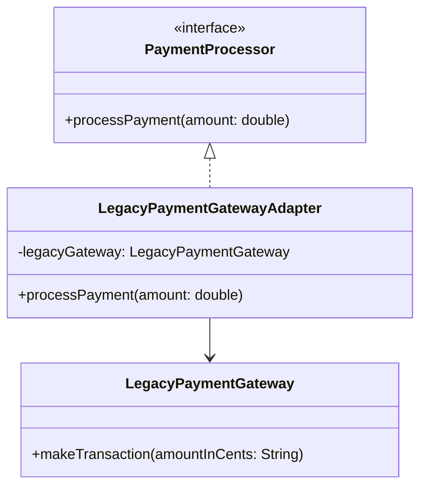

## Welcome to Structural Patterns

Part 3 was about *creating* objects. Part 4 is about **composing objects and classes into larger
structures** — taking pieces that already exist and combining them cleanly, often without changing
their original code at all. Adapter is the simplest of the seven, and a natural starting point.

## Intent

> **Convert the interface of a class into another interface clients expect. Adapter lets classes
> work together that couldn't otherwise because of incompatible interfaces.**

## The Motivating Problem

Your application defines a `PaymentProcessor` interface your checkout code depends on:

```java
interface PaymentProcessor {
    void processPayment(double amount);
}
```

You need to integrate a third-party payment SDK — but you don't own its code, and it wasn't
written to your interface:

```java
class LegacyPaymentGateway {          // third-party code — cannot be modified
    void makeTransaction(String amountInCents) {
        // charges the amount
    }
}
```

The method name is different (`makeTransaction` vs `processPayment`), and even the parameter type
and unit are different (`String` cents vs `double` dollars). Your checkout code can't use
`LegacyPaymentGateway` directly without either rewriting the third-party SDK (you can't — you don't
own it) or littering conversion logic throughout your checkout code (a DRY and SRP violation
waiting to happen).

## The Fix: An Adapter Class

```java
class LegacyPaymentGatewayAdapter implements PaymentProcessor {
    private final LegacyPaymentGateway legacyGateway;

    LegacyPaymentGatewayAdapter(LegacyPaymentGateway legacyGateway) {
        this.legacyGateway = legacyGateway;
    }

    public void processPayment(double amount) {
        String amountInCents = String.valueOf((int) (amount * 100));
        legacyGateway.makeTransaction(amountInCents);
    }
}
```

```java
PaymentProcessor processor = new LegacyPaymentGatewayAdapter(new LegacyPaymentGateway());
processor.processPayment(49.99); // checkout code is completely unaware of the legacy SDK
```

The adapter is the **only** class that knows both interfaces exist — everything else in your
application depends purely on `PaymentProcessor`, exactly as if `LegacyPaymentGateway` had been
written to your contract from the start.



## Two Flavors: Object Adapter vs. Class Adapter

The example above is an **object adapter** — it holds a reference to the adaptee (composition) and
delegates to it. This is the version used almost universally in Java, because Java doesn't support
multiple class inheritance, which the alternative requires.

A **class adapter** would instead use inheritance — extending the adaptee class directly and
implementing the target interface simultaneously:

```java
// Class adapter — only possible if LegacyPaymentGateway isn't final and has no conflicting methods
class LegacyPaymentGatewayClassAdapter extends LegacyPaymentGateway implements PaymentProcessor {
    public void processPayment(double amount) {
        String amountInCents = String.valueOf((int) (amount * 100));
        makeTransaction(amountInCents); // inherited method, called directly
    }
}
```

**Object adapters are strongly preferred in Java** for reasons that should already be familiar from
Chapter 13: composition over inheritance. The object adapter can wrap *any* implementation of
`LegacyPaymentGateway` (including subclasses) supplied at runtime, while the class adapter is
locked to one specific class hierarchy at compile time — and if `LegacyPaymentGateway` happens to
be `final`, a class adapter isn't even possible at all.

## Adapter vs. Decorator vs. Facade — A Preview of the Confusion Ahead

These three structural patterns are the ones most often confused with each other, precisely
because all three "wrap" another object. The distinction, previewed here and covered in full as
each pattern is introduced:

| Pattern | Purpose | Changes the interface? |
|---|---|---|
| **Adapter** (this chapter) | Make an incompatible interface usable | Yes — translates one interface into another |
| **Decorator** (Chapter 24) | Add new behavior to an object | No — keeps the same interface, adds capability |
| **Facade** (Chapter 25) | Simplify a complex subsystem's interface | Yes — but by hiding complexity, not translating |

The single fastest way to distinguish Adapter from the other two in an interview: **Adapter exists
because two interfaces don't match at all** — there's a genuine incompatibility being bridged, not
just a desire to add behavior or simplify a decent existing interface.

## Summary

- Adapter converts one interface into another interface a client already expects, letting
  otherwise-incompatible code work together.
- It's the go-to pattern for integrating third-party libraries or legacy code you can't modify to
  match your own interfaces.
- Prefer object adapters (composition) over class adapters (inheritance) in Java — for the same
  composition-over-inheritance reasons established in Chapter 13.
- Adapter is often confused with Decorator and Facade; the distinguishing signal is a genuine
  interface *incompatibility* being bridged, not merely added behavior or simplified access.

---

## Interview Questions

**1. State the Adapter pattern's intent, and describe the specific real-world scenario that most
commonly calls for it.**
Adapter converts the interface of an existing class into a different interface that client code
expects, allowing classes with otherwise-incompatible interfaces to work together without modifying
either side. The most common real-world trigger is integrating a third-party library, SDK, or
legacy codebase whose interface doesn't match your application's own interfaces, and which you
cannot or should not modify directly.
*Follow-up: Why is "you cannot or should not modify the adaptee directly" an essential part of
the scenario, rather than an incidental detail?* If you *could* freely modify the adaptee's source
code to match your interface directly, there would be no need for Adapter at all — you'd simply
change the adaptee's method signatures; Adapter's entire value proposition specifically addresses
the situation where the adaptee is off-limits (third-party code, a stable legacy system, or a
class from a shared library other teams also depend on), making direct modification impractical or
impossible.

**2. Walk through the `LegacyPaymentGatewayAdapter` example and explain exactly what would break
if the adapter didn't exist and checkout code depended on `LegacyPaymentGateway` directly.**
Without the adapter, every piece of checkout code that needs to process a payment would need to
know about `LegacyPaymentGateway`'s specific method name (`makeTransaction`), its unit convention
(cents as a `String`, not dollars as a `double`), and would need to duplicate the
dollars-to-cents-string conversion logic wherever a payment is triggered — directly violating DRY
(Chapter 12) and tightly coupling checkout code to a third-party SDK's specific quirks (violating
DIP, Chapter 11). If the SDK vendor later changed their method signature, every one of those
scattered call sites would need to be found and updated, rather than a single adapter class.
*Follow-up: If your application later switched payment SDK vendors entirely, how would the
Adapter-based design make that migration easier?* You'd write a new adapter
(`NewVendorPaymentGatewayAdapter`) implementing the same `PaymentProcessor` interface, and swap
which adapter is injected into checkout code — checkout code itself, depending only on
`PaymentProcessor`, would require zero changes, directly demonstrating the DIP/OCP benefits
established in earlier chapters, now applied specifically to third-party integration.

**3. Explain the difference between an object adapter and a class adapter, and why Java favors
the object adapter approach.**
An object adapter holds a reference to the adaptee object as a field and delegates calls to it
(composition), implementing the target interface separately. A class adapter instead extends the
adaptee class directly while also implementing the target interface, relying on inheritance to
gain access to the adaptee's methods. Java favors object adapters because Java doesn't support
multiple inheritance of classes — a class adapter approach breaks down entirely if the adaptee class
is `final`, or if the adapter class already needs to extend some other class for unrelated reasons;
object adapters, relying purely on composition, have neither limitation.
*Follow-up: Are there any advantages a class adapter has over an object adapter that might justify
using it in the rare cases where it's structurally possible?* A class adapter can override the
adaptee's individual methods more granularly (since it inherits and can selectively override
specific behaviors), and avoids the small overhead of an extra layer of delegation through a held
reference — though in practice, given Java's inheritance restrictions and the general composition-
over-inheritance guidance from Chapter 13, these advantages rarely outweigh the object adapter's
flexibility in typical LLD interview contexts.

**4. How would you distinguish Adapter from Decorator if an interviewer showed you a class that
wraps another object and delegates most calls to it, without immediately telling you which
pattern it's meant to represent?**
Check whether the wrapping class implements the *same* interface as the object it wraps
(suggesting Decorator, which adds behavior while preserving the original interface) or a
*different* interface than the wrapped object implements (suggesting Adapter, which exists
specifically to bridge an interface mismatch). If `LegacyPaymentGatewayAdapter` implemented
`LegacyPaymentGateway`'s own interface rather than the different `PaymentProcessor` interface, it
wouldn't be solving an interface-mismatch problem at all, which is the defining characteristic that
separates Adapter from Decorator.
*Follow-up: Is it possible for a single class to legitimately serve as both an Adapter and a
Decorator simultaneously?* This would be unusual and likely a sign of the class taking on two
distinct responsibilities that should be separated (per SRP, Chapter 7) — a cleaner design would
typically use two separate wrapping classes stacked together: an Adapter to first bridge the
interface mismatch, and then a separate Decorator (implementing the now-matching target interface)
layered on top to add additional behavior, keeping each wrapper focused on one clear
responsibility.

**5. Why is it considered good practice for the Adapter class to be the *only* class in the
system that has knowledge of both the target interface and the adaptee's interface?**
Concentrating this dual knowledge in one place means the "translation" logic (unit conversions,
method name mapping, any other bridging logic) exists in exactly one location, satisfying DRY —
if the translation logic needs to change (say, a unit conversion formula is corrected), there's
exactly one class to update. It also means every other class in the system can depend purely on the
clean target interface (`PaymentProcessor`), with zero awareness that a legacy or third-party
system even exists underneath, fully realizing the DIP benefits of programming to an interface
rather than an implementation.
*Follow-up: What would be a warning sign that this "concentrated knowledge" principle was being
violated in a real codebase?* Finding conversion logic or references to
`LegacyPaymentGateway`-specific method names or data formats scattered across multiple classes
outside the dedicated adapter class would be the clearest warning sign — it suggests the adapter's
translation responsibility has leaked outward, undermining the whole point of having a
centralized, single point of integration with the third-party system.

**6. Can the Adapter pattern be used to adapt not just method signatures, but also fundamentally
different data models or protocols? Give an example beyond the payment gateway scenario.**
Yes — a very common real-world example is adapting between different data formats or protocols
entirely, such as an `XmlToJsonAdapter` that implements a `DataFetcher` interface your application
expects (returning JSON-structured data), while internally calling a legacy system that only
returns XML, performing the XML-to-JSON transformation inside the adapter. This is structurally
identical to the payment gateway example — bridging an interface (and underlying data format)
mismatch — just applied to data transformation rather than a single method call's parameter
conversion.
*Follow-up: At what point does an "adapter" doing substantial data transformation start to
resemble a full-fledged data mapping or transformation layer rather than a simple Adapter pattern
instance?* If the transformation logic becomes extensive and complex enough to warrant its own
dedicated design (multiple classes, its own set of business rules about how fields map between
formats), it may be more accurate to say the Adapter *delegates* to a separate, dedicated mapper or
transformer component internally, keeping the Adapter itself focused narrowly on interface
translation while the actual complex data mapping logic lives in its own appropriately-scoped
class, per SRP.

**7. In an LLD interview, if you're asked to design a system that must support multiple
third-party shipping providers (FedEx, UPS, DHL), each with a completely different API, how would
Adapter apply?**
Define a single `ShippingProvider` interface your application depends on (e.g., with methods like
`calculateShippingCost(Package pkg)` and `schedulePickup(Package pkg)`), and write one adapter class
per third-party provider (`FedExAdapter`, `UpsAdapter`, `DhlAdapter`), each implementing
`ShippingProvider` while internally translating calls to that specific provider's actual API and
data formats. Application code depends only on `ShippingProvider`, remaining completely unaware of
which specific carrier or API shape is in use underneath.
*Follow-up: How does this design relate to the Factory Method pattern from Chapter 17, given that
you'll likely need to select the correct adapter based on the customer's chosen shipping
provider?* You'd combine the two patterns directly — a `ShippingProviderFactory` (Factory Method)
would take a provider identifier (like a string or enum) and return the correct concrete
`ShippingProvider` adapter implementation, exactly mirroring the `VehicleFactory` structure from
Chapter 17, just with each concrete implementation happening to also be an Adapter around a
specific third-party API rather than a simple domain class.

**8. Does the Adapter pattern violate the Open/Closed Principle if adding support for a new
third-party system requires writing an entirely new adapter class each time?**
No — this is actually a textbook example of OCP being correctly satisfied, not violated. Adding
support for a new payment gateway or shipping provider means writing one new adapter class
implementing the existing target interface, with zero modification to any existing code (the
target interface itself, the application code depending on it, or any other existing adapter) —
exactly the "open for extension, closed for modification" outcome OCP calls for.
*Follow-up: What would an actual OCP violation look like in an Adapter-based design, if one were
introduced by mistake?* If application code contained a conditional
(`if (providerType.equals("FEDEX")) { ... } else if (providerType.equals("UPS")) { ... }`) directly
selecting and calling different adapters' methods inline, rather than depending uniformly on the
shared `ShippingProvider` interface and using a factory to select the right implementation, that
would reintroduce exactly the kind of OCP violation Chapter 8 covered — the presence of
well-designed adapters alone doesn't guarantee OCP compliance if the code consuming them still
branches on type.

**9. How would unit testing a class that depends on an Adapter differ from unit testing the
Adapter itself?**
A class depending on the target interface (like checkout code depending on `PaymentProcessor`) can
be unit tested by injecting a simple fake or mock `PaymentProcessor` implementation, entirely
independent of whether a real adapter or third-party system exists at all — this is the standard
DIP-driven testability benefit from Chapter 11. Testing the Adapter itself, however, specifically
needs to verify the *translation logic* is correct — for example, asserting that calling
`adapter.processPayment(49.99)` results in `legacyGateway.makeTransaction("4999")` being called
with the correctly converted value, which typically requires either a real (test/sandbox) instance
of the adaptee or a mock of the adaptee to verify the correct translated call was made.
*Follow-up: Would you consider a test of the Adapter class itself a "unit test" or more of an
"integration test," given it necessarily involves interaction with the (possibly mocked) adaptee?*
If the adaptee is mocked (verifying the adapter calls the mock correctly with translated
arguments), it's still reasonably classified as a unit test of the adapter's own translation logic
in isolation. If the test instead uses a real instance of the third-party adaptee (even a sandbox/
test environment version), it would more accurately be considered an integration test, since it's
verifying actual interaction with genuine external system behavior, not just the adapter's internal
logic in isolation.

**10. Could you use the Adapter pattern to make a class satisfy an interface it doesn't
naturally implement, purely for the purpose of passing it into a generic algorithm expecting that
interface — even without any "vendor" or "legacy system" involved?**
Yes — this is a legitimate and common use of Adapter beyond third-party integration specifically.
For example, if you have a `LinkedListNode`-based custom data structure and need to pass it into a
generic algorithm that expects Java's `Iterable<T>` interface, you could write an
`IterableAdapter` implementing `Iterable<T>` that wraps your custom node structure and implements
the required `iterator()` method by walking your custom structure — bridging your own custom type
to a standard library interface it wasn't originally written to satisfy.
*Follow-up: Is this specific scenario (adapting your own custom data structure to a standard Java
interface) more accurately described as Adapter, or does it start to resemble something else,
like simply "implementing an interface"?* If you can freely modify the original
`LinkedListNode`-based class's source code, directly implementing `Iterable<T>` on it would
usually be simpler and more idiomatic than introducing a separate adapter class — Adapter's
specific value emerges when you *cannot* or deliberately choose not to modify the original class
(perhaps it's shared and used elsewhere in ways that shouldn't be disturbed), which is the same
"don't or can't modify the source" condition that justifies Adapter in the third-party integration
scenario.

**11. What's a potential downside or cost of using the Adapter pattern extensively throughout a
large system?**
Each adapter introduces an additional layer of indirection and a small amount of runtime overhead
(an extra method call and any translation logic per operation) — in a system with many nested or
chained adapters, this can make debugging more difficult, since a stack trace passes through
multiple translation layers before reaching the actual underlying implementation, potentially
obscuring where a problem originates. Additionally, if translation logic between two very different
interfaces or data models is complex, the adapter itself can become a hidden source of subtle bugs
if the translation isn't perfectly faithful to both sides' semantics.
*Follow-up: How would you mitigate the debugging-difficulty downside in a real production
system using many adapters?* Comprehensive, adapter-specific unit tests (verifying translation
correctness in isolation, as discussed in Question 9) reduce the likelihood of translation bugs
reaching production in the first place, and clear, descriptive naming and logging within adapter
classes (rather than silent pass-through delegation) can help make it clear, during debugging, which
adapter layer a given call is passing through and what transformation it's applying at each step.

**12. In the shipping provider example, if `FedExAdapter`, `UpsAdapter`, and `DhlAdapter` all
share some common translation logic (like converting your application's internal `Package` object
into a generic "shipping label" data structure before each provider-specific final translation
step), how would you avoid duplicating that shared logic across all three adapters?**
Extract the shared translation logic into a separate helper class or a shared abstract base class
that all three adapters use (via composition) or extend, applying the same DRY reasoning from
Chapter 12 — for example, a `PackageToShippingLabelConverter` utility class that each adapter calls
before performing its own provider-specific final formatting step, avoiding three separate,
near-identical implementations of the same core conversion logic.
*Follow-up: Would you use inheritance (a shared `AbstractShippingAdapter` base class) or
composition (a shared, separately-injected converter utility) to share this logic, and why?*
Following the composition-over-inheritance guidance from Chapter 13, a shared, separately-injected
utility class is generally the safer, more flexible choice — it avoids creating an inheritance
hierarchy among the three adapters purely to share one piece of conversion logic, and keeps each
adapter free to independently vary in any other way without being constrained by a shared parent
class's structure.

**13. Is the Adapter pattern applicable only to entire classes, or can it be applied to
individual methods or narrower pieces of functionality too?**
While Adapter is most commonly discussed and applied at the class level (wrapping an entire
class's interface), the underlying idea — translating one contract into another expected contract —
can be applied more narrowly, such as adapting a single method's signature via a small wrapper
function or a functional interface adapter (e.g., wrapping a method that takes a checked exception
into a `Runnable`-compatible lambda that catches and rethrows it as unchecked, to satisfy a
functional interface that doesn't declare checked exceptions). The core pattern scales down to
smaller granularities of interface mismatch, not just whole-class integration scenarios.
*Follow-up: Give a concrete example of this narrower, method-level or functional-interface-level
adaptation in modern Java.* Wrapping a method reference that throws a checked
`IOException` so it can be used as a `java.util.function.Supplier<T>` (which doesn't permit checked
exceptions in its functional method signature) — a small adapter lambda or wrapper method catches
the checked exception internally and rethrows it wrapped in an unchecked `RuntimeException`,
allowing the originally-incompatible method to be used wherever a plain `Supplier<T>` is expected,
which is a common, practical Java 8+ idiom that mirrors Adapter's core intent at a much smaller
scale than a full class-level integration.

**14. If an interviewer asks you to design a system that needs to support reading configuration
from three different sources — environment variables, a JSON file, and a remote configuration
service — each with a completely different native access pattern, how would you apply the
Adapter pattern here, and how does this connect back to the Dependency Inversion Principle from
Chapter 11?**
Define a single `ConfigurationSource` interface (e.g., with a `String getValue(String key)`
method) that application code depends on, and write three adapters
(`EnvironmentVariableConfigAdapter`, `JsonFileConfigAdapter`, `RemoteConfigServiceAdapter`), each
implementing `ConfigurationSource` while internally handling their source's specific native access
pattern (reading `System.getenv()`, parsing a JSON file, or making an HTTP call to a remote
service, respectively). This is a direct, concrete application of DIP — application code depends
only on the `ConfigurationSource` abstraction, with each adapter serving as the "detail" that
depends on and implements that abstraction, exactly matching the high-level/low-level relationship
structure established in Chapter 11, here specifically realized through the Adapter pattern's
translation mechanism.
*Follow-up: How would you design the system to support checking multiple configuration sources in
a specific priority order (e.g., environment variables override the JSON file, which overrides the
remote service's defaults)?* You could introduce a `CompositeConfigurationSource` that itself
implements `ConfigurationSource` and internally holds an ordered list of other
`ConfigurationSource` instances (the three adapters), checking each in priority order and
returning the first non-null value found — this is a direct application of the Composite pattern
(covered in Chapter 23), demonstrating how Adapter and Composite naturally combine when multiple
adapted sources need to be treated uniformly as a single, prioritized configuration source.
