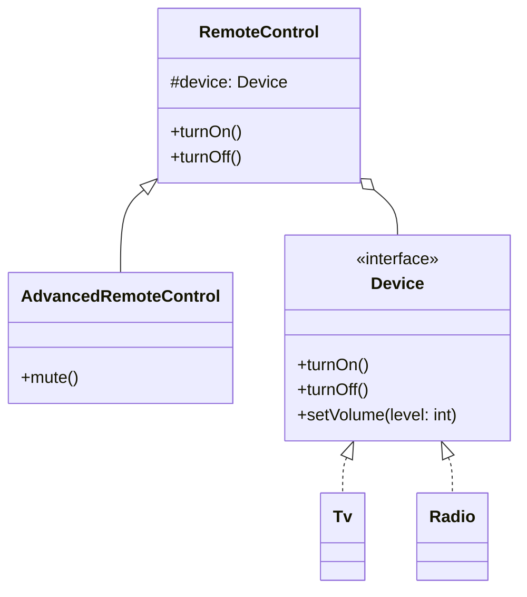

## Intent

> **Decouple an abstraction from its implementation so that the two can vary independently.**

Bridge is the formal, named solution to the exact combinatorial explosion problem introduced in
Chapter 13 with the `Car`/`Engine`/`Transmission` example — this chapter gives it a name, a
canonical structure, and shows precisely when it earns its place over simpler alternatives.

## The Motivating Problem: Two Independent Dimensions

Imagine designing remote controls for different kinds of devices — TVs and Radios — where each
device also needs both a "Basic" and "Advanced" remote variant.

```java
class BasicTvRemote { void turnOn() { /* TV-specific on logic */ } }
class AdvancedTvRemote { void turnOn() { /* ... */ } void mute() { /* ... */ } }
class BasicRadioRemote { void turnOn() { /* Radio-specific on logic */ } }
class AdvancedRadioRemote { void turnOn() { /* ... */ } void mute() { /* ... */ } }
```

Two independent dimensions — **remote type** (Basic, Advanced) and **device type** (TV, Radio) —
are being modeled with inheritance, and the class count multiplies: 2 remote types × 2 device
types = 4 classes already, and adding a third device (`SoundSystem`) or a third remote tier
(`Premium`) multiplies the count further. This is precisely the combinatorial explosion from
Chapter 13.

## The Fix: Split Into Two Independent Hierarchies, Connected by a Bridge

```java
// The "Implementation" hierarchy — device-specific operations
interface Device {
    void turnOn();
    void turnOff();
    void setVolume(int level);
}

class Tv implements Device {
    public void turnOn() { /* TV-specific */ }
    public void turnOff() { /* TV-specific */ }
    public void setVolume(int level) { /* TV-specific */ }
}

class Radio implements Device {
    public void turnOn() { /* Radio-specific */ }
    public void turnOff() { /* Radio-specific */ }
    public void setVolume(int level) { /* Radio-specific */ }
}
```

```java
// The "Abstraction" hierarchy — remote control tiers, delegating to a Device
class RemoteControl {
    protected final Device device; // the "bridge" — held by reference, not inherited

    RemoteControl(Device device) {
        this.device = device;
    }

    void turnOn() { device.turnOn(); }
    void turnOff() { device.turnOff(); }
}

class AdvancedRemoteControl extends RemoteControl {
    AdvancedRemoteControl(Device device) { super(device); }

    void mute() { device.setVolume(0); }
}
```

```java
RemoteControl basicTvRemote = new RemoteControl(new Tv());
AdvancedRemoteControl advancedRadioRemote = new AdvancedRemoteControl(new Radio());
```

Now there are **2 device classes + 2 remote classes = 4 classes total**, and every combination
(basic-TV, advanced-TV, basic-radio, advanced-radio) is achievable by pairing any `RemoteControl`
subtype with any `Device` implementation — adding a `SoundSystem` device means writing **one** new
class, not four.



The "bridge" is literally the `device` field — the connection between the two independently-varying
hierarchies (`RemoteControl`'s tiers, and `Device`'s types).

## Bridge vs. the Chapter 13 `Car`/`Engine` Example: Same Idea, Now Named

If this feels identical to something you've already seen, that's intentional — the
`Engine`/`Transmission` composition example in Chapter 13 **was** the Bridge pattern, just
introduced there without the formal name, to establish the underlying reasoning before attaching
vocabulary to it. Bridge is what you get when you deliberately apply "favor composition over
inheritance" specifically to **two independently-varying dimensions** of a design.

## Bridge vs. Strategy: A Common Point of Confusion

Both patterns hold a reference to another object and delegate behavior to it — the distinction is
about *what's varying and why*:

| | Bridge | Strategy (Chapter 28) |
|---|---|---|
| **Number of varying dimensions** | Two (or more), independently | One |
| **Intent** | Prevent combinatorial class explosion across multiple axes | Swap one interchangeable algorithm/behavior |
| **Structural shape** | Two parallel hierarchies connected by composition | One hierarchy (context) + one interchangeable interface |

In practice, the two patterns look nearly identical in code — a class holding an interface
reference and delegating to it. **The distinguishing question is "how many independent things are
varying here?"** One → Strategy. Two or more, each capable of varying without the other → Bridge.

## When Bridge Is Overkill

If a design genuinely has only **one** dimension of variation (say, only device type varies, and
there's only ever one kind of remote), introducing the full two-hierarchy Bridge structure is
unwarranted complexity — a single `Device` interface with a `RemoteControl` class depending on it
directly (no separate `AdvancedRemoteControl` subtype) is simpler and sufficient. **Reach for
Bridge specifically when a problem statement signals two or more genuinely independent axes of
variation, not just one.**

## Summary

- Bridge decouples an abstraction (like remote control tiers) from its implementation (like device
  types) so both can vary independently, without multiplying class counts combinatorially.
- It's the named, formalized version of the composition-over-inheritance reasoning introduced in
  Chapter 13, applied specifically to two or more independent axes of variation.
- The "bridge" is the held reference (composition) connecting the two otherwise-independent class
  hierarchies.
- Distinguish Bridge from Strategy by counting the number of independently-varying dimensions:
  Strategy handles one; Bridge handles two or more.

---

## Interview Questions

**1. State the Bridge pattern's intent, and explain what "abstraction" and "implementation" mean
in this specific context, as opposed to their everyday OOP meanings.**
Bridge decouples an abstraction from its implementation so the two can vary independently, avoiding
a combinatorial explosion of subclasses when two or more dimensions of variation exist together. In
this pattern's specific vocabulary, "abstraction" refers to the higher-level control hierarchy
(like `RemoteControl` and its tiers) that clients interact with, and "implementation" refers to the
lower-level hierarchy that actually performs the concrete work (like `Device` and its types) — this
is a more specific, pattern-specific usage than the general OOP sense of "abstraction" (an interface
or abstract class) used throughout earlier chapters, though it's built on the same underlying
concept.
*Follow-up: Is it a coincidence that the pattern's "abstraction" side (`RemoteControl`) happens to
hold a reference to the "implementation" side (`Device`), mirroring the Dependency Inversion
Principle's structure from Chapter 11?* Not entirely a coincidence — Bridge is fundamentally about
one hierarchy depending on an abstraction (the `Device` interface) representing the other hierarchy,
which does share DIP's core "depend on abstractions, not concretions" spirit, though Bridge's
specific focus is on enabling two *hierarchies* to vary independently, a more specialized structural
concern than DIP's general dependency-direction guidance.

**2. Walk through the remote control example and explain precisely how many classes are needed
under the inheritance-based approach versus the Bridge-based approach as more device types and
remote tiers are added.**
Under the inheritance-based approach, every new device type or new remote tier multiplies the total
class count — with 2 device types and 2 remote tiers, that's already 4 classes
(`BasicTvRemote`, `AdvancedTvRemote`, `BasicRadioRemote`, `AdvancedRadioRemote`); adding a third
device type would require 6 classes, and adding a third remote tier on top of that would require 9.
Under the Bridge-based approach, class count grows additively: 2 device classes + 2 remote classes
= 4 total, and adding a third device type means just 1 new `Device` implementation (bringing the
total to 5), while every existing remote tier can immediately be paired with it with zero new
classes needed for that combination.
*Follow-up: At what specific number of device types and remote tiers does the inheritance
approach's class count first exceed the Bridge approach's class count, given this example?*
With `d` device types and `r` remote tiers, inheritance requires `d × r` classes while Bridge
requires `d + r` classes; for `d=2, r=2`, inheritance needs 4 and Bridge needs 4 (equal) — but the
moment either dimension grows to 3 (e.g., `d=3, r=2`), inheritance needs 6 while Bridge needs only
5, and the gap widens rapidly and multiplicatively as either dimension continues to grow.

**3. Explain the relationship between the Bridge pattern and the `Car`/`Engine`/`Transmission`
composition example from Chapter 13.**
The Chapter 13 example — a `Car` holding `Engine` and `Transmission` references instead of using
inheritance for each engine/transmission combination — is structurally identical to the Bridge
pattern; it simply wasn't given the formal GoF name at the time, since Chapter 13's purpose was
establishing the underlying composition-over-inheritance reasoning before attaching pattern
vocabulary to it. Bridge is what results when you deliberately and consciously apply that same
reasoning specifically to prevent combinatorial explosion across two or more independently-varying
dimensions.
*Follow-up: Does this mean every instance of "favoring composition over inheritance" from Chapter
13 is technically an instance of the Bridge pattern?* Not necessarily — Bridge specifically applies
when there are two (or more) genuinely independent *hierarchies* or dimensions of variation being
decoupled from each other; a simpler case of composition over inheritance involving only one
varying dimension (like the single `PaymentMethod` interface example from Chapter 2) is better
described as an instance of the Strategy pattern (Chapter 28) rather than Bridge, since Strategy
specifically addresses the single-dimension case.

**4. How do you distinguish, when reviewing a design, whether a class holding a reference to
another interface and delegating to it represents Bridge or Strategy?**
Count the number of independently-varying dimensions actually present in the design. If there's
only one dimension varying (like which payment method to use, with no second independent axis of
variation), it's Strategy. If there are two or more genuinely independent dimensions that can each
vary without affecting the other (like remote tier and device type, or engine type and transmission
type), and the design uses composition specifically to prevent those dimensions from multiplying
combinatorially through inheritance, it's Bridge.
*Follow-up: Could a design legitimately combine both patterns — using Bridge to decouple two
major dimensions, while one of those dimensions is itself further varied using Strategy?* Yes —
for example, `RemoteControl` (the abstraction side of a Bridge) could itself use a separate
`Strategy`-style `InputMethod` interface internally (voice control vs. button-press control) to vary
how user input is captured, entirely independent of and layered on top of the Bridge relationship
between `RemoteControl` and `Device` — the two patterns address different concerns and can coexist
within the same overall design without conflict.

**5. Is the Bridge pattern applicable only when there are exactly two independent dimensions
(like remote tier and device type), or can it extend to three or more?**
The core idea generalizes to any number of independent dimensions, though the classic GoF
description and most textbook examples focus on exactly two for clarity. With three independent
dimensions (say, remote tier, device type, and a "region" setting affecting broadcast standards),
you'd typically compose multiple bridges — perhaps `RemoteControl` bridges to `Device`, and
`Device` itself further bridges to a `RegionalBroadcastStandard` interface — layering multiple
two-way bridge relationships rather than trying to construct one single three-way bridge structure,
since each individual bridge relationship is inherently a pairwise decoupling between one
abstraction and one implementation hierarchy.
*Follow-up: Would layering multiple bridge relationships like this risk becoming overly complex
for a typical LLD interview problem?* Yes — for most interview-scale problems, encountering
genuinely three or more independent dimensions needing full Bridge-style decoupling would be
unusual and worth explicitly flagging as added complexity; in most realistic interview scenarios,
two dimensions (as in the canonical remote control or `Car`/`Engine` examples) is the practical
ceiling worth fully designing for without the interviewer specifically signaling a need for more.

**6. Explain why introducing the Bridge pattern for a problem with only one genuinely varying
dimension would be considered over-engineering.**
If only device type varies (with no need for different remote control tiers at all — just one
`RemoteControl` class), introducing a separate `RemoteControl` abstraction hierarchy purely for
structural symmetry with the `Device` hierarchy adds an unnecessary extra class and a layer of
indirection with no corresponding benefit, since there's no second dimension of variation that Bridge's
structure is actually needed to decouple from the first. This directly violates KISS/YAGNI
(Chapter 12) — a single `RemoteControl` class depending directly on the `Device` interface would be
simpler and equally correct.
*Follow-up: How would you recognize, mid-interview, that you've begun over-applying Bridge to a
single-dimension problem?* If you notice you're creating a class hierarchy on the "abstraction"
side (multiple `RemoteControl` subtypes) purely to mirror the "implementation" side's structure,
without any actual distinct behavior or requirement driving that hierarchy's existence, that's a
signal you may be forcing Bridge's two-hierarchy structure onto a problem that only genuinely has
one varying dimension.

**7. How does the Bridge pattern relate to the Adapter pattern covered in Chapter 21? Are they
ever confused with each other, and if so, how do you tell them apart?**
Both patterns involve one class holding a reference to another and delegating to it, which can
cause superficial confusion, but their *intents* are fundamentally different: Adapter exists to
bridge a genuine interface *incompatibility* between two pre-existing, otherwise-unrelated
interfaces (translation), while Bridge exists to deliberately *design* two hierarchies to vary
independently from the start, preventing a future combinatorial explosion (structural planning,
not translation). Adapter is typically applied retroactively to integrate existing, incompatible
code; Bridge is typically applied proactively, at design time, when you anticipate multiple
independent axes of variation.
*Follow-up: Could Bridge and Adapter be combined in the same design — for example, if one side of
a Bridge relationship needed to integrate with a third-party `Device`-like class that doesn't match
your `Device` interface?* Yes — you could write a `ThirdPartyDeviceAdapter` implementing your
`Device` interface (Adapter, solving the interface-mismatch problem) and then use that adapter as
one of the concrete `Device` implementations plugged into the Bridge relationship with
`RemoteControl` — the two patterns compose cleanly, addressing entirely different concerns
(interface translation vs. independent-dimension decoupling) within the same overall design.

**8. Why is the `device` field in `RemoteControl` declared as the `Device` interface type rather
than a specific concrete class like `Tv`, and how does this connect to the Dependency Inversion
Principle?**
Declaring the field as the `Device` interface type, rather than a concrete class, is precisely what
allows `RemoteControl` (and its subtypes) to work with *any* `Device` implementation supplied at
construction time — a `Tv`, a `Radio`, or any future device type — without `RemoteControl`'s own
code ever needing to change. This is a direct, textbook application of DIP (Chapter 11): the
higher-level `RemoteControl` abstraction depends on the `Device` abstraction, not on any specific
low-level concrete device implementation, which is exactly what makes the "vary independently"
half of Bridge's intent achievable in the first place.
*Follow-up: If `RemoteControl`'s field were instead typed as the concrete `Tv` class, what
specific capability would be lost?* `RemoteControl` would become permanently locked to working
only with `Tv` objects — passing a `Radio` instance would fail to compile entirely, eliminating the
ability to reuse the same `RemoteControl` (and `AdvancedRemoteControl`) classes across different
device types, which defeats the entire purpose of the Bridge pattern; this concrete-type coupling
is precisely the kind of DIP violation Chapter 11 warned against, here directly preventing Bridge's
core benefit from being realized at all.

**9. How would you extend the remote control example to add a `PremiumRemoteControl` tier that
supports voice commands, without modifying the existing `Device` interface or any existing
`Device` implementations?**
Add a new `PremiumRemoteControl` class extending `RemoteControl` (or `AdvancedRemoteControl`, if
Premium should include Advanced's capabilities too), adding a new method like
`processVoiceCommand(String command)` that internally translates recognized commands into calls on
the existing `device` field's methods (`device.turnOn()`, `device.setVolume(level)`, etc.). Since
`Device` and its implementations are entirely unaware of and unaffected by how many or which remote
control tiers exist above them, no changes to the `Device` hierarchy are needed at all — this is the
Bridge pattern's "abstraction hierarchy can be extended independently of the implementation
hierarchy" property in direct action.
*Follow-up: Could you similarly add a new `SmartSpeaker` device type without modifying any
existing `RemoteControl` classes, demonstrating the reverse independence?* Yes — writing a new
`SmartSpeaker implements Device` class requires no changes to `RemoteControl`,
`AdvancedRemoteControl`, or any other existing abstraction-side class; any of them can immediately
be constructed with a `SmartSpeaker` instance and work correctly, since they only ever depend on
the `Device` interface's contract, never on any specific concrete device type — confirming Bridge's
promised bidirectional independence between the two hierarchies.

**10. In an LLD interview, if you're designing a cross-platform notification system that needs to
support multiple notification *types* (Alert, Reminder, Promotional) and multiple delivery
*channels* (Email, SMS, Push), each varying independently, how would Bridge apply?**
Model notification type (Alert, Reminder, Promotional) as the abstraction hierarchy — perhaps a
`Notification` base class or interface with type-specific subclasses handling type-specific content
formatting or urgency logic — and model delivery channel (Email, SMS, Push) as the implementation
hierarchy, with a `DeliveryChannel` interface and one implementation per channel. Each
`Notification` type would hold a `DeliveryChannel` reference (the bridge), allowing any notification
type to be sent through any delivery channel without needing a dedicated class for every
type-channel combination (avoiding `AlertEmailNotification`, `AlertSmsNotification`,
`ReminderEmailNotification`, and so on, multiplying combinatorially).
*Follow-up: How is this notification example different from, or similar to, the
`NotificationChannel`/Strategy-based design shown back in Chapter 1 and Chapter 8?* The earlier
`NotificationService` examples in Chapters 1 and 8 only had *one* varying dimension — which channel
to send through — making Strategy the correct, sufficient pattern there. This new scenario
introduces a *second* independent dimension (notification type, with its own type-specific
behavior beyond just "which channel"), which is precisely the additional complexity that upgrades
the appropriate pattern choice from Strategy to Bridge — a good illustration of how the same
domain (notifications) can call for different patterns depending on how many independent axes of
variation the actual requirements introduce.

**11. Can the "implementation" side of a Bridge pattern have its own further-varying internal
behavior, without breaking the Bridge relationship — for example, could `Tv.setVolume()` itself
use a Strategy pattern internally to support different volume-curve algorithms (linear vs.
logarithmic)?**
Yes, and this causes no conflict at all — the Bridge relationship only concerns how
`RemoteControl` (abstraction) and `Device` (implementation) relate to and depend on each other;
what happens *inside* a specific `Device` implementation's own methods is an entirely separate,
independent design concern. `Tv` could freely use a `VolumeCurveStrategy` interface internally to
vary its own volume-adjustment algorithm, and this would be completely invisible to and unaffected
by `RemoteControl`, which only ever calls the public `setVolume(int level)` method on whatever
`Device` it holds.
*Follow-up: Does this illustrate a more general principle about how design patterns compose
within a single, larger system?* Yes — this illustrates that patterns are typically applied at
specific, local points in a design to solve specific, local structural problems, and different
parts of the same overall system can independently apply different, unrelated patterns to their
own internal concerns without those choices needing to be coordinated or even visible to each
other; a well-designed system often contains many small, locally-appropriate pattern applications
rather than one single overarching pattern governing the entire system's structure.

**12. How would you unit test the Bridge-based remote control design, and does testing
`RemoteControl` require a real `Tv` or `Radio` object?**
No — since `RemoteControl` depends only on the `Device` interface, a unit test for
`RemoteControl.turnOn()` can inject a simple fake or mock `Device` implementation and verify that
calling `remoteControl.turnOn()` correctly results in `device.turnOn()` being called, entirely
independent of any real `Tv` or `Radio` hardware-simulation logic — this is the same DIP-driven
testability benefit discussed throughout this series, here specifically enabled by the Bridge
pattern's reliance on the `Device` abstraction rather than concrete device classes.
*Follow-up: Would you test `AdvancedRemoteControl.mute()` any differently, given that it calls
`device.setVolume(0)` rather than a more directly-named `device.mute()` method?* The test would
specifically assert that calling `advancedRemoteControl.mute()` results in the mock `Device`
receiving a `setVolume(0)` call with exactly that argument — this is actually a valuable test to
have, since it explicitly documents and verifies the specific implementation detail that "mute" is
implemented in terms of "set volume to zero" rather than a dedicated device-level mute operation,
which could be a meaningful design decision worth having explicit test coverage for.

**13. If a new requirement emerged requiring `Device` implementations to also report their
current power state back to any `RemoteControl` (e.g., for a remote to display "TV is currently
off" before attempting `turnOn()`), how would you extend the design without breaking the Bridge
relationship?**
Add a new method, such as `boolean isOn()`, to the `Device` interface, and implement it in every
existing concrete device class (`Tv`, `Radio`) — this is a genuine modification touching an
existing interface and all its implementations (similar to the Abstract Factory "new family
member" trade-off discussed in Chapter 18), but it doesn't break or fundamentally alter the Bridge
relationship itself; `RemoteControl` and its subtypes can then call `device.isOn()` as needed,
continuing to depend only on the `Device` interface abstraction, with the bridge structure fully
intact.
*Follow-up: Does this specific kind of change (adding a new method to the "implementation" side's
interface) represent a different category of extensibility cost than adding a new device type or a
new remote tier?* Yes — this mirrors the same asymmetry discussed for Abstract Factory: adding a
new *implementation* (a new `Device` type, or a new `RemoteControl` tier) is cheap and doesn't
touch existing code, satisfying OCP fully; adding a new *method* to either shared interface
(`Device` or the abstraction's own contract) requires modifying every existing implementation of
that interface, which is a real, unavoidable cost inherent to interface-based designs generally,
not specific to Bridge, but worth being aware of and explicitly naming if an interviewer probes
this specific kind of extension.

**14. How would you decide, given a fresh LLD problem statement you haven't seen before, whether
it calls for Bridge specifically, as opposed to Strategy, Adapter, or simply a plain interface
with no additional pattern structure at all?**
Work through the questions established across this and the previous chapters in sequence: first,
is there a genuine interface incompatibility between two pre-existing things that needs bridging
(Adapter)? If not, is there exactly one dimension of behavior that needs to vary independently of
the code using it (Strategy)? If instead there are two or more genuinely independent dimensions of
variation that would otherwise multiply combinatorially through inheritance (Bridge), that's the
signal to reach for Bridge specifically. If none of these conditions clearly apply — if there's
just one straightforward behavior with no real variability signaled by the problem at all — a plain
class or interface with no additional pattern structure is the simplest, correct, YAGNI-respecting
choice.
*Follow-up: Is it acceptable, in an interview, to explicitly walk through this decision process
out loud, rather than silently arriving at "I'll use Bridge here" without explanation?* Yes, and
it's generally a strong signal to do so — explicitly narrating "I see two independent things
varying here: the remote's feature tier and the device type, so rather than creating a class for
every combination, I'll decouple them with composition, which is essentially the Bridge pattern"
demonstrates the underlying reasoning process interviewers are most interested in, rather than just
the ability to recall and apply a memorized pattern name.
