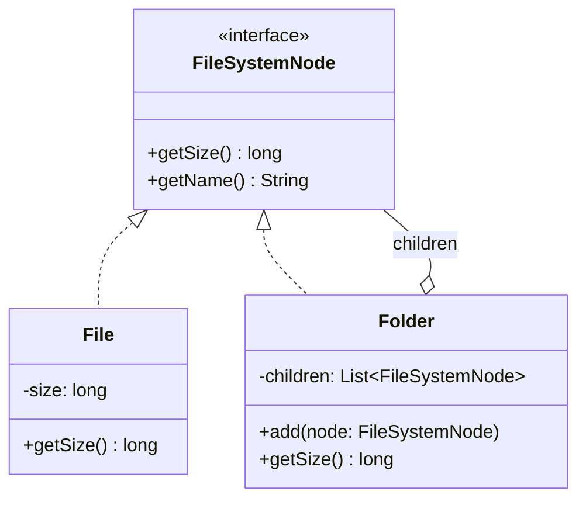

## Intent

> **Compose objects into tree structures to represent part-whole hierarchies. Composite lets
> clients treat individual objects and compositions of objects uniformly.**

Composite solves a problem that shows up constantly in real systems: **a tree of things, where some
nodes are "leaves" (individual items) and others are "branches" (groups containing more items),
and calling code shouldn't have to care which kind it's dealing with.**

## The Motivating Problem: File Systems

A file system contains files and folders. A folder can contain both files and more folders — a
recursive, tree-shaped structure.

```java
class File {
    private String name;
    private long size;

    long getSize() { return size; }
}

class Folder {
    private String name;
    private List<File> files = new ArrayList<>();
    private List<Folder> subfolders = new ArrayList<>();

    long getSize() {
        long total = 0;
        for (File file : files) total += file.getSize();
        for (Folder folder : subfolders) total += folder.getSize(); // recursive
        return total;
    }
}
```

This works, but notice `Folder` needs **two separate lists** and two separate loops, and any code
that wants to process "everything in this folder" has to handle files and subfolders as distinct
cases everywhere. Every new operation (searching, counting, printing) has to repeat this
files-vs-folders branching.

## The Fix: A Shared Interface for Leaves and Composites

```java
interface FileSystemNode {
    long getSize();
    String getName();
}

class File implements FileSystemNode {
    private final String name;
    private final long size;

    File(String name, long size) { this.name = name; this.size = size; }

    public long getSize() { return size; }
    public String getName() { return name; }
}

class Folder implements FileSystemNode {
    private final String name;
    private final List<FileSystemNode> children = new ArrayList<>(); // one list, any node type

    Folder(String name) { this.name = name; }

    void add(FileSystemNode node) { children.add(node); }

    public long getSize() {
        long total = 0;
        for (FileSystemNode child : children) {
            total += child.getSize(); // works for File or Folder — no type-checking needed
        }
        return total;
    }

    public String getName() { return name; }
}
```

```java
Folder root = new Folder("root");
root.add(new File("readme.txt", 100));

Folder src = new Folder("src");
src.add(new File("Main.java", 500));
root.add(src); // a Folder can contain another Folder — the recursive structure

System.out.println(root.getSize()); // 600 — correctly sums across the entire tree
```

`Folder.getSize()` calls `child.getSize()` on every child **without knowing or caring** whether
that child is a `File` (a leaf) or another `Folder` (a composite containing more children). This is
the entire point of the pattern: **uniform treatment of leaves and composites through one shared
interface.**



Note the self-referencing relationship: `Folder` *contains* `FileSystemNode`s, and `Folder` *is
itself* a `FileSystemNode` — this is what makes the recursive tree structure possible.

## Where Composite Naturally Recurs in This Series

This exact shape reappears in several later chapters once you know to look for it:

- **The `DiscountPolicy` composite** previewed in Chapter 8's interview questions — a
  `CompositeDiscount` combining several individual discounts, treated as one `DiscountPolicy`.
- **An organization chart** (an `Employee` who "is" both a leaf, with no reports, and a composite,
  with a team reporting to them).
- **A UI component tree** (a `Panel` containing `Button`s and other `Panel`s).
- **Menu/category systems** in an e-commerce case study (Chapter 57), where a category can contain
  both products and subcategories.

Recognizing "this is a tree where branches and leaves need to be processed the same way" is the
trigger for reaching for Composite specifically.

## The Interface Design Trade-off: Uniform vs. Safe

There's a genuine design tension worth stating explicitly. Should `FileSystemNode` also declare
`add(FileSystemNode node)`, so *both* `File` and `Folder` share the fully identical interface?

```java
interface FileSystemNode {
    long getSize();
    void add(FileSystemNode node); // should a File be forced to implement this?
}

class File implements FileSystemNode {
    public void add(FileSystemNode node) {
        throw new UnsupportedOperationException("Cannot add to a file"); // familiar problem?
    }
}
```

This should immediately trigger recognition: it's the same **Liskov Substitution Principle /
Interface Segregation Principle** violation from Chapters 9 and 10 — `File` is forced to implement
a method it can never honestly support. The two legitimate resolutions:

1. **Keep `add()` off the shared interface entirely** (as shown in the main example) — client code
   that specifically needs to add children must work with the concrete `Folder` type for that
   operation. This is LSP/ISP-safe but slightly less "uniform."
2. **Accept the LSP violation deliberately**, if the calling code's convenience of *always* being
   able to call `add()` (even if it throws for leaves) is judged worth the trade-off — the GoF book
   itself acknowledges this exact tension and leaves the choice to the implementer.

**In an LLD interview, option 1 is the safer default answer** — it's consistent with the LSP/ISP
discipline established throughout Part 2, and you can mention option 2 as an acknowledged
alternative with its own trade-off, demonstrating awareness of the tension rather than picking one
side blindly.

## Summary

- Composite lets client code treat individual objects (leaves) and groups of objects (composites)
  through one uniform interface, without branching on which kind it's handling.
- The classic shape: a shared interface, a leaf implementation with no children, and a composite
  implementation holding a collection of that same shared interface type — enabling recursive tree
  structures.
- Recognize the pattern whenever a problem describes a tree where "the same operation" (size,
  count, render, calculate) needs to apply uniformly across both individual items and groups.
- Watch for the LSP/ISP tension around structural-only methods like `add()` — decide deliberately
  whether to keep them off the shared interface (safer) or accept the trade-off for full
  uniformity.

---

## Interview Questions

**1. State the Composite pattern's intent, and explain what "uniform treatment" of leaves and
composites actually means in practice.**
Composite composes objects into tree structures representing part-whole hierarchies, and lets
client code treat individual objects (leaves, like a single `File`) and compositions of objects
(composites, like a `Folder` containing other nodes) through the same shared interface, without
needing to check or branch on which kind it's dealing with. "Uniform treatment" in practice means
calling code like `Folder.getSize()` can call `child.getSize()` on every child in its collection
without any `if (child instanceof File) ... else if (child instanceof Folder) ...` branching —
polymorphism alone handles the difference correctly.
*Follow-up: What specific code smell would appear if a Composite-based design were implemented
incorrectly, still containing type-checking branches for leaves vs. composites?* Seeing
`instanceof` checks or type-casting scattered through code that's supposed to be operating
uniformly over a `FileSystemNode` collection would be the clearest smell — it would indicate the
shared interface either doesn't provide the operations needed, or the calling code hasn't been
properly written to rely on polymorphic dispatch, defeating the entire purpose of introducing the
Composite structure in the first place.

**2. Walk through the file system example and explain exactly how introducing the
`FileSystemNode` interface eliminates the two-list, two-loop structure in the original `Folder`
class.**
The original `Folder` held two separate typed lists (`List<File> files` and
`List<Folder> subfolders`) and needed two separate loops in `getSize()` to sum across both — every
new operation on `Folder` would need to repeat this same two-list, two-loop pattern. Once both
`File` and `Folder` implement a shared `FileSystemNode` interface, `Folder` can hold a single
`List<FileSystemNode> children` containing a mix of files and subfolders, and a single loop calling
`child.getSize()` polymorphically handles both cases correctly, since each concrete type provides
its own correct implementation of `getSize()`.
*Follow-up: Does this simplification benefit only `getSize()`, or does it apply to every future
operation added to `FileSystemNode`?* It benefits every future operation uniformly — adding a new
method like `printStructure()` or `search(String name)` to the `FileSystemNode` interface (and
implementing it appropriately in both `File` and `Folder`) automatically gets the same single-list,
single-loop simplicity for that new operation too, since the underlying structural benefit (one
list holding a polymorphic mix of leaves and composites) applies regardless of which specific
operation is being performed.

**3. Explain the Liskov Substitution Principle tension that arises if `add(FileSystemNode
node)` is declared on the shared `FileSystemNode` interface, forcing `File` to implement it.**
If `add()` is part of the shared interface, `File` — which conceptually can never contain
children — is forced to either provide a nonsensical, silently-do-nothing implementation or throw
an exception (like `UnsupportedOperationException`) when called, both of which are classic LSP
violations: code written generically against `FileSystemNode` that calls `add()` cannot safely
assume it will succeed for every implementer, exactly mirroring the `Penguin.fly()` problem from
Chapter 9.
*Follow-up: Is this the exact same category of problem as the "throws UnsupportedOperationException"
issue discussed for Java's `List.of()` in Chapter 9's interview questions?* Yes, precisely the
same category — both involve a shared interface promising a capability (adding elements) that not
every implementer can honestly support, and both represent a deliberate, documented trade-off
rather than an accidental oversight, when the design choice to include the method is made
knowingly, as the GoF authors themselves acknowledge for Composite's `add()` method specifically.

**4. What are the two legitimate resolutions to the `add()`-on-shared-interface tension, and how
would you decide between them in an LLD interview?**
The two resolutions are: (1) keep `add()` off the shared `FileSystemNode` interface entirely,
requiring client code that needs to add children to work with the concrete `Folder` type
specifically for that operation, which is LSP/ISP-safe but slightly less "fully uniform"; or (2)
include `add()` on the shared interface anyway, accepting that leaf types like `File` will throw an
exception if it's called, prioritizing full interface uniformity for client code convenience over
strict LSP compliance. In an interview, defaulting to option 1 is generally safer and more
consistent with the LSP/ISP discipline established in Part 2, while being ready to discuss option 2
as a known, deliberate alternative trade-off if asked.
*Follow-up: Is there a way to get some of option 2's convenience without its LSP violation, perhaps
using a design from an earlier chapter?* You could apply the Interface Segregation Principle
(Chapter 10) directly — splitting into a base `FileSystemNode` interface (with `getSize()`,
`getName()`) and a separate `Composite` sub-interface (extending it, adding `add()`/`remove()`)
that only `Folder`-like classes implement; client code that specifically needs to add children
would depend on the narrower `Composite` interface, while general traversal code depends on the
broader base interface — achieving type-safe access to `add()` without forcing every leaf to
support it.

**5. Is the Composite pattern only applicable to file-system-like structures, or can you name
other common real-world domains where it naturally applies?**
Composite applies to any domain with a recursive, part-whole tree structure where individual items
and groups need uniform processing — common examples include organizational charts (an `Employee`
who may or may not have direct reports, but both need to support operations like "calculate total
team size" or "sum total salary"), UI component trees (a `Panel` containing `Button`s and other
nested `Panel`s, all needing to support a uniform `render()` operation), and product category
hierarchies in e-commerce (a `Category` containing both individual `Product`s and nested
`Category` objects, all needing uniform "calculate total inventory value" operations).
*Follow-up: What's the common structural signal, across all these different domains, that should
trigger recognizing "this calls for Composite"?* The common signal is a recursive tree or
hierarchy where some operation (summing, counting, rendering, searching) needs to apply
consistently whether you're looking at a single leaf-level item or an entire branch containing many
nested items — whenever a problem statement describes "a thing that can contain more things of the
same general kind," that's the concrete trigger to consider Composite.

**6. How does the Composite pattern's recursive structure (`Folder` containing `FileSystemNode`s,
while itself being a `FileSystemNode`) enable a `getSize()` call on the root folder to correctly
compute the total size across an arbitrarily deep, nested folder structure, without any
explicit recursion-depth-tracking code?**
Because each `Folder.getSize()` call simply delegates to `child.getSize()` for each of its
children, and each child that happens to be a `Folder` itself repeats this exact same delegation
pattern down to its own children, the recursion naturally "falls out" of the polymorphic method
calls themselves — there's no need for the code to explicitly track how deep the folder structure
goes, since each level of the recursion is handled identically and automatically by the same
`getSize()` method being called again on the next level down, until it reaches `File` leaf objects
that terminate the recursion by returning a concrete value with no further delegation.
*Follow-up: What would happen if a `Folder` structure accidentally contained a cycle — for
example, a folder that (incorrectly) contained itself, directly or indirectly through a chain of
subfolders?* This would cause infinite recursion and a `StackOverflowError` at runtime, since
`getSize()` would keep calling itself down the cyclical chain with no terminating leaf ever
reached; a robust real-world implementation would need to guard against this, either by preventing
cycles from being constructable in the first place (validating in `add()` that a folder isn't
already an ancestor of the node being added) or by tracking visited nodes during traversal to
detect and reject cycles.

**7. How would you use the Composite pattern to solve the `CompositeDiscount` problem
previewed back in Chapter 8, where multiple discounts need to be combined and applied as if they
were a single discount?**
Have `CompositeDiscount` implement the same `DiscountPolicy` interface that individual discount
implementations (`RegularDiscount`, `PremiumDiscount`) implement, and have it internally hold a
`List<DiscountPolicy>` of other discount policies (which could themselves be simple discounts or
further nested `CompositeDiscount` instances). Its `calculateDiscount(amount)` implementation would
iterate over its held policies, summing (or otherwise combining) each one's result — exactly
mirroring `Folder.getSize()`'s structure, just applied to combining discount amounts instead of
summing file sizes.
*Follow-up: Would a `CompositeDiscount`'s internal list ever need to contain another
`CompositeDiscount` instance, and if so, what would that represent?* Yes — nesting a
`CompositeDiscount` inside another `CompositeDiscount`'s list would represent a group of discounts
being combined and then further combined with additional discounts (or other discount groups),
which is exactly the recursive, arbitrarily-nestable tree structure Composite is designed to
support; this could model something like "apply this whole seasonal-promotions bundle in addition
to the standard loyalty discount," where the seasonal bundle is itself a composite of several
individual promotional discounts.

**8. What's the relationship between the Composite pattern and recursion as a programming
technique — is Composite simply "recursion, object-oriented style," or is there more to it than
that?**
Composite does rely fundamentally on recursive method calls to traverse the tree structure
(`Folder.getSize()` calling `child.getSize()`, which may itself trigger further recursive calls),
but the pattern's specific contribution beyond plain recursion is the *uniform interface* that
allows the recursive calls to be made polymorphically, without the calling code needing to know or
check which concrete type it's currently recursing into. Plain recursion without a shared interface
would still require explicit type-checking at each level (as in the original two-list `Folder`
example) to know how to correctly recurse into each kind of child — Composite's real contribution
is eliminating that type-checking through polymorphism, not the recursion itself, which could exist
independently of the pattern.
*Follow-up: Could you implement a recursive tree-traversal algorithm without using the Composite
pattern at all — and if so, what would you lose?* Yes, technically — you could write a recursive
function that takes an `Object` parameter and uses `instanceof` checks to determine how to process
each node type, achieving the same traversal result without a shared interface; you'd lose the
Open/Closed Principle benefit Composite provides, however — adding a new node type (like a
`SymbolicLink`) would require modifying the central traversal function's type-checking logic,
whereas the Composite-based approach only requires the new type to correctly implement the shared
interface, with zero changes needed to any existing traversal code.

**9. In an LLD interview for a "design a file system" problem, how would you extend the
Composite-based design to support an operation like "search for a file by name across the entire
tree," and how does the pattern make this addition clean?**
Add a `search(String name)` method to the `FileSystemNode` interface. `File.search(name)` would
simply check if its own name matches and return itself (wrapped in an `Optional` or a list) if so,
or an empty result otherwise. `Folder.search(name)` would check its own name, then recursively call
`search(name)` on each of its children, aggregating any matches found — exactly the same
"delegate to each child polymorphically" structure as `getSize()`, just applied to a different
operation and return type. The pattern makes this clean because adding this new capability follows
the exact same structural template already established, without needing to invent a new traversal
mechanism.
*Follow-up: Would you consider a Visitor pattern (Chapter 37) as an alternative way to add this
kind of new operation, and if so, what trade-off would that introduce compared to adding the
method directly to `FileSystemNode`?* Yes, Visitor is a legitimate alternative specifically
designed for adding new operations to an existing class hierarchy without modifying the hierarchy's
classes themselves — the trade-off is that adding a *new node type* becomes harder under Visitor
(every existing visitor needs a new `visit()` method for it), while adding a *new operation*
becomes easier (no need to touch every node class); this is the same "which axis of extension
matters more" trade-off discussed for Abstract Factory in Chapter 18, applied here to the choice
between extending `FileSystemNode` directly versus introducing Visitor.

**10. How would you unit test a Composite-based design like the file system example, and what's
a specific test case that's uniquely important to verify given the pattern's recursive nature?**
Standard unit tests would verify `File.getSize()` returns its own size correctly, and
`Folder.getSize()` correctly sums a flat list of `File` children. The uniquely important test case
for a Composite-based design specifically verifies the *recursive* case — constructing a
multi-level nested folder structure (a folder containing a subfolder, which itself contains
another subfolder with files) and asserting that calling `getSize()` on the outermost root folder
correctly aggregates sizes across all levels of nesting, confirming the polymorphic recursion
actually works correctly across multiple levels, not just a single flat level.
*Follow-up: Would you also want a test case for an empty folder (a `Folder` with zero
children)?* Yes — verifying that `getSize()` on an empty `Folder` correctly returns 0 (rather than
throwing an exception or behaving unexpectedly on an empty children list) is an important edge
case, since it confirms the loop-based aggregation logic correctly handles the base case of "no
children to sum" gracefully, which is a common and legitimate real-world state for a `Folder`
object to be in.

**11. Does using the Composite pattern imply that every operation must aggregate results from
children the same way (e.g., always by summing)? Give an example where the aggregation logic
differs between different operations on the same tree structure.**
No — each operation defined on the shared interface can implement its own appropriate aggregation
logic; `getSize()` sums children's sizes, but a hypothetical `getDeepestNestingLevel()` operation
might instead take the *maximum* of its children's nesting levels (plus one for itself), rather
than summing them, and a `containsFileNamed(String name)` operation might use logical OR across
children rather than either summing or taking a maximum. Composite's structural contribution is
enabling polymorphic recursion through a shared interface — it doesn't prescribe what each
individual operation's specific aggregation logic should be.
*Follow-up: How would `getDeepestNestingLevel()` be implemented for `File` versus `Folder`,
given this different aggregation approach?* `File.getDeepestNestingLevel()` would simply return 0
(or 1, depending on convention) as a leaf with no further nesting beneath it, while
`Folder.getDeepestNestingLevel()` would compute
`1 + children.stream().mapToInt(FileSystemNode::getDeepestNestingLevel).max().orElse(0)` — taking
the maximum depth found among its children and adding one for the current folder level, correctly
handling both the leaf base case and the recursive aggregation case with logic specific to this
particular operation's semantics.

**12. Can the Composite pattern be combined with the Iterator pattern (Chapter 34) to provide a
way to traverse an entire tree structure as a flat sequence, hiding the recursive tree structure
from client code that just wants to process "every file in this tree, one at a time"?**
Yes, this is a very common and natural combination — a `Folder` (or a wrapper around it) could
implement `Iterable<FileSystemNode>`, internally performing a depth-first or breadth-first
traversal of the entire nested tree structure and yielding each node (files and folders both, or
just files, depending on the desired semantics) one at a time through a standard `Iterator`
interface, letting client code write a simple `for (FileSystemNode node : rootFolder)` loop without
needing to know or care about the tree's actual recursive structure or write any recursive
traversal code themselves.
*Follow-up: Would implementing this Iterator internally still need to use recursion, even though
client code using the resulting Iterator sees a flat, non-recursive sequence?* Yes — the internal
implementation of the iterator (commonly using an explicit stack-based traversal, or lazily
computing the next element on each call to `next()`) still needs to correctly navigate the
recursive tree structure to produce the correct flattened sequence; the recursion (or an equivalent
explicit-stack simulation of it) doesn't disappear, it's simply encapsulated entirely within the
Iterator's implementation, invisible to and abstracted away from the client code consuming the
flattened sequence.

**13. How would you handle a requirement that folders (but not individual files) need a
`delete()` operation that also recursively deletes all their contents — does this change how you'd
design the shared interface, connecting back to the LSP/ISP discussion earlier in this chapter?**
This is structurally identical to the `add()` tension discussed earlier — you'd apply the same
reasoning: either keep `delete()` off the shared `FileSystemNode` interface and require callers
needing recursive deletion to work with the concrete `Folder` type specifically (the safer,
LSP/ISP-compliant default), or introduce a narrower `Deletable`-style sub-interface (per ISP,
Chapter 10) that only `Folder`-like composite types implement, letting client code that specifically
needs recursive deletion depend on that narrower interface rather than forcing every `File` leaf to
support a "delete all contents" operation that doesn't meaningfully apply to a single file the same
way.
*Follow-up: Should `File` support any form of `delete()` at all, even a simpler, non-recursive
version (just deleting itself)?* This is a reasonable design choice — `File` could implement a
simpler shared `delete()` operation (meaning "remove this node from its parent"), which is a
sensible, honestly-supportable operation for both leaves and composites (a `Folder`'s "delete"
would additionally need to handle its children, but "remove myself" is universally applicable);
the key distinction worth preserving is between an honestly-shared, universally-applicable
operation like "delete yourself" versus a composite-specific operation like "add a child," which
only makes sense for one side of the leaf/composite distinction.

**14. Summarize, in your own words, why Composite is considered a "structural" pattern
specifically, rather than a "creational" or "behavioral" one, connecting back to the three-category
framework from Chapter 15.**
Composite is concerned with how objects are *composed together* into a larger structure (a tree of
leaves and composites, unified under one interface) — it doesn't concern itself with *how those
objects come into existence* in the first place (which would make it creational, like the patterns
in Part 3), nor is its primary concern *how objects communicate or distribute behavior/responsibility*
between each other in a more dynamic, message-passing sense (which would make it behavioral, like
the patterns coming in Part 5) — its core contribution is purely structural: defining a shared type
hierarchy that allows a part-whole composition to be treated uniformly, which is exactly the
defining characteristic of the structural pattern category established in Chapter 15.
*Follow-up: Could you argue that Composite also has behavioral characteristics, given that
methods like `getSize()` do involve dynamic method dispatch and recursive computation across
objects?* There's a reasonable argument that any pattern involving polymorphic method calls has
some "behavioral" flavor in the loose, colloquial sense, since polymorphism itself is fundamentally
about behavior varying by type — but the GoF categorization is based on the pattern's *primary
purpose and defining structural characteristic* (here, composing a part-whole hierarchy under a
uniform type), not on whether method calls or dynamic dispatch happen to be involved at all, which
is true of virtually every object-oriented pattern across all three categories to some extent.
