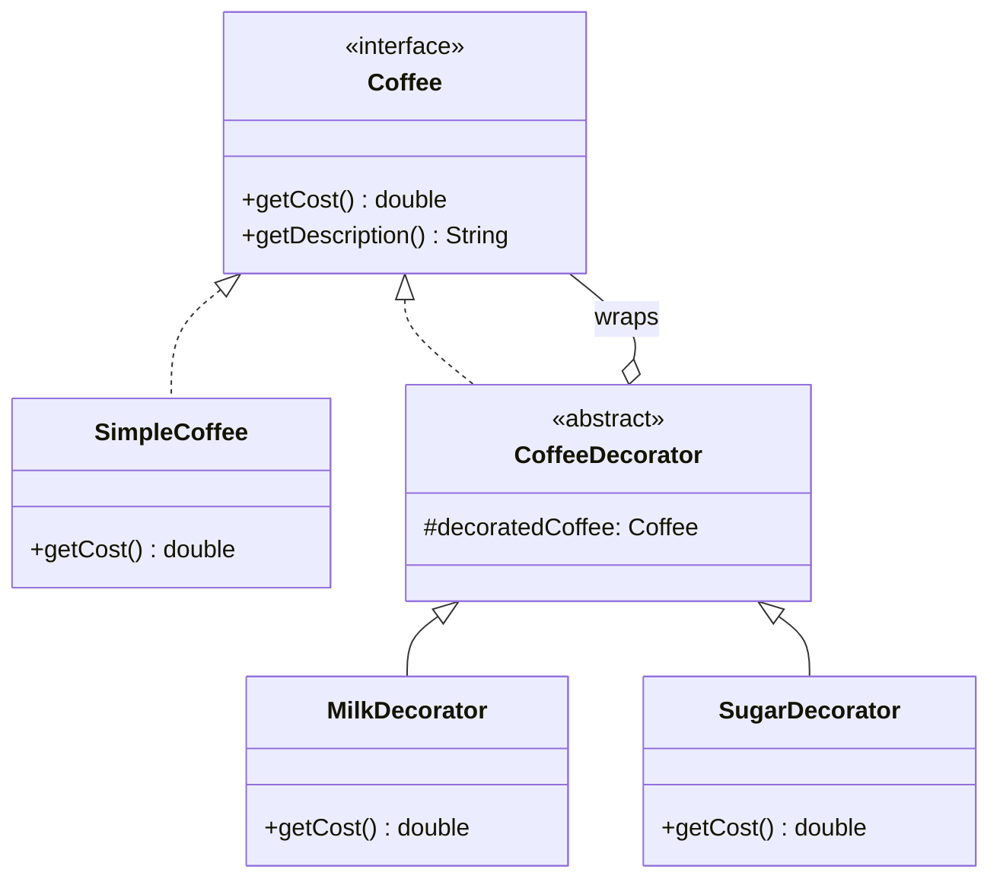
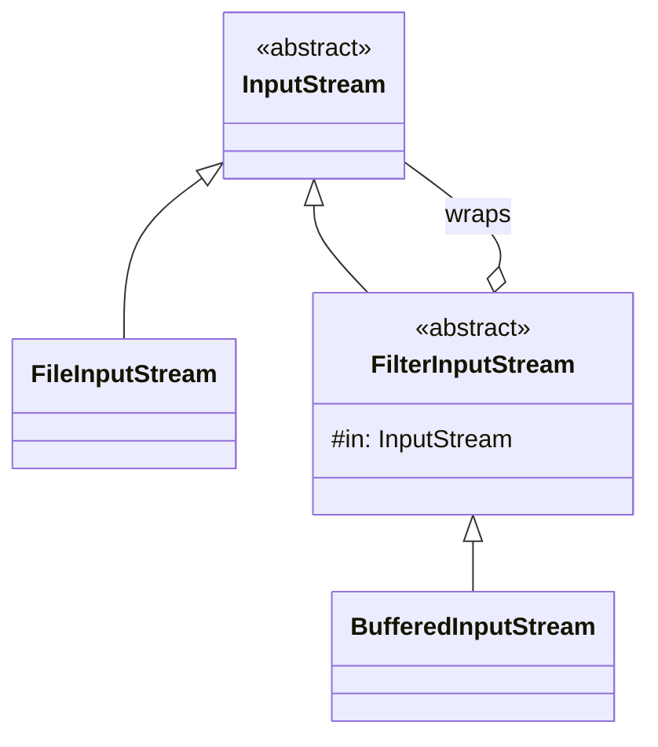

## Intent

> **Attach additional responsibilities to an object dynamically. Decorators provide a flexible
> alternative to subclassing for extending functionality.**

Decorator answers a specific question: **how do you add optional, stackable behavior to an object
at runtime, without creating a new subclass for every possible combination of behaviors?**

## The Motivating Problem: Combinatorial Explosion, Again

A coffee shop sells a base `Coffee`, with optional add-ons: milk, sugar, whipped cream — each
adding to the cost.

```java
class Coffee { double getCost() { return 2.0; } }
class CoffeeWithMilk extends Coffee { double getCost() { return 2.5; } }
class CoffeeWithSugar extends Coffee { double getCost() { return 2.2; } }
class CoffeeWithMilkAndSugar extends Coffee { double getCost() { return 2.7; } }
class CoffeeWithMilkAndSugarAndCream extends Coffee { double getCost() { return 3.2; } }
```

This should immediately trigger the same recognition as Chapter 13's `Car` example and Chapter
22's remote control example: **every combination of optional add-ons needs its own subclass**,
scaling combinatorially. With 3 add-ons, that's already up to 8 possible combinations.

## The Fix: Wrap, Don't Subclass

```java
interface Coffee {
    double getCost();
    String getDescription();
}

class SimpleCoffee implements Coffee {
    public double getCost() { return 2.0; }
    public String getDescription() { return "Coffee"; }
}

abstract class CoffeeDecorator implements Coffee {
    protected final Coffee decoratedCoffee; // wraps another Coffee — same interface!

    CoffeeDecorator(Coffee decoratedCoffee) {
        this.decoratedCoffee = decoratedCoffee;
    }
}

class MilkDecorator extends CoffeeDecorator {
    MilkDecorator(Coffee coffee) { super(coffee); }

    public double getCost() { return decoratedCoffee.getCost() + 0.5; }
    public String getDescription() { return decoratedCoffee.getDescription() + ", Milk"; }
}

class SugarDecorator extends CoffeeDecorator {
    SugarDecorator(Coffee coffee) { super(coffee); }

    public double getCost() { return decoratedCoffee.getCost() + 0.2; }
    public String getDescription() { return decoratedCoffee.getDescription() + ", Sugar"; }
}
```

```java
Coffee order = new MilkDecorator(new SugarDecorator(new SimpleCoffee()));
System.out.println(order.getDescription() + " = $" + order.getCost());
// "Coffee, Sugar, Milk = $2.70"
```

**3 add-on classes, not 8 combination classes** — any combination is achieved by nesting decorators
in whatever order and quantity is needed at runtime, decided by the caller, not baked into a fixed
class hierarchy at compile time.



**The key structural insight:** `MilkDecorator` implements the **same** `Coffee` interface it
wraps. This is what makes decorators *stackable* — since a decorated `Coffee` is still a `Coffee`,
it can be passed into another decorator's constructor, indefinitely.

## Decorator vs. Adapter: Same Shape, Different Intent

Both patterns wrap an object and hold a reference to it — the structural difference from Chapter
21 bears repeating precisely here, since this is where the two patterns are most often confused in
practice:

| | Adapter (Ch. 21) | Decorator (this chapter) |
|---|---|---|
| **Interface of wrapper vs. wrapped** | **Different** — that's the whole point | **Same** — that's the whole point |
| **Purpose** | Make an incompatible interface usable | Add behavior while preserving the interface |
| **Can you stack multiple?** | Rarely meaningful | Yes — stacking is the core use case |

**The single fastest test:** does the wrapping class implement the *same* interface as the thing it
wraps? Same interface → Decorator. Different interface → Adapter.

## A Real Java Example: `java.io`

If you've ever written `new BufferedReader(new InputStreamReader(new FileInputStream(file)))`,
you've used the Decorator pattern directly from the JDK. Each layer wraps the one before it,
implementing a common `Reader`/`InputStream` interface, adding one specific capability
(buffering, character decoding) at each layer — exactly the coffee example's structure, just
decorating stream-reading behavior instead of a beverage.



## Decorator vs. Builder: Don't Confuse Configuration With Behavior

A Builder (Chapter 19) configures **one object's fields** before it's constructed, then produces a
single, final, immutable object. A Decorator wraps an **already-constructed** object, adding
**behavior** that executes every time a method is called — the wrapped object keeps being
"decorated" for its entire lifetime, not just at construction time. Don't reach for Decorator
just because an object has several optional characteristics — that's Builder's territory unless
those characteristics specifically need to add runtime *behavior* around existing method calls.

## Summary

- Decorator attaches additional responsibilities to an object dynamically, by wrapping it in
  another object implementing the *same* interface — avoiding the combinatorial subclass explosion
  that inheritance-based extension would cause.
- Decorators are stackable specifically because the decorator implements the same interface as the
  thing it decorates, so a decorated object can itself be wrapped by another decorator.
- Distinguish from Adapter by interface: same interface → Decorator; different interface →
  Adapter. Distinguish from Builder by timing: Decorator wraps an existing object's ongoing
  behavior; Builder configures fields before a single, final object is constructed once.
- Java's own `java.io` stream classes (`BufferedInputStream` wrapping `FileInputStream`, etc.) are
  a canonical, real-world example of this exact pattern.

---

## Interview Questions

**1. State the Decorator pattern's intent, and explain the specific structural requirement that
makes decorators "stackable."**
Decorator attaches additional responsibilities to an individual object dynamically, providing a
flexible alternative to subclassing for extending behavior. The structural requirement that makes
decorators stackable is that a decorator must implement the *same* interface as the object it
wraps — since a decorated `Coffee` is still fully a `Coffee`, it can itself be passed into another
decorator's constructor, allowing decorators to be nested arbitrarily deep, each adding its own
layer of behavior on top of the previous one.
*Follow-up: What would happen, functionally, if `MilkDecorator` implemented a different interface
than `Coffee`?* It would no longer be possible to pass a `MilkDecorator`-wrapped coffee into
another decorator expecting a `Coffee` parameter, breaking the stacking capability entirely — at
that point, the class would no longer be functioning as a Decorator in the GoF sense, and would
more closely resemble an Adapter (translating one interface into a different one) instead.

**2. Walk through the coffee shop example and explain precisely how many classes the Decorator
approach needs compared to the inheritance-based approach, for 3 optional add-ons.**
The inheritance-based approach needs one subclass per *combination* of add-ons — with 3 independent
optional add-ons (milk, sugar, cream), there are up to 8 possible combinations (including "no
add-ons" and "all three"), requiring up to 7 additional subclasses beyond the base `Coffee` class
(since some combinations, like "no add-ons," need no subclass at all). The Decorator approach needs
exactly one class per add-on — 3 decorator classes total — with every combination achievable by
nesting decorators together at runtime, rather than requiring a dedicated class for each
combination.
*Follow-up: If a fourth add-on (caramel) were added, how would the two approaches' class counts
compare now?* The inheritance approach would need up to 15 combination classes (2^4 - 1, excluding
the "no add-ons" base case), continuing to grow exponentially with each new add-on; the Decorator
approach would need just one new `CaramelDecorator` class, bringing the total to 4 decorator
classes — the gap between the two approaches widens dramatically as more independent optional
add-ons are introduced.

**3. Explain the precise distinguishing test between Decorator and Adapter, and why "both wrap
another object" isn't sufficient to tell them apart.**
Both patterns do involve a wrapping class holding a reference to another object and delegating some
calls to it, which is why superficial code inspection alone can't distinguish them — the
distinguishing test is whether the wrapper implements the *same* interface as the wrapped object
(Decorator, since the goal is adding behavior while preserving compatibility with existing code
expecting that interface) or a *different* interface than the wrapped object implements (Adapter,
since the goal is bridging an interface mismatch). Checking the `implements`/`extends` clause of the
wrapping class against the type of the object it wraps resolves the ambiguity immediately.
*Follow-up: Could a single class technically satisfy both patterns simultaneously — being both an
Adapter and a Decorator at once?* This would be unusual and likely indicate the class is taking on
two distinct responsibilities that should be separated (echoing the SRP-driven separation discussed
in Chapter 21's similar question) — a cleaner design would typically use a dedicated Adapter first
to bridge any interface mismatch, and then a separate Decorator (implementing the now-uniform
target interface) layered on top to add behavior, keeping the two concerns cleanly separated rather
than conflated in one class.

**4. How does the `java.io` example (`BufferedInputStream` wrapping `FileInputStream`)
demonstrate the Decorator pattern in real, widely-used JDK code?**
`FilterInputStream` (the common superclass for `BufferedInputStream` and similar wrapping stream
classes) holds a reference to another `InputStream` and implements the same `InputStream`
abstract class/contract itself — meaning a `BufferedInputStream` wrapping a `FileInputStream` can
itself be further wrapped by another stream decorator (like a hypothetical encryption or
compression stream), and the whole nested structure can still be used anywhere a plain
`InputStream` is expected, exactly matching the Decorator pattern's stackability requirement.
*Follow-up: What specific behavior does `BufferedInputStream` add on top of the `InputStream` it
wraps, and why is this a good illustration of Decorator's "add behavior without changing the
interface" intent?* `BufferedInputStream` adds internal buffering — reading larger chunks of data
from the underlying stream at once and serving smaller `read()` calls from an in-memory buffer,
reducing the number of expensive underlying I/O operations — while still exposing the exact same
`read()` method signature as any other `InputStream`; callers get improved performance transparently,
without needing to know or care that buffering is happening underneath, which is precisely
Decorator's core value: added behavior, unchanged interface.

**5. Why would using the Decorator pattern for the coffee example specifically satisfy the
Open/Closed Principle, in the same way Factory Method and Strategy did in earlier chapters?**
Adding a new optional add-on (say, caramel) means writing one new `CaramelDecorator` class
implementing the existing `Coffee` interface — no existing class (`SimpleCoffee`, `MilkDecorator`,
`SugarDecorator`, or any client code composing them together) needs to be modified at all to
support the new add-on. This is the same "open for extension, closed for modification" outcome
established in Chapter 8, here achieved through wrapping and delegation rather than through
polymorphic type-selection.
*Follow-up: Does Decorator satisfy the Dependency Inversion Principle in the same way Strategy and
Factory Method do?* Yes — `CoffeeDecorator`'s field is typed as the `Coffee` interface, not any
specific concrete coffee or decorator class, meaning decorators depend on the `Coffee` abstraction
rather than any particular concrete implementation, allowing any `Coffee`-implementing object
(a plain `SimpleCoffee` or an already-decorated one) to be wrapped by any decorator, exactly
mirroring DIP's "depend on abstractions, not concretions" guidance from Chapter 11.

**6. Explain why the order in which decorators are applied can matter, using the coffee example
— is `new MilkDecorator(new SugarDecorator(coffee))` always equivalent to
`new SugarDecorator(new MilkDecorator(coffee))`?**
For the specific coffee example, where each decorator simply adds a fixed cost and appends a
description string, the final total cost is the same regardless of order (addition is
commutative), though the resulting description string's word order would differ ("Coffee, Sugar,
Milk" vs. "Coffee, Milk, Sugar"). In general, however, decorator ordering *can* meaningfully affect
behavior — for example, if a `CompressionDecorator` and an `EncryptionDecorator` wrapped a data
stream, compressing before encrypting versus encrypting before compressing produces genuinely
different (and non-interchangeable) results, since compressing already-encrypted data is typically
far less effective than compressing plaintext first.
*Follow-up: How would you communicate this ordering sensitivity to a caller of your decorator-based
API, to prevent them from applying decorators in an incorrect or unintended order?* Clear
documentation on each decorator class explaining any ordering dependencies is the most direct
approach; for stronger, compiler-enforced guarantees, you could also provide a dedicated factory
method or Builder (Chapter 19) that constructs the correctly-ordered decorator chain internally,
rather than exposing raw decorator constructors directly to callers who might apply them in an
incorrect order by mistake.

**7. Can a Decorator add entirely new methods beyond what the wrapped interface declares, or is
it limited to only overriding existing methods from the shared interface?**
A decorator class is free to add new public methods beyond the shared interface's contract — for
example, `MilkDecorator` could add a method like `isDairyFree()` that isn't part of the `Coffee`
interface at all. However, doing so has a significant practical limitation: any code that accesses
the object only through the `Coffee` interface type (which is the typical, intended way of working
with decorated objects) won't be able to call that extra method without an explicit downcast to the
specific concrete decorator type, which reintroduces exactly the kind of type-checking/casting the
pattern is meant to avoid, and breaks if the object is wrapped in yet another decorator afterward.
*Follow-up: Given this limitation, is it generally considered good practice to add methods beyond
the shared interface on a decorator class?* Generally not, for the reason just described — it
undermines the pattern's core benefit of uniform, interface-based interaction, and any functionality
genuinely needed by calling code should typically be added to the shared interface itself (and
implemented meaningfully, even if just by delegation, in every existing implementer) rather than
as a decorator-specific extra method that only works when the exact concrete decorator type is
known and accessed directly.

**8. How would you unit test the `MilkDecorator` class in isolation, without needing a real
`SimpleCoffee` or any other specific concrete `Coffee` implementation?**
Since `MilkDecorator`'s constructor accepts any `Coffee` (the interface type, per DIP), a unit test
can inject a simple fake or mock `Coffee` implementation with a known, controlled `getCost()`
return value (say, a fake returning exactly `1.0`), then assert that
`new MilkDecorator(fakeCoffee).getCost()` returns exactly `1.5` (the fake's `1.0` plus
`MilkDecorator`'s own `0.5` addition) — this isolates the test to verifying `MilkDecorator`'s own
specific addition logic, entirely independent of any particular concrete `Coffee` implementation's
own behavior.
*Follow-up: Would this same testing approach still work cleanly if you wanted to test a
`MilkDecorator` wrapping a `SugarDecorator` wrapping a fake `Coffee`, verifying the fully-stacked
combination's total cost?* Yes — you could construct the full nested chain
(`new MilkDecorator(new SugarDecorator(fakeCoffee))`) and assert the final `getCost()` matches the
expected sum across all layers; this kind of integration-style test (verifying multiple decorators
stacked together) complements, rather than replaces, the isolated single-decorator unit tests,
giving confidence both that each individual decorator is correct and that they compose correctly
together.

**9. In an LLD interview, if asked to design a text-formatting system supporting optional bold,
italic, and underline formatting that can be combined in any combination, how would you apply
Decorator here?**
Define a `TextComponent` interface with a method like `String render()`, implemented by a
`PlainText` base class returning the raw text unmodified, and three decorators
(`BoldDecorator`, `ItalicDecorator`, `UnderlineDecorator`), each wrapping a `TextComponent` and
wrapping the delegated `render()` result with the appropriate formatting markup (e.g.,
`"<b>" + wrapped.render() + "</b>"` for bold). Any combination of formatting is achieved by nesting
decorators in the desired order, exactly mirroring the coffee example's structure.
*Follow-up: Does the ordering of decorators matter here in a way similar to the
compression/encryption example discussed earlier, and if so, how?* Yes, potentially — depending on
the specific markup format being generated, nesting `<b><i>text</i></b>` versus `<i><b>text</b></i>`
might produce visually identical results in most rendering contexts (since bold and italic are
typically independent, commutative visual properties), but for markup formats with stricter nesting
rules or specific styling cascades, the order in which tags are nested could matter — this is a good
example of a case where you'd want to explicitly verify with the interviewer or through requirements
whether ordering is expected to be significant for the specific formatting system being designed.

**10. Is the Decorator pattern compatible with immutability — can a decorated object still be
treated as immutable, similar to the discussion of immutable objects built via the Builder pattern
in Chapter 19?**
Yes — if `SimpleCoffee` and every decorator class hold only `final` fields set once at construction
and provide no mutating methods, the entire decorated chain remains fully immutable: calling
`getCost()` or `getDescription()` on any layer never changes any object's state, it simply computes
and returns a value based on the (immutable) wrapped object and the decorator's own fixed
configuration. This is a common and often desirable property for Decorator-based designs, since
immutability brings the same thread-safety and reasoning benefits discussed throughout this series.
*Follow-up: Would this immutability property still hold if a decorator's added behavior involved
some form of caching, like memoizing the result of an expensive `getCost()` calculation the first
time it's called?* Introducing a cache would technically make the object's *internal* state
mutable (a cached value being set on first access), even though its externally-observable behavior
(the value returned by `getCost()`) remains consistent and effectively immutable from a caller's
perspective — this is sometimes called "internal mutability with external immutability," a common
and generally safe pattern as long as the cached value can never actually become stale or
inconsistent with what a fresh computation would produce.

**11. How would you extend the Decorator pattern to support removing a previously-applied
decoration — for example, "undo the milk" from an already-constructed decorated coffee object?**
This is a genuine limitation of the classic Decorator pattern as typically implemented — because
decorators wrap and are wrapped by reference (with no built-in way to "unwrap" a specific layer
from the middle of a chain without reconstructing it), removing a specific decoration typically
requires either restructuring the entire chain from scratch (rebuilding it without the unwanted
decorator) or designing the system differently from the start, perhaps using a mutable, non-nested
representation (like a `Set<Addon>` field, checked at cost-calculation time) if arbitrary
addition/removal after the fact is a genuinely required capability.
*Follow-up: Given this limitation, would you recommend Decorator at all for a use case where
"remove a specific added behavior after the fact" is an explicitly stated requirement?* No — if
this specific requirement is explicitly stated upfront, it's a strong signal that Decorator's
nested-wrapping structure isn't the right fit, and a different design (perhaps a `Coffee` class
with a mutable, explicitly modifiable list of currently-applied add-ons, checked at calculation
time rather than baked into a nested wrapper structure) would better serve the actual stated
requirement — this is a good example of listening carefully to a problem's specific stated
constraints before committing to a pattern that doesn't naturally support them.

**12. Explain how Decorator relates to the Single Responsibility Principle — does wrapping a
`SimpleCoffee` in a `MilkDecorator` and a `SugarDecorator` violate SRP by having multiple classes
all concerned with "coffee cost calculation"?**
This doesn't violate SRP — each individual decorator class has exactly one, focused responsibility:
`MilkDecorator`'s sole reason to change is "how does milk affect cost and description," entirely
independent of `SugarDecorator`'s own sole reason to change ("how does sugar affect cost and
description"). Having multiple small, single-purpose classes that each handle one specific add-on's
effect, composed together via wrapping, is a textbook example of SRP being correctly satisfied
through decomposition, not violated by having "many classes about coffee."
*Follow-up: Would combining `MilkDecorator` and `SugarDecorator`'s logic into a single
`MilkAndSugarDecorator` class violate SRP, and if so, why?* Yes — a combined
`MilkAndSugarDecorator` would have two independent reasons to change (milk-related cost/description
changes, and separately, sugar-related cost/description changes), and it would also reintroduce the
exact combinatorial-explosion problem Decorator was introduced to solve in the first place (needing
a separate combined class for every pairing of add-ons), making it both an SRP violation and a
regression back toward the original inheritance-based anti-pattern this chapter opened with.

**13. If a problem statement described optional features that needed to be toggled on and off
repeatedly at runtime on the *same* object instance (rather than being fixed once at construction
time), would Decorator still be the right pattern, or would something else fit better?**
Decorator's nested-wrapping structure is naturally suited to features fixed at construction/wrapping
time — repeatedly toggling a feature on and off on what's conceptually "the same object" doesn't
map cleanly onto Decorator's wrap-once structure (per the "undo the milk" limitation discussed
earlier). A design requiring frequent runtime toggling might be better served by a `Coffee` class
holding a mutable `Set<Addon>` of currently-active add-ons, checked and applied dynamically inside
`getCost()`, rather than a fixed chain of nested decorator objects — trading away Decorator's
combinatorial-explosion-avoidance benefit (which still applies, since you're not creating a
subclass per combination either way) for the flexibility of runtime mutability.
*Follow-up: Would this mutable-set-based alternative design still be considered a form of the
Decorator pattern, or would it be a different pattern (or no named pattern) entirely?* This
mutable-set-based approach is generally not considered the Decorator pattern — it lacks
Decorator's defining structural characteristic of wrapping objects in nested layers implementing a
shared interface; it's simply a straightforward, mutable-state-based design (sometimes without any
specific named GoF pattern label at all), which is a perfectly valid, simpler solution once the
requirements (needing runtime toggling) no longer match what Decorator's specific structure is
suited for — a good example of a case where forcing a named pattern onto a problem, once
requirements shift, would be the wrong call per the "patterns are tools, not goals" guidance from
Chapter 15.

**14. Summarize the three most commonly confused structural patterns covered so far (Adapter,
Bridge, Decorator) with one clear, distinguishing question for each, that you could use to quickly
tell them apart in an interview.**
For Adapter: "Do the wrapper and the wrapped object implement genuinely *different* interfaces,
with the wrapper translating between them?" — if yes, Adapter. For Bridge: "Are there *two or
more* independently-varying dimensions being decoupled from each other through composition, to
avoid a combinatorial subclass explosion across multiple axes?" — if yes, Bridge. For Decorator:
"Does the wrapper implement the *same* interface as the wrapped object, specifically to add
stackable behavior at runtime while preserving compatibility with code expecting that original
interface?" — if yes, Decorator. All three involve one class holding a reference to another and
delegating to it, but these three questions, applied in sequence, reliably distinguish which
specific pattern's intent actually matches what's being designed.
*Follow-up: Is it possible for a single class to genuinely not fit any of these three patterns
(or any other named GoF pattern), while still being a perfectly good, valid piece of object-oriented
design?* Absolutely, and this is worth remembering throughout this series — plenty of good,
clean object-oriented code is simply good code, applying SOLID principles and clear composition
without matching any specific named GoF pattern's exact structural shape; forcing a design to fit a
named pattern when it genuinely doesn't match one's specific intent is itself a design smell,
directly echoing the "patterns are tools, not goals" caution first raised in Chapter 15.
