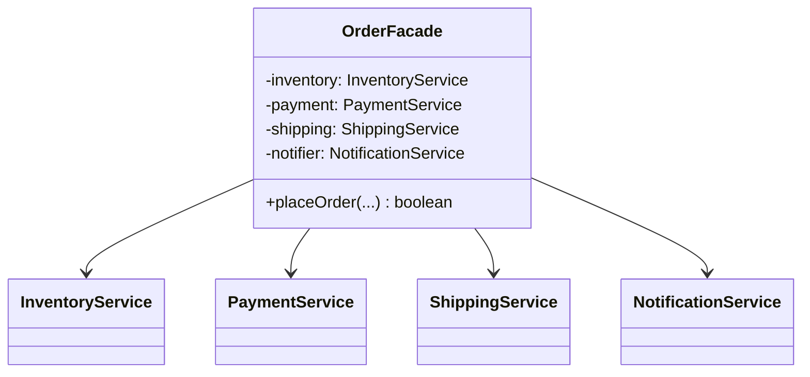

## Intent

> **Provide a unified interface to a set of interfaces in a subsystem. Facade defines a
> higher-level interface that makes the subsystem easier to use.**

Facade is the simplest structural pattern to understand, and the easiest to underestimate. It
doesn't add new capability to a system — it **removes exposure to unnecessary complexity** for
callers who don't need to see it.

## The Motivating Problem: A Multi-Step Subsystem

Placing an order in an e-commerce checkout might genuinely require coordinating several
subsystems: checking inventory, charging a payment method, arranging shipping, and sending a
confirmation.

```java
class InventoryService {
    boolean reserveStock(String productId, int quantity) { /* ... */ return true; }
}

class PaymentService {
    boolean chargeCard(String cardToken, double amount) { /* ... */ return true; }
}

class ShippingService {
    String scheduleShipment(String address, String productId) { /* ... */ return "TRACK123"; }
}

class NotificationService {
    void sendOrderConfirmation(String email, String trackingNumber) { /* ... */ }
}
```

Without a facade, every piece of code that wants to place an order needs to know about, correctly
sequence, and correctly wire together **all four** of these services:

```java
// Every caller repeats this entire sequence
InventoryService inventory = new InventoryService();
PaymentService payment = new PaymentService();
ShippingService shipping = new ShippingService();
NotificationService notifier = new NotificationService();

if (inventory.reserveStock(productId, quantity)) {
    if (payment.chargeCard(cardToken, amount)) {
        String tracking = shipping.scheduleShipment(address, productId);
        notifier.sendOrderConfirmation(email, tracking);
    }
}
```

This is a **DRY violation waiting to happen** — every caller repeats the same orchestration logic,
and every caller needs to know internal details (like the correct call order) that have nothing to
do with what they actually care about: "place this order."

## The Fix: One Simple Entry Point

```java
class OrderFacade {
    private final InventoryService inventory = new InventoryService();
    private final PaymentService payment = new PaymentService();
    private final ShippingService shipping = new ShippingService();
    private final NotificationService notifier = new NotificationService();

    boolean placeOrder(String productId, int quantity, String cardToken,
                        double amount, String address, String email) {
        if (!inventory.reserveStock(productId, quantity)) {
            return false;
        }
        if (!payment.chargeCard(cardToken, amount)) {
            return false;
        }
        String tracking = shipping.scheduleShipment(address, productId);
        notifier.sendOrderConfirmation(email, tracking);
        return true;
    }
}
```

```java
OrderFacade orderFacade = new OrderFacade();
orderFacade.placeOrder("PROD-1", 2, "tok_abc", 49.99, "123 Main St", "user@example.com");
```

One method call. The caller doesn't know — and doesn't need to know — that four separate services
exist underneath, or in what order they must be invoked.



## Facade Does Not Hide the Subsystem — It Simplifies Access to It

A critical, frequently-tested nuance: **Facade doesn't prevent direct access to the subsystem
classes.** `InventoryService`, `PaymentService`, and the others remain fully public and usable
directly by code that has a genuine need for finer-grained control (say, a specialized admin tool
that needs to reserve stock without immediately charging payment). Facade simply provides a
**convenient, simplified path for the common case**, without removing flexibility for the
uncommon one.

This is precisely what distinguishes Facade from Encapsulation (Chapter 2) in the strict sense —
encapsulation *restricts* access to protect invariants; Facade *adds* a convenience layer on top of
already-accessible components, purely to simplify the common path.

## Facade vs. Adapter: Both Simplify, for Different Reasons

| | Adapter (Ch. 21) | Facade (this chapter) |
|---|---|---|
| **Number of wrapped classes** | Typically one (the adaptee) | Typically several (a whole subsystem) |
| **Purpose** | Translate an incompatible interface | Simplify a complex, but compatible, interface |
| **Is there a genuine incompatibility being bridged?** | Yes | No — the subsystem works fine; it's just complex to *use* correctly |

**The fast distinguishing question:** is there an actual interface *mismatch* being solved
(Adapter), or is the underlying subsystem already perfectly usable, just tediously multi-step for
callers (Facade)?

## Where Facade Naturally Appears in LLD Case Studies

Any case study with several genuinely separate concerns that a caller usually wants to trigger
together is a Facade candidate: a `ParkingLot` facade coordinating spot-finding, ticket issuance,
and payment (Chapter 45); a `BookingFacade` in a movie-ticket system (Chapter 54) coordinating seat
selection, payment, and confirmation. Recognizing "this caller wants one outcome, but achieving it
requires coordinating several subsystems in a specific order" is the trigger.

## Summary

- Facade provides a single, simplified entry point to a complex subsystem made up of several
  classes, without changing or restricting the subsystem itself.
- It solves the "every caller has to know and correctly repeat a multi-step orchestration"
  problem — centralizing that orchestration logic in one place, satisfying DRY.
- Facade doesn't hide the subsystem — advanced callers can still reach the underlying classes
  directly when they genuinely need finer control; Facade is a convenience layer, not an access
  restriction.
- Distinguish from Adapter: Facade simplifies access to an already-usable, multi-class subsystem;
  Adapter bridges a genuine single-interface incompatibility.

---

## Interview Questions

**1. State the Facade pattern's intent, and clarify the common misconception that it "hides" or
restricts access to the underlying subsystem.**
Facade provides a unified, higher-level interface to a set of interfaces in a subsystem, making the
subsystem easier to use for the common case. The common misconception is that Facade *prevents*
direct access to the subsystem's individual classes — in reality, those classes typically remain
fully public and directly usable by any code that has a genuine need for more granular control;
Facade simply adds a convenient, simplified path on top, without removing the existing, more
detailed access options.
*Follow-up: If a design requirement explicitly stated "callers must never be able to access the
individual subsystem classes directly, only through the facade," how would you achieve that, and
would the result still be a pure Facade pattern?* You'd need to make the subsystem classes
package-private (not `public`) so they're only accessible from within the same package as the
facade, or use some form of module system boundary to genuinely restrict access — at that point,
you've layered genuine encapsulation (Chapter 2) on top of the Facade pattern; the combination is
still reasonable and common in practice, but it's worth recognizing that the access-restriction
part is a separate, additional design decision from Facade's core "simplify access" intent.

**2. Walk through the `OrderFacade` example and explain exactly what DRY violation it
eliminates.**
Without the facade, every piece of calling code that needs to place an order would need to
independently write out the same four-step sequence (reserve stock, charge payment, schedule
shipping, send confirmation) in the correct order, with correct error handling at each step — if
this sequence needed to change (say, adding a fraud-check step before charging payment), every
scattered call site would need to be found and updated individually. `OrderFacade.placeOrder()`
centralizes this orchestration logic in exactly one place, so any future change to the sequence
only requires updating the facade itself.
*Follow-up: Beyond DRY, what Single Responsibility Principle benefit does extracting this logic
into a dedicated `OrderFacade` class provide?* It gives the order-placement orchestration logic its
own single, clear responsibility and its own dedicated class, rather than that orchestration logic
being duplicated and scattered inside whatever calling code happens to need it (a controller, a
CLI command handler, a scheduled batch job) — each of those callers can now focus purely on their
own responsibility (handling an HTTP request, for example) and simply delegate the actual
order-placement complexity to `OrderFacade`.

**3. How would you distinguish, given a class that wraps and coordinates several other classes,
whether it represents a Facade or something else, like a Mediator (covered later in Chapter 35)?**
The key distinguishing signal is the *direction and nature* of the coordination: Facade
provides a simplified, typically one-way entry point for external callers into an existing,
already-functional subsystem — the subsystem classes generally don't need to know the facade
exists, and the facade's job is purely to sequence and simplify calls into them. Mediator, by
contrast, is specifically about centralizing and managing *complex communication between the
subsystem's own components themselves* — the components typically depend on and communicate
through the mediator rather than directly with each other, addressing tangled peer-to-peer
communication rather than simplifying external access.
*Follow-up: In the `OrderFacade` example, do `InventoryService`, `PaymentService`,
`ShippingService`, and `NotificationService` know about or communicate with each other directly,
and how does this relate to which pattern is being used?* No — in the Facade example, none of the
four services know about or reference each other at all; they're each independently self-contained,
and only `OrderFacade` knows about and sequences calls to all four. This lack of inter-service
communication (versus a design where the services needed to coordinate directly with each other
through some central hub) is exactly what confirms this is Facade, not Mediator.

**4. Is it accurate to say Facade never adds any new business logic of its own, and is purely a
"pass-through" to the underlying subsystem?**
Not entirely — while Facade's primary purpose is simplifying access and sequencing calls to an
existing subsystem, it's common and often necessary for the facade to include some orchestration-
specific logic that doesn't belong to any single subsystem class, such as the early-return logic in
`OrderFacade.placeOrder()` (`if (!inventory.reserveStock(...)) return false;`) — this
conditional-flow-control logic is genuinely part of "how to correctly orchestrate these four steps
together," not duplicated business logic that belongs inside any one of the four individual
services.
*Follow-up: At what point would logic inside a Facade become excessive enough to indicate an SRP
violation, where the facade has taken on responsibilities beyond simple orchestration?* If the
facade started containing substantial business rules of its own (like calculating discount
eligibility, or complex tax logic) rather than purely sequencing and coordinating calls to the
underlying subsystem's own methods, that would suggest business logic has crept into a class whose
responsibility should be limited to orchestration — that logic would more appropriately live in
its own dedicated class (or inside one of the subsystem services, if it clearly belongs there)
rather than accumulating inside the facade itself.

**5. In the `OrderFacade` example, if `PaymentService.chargeCard()` fails after
`InventoryService.reserveStock()` has already succeeded, what happens to the reserved stock, and
why is this a genuinely important detail for an LLD interview to address, beyond the Facade
pattern itself?**
As written, the example leaves the stock reserved even if payment fails — this is a real bug
(the "success requires undoing partial work on failure" problem), not something the Facade pattern
itself solves or is responsible for solving; Facade only concerns itself with *simplifying and
sequencing* the calls, not with the correctness of failure/rollback handling across the sequenced
steps. A complete design would need to release the reserved stock (calling something like
`inventory.releaseStock(productId, quantity)`) inside the facade's failure-handling path if the
payment step fails, treating this as a compensating action for the partial success.
*Follow-up: Does this failure-handling responsibility belong inside `OrderFacade` itself, or
should it be handled elsewhere?* This is a reasonable place for it to live, since `OrderFacade` is
already the class responsible for knowing the correct sequence and dependencies between these
steps — it's a natural, appropriate extension of its existing orchestration responsibility to also
handle compensating actions when a later step in that same sequence fails, rather than pushing this
failure-handling knowledge out to every caller of the facade.

**6. How would you unit test `OrderFacade.placeOrder()`, given that it depends on four separate
concrete service classes constructed internally within `OrderFacade` itself, as shown in the
example?**
As written, with the four services constructed directly inside `OrderFacade`'s own field
declarations (`new InventoryService()`, etc.), unit testing `OrderFacade` in isolation is difficult,
since there's no way to inject fake versions of the four services to control their behavior for a
test — this directly mirrors the DIP-related testability problem from Chapter 11. The fix follows
the same pattern: refactor `OrderFacade` to accept its four dependencies via constructor injection
(ideally typed as interfaces, if the services don't already have interfaces), allowing a unit test
to inject fakes that simulate specific success/failure scenarios (like a fake `PaymentService` that
always fails) to verify `OrderFacade`'s orchestration logic handles each case correctly.
*Follow-up: Does refactoring `OrderFacade` to accept its dependencies via constructor injection
change anything about whether it's still correctly considered an instance of the Facade pattern?*
No — the Facade pattern's core intent (providing one simplified entry point to a subsystem) is
entirely independent of *how* the facade obtains references to its underlying subsystem
components; whether those references are constructed internally or injected externally is purely a
DIP/testability concern layered on top of the Facade pattern, not a change to the pattern itself.

**7. Could `OrderFacade` be reasonably combined with the Singleton pattern from Chapter 16, and
does this combination make sense given the criticisms of Singleton discussed there?**
It could technically be combined — since `OrderFacade` likely holds no meaningfully-varying
per-instance state of its own beyond references to its four services, there's an argument for
treating it as a Singleton, similar to the reasoning applied to stateless factories in earlier
chapters. However, given the testability criticisms of manual `getInstance()`-style Singletons
discussed in Chapter 16, and given that `OrderFacade` benefits significantly from dependency
injection for testing (as discussed in the previous question), a real application would more likely
register `OrderFacade` as a singleton-scoped dependency-injection bean (via Spring, for example)
rather than implementing a manual Singleton pattern directly on the class.
*Follow-up: Is there a meaningful difference, in this specific case, between "a Facade that
happens to be a singleton-scoped bean" and "the Facade pattern"?* No meaningful difference in
terms of the Facade pattern's own definition and purpose — "singleton-scoped bean" is purely a
statement about how many instances of the class exist and how they're managed at the application-
framework level, entirely orthogonal to Facade's core concern of simplifying access to a
subsystem; a class can be a Facade regardless of whether zero, one, or many instances of it exist
at runtime.

**8. Explain a scenario in an LLD interview where introducing a Facade might actually be
unnecessary or premature, connecting this back to the KISS/YAGNI discussion from Chapter 12.**
If a "subsystem" genuinely consists of just one or two simple classes with an already
straightforward, one-or-two-call usage pattern, introducing a full Facade class purely for
structural symmetry with more complex parts of the system adds an unnecessary extra layer of
indirection with no real simplification benefit — callers weren't struggling with complexity in
the first place, so there's nothing meaningful for a facade to simplify. This would be a KISS/YAGNI
violation: adding a pattern because it's "the professional-looking thing to do" rather than because
the underlying complexity genuinely warrants it.
*Follow-up: What's a concrete signal, during an interview, that a Facade is genuinely warranted
rather than being applied prematurely?* A concrete signal is counting the actual number of
separate classes/services a typical caller would need to correctly coordinate, in the correct
order, to achieve one meaningful outcome — if that number is one or two with an obvious, simple
call sequence, a Facade likely isn't warranted yet; if it's three or more with meaningful
sequencing, conditional logic, or error-handling coordination required across them (as in the
four-service `OrderFacade` example), that's a much stronger, concrete signal that a Facade
provides genuine value.

**9. How would you extend `OrderFacade` to support two different "modes" of order placement —
say, a standard synchronous flow and an asynchronous, queue-based flow for high-volume batch
processing — without violating the Open/Closed Principle?**
Rather than adding a boolean flag parameter and branching internally inside a single `placeOrder()`
method (which would risk violating OCP as the number of modes grows, echoing the `if/else`-over-type
anti-pattern from Chapter 8), you could define a `placeOrder()` method on the facade that delegates
the actual fulfillment sequencing to an injected `OrderFulfillmentStrategy` interface (Strategy
pattern, Chapter 28) — with a `SynchronousFulfillmentStrategy` and an
`AsynchronousFulfillmentStrategy` as two separate implementations, letting `OrderFacade` remain
simple while the actual behavioral variation lives in swappable, OCP-compliant strategy classes.
*Follow-up: Does this mean `OrderFacade` and `OrderFulfillmentStrategy` are now working together
as two different patterns applied at the same layer of the design?* Yes — this is a good example
of a Facade (simplifying the *caller's* interaction with the underlying subsystem) being combined
with a Strategy (allowing the facade's *internal* fulfillment behavior to vary independently, in an
OCP-compliant way) — the two patterns address different concerns (external simplicity vs. internal
extensibility) and compose naturally within the same class, similar to how Bridge and Strategy were
shown to coexist in Chapter 22.

**10. In an LLD interview for a "design a movie ticket booking system" (Chapter 54) problem, how
might a `BookingFacade` apply, and what subsystem classes might it coordinate?**
A `BookingFacade` could provide a single `bookTicket(showId, seatIds, paymentDetails, userEmail)`
method that internally coordinates a `SeatAvailabilityService` (checking and locking the requested
seats), a `PaymentService` (charging the customer), a `BookingRepository` (persisting the
confirmed booking record), and a `NotificationService` (sending a confirmation email or SMS) —
structurally identical to the `OrderFacade` example, just applied to the specific subsystem
components a movie-booking domain requires.
*Follow-up: Why might "locking" the requested seats specifically be an important detail this
facade's orchestration needs to handle carefully, beyond what the simpler `OrderFacade` example
needed to consider?* Movie seat booking has a strong concurrency concern that simple product-stock
reservation may share but is especially critical here — since exactly one specific seat can only
ever be sold to one customer, the facade's orchestration must ensure seats are locked/reserved
atomically at the start of the flow and reliably released if a later step (like payment) fails,
directly connecting to the concurrency-safety concerns raised in the Singleton chapter's
`ParkingLotManager` discussion and previewing the kind of concurrent-access correctness concerns
explored further in later case-study chapters.

**11. Does the Facade pattern have any meaningful relationship to microservice API gateways at
the HLD/architectural level (briefly connecting LLD back to HLD, as in earlier chapters)?**
Yes, conceptually — an API gateway in a microservices architecture serves a very similar structural
role at a much larger, distributed-systems scale: it provides client applications with a single,
simplified entry point (a unified API) that internally coordinates calls to multiple separate
backend microservices, hiding the complexity of which specific services exist and how they need to
be called and sequenced, from the external client's perspective — this is the same underlying
"simplify access to a complex, multi-part system" idea Facade formalizes at the class level, just
applied to entire distributed services rather than in-process Java classes.
*Follow-up: Is there a meaningful difference between how an API gateway handles the "what if one
underlying call fails" problem compared to how `OrderFacade` needs to handle it?* API gateways
operating across a distributed system typically need to account for network failures, partial
failures, and timeouts across the service calls they coordinate — often employing patterns like
circuit breakers (Chapter 39) and retries that go well beyond `OrderFacade`'s simpler, single-
process, single-machine failure handling — the underlying "coordinate several components and handle
partial failure" challenge is conceptually similar, but the distributed nature of an API gateway's
coordination introduces substantially more failure modes to account for than an in-process Facade
typically needs to consider.

**12. If two completely separate parts of an application both need to place orders — say, a web
checkout flow and an internal customer-support tool for placing orders on a customer's behalf —
how does having `OrderFacade` benefit both, beyond just avoiding code duplication?**
Beyond eliminating duplicated orchestration logic (the direct DRY benefit), having both the web
checkout flow and the customer-support tool depend on the exact same `OrderFacade` guarantees that
both paths enforce the *exact same business rules and sequencing* for placing an order — there's no
risk of the two callers subtly diverging over time (for example, if a developer updates the web
checkout's inline orchestration logic to add a new validation step, but forgets to make the
identical change in the customer-support tool's separately-duplicated logic). A single shared
facade eliminates this entire category of "logic drift" risk between callers that should behave
identically.
*Follow-up: Is this consistency benefit specific to Facade, or would it apply equally to any
shared, reusable class that both callers depended on?* This consistency benefit is a general
property of any well-designed shared abstraction that multiple callers depend on rather than
duplicating logic independently — Facade is simply one common, specific context (simplifying
access to a multi-step subsystem) where this general "shared logic prevents divergence" benefit
naturally and frequently arises, not a benefit unique to the Facade pattern's structural mechanics
specifically.

**13. How would you explain the difference between Facade and simply extracting a "helper" or
"utility" method that calls several other methods in sequence — is Facade just a fancier name for
a plain orchestration method?**
The underlying mechanical idea — one method or class calling several others in sequence to achieve
a higher-level outcome — is indeed shared between Facade and a simple orchestration helper method;
the distinction is more about scale, intent, and typical usage than a fundamentally different
mechanism. Facade specifically refers to this pattern applied at the level of providing a genuine,
dedicated *interface* to an entire *subsystem* of multiple classes, often becoming a first-class,
independently-important part of the application's architecture (with its own well-defined API,
potentially its own tests, and its own place in the system's overall design) — rather than being
just one incidental utility method buried inside some other class for local convenience.
*Follow-up: Does this mean the size or scope threshold for "when a helper method becomes worth
calling a Facade" is somewhat subjective?* Yes, reasonably so — there's no strict, universally-
agreed rule for exactly how many coordinated classes or how much orchestration complexity is needed
before the "Facade" label becomes the more accurate or useful description versus simply calling it
an orchestration or helper method; in an interview, focusing on whether the underlying design
correctly and cleanly simplifies access to genuine complexity is more valuable than debating
precisely which label best applies to the result.

**14. Summarize why Facade, despite being conceptually the simplest structural pattern covered
in this Part, is still worth understanding formally rather than just "writing an orchestration
method when it seems useful."**
Understanding Facade formally provides a shared vocabulary and a deliberate design lens for
recognizing *when* a subsystem's growing complexity specifically calls for a dedicated
simplification layer, rather than accumulating orchestration logic ad hoc, scattered and
duplicated across multiple callers as a codebase grows organically over time. It also provides a
clear mental checklist (does this genuinely simplify access to an already-functional, multi-class
subsystem, without restricting existing direct access, and without introducing new business logic
beyond orchestration) that helps evaluate whether a given design decision is being applied well or
being stretched beyond its appropriate scope — the same kind of deliberate, name-attached reasoning
this series has applied to every pattern covered so far, even the conceptually simplest ones.
*Follow-up: Of all seven structural patterns covered in this Part (Adapter, Bridge, Composite,
Decorator, Facade, and the two remaining — Flyweight and Proxy), which do you expect to recognize
most frequently in typical, everyday application code you didn't specifically set out to design
using named patterns?* Facade is a strong candidate for "most frequently occurring, even when not
deliberately named as such" — service-layer classes, controller methods that coordinate multiple
repository or service calls, and API client wrapper classes across countless real-world codebases
naturally take on Facade's exact shape (simplifying access to several underlying components)
constantly, often without anyone involved explicitly thinking "I am now applying the Facade
pattern" — it emerges naturally from good separation-of-concerns instincts even without conscious
pattern application.
