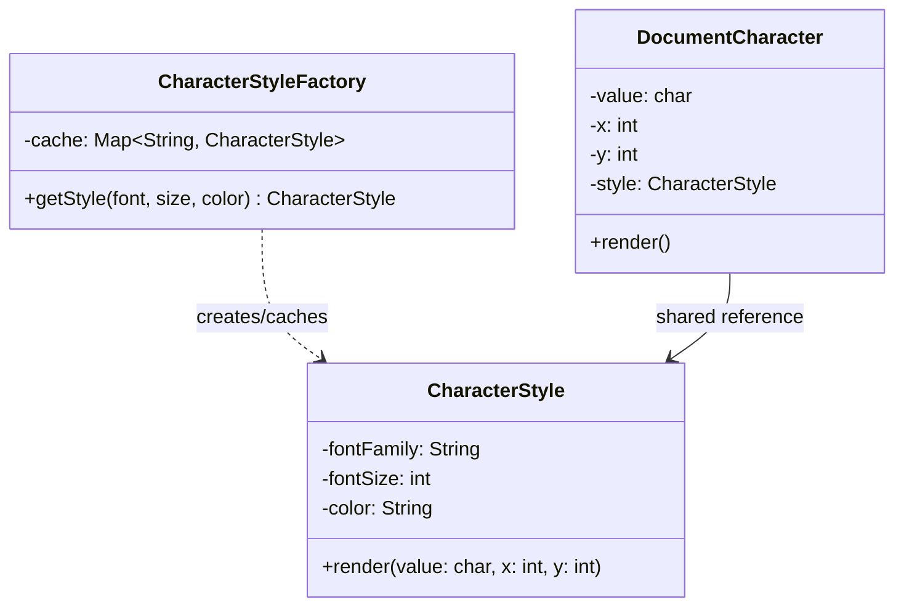

## Intent

> **Use sharing to support large numbers of fine-grained objects efficiently.**

Flyweight is the memory-optimization counterpart to Prototype (Chapter 20). Prototype avoids
repeating expensive *construction*; Flyweight avoids repeating expensive **storage** — specifically,
storing the same data redundantly across thousands or millions of objects that mostly differ only
in a small amount of per-object state.

## The Motivating Problem: A Text Editor's Characters

Imagine representing every character in a text document as an object, to support rich per-character
formatting.

```java
class Character {
    private char value;
    private String fontFamily; // e.g., "Arial" — repeated across most characters
    private int fontSize;      // e.g., 12 — repeated across most characters
    private String color;      // e.g., "black" — repeated across most characters
    private int positionX;     // unique per character
    private int positionY;     // unique per character
}
```

A 500-page document might contain a million characters. If `fontFamily`, `fontSize`, and `color`
are stored **per character object**, and the vast majority of characters share the same font,
size, and color (most documents are one font throughout, with occasional formatting changes), this
wastes enormous memory redundantly storing the identical `"Arial"`, `12`, `"black"` values a million
times over.

## The Fix: Separate Shared State From Unique State

Flyweight formalizes a specific vocabulary for this split:

- **Intrinsic state**: data that's **shared** across many objects, and doesn't depend on context —
  the font family, size, and color, if many characters share the same formatting.
- **Extrinsic state**: data that's **unique per object** and must be supplied by the calling code
  at the point of use — the character's specific position on the page, and the character value
  itself.

```java
class CharacterStyle { // the Flyweight — holds only intrinsic (shared) state
    private final String fontFamily;
    private final int fontSize;
    private final String color;

    CharacterStyle(String fontFamily, int fontSize, String color) {
        this.fontFamily = fontFamily;
        this.fontSize = fontSize;
        this.color = color;
    }

    void render(char value, int x, int y) { // extrinsic state passed in, not stored
        // draws `value` at (x, y) using this style's font/size/color
    }
}

class CharacterStyleFactory {
    private static final Map<String, CharacterStyle> cache = new HashMap<>();

    static CharacterStyle getStyle(String fontFamily, int fontSize, String color) {
        String key = fontFamily + fontSize + color;
        return cache.computeIfAbsent(key, k -> new CharacterStyle(fontFamily, fontSize, color));
    }
}
```

```java
class DocumentCharacter { // holds only extrinsic (unique) state + a shared reference
    private final char value;
    private final int x, y;
    private final CharacterStyle style; // shared — many DocumentCharacters point to the SAME object

    DocumentCharacter(char value, int x, int y, CharacterStyle style) {
        this.value = value;
        this.x = x;
        this.y = y;
        this.style = style;
    }

    void render() {
        style.render(value, x, y);
    }
}
```

```java
CharacterStyle arial12Black = CharacterStyleFactory.getStyle("Arial", 12, "black");

// A million characters using this same style share ONE CharacterStyle instance:
DocumentCharacter c1 = new DocumentCharacter('H', 0, 0, arial12Black);
DocumentCharacter c2 = new DocumentCharacter('i', 10, 0, arial12Black);
// ... 999,998 more, all referencing the exact same arial12Black object
```

Instead of a million `CharacterStyle`-equivalent data copies, there's **one** shared object for
every distinct style combination actually used in the document — if the document uses 5 different
font/size/color combinations total, there are exactly 5 `CharacterStyle` objects, no matter how
many millions of characters reference them.



## Why the Flyweight Factory Is Not Optional

Notice `CharacterStyleFactory` looks exactly like the Factory Method / caching pattern from Chapter
17 — this is not a coincidence. **The factory's caching behavior is what makes sharing actually
happen.** If calling code constructed `new CharacterStyle(...)` directly instead of going through
`CharacterStyleFactory.getStyle(...)`, every character would get its own separate
`CharacterStyle` instance again, silently defeating the entire pattern. The factory is the
enforcement mechanism, not an optional convenience.

## The Critical Constraint: Flyweights Must Be Immutable

Since a single `CharacterStyle` instance is shared across potentially millions of
`DocumentCharacter` objects, **it must never be mutated after creation.** If one caller could
change `arial12Black`'s `fontSize` field, that change would silently affect every single character
in the document sharing that style object — an even more severe version of the shallow-copy
mutation bug from Chapter 20's Prototype discussion, since here the sharing is deliberate and
pervasive by design, not an accidental oversight. Every field on a Flyweight class should be
`final`, set once at construction.

## When Flyweight Is (and Isn't) Worth the Complexity

Flyweight introduces real complexity — separating state into two categories, introducing a caching
factory, and enforcing strict immutability discipline. It's justified specifically when:

- **The number of objects is genuinely large** (thousands to millions) — for a document with 50
  characters, none of this matters; the memory savings are negligible and the added complexity is
  pure cost.
- **A meaningful fraction of each object's state is actually shareable** — if every character had
  completely unique formatting, there'd be nothing to share, and Flyweight would provide no
  benefit at all.

This is a direct KISS/YAGNI (Chapter 12) judgment call: **measure or reasonably estimate scale
before reaching for this pattern.** An interviewer asking about Flyweight is almost always
signaling a "large number of similar objects" scenario explicitly — don't apply it preemptively to
ordinary object counts.

## Summary

- Flyweight reduces memory usage by sharing common ("intrinsic") state across many objects,
  keeping only genuinely unique ("extrinsic") state per individual object.
- The factory that creates and caches flyweight instances is essential, not optional — it's the
  mechanism that guarantees sharing actually occurs rather than accidentally constructing
  duplicates.
- Flyweight objects must be strictly immutable, since a single shared instance affects every
  object referencing it — any mutation would corrupt state across all of them simultaneously.
- Reach for Flyweight only when object counts are genuinely large and a meaningful portion of
  state is actually shareable — otherwise it's unjustified complexity for no real memory benefit.

---

## Interview Questions

**1. State the Flyweight pattern's intent, and define "intrinsic" and "extrinsic" state
precisely.**
Flyweight uses sharing to support large numbers of fine-grained objects efficiently, minimizing
memory usage by separating an object's state into two categories. Intrinsic state is data that's
shared and identical across many objects, independent of context — stored once, inside the shared
flyweight object itself. Extrinsic state is data that's unique to each individual object's specific
context or usage — it cannot be shared, and must be supplied by calling code (often passed as
method parameters) rather than stored inside the shared flyweight.
*Follow-up: In the `CharacterStyle`/`DocumentCharacter` example, why is the character's position
(`x`, `y`) extrinsic rather than intrinsic?* Position is inherently unique to each individual
character's specific placement in the document — no two characters (in general) occupy the exact
same position, so there's nothing to meaningfully share; storing position inside the shared
`CharacterStyle` flyweight would be nonsensical, since it would force every character using that
style to also share the same position, which contradicts the entire purpose of having many
distinct characters at different locations.

**2. Walk through the character/document example and calculate, conceptually, the memory
savings Flyweight provides for a million-character document using only 5 distinct font/size/color
combinations.**
Without Flyweight, if `fontFamily`, `fontSize`, and `color` were stored directly on each of a
million `Character` objects, that's a million redundant copies of this shared formatting data, even
though there are genuinely only 5 distinct combinations actually in use. With Flyweight, there are
exactly 5 `CharacterStyle` objects total (one per distinct combination, thanks to the factory's
caching), and each of the million `DocumentCharacter` objects holds only a small, cheap reference
(a pointer) to one of those 5 shared objects — the memory cost of the formatting data itself is
paid exactly 5 times instead of a million times, with the million individual objects only paying
the (much smaller) cost of their own unique extrinsic state plus one reference.
*Follow-up: Does Flyweight reduce the *number* of `DocumentCharacter` objects that need to exist, or
only the memory each one consumes?* Only the latter — Flyweight doesn't reduce the number of
extrinsic-state-holding objects needed (you still need one `DocumentCharacter` per actual character
in the document, a million of them in this example); it specifically reduces how much memory each
of those million objects consumes, by having them share references to a small number of common
flyweight objects rather than each duplicating the shared data themselves.

**3. Why is the `CharacterStyleFactory`'s caching behavior described in this chapter as "not
optional" — what would happen if calling code bypassed the factory and called
`new CharacterStyle(...)` directly?**
If calling code constructed `new CharacterStyle("Arial", 12, "black")` directly for every
character instead of going through `CharacterStyleFactory.getStyle(...)`, each character would
receive its own separate `CharacterStyle` instance, even if the values were identical — this
completely defeats the pattern's purpose, since no actual sharing would occur despite the code
"looking like" it's using the Flyweight pattern structurally; the memory savings depend entirely on
the factory's deduplication/caching logic actually being used consistently by all calling code.
*Follow-up: How would you enforce, at the code level, that calling code cannot accidentally bypass
the factory and construct `CharacterStyle` instances directly?* Make `CharacterStyle`'s constructor
`private` (or package-private, accessible only to the factory in the same package), forcing all
construction to go through `CharacterStyleFactory.getStyle(...)` — this is structurally very
similar to the private-constructor enforcement technique used for Singleton in Chapter 16, applied
here to guarantee the sharing/caching behavior can't be silently bypassed.

**4. Explain why Flyweight objects must be strictly immutable, and describe the specific failure
mode that would occur if this constraint were violated.**
Because a single Flyweight instance (like one `CharacterStyle` object) is deliberately shared by
reference across potentially millions of other objects, any mutation to that shared instance would
be immediately and silently visible through every single object holding a reference to it — for
example, if some code called a hypothetical `arial12Black.setFontSize(14)`, every one of the
million characters sharing that exact style object would suddenly and unexpectedly render at the
new font size, even ones whose formatting was never intended to change. This is the same
shallow-copy mutation danger discussed in Chapter 20's Prototype pattern, but here it's dramatically
amplified in scale and severity, since the sharing is the pattern's entire deliberate purpose rather
than an accidental byproduct.
*Follow-up: If a legitimate future requirement needed to change a document's font size across
"all characters using the Arial 12 Black style," how would you correctly implement that change
given Flyweight's immutability constraint?* You wouldn't mutate the existing shared
`CharacterStyle` object — instead, you'd create (or retrieve from the factory's cache) a *new*
`CharacterStyle` instance representing the desired new combination (e.g., "Arial 14 Black"), and
update the relevant `DocumentCharacter` objects' `style` field references to point to this new
flyweight instance instead of the old one — respecting immutability by creating new shared state
rather than mutating existing shared state in place.

**5. How does the Flyweight pattern relate to, and differ from, simply caching or memoizing
expensive computation results — is Flyweight just "caching," under a different name?**
Both involve reusing a previously-created object or value rather than recomputing/reconstructing
it, but they solve different underlying problems: general caching/memoization is primarily about
avoiding *repeated expensive computation* (similar to Prototype's motivation), while Flyweight is
specifically about reducing *memory footprint* by sharing genuinely-identical state across a large
number of otherwise-distinct objects, with the explicit intrinsic/extrinsic state-splitting
discipline as a defining structural characteristic. A cache could hold entries that are never
actually shared as object references by multiple different consumers simultaneously; Flyweight's
defining characteristic is precisely that deliberate, simultaneous, shared-by-reference usage across
many context objects.
*Follow-up: Could a caching mechanism be used to implement the "factory" half of the Flyweight
pattern, and if so, does that make Flyweight simply "a caching factory pattern in disguise"?*
Yes, the factory half of Flyweight (like `CharacterStyleFactory`) is indeed implemented using
caching mechanics very similar to general memoization — but reducing Flyweight entirely to "just a
caching factory" misses its other defining, equally essential half: the deliberate intrinsic/
extrinsic state separation on the *consuming* objects (`DocumentCharacter`) themselves, which a
generic caching factory pattern alone doesn't prescribe or require.

**6. Give a real-world Java or JDK example that resembles the Flyweight pattern.**
Java's `Integer.valueOf()` (and the automatic autoboxing of small integer literals) caches and
reuses `Integer` objects for values between -128 and 127 by default — calling
`Integer.valueOf(100)` multiple times returns the exact same cached `Integer` object instance rather
than constructing a new one each time, which is a direct, real-world application of Flyweight's
core "share immutable, frequently-reused small values rather than constructing duplicates"
principle, since `Integer` objects are immutable and small integer values are extremely common
throughout typical Java programs.
*Follow-up: Why is the cached range limited to -128 through 127, rather than caching all possible
integer values?* Caching every possible `int` value (over 4 billion distinct values) would itself
consume enormous memory, defeating Flyweight's entire memory-saving purpose — the JDK designers
chose a specific, bounded range (-128 to 127) based on the empirical observation that small integer
values are disproportionately common in typical programs (loop counters, small counts, array
indices), making this bounded range a practical, worthwhile trade-off between memory savings and
cache size, rather than attempting to cache the full, impractically large range of all possible
integer values.

**7. Is String interning in Java (`String.intern()`, and the automatic interning of string
literals) an example of the Flyweight pattern? Explain the connection.**
Yes — Java's string pool mechanism, where identical string literals (like `"hello"` appearing
multiple times in source code) are automatically stored and shared as a single object instance
rather than creating separate `String` objects for each occurrence, is a direct real-world
application of Flyweight: `String` objects are immutable (satisfying the strict immutability
constraint discussed earlier), and the JVM's string pool acts as the caching factory, ensuring
identical string content is stored exactly once and shared by reference across every place in the
program that uses that exact literal value.
*Follow-up: Does calling `new String("hello")` explicitly (rather than using the literal
`"hello"`) bypass this Flyweight-style sharing, and if so, why does this matter?* Yes — explicitly
calling `new String("hello")` deliberately creates a new, separate `String` object on the heap,
distinct from the pooled/shared literal instance, even though its *content* is identical; this is
precisely analogous to the earlier discussion of bypassing `CharacterStyleFactory` by calling
`new CharacterStyle(...)` directly — in both cases, going around the sharing mechanism produces a
functionally-correct but memory-wasteful duplicate object, which is why Java style guides generally
discourage `new String("literal")` in favor of using string literals directly, to take advantage of
the automatic Flyweight-style pooling.

**8. In an LLD interview for a "design a chess game" problem (Chapter 50), how might Flyweight
apply to representing chess pieces on the board?**
If a chess application needed to represent many chess pieces (say, in a system managing thousands
of simultaneous games, or rendering large numbers of pieces across many board visualizations), the
intrinsic state (each piece type's movement rules, appearance/icon, and display name — e.g., "how a
Bishop moves" is identical for every Bishop across every game) could be shared via Flyweight
objects (one `PieceType` flyweight for Bishop, one for Knight, etc.), while the extrinsic state
(a specific piece's current position on a specific board, and which specific game/board it belongs
to) would be held separately per actual piece instance on a given board.
*Follow-up: For a single, ordinary chess game with only 32 pieces on one board, would Flyweight
be justified here, or would this be an example of applying the pattern prematurely?* For a single
ordinary game with just 32 pieces, Flyweight would very likely be unjustified over-engineering —
32 objects is nowhere near the scale where memory savings from sharing intrinsic state would
matter, and the added complexity (separate `PieceType` flyweight classes, a factory, careful
intrinsic/extrinsic separation) provides no meaningful benefit at this small scale; Flyweight would
only become genuinely justified if the interviewer specifically signaled a much larger scale
requirement, such as simultaneously running thousands of games or rendering large-scale
visualizations involving many boards at once.

**9. How would you unit test the `CharacterStyleFactory` to verify it's actually providing
shared instances rather than accidentally constructing duplicates?**
Call `CharacterStyleFactory.getStyle("Arial", 12, "black")` twice with identical arguments and
assert that the two returned references are the *exact same object*, using Java's `==` reference
equality operator rather than `.equals()` — this directly verifies the sharing behavior the pattern
depends on, since two separately-constructed but value-equal `CharacterStyle` objects would pass an
`.equals()`-based check (if `equals()` were overridden to compare fields) even if they were
actually two distinct objects in memory, which would represent exactly the "sharing isn't
actually happening" bug this pattern is meant to prevent.
*Follow-up: Would this same `==` reference-equality test also be an appropriate way to verify
Java's own `Integer.valueOf()` caching behavior discussed earlier?* Yes — `Integer.valueOf(100) ==
Integer.valueOf(100)` would correctly return `true` for values within the cached range (-128 to
127), directly demonstrating the same reference-sharing property; testing the same expression with
a value outside that range (like `Integer.valueOf(200) == Integer.valueOf(200)`) would return
`false`, since values outside the cached range are not guaranteed to be shared and typically
produce distinct `Integer` object instances each time.

**10. Can the Flyweight pattern be combined with the Factory Method pattern (Chapter 17) in a way
that goes beyond just "the flyweight factory looks like a Factory Method"? Explain any deeper
connection or distinction.**
The `CharacterStyleFactory.getStyle()` method does technically satisfy Factory Method's core
intent (deferring/encapsulating the decision of which object to return based on input parameters),
but Flyweight's factory specifically adds a caching/deduplication responsibility on top of ordinary
Factory Method's type-selection responsibility — a plain Factory Method implementation has no
inherent obligation to return the same instance for equivalent inputs (it's equally valid for a
Factory Method to always construct a fresh instance), while a Flyweight factory's caching behavior
is not optional, but essential to the pattern's entire purpose, as established earlier in this
chapter.
*Follow-up: Is every Flyweight factory therefore a Factory Method, but not every Factory Method a
Flyweight factory?* Yes, that's an accurate way to state the relationship — a Flyweight factory is
a more specialized, constrained version of Factory Method specifically committed to caching and
sharing instances for identical inputs, while ordinary Factory Method implementations (like
`VehicleFactory` from Chapter 17) have no such caching commitment or requirement, making Flyweight
factories a strict subset of the broader Factory Method pattern category.

**11. What would go wrong if the `DocumentCharacter` class in the example also stored a copy of
`fontFamily`, `fontSize`, and `color` directly as its own fields, in addition to holding a
reference to the shared `CharacterStyle` flyweight?**
This would completely defeat the pattern's memory-saving purpose while adding unnecessary
complexity — you'd be paying the redundant per-object memory cost for the formatting data (the
exact problem Flyweight was introduced to solve) *and* additionally maintaining a separate,
potentially-inconsistent shared reference, creating a genuine risk of the two representations
(the character's own copied fields versus the shared flyweight's fields) drifting out of sync if
either were ever updated independently, since there'd be two separate sources of truth for what
should be a single, shared piece of state.
*Follow-up: Is there ever a legitimate reason to store a "cached" or "denormalized" copy of
intrinsic state directly on the extrinsic-state-holding object, despite this risk?* In some
performance-sensitive scenarios, briefly caching a computed or derived value locally (rather than
repeatedly dereferencing the shared flyweight object) might be considered as a micro-optimization
if profiling specifically showed the extra indirection was a genuine bottleneck — but this would be
an unusual, narrowly-justified exception requiring careful invalidation logic to keep the cached
copy in sync, not a general practice, since it reintroduces exactly the data-duplication and
consistency risks Flyweight is designed to eliminate.

**12. How would the Flyweight pattern's applicability change if, instead of most characters
sharing just 5 font/size/color combinations, every single character in the document had
completely unique, one-off formatting (no two characters sharing the exact same combination)?**
In this scenario, Flyweight would provide essentially zero benefit — if there's no meaningful
overlap or repetition in the "intrinsic" state across objects, the factory's cache would end up
holding as many distinct `CharacterStyle` objects as there are characters in the document, with no
actual sharing occurring at all; you'd have paid the full complexity cost of the pattern (separate
classes, a factory, immutability discipline) while gaining none of its memory-saving benefit, since
"one unique flyweight per object" is functionally equivalent to "no flyweight pattern at all," just
with unnecessary extra indirection.
*Follow-up: Does this mean Flyweight's viability depends entirely on the *distribution* of shared
versus unique state across the actual objects in a system, not just the total object count alone?*
Yes, precisely — object count alone (a million characters) isn't sufficient justification for
Flyweight; what matters is the *ratio* of distinct intrinsic-state combinations to total object
count — a million objects sharing only 5 distinct combinations is an excellent Flyweight candidate,
while a million objects each with entirely unique combinatinos provides no sharing opportunity at
all, regardless of how large the total object count happens to be.

**13. In an LLD interview, if you're not sure whether a given scenario's object count and sharing
ratio genuinely justify Flyweight's added complexity, what would you say to the interviewer rather
than silently guessing?**
Explicitly state your reasoning and ask for the missing information needed to make a confident
judgment call: "This could benefit from the Flyweight pattern if we expect a very large number of
these objects with a lot of shared, repeated state — could you clarify the expected scale here, or
should I assume it's large enough to warrant that optimization?" This demonstrates that you
understand Flyweight's specific justification criteria (scale and sharing ratio) rather than either
reflexively applying it everywhere or dismissing it without consideration, and it invites the
interviewer to provide the scale information that would actually determine the correct design
choice.
*Follow-up: If the interviewer responds "let's not worry about that level of optimization for
now, just focus on the core design," how should this affect the rest of your solution?* Proceed
with the simpler, non-Flyweight design (storing all state directly on each object, without the
intrinsic/extrinsic split or a caching factory), while optionally noting briefly that Flyweight
could be introduced later if profiling or scale requirements revealed genuine memory pressure —
this respects the interviewer's explicit signal to prioritize simplicity for now, consistent with
the KISS/YAGNI discipline this series has emphasized throughout, rather than over-engineering a
solution to a problem the interviewer has explicitly said isn't the current focus.

**14. Of all seven structural patterns in this Part, Flyweight is often considered the most
narrowly-applicable and least frequently needed in typical LLD interview problems. Why might that
be, and does that mean it's safe to deprioritize learning it thoroughly?**
Flyweight's narrow applicability stems from its very specific justification criteria (genuinely
large object counts combined with a meaningful, exploitable degree of shared state) — many typical
LLD interview problems (parking lots, elevators, booking systems) don't naturally involve object
counts large enough (thousands to millions) for memory optimization to become a central design
concern, unlike patterns such as Strategy, Factory Method, or Observer, which apply naturally to
almost any object-oriented design regardless of scale. This doesn't mean it's safe to skip
entirely, though — interviewers do sometimes specifically probe for Flyweight awareness with
explicitly large-scale scenarios (a text editor, a game engine, a large-scale simulation), and
demonstrating the ability to recognize intrinsic/extrinsic state separation is a valuable, distinct
skill from the more commonly-applied patterns, worth understanding even if it's applied less
frequently in practice.
*Follow-up: How would you personally prioritize your remaining interview preparation time between
thoroughly mastering Flyweight versus, say, spending more time on Strategy or Observer, given
everything discussed in this chapter?* Given Flyweight's narrower applicability, it's reasonable to
prioritize deep, thorough mastery of broadly-applicable patterns like Strategy and Observer (which
will very likely come up directly or indirectly in the majority of LLD interviews) over spending
equivalent depth of preparation time on Flyweight — understanding Flyweight's core intent and being
able to recognize and apply it correctly *if* explicitly prompted by a large-scale scenario is
sufficient, without needing the same level of memorized depth (variations, edge cases, extensive
follow-up scenarios) that a more universally-applicable pattern like Strategy would warrant.
