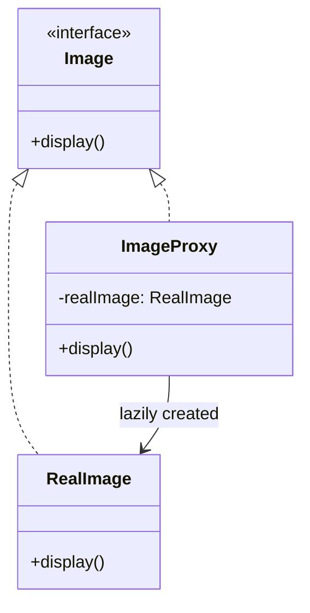

## Intent

> **Provide a surrogate or placeholder for another object to control access to it.**

Proxy closes out Part 4. Structurally, it looks nearly identical to Decorator (Chapter 24) — a
class implementing the same interface as the object it wraps — but the **intent** is different
enough to matter, and that difference is one of the most commonly tested distinctions in this
entire series.

## The Core Idea: Same Interface, Controlled Access

```java
interface Image {
    void display();
}

class RealImage implements Image {
    private final String filename;

    RealImage(String filename) {
        this.filename = filename;
        loadFromDisk(); // expensive — happens immediately on construction
    }

    private void loadFromDisk() { /* slow disk I/O */ }

    public void display() {
        System.out.println("Displaying " + filename);
    }
}
```

If `RealImage` objects are constructed eagerly for a gallery of 100 images, all 100 expensive disk
loads happen immediately — even for images the user never scrolls down to see.

## Four Common Proxy Variants

### 1. Virtual Proxy — Defer Expensive Work Until Actually Needed

```java
class ImageProxy implements Image {
    private final String filename;
    private RealImage realImage; // not created yet

    ImageProxy(String filename) {
        this.filename = filename;
    }

    public void display() {
        if (realImage == null) {
            realImage = new RealImage(filename); // expensive load happens here, lazily
        }
        realImage.display();
    }
}
```

The expensive `RealImage` is only constructed the **first time** `display()` is actually called —
if a user never scrolls to an image, its disk load never happens at all.

### 2. Protection Proxy — Control Who's Allowed to Access the Real Object

```java
class ProtectedDocument implements Document {
    private final RealDocument realDocument;
    private final User currentUser;

    ProtectedDocument(RealDocument realDocument, User currentUser) {
        this.realDocument = realDocument;
        this.currentUser = currentUser;
    }

    public void edit(String content) {
        if (!currentUser.hasPermission("EDIT")) {
            throw new SecurityException("User lacks edit permission");
        }
        realDocument.edit(content);
    }
}
```

The proxy enforces an access-control check **before** delegating to the real object — the real
object itself contains no permission logic at all, keeping that concern cleanly separated (SRP,
Chapter 7).

### 3. Remote Proxy — Represent an Object Living on Another Machine

```java
class RemoteServiceProxy implements PaymentService {
    public boolean chargeCard(String cardToken, double amount) {
        // internally: serializes the request, sends it over the network to a remote server,
        // deserializes the response — completely hidden from the caller
        return sendNetworkRequest(cardToken, amount);
    }
}
```

Calling code interacts with `RemoteServiceProxy` exactly as if it were a local `PaymentService`
implementation — the network communication is entirely hidden behind the familiar local interface.
(Java RMI and gRPC-generated client stubs are real-world instances of exactly this variant.)

### 4. Caching Proxy — Avoid Repeating Expensive Calls

```java
class CachingWeatherServiceProxy implements WeatherService {
    private final WeatherService realService;
    private final Map<String, WeatherData> cache = new HashMap<>();

    CachingWeatherServiceProxy(WeatherService realService) {
        this.realService = realService;
    }

    public WeatherData getWeather(String city) {
        return cache.computeIfAbsent(city, realService::getWeather);
    }
}
```

Repeated calls for the same city are served from the cache instead of hitting the real (presumably
slow or rate-limited) weather service again.



## Proxy vs. Decorator: The Precise Distinction

Both patterns wrap an object behind the same shared interface — the difference is entirely about
**intent**, and it's worth stating as precisely as possible, since interviewers commonly probe
exactly this line:

| | Decorator (Ch. 24) | Proxy (this chapter) |
|---|---|---|
| **Purpose** | *Add* new behavior/responsibility | *Control access* to the underlying object |
| **Relationship to wrapped object** | Enhances it | Guards, defers, or represents it |
| **Is the wrapped object always fully accessible?** | Yes — decorator always delegates through | Not necessarily — proxy may deny, defer, or redirect access entirely |
| **Typical stacking** | Designed to be stacked (multiple decorators) | Usually one proxy per real object, not chained |

**A useful mental test:** if you removed the wrapper, would the underlying object's behavior be
*fundamentally the same, just less feature-rich* (Decorator), or would removing the wrapper change
**whether, when, or how** the object can be reached at all (Proxy)? A `MilkDecorator` doesn't
control *whether* you get coffee — it just adds milk. An `ImageProxy` controls *when* the real
image actually loads; a `ProtectedDocument` controls *whether* the edit happens at all.

## Proxy vs. Adapter: A Quick Reminder

Since this chapter closes out the "wrapping" family of patterns, it's worth a final recap:
Adapter (Ch. 21) changes the **interface**; Decorator (Ch. 24) adds **behavior** while keeping the
interface unchanged; Proxy controls **access** while also keeping the interface unchanged. All
three can look structurally similar in a UML diagram — the distinguishing question is always
**"what is this wrapper's actual job?"**, not "does it hold a reference to another object?"

## Summary

- Proxy provides a surrogate for another object, controlling access to it — through deferred
  creation (virtual), permission checks (protection), network transparency (remote), or caching.
- Structurally near-identical to Decorator (same interface, wraps an object) — the distinguishing
  factor is intent: Decorator *adds* capability; Proxy *controls or mediates* access.
- Real-world Java examples include lazy-loading proxies (Hibernate/JPA entities), Spring AOP
  proxies (which add cross-cutting behavior like transactions via dynamically-generated proxy
  classes), and RMI/gRPC client stubs (remote proxies).
- When distinguishing Proxy from Decorator or Adapter in an interview, focus on the wrapper's
  actual purpose, not its structural shape — all three can look identical in a class diagram.

---

## Interview Questions

**1. State the Proxy pattern's intent, and name the four common variants covered in this
chapter.**
Proxy provides a surrogate or placeholder for another object, controlling access to it in some
specific way. The four common variants are: virtual proxy (deferring expensive object creation
until it's actually needed), protection proxy (enforcing access-control checks before allowing an
operation), remote proxy (representing an object that lives on a different machine, hiding network
communication behind a local-looking interface), and caching proxy (avoiding repeated expensive
calls by serving previously-computed results).
*Follow-up: Do all four variants share the same underlying structural shape, despite their
different purposes?* Yes — all four implement the same interface as the real object they wrap or
represent, and all four sit between the caller and the real object, intercepting calls to add their
specific access-control behavior before (and sometimes instead of, or after) delegating to the
real object; the variants differ in *why* they intercept access, not in the basic structural
mechanism they use to do so.

**2. Walk through the `ImageProxy` example and explain precisely what problem it solves that
constructing `RealImage` objects directly would not.**
If a gallery constructs 100 `RealImage` objects directly, all 100 expensive disk-loading operations
happen immediately at construction time, regardless of whether the user ever actually views each
image — wasting time and resources loading images that may never be displayed. `ImageProxy` defers
the expensive `RealImage` construction until `display()` is actually called for the first time on
that specific proxy — images never scrolled to by the user never trigger their expensive load at
all, potentially saving significant time and resources depending on user behavior.
*Follow-up: What happens if `display()` is called multiple times on the same `ImageProxy`
instance — does the expensive `RealImage` construction happen again each time?* No — the proxy
checks `if (realImage == null)` before constructing, so the expensive construction happens exactly
once, on the first call; subsequent calls to `display()` on the same proxy instance reuse the
already-constructed `realImage` reference, correctly combining lazy initialization with
memoization of the constructed object.

**3. Explain the precise distinction between Proxy and Decorator, given that both wrap an object
behind the same shared interface.**
The distinction is about intent and effect on access, not structure: Decorator's purpose is to
*add* new behavior or responsibility to an object while always fully delegating through to it —
the wrapped object's core behavior remains completely accessible, just enhanced. Proxy's purpose is
to *control access* to the wrapped object — potentially deferring when it's created (virtual),
denying access entirely under certain conditions (protection), redirecting access across a network
boundary (remote), or substituting a cached result instead of invoking the real object at all
(caching). A useful test: removing a Decorator makes the object less feature-rich but still fully
and identically reachable; removing a Proxy changes *whether, when, or how* the underlying object
can be reached at all.
*Follow-up: Could a caching proxy be viewed as "adding behavior" (caching) in a way that sounds
similar to what a Decorator does — does this create genuine ambiguity between the two patterns in
this specific case?* This is a legitimate gray area some sources acknowledge — a caching proxy does
technically add behavior (checking and populating a cache) in a way that superficially resembles
Decorator's "add behavior" framing. The distinguishing factor that keeps it classified as Proxy
specifically is that its purpose is fundamentally about *controlling and potentially avoiding*
calls to the real object (returning a cached result *instead of* invoking the real object), rather
than *enhancing* every call that does reach the real object — Decorator always lets the call reach
the wrapped object and adds behavior around that guaranteed delegation, while a caching proxy may
prevent the real object from being invoked at all for a given call.

**4. How does the Protection Proxy example demonstrate the Single Responsibility Principle from
Chapter 7?**
By placing the permission-checking logic (`currentUser.hasPermission("EDIT")`) inside
`ProtectedDocument` rather than inside `RealDocument` itself, the two classes each maintain one
clear, separate responsibility: `RealDocument` is responsible purely for the mechanics of document
editing, while `ProtectedDocument` is responsible purely for access control — a change to
permission rules (say, adding role-based permissions) only requires modifying
`ProtectedDocument`, with zero risk of that change affecting `RealDocument`'s actual editing logic,
and vice versa.
*Follow-up: What would be a warning sign that a Protection Proxy design was violating SRP by
taking on too much responsibility beyond access control?* If `ProtectedDocument` started containing
substantial editing-related business logic of its own (beyond simply checking permissions and
delegating), rather than purely gatekeeping access before delegating fully to `RealDocument`, that
would suggest the proxy has taken on responsibilities beyond its intended access-control purpose —
the proxy's `edit()` method should contain permission-checking logic and a delegation call, not a
duplicated or partial reimplementation of the actual editing behavior itself.

**5. In an LLD interview, if asked to explain the difference between a Remote Proxy and a
straightforward network client class that makes HTTP calls, what would you say?**
The key distinguishing characteristic of a Remote Proxy, versus an arbitrary network client class,
is that it implements the *exact same interface* that a local, in-process implementation of the
same functionality would implement — calling code interacts with a Remote Proxy exactly as if it
were calling a local object, with the network communication (serialization, transport, deserialization)
entirely hidden behind that familiar interface, rather than being exposed through
network-specific method signatures (like methods explicitly named `sendHttpRequest()` or requiring
callers to handle HTTP status codes directly). A generic "network client" class doesn't necessarily
make this specific promise of interface-transparency with a corresponding local counterpart.
*Follow-up: Does using a Remote Proxy mean calling code can be completely unaware of whether it's
talking to a local or remote implementation, and is that always a good thing?* In principle, yes —
this transparency is Remote Proxy's core value proposition, but it's a genuinely debated trade-off
in distributed systems design: hiding network calls behind a familiar local-looking interface can
lead callers to forget about network-specific failure modes (timeouts, partial failures, latency)
that don't exist with genuinely local calls — some architects specifically argue *against* fully
transparent remote proxies for this reason, preferring interfaces that make the network boundary
explicit (e.g., returning a `Future` or `CompletableFuture`, or declaring checked exceptions
specific to network failures) rather than pretending the remote call is indistinguishable from a
local one.

**6. How does a caching proxy differ from simply adding a caching layer directly inside the real
service class itself (e.g., adding a cache field directly to a `WeatherService`
implementation)?**
A caching proxy keeps the caching concern entirely separate from the real service's own
implementation — `RealWeatherService` remains focused purely on how to actually fetch weather data
(from an API, say), with zero knowledge that caching exists at all, while
`CachingWeatherServiceProxy` handles caching as its own separate, focused responsibility, wrapping
whichever `WeatherService` implementation it's given. Baking caching directly into the real
service's own class would mix two independent concerns (fetching weather data, and caching
previously-fetched results) into a single class, and would make it harder to use the real service
*without* caching in contexts where that's specifically desired (like a test verifying every call
correctly hits the real, uncached implementation).
*Follow-up: Would this separation also make it easier to swap caching strategies (e.g., an
in-memory cache versus a distributed cache like Redis) without touching the real service class at
all?* Yes — since the caching logic lives entirely inside the proxy, swapping
`CachingWeatherServiceProxy`'s internal cache implementation (from a plain `HashMap` to a
Redis-backed cache) requires zero changes to `RealWeatherService` at all; you could even have
multiple different caching proxy implementations (an in-memory one for local development, a
Redis-backed one for production) both wrapping the same unchanged real service, selected via
configuration or dependency injection.

**7. Explain how Spring's AOP (Aspect-Oriented Programming) proxies, which power features like
`@Transactional`, relate to the Proxy pattern discussed in this chapter.**
When a Spring-managed bean method is annotated with `@Transactional`, Spring doesn't modify your
actual class's bytecode directly — instead, it typically creates a dynamically-generated proxy
object implementing the same interface (or extending the same class) as your bean, and that proxy
intercepts calls to your annotated methods, wrapping them with transaction-management logic
(beginning a transaction, committing or rolling back based on success/failure) before and after
delegating to your real object's actual method implementation. This is a direct, large-scale,
framework-level application of the Proxy pattern — specifically resembling a hybrid of protection
(controlling whether/how the call proceeds based on transactional state) and enhancement-adjacent
behavior, though its primary classification remains proxy-like access control and mediation rather
than pure Decorator-style behavior addition.
*Follow-up: Why does this proxy-based mechanism explain a commonly-encountered Spring "gotcha"
where calling a `@Transactional` method from another method *within the same class* doesn't
actually trigger the transactional behavior?* Because Spring's proxy-based AOP only intercepts
calls that go *through* the proxy object from external callers — a method call made directly from
one method to another *within the same class instance* (`this.someTransactionalMethod()`) bypasses
the proxy entirely, calling the real object's method directly rather than routing through the
proxy's interception logic, so the transactional behavior (or any other proxy-added behavior) never
gets applied; this is a well-known, frequently-debugged limitation directly caused by the
proxy-based implementation mechanism.

**8. How would you unit test the `ImageProxy` class to verify that `RealImage` is genuinely not
constructed until `display()` is called, rather than at `ImageProxy`'s own construction time?**
This requires being able to observe or verify when `RealImage`'s (expensive) construction actually
happens — one approach is to add some form of instrumentation or a spy/mock in place of
`RealImage`'s construction (for example, refactoring `ImageProxy` to accept a `Supplier<RealImage>`
or a small factory it can inject a test double into) and assert that this supplier/factory is
never invoked until after `ImageProxy.display()` is called for the first time, and is invoked
exactly once even if `display()` is called multiple times afterward.
*Follow-up: Does testing this specific "laziness" behavior require any different testing
techniques compared to testing simpler, non-lazy classes covered in earlier chapters?* Yes,
somewhat — testing laziness specifically requires verifying the *absence* of an action (no
construction happening) up to a certain point, and then the *presence* of that action happening at
exactly the right subsequent trigger point and not sooner — this kind of "verify no side effect
happened yet, then verify it happens exactly once at the right moment" testing pattern is a bit more
involved than simply asserting a return value, and often benefits from dependency injection (as
suggested above) specifically to make the underlying construction event observable and verifiable
in a test.

**9. In an LLD interview for a "design a document editor with access control" problem, how would
you combine the Protection Proxy pattern with concepts from earlier chapters, like the Strategy
pattern (previewed in Chapter 8, formalized in Chapter 28) for handling different permission
rules?**
Rather than hardcoding a single permission check (`currentUser.hasPermission("EDIT")`) directly
inside the proxy, you could inject a `PermissionPolicy` interface (Strategy-style) into
`ProtectedDocument`, with different implementations for different access-control models (a simple
role-based policy, an owner-only policy, a time-based policy allowing edits only during business
hours) — the proxy's `edit()` method would delegate the actual permission decision to the injected
`PermissionPolicy`, rather than hardcoding one specific rule, letting the access-control logic
itself vary independently and be swapped without modifying `ProtectedDocument`'s own structure.
*Follow-up: Does this combination of Proxy and Strategy represent two separate patterns solving
two separate problems, or could it be argued that this is really just one unified design?* This is
a good example of two separate patterns cleanly solving two genuinely separate concerns within one
overall design: Proxy addresses "where and how should access-control interception happen" (wrapping
`RealDocument` to intercept calls), while Strategy addresses "how should the actual permission
decision be computed, and how can that decision logic vary" (the injected `PermissionPolicy`) —
recognizing that a design combines two distinct patterns, each solving its own distinct sub-problem,
is a more precise and interview-favorable way to describe the design than treating it as one
monolithic, unnamed solution.

**10. Can a Virtual Proxy and a Caching Proxy be combined for the same underlying object — for
example, could `ImageProxy` both lazily construct `RealImage` on first access AND cache the
rendered output to avoid redundant re-rendering on subsequent `display()` calls?**
Yes, and this combination is common in practice — the lazy-construction behavior already shown in
`ImageProxy` (deferring `RealImage`'s expensive construction until first needed) is itself a form
of "caching" the constructed object across subsequent calls (the `if (realImage == null)` check
prevents re-construction), and you could layer additional caching on top for other expensive
operations, like caching a rendered thumbnail representation after the first `display()` call so
subsequent calls reuse the rendered result rather than re-rendering from the loaded image data each
time — both the virtual-proxy laziness and the caching-proxy result-reuse can coexist within the
same class, addressing two related but distinct expensive-operation concerns (expensive
construction, and separately, expensive rendering).
*Follow-up: At what point would combining too many proxy responsibilities (virtual, caching,
protection, all in one class) start to violate the Single Responsibility Principle discussed
earlier in this chapter?* If a single proxy class accumulated distinctly independent concerns that
could each reasonably vary or need modification for entirely unrelated reasons (lazy construction
timing changing independently of caching strategy changing independently of permission rules
changing), that would be a signal to split responsibilities into separate, individually-focused
proxy layers, potentially stacking multiple proxies (a caching proxy wrapping a protection proxy
wrapping the real object, for instance) rather than cramming every concern into one class — mirroring
the same SRP-driven decomposition reasoning applied consistently throughout this series.

**11. Is it possible to stack multiple proxies around the same real object, similar to how
Decorators are designed to be stacked? If so, does this work the same way structurally?**
Yes, structurally it works the same way as stacking Decorators — since a proxy implements the same
interface as the object it wraps, a proxy-wrapped object can itself be wrapped by another proxy
(for example, wrapping `RealDocument` first in a `ProtectionProxy` for access control, then wrapping
*that* proxy in a `CachingProxy` for performance, since the outer caching layer still sees
something implementing the `Document` interface). The key difference from typical Decorator usage
is that stacking proxies is less commonly emphasized as a core use case in most textbook
descriptions of Proxy (which more often focus on a single proxy layer per real object), but nothing
structurally prevents it, and it can be a legitimate, useful technique when multiple independent
access-control concerns genuinely need to be layered.
*Follow-up: In a stacked Protection-then-Caching proxy arrangement, does the order of wrapping
matter — would wrapping Caching-then-Protection produce different behavior?* Yes, order matters
here in a meaningful way — if `CachingProxy` wraps `ProtectionProxy` (Protection innermost, Caching
outermost), a permission check would need to happen (and potentially fail) before every cache
lookup even attempts to occur, which might mean a cached result is never returned to an
unauthorized user, correctly enforcing security on every call. If instead `ProtectionProxy` wrapped
`CachingProxy` (Caching innermost), a cached result computed once by an authorized call could
potentially bypass a subsequent permission check for a different, unauthorized user depending on
exactly how the wrapping and delegation were implemented — this is a subtle, security-relevant
design detail worth reasoning through carefully rather than assuming stacking order is arbitrary.

**12. How does a Java-based ORM framework like Hibernate's "lazy loading" of entity associations
relate to the Virtual Proxy pattern discussed in this chapter?**
When Hibernate loads an entity with a lazily-fetched association (say, an `Order` entity with a
`@OneToMany(fetch = FetchType.LAZY)` list of `OrderItem`s), it typically doesn't load the actual
`OrderItem` records from the database immediately — instead, it substitutes a dynamically-generated
proxy object (or a proxy-backed collection) that defers the actual database query until the
association is first genuinely accessed (e.g., calling `.size()` or iterating over the list) —
this is a direct, large-scale, real-world application of the Virtual Proxy pattern, deferring
expensive work (a database query) until it's actually needed, exactly mirroring `ImageProxy`'s
deferred `RealImage` construction.
*Follow-up: What's a commonly-encountered bug related to this Hibernate lazy-loading proxy
mechanism, often called the "LazyInitializationException"?* If code attempts to access a
lazily-loaded association *after* the database session/transaction that originally loaded the
parent entity has already been closed, Hibernate's lazy-loading proxy has no active database
connection available to perform the deferred query it was waiting to execute, resulting in a
`LazyInitializationException` — this is a direct, practical consequence of the Virtual Proxy
pattern's deferred-execution nature: the deferred work must eventually actually execute
successfully when finally triggered, and if the necessary context (an open database session, in
this case) is no longer available at that trigger point, the deferred operation fails.

**13. If an interviewer explicitly asked you to implement a rate-limiting mechanism for calls to
an external API — allowing only a certain number of calls per minute — would you model this using
the Proxy pattern, and if so, which of the four variants would it most closely resemble?**
Yes, this is a natural fit for Proxy — you'd create a `RateLimitingProxy` implementing the same
interface as the real external API client, intercepting each call to check whether the current
call rate is within the allowed limit before deciding whether to delegate to the real
implementation (or instead reject/delay the call if the limit has been exceeded). This most closely
resembles a **protection proxy** in structure (controlling *whether* a call is allowed to proceed,
based on a condition — here, rate limits, rather than user permissions), though it also shares some
characteristics with a caching proxy's "avoid unnecessary calls to the real object" spirit.
*Follow-up: How would you handle the case where a call is rejected due to exceeding the rate
limit — would you throw an exception, return a special value, or use some other mechanism, and how
does this design decision relate to concepts from earlier chapters?* Throwing a specific, dedicated
exception type (like a custom `RateLimitExceededException`) is generally the clearest approach,
since it makes the failure mode explicit and distinguishable from other kinds of failures the real
API call might produce, allowing calling code to specifically catch and handle (e.g., retry after a
delay) this particular failure case — this connects back to the LSP discussion in Chapter 9 about
not introducing exceptions inconsistent with what callers of the shared interface would reasonably
expect; documenting this proxy-specific exception clearly as part of the interface's contract (or
using a checked exception, if appropriate) helps preserve substitutability expectations for callers.

**14. Summarize the full "wrapping pattern family" covered across this Part (Adapter, Decorator,
Proxy — noting that Facade and Bridge also involve wrapping/composition, but in different ways),
and give a one-sentence distinguishing test for each of the three most easily confused: Adapter,
Decorator, and Proxy.**
All three wrap another object behind an interface and delegate to it in some way, but their
purposes are distinct: **Adapter** exists to translate between two genuinely *different*
interfaces that wouldn't otherwise be compatible — the test is "does the wrapper implement a
*different* interface than the wrapped object, bridging a real incompatibility?" **Decorator**
exists to *add* stackable behavior while preserving full, unhindered access to the wrapped
object's original capability — the test is "does the wrapper always fully delegate through,
merely enhancing rather than gating access?" **Proxy** exists to *control access* to the wrapped
object — potentially deferring, denying, redirecting, or substituting a cached result instead of
that access — the test is "does the wrapper potentially change *whether, when, or how* the real
object's behavior is actually reached, rather than just adding to it?"
*Follow-up: Having now covered all seven structural patterns in this Part, what's the single most
important overarching lesson to carry forward into Part 5 (Behavioral Patterns)?* The overarching
lesson is that structural similarity (a class holding a reference to another object and delegating
some calls to it) is a shared *mechanism* across many different patterns, but the *intent* behind
that mechanism — what specific problem is actually being solved, and why — is what determines which
named pattern correctly describes a given design; this same discipline (asking "what is this
actually for?" rather than pattern-matching purely on structural shape) will be equally essential
when distinguishing between the behavioral patterns covered next, several of which (like Strategy,
State, and Command) can also look structurally similar to each other despite solving genuinely
different problems.
