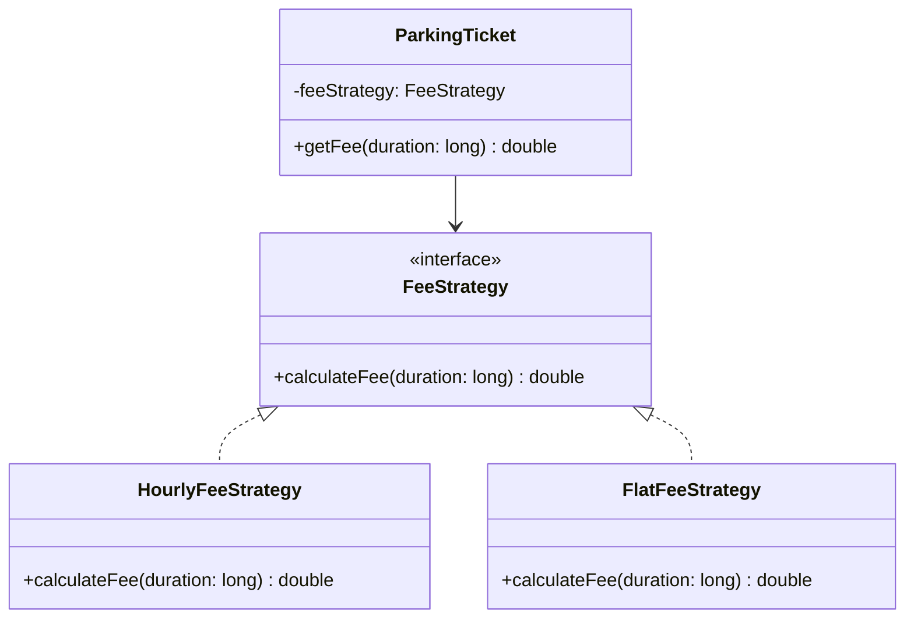

## Welcome to Behavioral Patterns

Part 3 was about creating objects. Part 4 was about composing them into larger structures. Part 5
is about **how objects communicate and distribute responsibility** — behavioral patterns solve
problems about interaction, not construction or composition. Strategy is the natural starting
point, because you've been looking at it since Chapter 2.

## Intent

> **Define a family of algorithms, encapsulate each one, and make them interchangeable. Strategy
> lets the algorithm vary independently from clients that use it.**

## You've Already Seen This Pattern — Repeatedly

This series has used Strategy's exact shape as the running example for OOP fundamentals, long
before naming it:

- Chapter 2: `PaymentMethod` with `CreditCardPayment`/`UpiPayment` implementations.
- Chapter 1 & 8: `NotificationChannel` with `EmailChannel`/`SmsChannel` implementations.
- Chapter 8: `DiscountPolicy` with `RegularDiscount`/`PremiumDiscount`/`VipDiscount`
  implementations.

Every one of these is Strategy. The formal definition:

```java
interface FeeStrategy {
    double calculateFee(long durationInMinutes);
}

class HourlyFeeStrategy implements FeeStrategy {
    public double calculateFee(long durationInMinutes) {
        return Math.ceil(durationInMinutes / 60.0) * 20;
    }
}

class FlatFeeStrategy implements FeeStrategy {
    public double calculateFee(long durationInMinutes) {
        return 50;
    }
}

class ParkingTicket {
    private final FeeStrategy feeStrategy; // the "context" holds a reference to the strategy

    ParkingTicket(FeeStrategy feeStrategy) {
        this.feeStrategy = feeStrategy;
    }

    double getFee(long durationInMinutes) {
        return feeStrategy.calculateFee(durationInMinutes);
    }
}
```



The GoF vocabulary for the three roles: **Strategy** (the interface, `FeeStrategy`),
**ConcreteStrategy** (each implementation, `HourlyFeeStrategy`), and **Context** (the class holding
and using a strategy, `ParkingTicket`).

## Why Strategy Gets Its Own Chapter Now

Parts 1–2 introduced this shape purely to teach OOP fundamentals and the Open/Closed Principle —
naming it "Strategy" at that point would have added vocabulary before the underlying reasoning was
established. Now that SOLID and OOP fundamentals are solid ground, this chapter's job is narrower
and sharper: **precisely distinguishing Strategy from its closest relatives**, since that precision
is exactly what separates strong LLD candidates from those who've merely memorized the shape.

## Strategy vs. State (Chapter 31) — The Most Important Distinction Ahead

Both patterns hold an interface reference and delegate to it — the difference is **who decides
which implementation is active, and why it changes**:

| | Strategy | State (Chapter 31) |
|---|---|---|
| **Who picks the implementation?** | The client, explicitly, usually once | The context itself, internally, based on its own lifecycle |
| **Does the active implementation change over an object's lifetime?** | Rarely — set once at construction | Often — transitions are the whole point |
| **Do implementations know about each other?** | No — fully independent | Often yes — a state frequently knows which state comes next |

A `ParkingTicket` is handed a `FeeStrategy` once and keeps it — that's Strategy. An `Order` moving
through `Pending → Shipped → Delivered`, where the object's own behavior changes automatically as
it transitions, is State. Chapter 31 covers this distinction in full once both patterns are on the
table.

## Strategy vs. Bridge (Chapter 22) — A Quick Recap

Chapter 22 already established this precisely: Strategy handles **one** varying dimension; Bridge
handles **two or more** independent dimensions decoupled from each other via composition. If
you're choosing between a fee calculation approach and nothing else varies independently alongside
it, it's Strategy. If fee calculation *and* vehicle type *and* something else all vary
independently and need to combine freely, you're looking at Bridge (or, if the combinations must
stay internally consistent as a set, Abstract Factory, Chapter 18).

## Modern Java: Strategy Without a Named Class

Since Java 8, a single-method interface (a **functional interface**) can be implemented inline with
a lambda, skipping the ceremony of a named class entirely for simple strategies:

```java
interface FeeStrategy {
    double calculateFee(long durationInMinutes);
}

FeeStrategy flatFee = duration -> 50.0;
FeeStrategy hourlyFee = duration -> Math.ceil(duration / 60.0) * 20;

ParkingTicket ticket = new ParkingTicket(hourlyFee);
```

This is still fully the Strategy pattern — the interface, the interchangeable implementations, and
the context are all present. Lambdas simply remove the need for a separate named class per
strategy when the implementation is a single expression with no additional state. **Reach for a
full named class instead of a lambda when a strategy implementation needs its own fields, needs to
implement more than one method, or benefits from a descriptive type name in stack traces and
debugging.**

## Summary

- Strategy defines a family of interchangeable algorithms behind a shared interface, letting the
  algorithm vary independently from the code that uses it — a pattern this series has been using
  since Chapter 2, now given its formal name and three-role vocabulary (Strategy, ConcreteStrategy,
  Context).
- Distinguish from Bridge by counting varying dimensions: one → Strategy, two or more → Bridge
  (Chapter 22).
- Distinguish from State (previewed here, covered fully in Chapter 31) by asking who selects the
  implementation and whether it changes over the object's lifetime.
- In modern Java, simple, stateless strategies can be implemented as lambdas against a functional
  interface — full named classes remain appropriate for strategies with their own state or
  multiple methods.

---

## Interview Questions

**1. State the Strategy pattern's intent, and name its three canonical roles.**
Strategy defines a family of algorithms, encapsulates each one behind a common interface, and
makes them interchangeable, so the algorithm can vary independently from the client code using it.
The three roles are: the **Strategy** interface (the shared contract, like `FeeStrategy`), one or
more **ConcreteStrategy** implementations (like `HourlyFeeStrategy` and `FlatFeeStrategy`), and the
**Context** (the class that holds a reference to a Strategy and delegates to it, like
`ParkingTicket`).
*Follow-up: Which of these three roles is responsible for deciding which concrete strategy is
actually used at runtime?* Typically the client code constructing the Context is responsible for
this decision (passing the chosen `ConcreteStrategy` into the Context's constructor), not the
Context itself — the Context's job is simply to hold and delegate to whichever strategy it's given,
remaining agnostic about how or why that particular one was chosen.

**2. Why does this chapter describe Strategy as a pattern the reader has "already seen
repeatedly" before this chapter formally introduced it, and why was it deliberately not named
until now?**
Examples like `PaymentMethod`, `NotificationChannel`, and `DiscountPolicy` from Parts 1 and 2 all
share Strategy's exact structural shape — an interface, several interchangeable implementations,
and a context class depending on the interface. They were deliberately introduced without the
formal "Strategy" name in those earlier chapters because the immediate teaching goal there was
establishing OOP fundamentals (polymorphism, abstraction) and SOLID principles (OCP, DIP) from
first-principles reasoning, rather than pattern-name recall — introducing formal pattern vocabulary
before that foundational reasoning was solid would have encouraged exactly the kind of hollow,
name-matching-without-understanding recognition Chapter 15 explicitly warned against.
*Follow-up: Does this mean Strategy is, in some sense, the "default" or most fundamental
behavioral pattern, given how naturally it emerges from basic OOP principles alone?* This is a
reasonable characterization — Strategy is arguably the most directly emergent pattern from applying
polymorphism and the Open/Closed and Dependency Inversion Principles to the single specific problem
of "letting one algorithm vary," which is likely why it appears so early and so often across varied
examples throughout this series, even before being formally named.

**3. Explain precisely how to distinguish Strategy from Bridge (Chapter 22) when both patterns
involve a class holding an interface reference and delegating to it.**
The distinguishing factor is the number of independently-varying dimensions involved: Strategy
addresses exactly *one* dimension of variation (which single algorithm or behavior to use), while
Bridge addresses *two or more* independent dimensions that need to vary without multiplying
combinatorially against each other (like remote control tier and device type in Chapter 22's
example). If a design has only one interchangeable "thing" varying, with nothing else independently
varying alongside it, it's Strategy; if two or more independent axes need to combine freely, it's
Bridge.
*Follow-up: Could a design that starts as Strategy naturally evolve into Bridge as new
requirements are added, and if so, what would that evolution look like concretely?* Yes — if a
`ParkingTicket` initially only varied by `FeeStrategy` (Strategy), and a new requirement later
introduced an independently-varying `ReceiptFormat` (paper vs. digital) that also needed to combine
freely with any fee strategy, the design would naturally evolve toward Bridge's two-hierarchy
structure, since there would now be two independent dimensions (fee calculation and receipt
format) needing to vary and combine without multiplying into a combinatorial set of combined
classes.

**4. What criteria would you use to decide whether a given Strategy implementation should be
written as a full named class versus a Java lambda expression?**
Use a lambda when the strategy implementation is a single, simple expression or short block with no
internal state of its own beyond what's captured from the enclosing scope, and when the functional
interface it implements has exactly one abstract method. Use a full named class when the strategy
implementation needs its own fields (configuration, internal state, or dependencies injected via
its own constructor), needs to implement more than one method (a functional interface, by
definition, can only have one abstract method, so multi-method strategies require a full
class/interface), or when a descriptive class name meaningfully improves readability and debugging
(a stack trace showing `HourlyFeeStrategy.calculateFee()` is more informative than showing an
anonymous lambda's location).
*Follow-up: If a strategy implementation starts as a simple lambda but later needs to hold
configuration state (like a discount percentage that varies per instance), how would you refactor
it?* You'd convert the lambda into a full named class implementing the same functional interface,
adding a constructor that accepts the needed configuration as a field — for example, transforming
a stateless `FeeStrategy flatFee = duration -> 50.0;` lambda into a
`class ConfigurableFlatFeeStrategy implements FeeStrategy` with a `rate` field set via its
constructor, once the strategy genuinely needs to vary its behavior based on per-instance
configuration rather than being a fixed, hardcoded computation.

**5. How would you unit test a `Context` class (like `ParkingTicket`) that depends on the
`Strategy` interface, and what specific benefit does the Strategy pattern provide for this
testing?**
Since `ParkingTicket` depends on the `FeeStrategy` interface rather than any specific concrete
implementation, a unit test can inject a simple fake or mock `FeeStrategy` (perhaps a lambda
returning a fixed, known value) to verify `ParkingTicket.getFee()` correctly delegates to whatever
strategy it's given, entirely independent of any specific fee-calculation business logic — this is
the same DIP-driven testability benefit discussed throughout this series, here specifically framed
in terms of testing the Context in isolation from any particular ConcreteStrategy's actual
calculation details.
*Follow-up: Would you also want separate unit tests specifically for `HourlyFeeStrategy` and
`FlatFeeStrategy` themselves, in addition to testing `ParkingTicket`?* Yes — testing
`ParkingTicket` in isolation (with a fake strategy) verifies the Context's own delegation logic is
correct, while separate, dedicated tests for each ConcreteStrategy implementation verify that each
one's actual fee-calculation logic is correct on its own terms; both sets of tests are valuable and
address different concerns, mirroring the general principle (established in earlier chapters
discussing SRP-driven testing) that each class's own specific responsibility deserves its own
focused test coverage.

**6. In an LLD interview, if you're designing a sorting utility that needs to support different
comparison criteria (sort by name, sort by date, sort by price) chosen by the caller at runtime,
how would Strategy apply, and how does this relate to Java's built-in `Comparator` interface?**
You'd define (or, in this case, directly reuse) a `Comparator<T>`-style interface with a single
`compare(T a, T b)` method, with different implementations for each sorting criterion (by name, by
date, by price) — this is exactly the Strategy pattern, and Java's own standard library
`java.util.Comparator` interface is a direct, built-in application of it: a sorting method like
`Collections.sort(list, comparator)` is the Context, delegating the actual comparison logic to
whichever `Comparator` (ConcreteStrategy) implementation is passed in.
*Follow-up: How would you implement a "sort by price, then by name for ties" comparator, and does
this composition capability relate to anything covered in earlier chapters?* Java's `Comparator`
interface provides default methods like `thenComparing()` specifically for this purpose:
`Comparator.comparing(Item::getPrice).thenComparing(Item::getName)` — this composability, where two
Strategy instances (comparators) combine into a new, composite Strategy instance, is conceptually
similar to the Composite pattern's approach to combining multiple `DiscountPolicy` instances
discussed in Chapter 23, here applied to combining comparison strategies rather than discount
calculation strategies.

**7. Does the Strategy pattern satisfy the Open/Closed Principle, and if so, explain precisely
how, connecting back to Chapter 8.**
Yes — adding a new fee calculation approach (say, a `WeekendFeeStrategy`) means writing one new
class implementing the existing `FeeStrategy` interface, with zero modification to
`ParkingTicket`, `HourlyFeeStrategy`, `FlatFeeStrategy`, or any other existing code — exactly the
"open for extension, closed for modification" outcome Chapter 8 established, here achieved through
Strategy's specific structural shape (an interface plus interchangeable implementations) rather
than through the more general OCP discussion in that earlier chapter.
*Follow-up: Is Strategy the *only* pattern that satisfies OCP, or are there other patterns
covered so far that also achieve OCP compliance through different structural means?* Strategy is
one of several patterns that satisfy OCP, each through a different structural mechanism: Factory
Method (Chapter 17) satisfies OCP for the *creation* decision (which class to instantiate),
Decorator (Chapter 24) satisfies it for *adding behavior* without modifying existing classes, and
Bridge (Chapter 22) satisfies it across *multiple independent dimensions* simultaneously — OCP is a
general principle that many different structural patterns can be understood as specific,
named ways of achieving, each suited to a different specific problem shape.

**8. How would you explain to an interviewer why you chose the Strategy pattern over a simple
`if/else` chain for a given problem, in a way that goes beyond just citing "the Open/Closed
Principle" by name?**
Explain the concrete, forward-looking consequence directly: "If we hardcode this logic as an
`if/else` chain checking vehicle type, every time a new vehicle type or fee rule is added, we'd
need to modify and re-test this exact method, risking breaking an existing case through a
misplaced condition. By extracting a `FeeStrategy` interface, adding a new fee rule becomes writing
one new, independently-testable class with zero risk to existing, already-working fee
calculations." This grounds the pattern choice in a specific, tangible risk-reduction argument
rather than an abstract principle name, which is generally a stronger interview signal.
*Follow-up: Is it ever appropriate to choose the simpler `if/else` chain instead, even when
Strategy would technically apply?* Yes — per the KISS/YAGNI discipline established in Chapter 12,
if the problem statement gives no signal that the set of cases will grow or vary (a genuinely
small, fixed, unlikely-to-change set of options), a direct conditional can be the simpler, more
appropriate choice, and introducing a full Strategy interface with multiple classes for a truly
static, tiny set of options would be unjustified over-engineering.

**9. Can a Strategy implementation itself use other design patterns internally? Give an
example.**
Yes — a `ConcreteStrategy` implementation is just an ordinary class internally, free to use any
other pattern appropriate to its own internal needs. For example, a
`DynamicPricingFeeStrategy implements FeeStrategy` could internally use a Proxy (Chapter 27) to
cache expensive calls to an external pricing service, or could internally construct its
dependencies via a Factory Method (Chapter 17) — the Strategy pattern only concerns the *external*
relationship between the Context and the interchangeable algorithms; it says nothing about how any
individual algorithm implementation is built internally.
*Follow-up: Does this composability of patterns — one pattern's implementation internally using a
different pattern — apply broadly across all the patterns covered in this series, or is Strategy
somehow special in this regard?* This composability is a general property of design patterns
broadly, not something specific to Strategy — as seen throughout this series (Factory Method
combined with Prototype in Chapter 20, Facade combined with Strategy in Chapter 25, Bridge combined
with Strategy in Chapter 22), patterns are typically applied at different, often nested layers of a
single system, each addressing its own local structural concern, and nothing prevents one pattern's
internal implementation from independently employing a different pattern to solve its own separate
internal problem.

**10. In the context of the Strategy pattern, what does it mean for the Context class to be
"strategy-agnostic," and why is this property valuable?**
Being "strategy-agnostic" means the Context class (`ParkingTicket`) contains no knowledge of, or
logic specific to, any particular concrete strategy implementation — it only knows about and
depends on the shared `FeeStrategy` interface, treating every concrete strategy identically through
that one shared contract. This is valuable because it means the Context's own code never needs to
change as new strategies are added or existing ones are modified (satisfying OCP), and it means the
Context can be tested and reasoned about completely independently of which specific strategies
exist in the system at any given time.
*Follow-up: Would a `ParkingTicket` class that contained a switch statement internally selecting
between different fee calculation branches based on a type field still be considered
"strategy-agnostic," even if that switch statement happened to call out to separate helper methods
for each branch?* No — even if the actual calculation logic for each branch were extracted into
separate helper methods, the presence of a switch/conditional *within* `ParkingTicket` itself,
selecting between branches based on some type indicator, means `ParkingTicket` is not
strategy-agnostic; it still contains type-specific knowledge and would still need modification to
add a new fee type, which is precisely the OCP violation Strategy is meant to eliminate by moving
that branching decision (and all type-specific knowledge) entirely outside the Context class.

**11. How would you handle a scenario where switching between two different `FeeStrategy`
implementations needs to happen dynamically, mid-way through a `ParkingTicket`'s lifetime — for
example, if a promotional discount strategy should apply only during a specific time window?**
You could add a setter method to `ParkingTicket` (like `setFeeStrategy(FeeStrategy newStrategy)`)
allowing the active strategy to be swapped after construction, rather than only setting it once via
the constructor — this remains a legitimate use of Strategy, since the class using the strategy
(now potentially external scheduling logic, or the `ParkingTicket` itself checking a time
condition) is still simply choosing which interchangeable algorithm to use, just doing so more than
once over the object's lifetime rather than only at construction time.
*Follow-up: At what point does this kind of dynamic strategy-switching start to resemble or
overlap with the State pattern, previewed earlier in this chapter and covered fully in Chapter
31?* If the *reason* the strategy changes becomes tied to the object's own internal lifecycle or
state transitions (e.g., the ticket itself tracks "we've now entered the promotional window" as an
internal state change and automatically swaps its own strategy in response, with the ticket driving
this transition itself rather than external code simply calling a setter), this starts to blur into
State pattern territory — the distinguishing question, as previewed earlier, becomes whether the
object itself is managing and driving these transitions as part of its own lifecycle (State) versus
simply being handed a different interchangeable algorithm by external code as needed (still
Strategy, just with a mutable rather than fixed-at-construction reference).

**12. Is it a violation of the Strategy pattern's intent if two different `ConcreteStrategy`
implementations share a significant amount of duplicated logic between them?**
It's not a violation of Strategy's structural intent specifically, but it does represent a DRY
violation (Chapter 12) worth addressing — if `HourlyFeeStrategy` and a hypothetical
`WeekendHourlyFeeStrategy` both contain identical rounding-up-to-the-nearest-hour logic, that
shared logic should be extracted into a common helper method, a shared default method on the
`FeeStrategy` interface (if it doesn't need per-implementation state), or a shared abstract base
class both strategies extend — addressing the duplication without changing anything about the
overall Strategy pattern structure itself.
*Follow-up: Would introducing a shared abstract base class for these two strategies conflict with
Strategy's use of an interface (per Chapter 3's interface-vs-abstract-class decision
framework)?* Not necessarily — you could have `FeeStrategy` remain the shared interface that
`ParkingTicket` (the Context) depends on, while introducing a separate abstract class (e.g.,
`AbstractHourlyFeeStrategy implements FeeStrategy`) that `HourlyFeeStrategy` and
`WeekendHourlyFeeStrategy` both extend to share their common rounding logic — the Context still
only ever depends on the `FeeStrategy` interface, remaining fully agnostic to whether any given
concrete implementation happens to share an abstract base class with another implementation or not.

**13. How would you explain the relationship between Strategy and the broader "programming to an
interface, not an implementation" principle discussed in earlier chapters (Chapter 3, Chapter
11)?**
Strategy is essentially a direct, named, specifically-shaped application of "programming to an
interface" — the Context class is deliberately written to depend only on the Strategy interface's
contract, never on any specific concrete implementation, which is exactly what "programming to an
interface" prescribes generally. Strategy adds the additional, more specific framing that this
interface represents a *family of interchangeable algorithms* specifically meant to be swapped for
one another, rather than just any generic abstraction a class happens to depend on.
*Follow-up: Does this mean every instance of "programming to an interface" is necessarily an
instance of the Strategy pattern, or is Strategy a narrower, more specific case?* Strategy is a
narrower, more specific case — "programming to an interface" is the broader principle applicable to
essentially any abstraction (an `OrderRepository` interface, per DIP in Chapter 11, is also
"programming to an interface," but isn't meaningfully described as Strategy, since its various
implementations represent different data-storage mechanisms rather than interchangeable
*algorithms* in the specific behavioral sense Strategy addresses); Strategy applies specifically
when the varying thing is best understood as an interchangeable algorithm or behavior, which
`OrderRepository`'s persistence-mechanism variation isn't quite the same shape as.

**14. If an interviewer asked you to name the single most commonly-applicable design pattern
across all 23 GoF patterns, would Strategy be a reasonable answer, and why or why not?**
Strategy is a very reasonable candidate for this claim — it applies to an extremely broad range of
problems (any time a single, well-defined behavior needs to vary independently of the code using
it), it requires minimal structural ceremony (often just one interface and a few implementing
classes, or even lambdas in modern Java), and it directly satisfies both OCP and DIP simultaneously
with a single, simple structural change. Its broad applicability and low implementation cost make
it one of the most frequently and naturally reached-for patterns in everyday object-oriented
design, arguably more so than more specialized patterns like Flyweight or Visitor that apply only
to narrower, specific problem shapes.
*Follow-up: Does this broad applicability mean Strategy should be a default "go-to" pattern
applied whenever there's any uncertainty about which pattern fits a given problem?* No — broad
applicability doesn't override the KISS/YAGNI discipline established throughout this series;
Strategy should still only be applied when a genuine, problem-signaled axis of behavioral variation
actually exists, not defaulted to reflexively for every design decision merely because it's broadly
useful when it *does* apply — the judgment of *whether* variation genuinely exists and needs this
structure remains the essential skill, regardless of how broadly applicable the pattern is once
that judgment correctly identifies a fitting scenario.
