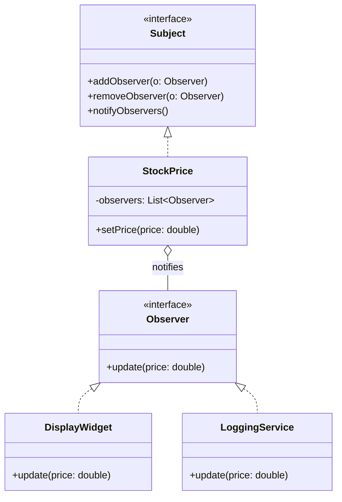

## Intent

> **Define a one-to-many dependency between objects so that when one object changes state, all
> its dependents are notified and updated automatically.**

Observer solves the problem of **broadcasting a change to an unknown, potentially-growing number
of interested parties**, without the object that changed needing to know who those parties are or
how they'll react.

## The Motivating Problem: Tight Coupling to Every Interested Party

Imagine a `StockPrice` object that several parts of an application need to react to — a display
widget, a logging service, and a trading algorithm.

```java
class StockPrice {
    private double price;
    private DisplayWidget display;
    private LoggingService logger;
    private TradingAlgorithm trader;

    void setPrice(double price) {
        this.price = price;
        display.update(price);   // StockPrice must know about every interested party
        logger.log(price);
        trader.evaluate(price);
    }
}
```

`StockPrice` is now tightly coupled to three unrelated classes, and adding a fourth interested
party (say, an SMS alert service) means editing `StockPrice` directly — the exact OCP violation
from Chapter 8, here specifically in the shape of "notifying interested parties."

## The Fix: Subjects and Observers

```java
interface Observer {
    void update(double price);
}

interface Subject {
    void addObserver(Observer observer);
    void removeObserver(Observer observer);
    void notifyObservers();
}

class StockPrice implements Subject {
    private double price;
    private final List<Observer> observers = new ArrayList<>();

    public void addObserver(Observer observer) { observers.add(observer); }
    public void removeObserver(Observer observer) { observers.remove(observer); }

    public void notifyObservers() {
        for (Observer observer : observers) {
            observer.update(price);
        }
    }

    void setPrice(double price) {
        this.price = price;
        notifyObservers(); // doesn't know or care WHO is listening, or how many
    }
}

class DisplayWidget implements Observer {
    public void update(double price) { System.out.println("Display: $" + price); }
}

class LoggingService implements Observer {
    public void update(double price) { System.out.println("Logged: $" + price); }
}
```

```java
StockPrice stock = new StockPrice();
stock.addObserver(new DisplayWidget());
stock.addObserver(new LoggingService());
stock.setPrice(150.25); // both observers notified automatically
```

Adding an SMS alert service now means writing one new `Observer` implementation and calling
`addObserver()` — `StockPrice` itself is never touched again.



## Push vs. Pull: Two Ways to Deliver the Update

**Push model** (shown above): the Subject sends the relevant data directly in the notification
(`update(double price)`). Simple, but couples the `Observer` interface's signature to exactly what
data the Subject happens to have.

**Pull model**: the Subject notifies with no data, and the Observer calls back into the Subject to
fetch what it needs:

```java
interface Observer {
    void update(Subject subject); // no data — just "something changed, go check"
}

class DisplayWidget implements Observer {
    public void update(Subject subject) {
        StockPrice stock = (StockPrice) subject; // must cast to access specific data
        System.out.println("Display: $" + stock.getPrice());
    }
}
```

**The trade-off:** push is simpler for a single piece of changing data; pull scales better when
different observers need different subsets of a Subject's state, since each observer fetches
exactly what it needs rather than the Subject guessing what to include in every notification.

## Observer vs. Strategy: A Frequently-Confused Pair

Both involve an interface implemented by multiple classes, held by another class — the distinction
is about **cardinality and direction of intent**:

| | Strategy (Ch. 28) | Observer |
|---|---|---|
| **How many implementations active at once?** | Exactly one, chosen deliberately | Zero to many, registered dynamically |
| **Who initiates the call?** | The Context, to get a computed result back | The Subject, to broadcast a notification outward |
| **Is a return value typically expected?** | Yes — the strategy computes and returns something | Usually no — observers react, they don't typically hand back a result the Subject uses |

**The fast test:** is one algorithm being selected and asked to compute something (Strategy), or is
an event being broadcast to however many parties happen to be listening (Observer)?

## A Critical Real-World Pitfall: Memory Leaks From Forgotten Unsubscription

If an `Observer` is added to a `Subject`'s list but never removed, the `Subject` holds a permanent
reference to it — even after the observer itself is otherwise no longer needed anywhere else in the
application, it **cannot be garbage collected**, since the `Subject`'s list still references it.
This is a genuinely common source of memory leaks in long-running applications (notoriously in UI
frameworks, where a closed window's listener is left registered on a still-live event source).
**Always pair `addObserver()` with a corresponding `removeObserver()` at the appropriate lifecycle
point** — this is exactly the kind of detail an interviewer probing Observer depth will ask about.

## Where Observer Appears in Real Java and Beyond

Java's own (now-deprecated but historically foundational) `java.util.Observer`/`Observable`
classes were a direct built-in implementation of this pattern. More relevantly today: the entire
publish-subscribe messaging paradigm (Kafka topics, event buses), GUI event listeners
(`button.addActionListener(...)`), and reactive programming libraries all generalize this exact
one-to-many notification idea, often at a distributed-systems scale rather than a single
in-process object.

## Summary

- Observer defines a one-to-many dependency so that when a Subject's state changes, all registered
  Observers are notified automatically, without the Subject needing to know who or how many
  observers exist.
- The push model sends data directly in the notification; the pull model notifies with no data,
  letting observers fetch what they need — choose based on how uniform observers' data needs are.
- Distinguish from Strategy by cardinality and direction: Strategy selects one algorithm to
  compute a result; Observer broadcasts an event to however many listeners are currently
  registered.
- Always pair every `addObserver()` with a corresponding removal at the right lifecycle point —
  forgotten unsubscription is a common, real source of memory leaks.

---

## Interview Questions

**1. State the Observer pattern's intent, and name its two canonical roles.**
Observer defines a one-to-many dependency between objects, so that when one object (the Subject)
changes state, all of its dependents (Observers) are notified and updated automatically, without
the Subject needing explicit, hardcoded knowledge of each dependent. The two canonical roles are
the **Subject** (the object being watched, which maintains a list of registered observers and
notifies them of changes) and the **Observer** (the interface implemented by anything that wants to
be notified of the Subject's changes).
*Follow-up: Is it accurate to say the Subject "controls" its observers, or is the relationship
more accurately described differently?* It's more accurate to say the Subject *notifies*
observers rather than controls them — the Subject has no knowledge of what each observer will
actually do in response to a notification, and observers are free to react however they choose (or
not react meaningfully at all); the Subject's only responsibility is maintaining the registration
list and calling `update()` on each registered observer when a change occurs.

**2. Walk through the `StockPrice` example and explain exactly what OCP violation the
Observer-based refactor eliminates.**
The original `StockPrice` class directly referenced and called methods on three specific,
hardcoded classes (`DisplayWidget`, `LoggingService`, `TradingAlgorithm`) inside `setPrice()` —
adding a fourth interested party (an SMS alert service) would require editing `setPrice()` directly
to add a new call, risking the introduction of bugs into an already-working method. After the
refactor, `StockPrice` depends only on the generic `Observer` interface and a dynamically-managed
list of registered observers — adding a new interested party means writing one new class
implementing `Observer` and calling `addObserver()`, with zero modification to `StockPrice`
itself.
*Follow-up: Does this refactor also improve `StockPrice`'s adherence to the Single Responsibility
Principle, beyond just OCP?* Yes — the original `StockPrice` had an implicit, growing
responsibility of "know about and correctly call every specific interested party," which would
keep expanding as more parties were added; the refactored version's responsibility narrows to
"maintain a price and notify whoever is currently registered," a stable, single responsibility that
doesn't grow as new kinds of observers are introduced.

**3. Explain the difference between the push and pull models for delivering Observer
notifications, and give a concrete scenario where pull would be preferable to push.**
In the push model, the Subject includes the relevant changed data directly as an argument to the
`update()` call (e.g., `update(double price)`), so observers receive exactly what the Subject
decided to send. In the pull model, the Subject calls `update()` with no data (or just a reference
to itself), and each observer calls back into the Subject's own getter methods to retrieve
whichever specific pieces of state it actually needs. Pull is preferable when different observers
need different subsets of the Subject's state — for example, if one observer only cares about
price while another cares about trading volume and a third cares about both, push would either
need an overly broad notification method carrying all possible data (whether or not each observer
needs it) or would need multiple different `update()` overloads, while pull lets each observer
simply fetch exactly what it needs from the Subject directly.
*Follow-up: What's a downside of the pull model compared to push, beyond needing to cast the
Subject to its concrete type as shown in the example?* Pull requires each observer to make
additional method calls back into the Subject to retrieve data, which can be less efficient if many
observers each need the same piece of data (redundant getter calls) compared to push simply
handing that data to everyone once; pull can also expose more of the Subject's internal state and
API surface to observers than strictly necessary, compared to push's more controlled, minimal data
exposure.

**4. How would you distinguish, given a design showing a class holding a list of interface
references and calling a method on each, whether this represents the Observer pattern or
something else, like Composite (Chapter 23)?**
The key distinguishing question is about *intent and structure*: Composite specifically models a
recursive part-whole tree hierarchy, where the "container" (like `Folder`) is itself typically also
an instance of the same shared interface as its children, enabling uniform recursive treatment. A
Subject in Observer is generally *not* itself an instance of the `Observer` interface it maintains a
list of — the Subject and its Observers are typically two distinct, unrelated interface hierarchies
serving fundamentally different roles (one changes and broadcasts; the others listen and react),
rather than a recursive, uniformly-typed tree structure.
*Follow-up: Could a Subject also, in some scenario, itself be an Observer of some other Subject,
creating a chain of notifications?* Yes, this is a legitimate and common scenario — for example, a
`PortfolioValue` object could be an Observer of several individual `StockPrice` Subjects
(recalculating the total portfolio value whenever any one stock's price changes), while
`PortfolioValue` is itself also a Subject that other observers (like a `DisplayWidget` showing total
portfolio value) are registered to — this chaining is a normal, valid composition of multiple
Observer relationships, distinct from Composite's specific recursive tree-of-the-same-type
structure.

**5. What's the specific memory-leak risk associated with the Observer pattern, and how would you
prevent it in a real Java application?**
If an `Observer` is registered with a `Subject` via `addObserver()` but is never explicitly removed
via `removeObserver()` once the observer is no longer needed, the Subject's internal list continues
holding a live reference to that observer object indefinitely — this prevents the observer (and
anything it, in turn, references) from being garbage collected, even after every other part of the
application has finished using it, since the Subject's reference alone is enough to keep it
reachable. Preventing this requires disciplined lifecycle management: explicitly calling
`removeObserver()` at the appropriate point (e.g., when a UI component is closed/disposed, or when
a subscriber's own lifecycle ends), matching every `addObserver()` call with a corresponding
`removeObserver()` call.
*Follow-up: Are there any Java language or library features that help mitigate this risk
automatically, rather than relying purely on manual discipline?* Java provides `WeakReference` and
specifically `WeakHashMap`, which can be used to hold observer references weakly rather than
strongly — allowing the JVM's garbage collector to reclaim an observer even if it's still
technically registered with a Subject, as long as no other strong references to it exist elsewhere;
this trades away guaranteed notification delivery (a garbage-collected observer obviously can't be
notified anymore) for automatic memory-leak prevention, which is a reasonable trade-off in some
specific scenarios, though explicit unsubscription remains the generally preferred, more
predictable approach.

**6. Explain the precise distinction between Strategy and Observer, given that both involve an
interface with multiple possible implementations held by another class.**
The key distinguishing factors are cardinality and direction of intent: Strategy involves exactly
*one* active implementation at a time, deliberately selected by client code to compute and return a
specific result the Context needs (`feeStrategy.calculateFee(duration)` returns a fee amount the
Context uses). Observer involves *zero to many* implementations, dynamically registered, that are
notified of an event the Subject is broadcasting outward — typically with no meaningful return
value the Subject itself uses, since the Subject doesn't care what each observer does in response,
only that they're informed.
*Follow-up: Could you have a "Strategy" that's called multiple times with different
implementations to combine their results, and would that then start to resemble Observer?* This
would more closely resemble the Composite pattern applied to Strategy instances (as discussed in
Chapter 23's `CompositeDiscount` example) rather than Observer — the key remaining distinction is
that a `CompositeDiscount`'s constituent strategies are still each computing and *returning* a
result the composite combines and uses, which is fundamentally different from Observer's
broadcast-with-no-expected-return-value notification model; cardinality alone (multiple
implementations being invoked) isn't sufficient to make something Observer — the broadcast/
notification intent and lack of a meaningful aggregated return value are the more essential
distinguishing characteristics.

**7. How does Observer relate to the general publish-subscribe (pub/sub) messaging pattern used
in distributed systems (like Kafka or RabbitMQ), and what's different at that larger scale?**
Pub/sub messaging generalizes Observer's exact core idea (a "publisher"/Subject broadcasts events
to however many "subscribers"/Observers are currently listening, without needing direct knowledge
of them) to a distributed, often asynchronous, multi-machine context — instead of a single
in-process method call list, a message broker (like Kafka) sits between publishers and
subscribers, handling delivery, often persisting messages temporarily, and decoupling publishers
and subscribers so they don't even need to be running at the exact same time. The core
"one-to-many notification without tight coupling" idea is identical; what's different at scale is
the added infrastructure needed to handle network communication, delivery guarantees, ordering,
and subscriber availability across process and machine boundaries.
*Follow-up: Would you describe a message broker like Kafka itself as literally "the Subject" in
Observer pattern terms, or does the analogy break down at this larger scale?* The analogy is
directionally useful but does stretch somewhat at scale — a message broker is more accurately a
sophisticated intermediary/infrastructure layer that *facilitates* the Subject-Observer
relationship (handling registration/subscription, routing, and delivery) rather than being the
Subject itself; the actual "Subject" in a pub/sub system is more precisely the specific service or
component that publishes events to a given topic, with the broker serving a role somewhat
analogous to (but considerably more sophisticated than) the observer-list-management machinery
inside the simple in-process `StockPrice` example.

**8. If an Observer's `update()` method throws an exception, what happens to the notification of
subsequent observers in the Subject's list, and how would you handle this robustly?**
As written in the basic example (a simple `for` loop calling `update()` on each observer in
sequence), an uncaught exception thrown by one observer's `update()` method would propagate up and
interrupt the loop, meaning any observers later in the list would never receive their notification
for this particular change — a single misbehaving observer can silently prevent all subsequent
observers from being notified, which is a significant robustness concern. A more robust
implementation would wrap each individual `observer.update(...)` call in its own try-catch block
inside the loop, logging or otherwise handling any exception from one observer without preventing
the remaining observers in the list from still being notified.
*Follow-up: Should a Subject notifying its observers ever be done asynchronously (e.g., on
separate threads or via a task queue) rather than synchronously in a simple loop, and what
trade-off does this introduce?* Asynchronous notification can prevent a slow or blocked observer
from delaying the Subject's own processing and delaying notifications to other observers, and can
isolate failures more robustly than even a try-catch-wrapped synchronous loop — but it introduces
its own complexity: notifications may then arrive out of order relative to when the state changes
actually occurred, and the Subject can no longer assume all observers have finished processing a
given notification by the time `notifyObservers()` returns, which can matter significantly
depending on what observers are expected to do in response.

**9. In an LLD interview for a "design a stock trading platform" or "design a notification
system" problem, how would you decide whether to use Observer versus the earlier
`NotificationChannel`/Strategy design from Chapters 1 and 8?**
The deciding question is about cardinality and intent, per the Strategy-vs-Observer distinction
established earlier: if the scenario is "a user selects exactly one preferred notification channel
(email, SMS, or push) and every notification for that user goes through that one chosen channel,"
that's Strategy (one selected implementation, computing/performing one specific action). If the
scenario is "an event occurs, and every interested party (which could be zero, one, or many —
perhaps a user's email AND their SMS AND a logging system AND an analytics dashboard) should be
notified simultaneously," that's Observer (broadcasting to a dynamic, potentially-multiple set of
listeners).
*Follow-up: Could a single, well-designed system genuinely need both patterns applied to
different parts of the same overall notification flow?* Yes — you could have an Observer-based
`OrderEventPublisher` that notifies multiple interested subsystems (inventory, analytics,
notification-sending) whenever an order event occurs, where one of those interested subsystems (the
notification-sending one) *internally* uses a Strategy-based `NotificationChannel` to decide how to
actually deliver its own specific notification to the customer — the two patterns operating at
different layers of the same overall system, each solving its own distinct sub-problem, similar to
how other pattern combinations have been shown throughout this Part.

**10. How would you unit test the `StockPrice` Subject class to verify it correctly notifies all
registered observers, and correctly stops notifying an observer after it's removed?**
Register two or more fake/mock `Observer` implementations (or simple test doubles tracking whether
and with what value they were called) with a `StockPrice` instance, call `setPrice()`, and assert
that every registered mock observer's `update()` method was called with the correct price value.
Then, remove one of the observers via `removeObserver()`, call `setPrice()` again with a different
value, and assert that the removed observer's `update()` was *not* called again with this second
value, while the remaining registered observer(s) were correctly notified — this specifically
verifies both the notification and the removal/unsubscription behavior work correctly.
*Follow-up: Would you also want a test verifying behavior when `notifyObservers()` is called with
zero observers currently registered?* Yes — an edge-case test confirming that calling
`setPrice()` (and internally, `notifyObservers()`) on a `StockPrice` instance with no registered
observers at all completes without throwing any exception or unexpected behavior is a reasonable
and worthwhile test, verifying the empty-list case is handled gracefully, similar in spirit to the
empty-folder edge case discussed for the Composite pattern in Chapter 23.

**11. Does the Observer pattern inherently support observers being notified in a specific,
guaranteed order, and if a specific ordering is required, how would you ensure it?**
The basic implementation shown (a simple `List<Observer>` iterated in insertion order) does
happen to notify observers in the order they were added, but this ordering guarantee is an
incidental property of using a `List` and iterating it sequentially, not a guarantee inherent to the
Observer pattern's definition itself — a different underlying collection (like a `Set`, which
doesn't guarantee iteration order) would not preserve this property. If a specific, meaningful
notification order is genuinely required (e.g., "the logging observer must always run before the
trading algorithm observer"), you'd need to either explicitly document and rely on the `List`'s
insertion-order iteration behavior, or introduce an explicit priority/ordering mechanism (like
assigning each observer a priority value the Subject sorts by before notifying) rather than relying
on implicit, incidental behavior.
*Follow-up: Is relying on implicit insertion-order notification generally considered good
practice, or a risky, fragile design decision?* Relying on implicit insertion order is generally
considered somewhat fragile and risky, especially in larger or longer-lived systems, since it's an
easy detail for a future maintainer to unknowingly break (e.g., by switching the underlying
collection type for an unrelated reason) without realizing observers' relative notification order
was silently depended upon elsewhere; if order genuinely matters, making that requirement explicit
and enforced (rather than implicit and incidental) is the more robust, maintainable design choice.

**12. How would the Observer pattern's design change if observers needed to be able to *veto* or
*cancel* the change the Subject is about to make, rather than simply being notified passively
after the fact?**
This would require restructuring the notification to happen *before* the state change is finalized,
with the `update()` (or a differently-named method, like `beforeChange()`) method returning a
boolean or throwing a specific exception to signal a veto, and the Subject checking this response
from each observer before committing to the change — for example,
`boolean allowed = observer.beforeChange(newPrice); if (!allowed) { /* abort the change */ }`.
This is a meaningfully different variant sometimes distinguished from plain Observer by names like
"listener with veto power" or is closely related to a distinct pattern sometimes called
"Interceptor," since it changes Observer's fundamentally passive, after-the-fact notification model
into an active, gatekeeping one.
*Follow-up: Does adding veto capability to observers introduce any new risks or design concerns
compared to the passive notification model?* Yes, significantly — with multiple observers each
potentially able to veto a change, you now need well-defined semantics for what happens if some
observers approve and others veto (does any single veto block the change entirely? is there a
priority order?), and you introduce the possibility of observers with side effects that have
already partially executed before a later observer vetoes the change, requiring careful design
around transactionality and rollback — considerably more complex than the simple, side-effect-safe,
after-the-fact notification model of plain Observer, where a failing observer (per the earlier
exception-handling question) doesn't retroactively invalidate a change that's already been
committed.

**13. Can the Observer pattern be combined with the Command pattern (Chapter 30) — for example,
having each Observer's `update()` method internally wrap its reaction logic as a `Command` object
placed on a queue rather than executed immediately?**
Yes, this is a legitimate and common combination, particularly useful for decoupling the timing of
*receiving* a notification from the timing of *acting* on it — an observer's `update()` method
could construct a `Command` object encapsulating "what to do in response to this price change" and
enqueue it for later, asynchronous execution (perhaps by a separate worker thread or task
scheduler), rather than performing potentially slow or blocking work synchronously and immediately
within the notification call itself, directly addressing the earlier-discussed concern about a
slow observer delaying notifications to other observers.
*Follow-up: How does this combination relate to the earlier discussion about asynchronous
notification, and what specific advantage does using Command specifically (rather than just
running the reaction logic on a separate thread directly) provide?* This combination provides a
structured, well-defined way to package and queue the reaction logic (as a Command object) rather
than simply spawning ad hoc threads or tasks — using Command specifically allows the queued
reactions to be inspected, logged, retried, or even undone (leveraging Command's own capabilities,
covered fully in the next chapter) in ways that a bare, unstructured asynchronous task wouldn't
naturally support, providing more structure and control over how deferred observer reactions are
managed.

**14. Summarize why Observer is considered one of the most foundational and widely-applicable
behavioral patterns, similar to how Strategy was described that way in the previous chapter — and
identify the key difference in the kind of problem each one solves.**
Both Strategy and Observer are foundational because they each address an extremely common,
recurring structural need with minimal ceremony: Strategy addresses "let one algorithm vary
independently," and Observer addresses "let an unknown, potentially-growing number of parties react
to a change without tight coupling." Nearly every real-world application has some form of "when X
happens, notify/update Y, Z, and possibly more" requirement (UI updates reacting to data changes,
logging reacting to events, cascading recalculations reacting to underlying data changes), making
Observer just as broadly and naturally applicable as Strategy, but for a fundamentally different
kind of problem — Strategy is about *computing one result* via a chosen algorithm, while Observer
is about *broadcasting an event* to however many interested parties currently care about it.
*Follow-up: Given both patterns' broad applicability, how would you avoid conflating them or
misapplying one where the other actually fits better, in a live interview setting?* Explicitly ask
yourself the specific distinguishing question established in this chapter before committing to
either pattern: "Am I selecting exactly one algorithm to compute a result I need back (Strategy), or
am I broadcasting an event to however many parties happen to be currently interested, with no
expected return value the broadcaster itself uses (Observer)?" — applying this concrete test
explicitly, rather than pattern-matching on the superficial "interface implemented by multiple
classes" structural shape both patterns share, is the reliable way to avoid conflating them under
interview time pressure.
