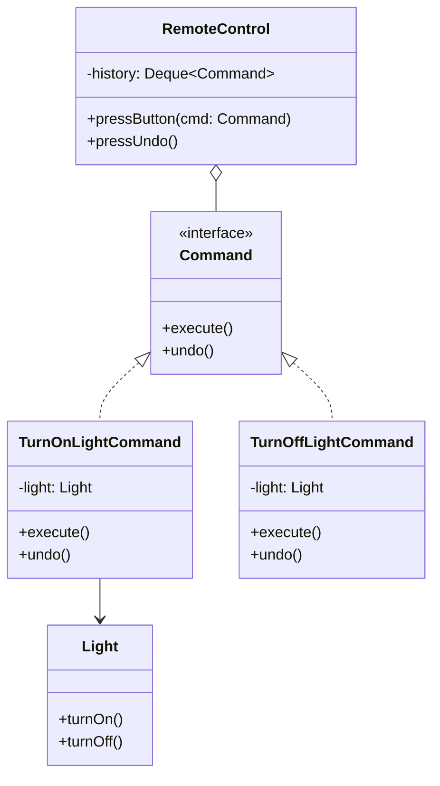

## Intent

> **Encapsulate a request as an object, thereby letting you parameterize clients with different
> requests, queue or log requests, and support undoable operations.**

Command answers a specific question: **what if "calling a method" needs to be treated as a
first-class thing — stored, queued, logged, undone, or handed off to code that has no idea what
the method even does?**

## The Motivating Problem: Actions That Can't Be Queued, Logged, or Undone

A remote control needs to trigger actions on various devices — but a plain method call is
transient; the instant it executes, there's nothing left to inspect, queue, or reverse.

```java
class Light {
    void turnOn() { System.out.println("Light on"); }
    void turnOff() { System.out.println("Light off"); }
}

class RemoteControl {
    void pressButton(Light light, String action) {
        if (action.equals("ON")) {
            light.turnOn();
        } else if (action.equals("OFF")) {
            light.turnOff();
        }
        // no way to undo, log, or queue this action after the fact
    }
}
```

Beyond the familiar OCP violation, there's a deeper limitation here: **the action itself has no
representation as data.** There's nothing to store in a history list for "undo," nothing to
serialize for logging, nothing to hand to a task queue for later execution.

## The Fix: Turn Each Action Into an Object

```java
interface Command {
    void execute();
    void undo();
}

class TurnOnLightCommand implements Command {
    private final Light light;

    TurnOnLightCommand(Light light) { this.light = light; }

    public void execute() { light.turnOn(); }
    public void undo() { light.turnOff(); }
}

class TurnOffLightCommand implements Command {
    private final Light light;

    TurnOffLightCommand(Light light) { this.light = light; }

    public void execute() { light.turnOff(); }
    public void undo() { light.turnOn(); }
}

class RemoteControl {
    private final Deque<Command> history = new ArrayDeque<>();

    void pressButton(Command command) {
        command.execute();
        history.push(command); // the executed action is now a stored, inspectable object
    }

    void pressUndo() {
        if (!history.isEmpty()) {
            history.pop().undo();
        }
    }
}
```

```java
Light livingRoomLight = new Light();
RemoteControl remote = new RemoteControl();

remote.pressButton(new TurnOnLightCommand(livingRoomLight));
remote.pressButton(new TurnOffLightCommand(livingRoomLight));
remote.pressUndo(); // turns the light back on — undoing the last command
```

`RemoteControl` never mentions `Light` by name at all — it only knows about the `Command`
interface. It can trigger, store, and undo **any** command for **any** device, without knowing
anything about what that device does.



## The Four Roles

- **Command** — the interface (`execute()`, often `undo()`).
- **ConcreteCommand** — a specific action bound to a specific receiver
  (`TurnOnLightCommand`).
- **Receiver** — the object that actually performs the work (`Light`).
- **Invoker** — the object that triggers the command without knowing what it does
  (`RemoteControl`).

The key structural insight: **the Invoker and the Receiver never reference each other directly.**
`RemoteControl` doesn't know `Light` exists; `Light` doesn't know `RemoteControl` exists. The
`Command` object is the only thing that knows both — this is what makes the Invoker fully generic,
able to trigger any command against any receiver.

## Command vs. Strategy: Both Wrap "What to Do" — What's Different?

| | Strategy (Ch. 28) | Command (this chapter) |
|---|---|---|
| **Primary purpose** | Choose *which algorithm* computes a result | Represent *a request* as a storable, undoable, queueable object |
| **Typically has an undo?** | No | Often, yes |
| **Typically stored in a history/queue?** | No | Often, yes |
| **Return value expected?** | Usually yes | Usually no (side-effecting action) |

Both are "an interface with an interchangeable implementation held by another class" structurally
— the distinguishing question is **whether the point is computing a result (Strategy) or
representing an action as data to be stored, queued, logged, or undone (Command).**

## Where Command Shows Up in Real Systems

- **Undo/redo** in any editor (Chapter 64's text editor case study builds directly on this
  chapter).
- **Task queues** — a `Runnable` in Java is, structurally, a minimal Command (just `execute()`,
  no `undo()`) — submitting work to an `ExecutorService` is handing Command objects to an Invoker
  that has no idea what each one does.
- **Transactional/macro commands** — a `MacroCommand` implementing `Command` that holds a list of
  other `Command`s and executes (and undoes) them as one atomic unit, directly reusing the
  Composite pattern (Chapter 23) — a `Command` composed of `Command`s.

## Summary

- Command encapsulates a request as a standalone object, decoupling the code that triggers an
  action (the Invoker) from the code that knows how to perform it (the Receiver) — with the
  Command object as the only thing that knows both.
- This object-ification of "an action" is what enables storing a history for undo/redo, queuing
  actions for later or asynchronous execution, and logging what happened.
- Distinguish from Strategy: Strategy selects an algorithm to compute a result; Command represents
  a triggerable, often-undoable action as data.
- Java's `Runnable` is a minimal, undo-less Command — recognizing this connects the pattern
  directly to everyday task-queue and threading code.

---

## Interview Questions

**1. State the Command pattern's intent, and name its four canonical roles.**
Command encapsulates a request as an object, allowing that request to be parameterized, queued,
logged, and potentially undone — treating "an action to be performed" as a first-class,
storable piece of data rather than a transient method call. The four roles are: the **Command**
interface (declaring `execute()`, often `undo()`), the **ConcreteCommand** (a specific action bound
to a specific receiver, like `TurnOnLightCommand`), the **Receiver** (the object that actually
performs the work, like `Light`), and the **Invoker** (the object that triggers commands without
knowing what they do, like `RemoteControl`).
*Follow-up: Why is it significant that the Invoker and Receiver never directly reference each
other?* This decoupling is Command's core structural achievement — it means the Invoker
(`RemoteControl`) can be written once, generically, to trigger, store, and undo *any* command
against *any* receiver, without needing any receiver-specific knowledge baked into it; adding
support for an entirely new kind of device requires zero changes to `RemoteControl`, only a new
`ConcreteCommand` class bridging that new device to the shared `Command` interface.

**2. Walk through the `RemoteControl` example and explain precisely what capability the original,
non-Command version lacked that the refactored version gains.**
The original version performed actions directly as immediate method calls (`light.turnOn()`) with
nothing left over afterward to inspect, store, or reverse — once `turnOn()` returned, there was no
remaining representation of "the action that just happened." The refactored version turns each
action into a `Command` object that persists after execution (pushed onto a `history` stack),
enabling capabilities the original version structurally could not support at all: undo (popping
and calling `undo()` on the most recent command), and by extension, similar extensions like a full
action log or a redo stack, none of which are possible when actions exist only as transient method
calls with no object representation.
*Follow-up: Could you add "redo" support to this design, and if so, how?* Yes — you'd maintain a
second stack (a "redo stack") that receives commands popped off the undo history when `undo()` is
called, and `pressRedo()` would pop from that redo stack, call `execute()` again, and push the
command back onto the undo history — reusing the exact same `Command` objects and their `execute()`/
`undo()` methods, just managing two stacks instead of one to track the forward/backward navigation
through action history.

**3. Explain the precise distinction between Command and Strategy, given that both involve an
interface implemented by interchangeable classes and held by another class.**
Strategy's purpose is selecting *which algorithm* should compute and return a specific result the
Context needs — the emphasis is on interchangeable computation. Command's purpose is representing
*a request or action* as a storable, often side-effecting object, specifically to enable storing
it (for a history/log), queueing it (for later or asynchronous execution), or undoing it — the
emphasis is on the action itself being treated as data, independent of when or how many times it's
actually invoked. A Strategy is typically invoked once, immediately, to get a value back; a
Command is often stored, potentially invoked later, and often needs to support being reversed.
*Follow-up: Could a single interface technically satisfy both patterns' definitions
simultaneously, and if so, would that be a meaningful ambiguity or just a naming technicality?* A
single-method interface like `execute()` returning `void` could, in principle, be described either
way depending purely on framing, but the moment `undo()`, history storage, or queuing/logging
becomes part of the design's actual purpose, Command is unambiguously the more accurate
description — this is less a strict binary classification and more about which named pattern's
established vocabulary and expected capabilities (undo, queuing, logging) most accurately
communicates the design's actual intent to another engineer or interviewer.

**4. How does Java's `Runnable` interface relate to the Command pattern, and what specific
capability does `Runnable` lack compared to a full Command implementation?**
`Runnable` (with its single `run()` method and no return value) is structurally a minimal Command —
submitting a `Runnable` to an `ExecutorService` is exactly the Invoker/Command relationship: the
`ExecutorService` (Invoker) triggers `run()` without knowing or caring what work it actually
performs, decoupling task submission from task execution, precisely mirroring
`RemoteControl.pressButton(command)`. What `Runnable` lacks, compared to the full `Command`
interface shown in this chapter, is any built-in `undo()` capability — `Runnable` is suited to
fire-and-forget task execution, not to scenarios requiring reversible actions or action history.
*Follow-up: If you needed undo capability for tasks submitted to an `ExecutorService`, would you
extend `Runnable` itself, or take a different approach?* Since `Runnable` is a fixed JDK interface
you can't modify, you'd typically define your own custom `Command` interface (with both
`execute()`/`run()` and `undo()`) for your application's specific undoable actions, and separately
use plain `Runnable` (or `Callable`, if a return value is needed) for genuinely fire-and-forget
concurrent tasks that have no undo requirement — using the right, purpose-specific interface for
each distinct need rather than forcing one interface to serve both purposes.

**5. What is a "Macro Command," and how does it relate to the Composite pattern discussed in
Chapter 23?**
A Macro Command is a `Command` implementation that itself holds a list of other `Command` objects,
and whose `execute()` method calls `execute()` on each contained command in sequence (with
`undo()` typically undoing them in reverse order) — allowing a group of individual commands to be
triggered and treated as a single, atomic command by the Invoker. This is a direct, textbook
application of the Composite pattern: `MacroCommand` implements the same `Command` interface as its
individual constituent commands, allowing uniform treatment of a single command and a "composite"
group of commands, exactly mirroring `Folder` implementing the same `FileSystemNode` interface as
the individual `File`s it contains.
*Follow-up: What specific challenge does implementing `undo()` correctly for a `MacroCommand`
introduce, beyond simply calling `undo()` on each contained command?* The order of undoing matters
critically — if `MacroCommand.execute()` runs command A, then B, then C in that order, `undo()`
generally needs to reverse them in the *opposite* order (undo C, then B, then A), since later
commands may have depended on state established by earlier ones, and undoing out of order could
leave the system in an inconsistent state; correctly implementing this reverse-order undo logic is
a genuinely important, easy-to-overlook detail specific to composing commands this way.

**6. How would you unit test the `RemoteControl` Invoker class, and does testing it require a
real `Light` object or any other real Receiver?**
Since `RemoteControl` depends only on the `Command` interface (never on `Light` or any other
specific Receiver type directly), a unit test can inject simple fake `Command` implementations
(perhaps ones that just record whether `execute()`/`undo()` were called, without performing any
real action) to verify `RemoteControl.pressButton()` correctly calls `execute()` and pushes the
command onto its history, and that `pressUndo()` correctly pops and calls `undo()` on the most
recently executed command — none of this requires a real `Light` or any other concrete Receiver at
all, since `RemoteControl`'s own responsibility (triggering and tracking commands) is entirely
independent of what any specific command actually does when executed.
*Follow-up: Would you also want a separate unit test specifically for `TurnOnLightCommand`
itself, and if so, what would it verify?* Yes — a separate, focused test for
`TurnOnLightCommand` would use a fake or mock `Light` (or a real one, if `Light`'s behavior is
simple enough to observe directly) to verify that calling `execute()` correctly results in
`light.turnOn()` being called, and that calling `undo()` correctly results in
`light.turnOff()` being called — this tests the ConcreteCommand's own specific binding between its
`execute()`/`undo()` methods and the correct Receiver methods, independent of and complementary to
testing the Invoker's own separate history-management responsibility.

**7. In an LLD interview for a text editor with undo/redo support (Chapter 64), how would the
Command pattern apply to something like typing a character or deleting a selection?**
Each user action (typing a character, deleting a selection, pasting text, applying bold formatting)
would be represented as its own `ConcreteCommand` implementation — for example, an
`InsertTextCommand` holding the text inserted and the position it was inserted at, whose
`execute()` performs the insertion and whose `undo()` removes exactly that text from that position.
The text editor's document model acts as the Receiver, an internal command history stack (managed
by something resembling `RemoteControl`) acts as the Invoker, and every user-triggered edit gets
wrapped in the appropriate `Command` before being executed and pushed onto the undo history.
*Follow-up: Why might a `DeleteTextCommand`'s `undo()` implementation need to store more state
than just "what was deleted," such as also storing exactly where in the document it needs to be
re-inserted?* Because correctly reversing a deletion requires knowing not just *what* text was
removed, but precisely *where* it needs to be reinserted to restore the exact prior document state
— if the command only stored the deleted text's content without also storing its original
position, `undo()` would have no way of knowing where to place it back, potentially restoring the
text in the wrong location or requiring error-prone guesswork; this illustrates a general Command-
pattern-implementation principle: a command's `undo()` needs to capture *all* the state necessary to
fully and precisely reverse its specific `execute()` action, not just a superficial summary of what
happened.

**8. Does every Command implementation need to support `undo()`, or is undo optional depending on
the use case?**
Undo support is optional and entirely use-case-dependent — the Command pattern's core, universally
applicable value is encapsulating a request as an object (enabling parameterization, storage,
queuing, and logging); undo is one specific, valuable, but not mandatory capability this
object-ification enables. A task-queue scenario (submitting `Runnable`-like commands to be executed
asynchronously later) has no inherent need for undo at all — undo becomes relevant specifically
when the use case involves reversible user actions, like the remote control or text editor
examples, but plenty of legitimate Command pattern applications (logging, macro recording, deferred
execution) never need an `undo()` method at all.
*Follow-up: If undo isn't universally needed, would you recommend always including an `undo()`
method on your `Command` interface anyway, "just in case," or should it be added only when
genuinely needed?* Following the YAGNI discipline established in Chapter 12, `undo()` should only
be added to the `Command` interface when the use case genuinely requires reversible actions —
adding an `undo()` method (and being forced to implement it, even as a no-op, across every
ConcreteCommand) for a use case that will never actually need to undo anything would be unjustified
speculative complexity, and could even reintroduce an LSP/ISP-style violation (Chapters 9–10) if
some commands genuinely can't be meaningfully undone.

**9. How would the Command pattern's design need to change to support commands being executed
asynchronously, on a separate thread, rather than synchronously within `pressButton()`?**
You'd typically have `pressButton()` submit the `Command` to some form of task executor (like a
Java `ExecutorService`) rather than calling `command.execute()` directly and synchronously —
`RemoteControl` would need to decide how (and whether) to still maintain an undo history correctly
given that commands might now complete at unpredictable times relative to each other, potentially
out of the original submission order, which introduces genuine complexity around ensuring the undo
history remains accurate and coherent when execution is no longer strictly synchronous and
sequential.
*Follow-up: What specific problem could arise for undo history correctness if two commands
submitted in quick succession complete asynchronously in a different order than they were
submitted?* If Command A is submitted first but happens to complete *after* Command B (due to
asynchronous execution timing), the undo history's ordering (based on completion time, or based on
submission time) could become inconsistent with the actual order in which the underlying state
changes were applied — undoing "the most recently completed" command might not correctly reverse
"the most recently applied" state change if completion order and application order have diverged,
which is exactly the kind of subtle correctness issue asynchronous execution introduces into
patterns (like Command's undo history) originally designed with a synchronous, strictly-ordered
execution model in mind.

**10. Can the Command pattern be combined with the Factory Method pattern (Chapter 17) — for
example, if the specific `ConcreteCommand` to construct depends on a runtime input like a button
identifier from a configuration file?**
Yes — a `CommandFactory` could take a button/action identifier (perhaps loaded from a
configuration file mapping button IDs to command types) and return the appropriate
`ConcreteCommand` instance, bound to the correct `Receiver`, exactly mirroring the
`VehicleFactory` structure from Chapter 17, just applied to constructing `Command` objects
dynamically based on configuration rather than hardcoding which `ConcreteCommand` class to
instantiate directly in application code.
*Follow-up: Why might this combination be particularly valuable for a genuinely configurable
remote control application, where users can customize which action each button triggers?* Because
it decouples the *set of available commands* (and which physical button triggers which command)
from the application's compiled code entirely — a user's custom button-to-action mapping could be
loaded from a saved configuration file at startup, with `CommandFactory` dynamically constructing
and wiring up the correct `Command` objects to each button based on that external configuration,
without requiring a code change or recompilation every time a user wants to reassign what a
specific button does.

**11. In the `RemoteControl` example, `history` is implemented as a `Deque<Command>` used as a
stack. Would using a plain `List<Command>` instead work equally well, and if not, what specific
behavior does `Deque`'s stack-like usage (`push()`/`pop()`) provide that a `List` wouldn't as
naturally express?**
A `List` could technically be used to implement the same stack behavior manually (adding to and
removing from one specific end, like index 0 or the last index, consistently), but `Deque`'s
`push()`/`pop()` methods directly and explicitly express "last-in-first-out" stack semantics as
part of the interface's own vocabulary, making the code's intent immediately clear to a reader
without needing to infer "oh, they're always adding and removing from the same end of this list to
simulate a stack." Using `Deque` specifically for stack-like usage is generally considered more
idiomatic, self-documenting Java, per the JDK's own documentation, which recommends `Deque` over
the older, retrofitted `Stack` class (itself flagged as a design mistake back in Chapter 13's
discussion of `Stack extends Vector`).
*Follow-up: Does this connect back to any specific guidance from earlier in this series regarding
choosing the right collection type for a given semantic need?* Yes — this directly echoes Chapter
13's discussion of `java.util.Stack`'s design flaw (inheriting from `Vector`, breaking stack
discipline) and its recommendation to prefer `Deque`/`ArrayDeque` for genuine stack-like usage
instead; choosing a collection type whose own interface vocabulary (`push`/`pop` versus `add`/
`remove`) matches your actual intended usage pattern is a small but genuine design-quality signal,
consistent with this series' broader emphasis on precise, intention-revealing interfaces throughout
every chapter.

**12. How would you handle a scenario where undoing a command isn't a simple, symmetric reversal
— for example, undoing "withdraw $100 from a bank account" when the account's balance might have
changed due to *other*, unrelated transactions that occurred after the withdrawal but before the
undo is requested?**
This is a genuinely difficult, important real-world limitation of the Command pattern's undo
capability worth explicitly acknowledging in an interview: naive undo (simply reversing the exact
operation, like adding back exactly $100) assumes no other changes have occurred to the same
underlying state in the meantime, which may not hold true in concurrent or multi-actor systems.
Robust handling typically requires either restricting undo to only be available immediately, before
any other conflicting operation could have occurred (a simpler but more limited guarantee), or
designing the underlying domain model with this concern explicitly in mind — for example, using
an append-only ledger of transactions rather than a single mutable balance field, where "undo"
means appending a compensating transaction rather than attempting to reverse a specific prior
transaction's effect on a since-changed shared value.
*Follow-up: Does this concern connect to any earlier discussion in this series about the risks of
mutable shared state?* Yes — this is a specific, concrete manifestation of the general risks of
mutable, shared state discussed throughout this series (notably Chapter 20's Prototype shallow-copy
discussion and Chapter 26's Flyweight immutability discussion) — undo's assumption of "the world
hasn't meaningfully changed since I executed this command" is precisely the kind of assumption that
breaks down when state is mutable and shared across concurrent or sequential unrelated operations,
reinforcing why careful, deliberate state-management design (rather than naive reversal logic) is
essential for correctly implementing undo in any genuinely concurrent or multi-actor real-world
system.

**13. Is the Command pattern applicable only to user-interface-triggered actions (like button
presses), or does it apply equally well to purely backend, non-UI scenarios?**
Command applies equally well to backend scenarios — any situation where "a request to perform some
action" needs to be represented as data (to be queued, logged, retried, or scheduled) benefits from
the same underlying structure, regardless of whether a human user or another system component
triggers it. Examples include a job-scheduling system representing scheduled tasks as Command
objects, an audit-logging system that needs to record exactly what operations were requested (and
potentially replay or reverse them), or a distributed transaction/saga pattern where a sequence of
operations needs to be tracked with corresponding compensating (undo-like) actions if a later step
in the sequence fails.
*Follow-up: How does the "saga pattern" used in distributed systems for managing multi-step,
cross-service transactions relate conceptually to the Command pattern's undo mechanism?* A saga
typically breaks a larger distributed transaction into a sequence of individual steps, each paired
with a specific "compensating action" to undo that step's effects if a later step in the sequence
fails — this is conceptually very similar to Command's `execute()`/`undo()` pairing, just applied
across distributed, often asynchronous service boundaries rather than within a single in-process
object model, and often requiring the more careful non-symmetric-undo handling discussed in the
previous question, since compensating a distributed step is rarely a perfectly clean, symmetric
reversal.

**14. Summarize the key structural insight that makes Command distinct from a plain method call
wrapped in an anonymous class or lambda, and explain why "encapsulating a request as an object"
is a meaningfully different, more powerful idea than it might initially sound.**
The key insight is that turning a request into a genuine, standalone *object* (rather than just an
immediately-invoked function or callback) gives that request an independent existence and
identity — it can be stored in a collection (for history or logging), passed around and handed off
to code that won't execute it until later (queuing), inspected or serialized (for persistence or
network transmission), and paired with a corresponding reversal operation (undo) — none of which are
naturally possible with a plain, transient method call that executes and immediately disappears
with no remaining trace or handle. This transforms "doing something" from an ephemeral event into
a durable, manipulable piece of data, which is precisely the conceptual leap that unlocks Command's
various downstream capabilities (undo, queuing, logging, macro composition) that a simple direct
method call could never support on its own.
*Follow-up: Having now covered Strategy, Observer, and Command — three of the most foundational
behavioral patterns — what's the common thread connecting all three, and how does this connect
back to the broader theme of "programming to an interface" established early in this series?*
All three patterns share the underlying technique of extracting "a piece of behavior" (an
algorithm for Strategy, a reaction for Observer, an action for Command) behind a shared interface,
enabling that behavior to be treated as a swappable, storable, or broadcastable unit independent of
the specific code that ultimately implements it — this is the same "programming to an interface,
not an implementation" discipline from Chapter 3 and Chapter 11, applied three different times to
three different specific problems (choosing an algorithm, broadcasting a notification, and
representing a triggerable action), reinforcing that most of the behavioral patterns in this Part
are, at their core, specific, well-named applications of that one foundational discipline to
progressively more specific and nuanced problem shapes.
