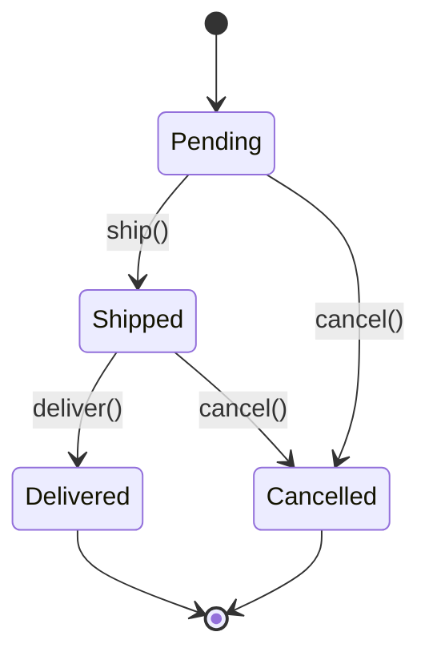
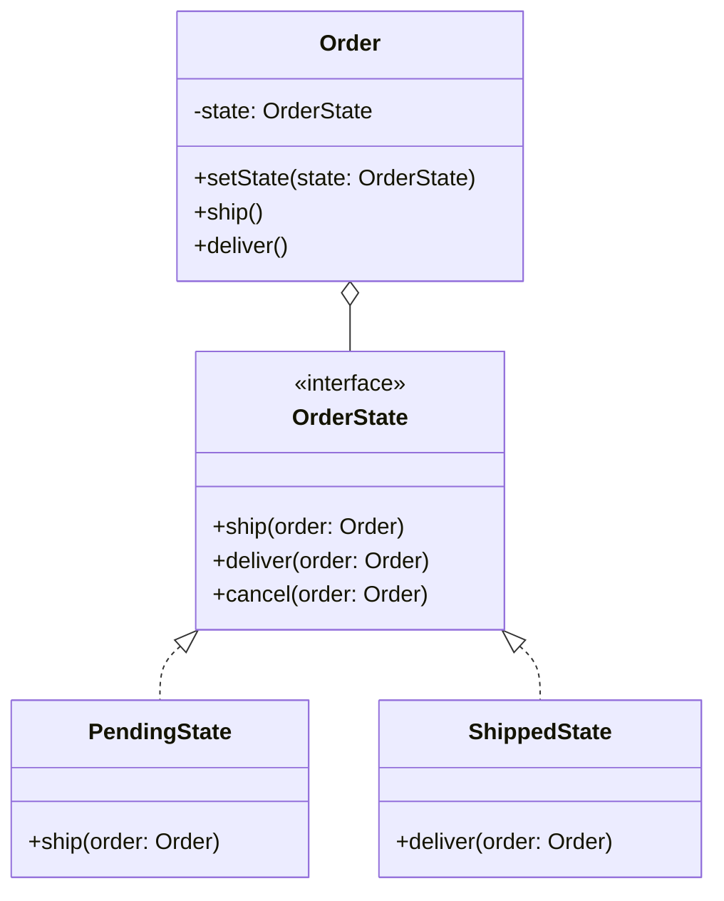

## Intent

> **Allow an object to alter its behavior when its internal state changes. The object will appear
> to change its class.**

State solves the problem of objects that move through a **lifecycle** — an `Order` going from
`Pending` to `Shipped` to `Delivered`, a `TrafficLight` cycling `Red → Green → Yellow` — where
**what the object does in response to the same method call changes depending on which stage of
its lifecycle it's currently in.**

## The Motivating Problem: A State Field and a Growing Conditional

```java
class Order {
    private String status = "PENDING";

    void ship() {
        if (status.equals("PENDING")) {
            status = "SHIPPED";
            System.out.println("Order shipped");
        } else {
            throw new IllegalStateException("Cannot ship from status: " + status);
        }
    }

    void deliver() {
        if (status.equals("SHIPPED")) {
            status = "DELIVERED";
            System.out.println("Order delivered");
        } else {
            throw new IllegalStateException("Cannot deliver from status: " + status);
        }
    }

    void cancel() {
        if (status.equals("PENDING") || status.equals("SHIPPED")) {
            status = "CANCELLED";
        } else {
            throw new IllegalStateException("Cannot cancel from status: " + status);
        }
    }
}
```

Every method repeats the same shape: check the current status string, decide if the transition is
legal, execute or reject. As more states and transitions are added, this becomes an increasingly
tangled web of string comparisons scattered across every method — the OCP violation from Chapter 8,
here specifically in the shape of "which transitions are legal from which state."

## The Fix: Each State Is Its Own Class

```java
interface OrderState {
    void ship(Order order);
    void deliver(Order order);
    void cancel(Order order);
}

class PendingState implements OrderState {
    public void ship(Order order) {
        System.out.println("Order shipped");
        order.setState(new ShippedState());
    }
    public void deliver(Order order) {
        throw new IllegalStateException("Cannot deliver a pending order");
    }
    public void cancel(Order order) {
        System.out.println("Order cancelled");
        order.setState(new CancelledState());
    }
}

class ShippedState implements OrderState {
    public void ship(Order order) {
        throw new IllegalStateException("Order already shipped");
    }
    public void deliver(Order order) {
        System.out.println("Order delivered");
        order.setState(new DeliveredState());
    }
    public void cancel(Order order) {
        System.out.println("Order cancelled after shipping");
        order.setState(new CancelledState());
    }
}

class Order {
    private OrderState state = new PendingState(); // starts in the initial state

    void setState(OrderState state) { this.state = state; }

    void ship() { state.ship(this); }
    void deliver() { state.deliver(this); }
    void cancel() { state.cancel(this); }
}
```

`Order` no longer contains any transition logic or status-checking conditionals at all — it simply
delegates every call to its current `state` object, and **each state decides for itself** which
transitions are legal and what the next state should be.





## State vs. Strategy: The Precise Distinction, Finally Resolved

Chapter 28 previewed this; here's the complete answer, now that both patterns are fully on the
table:

| | Strategy (Ch. 28) | State (this chapter) |
|---|---|---|
| **Who decides which implementation is active?** | Client code, explicitly, usually once | The state objects themselves, as part of transitions |
| **Does the active implementation change over the object's lifetime?** | Rarely | Constantly — that's the entire point |
| **Do implementations know about each other?** | No — fully independent, unaware of alternatives | Often yes — `PendingState` explicitly constructs `ShippedState` |
| **Structural shape** | Identical | Identical |

**The single fastest test:** does a concrete implementation ever construct or reference *another*
concrete implementation of the same interface, as part of driving a transition? If yes, that's a
strong State signal — Strategy implementations are, by design, mutually unaware of each other's
existence.

## A Subtlety: Who Should Own the Transition Logic?

The example above has each `State` class decide and construct the next state
(`order.setState(new ShippedState())`) — this is the most common approach, and it keeps all
knowledge of "what comes after Pending" inside `PendingState` itself, satisfying SRP for each
individual state's transition rules. An alternative puts transition logic inside `Order` itself
(a `switch` on the current state type deciding the next state) — but this reintroduces exactly the
centralized, growing-conditional problem State was introduced to eliminate. **Prefer letting each
state own its own outgoing transitions.**

## Are State Objects Singletons?

Since concrete state classes like `PendingState` typically hold no per-`Order` data of their own
(the actual order data lives on `Order` itself, passed as a parameter), a single shared
`PendingState` instance can safely serve every `Order` currently in that state — a natural,
low-risk application of the Flyweight (Chapter 26) and Singleton (Chapter 16) ideas together,
worth mentioning if an interviewer asks about object-count optimization for a system managing many
orders simultaneously.

## Summary

- State lets an object change its behavior automatically as it moves through a lifecycle, by
  delegating to a current-state object that itself decides both the behavior and the next
  transition.
- It replaces a growing, centralized conditional over a status field with one class per state,
  each owning its own legal transitions — satisfying OCP for adding new states.
- Distinguish from Strategy: Strategy implementations are static and mutually unaware; State
  implementations actively drive transitions and often reference each other directly.
- Concrete state classes are frequently stateless themselves and safe to share as Singletons
  across every object currently in that state.

---

## Interview Questions

**1. State the State pattern's intent, and explain what "the object will appear to change its
class" means in practice.**
State allows an object to alter its behavior when its internal state changes, structured so the
object appears, from the outside, to change which class it behaves like — calling the same method
(`order.ship()`) produces entirely different behavior depending on which concrete `OrderState`
object the `Order` currently delegates to, even though the `Order` object's own identity and type
never actually change. "Appears to change its class" captures this: behaviorally, the object acts
like a different type at different points in its lifecycle, purely by swapping which state object
it delegates to internally.
*Follow-up: Does the `Order` object's actual Java class ever change during this process?* No —
`Order` remains a single `Order` instance throughout its entire lifecycle; only its internal
`state` field's referenced object changes. The "appears to change its class" description refers
purely to the observable *behavioral* effect from an external caller's perspective, not to any
actual change in the `Order` object's own runtime type.

**2. Walk through the `Order` example and explain exactly what OCP violation the State-based
refactor eliminates.**
The original `Order` class checked the current status string with `if`/`else` conditionals
inside every method (`ship()`, `deliver()`, `cancel()`), scattered across the entire class — adding
a new state (say, "RETURNED") would require finding and editing every one of these methods to
account for the new status value and its legal transitions. The refactored version confines all
of a given state's transition logic to its own dedicated class (`PendingState`, `ShippedState`) —
adding a new state means writing one new class implementing `OrderState`, with existing state
classes and the `Order` class itself needing no modification (aside from wiring the new state into
whichever existing states can legally transition to it).
*Follow-up: Does adding a new state ever require modifying any *existing* state class, and if so,
does this represent an OCP violation?* Yes, potentially — if the new "RETURNED" state should be
reachable from the existing `DeliveredState`, you'd need to add a new method call or modify
`DeliveredState`'s existing method to construct and transition to the new `ReturnedState` — this is
a genuine, acknowledged modification to existing code, similar to the "adding a new family member"
trade-off discussed for Abstract Factory in Chapter 18; State's OCP benefit is strongest for adding
entirely new, independent states or extending which existing states can reach a new one, not
entirely free of any modification cost in every conceivable scenario.

**3. What is the single fastest, most reliable test for distinguishing State from Strategy, given
that both patterns share an identical structural shape?**
Check whether any concrete implementation of the shared interface ever constructs or references
*another* concrete implementation of that same interface as part of its own logic — in the `Order`
example, `PendingState.ship()` directly constructs `new ShippedState()`, meaning `PendingState`
has explicit knowledge of and a direct dependency on `ShippedState`. This kind of implementation-to-
implementation awareness is a strong, reliable signal of State, since Strategy implementations
(like `HourlyFeeStrategy` and `FlatFeeStrategy`) are, by design, completely independent and mutually
unaware of each other's existence — no `ConcreteStrategy` should ever need to know about or
reference a different `ConcreteStrategy`.
*Follow-up: Could you imagine a design where this test gives an ambiguous or borderline
answer?* If a "strategy" implementation happened to construct a different strategy implementation
purely as an internal implementation detail unrelated to any lifecycle transition (for example, a
composite strategy delegating a sub-calculation to another specific strategy instance it happens to
know about, similar to the `CompositeDiscount` example from Chapter 23), this could superficially
resemble the "implementation references another implementation" signal without actually being
State — the deciding factor in such a borderline case would be whether this cross-reference exists
specifically to drive a *lifecycle transition* representing the object's own changing state, versus
simply being one algorithm delegating a sub-computation to another for unrelated composition
reasons.

**4. Why is it generally preferred for each concrete `State` class to own and decide its own
outgoing transitions, rather than centralizing transition logic inside the `Order`/Context class
itself?**
If `Order` itself contained a switch statement or conditional deciding "given the current state
type, what's the next state for this transition," that centralized logic would need to be modified
every time a new state or new transition rule was introduced — precisely reproducing the original
growing-conditional problem State was introduced to eliminate, just moved from checking a string
status field to checking a state object's type. Letting each state class own its own transition
logic keeps that knowledge properly encapsulated and distributed exactly where it's most cohesive
(each state's own class knows its own legal next steps), satisfying both SRP (each state's class has
one clear responsibility: define this state's behavior and its own outgoing transitions) and OCP.
*Follow-up: Does this distributed-transition-ownership approach have any downsides compared to
centralizing the full state machine's transition rules in one place?* Yes — with transition logic
scattered across many individual state classes, it can become harder to get a single, complete,
at-a-glance view of the entire state machine's structure (all possible states and transitions)
without reading through every individual state class's code; some more sophisticated state-machine
implementations address this by maintaining a separate, explicit transition table or diagram
(sometimes generated or validated at build time) specifically to preserve this "whole picture"
visibility that pure distributed-ownership sacrifices for the sake of better OCP compliance.

**5. Is it accurate to say that State classes are typically stateless themselves, and if so, why
does this make treating them as Singletons or Flyweights a safe and reasonable optimization?**
Yes — concrete state classes like `PendingState` typically hold no fields of their own representing
per-`Order` data; the actual order-specific data (order ID, items, customer info) lives on the
`Order` object itself, which is passed as a parameter into each state method
(`ship(Order order)`). Since a `PendingState` instance's behavior depends entirely on the `Order`
parameter it's given at call time, and it holds no internal mutable state of its own between calls,
a single shared `PendingState` instance can safely and correctly serve as the current state for
many different `Order` objects simultaneously, without any risk of cross-contamination between
them — making it a safe candidate for the Singleton/Flyweight treatment discussed in Chapters 16
and 26.
*Follow-up: Would this Singleton/Flyweight optimization remain safe if a state class needed to
hold some state-specific configuration, like a "grace period in hours" value that varies per
`Order` instance rather than being a fixed constant for all orders in that state?* If the
configuration value genuinely needs to vary per `Order` instance (rather than being a fixed,
universal constant for the state itself, like "the grace period is always 24 hours for every
pending order"), that value should be stored on the `Order` object itself (or passed as a
parameter), not stored as a mutable field on the shared `PendingState` singleton instance — storing
per-order-varying data on a shared, singleton state object would break the safety of the
optimization entirely, reintroducing exactly the kind of dangerous shared mutable state discussed in
Chapters 20 and 26.

**6. How would you unit test the `Order`/`OrderState` design to verify that calling `deliver()`
while in the `PendingState` correctly throws an exception, without needing to first transition
through a real `ship()` call?**
You could construct an `Order` and directly inject or set its state to a `PendingState` instance
(if `Order` provides a way to do so, such as its default constructor already starting in
`PendingState`, or a package-private/testing-specific setter), then call `order.deliver()` and
assert that the expected `IllegalStateException` is thrown with an appropriate message — this
directly verifies `PendingState.deliver()`'s specific rejection logic in isolation, without needing
to first perform a real `ship()` transition to reach a different state first.
*Follow-up: Would you also want a test that verifies the full lifecycle sequence — starting as
Pending, shipping, then delivering — works correctly end to end?* Yes — in addition to testing each
individual state's specific transition rules in isolation (verifying `PendingState` alone,
`ShippedState` alone, etc.), an end-to-end test walking through a complete, valid lifecycle sequence
(`order.ship(); order.deliver();` and asserting the final state is `DeliveredState`) provides
valuable additional confidence that the states correctly hand off to each other in sequence, since
individual isolated state tests alone wouldn't necessarily catch a bug where, say, `PendingState`
incorrectly transitions to the wrong next-state class.

**7. In an LLD interview for a "design a traffic signal control system" problem (Chapter 63), how
would the State pattern apply to modeling the traffic light's Red/Green/Yellow cycle?**
Define a `TrafficLightState` interface with a method like `next(TrafficLight light)` (or,
depending on the specific design, methods representing whatever actions are valid in each
state), and three concrete states — `RedState`, `GreenState`, `YellowState` — where each state's
`next()` method transitions the `TrafficLight` to the correct following state
(`RedState.next()` transitions to `GreenState`, `GreenState.next()` transitions to `YellowState`,
`YellowState.next()` transitions back to `RedState`), forming a cyclical state machine rather than
the `Order` example's linear, terminating one.
*Follow-up: How does a cyclical state machine (traffic light) differ structurally from a linear,
terminating one (order lifecycle), and does this difference require any change to the basic State
pattern structure?* The core State pattern structure remains identical regardless of whether the
underlying state graph is cyclical or terminates in final states — the only difference is in each
state's own transition logic: `YellowState.next()` simply constructs and transitions to
`RedState` again (looping back), rather than transitioning to some kind of terminal
"finished" state as `DeliveredState` or `CancelledState` effectively represent in the order
example; the pattern itself is entirely agnostic to whether the resulting graph of state
transitions happens to cycle or terminate.

**8. Can the State pattern be combined with the Observer pattern (Chapter 29) — for example, if
other parts of the system need to be notified every time an `Order` transitions to a new state?**
Yes, and this is a very natural, common combination — `Order` could additionally implement the
`Subject` interface from Chapter 29, maintaining a list of registered `Observer`s, and each state
transition (inside `setState()`, or at the point each `OrderState` implementation calls
`order.setState(...)`) could trigger `notifyObservers()`, informing interested parties (a shipping
notification service, an analytics dashboard, an audit log) whenever the order's state changes,
without the `OrderState` classes themselves needing any direct knowledge of who's listening.
*Follow-up: Where would be the most appropriate place to trigger the Observer notification — inside
each individual `OrderState`'s transition logic, or centralized inside `Order.setState()`
itself?* Centralizing the notification call inside `Order.setState()` itself is generally
preferable — this guarantees that *every* state transition, regardless of which specific
`OrderState` implementation triggers it, reliably results in observers being notified, without
relying on every individual state class remembering to call `notifyObservers()` correctly and
consistently; this also keeps the actual state transition logic and the separate concern of
"broadcasting that a transition happened" cleanly divided between `OrderState` (deciding
transitions) and `Order` (managing state and, now, also managing notification), which is a clean
application of SRP given each of the two classes' distinct responsibilities.

**9. Is the State pattern's structure fundamentally different from implementing a state machine
using a plain `enum` with a `switch` statement over the current state? What's the specific
trade-off between the two approaches?**
An enum-with-switch approach centralizes all transition logic inside one large conditional
structure (similar to the original, non-State-pattern `Order` example, just organized around an
enum rather than a string), which is simpler and more compact for state machines with few states
and rarely-changing transition rules, but reintroduces the OCP violation the State pattern is
specifically designed to eliminate for larger or more frequently-extended state machines. The State
pattern trades this compactness for better extensibility (adding new states without modifying
existing code) at the cost of more classes and more indirection — a direct instance of the general
KISS-vs-OCP trade-off discussed throughout this series (notably in Chapter 12's DRY/KISS/YAGNI
discussion).
*Follow-up: For a state machine with only 2 or 3 fixed, never-expected-to-change states (like a
simple boolean-like on/off toggle), would you recommend the full State pattern or a simpler
enum/switch approach?* For a genuinely small, stable, unlikely-to-grow state machine (2–3 states
with no signal of future expansion), a simpler enum-based approach with a switch statement (or even
just a boolean flag, for a true binary on/off case) is likely the more appropriate, KISS-compliant
choice — introducing the full State pattern's multiple classes and interface for such a small,
stable case would be an unjustified complexity cost, mirroring the same "don't over-apply a pattern
to a problem too small to need it" judgment call established for other patterns throughout this
series.

**10. How would you handle validating that a requested state transition is legal, from the
perspective of code calling `order.ship()` — should the calling code need to know which
transitions are valid before calling, or should it simply attempt the call and handle a possible
exception?**
The State pattern's typical design (as shown in this chapter) allows calling code to simply attempt
any method call (`order.ship()`) without needing prior knowledge of the current state or which
transitions are currently legal — the appropriate `OrderState` implementation itself decides
whether the requested action is valid and either performs it or throws an exception describing why
it's invalid. This keeps calling code simple and decoupled from the state machine's internal rules,
though it does mean calling code needs to be prepared to handle a potential exception if it
attempts an invalid transition, rather than being able to proactively check validity beforehand
without attempting the call.
*Follow-up: Would you ever want to add a method like `boolean canShip()` to allow calling code to
proactively check whether a transition is currently valid, without attempting and potentially
catching an exception?* This can be a reasonable addition for use cases where calling code
specifically wants to conditionally show or hide a UI action (like graying out a "Ship" button when
shipping isn't currently valid) without relying on exception-based control flow for that purpose —
you'd add a corresponding `canShip()` (or similarly-named) method to the `OrderState` interface,
implemented by each state to return whether that specific transition is currently legal, giving
calling code an explicit, exception-free way to check validity proactively when that's the more
appropriate interaction pattern for the specific use case.

**11. Does the State pattern inherently prevent invalid state transitions at compile time, or
only at runtime?**
Only at runtime — the State pattern, as typically implemented, still relies on each concrete
state's method implementation to check and reject invalid transitions dynamically (throwing an
exception), rather than making invalid transitions impossible to even attempt at compile time. The
compiler has no way of knowing, just from the `Order` class's public API, that calling
`deliver()` while in `PendingState` is invalid — this information exists only in
`PendingState`'s own runtime logic.
*Follow-up: Could you achieve compile-time prevention of invalid transitions in Java, and if so,
what would that require?* Achieving genuine compile-time transition safety would require a more
elaborate design, such as having each state's methods return a *different, more specific* interface
or type representing only the valid subsequent operations from that new state (similar to the
"staged builder" technique mentioned in Chapter 19's interview questions) — for example,
`pendingOrder.ship()` could return a `ShippedOrder` type that simply doesn't expose a `ship()`
method at all, making a second, invalid `ship()` call a compile error rather than a runtime
exception; this is a considerably more complex, type-safe variant of State that's occasionally used
in libraries prioritizing maximum compile-time safety, though it's less commonly expected as a
default LLD interview answer given its added complexity.

**12. Explain how the State pattern relates to the concept of a "finite state machine" (FSM) from
computer science more broadly, and whether every FSM implementation is necessarily an instance of
the GoF State pattern.**
A finite state machine is the general computer-science concept of a system that can be in exactly
one of a finite number of states at any time, transitioning between states in response to inputs
according to well-defined rules — the GoF State pattern is one specific, object-oriented way of
*implementing* an FSM in code, using one class per state and polymorphic dispatch to handle
transitions. Not every FSM implementation uses this specific object-oriented structure — FSMs are
also commonly implemented using enum-and-switch approaches (discussed earlier), state-transition
tables (a data structure mapping current-state-plus-input to next-state, looked up rather than
dispatched polymorphically), or specialized state-machine libraries/frameworks — the GoF State
pattern is a particular, OOP-idiomatic implementation choice among several valid ways to implement
the same underlying FSM concept.
*Follow-up: Given these alternatives, when would you specifically favor the GoF State pattern's
object-oriented approach over a state-transition-table approach for implementing an FSM in a real
Java application?* The GoF State pattern's object-oriented approach is generally favored when each
state's behavior (not just its transition rules, but the actual business logic of what happens
while in that state, and what each valid action does) is complex enough to benefit from being its
own dedicated, testable class with real logic — a state-transition-table approach tends to be more
appropriate for simpler, more data-oriented FSMs where states have minimal or no independent
behavior beyond their transition rules, and the transition logic itself is the primary thing being
modeled, favoring the more compact, declarative table representation over defining a full class per
state.

**13. If a new requirement stated that "an admin should be able to force an order directly from
Pending to Cancelled, bypassing normal validation, in exceptional circumstances," how would you
accommodate this within the existing State-based design without compromising the pattern's
integrity?**
You could add a distinctly-named method (like `forceCancel()`) to the `OrderState` interface,
separate from the normal `cancel()` method, which every state implements to unconditionally
transition to `CancelledState` regardless of the current state's normal transition rules — this
keeps the "exceptional, bypass-validation" pathway explicit and clearly named/distinguished from
normal transitions, rather than weakening or adding special-case conditional logic to the existing
`cancel()` method's normal validation logic, preserving the integrity and clarity of the standard
transition rules while still accommodating the legitimate exceptional use case.
*Follow-up: Is there a risk that adding this kind of "bypass" method undermines the whole point of
having states enforce their own transition rules in the first place?* Yes, this is a legitimate
design tension worth acknowledging explicitly — deliberately allowing certain code paths (like an
admin-only "force" action) to bypass the state machine's normal invariants does introduce a
controlled "escape hatch" that weakens the otherwise-strong guarantee that state transitions always
follow the defined rules; this trade-off is sometimes necessary and acceptable for genuinely
exceptional, tightly-controlled administrative scenarios, but it should be used sparingly,
explicitly named to signal its exceptional nature (as `forceCancel()` does, versus a plain
`cancel()`), and ideally logged/audited given that it deliberately circumvents the system's normal
consistency guarantees.

**14. Having now covered Strategy, Observer, Command, and State — four foundational behavioral
patterns that all involve an interface implemented by interchangeable classes — summarize the
distinguishing question for each one, to serve as a quick reference for future interview
preparation.**
For **Strategy**: "Is client code selecting exactly one algorithm, once, to compute and return a
specific result?" For **Observer**: "Is an event being broadcast to zero-to-many dynamically-
registered listeners, with no meaningful return value the broadcaster uses?" For **Command**: "Is a
request being turned into a storable, queueable, or undoable object, decoupling an Invoker from a
Receiver that never reference each other directly?" For **State**: "Does the currently-active
implementation change automatically over the object's lifetime, with implementations often
directly referencing and transitioning to each other?" All four share the superficial "interface
plus interchangeable implementing classes" shape, but asking these specific, intent-focused
questions reliably distinguishes which pattern actually describes a given design's true purpose.
*Follow-up: Is there a risk that memorizing these four questions as a checklist could itself
become a shallow, "pattern-matching on vocabulary" habit, the exact failure mode Chapter 15 warned
against?* Yes, and this is worth being explicitly mindful of — the value of these questions isn't
in mechanically running through a checklist during an interview, but in having genuinely internalized
*why* each pattern's distinguishing characteristic matters for the specific design problem at hand;
used well, these questions are a fast way to articulate reasoning you've already substantially
worked through by understanding each pattern's underlying motivation deeply (as this and the
preceding three chapters aimed to build), not a substitute for that understanding — the checklist
should accelerate correct reasoning, not replace it.
