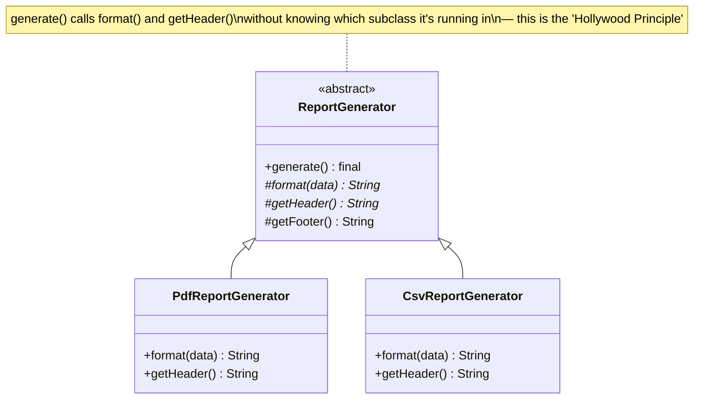

## Intent

> **Define the skeleton of an algorithm in an operation, deferring some steps to subclasses.
> Template Method lets subclasses redefine certain steps of an algorithm without changing the
> algorithm's overall structure.**

Template Method is the one pattern in this series that **deliberately uses inheritance as its
primary mechanism**, rather than favoring composition — worth noting explicitly, since Chapter 13
established composition as the general default.

## The Motivating Problem: Same Skeleton, Different Steps, Repeated

Consider generating a report in different formats — PDF and CSV — where the overall process is
identical (fetch data, format it, add a header/footer, save it), but the specific formatting step
differs.

```java
class PdfReportGenerator {
    void generate() {
        List<Data> data = fetchData();
        String formatted = formatAsPdf(data);
        String withHeader = "PDF REPORT\n" + formatted + "\nEND";
        save(withHeader);
    }
}

class CsvReportGenerator {
    void generate() {
        List<Data> data = fetchData(); // identical to PdfReportGenerator
        String formatted = formatAsCsv(data);
        String withHeader = "CSV REPORT\n" + formatted + "\nEND"; // nearly identical
        save(withHeader); // identical
    }
}
```

The overall **sequence** (fetch → format → wrap with header/footer → save) is duplicated across
every report type — a DRY violation (Chapter 12) — with only the formatting step genuinely
differing.

## The Fix: One Class Owns the Sequence, Subclasses Fill In the Gaps

```java
abstract class ReportGenerator {
    final void generate() { // "final" — the algorithm's structure cannot be overridden
        List<Data> data = fetchData();
        String formatted = format(data); // the one step that varies
        String withHeader = getHeader() + "\n" + formatted + "\n" + getFooter();
        save(withHeader);
    }

    private List<Data> fetchData() { /* shared, identical for every report type */ return null; }
    private void save(String content) { /* shared, identical for every report type */ }

    protected String getFooter() { return "END"; } // shared default, overridable if needed

    protected abstract String format(List<Data> data); // subclasses MUST implement this
    protected abstract String getHeader();
}

class PdfReportGenerator extends ReportGenerator {
    protected String format(List<Data> data) { return "..."; /* PDF-specific formatting */ }
    protected String getHeader() { return "PDF REPORT"; }
}

class CsvReportGenerator extends ReportGenerator {
    protected String format(List<Data> data) { return "..."; /* CSV-specific formatting */ }
    protected String getHeader() { return "CSV REPORT"; }
}
```

`generate()` — the **template method** — is declared `final` specifically so subclasses cannot
override the overall sequence, only the individual steps marked as customizable. This is the
pattern's defining discipline: **the algorithm's shape is fixed; only specific, clearly-marked
steps vary.**



## The "Hollywood Principle": Don't Call Us, We'll Call You

Template Method is the canonical example of this principle. In ordinary inheritance, a subclass
calls methods it inherits from its parent. Here, it's **inverted**: the parent class
(`ReportGenerator`) calls methods that the subclass provides (`format()`, `getHeader()`) — the
subclass never directly calls `generate()` itself; it simply supplies the pieces the parent's fixed
algorithm will call at the right moment. This inversion of control is exactly what makes the
overall sequence impossible for a subclass to accidentally corrupt.

## Template Method vs. Strategy: Inheritance vs. Composition, Same Underlying Goal

Both patterns let one "step" of a larger process vary while keeping the rest fixed — the difference
is the mechanism:

| | Template Method | Strategy (Ch. 28) |
|---|---|---|
| **Mechanism** | Inheritance — subclass overrides specific methods | Composition — a separate object is injected |
| **Where does the varying logic live?** | In a subclass, tightly bound to the base class | In a fully independent, swappable object |
| **Can the varying behavior change at runtime?** | No — fixed at compile time via subclassing | Yes — a new strategy object can be injected anytime |
| **Number of varying steps typically involved** | Often several steps within one algorithm | Usually one, focused behavior |

**Given Chapter 13's composition-over-inheritance guidance, when is Template Method still the
right call?** Specifically when **several steps of one cohesive algorithm** need to vary together
as a bound set (formatting *and* the header text both belong to "how PDF reports work"), and that
binding is genuinely permanent — not requiring runtime reconfiguration. If only **one** step
varies, or if runtime swapping is needed, Strategy (composition) is generally preferred, per
Chapter 13's default guidance.

## Where Template Method Appears in the JDK

`java.io.InputStream.read(byte[] b, int off, int len)` and Java's `AbstractList` (many of its
methods are implemented in terms of a few abstract methods like `get(int index)` and `size()` that
subclasses must provide) are real JDK examples — the abstract class defines the overall algorithm,
concrete subclasses fill in the specific data-access steps.

## Summary

- Template Method defines a fixed algorithm's overall sequence in a base class (usually a `final`
  method), deferring specific, individually-varying steps to abstract or overridable methods that
  subclasses implement.
- It's one of the few patterns in this series that deliberately uses inheritance as its core
  mechanism rather than composition — appropriate specifically because the varying steps are
  permanently, tightly bound to one overall algorithm's structure.
- The "Hollywood Principle" (the base class calls the subclass, not the other way around) is what
  prevents subclasses from corrupting the fixed algorithm's sequence.
- Prefer Strategy (composition) over Template Method (inheritance) when only one step varies, or
  when runtime reconfiguration is needed — reserve Template Method for permanently-bound,
  multi-step algorithm variations.

---

## Interview Questions

**1. State the Template Method pattern's intent, and explain why declaring the template method
itself as `final` is an important implementation detail, not just a stylistic choice.**
Template Method defines the fixed skeleton (sequence of steps) of an algorithm in a base class
method, while deferring specific individual steps to subclasses to implement or customize.
Declaring the template method `final` is important because it structurally prevents any subclass
from overriding and altering the overall sequence itself — without `final`, a subclass could
override `generate()` entirely and reorder, skip, or duplicate steps, defeating the entire purpose
of guaranteeing a consistent, fixed algorithm structure across every subclass.
*Follow-up: If the template method weren't declared `final`, would the pattern still technically
function, and what specific risk would this introduce?* It would still technically compile and
often work correctly if subclasses behave responsibly, but it would introduce a real risk: nothing
would prevent a careless or malicious subclass from overriding the template method and
completely changing the algorithm's structure (e.g., skipping the header/footer wrapping step
entirely), silently violating the guarantee that every subclass follows the same overall sequence —
`final` converts this from "a convention subclasses are expected to follow" into "a guarantee the
compiler enforces."

**2. Walk through the `ReportGenerator` example and explain precisely what DRY violation the
Template Method refactor eliminates.**
The original design had `PdfReportGenerator` and `CsvReportGenerator` each independently
implementing the entire `generate()` sequence — fetching data, formatting, wrapping with a header/
footer, and saving — with only the formatting step and header text genuinely differing between the
two; the shared steps (`fetchData()`, `save()`, the overall sequencing) were duplicated identically
across both classes. The refactor moves the shared sequence and shared step implementations into
the abstract `ReportGenerator` base class exactly once, with subclasses only providing the
genuinely-varying pieces (`format()`, `getHeader()`) — eliminating the duplicated shared-logic code
entirely.
*Follow-up: If a third report format (JSON) were added, how much new code would be required under
this Template-Method-based design?* Just one new class, `JsonReportGenerator`, implementing the
two abstract methods (`format()` for JSON-specific formatting, `getHeader()` for the JSON report's
header text) — the shared `fetchData()`, `save()`, and overall `generate()` sequence in
`ReportGenerator` require zero changes, directly demonstrating the pattern's OCP compliance for
adding new algorithm variants.

**3. Explain the "Hollywood Principle" ("don't call us, we'll call you") and how it applies
specifically to the Template Method pattern.**
The Hollywood Principle describes an inversion of typical control flow: rather than a subclass
actively calling methods on its parent class (the usual direction of calls in simple inheritance
hierarchies), the parent class's fixed algorithm (`generate()`) calls methods that the subclass
provides (`format()`, `getHeader()`) at the specific points where customization is needed — the
subclass supplies pieces of behavior without ever directly controlling or calling the overall
sequence itself. This inversion is what allows the base class to guarantee the algorithm's fixed
structure regardless of which subclass is in use, since the base class remains firmly in control
of *when* and *whether* each customizable step is invoked.
*Follow-up: Is the Hollywood Principle unique to Template Method, or does it appear in other
patterns covered in this series?* It's not unique to Template Method — the general principle of
"a higher-level component calls into lower-level, pluggable code rather than the reverse" appears
throughout dependency-inversion-driven designs (Chapter 11), and specifically resembles how a
Factory Method's caller invokes the factory rather than the factory driving the caller — though
Template Method is often cited as the most direct, textbook illustration of the Hollywood Principle
specifically because of its explicit "fixed sequence calling customizable steps" structure.

**4. Why is Template Method described as one of the few patterns in this series that deliberately
favors inheritance over composition, given Chapter 13's general "favor composition" guidance?**
Template Method's core mechanism inherently requires subclassing — a subclass overriding specific
abstract or protected methods that the parent class's fixed algorithm calls internally is, by
definition, an inheritance-based relationship; there's no natural way to achieve this same "fixed
sequence with pluggable individual steps, permanently bound together" structure using composition
alone without essentially reinventing something closer to Strategy for each individual step (which
changes the design's character significantly, as discussed later in this chapter). The pattern is
specifically justified as an exception to the general composition-over-inheritance guidance because
its use case (several permanently-bound, tightly-coupled steps within one algorithm) is precisely
the scenario where inheritance's tighter binding is actually a reasonable, deliberate fit rather
than a liability.
*Follow-up: Does this mean Template Method is immune to the LSP and combinatorial-explosion risks
that Chapter 13 warned about for inheritance generally?* Not entirely immune — if report types
needed multiple independent dimensions of variation (say, format type AND compression type,
independently combinable), Template Method's single-inheritance-chain structure would reintroduce
exactly the combinatorial-explosion risk discussed in Chapter 13, and Bridge (Chapter 22) or Strategy
composition would likely be preferable in that scenario; Template Method's inheritance-based
approach remains well-suited specifically when there's genuinely only one, tightly-cohesive
algorithm with a bounded, well-understood set of varying steps, not a general blanket exception to
every inheritance risk previously discussed.

**5. How would you decide between using Template Method versus Strategy for a given "one part of
this process varies" problem?**
Consider two factors: how many steps of the overall algorithm genuinely vary together as a bound
set, and whether runtime reconfiguration is needed. If only one focused piece of behavior varies,
and that behavior might reasonably need to be swapped at runtime (not fixed permanently at
subclassing/compile time), Strategy's composition-based approach is generally preferable, per
Chapter 13's default guidance. If several steps of one cohesive algorithm are permanently bound
together as a set that only makes sense combined (like a specific format's header text and its
specific formatting logic, which will never sensibly be mixed-and-matched with a different format's
header), and runtime swapping isn't needed, Template Method's inheritance-based approach is a
reasonable, deliberate fit.
*Follow-up: Could you refactor the `ReportGenerator` example to use Strategy/composition instead
of Template Method, and what would that look like?* Yes — you could define a
`ReportFormatStrategy` interface with methods like `format(data)` and `getHeader()`, and have a
single `ReportGenerator` class (no longer abstract, no subclassing needed) hold a
`ReportFormatStrategy` field injected via constructor, calling `strategy.format(data)` and
`strategy.getHeader()` inside its own `generate()` method — this achieves largely the same
practical outcome as Template Method but via composition, allowing the format strategy to be
swapped at runtime if ever needed, at the cost of the two related methods (`format()`,
`getHeader()`) now living in a possibly less tightly-bound relationship on a single strategy
interface rather than the more rigidly grouped subclass structure Template Method naturally
enforces.

**6. In the `ReportGenerator` example, `getFooter()` is implemented with a shared default
(`return "END";`) rather than being declared abstract like `format()` and `getHeader()`. What
does this specific design choice communicate, and what's this technique sometimes called?**
Providing a concrete, non-abstract default implementation for a customizable step (rather than
forcing every subclass to implement it) communicates that this particular step has a sensible
default behavior most subclasses will want, while still allowing any subclass that genuinely needs
different footer behavior to override it. This technique — providing an overridable method with a
default implementation, as opposed to a strictly-required abstract method — is sometimes called a
"hook method," distinguishing it from strictly mandatory abstract steps that every subclass must
explicitly implement.
*Follow-up: What's the risk of making too many of a Template Method's steps into optional "hook"
methods with defaults, rather than strictly required abstract methods?* If too many steps default
to generic, one-size-fits-most behavior, subclasses might silently inherit inappropriate default
behavior without realizing they should have overridden a particular step for their specific case —
whereas an abstract method forces every subclass to explicitly and consciously provide its own
implementation, catching an accidentally-forgotten customization at compile time rather than
allowing it to silently fall through to a possibly-wrong default at runtime; the choice between
abstract-and-mandatory versus concrete-with-default-and-optional should be made deliberately per
step, based on whether a sensible universal default genuinely exists.

**7. How would you unit test the abstract `ReportGenerator` class's shared `generate()` logic,
given that it's an abstract class that cannot be instantiated directly?**
You'd create a minimal, test-specific concrete subclass (sometimes informally called a "test
double subclass" or a simple stub subclass) implementing the required abstract methods with simple,
predictable, easily-asserted-on behavior (e.g., `format()` just returns a fixed known string, and
`getHeader()` returns a fixed known string), then instantiate this test subclass and call
`generate()`, asserting that the final saved output correctly combines the header, the formatted
content, and the footer in the expected order and format — this verifies the shared `generate()`
sequencing logic in `ReportGenerator` itself is correct, independent of any specific real report
format's actual formatting logic.
*Follow-up: Would this same test also implicitly verify that `PdfReportGenerator` and
`CsvReportGenerator` correctly integrate with the shared `generate()` logic, or would you need
separate tests for each concrete subclass too?* You would still want separate, dedicated tests for
`PdfReportGenerator` and `CsvReportGenerator` specifically verifying their own individual
`format()` and `getHeader()` implementations produce the correct, format-specific output — the
test-subclass-based test verifies the shared `ReportGenerator` sequencing logic works correctly in
general, while the per-concrete-class tests verify each specific subclass's own unique
contribution is correct, mirroring the same "test the shared logic once, test each specific
variant separately" principle applied to Strategy pattern testing in Chapter 28.

**8. Can a Template Method's fixed algorithm include conditional logic — for example, only
calling a certain customizable step if some condition (based on data fetched earlier in the
algorithm) is true?**
Yes — the template method's fixed sequence can include ordinary conditional logic determining
*whether* and *how many times* a given customizable step is called, as long as the overall
structure and the set of customization points remain consistent across all subclasses; for
example, `generate()` could check `if (data.isEmpty()) { return; }` before calling `format()` at
all, skipping formatting entirely for an empty dataset — this conditional logic lives in the fixed
template method itself (shared, identical behavior for every subclass), not inside any individual
subclass's customizable step implementation.
*Follow-up: Does adding this kind of conditional logic to the template method itself represent a
violation of the Open/Closed Principle if a new condition needs to be added later (say, also
skipping formatting for a specific report type only)?* If the new condition needs to apply
universally across every subclass (like "always skip formatting for empty datasets, regardless of
report type"), adding it to the shared template method is a legitimate modification to the shared
algorithm's logic — this is a natural, expected point of evolution for the fixed part of the
algorithm and isn't inherently an OCP violation in the same sense as modifying business-logic-
specific branches (per Chapter 8), since the "algorithm's own structure" is expected to occasionally
evolve; if instead the condition needs to vary *per subclass* (only PDF reports should skip
formatting for empty data, but CSV reports shouldn't), that specific per-subclass variability
should be expressed through another customizable hook method instead, keeping the shared algorithm
free of subclass-specific special-casing.

**9. How does Template Method relate to the Factory Method pattern — is it a coincidence that
both patterns are sometimes described using similar language (a base class deferring some
decision to subclasses)?**
It's not a coincidence — both patterns share the underlying structural idea of a base class
deferring some specific piece of work to subclasses, but they differ in *what kind* of work is
being deferred: Factory Method (Chapter 17) defers specifically the decision of *which concrete
object to construct and return*, while Template Method defers *specific steps of an ongoing
algorithm's execution* more broadly (which could include object construction as one of several
steps, but isn't limited to just that). In fact, the GoF's own original Factory Method examples are
sometimes described as a specialized, narrower case of the more general Template Method concept,
specifically applied to the single narrow concern of object creation.
*Follow-up: Could a Template Method's fixed algorithm include a step that's itself implemented
using Factory Method — for example, a `createReportWriter()` abstract method that returns a
different concrete writer object per subclass?* Yes — this is a natural and common combination;
`ReportGenerator`'s fixed algorithm could include a step like
`ReportWriter writer = createReportWriter();` where `createReportWriter()` is itself an abstract
Factory-Method-style method that each subclass implements to return a different concrete
`ReportWriter` implementation, with the resulting `writer` object then being used by subsequent
steps in the fixed algorithm — illustrating how Template Method (governing the overall algorithm
structure) and Factory Method (governing one specific object-creation step within that structure)
can compose naturally within a single design.

**10. In an LLD interview for a "design a data processing pipeline" problem, how might Template
Method apply if every pipeline needs to (1) read input data, (2) validate it, (3) transform it,
and (4) write output, with steps 2 and 3 varying by pipeline type while steps 1 and 4 remain
constant across all pipelines?**
Define an abstract `DataPipeline` class with a `final void run()` template method implementing the
fixed sequence (call `read()`, then `validate()`, then `transform()`, then `write()`), where
`read()` and `write()` are implemented once, shared, and identical across all pipeline types
(perhaps reading from and writing to the same kind of storage for every pipeline), while
`validate()` and `transform()` are abstract methods each concrete pipeline subclass
(`CustomerDataPipeline`, `SalesDataPipeline`) implements with its own domain-specific validation and
transformation logic.
*Follow-up: If a future requirement introduced a fifth pipeline type that needed a completely
different overall sequence — say, requiring validation to happen *twice*, before and after
transformation — how would you accommodate this without breaking the existing Template Method
design?* Since the `final` template method's fixed sequence is, by design, uniform across every
subclass, a genuinely different overall sequence for one specific pipeline type can't be
accommodated within the same Template Method hierarchy without either relaxing the `final`
keyword (undermining the pattern's core guarantee for every other pipeline) or recognizing that
this new pipeline type represents a genuinely different algorithm shape that doesn't actually fit
this particular Template Method's fixed structure — in that case, the more honest design response
is to implement this outlier pipeline as its own separate class outside this Template Method
hierarchy entirely, rather than forcing an increasingly-flexible, weakened Template Method to
accommodate a fundamentally different sequence it wasn't designed for.

**11. Does the presence of `protected` (rather than `public`) access modifiers on the abstract
methods in `ReportGenerator` (like `format()` and `getHeader()`) matter for the pattern's
correctness, or is it purely a stylistic choice?**
It's a meaningful, deliberate choice, not purely stylistic — `protected` visibility signals that
these methods are implementation details meant to be overridden by subclasses as part of
participating in the template method's algorithm, but are not meant to be called directly by
arbitrary external client code outside the class hierarchy; only the `generate()` template method
itself (declared `public` or with appropriate broader visibility) is intended as the actual public
entry point external code should use, consistent with the Hollywood Principle's expectation that
external code triggers the overall algorithm, not individual customizable steps in isolation.
*Follow-up: What would go wrong, from a design-clarity perspective, if `format()` and
`getHeader()` were instead declared `public`?* Making them `public` would signal (misleadingly)
that these methods are meant to be called directly and independently by external client code — a
caller might reasonably call `pdfGenerator.format(data)` directly, getting just the formatted
string with no header/footer/save behavior applied, which likely isn't a meaningful, intended
operation on its own; keeping them `protected` correctly communicates that these methods only make
sense as internal building blocks of the larger `generate()` algorithm, not as independently
useful public operations.

**12. How would the Template Method pattern's design change, if at all, to support Java's
functional interfaces and lambdas — could `format()` and `getHeader()` be passed in as lambda
parameters instead of implemented via subclassing?**
Yes, this transformation is possible and effectively converts the design from Template Method
(inheritance-based) into something closer to Strategy (composition-based) — you could refactor
`ReportGenerator` to be a single, non-abstract class whose constructor accepts
`Function<List<Data>, String> formatter` and `Supplier<String> headerSupplier` parameters (or a
combined interface bundling both), calling these functional parameters inside `generate()` instead
of calling abstract methods on `this`. This is precisely the Chapter 28-discussed distinction
between Template Method (inheritance) and Strategy (composition) — converting to lambdas naturally
shifts the design toward Strategy's composition-based character, since lambdas fundamentally work
through passed-in behavior (composition) rather than subclassing.
*Follow-up: Given this equivalence, is there ever a compelling reason to still choose the
inheritance-based Template Method approach over this lambda-based Strategy-style refactor in
modern Java?* Yes — if several customizable steps are tightly, permanently bound together as a
cohesive unit specific to one report type (formatting logic and header text always belonging
together as "how a PDF report works," never meaningfully mixed-and-matched independently), grouping
them together as one subclass's overridden methods can be clearer and less error-prone than
requiring every caller to correctly supply *multiple, correctly-paired* lambda parameters
separately every time a `ReportGenerator` is constructed — Template Method's inheritance-based
grouping provides a built-in guarantee that a given format's header and formatting logic are always
used together correctly, which passing separate, independently-suppliable lambda parameters doesn't
enforce as strongly.

**13. Explain a potential downside of the Template Method pattern related to testing subclasses
in isolation, given that the fixed algorithm in the base class always executes as part of testing
any subclass's specific behavior.**
Because the fixed algorithm (`fetchData()`, the overall sequencing, `save()`) always runs as part
of calling `generate()` on any concrete subclass, testing a specific subclass's unique
`format()`/`getHeader()` behavior in true isolation (without also exercising the shared
`fetchData()` and `save()` logic) is harder than it would be with a pure composition-based Strategy
approach, where the varying piece of logic (a `ReportFormatStrategy` implementation) could be
tested completely independently, with zero dependency on any shared sequencing or I/O logic at
all. This is a genuine, structural cost of the inheritance-based approach worth acknowledging.
*Follow-up: How would you mitigate this testing difficulty for a Template-Method-based design,
given this inherent limitation?* You could refactor the individual customizable steps
(`format()`, `getHeader()`) to be tested as standalone methods directly, called on a concrete
subclass instance without going through the full `generate()` template method at all (e.g., testing
`new PdfReportGenerator().format(testData)` directly, bypassing `generate()`'s shared fetch/save
steps entirely) — this works as long as those individual step methods don't have hidden
dependencies on other parts of the fixed algorithm's execution having already occurred, which is
worth designing for deliberately if isolated testability of individual steps matters for a given
Template Method implementation.

**14. Summarize the specific circumstances under which Template Method is the correct pattern
choice, contrasting it explicitly with the other behavioral patterns covered in this Part so far
(Strategy, Observer, Command, State) to reinforce when each one specifically applies.**
Template Method is the correct choice specifically when a fixed, multi-step algorithm has several
individual steps that vary together as a permanently-bound set, best expressed through inheritance
because the variation is fixed at compile/subclassing time and the steps are tightly cohesive to
one specific concrete variant. This differs from: Strategy (Chapter 28), used when exactly one
swappable, runtime-reconfigurable behavior varies independently; Observer (Chapter 29), used when
an event needs broadcasting to a dynamic, unknown number of interested listeners; Command (Chapter
30), used when a request itself needs to become a storable, queueable, or undoable object; and
State (Chapter 31), used when an object's behavior needs to change automatically and repeatedly as
it moves through its own lifecycle, with implementations often actively driving transitions between
each other. Each of these five patterns solves a genuinely distinct kind of "behavior needs to
vary" problem, and correctly identifying which specific shape a given problem matches — not merely
recognizing that "some interface with multiple implementations" is involved — is the core skill this
entire chapter sequence has built toward.
*Follow-up: Of these five patterns, which do you expect to be most commonly and naturally combined
with the remaining structural and creational patterns covered earlier in this series, and why?*
Strategy is likely the most frequently combined with other patterns overall, given its broad
applicability and its tendency to appear as an internal implementation detail within many other
patterns' own structures (as seen combined with Bridge in Chapter 22, with Facade in Chapter 25,
and referenced throughout Abstract Factory and Command discussions) — its narrow, focused
"one swappable algorithm" scope makes it a natural, low-friction building block that fits inside
many other larger pattern structures without conflicting with their own primary structural
concerns, unlike more structurally "heavier" or more specific patterns like Template Method or
State, which tend to more fully define the shape of whatever part of the design they're applied to.
