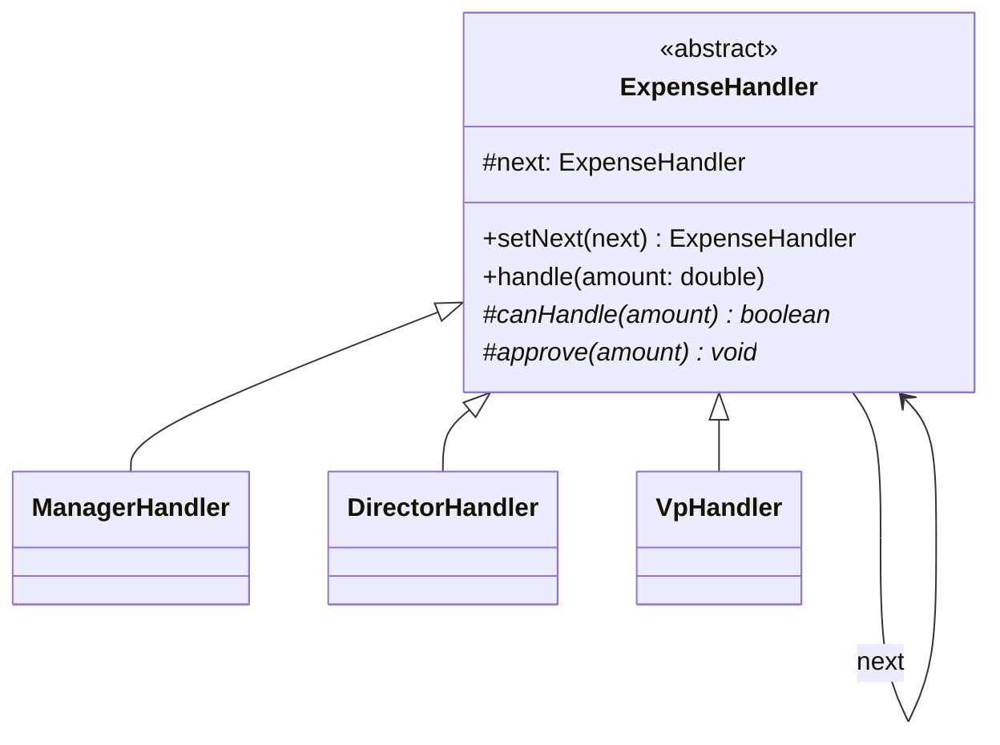
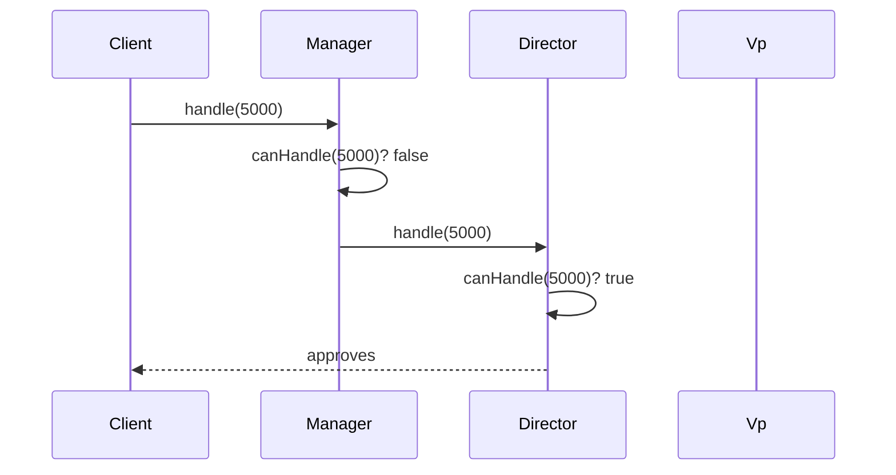

## Intent

> **Avoid coupling the sender of a request to its receiver by giving more than one object a
> chance to handle the request. Chain the receiving objects and pass the request along the chain
> until an object handles it.**

Chain of Responsibility solves a problem shaped like a support-ticket escalation process: **a
request needs to be handled by exactly one of several possible handlers, but the sender shouldn't
need to know which one, or how many exist.**

## The Motivating Problem: A Growing Conditional Over "Who Should Handle This"

An expense approval system where amount determines who approves it:

```java
class ExpenseApprover {
    void approve(double amount) {
        if (amount <= 1000) {
            System.out.println("Manager approves");
        } else if (amount <= 10000) {
            System.out.println("Director approves");
        } else {
            System.out.println("VP approves");
        }
    }
}
```

The now-familiar OCP violation — adding a new approval tier means editing this method directly.

## The Fix: A Chain of Handlers, Each Deciding to Handle or Pass Along

```java
abstract class ExpenseHandler {
    protected ExpenseHandler next;

    ExpenseHandler setNext(ExpenseHandler next) {
        this.next = next;
        return next; // enables fluent chain-building
    }

    void handle(double amount) {
        if (canHandle(amount)) {
            approve(amount);
        } else if (next != null) {
            next.handle(amount); // pass along the chain
        } else {
            System.out.println("No approver found for amount: " + amount);
        }
    }

    protected abstract boolean canHandle(double amount);
    protected abstract void approve(double amount);
}

class ManagerHandler extends ExpenseHandler {
    protected boolean canHandle(double amount) { return amount <= 1000; }
    protected void approve(double amount) { System.out.println("Manager approves " + amount); }
}

class DirectorHandler extends ExpenseHandler {
    protected boolean canHandle(double amount) { return amount <= 10000; }
    protected void approve(double amount) { System.out.println("Director approves " + amount); }
}

class VpHandler extends ExpenseHandler {
    protected boolean canHandle(double amount) { return true; } // catch-all
    protected void approve(double amount) { System.out.println("VP approves " + amount); }
}
```

```java
ExpenseHandler manager = new ManagerHandler();
manager.setNext(new DirectorHandler()).setNext(new VpHandler());

manager.handle(5000); // Manager can't handle it, passes to Director, who approves
```

Adding a new tier means writing one new `ExpenseHandler` subclass and inserting it into the chain
— no existing handler class is modified.





## Two Variants: Exactly-One-Handler vs. Every-Interested-Handler

The example above stops at the **first** handler that can handle the request (`canHandle()` returns
`true`). A second, equally valid variant lets **every** handler in the chain process the request
(if relevant) and continue passing it along regardless — common in middleware/filter pipelines
(e.g., an HTTP request passing through authentication, then logging, then rate-limiting middleware,
each doing its own work before calling the next). **Be explicit about which variant a problem calls
for** — "find the one right handler" versus "let every handler in the pipeline contribute."

## Chain of Responsibility vs. Decorator: Structurally Similar, Different Intent

Both involve objects linked in a sequence, each holding a reference to the next. The distinction:
**Decorator (Chapter 24) guarantees every layer executes, adding to the result; Chain of
Responsibility may stop at any point, with only one (or a subset) of handlers actually acting.**
A `MilkDecorator` never "declines" to add milk — every decorator in the chain always contributes.
An `ExpenseHandler` frequently declines and passes the buck entirely.

## Where Chain of Responsibility Appears in Real Java

Java's own `javax.servlet.Filter` chain (in web applications) and Spring's `HandlerInterceptor`
chain are direct real-world instances — each filter decides whether to process the request and
whether to call `chain.doFilter(...)` to continue to the next filter, or stop the chain entirely
(e.g., an authentication filter rejecting an unauthenticated request without ever reaching the
business-logic filters after it).

## Summary

- Chain of Responsibility passes a request along a sequence of handler objects until one handles
  it, decoupling the sender entirely from knowing which handler (or how many) will actually
  respond.
- Each handler decides independently whether to handle the request or pass it to the next handler
  in the chain — adding a new handler means inserting a new link, not modifying existing ones.
- Two variants exist: stop at the first handler that handles it, or let every handler in the chain
  contribute (as in middleware/filter pipelines) — be explicit about which one a problem needs.
- Distinguish from Decorator: Decorator's every layer always contributes; Chain of Responsibility
  may stop early, with only a subset (often exactly one) of handlers actually acting.

---

## Interview Questions

**1. State the Chain of Responsibility pattern's intent, and explain what specific coupling it
eliminates between a sender and its eventual handler.**
Chain of Responsibility avoids coupling the sender of a request to a specific receiver by giving
multiple potential handler objects, linked in a chain, the opportunity to handle the request in
turn — the sender only needs a reference to the first handler in the chain and has no knowledge of
how many handlers exist, which one will ultimately handle the request, or how they're internally
organized. This eliminates the sender needing any type-checking or conditional logic
("if amount is small, call the manager; if large, call the VP") to determine the correct handler
itself.
*Follow-up: Does the sender need to know anything at all about the chain's internal structure or
length?* No — the sender interacts with the chain purely through the first handler's shared
interface (`handle(amount)`), with zero knowledge of how many links exist or what each one's
specific criteria are; this is precisely what allows handlers to be added, removed, or reordered
without any change required to the sending code.

**2. Walk through the `ExpenseHandler` example and explain what OCP violation it resolves
compared to the single-method `if/else` version.**
The original single-method version required editing the same method directly to add, remove, or
change any approval tier's threshold — every change risked breaking the existing conditional
logic for other tiers. The chain-based version isolates each tier's specific criteria and behavior
into its own class; adding a new intermediate approval tier (say, a "Senior Manager" between
Manager and Director) means writing one new handler class and inserting it into the chain at the
correct position, with zero modification to the existing `ManagerHandler`, `DirectorHandler`, or
`VpHandler` classes.
*Follow-up: Does inserting a new handler into the middle of an existing chain (rather than at
the beginning or end) require modifying any existing handler class's own code?* No — inserting a
handler into the middle only requires updating the `setNext()` wiring at the point where the chain
is assembled (e.g., `manager.setNext(newSeniorManagerHandler).setNext(director)...`), not
modifying any handler class's internal implementation; the wiring/assembly of the chain is treated
as separate, external configuration distinct from each handler's own self-contained logic.

**3. Explain the two variants of Chain of Responsibility discussed in this chapter — "stop at
first handler" versus "every handler contributes" — and give a concrete example of when each is
appropriate.**
The "stop at first handler" variant (as shown in the `ExpenseHandler` example) is appropriate when
exactly one handler should ultimately be responsible for the request, and finding that one correct
handler is the goal — like expense approval, where exactly one approval tier should sign off. The
"every handler contributes" variant is appropriate for middleware/pipeline scenarios where multiple
independent concerns each need to process the same request in sequence, regardless of what earlier
handlers did — like an HTTP request passing through logging, authentication, and rate-limiting
filters, where each filter does its own independent work and (usually) still passes the request
along afterward.
*Follow-up: In the "every handler contributes" variant, does a handler ever still have the
ability to stop the chain early, and if so, under what circumstances would that be appropriate?*
Yes — even in a middleware-style chain where handlers typically all contribute and pass along,
individual handlers can still choose to stop the chain early under exceptional circumstances (an
authentication filter rejecting an unauthenticated request and immediately returning a 401 response
without ever invoking the remaining filters) — the "every handler contributes" framing describes
the *typical, expected* behavior for the happy path, not an absolute guarantee that every handler
will always execute in every scenario.

**4. How would you decide, given a design showing a linked sequence of handler objects, whether
it represents Chain of Responsibility or Decorator?**
Check whether every link in the chain is guaranteed to execute and contribute to the final result
(Decorator, per Chapter 24's distinguishing test), or whether links can decline to act and the
chain may stop partway through, with only a subset actually handling the request (Chain of
Responsibility). A `MilkDecorator` never "opts out" of adding milk once constructed into the chain;
an `ExpenseHandler` frequently does opt out (`canHandle()` returning `false`) and defers entirely
to the next link.
*Follow-up: Could a single design combine both patterns — for example, a chain of handlers where
each handler both decides whether to act AND adds some universal behavior (like logging)
regardless of whether it ultimately "handles" the request in the Chain-of-Responsibility sense?*
Yes — this is a common real-world hybrid, closely resembling how middleware filters actually behave
in practice: each filter might unconditionally log the request (Decorator-like "always
contributes") while also conditionally deciding whether to reject/short-circuit the request
entirely (Chain-of-Responsibility-like "may stop the chain") — recognizing that a single handler
class can incorporate both behaviors simultaneously, rather than needing to cleanly fit into
exactly one pattern's textbook description, is a realistic and valuable interview insight.

**5. Why is it important for each handler in the chain to hold a reference to the "next" handler
as a field, rather than the sender needing to iterate through a list of handlers itself?**
Holding the "next" reference internally within each handler is what allows the sender to remain
completely unaware of the chain's structure — the sender simply calls `handle()` on the first
handler and the chain's own internal linking mechanism takes care of passing the request along as
needed. If the sender instead held and iterated through a list of handlers itself, the sender
would need its own logic to decide when to stop iterating (once a handler successfully handles the
request), reintroducing exactly the kind of handler-selection logic in the sender that the pattern
is meant to eliminate.
*Follow-up: Is there a meaningful difference between "the sender holds a list and stops iterating
once handled" versus "each handler holds a reference to the next," in terms of where responsibility
for chain traversal actually lives?* Yes — with the sender-iterates-a-list approach, the
*sender* is responsible for the chain-traversal logic (deciding when to stop), meaning the sender
has more knowledge of and responsibility for how the chain works than intended; with each handler
holding its own "next" reference, the *chain itself* is responsible for its own traversal, and the
sender's only responsibility is triggering the first handler — this cleaner separation of concerns
is the more faithful, idiomatic implementation of the pattern's intent.

**6. How would you unit test the `ExpenseHandler` chain to verify that a request for $5000
correctly reaches and is handled by `DirectorHandler`, skipping `ManagerHandler`?**
Construct the chain (`manager.setNext(director).setNext(vp)`), call `manager.handle(5000)`, and
verify the expected outcome — either by capturing console output (less ideal, since it couples the
test to output formatting) or, more robustly, by refactoring `approve()` to record which handler
processed the request (e.g., via a mock/spy object, or having each handler set a field/return a
value indicating which handler ultimately handled it) and asserting that `DirectorHandler`
specifically was the one that handled it, while `ManagerHandler.approve()` was never called.
*Follow-up: Would you also want a specific test verifying the "no handler found" fallback
behavior — for example, calling `handle()` with an amount that exceeds even the last handler's
`canHandle()` criteria, if the chain didn't include a catch-all handler like `VpHandler`?* Yes —
testing the chain's behavior when no handler in the chain can process a given request (verifying
the appropriate fallback message or exception occurs, rather than silently doing nothing or
throwing an unexpected `NullPointerException` when `next` is `null`) is an important edge case,
directly analogous to testing empty-collection or no-match edge cases discussed for other patterns
throughout this series (like Chapter 23's empty-folder test).

**7. Can Chain of Responsibility be combined with the Factory Method pattern (Chapter 17) to
dynamically construct and assemble the chain itself, rather than manually wiring it together with
explicit `setNext()` calls in application code?**
Yes — a `ChainFactory` could be responsible for constructing the appropriate sequence of handlers
and wiring them together via `setNext()` calls internally, returning just the first handler in the
fully-assembled chain to calling code, which then only needs to call `handle()` on that single
returned object with no knowledge of how the chain was assembled or how many handlers it
contains — combining Chain of Responsibility (the runtime request-handling structure) with Factory
Method (the chain's own construction/assembly logic) to further decouple calling code from even the
chain's construction details.
*Follow-up: Would this factory-based chain assembly be a good place to read chain configuration
from an external source, like a configuration file specifying which approval tiers exist and their
thresholds?* Yes — this is a natural, valuable extension point: the factory could read
threshold values (and even which handler classes to instantiate, via a registry similar to the
`VehicleFactoryProvider` pattern from Chapter 17) from external configuration, allowing the
approval chain's structure to be reconfigured (adding, removing, or adjusting tiers) without any
code changes or recompilation — directly paralleling the configurable-remote-control scenario
discussed for the Command pattern's factory combination in Chapter 30.

**8. In an LLD interview, if asked to design a customer support ticket routing system where a
ticket should be handled by the first available agent with matching expertise, and escalated to a
supervisor if no agent is available, how would Chain of Responsibility apply?**
Model each support tier (Level 1 agents, Level 2 specialists, a supervisor) as a
`SupportHandler` in a chain, where each handler's `canHandle()` checks both expertise match and
current availability, and `handle()` either resolves the ticket or passes it to the next handler
if unavailable or unqualified — a ticket entering the chain at the Level 1 handler would
automatically escalate through Level 2 and ultimately to the supervisor if no earlier handler could
resolve it, exactly mirroring the expense-approval structure but applied to support ticket routing
based on expertise and availability rather than a numeric amount threshold.
*Follow-up: How would you handle a scenario where a ticket needs to be routed based on *multiple*
independent criteria simultaneously — say, both expertise area (billing vs. technical) AND urgency
level — rather than a single linear threshold?* This might call for either multiple parallel
chains (one chain per expertise area, with the correct chain selected via a separate dispatch step
based on the ticket's category before entering the appropriate chain), or a more sophisticated
`canHandle()` check evaluating multiple criteria simultaneously within each handler
(`canHandle(ticket)` checking both the handler's expertise area matches AND urgency level is within
that tier's scope) — the right approach depends on whether the two criteria interact in a way that
still fits a single, linear escalation sequence, or whether they represent genuinely independent
dimensions better modeled with a routing/dispatch step (potentially combined with Strategy,
Chapter 28) feeding into the correct chain.

**9. Does every handler in a Chain of Responsibility need to be aware of the concrete type of the
"next" handler it points to, or can the chain be built with handlers that are entirely unaware of
each other's specific types?**
Handlers should be, and typically are, entirely unaware of each other's specific concrete types —
each handler holds its "next" reference typed as the shared abstract `ExpenseHandler` type (or
interface), not as any specific concrete subclass like `DirectorHandler`, meaning
`ManagerHandler` has no compile-time or runtime knowledge of what specific kind of handler comes
next, only that *some* `ExpenseHandler` (of whatever concrete type) will receive the passed-along
request if it can't handle it itself. This mutual unawareness is what allows handlers to be freely
reordered, added, or removed without any handler's own code needing to change.
*Follow-up: Does this mutual unawareness between handlers relate to any principle discussed in
earlier chapters regarding coupling?* Yes — this directly reflects the Dependency Inversion
Principle (Chapter 11) and the general "depend on abstractions, not concretions" discipline applied
specifically to the "next" reference — each handler depends on the abstract `ExpenseHandler` type
for its chain-continuation reference, not on any specific concrete handler class, keeping coupling
between individual handlers as loose as possible.

**10. How would you handle a scenario where the chain itself needs to support being traversed in
a loop or cycle — for example, if a request could legitimately need to pass through the same
handler more than once? Is this a normal, supported use case for Chain of Responsibility, or does
it represent a design problem?**
A genuine cycle in the chain (where a request could loop back to a handler it already passed
through) is generally considered a design flaw or bug in a typical Chain of Responsibility
implementation, not a supported use case — the pattern's fundamental assumption is a request moves
forward through a finite, terminating sequence of handlers until either handled or exhausting the
chain; an accidental cycle would cause infinite looping, similar in nature to the cyclical-folder
concern raised for the Composite pattern in Chapter 23. If a scenario genuinely requires
re-processing by an earlier handler under certain conditions, that's typically better modeled as an
explicit, deliberate design (perhaps looping logic at a higher level, re-submitting the request to
the start of the chain intentionally, with clear termination conditions) rather than an implicit
cycle within the chain's own `next` pointers.
*Follow-up: How would you defensively guard against an accidental cycle being introduced when
wiring up a chain via `setNext()` calls, especially in a system where chain assembly might be
driven by external configuration?* You could add validation logic during chain construction (in a
`ChainFactory`, as discussed earlier) that walks the chain being assembled and checks for any
handler appearing more than once, throwing an explicit, clear configuration error if a cycle is
detected — catching this kind of misconfiguration at chain-assembly time, with a clear error
message, is far preferable to allowing it to cause a silent infinite loop or stack overflow only
discovered later at runtime when a specific request happens to trigger it.

**11. Explain how Chain of Responsibility satisfies the Single Responsibility Principle, using
the `ExpenseHandler` example.**
Each concrete handler class (`ManagerHandler`, `DirectorHandler`, `VpHandler`) has exactly one
clear responsibility: deciding whether it can handle requests within its own specific threshold and
performing its own specific approval action — none of them need to know about or handle any other
tier's logic or thresholds. This is a direct contrast to the original single-method version, where
one method held the combined responsibility (and thus multiple reasons to change) for every
approval tier's logic simultaneously.
*Follow-up: Would combining `ManagerHandler` and `DirectorHandler`'s logic into a single class
with two separate methods (`canHandleAsManager()`, `canHandleAsDirector()`) still satisfy SRP?*
No — this would reintroduce a single class with multiple, independent reasons to change (a change
to manager-tier logic and a change to director-tier logic would both require modifying this same
combined class), which is exactly the SRP violation the original `if/else` approach exhibited, just
reorganized into differently-named methods within one class rather than eliminated; genuinely
separate handler classes, each focused on exactly one tier, are what correctly satisfies SRP here.

**12. If a request needs to be handled by *multiple* handlers in the chain simultaneously (not
just the first one that can handle it, and not the "every handler always contributes" middleware
variant, but specifically "every handler whose criteria match should independently process this
request"), how would you modify the basic Chain of Responsibility structure to support this?**
You'd modify `handle()` to always continue to `next.handle(amount)` after processing (rather than
stopping once a handler's `canHandle()` returns true), so every matching handler in the chain gets
a chance to process the request independently, regardless of whether an earlier handler already
did — this is a meaningful structural variant sometimes distinguished as "chain of responsibility
without short-circuiting," blurring closer toward the Observer pattern's "notify everyone
interested" spirit (Chapter 29), though it retains Chain of Responsibility's sequential,
one-handler-passes-to-the-next structure rather than Observer's typically-unordered broadcast to a
registered list.
*Follow-up: At what point does this "let every matching handler process it" variant become
functionally indistinguishable from just using Observer instead?* If the sequential ordering
between handlers genuinely doesn't matter for the specific problem at hand (any matching handler
processes the request independently, with no dependency on processing order or on what earlier
handlers did), Observer's simpler "maintain a list, notify all matching listeners" structure would
likely be a more natural, appropriately-named fit than forcing this behavior into a
Chain-of-Responsibility-shaped, linked-list structure; Chain of Responsibility's specific value
remains strongest when the *sequential order* of consideration genuinely matters (as in the
escalation-tier example, where lower tiers should always be considered before higher ones).

**13. How would you explain to an interviewer why you chose Chain of Responsibility over a simple
sorted list of handlers with a loop, iterating until one returns "handled," given that both
approaches could functionally achieve the same "find the first matching handler" outcome?**
Explain the key structural benefit: Chain of Responsibility fully decouples the sender from the
concept of "there are multiple handlers to iterate through" at all — the sender simply calls
`handle()` on one object, with the chain's own internal `next` references handling traversal, versus
a sorted-list-with-a-loop approach where the sender (or some iterating utility class) needs
explicit knowledge that a *collection* of handlers exists and needs to be iterated, reintroducing
some of the "sender knows about the mechanism for finding the right handler" coupling the pattern is
specifically designed to eliminate. Both approaches can achieve similar practical outcomes for
simple cases, but Chain of Responsibility's structure more cleanly and completely removes this
knowledge from the sender's responsibility.
*Follow-up: Is there a legitimate case where the simpler sorted-list-with-a-loop approach would
actually be preferable to the full Chain of Responsibility pattern?* Yes — for a small, simple,
rarely-changing set of handlers where the "decoupling the sender from iteration mechanics" benefit
provides little practical value, and where having an explicit, visible, easily-inspectable list of
all handlers in one place (rather than following `next` references through several separate
objects) actually aids readability and debugging, a simpler sorted-list approach can be a
reasonable, KISS-compliant alternative — this mirrors the general "don't over-apply a pattern to a
small, stable problem" judgment call established throughout this series.

**14. Having now covered five behavioral patterns (Strategy, Observer, Command, State, Template
Method) plus Chain of Responsibility, summarize the specific distinguishing question for Chain of
Responsibility relative to the others, and note which existing pattern it most closely resembles
structurally.**
Chain of Responsibility's distinguishing question is: "Does a request need to pass through a
sequence of potential handlers, where each one independently decides whether to act on it or pass
it along, without the sender knowing in advance which one (if any) will ultimately handle it?" It
most closely resembles Decorator (Chapter 24) structurally — both link objects in a sequence, each
holding a reference to the next — but differs critically in that Decorator's every link is
guaranteed to execute and contribute, while Chain of Responsibility's links may decline and the
chain may stop at any point, with potentially only one (or a subset) of links actually acting.
*Follow-up: Given how many of these behavioral patterns share overlapping structural shapes
(interface with multiple implementations; linked sequence of objects; one object delegating to
another), what overarching skill does this Part of the series seem most focused on building,
beyond just memorizing each individual pattern's definition?* This Part is most fundamentally
focused on building the skill of precisely articulating a design's actual *intent* and *behavioral
guarantees* (does every step always execute? does the active implementation change over time? is a
request being turned into storable data? is a decision being deferred to exactly one selected
implementation, or broadcast to many?) rather than relying on superficial structural
pattern-matching — since so many of these patterns share nearly identical code-level shapes, the
ability to ask and answer these precise, intent-focused distinguishing questions is what
separates genuine understanding from memorized vocabulary, which has been this Part's consistent
throughline since Strategy was first formally introduced in Chapter 28.
