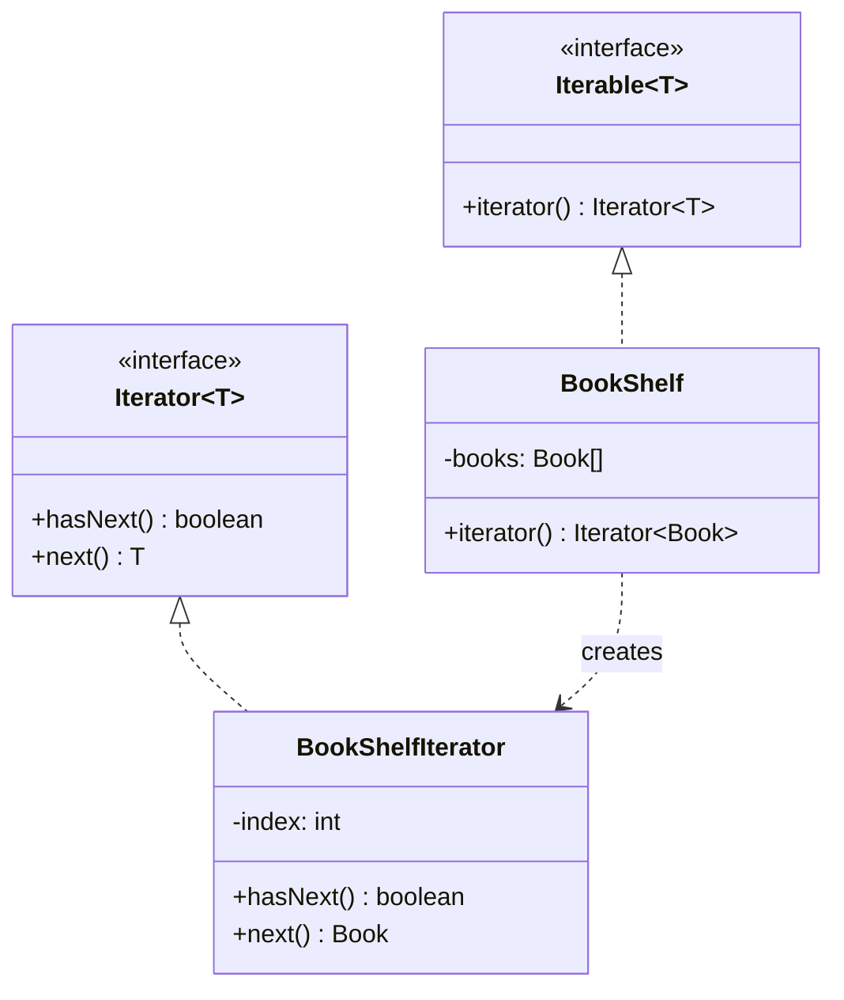

## Intent

> **Provide a way to access the elements of an aggregate object sequentially without exposing its
> underlying representation.**

If Java's `for (Item item : collection)` loop has ever felt too basic to need a "pattern," this
chapter's job is to show precisely why it's a genuine, deliberate design decision — one that pays
off the moment a collection's internal structure isn't a simple array.

## The Motivating Problem: Exposing Internal Structure Just to Allow Traversal

```java
class BookShelf {
    private Book[] books;
    private int count;

    Book[] getBooks() { // exposes the entire internal array
        return books;
    }
}
```

Exposing `books` directly forces every caller to know it's backed by an array, breaks encapsulation
(Chapter 2 — any caller can now mutate the array directly), and locks the class into that specific
internal representation forever — switching to a `LinkedList` or a custom tree structure later
would break every caller depending on `Book[]`.

## The Fix: A Dedicated Traversal Object

```java
interface Iterator<T> {
    boolean hasNext();
    T next();
}

class BookShelf implements Iterable<Book> {
    private Book[] books;
    private int count;

    public Iterator<Book> iterator() {
        return new BookShelfIterator();
    }

    private class BookShelfIterator implements Iterator<Book> { // inner class — accesses outer fields directly
        private int index = 0;

        public boolean hasNext() { return index < count; }
        public Book next() { return books[index++]; }
    }
}
```

```java
BookShelf shelf = new BookShelf();
for (Book book : shelf) { // works because BookShelf implements Iterable
    System.out.println(book.getTitle());
}
```

`BookShelf` could switch its internal storage from an array to a `LinkedList`, a tree, or a
database-backed lazy loader tomorrow, and every caller using the `for-each` loop would be
completely unaffected — they only ever interact through `Iterator`'s two methods, never through
`books` directly.



## Why an Inner Class? Encapsulating Traversal State Without Polluting the Collection

`BookShelfIterator` is written as an **inner class** specifically so it can directly access
`BookShelf`'s private fields (`books`, `count`) without needing public getters that would defeat
the whole purpose. Just as importantly: **the traversal position (`index`) lives on the iterator,
not on `BookShelf` itself.** If `BookShelf` tracked its own single "current position" field
directly, only **one** traversal could happen at a time — two separate `for-each` loops over the
same shelf running concurrently (or even nested) would corrupt each other's position. Each call to
`iterator()` returns a **fresh** iterator object with its own independent `index`, so multiple
simultaneous traversals of the same collection are entirely safe.

## Fail-Fast Iterators: A Critical Java-Specific Detail

Java's built-in collection iterators (`ArrayList`, `HashMap`, etc.) are **fail-fast**: if the
underlying collection is structurally modified (an element added or removed) while an iteration is
in progress — by any code, not just the iterator itself — the very next call to `next()` throws a
`ConcurrentModificationException`, rather than silently producing corrupted or unpredictable
results.

```java
List<String> names = new ArrayList<>(List.of("Alice", "Bob", "Carol"));
for (String name : names) {
    if (name.equals("Bob")) {
        names.remove(name); // ConcurrentModificationException on the NEXT iteration
    }
}
```

**The correct fix** is using the iterator's own `remove()` method (part of the `Iterator`
interface, alongside `hasNext()`/`next()`), which safely updates the iterator's internal tracking
state along with the underlying collection:

```java
Iterator<String> it = names.iterator();
while (it.hasNext()) {
    if (it.next().equals("Bob")) {
        it.remove(); // safe — the iterator itself manages this consistently
    }
}
```

This is a **frequently tested, practical Java detail** — knowing *why* `ConcurrentModificationException`
happens (not just that it happens) signals real hands-on experience, not just pattern-diagram
recall.

## Iterator vs. Composite: A Natural, Frequent Pairing

Chapter 23 previewed this directly: a `Folder`'s recursive tree structure can be wrapped in an
`Iterator` implementation that performs the traversal internally (depth-first or breadth-first),
exposing a simple, flat `for-each`-compatible sequence to callers who don't need to know or care
that the underlying structure is actually a recursive tree. **Iterator is frequently the tool that
makes a Composite structure's complexity invisible to ordinary consumers.**

## Summary

- Iterator provides sequential access to a collection's elements without exposing its internal
  representation — callers depend only on `hasNext()`/`next()`, never on the underlying data
  structure.
- Traversal state (the current position) belongs on the iterator object, not the collection
  itself, so multiple independent traversals of the same collection can happen simultaneously
  without interfering with each other.
- Java's built-in iterators are fail-fast — structurally modifying a collection during iteration
  (except via the iterator's own `remove()`) throws `ConcurrentModificationException` by design,
  to prevent silent corruption.
- Iterator pairs naturally with Composite (Chapter 23), hiding a recursive tree structure's
  complexity behind a simple, flat traversal interface.

---

## Interview Questions

**1. State the Iterator pattern's intent, and explain what specific encapsulation problem it
solves.**
Iterator provides a way to access a collection's elements sequentially without exposing the
collection's internal representation (array, linked list, tree, or otherwise) to the code
traversing it. It solves the encapsulation problem of a collection class either exposing its raw
internal data structure directly (like returning a `Book[]` array), which locks callers to that
specific representation and allows uncontrolled external mutation, or requiring every caller to
know the exact internal structure to traverse it correctly — Iterator instead provides a uniform,
representation-independent traversal interface (`hasNext()`/`next()`) that hides these internal
details completely.
*Follow-up: Could a collection class technically provide a `size()` and `get(int index)` method
pair instead of a full Iterator, and would this achieve the same encapsulation benefit?* This
would work for index-based, random-access-friendly structures like arrays or `ArrayList`, but it
doesn't generalize well to structures without efficient random access (like a `LinkedList`, where
`get(index)` requires traversing from the start each time, or a tree structure with no natural
linear indexing at all) — a true `Iterator` abstracts over *any* underlying traversal mechanism
uniformly, regardless of whether the structure supports efficient random access, making it a more
broadly applicable and appropriate abstraction for this specific purpose.

**2. Why does the `BookShelfIterator` need to be its own separate object, with its own `index`
field, rather than having `BookShelf` itself track "the current traversal position" as a single
field?**
If `BookShelf` tracked traversal position as a single field on itself, only one traversal of that
shelf could ever be in progress at a time — a second, independent `for-each` loop over the same
`BookShelf` instance (whether nested inside the first loop, or running concurrently on a different
thread) would share and corrupt the same position field, causing both traversals to interfere with
each other unpredictably. By having each call to `iterator()` return a brand-new
`BookShelfIterator` object with its own independent `index` field, multiple simultaneous, fully
independent traversals of the same underlying `BookShelf` are safely supported, since each
iterator object tracks its own position separately.
*Follow-up: Does this mean it's always safe to have two `for-each` loops running over the same
`BookShelf` object simultaneously, given this design?* It's safe with respect to traversal-position
corruption specifically (each iterator's own position is independent), but it doesn't automatically
make it safe against the underlying collection being *modified* during either traversal — that
separate concern is what fail-fast iterators specifically address, as discussed later in this
chapter; independent traversal position and safety against concurrent structural modification are
two distinct concerns this design addresses somewhat separately.

**3. Explain what "fail-fast" means for Java's built-in iterators, and why throwing an exception
is considered better behavior than silently continuing with possibly-corrupted results.**
Fail-fast means that if a collection is structurally modified (elements added or removed) while an
iterator is actively traversing it — other than through that same iterator's own `remove()` method
— the iterator detects this on its next operation and immediately throws a
`ConcurrentModificationException`, rather than attempting to continue iterating over a collection
whose structure has changed underneath it in an inconsistent, unpredictable way. This is considered
better than silent continuation because silently iterating over a structurally-changing collection
could produce genuinely incorrect results (skipping elements, revisiting elements, or even crashing
with a more confusing, harder-to-diagnose error later) without any clear signal to the developer
about what went wrong or why — failing loudly and immediately, right at the point of the actual
problem, is far easier to debug than a silent correctness bug discovered much later.
*Follow-up: How does the iterator detect that a structural modification has occurred, at a
conceptual/mechanical level, without needing to fully re-scan the entire collection on every
`next()` call?* Most JDK collection implementations maintain an internal "modification count"
(`modCount`) field that's incremented every time the collection is structurally modified; the
iterator captures this count's value when it's created and compares it against the collection's
current count on each `next()` call — a mismatch indicates a structural modification occurred after
the iterator was created, triggering the exception, without needing an expensive full re-scan.

**4. Why does calling `list.remove(element)` directly inside a `for-each` loop over that same
list throw `ConcurrentModificationException`, while calling `iterator.remove()` on the loop's own
underlying iterator does not?**
Calling `list.remove(element)` directly modifies the collection's structure through the
collection's own removal method, which increments its internal modification count — but the
`for-each` loop's iterator has no way of knowing this removal was "expected" or "safe," so its
modification-count check on the next `next()` call detects the mismatch and throws. Calling
`iterator.remove()` instead goes through the iterator's own dedicated removal method, which is
specifically designed to update both the underlying collection's structure *and* the iterator's own
internal tracking state (including the modification count it expects) consistently and atomically,
so the iterator's own subsequent `hasNext()`/`next()` calls remain correctly synchronized with the
now-modified collection.
*Follow-up: Is `iterator.remove()` capable of removing an arbitrary element from the collection,
or is it restricted in what it can remove?* `Iterator.remove()` is restricted to removing only
the element most recently returned by that same iterator's own `next()` call — it cannot be used to
remove an arbitrary, different element from the collection; this restriction exists precisely
because the iterator needs to maintain a consistent, well-defined relationship between its own
internal traversal position and the specific element it's being asked to remove.

**5. In an LLD interview, how would you implement a custom `Iterator` for a `Folder` class from
the Composite pattern example in Chapter 23, providing a flat, sequential view of every `File`
contained anywhere in a potentially deeply-nested folder structure?**
You'd implement `Iterable<File>` on `Folder`, with the `iterator()` method returning a custom
iterator that internally performs a depth-first (or breadth-first) traversal of the nested tree
structure — commonly implemented using an explicit stack (for depth-first) that's pre-loaded with
the root folder's children, where `hasNext()` checks if the stack is non-empty (after possibly
pushing newly-discovered folder children while skipping past folders to find the next actual
`File`), and `next()` pops and returns the next `File` found, pushing any of its container's
newly-encountered subfolder contents onto the stack as needed during traversal.
*Follow-up: Why would an explicit stack-based approach (rather than simple recursive method
calls) typically be preferred for implementing this specific iterator's internal traversal
logic?* An `Iterator`'s `hasNext()`/`next()` methods are called incrementally, one element at a
time, by external calling code — a natural recursive traversal (like `Folder.getSize()`'s
recursion in Chapter 23) processes an entire subtree in one continuous call, which doesn't map
cleanly onto "pause after each single element and wait to be called again for the next one";
an explicit stack (or a similar mechanism) lets the iterator maintain its traversal state between
separate `next()` calls, resuming exactly where it left off each time, which a simple recursive
call structure doesn't naturally support without additional coroutine-like mechanisms Java doesn't
provide directly for this purpose.

**6. Does implementing `Iterable<T>` (providing an `iterator()` method) automatically make a
class thread-safe for concurrent iteration by multiple threads?**
No — implementing `Iterable` and providing correctly-functioning `Iterator` objects (each with its
own independent traversal state, as discussed earlier) makes multiple *sequential or logically
independent* traversals safe from interfering with *each other's traversal position*, but it says
nothing about whether the underlying collection itself is safe to be read and modified
concurrently by multiple threads at the same time — that's a separate concern requiring its own
explicit thread-safety design (using synchronized collections, concurrent collection
implementations like `ConcurrentHashMap`, or explicit locking), independent of whether the
Iterator pattern itself has been correctly implemented.
*Follow-up: Would the standard fail-fast iterator behavior discussed earlier help or hurt in a
genuinely multi-threaded scenario where one thread iterates while another thread concurrently
modifies the same collection?* Fail-fast behavior provides some safety net (it will likely detect
the concurrent modification and throw an exception rather than silently corrupting results), but
it's explicitly documented in the JDK as *not* a reliable guarantee in genuinely concurrent
scenarios — the modification-count check itself isn't synchronized, so a fail-fast iterator can, in
rare timing-dependent cases, either fail to detect a concurrent modification or behave in other
undefined ways under true concurrent access; for genuinely concurrent scenarios, dedicated
concurrent collection types with their own well-defined concurrent iteration guarantees (like
`ConcurrentHashMap`'s weakly-consistent iterators) should be used instead of relying on fail-fast
behavior as a concurrency-safety mechanism.

**7. How would you unit test a custom `Iterator` implementation, like `BookShelfIterator`, to
verify it correctly traverses all elements and correctly reports `hasNext()` as false once
exhausted?**
Populate a `BookShelf` with a known, fixed set of books, obtain its iterator via
`shelf.iterator()`, and repeatedly call `next()` while asserting each returned book matches the
expected sequence, then assert that `hasNext()` returns `false` once every book has been retrieved,
and optionally assert that calling `next()` again at that point throws the expected
`NoSuchElementException` (the standard JDK convention for calling `next()` after exhaustion) —
verifying both the correct traversal order and correct exhaustion/termination behavior.
*Follow-up: Would you also want a test verifying that two separately-obtained iterators from the
same `BookShelf` instance can be advanced independently without interfering with each other?* Yes
— given the earlier discussion of why traversal state belongs on the iterator rather than the
collection, a specific test obtaining two iterators from the same shelf
(`Iterator<Book> it1 = shelf.iterator(); Iterator<Book> it2 = shelf.iterator();`), advancing `it1`
partway through while `it2` remains at its initial position, and asserting each iterator's
`next()` calls return the expected, independently-tracked results, would directly and explicitly
verify this important independence property that a single combined test might not otherwise catch.

**8. Can the Iterator pattern be applied to something other than an in-memory collection — for
example, could a class representing a paginated API response (fetching pages of data lazily from
a remote server) implement `Iterator`?**
Yes — this is a valuable, realistic real-world application of Iterator beyond simple in-memory
collections: a `PaginatedResultIterator` could implement `hasNext()`/`next()` where `next()`
returns the next item from the currently-loaded page, and internally, lazily fetches the next page
from a remote API only when the current page is exhausted and more data is still available (which
`hasNext()` would need to determine, potentially by checking a "has more pages" flag from the API's
response metadata) — exposing what's actually a series of network calls behind the exact same
simple, uniform traversal interface as an in-memory `ArrayList`'s iterator.
*Follow-up: What's a potential downside or design consideration specific to this "network-backed
iterator" scenario that a purely in-memory iterator wouldn't need to worry about?* Network calls
can fail (timeouts, connectivity issues, server errors) — a network-backed iterator's `next()` or
`hasNext()` call could need to handle and potentially propagate exceptions representing a failed
page fetch, which introduces failure-handling considerations (should `next()` throw a checked or
unchecked exception? should there be a retry mechanism internally?) that a simple in-memory
iterator traversing an already-fully-loaded array or list never needs to consider at all.

**9. Explain how the standard Java `for-each` loop syntax (`for (Book book : shelf)`) relates
mechanically to the `Iterable`/`Iterator` interfaces discussed in this chapter.**
The `for-each` loop is syntactic sugar the Java compiler translates directly into equivalent
`Iterator`-based code: `for (Book book : shelf) { ... }` compiles down to something functionally
equivalent to
`Iterator<Book> it = shelf.iterator(); while (it.hasNext()) { Book book = it.next(); ... }` — the
`for-each` syntax only works on any object implementing `Iterable<T>`, and it's purely a more
concise, readable way of writing the exact same `Iterator`-based traversal loop that could otherwise
be written out manually and explicitly.
*Follow-up: Given this, if a class implements `hasNext()` and `next()` methods directly (without
implementing the `Iterable` interface's `iterator()` method), could it still be used with a
`for-each` loop?* No — the `for-each` loop syntax specifically requires the object being iterated
over to implement `Iterable<T>` (providing an `iterator()` method that returns an `Iterator<T>`), not
merely having `hasNext()`/`next()` methods directly on the object itself; even if a class happened
to have methods with those exact names and signatures, without formally implementing `Iterable`,
the compiler would reject attempting to use it directly in a `for-each` loop.

**10. How does the Iterator pattern relate to and support the Single Responsibility Principle for
a collection class like `BookShelf`?**
Without Iterator, a collection class might be tempted to embed various traversal-related
responsibilities directly into itself (methods for forward iteration, reverse iteration, filtering
during iteration, tracking multiple concurrent traversal positions) — mixing "being a collection
that stores books" with "the various ways of walking through those books" into one increasingly
complex class. By extracting traversal logic and state into separate `Iterator` implementation
classes, `BookShelf` itself retains a clean, focused responsibility (storing and providing access to
books), while each specific traversal strategy (if multiple were needed — forward, reverse, filtered)
could be its own separate, focused `Iterator` implementation class.
*Follow-up: Could a single collection class provide multiple different iterator implementations
for different traversal orders — for example, a `reverseIterator()` method alongside the standard
`iterator()` method?* Yes — a `BookShelf` could provide both a standard `iterator()` (forward
order) and a separate `reverseIterator()` method returning a differently-implemented
`Iterator<Book>` that traverses in reverse order, or even a `filteredIterator(Predicate<Book>
filter)` returning an iterator that skips non-matching books — each representing its own focused,
separately-testable `Iterator` implementation class, cleanly separating "how to store books"
(`BookShelf`'s core responsibility) from "the various ways one might want to walk through them"
(each specific `Iterator` implementation's own separate, focused responsibility).

**11. Is the Iterator pattern still relevant in modern Java, given the introduction of the
Stream API (`java.util.stream.Stream`) in Java 8, which provides a different, more functional way
of processing collections?**
Yes, Iterator remains foundationally relevant — `Stream`s are actually built *on top of* the same
underlying `Iterable`/`Iterator` machinery in many cases (a `Collection.stream()` call internally
uses a `Spliterator`, a more advanced, stream-optimized descendant of the `Iterator` concept
supporting parallel traversal), and understanding the basic Iterator pattern remains valuable both
for implementing custom, non-standard traversable data structures and for understanding what's
actually happening underneath higher-level abstractions like Streams. Streams provide a more
expressive, often more concise way to *process* elements (map, filter, reduce) once you have a
source of elements to traverse, but the underlying "how do I sequentially access elements without
exposing internal structure" problem Iterator solves remains foundational to how that traversal
actually happens.
*Follow-up: If asked in an interview to implement a custom `Iterable` data structure, would you
also be expected to make it work with the Stream API (e.g., supporting `.stream()`), and what
would that require beyond just implementing `Iterable`?* Simply implementing `Iterable<T>` (with a
correct `iterator()` method) doesn't automatically provide a `.stream()` method, since `.stream()`
is defined on the `Collection` interface, not on the more basic `Iterable` interface — to support
`.stream()` directly, you'd either need to implement the full `Collection` interface (a much larger
contract with many more required methods) or use the utility method
`StreamSupport.stream(iterable.spliterator(), false)` to manually construct a `Stream` from your
`Iterable`'s spliterator, which is a reasonable middle-ground approach for adding Stream support to
a custom data structure without implementing the full `Collection` interface.

**12. How would you handle a scenario where iterating over a `BookShelf` needs to support
returning elements in a specific sort order (say, alphabetically by title) rather than the
underlying storage order, without physically re-sorting the shelf's actual internal storage?**
You could implement a separate `sortedIterator()` method (or a parameterized version accepting a
`Comparator`, similar to the `Comparator` composition discussed for Strategy in Chapter 28) that
internally copies references to the books into a temporary sorted list (or uses a sorted view/index)
at the moment the iterator is created, then traverses that sorted temporary structure — the
underlying `books` array itself remains unchanged in its original storage order, while this
specific iterator presents a different, sorted traversal order without requiring any permanent
reorganization of the collection's actual internal representation.
*Follow-up: Would this sorted iterator need to handle the case where the underlying `BookShelf`'s
actual contents change after the sorted iterator was created but before it's fully consumed, and
how would this relate to the fail-fast behavior discussed earlier?* Yes, this raises the same
underlying concern as fail-fast iteration — since the sorted iterator likely captured a snapshot
copy of the books at creation time, subsequent changes to the actual `BookShelf` wouldn't be
reflected in this already-created sorted iterator's traversal (unlike Java's standard fail-fast
iterators, which detect and throw on modification rather than silently working from a stale
snapshot) — this trade-off (working from a consistent snapshot versus detecting concurrent
modification) is a legitimate design decision that should be made deliberately and documented
clearly, rather than left as an unstated, potentially-surprising implementation detail.

**13. Could the Iterator pattern be combined with the Decorator pattern (Chapter 24) — for
example, wrapping an existing `Iterator<Book>` to add filtering behavior (only returning books by
a specific author) without modifying the original iterator's class?**
Yes — a `FilteringIterator<T>` could implement the same `Iterator<T>` interface while wrapping an
existing `Iterator<T>` instance internally, with its own `hasNext()`/`next()` methods delegating to
the wrapped iterator but skipping over elements that don't match a given filter predicate before
returning them — this is a direct, natural application of the Decorator pattern (same interface,
wrapping and adding behavior around an existing implementation) applied specifically to iterators,
allowing filtering behavior to be layered onto any existing iterator without modifying the original
iterator class or the collection it came from at all.
*Follow-up: Why might implementing `hasNext()` correctly be slightly trickier for a
`FilteringIterator` than for a straightforward, non-filtering iterator?* Because `hasNext()`
needs to definitively know whether *any* remaining, filter-matching element exists, which may
require the filtering iterator to eagerly advance through and discard several non-matching elements
from the wrapped iterator internally (perhaps caching the next matching element it finds) just to
answer `hasNext()` correctly *before* `next()` is even called — a naive implementation that only
checks `wrappedIterator.hasNext()` without also checking whether the next available element
actually matches the filter would incorrectly report `true` even when no further *matching*
elements remain, requiring more careful, look-ahead-based implementation logic than a simple
pass-through would need.

**14. Summarize why Iterator, despite feeling like "basic, obvious" functionality most Java
developers use without thinking (via `for-each` loops), is included as a formal design pattern in
this series, and connect this back to the broader lesson from Chapter 15 about what design
patterns actually are.**
Chapter 15 established that a design pattern is a named, reusable solution to a recurring
structural problem — and Iterator solves a genuinely recurring, important problem (traversing a
collection without exposing or depending on its internal representation) so cleanly and
completely that its solution has become fully baked into Java's language syntax itself (the
`for-each` loop), making it feel invisible and "obvious" precisely *because* it's such a
successful, thoroughly-adopted pattern. Recognizing Iterator as a deliberate pattern — rather than
just "how for-each loops happen to work" — matters specifically for the cases where you need to
implement your own custom traversable data structure (like `BookShelf`, or the Composite-based
`Folder` traversal), where understanding the underlying pattern (separate iterator objects, one per
independent traversal, encapsulating position separately from the collection itself) is essential
knowledge that "just knowing how to use a for-each loop" doesn't by itself provide.
*Follow-up: Is there a broader lesson here about how to recognize when "obvious," ubiquitous
language features or library conventions are actually instances of named design patterns, useful
for deepening one's understanding of a language or framework more generally?* Yes — a valuable,
generalizable habit is periodically asking "what specific design problem does this ubiquitous,
taken-for-granted language feature or library convention actually solve, and is there a named
pattern underlying it?" for other seemingly-basic constructs (as this series has done for
`Runnable` and Command in Chapter 30, `Comparator` and Strategy in Chapter 28, and `Cloneable`'s
flaws relative to Prototype in Chapter 20) — this habit of looking underneath familiar, everyday
tools for the underlying design reasoning is a durable way to deepen understanding of any language
or framework, well beyond just this specific series' curriculum.
