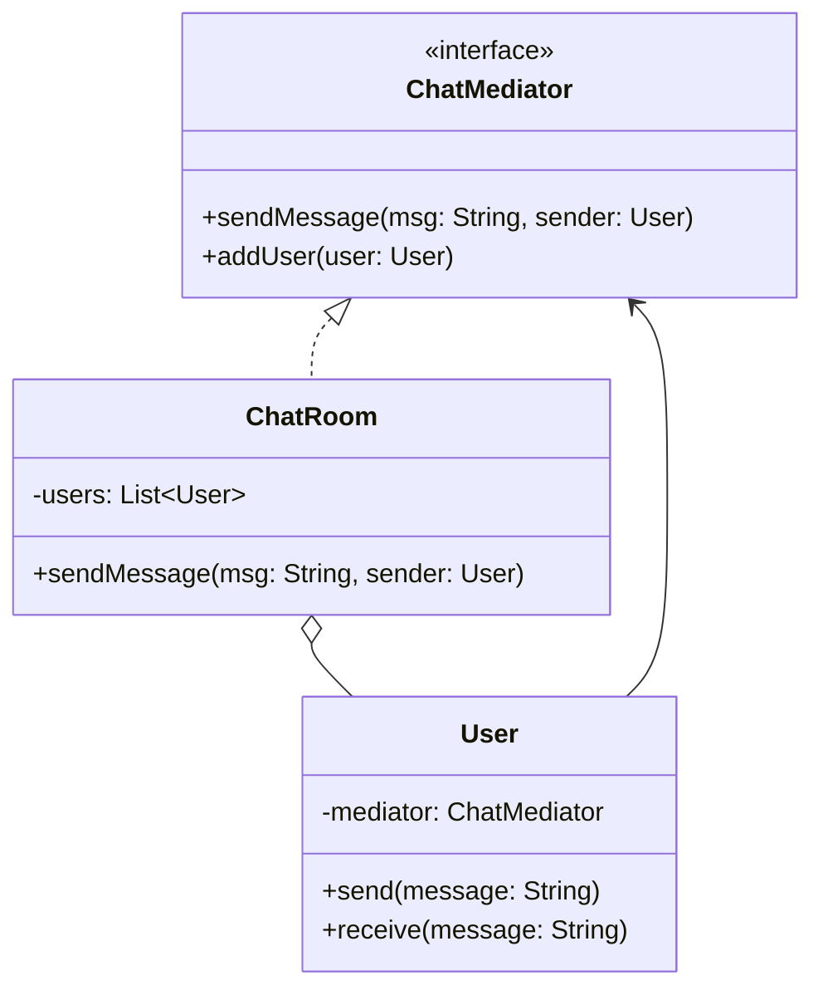

## Intent

> **Define an object that encapsulates how a set of objects interact. Mediator promotes loose
> coupling by keeping objects from referring to each other explicitly, and lets you vary their
> interaction independently.**

Mediator solves the problem introduced conceptually at the end of Chapter 5: **circular or
tangled dependencies between many peer objects**, each needing to know about and coordinate with
several others.

## The Motivating Problem: Every Object Knows About Every Other Object

A chat room where every `User` object needs to send messages to every other `User`:

```java
class User {
    private String name;
    private List<User> otherUsers; // every user references every other user directly

    void sendMessage(String message) {
        for (User user : otherUsers) {
            user.receive(name + ": " + message);
        }
    }

    void receive(String message) {
        System.out.println(message);
    }
}
```

Every `User` object holds references to every other `User` — adding a new user means updating
every existing user's list, and the coupling is **O(n²)**: with 100 users, that's up to 9,900
individual peer-to-peer relationships to maintain. This is the "circular dependency between many
peers" problem previewed in Chapter 5's Law of Demeter discussion, now at scale.

## The Fix: Route All Communication Through a Central Mediator

```java
interface ChatMediator {
    void sendMessage(String message, User sender);
    void addUser(User user);
}

class ChatRoom implements ChatMediator {
    private final List<User> users = new ArrayList<>();

    public void addUser(User user) { users.add(user); }

    public void sendMessage(String message, User sender) {
        for (User user : users) {
            if (user != sender) {
                user.receive(message);
            }
        }
    }
}

class User {
    private final String name;
    private final ChatMediator mediator; // knows ONLY the mediator, not other users

    User(String name, ChatMediator mediator) {
        this.name = name;
        this.mediator = mediator;
        mediator.addUser(this);
    }

    void send(String message) {
        mediator.sendMessage(name + ": " + message, this);
    }

    void receive(String message) {
        System.out.println(name + " received: " + message);
    }
}
```

```java
ChatMediator chatRoom = new ChatRoom();
User alice = new User("Alice", chatRoom);
User bob = new User("Bob", chatRoom);

alice.send("Hello!"); // Alice doesn't know Bob exists — the mediator routes it
```

`User` objects now know about exactly **one** thing: the `ChatMediator` interface. Adding a
hundredth user means constructing one new `User` and registering it with the mediator — no existing
`User` object needs any modification at all. The **O(n²)** peer-to-peer coupling has collapsed into
**O(n)** — each user knows about one mediator, and the mediator knows about each user.



## Mediator vs. Facade: Both Centralize — Direction Is the Difference

Chapter 25 flagged this precisely, and it's worth restating now that Mediator is fully on the
table:

| | Facade (Ch. 25) | Mediator (this chapter) |
|---|---|---|
| **Who initiates communication?** | External callers, into an existing subsystem | The peer components themselves, routed through the mediator |
| **Do the wrapped/coordinated components know the coordinator exists?** | Usually not — they're unaware of the Facade | Yes — components explicitly hold a reference to the Mediator and call it |
| **Direction of dependency** | One-way: Facade → subsystem | Two-way: components ↔ Mediator |

**The fast test:** are the components being coordinated aware of and actively communicating
*through* the central object (Mediator), or is the central object simply providing external callers
a simpler way *into* components that don't know it exists (Facade)?

## Mediator vs. Observer: A Related But Distinct Shape

Both reduce direct coupling between multiple objects — the difference is **symmetry and
direction**. Observer is fundamentally **one-directional and asymmetric**: a Subject broadcasts;
Observers only listen (Chapter 29). Mediator is **symmetric**: every participant (`User`) can both
send and receive through the mediator — there's no fixed "the one that changes" versus "the many
that react" distinction. A chat room is a good test case: every user can *both* send and receive,
which is why it's Mediator rather than Observer, even though both patterns reduce direct
inter-object coupling.

## A Risk to Watch: The Mediator Becoming a God Class

Centralizing all coordination logic into one `ChatRoom`-like class risks recreating the "God
class" anti-pattern from Chapter 2 if that class starts accumulating unrelated responsibilities
beyond pure message routing (user authentication, message persistence, profanity filtering, and
so on all crammed into `ChatRoom` directly). **Keep the Mediator focused on coordination alone**,
delegating any substantial additional logic to its own dedicated collaborator classes (an
`AuthenticationService`, a `MessagePersistenceService`) that the Mediator calls, rather than
implements itself — the same SRP discipline from Chapter 7, applied specifically to prevent
Mediator from becoming the very tangled mess it was introduced to eliminate.

## Summary

- Mediator centralizes communication between a set of peer objects into one coordinating object,
  eliminating the O(n²) tangle of direct peer-to-peer references.
- Components communicate exclusively through the Mediator, never referencing each other directly —
  adding a new component means registering it with the Mediator, with no changes needed to
  existing components.
- Distinguish from Facade by direction: Facade's coordinated components are unaware of the Facade;
  Mediator's components explicitly hold a reference to and actively communicate through the
  Mediator.
- Distinguish from Observer by symmetry: Observer is one-directional (Subject broadcasts, Observers
  only listen); Mediator is symmetric (every participant can both send and receive).
- Keep the Mediator's own responsibility narrowly focused on coordination — delegate substantial
  additional logic to separate collaborator classes to avoid it becoming a God class.

---

## Interview Questions

**1. State the Mediator pattern's intent, and describe the specific coupling problem it
eliminates, referencing its scaling characteristic.**
Mediator encapsulates how a set of objects interact, promoting loose coupling by preventing those
objects from referring to and communicating with each other directly. It eliminates the O(n²)
coupling problem that arises when every peer object in a group needs a direct reference to every
other peer to communicate — with `n` participants each needing references to the other `n-1`,
total peer-to-peer relationships scale quadratically; routing all communication through a single
Mediator instead reduces this to O(n) relationships, since each participant only needs one
reference (to the Mediator), and the Mediator holds references to each of the `n` participants.
*Follow-up: Does using a Mediator reduce the total amount of communication happening in the
system, or just the number of direct references objects need to hold?* It reduces the number of
direct *references* (and thus the coupling/dependency count) objects need to hold, not necessarily
the total volume of messages being communicated — the same messages still ultimately reach the same
recipients; Mediator changes *how* that communication is routed and *what each object needs to know
about* to achieve it, not the fundamental amount of information exchange the system requires.

**2. Walk through the chat room example and explain precisely what would need to change, under
each design, to add a 101st user to an already-running chat with 100 existing users.**
Under the original peer-to-peer design, adding a 101st user would require updating every one of the
100 existing `User` objects' `otherUsers` lists to include the new user (and the new user's own
list would need references to all 100 existing users) — a change touching potentially all 101
objects. Under the Mediator-based design, adding a 101st user means simply constructing one new
`User` object with a reference to the existing `ChatRoom` mediator, which calls
`mediator.addUser(this)` — none of the 100 existing `User` objects need any modification at all,
since they never held direct references to each other in the first place.
*Follow-up: Does the `ChatRoom` mediator itself need any modification to accommodate the growing
number of users, beyond simply adding each new user to its internal list?* Generally no — the
`ChatRoom`'s `sendMessage()` method already iterates over whatever users are currently in its
`users` list, so it naturally and correctly scales to handle any number of registered users without
needing any structural changes to its own code as the user count grows; the list-based
implementation itself is already written generically enough to accommodate this growth.

**3. Explain the precise distinguishing test between Mediator and Facade, given that both
patterns centralize coordination of multiple other objects.**
The distinguishing test is whether the coordinated objects are aware of and actively communicate
*through* the central coordinating object, or whether the central object simply provides external
callers a simplified entry point *into* components that remain unaware of its existence. In
Mediator, each `User` explicitly holds a reference to the `ChatMediator` and calls it directly to
communicate — the participants know the mediator exists and depend on it. In Facade (Chapter 25),
the underlying subsystem classes (`InventoryService`, `PaymentService`) have no knowledge that
`OrderFacade` exists at all; the Facade sits between external callers and the subsystem, but the
subsystem components themselves remain unaware and uninvolved in that relationship.
*Follow-up: Could a single class in a design serve as both a Mediator and a Facade
simultaneously, and if so, would this cause any structural confusion?* This is possible in
principle if a coordinating class both provides a simplified external entry point (Facade-like) and
also serves as the communication hub the coordinated objects actively reference and call through
(Mediator-like) — though as discussed in Chapter 25's similar question, this dual responsibility
can be a signal the class is taking on more than one distinct responsibility, and it's often
clearer, per SRP, to recognize and potentially separate these into two distinct concerns even if
they happen to be implemented within related or adjacent classes in a given design.

**4. How does Mediator differ from Observer, given that both patterns reduce the need for direct
references between multiple objects?**
The key distinguishing factor is symmetry and directionality: Observer is fundamentally
asymmetric and one-directional — a single Subject changes state and broadcasts to multiple
Observers, which only ever react and never broadcast back through the same relationship. Mediator
is fundamentally symmetric — every participant (like each `User` in the chat room) can both send
messages *and* receive them through the same mediator relationship, with no fixed "the one that
changes" versus "the many that only react" distinction; any participant can initiate communication
at any time.
*Follow-up: Could a chat room scenario be redesigned to use Observer instead of Mediator, and
what would be lost or changed in doing so?* You could technically model each `User` as both a
`Subject` (broadcasting their own messages) and an `Observer` (of every other user's `Subject`),
but this would essentially require rebuilding much of Mediator's own centralizing structure on top
of Observer's machinery, and would still face the fundamental challenge that Observer's usual
"one Subject, many Observers" shape doesn't naturally accommodate every participant needing to be
*both* a broadcaster and a listener with respect to every other participant simultaneously — the
symmetric, hub-based structure Mediator provides directly is a more natural, less convoluted fit
for this specific kind of many-to-many, fully-symmetric communication pattern.

**5. What is the "God class" risk specifically associated with the Mediator pattern, and how
would you mitigate it in a real design?**
Because a Mediator becomes the single, central point through which all coordination and
communication flows, there's a natural risk that additional, unrelated responsibilities
(authentication, message persistence and history, content moderation/profanity filtering, rate
limiting) get progressively added directly into the Mediator class over time, since it's already
"the place where everything related to this interaction happens" — this can recreate the exact God
class anti-pattern from Chapter 2 that SRP is meant to prevent. Mitigating this requires keeping
the Mediator's own responsibility narrowly scoped to pure coordination/routing logic, and
delegating any substantial additional logic (persistence, authentication, filtering) to separate,
focused collaborator classes that the Mediator calls out to, rather than implementing that logic
directly inside the Mediator itself.
*Follow-up: If message persistence needs to happen for every message sent through the
`ChatRoom`, how would you add this capability while avoiding the God-class risk just
described?* Inject a separate `MessageRepository` (or similar) dependency into `ChatRoom`'s
constructor, and have `sendMessage()` delegate the actual persistence work to
`messageRepository.save(message)` as one step in its routing logic, rather than implementing
database or file-writing logic directly inside `ChatRoom` itself — this keeps `ChatRoom`'s own
responsibility focused on routing and coordination, while persistence remains its own separate,
independently-testable concern, following the same delegation-based SRP discipline demonstrated
throughout this series (notably in Chapter 25's Facade discussion of similar concerns).

**6. How would you unit test the `ChatRoom` Mediator to verify that a message sent by one user is
correctly delivered to all other registered users, but not back to the sender itself?**
Register two or more fake/mock `User` objects (or simple test doubles tracking whether and with
what content `receive()` was called) with a `ChatRoom` instance, call
`chatRoom.sendMessage("Hello", senderMock)` where `senderMock` is one of the registered mocks, and
assert that every *other* registered mock's `receive()` method was called with the expected message,
while specifically asserting that `senderMock.receive()` was *not* called with this particular
message — directly verifying the "don't echo the message back to its own sender" logic
(`if (user != sender)`) that's a specific, easy-to-get-wrong detail in this kind of broadcast
routing logic.
*Follow-up: Would you also want a test verifying behavior when only one user is registered
(sending a message with no other users to receive it)?* Yes — an edge-case test confirming that
`sendMessage()` with only one registered user (the sender) completes without error and correctly
results in zero `receive()` calls to anyone (since the only registered user is the sender, who
should be excluded) is a reasonable and valuable edge case, verifying the loop and exclusion logic
handle this minimal, single-participant scenario gracefully rather than assuming multiple
participants are always present.

**7. In an LLD interview for a "design an air traffic control system" problem, how might the
Mediator pattern apply to coordinating multiple aircraft avoiding collisions, rather than each
aircraft needing direct knowledge of every other aircraft's position?**
Model an `AirTrafficControlTower` as the Mediator, with each `Aircraft` object holding a reference
only to the tower (not to other aircraft directly) and reporting its position/intentions to the
tower, which coordinates and communicates any necessary routing adjustments back to relevant
aircraft — this mirrors the chat room's structure closely: aircraft (participants) communicate
exclusively through the tower (mediator), never needing direct peer-to-peer awareness of every
other aircraft currently in the airspace, which would be both impractical and dangerously
error-prone to maintain directly at scale.
*Follow-up: Why is this kind of centralized coordination arguably even more important for a
safety-critical system like air traffic control than for a chat application, beyond just the
coupling/scalability argument?* Beyond reducing coupling, centralizing coordination through one
authoritative mediator provides a single, consistent source of truth for making safety-critical
decisions (like resolving conflicting flight paths) — if aircraft instead tried to negotiate
directly and independently with each other peer-to-peer, there would be a much higher risk of
inconsistent, contradictory, or incomplete information being used to make critical real-time safety
decisions, whereas a single control tower maintaining a complete, consistent picture of all aircraft
can make more globally-informed, consistent coordination decisions — an argument for centralization
that goes beyond pure software design convenience into genuine safety and correctness
considerations for this specific real-world domain.

**8. Can the Mediator pattern be combined with the Observer pattern — for example, having the
`ChatMediator` also notify a separate set of "moderator" observers whenever any message is sent,
without those moderators being active chat participants themselves?**
Yes — `ChatRoom` could additionally implement the `Subject` interface from Chapter 29, maintaining
a separate list of `Observer`s (representing moderators, logging systems, or analytics dashboards)
distinct from its list of `User` participants, and call `notifyObservers()` internally whenever
`sendMessage()` is invoked — this combines Mediator's symmetric participant-coordination role with
Observer's asymmetric, one-directional broadcast role for a genuinely different audience (passive
observers who only watch, never participate in sending messages themselves), cleanly using each
pattern for the specific kind of relationship it's actually suited to.
*Follow-up: Why would it be a design mistake to instead make moderators regular `User`
participants in the Mediator's main `users` list, just with some kind of "moderator" flag set?*
This would conflate two genuinely different relationships (symmetric participants who can both
send and receive, versus passive observers who only need to watch) into one undifferentiated list,
likely requiring conditional logic elsewhere to distinguish "real" chat participants from
moderator-observers when deciding who should receive an active reply versus who's just watching —
correctly modeling these as two structurally distinct relationships (Mediator's participant list,
and a separate Observer list) from the start avoids this kind of conditional-logic entanglement and
more accurately reflects the genuinely different roles these two types of "listeners" actually
play.

**9. How would you handle a scenario where certain users in the chat room should only be able to
send private messages to specific other users, rather than always broadcasting to everyone —
does this fit naturally within the Mediator pattern's existing structure?**
Yes, this fits naturally — you'd add a new method to the `ChatMediator` interface, such as
`sendPrivateMessage(String message, User sender, User recipient)`, which the `ChatRoom`
implementation would handle by delivering the message only to the specified `recipient` rather than
iterating over and broadcasting to every registered user — the overall structure (participants
communicate exclusively through the mediator, never holding direct references to each other) remains
completely intact; you're simply adding a new, more targeted *kind* of coordination the Mediator
supports, alongside its existing broadcast capability.
*Follow-up: Does adding this private-messaging capability introduce any new design
considerations the pure-broadcast version didn't need to address, such as how the sender specifies
which recipient to target?* Yes — the sender (a `User` object) now needs some way to specify or
reference the intended recipient when calling `sendPrivateMessage()`, which raises a design
question: should `User` objects be allowed to hold direct references to other specific `User`
objects for this targeting purpose (which would reintroduce some direct peer awareness, at least
for addressing purposes), or should targeting be done indirectly through some kind of identifier
(a username or user ID) that the Mediator resolves internally to the actual recipient object —
the latter approach better preserves the "participants never directly reference each other"
discipline the Mediator pattern is built around, at the cost of requiring the Mediator to maintain
and look up users by identifier internally.

**10. Explain why the Mediator pattern is sometimes considered to trade "many small, distributed
dependencies" for "fewer, but more concentrated, dependencies" — is this trade-off always a clear
net improvement?**
Before Mediator, coupling is distributed across many small, direct peer-to-peer relationships
(each object depending on several specific others); after Mediator, coupling is concentrated into
one place (every participant depends on the Mediator, and the Mediator depends on every
participant) — the *total* number of dependency relationships in the system may not dramatically
shrink in an absolute sense for very small groups, but the *shape* of that coupling changes from a
distributed, hard-to-reason-about tangle into a single, centralized, more comprehensible hub. This
is generally a net improvement for readability, maintainability, and the ability to add new
participants without touching existing ones, but it does concentrate risk and responsibility into
the Mediator itself, which is exactly why the "avoid the God-class risk" discipline discussed
earlier in this chapter matters — if that concentrated responsibility isn't carefully managed, the
trade-off's benefit can be undermined by the Mediator itself becoming an unmanageable, overly
central point of complexity.
*Follow-up: For a genuinely small, fixed, unlikely-to-grow group of just two or three
interacting objects, would introducing a full Mediator pattern be a clear improvement, or could
it be considered unnecessary overhead?* For a genuinely small, fixed group (2-3 objects) with
simple, stable interaction patterns, the O(n²) scaling concern that motivates Mediator barely
applies in practice (a handful of direct references isn't meaningfully burdensome), and introducing
a full Mediator abstraction could reasonably be considered unnecessary overhead per the KISS/YAGNI
discipline established throughout this series — Mediator's benefits become increasingly compelling
as the number of interacting peers grows, or as the interaction rules themselves become
complex enough to benefit from being centralized and reasoned about in one place, rather than being
a universal default for any group of communicating objects regardless of size.

**11. If the `ChatMediator` interface needed to support removing a user from the chat room (say,
when they disconnect), how would you extend the design, and what specific concern would you need
to address regarding the `User` object's own lifecycle?**
Add a `removeUser(User user)` method to the `ChatMediator` interface, implemented by `ChatRoom` to
remove the given user from its internal `users` list — straightforward on the Mediator side. The
specific concern to address is ensuring the disconnected `User` object's own reference to the
`mediator` doesn't cause any lingering issues (for example, if the disconnected user's own object
is still reachable elsewhere in the application and someone mistakenly calls `send()` on it after
removal, the mediator should handle this gracefully, perhaps by validating the sender is still a
currently-registered participant before processing the message, rather than assuming every message
comes from an actively-registered sender).
*Follow-up: Does this removal scenario relate to the memory-leak concern discussed for the
Observer pattern in Chapter 29, and if so, how?* Yes, directly — just as an `Observer` left
registered with a `Subject` after it's no longer needed can't be garbage collected and represents a
memory leak, a `User` left registered in `ChatRoom`'s `users` list after they've actually
disconnected represents the exact same kind of leak; ensuring `removeUser()` is reliably called at
the appropriate point in a user's actual disconnection lifecycle (mirroring the discipline of
pairing every `addObserver()` with a corresponding `removeObserver()`) is equally important here to
avoid `ChatRoom` accumulating references to disconnected, no-longer-needed `User` objects
indefinitely.

**12. How would you decide, given an LLD problem describing several objects that need to
coordinate with each other, whether Mediator is the right pattern versus simply having those
objects communicate directly with a small, fixed number of well-known peers?**
Consider both the number of participants and the complexity/stability of their interaction rules:
if the number of interacting objects is small and fixed, and the rules governing how they interact
are simple and unlikely to change, direct peer-to-peer references may be perfectly reasonable and
simpler (per KISS/YAGNI). Reach for Mediator specifically when the number of participants is
expected to grow (making the O(n²) direct-reference approach genuinely burdensome), when the
interaction rules themselves are complex enough to benefit from being centralized and reasoned
about in one place rather than scattered across every participant's own logic, or when
participants need to be added/removed dynamically at runtime without requiring changes to
already-existing participants.
*Follow-up: Could you imagine a scenario within the same overall problem where some components
should communicate through a Mediator, while a small number of other, fixed components
legitimately communicate directly with each other without a mediator?* Yes — a design isn't
required to apply Mediator uniformly to every single relationship in a system; for example, a
`ChatRoom` mediator might coordinate all `User` participants, while a specific, small, fixed
relationship elsewhere in the same application (say, a `ChatRoom` object directly holding a
reference to its own `RoomSettings` configuration object) might reasonably remain a simple, direct
reference without needing to be routed through any mediator at all — applying Mediator is a
localized design decision made where its specific benefits (reducing many-to-many peer coupling)
genuinely apply, not a system-wide architectural mandate to eliminate every direct object reference
everywhere.

**13. Is it accurate to describe the Mediator pattern as "moving complexity, not eliminating
it" — and if so, is this a fair criticism of the pattern?**
This is a fair, commonly-raised observation rather than a flaw unique to Mediator: the genuine
complexity of coordinating multiple interacting objects doesn't disappear when Mediator is applied
— it's relocated from being distributed across many peer objects' own logic into being
concentrated within the single Mediator class's logic. This is a fair characterization, but it's
not necessarily a valid criticism of the pattern's value, since concentrating complexity into one
well-defined, focused location (as long as the God-class risk discussed earlier is actively
managed) is generally easier to understand, test, and modify than the same complexity scattered
unpredictably across many objects' individual peer-to-peer interaction logic — the pattern's value
lies in *where* the necessary complexity lives and how manageable that concentration is, not in
making the underlying coordination problem itself magically simpler or smaller.
*Follow-up: Does this "relocates rather than eliminates complexity" characterization apply to
other patterns covered in this series as well, or is it particularly and uniquely true of
Mediator?* This characterization applies to a meaningful degree across several patterns in this
series — Facade (Chapter 25) relocates orchestration complexity into one class rather than
eliminating it; Chain of Responsibility (Chapter 33) relocates conditional dispatch logic into a
sequence of handler classes rather than eliminating the underlying decision logic itself — this is
a fairly general property of many structural and behavioral design patterns: they're primarily
tools for *organizing and relocating* complexity into more manageable, well-defined structures
rather than tools for making genuinely complex problems trivially simple, which is a useful,
broadly-applicable perspective to carry forward when evaluating any pattern's actual value in a
given design.

**14. Having now covered Chain of Responsibility, Iterator, and Mediator — three patterns that
each address different kinds of "reducing direct coupling between multiple objects" problems —
provide a concise summary distinguishing when each one applies.**
Chain of Responsibility (Chapter 33) applies when a request needs to pass sequentially through
potential handlers until one (or a subset) handles it, with the sender unaware of which handler
ultimately responds. Iterator (this and the previous chapter) applies when code needs to traverse a
collection's elements sequentially without depending on or exposing that collection's specific
internal structure. Mediator applies when a *set of peer objects* need to communicate with each
other symmetrically (each can both send and receive), and centralizing that communication through
one coordinating object eliminates an otherwise-quadratic tangle of direct peer-to-peer references.
Each solves a structurally distinct coupling-reduction problem: sequential request handling,
collection traversal abstraction, and many-to-many peer communication centralization, respectively.
*Follow-up: Given the eleven behavioral patterns planned for this Part, with five more remaining
(Memento, Visitor, and a brief look at Interpreter, alongside the four already covered plus these
three most recent), what overarching skill has this Part been building toward that will be
directly tested in the upcoming applied case studies (Part 8)?* This Part has been building the
skill of precisely diagnosing *which specific kind of design problem* a given scenario actually
represents — not by superficially matching structural shapes (interface with multiple
implementations; objects holding references to other objects), but by asking the right,
intent-focused distinguishing questions this and preceding chapters have established for each
pattern. The upcoming applied case studies in Part 8 will require combining multiple patterns
correctly within single, larger, more realistic problems — exactly the skill of recognizing "this
specific piece of this larger design calls for Strategy, this other piece calls for Observer, and
this piece calls for a Mediator" that precise, question-driven pattern recognition (rather than rote
memorization) makes possible.
