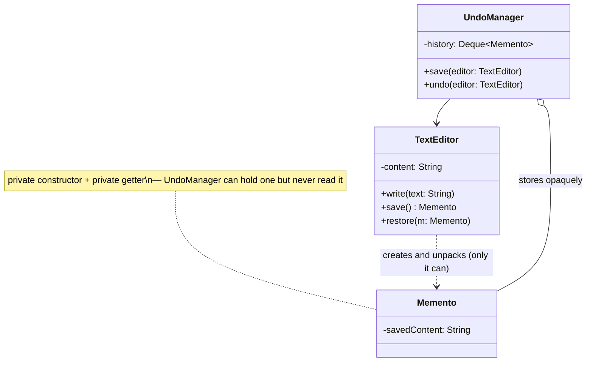

## Intent

> **Without violating encapsulation, capture and externalize an object's internal state so that
> the object can be restored to this state later.**

Memento solves a problem Command's undo mechanism (Chapter 30) glossed over: **`undo()` is easy
when reversing an action means simply doing the opposite operation (turn off instead of turn on).
But what if reversing an action means restoring an object's entire prior internal snapshot — and
that internal state is, correctly, private?**

## The Motivating Problem: Undo Needs the Old State, But Encapsulation Hides It

```java
class TextEditor {
    private String content = "";

    void write(String text) {
        content += text;
    }
    // How does an external UndoManager get access to `content` to save it,
    // without making it public and breaking encapsulation?
}
```

Exposing `getContent()`/`setContent()` publicly so an external `UndoManager` can save and restore
snapshots works, but it means **anyone** can call `setContent()` at any time, for any reason — the
exact invariant-protection problem Chapter 2 warned about. The class has traded away control over
its own state purely to support undo.

## The Fix: A Dedicated, Opaque Snapshot Object

```java
class TextEditor {
    private String content = "";

    void write(String text) {
        content += text;
    }

    Memento save() { // TextEditor creates its OWN memento — full access to its own private state
        return new Memento(content);
    }

    void restore(Memento memento) { // TextEditor is the only class that can unpack a Memento
        this.content = memento.getSavedContent();
    }

    static class Memento { // nested inside TextEditor — its constructor/getter are private to outsiders
        private final String savedContent;

        private Memento(String savedContent) { // private constructor
            this.savedContent = savedContent;
        }

        private String getSavedContent() { // private getter
            return savedContent;
        }
    }
}

class UndoManager { // the Caretaker — stores mementos, but can never look inside them
    private final Deque<TextEditor.Memento> history = new ArrayDeque<>();

    void save(TextEditor editor) {
        history.push(editor.save());
    }

    void undo(TextEditor editor) {
        if (!history.isEmpty()) {
            editor.restore(history.pop());
        }
    }
}
```

```java
TextEditor editor = new TextEditor();
UndoManager undoManager = new UndoManager();

undoManager.save(editor);
editor.write("Hello");
undoManager.save(editor);
editor.write(", World!");

undoManager.undo(editor); // back to "Hello"
undoManager.undo(editor); // back to ""
```

`UndoManager` stores `Memento` objects and knows exactly when to save and restore them — but it
**cannot see inside a `Memento` at all**, since its constructor and getter are `private`. Only
`TextEditor` itself (as `Memento`'s enclosing class, which in Java has access to its nested class's
private members) can create or unpack one. Encapsulation is fully preserved: the only code that
ever reads or writes `content` is `TextEditor` itself.



## The Three Roles

- **Originator** — the object whose state needs saving/restoring (`TextEditor`); the only class
  that can create or interpret a `Memento`.
- **Memento** — the opaque snapshot object itself; exposes nothing to outside callers.
- **Caretaker** — the object that stores mementos and decides when to save/restore
  (`UndoManager`) — it manages the *history*, but never touches the *contents*.

## Memento vs. Command's Undo: Two Different Undo Strategies

Chapter 30's `TurnOnLightCommand`/`TurnOffLightCommand` undo by **performing the inverse
operation** — a lightweight, cheap approach that works when an action's effect can be precisely
reversed by a known, opposite action. Memento undoes by **restoring a complete prior snapshot** —
necessary when there's no clean "opposite operation" (undoing a complex text edit isn't
well-described as "the opposite of typing"), at the cost of storing potentially larger snapshot
data. **They frequently combine**: a `Command` object's `undo()` method can internally use a
`Memento` it captured *before* `execute()` ran, restoring that snapshot rather than computing an
inverse operation.

## The Memory Cost, and Java's `record` for Lightweight Mementos

Storing a full snapshot for every undoable action can be expensive for large objects — the same
memory-cost consideration raised for Flyweight (Chapter 26) and Prototype (Chapter 20) applies
directly here. Two common mitigations: storing only the **incremental diff** from the previous
state rather than a full copy, or limiting history depth (only the last N snapshots). For simple
value-holding mementos, a Java `record` (Chapter 19) is a natural, concise fit — immutable by
default, which is exactly the property a snapshot needs (per Chapter 20's Prototype immutability
discussion: a snapshot that could be mutated after being saved isn't a reliable snapshot at all).

## Summary

- Memento captures an object's internal state as a snapshot that can be restored later, without
  exposing that internal state to any code outside the object itself.
- The three roles — Originator (creates/restores its own state), Memento (the opaque snapshot),
  Caretaker (stores and manages *when* to save/restore, but never *what's inside*) — keep
  encapsulation fully intact.
- Distinguish from Command's undo: Command typically undoes via an inverse operation; Memento
  undoes via restoring a full prior snapshot — the two combine naturally when a Command needs to
  restore a snapshot rather than compute an inverse.
- Mementos should be immutable once created (a `record` is a natural fit for simple cases) — a
  mutable snapshot isn't a trustworthy snapshot.

---

## Interview Questions

**1. State the Memento pattern's intent, and explain precisely how it avoids violating
encapsulation, unlike a naive "add public getters/setters for everything" approach.**
Memento captures and externalizes an object's internal state for later restoration, without
exposing that state to code outside the object itself. It avoids violating encapsulation because
the Originator (like `TextEditor`) is the *only* class that can construct or read the contents of
its own `Memento` — achieved in Java by giving the `Memento` class private constructors and private
getters, accessible only to its enclosing Originator class, which retains full, exclusive control
over reading and writing its own private state exactly as it always did, rather than exposing
public setters that any arbitrary external code could call.
*Follow-up: Would the pattern still preserve encapsulation if `Memento`'s getter were public
instead of private?* No — a public getter on `Memento` would let any code holding a reference to a
`Memento` object (including the `UndoManager`/Caretaker) read the Originator's saved internal
state directly, which, while perhaps less severe than a public *setter* (since it wouldn't allow
external mutation), still leaks internal implementation details outside the Originator, weakening
the encapsulation guarantee the pattern is specifically designed to fully preserve.

**2. Walk through the three roles of the Memento pattern (Originator, Memento, Caretaker), using
the `TextEditor` example, and explain what each role is and is not permitted to do.**
The Originator (`TextEditor`) is the only role permitted to create a `Memento` (via `save()`) or
interpret/restore from one (via `restore()`) — it has full, exclusive access to its own private
state and the `Memento`'s private contents, since it's the enclosing class. The Memento itself
(the nested `Memento` class) is a purely passive data holder, permitted to do nothing except exist
and be passed around — it exposes no public methods that reveal its contents to anyone. The
Caretaker (`UndoManager`) is permitted to store, retrieve, and pass `Memento` objects back to the
Originator at the appropriate time (deciding *when* undo should happen), but is never permitted to
inspect, read, or modify what's actually inside any `Memento` it holds.
*Follow-up: If `UndoManager` needed to display a preview or summary of what each saved
`Memento` in its history represents (e.g., "Undo: typed 'Hello'"), how would you accommodate this
without breaking the Caretaker's "cannot see inside" restriction?* You could have `Memento` expose
a separate, intentionally-limited public method specifically for this display purpose (e.g., a
public `String getDescription()` returning a human-readable summary like "typed 'Hello'", distinct
from and much more limited than exposing the full underlying `content` state) — this is a
legitimate, deliberate carve-out that provides the Caretaker exactly the specific, limited
information it genuinely needs for its own purposes (displaying undo history) without granting it
full access to the Originator's actual internal state.

**3. Why is it significant that `Memento`'s constructor and getter are specifically `private`
(accessible only within `TextEditor`), rather than merely being undocumented or discouraged from
external use?**
Making them `private` provides a compiler-enforced guarantee, not merely a documented convention
that external code is trusted to follow — any attempt by `UndoManager` or any other external class
to directly call `new TextEditor.Memento(...)` or `memento.getSavedContent()` would simply fail to
compile, structurally guaranteeing that encapsulation cannot be accidentally or intentionally
violated by any code outside `TextEditor` itself. This mirrors the same "encapsulation is a
compiler-enforced structural guarantee, not developer discipline" principle established for private
constructors throughout this series (notably for Singleton in Chapter 16 and factory-controlled
construction in Chapter 26).
*Follow-up: Since `Memento` is defined as a nested static class within `TextEditor`, does Java's
nested-class access rules specifically enable this pattern, or could the same encapsulation be
achieved with `Memento` as a completely separate, top-level class?* Java's specific rule that an
enclosing class has access to its nested class's private members (and vice versa) is precisely what
enables this exact implementation approach cleanly — if `Memento` were a fully separate, top-level
class instead, `TextEditor` would need some other mechanism (like a package-private constructor
combined with careful package structuring, ensuring no other class shares that package) to achieve
a similar effect, which is generally less clean and more fragile than Java's built-in nested-class
access privilege, making the nested-class approach the idiomatic, preferred implementation choice
for Memento in Java specifically.

**4. Explain the precise distinction between how Command (Chapter 30) typically implements undo
and how Memento implements it, and describe a scenario where Memento's approach is clearly
necessary rather than Command's simpler inverse-operation approach.**
Command's typical undo approach (as shown in Chapter 30's `TurnOnLightCommand`/
`TurnOffLightCommand`) works by performing a known, precise *inverse operation* — turning off is
the well-defined opposite of turning on. Memento's approach instead captures and restores a
*complete snapshot* of prior state, which is necessary when an action's effect has no clean,
well-defined inverse operation — undoing "the user typed several characters and then applied bold
formatting to part of the text" isn't naturally expressible as a single, simple inverse action;
restoring the entire document's exact prior snapshot is the more reliable, general-purpose approach
for such complex, hard-to-invert state changes.
*Follow-up: Could you imagine implementing undo for a `TrafficLightState`-style state machine
(from Chapter 31) using Memento instead of the State pattern's own built-in transition
structure?* This would be an unusual, likely inappropriate application — the `TrafficLightState`
example's transitions are already simple, well-defined, and easily reversible in principle (though
the State pattern chapter didn't implement undo for it), and its "state" is really just a reference
to one of a small, fixed set of state objects rather than complex, snapshot-worthy internal data;
Memento's snapshot-based approach is best suited to genuinely complex, hard-to-invert internal
state (like a text document's full content), not simple state-machine position tracking, which
would more naturally just store the sequence of previous state *references* directly if undo were
needed there at all.

**5. How would you combine the Command and Memento patterns to implement undo for a complex text
editor operation, like "replace selected text with new text," where a simple inverse operation
isn't straightforward?**
A `ReplaceTextCommand`'s `execute()` method would first call the `TextEditor`'s `save()` method to
capture a `Memento` snapshot of the document's state *before* performing the replacement, store
that captured `Memento` as a field on the `ReplaceTextCommand` object itself, then perform the
actual replacement; its `undo()` method would simply call `textEditor.restore(savedMemento)` using
the snapshot it captured earlier — combining Command's role as a storable, triggerable, undoable
action object with Memento's role as the actual mechanism for capturing and restoring the specific
prior state needed to make that undo operation correct and precise.
*Follow-up: Does this combination mean every `Command` object in an undo history now needs to
hold its own `Memento`, and does this have any implications for memory usage compared to the
simpler inverse-operation approach from Chapter 30?* Yes — each `Command` in the undo history
holding its own captured `Memento` snapshot means the memory cost scales with the number of stored
commands *and* the size of each individual snapshot, which can be considerably more memory-
intensive than the simpler inverse-operation `Command`s from Chapter 30 (which stored only small,
fixed pieces of data like "which device" and "what action," not entire object snapshots) — this is
exactly the same memory-cost trade-off discussed in this chapter's "memory cost" section, now made
concrete in the context of combining these two specific patterns together.

**6. What specific problem would arise if a `Memento` object, once created, could be mutated
after the fact — for example, if `Memento`'s `savedContent` field were not declared `final`, and
some code (even `TextEditor` itself) later modified it?**
If a `Memento`'s captured state could be mutated after creation, any code holding a reference to
that "saved" `Memento` (like the `UndoManager`'s history stack) could no longer trust that it
actually represents the exact state at the moment it was captured — a later mutation would
silently corrupt what was supposed to be a fixed, reliable historical snapshot, undermining the
entire purpose of the undo history; restoring from such a corrupted memento could restore to a
completely wrong, unintended state rather than the genuinely correct prior state the caller expects.
This is precisely the same class of danger discussed for shared mutable state throughout this
series (Chapter 20's Prototype shallow-copy risk, Chapter 26's Flyweight immutability requirement).
*Follow-up: If `TextEditor`'s `content` field were itself a mutable object (like a mutable
`StringBuilder`) rather than an immutable `String`, what additional precaution would `save()` need
to take to correctly capture an independent, safe snapshot?* `save()` would need to create a deep
copy (or at minimum, convert to an immutable representation, like calling `.toString()` on a
`StringBuilder`) of the mutable `content` object when constructing the `Memento`, rather than
simply storing a direct reference to the same mutable object `TextEditor` continues to hold and
modify — otherwise, subsequent calls to `write()` on the *original* mutable `content` object would
also silently mutate the "saved" memento's supposedly-fixed snapshot, since both would actually be
referencing the exact same underlying mutable object; this is directly analogous to the shallow-
versus-deep-copy discipline established for Prototype in Chapter 20.

**7. How would you unit test the `TextEditor`/`Memento`/`UndoManager` design to verify that
`save()` and `restore()` correctly capture and restore state, without needing to access
`Memento`'s private internals directly from the test code?**
Since the test itself can't (and shouldn't) directly inspect a `Memento`'s private contents (per the
pattern's own encapsulation guarantee), the test would instead verify the *observable* round-trip
behavior through `TextEditor`'s own public interface: write some text, call `save()` to capture a
`Memento`, write more text, then call `restore()` with the previously-captured `Memento`, and
assert that `TextEditor`'s publicly-observable state (e.g., via a `getContent()` method, if one
exists for legitimate read purposes, or via some other public behavior reflecting the current
content) matches what it was at the exact point `save()` was originally called — testing the
pattern's correctness entirely through the Originator's own public contract, exactly as any other
code interacting with `TextEditor` would.
*Follow-up: Does this testing approach reveal anything interesting about how Memento's
encapsulation discipline affects testability, compared to patterns with more directly-inspectable
internal state?* Yes — this illustrates that Memento's strict encapsulation, while a genuine design
strength, does mean tests can only verify the pattern's correctness *indirectly*, through the
Originator's observable round-trip behavior, rather than directly asserting on the Memento's
captured internal values — this is an intentional, accepted trade-off consistent with the pattern's
entire purpose (if tests could freely inspect Memento internals, that would mean the encapsulation
guarantee had a "back door" the pattern is specifically designed not to have, even for testing
purposes).

**8. In an LLD interview for a "design a chess game" problem (Chapter 50), how might Memento
apply to implementing a "review previous moves" or "undo last move" feature?**
The `ChessBoard` (or a broader `Game` object representing the full board state) would act as the
Originator, with a `save()` method capturing a `Memento` snapshot of the current board
configuration (piece positions, whose turn it is, any special state like castling eligibility) and
a `restore()` method returning the board to a previously-captured snapshot; a `GameHistory`
(Caretaker) would store a sequence of these mementos, one captured after each move, enabling both
"undo the last move" (restoring the second-to-last saved snapshot) and "review the full move
history" (potentially stepping through each saved snapshot in sequence) without any external code
ever needing direct access to the board's internal representation.
*Follow-up: Given that a full chess board's state is relatively small and cheap to snapshot
compared to, say, a large text document, does the memory-cost concern discussed earlier in this
chapter meaningfully apply to this specific chess example?* Generally not as significantly — a
chess board's state (piece positions, whose turn, a few boolean flags for special rules) is quite
compact compared to a large text document's potentially enormous content, so storing a full
snapshot after every single move throughout an entire game's history is unlikely to represent a
meaningful memory concern in practice; this is a good illustration that the "consider incremental
diffs or limited history depth" mitigation discussed earlier is specifically relevant for large,
memory-intensive Originator state, not a universal requirement for every Memento application
regardless of the actual size of the state being captured.

**9. Can the Memento pattern be applied to capture only *part* of an object's state, rather than
its entire internal representation — and if so, what design consideration does this introduce?**
Yes — a `Memento` doesn't need to capture literally everything about the Originator's state; it
only needs to capture whatever subset of state is actually necessary to correctly restore the
specific aspects that undo/rollback needs to affect. For example, if `TextEditor` also tracked a
non-undoable setting like "current font size preference," the `Memento` might deliberately exclude
that field, capturing only `content` (the genuinely undoable part) — this requires the Originator
to make a deliberate, considered decision about exactly which fields belong in the undo-relevant
snapshot versus which fields represent separate, non-undoable configuration that should persist
across undo operations.
*Follow-up: What risk arises if the Originator incorrectly omits a field from the Memento that
actually *should* have been included as part of the undoable state?* If a field that should be
part of the undo-relevant snapshot is mistakenly left out of the `Memento`, calling `restore()`
would leave that specific field unchanged at its current value even when the user expects a full
"undo" to that field's prior state too — resulting in a subtly incorrect, incomplete restoration
that only partially reverts the object to its true prior state, which could be a confusing, hard-to
-diagnose bug if not carefully verified through thorough testing of exactly which fields the
Memento is responsible for capturing and restoring.

**10. Does the Memento pattern require the Memento object to be serializable (in the Java
`Serializable` sense), and would this matter for any specific real-world application?**
The Memento pattern itself doesn't inherently require Java serialization — the in-memory
`TextEditor`/`UndoManager` example works entirely within a single running application's memory with
no need to serialize anything. However, if an application needed undo history to *persist* across
application restarts (saving undo history to disk, or transmitting it over a network for a
collaborative editing feature), making the `Memento` class implement `Serializable` (or otherwise
support some serialization mechanism) would become a genuinely relevant, additional design
consideration layered on top of the core pattern.
*Follow-up: Would adding `Serializable` support to `Memento` conflict with or weaken its
encapsulation guarantees in any way?* Not necessarily in principle — a class can be `Serializable`
while still keeping its constructor and getters `private`, since Java's serialization mechanism
uses reflection internally to read and write fields directly, bypassing the need for public
accessors; however, this does introduce a somewhat different attack surface (reflection-based or
serialization-based access could technically still read or reconstruct the object's private state
through mechanisms outside normal method calls), similar in spirit to the reflection-based
Singleton-bypass concern discussed in Chapter 16 — a genuinely security-critical application might
need additional safeguards (like implementing `readObject()`/`writeObject()` carefully) if
serialization-based access to sensitive snapshot data is a real concern.

**11. How would you handle memory growth in a long-running application where an `UndoManager`'s
history stack grows unboundedly as the user performs thousands of undoable actions over a long
editing session?**
You'd impose a maximum history depth (say, the last 100 actions), evicting the oldest `Memento`
from the history (e.g., removing from the bottom of the stack, or using a fixed-size circular
buffer/deque) whenever a new one is added beyond that limit — trading unlimited undo depth for
bounded, predictable memory usage, which is a reasonable and extremely common practical
accommodation in real-world undo implementations (most real text editors and applications impose
some finite undo history limit for exactly this reason).
*Follow-up: Would you implement this history-size-limiting logic inside the `UndoManager`
(Caretaker) itself, or somewhere else, and why does this placement decision make sense given each
role's responsibilities?* This logic belongs inside the `UndoManager` (Caretaker), since managing
*when* to save, retrieve, and now also *evict* mementos is exactly the Caretaker's own defined
responsibility — the Originator (`TextEditor`) and the `Memento` class itself have no involvement in
or knowledge of how many historical snapshots are being retained or for how long; this placement
is consistent with the clean separation of responsibilities the three-role structure establishes,
where history-management policy decisions belong entirely to the Caretaker.

**12. Is it accurate to say that Memento and the Prototype pattern (Chapter 20) both involve
"copying an object's state," and if so, how do their purposes differ?**
Both patterns do involve capturing a copy of an object's state at some point, and both share the
same underlying shallow-versus-deep-copy discipline discussed in Chapter 20 — but their purposes
differ meaningfully: Prototype creates a copy specifically to produce a *new, independent, usable
object* (cloning an expensive-to-construct `Enemy` to get a second, fully independent enemy
instance to use going forward). Memento creates a copy specifically to *preserve a snapshot for
later restoration of the same original object* — the snapshot itself (the `Memento`) isn't meant
to be used as an independent, functioning object in its own right; it exists purely to be handed
back to the Originator later so the Originator can restore itself to that earlier state.
*Follow-up: Could a `Memento` object ever double as a `Prototype`-style clone that could also be
used independently, rather than solely as an opaque snapshot?* This would be an unusual and
generally discouraged conflation of the two patterns' distinct purposes — a `Memento`'s
deliberately opaque, encapsulation-preserving design (private constructor, private getters) is
specifically at odds with Prototype's goal of producing a freely-usable, independent clone object;
if a genuine need existed for both "an opaque restoration snapshot" and "an independently-usable
cloned copy" of the same object, these would more appropriately be modeled as two separate,
distinctly-purposed mechanisms rather than forcing one object to awkwardly serve both roles
simultaneously.

**13. How would you explain to an interviewer why the Memento pattern is considered a
*behavioral* pattern rather than a *creational* pattern, given that it clearly involves creating
snapshot objects?**
Although creating a `Memento` object is technically part of its mechanism, the pattern's primary,
defining concern isn't *how the snapshot object comes into existence* (which would make it
creational, per Chapter 15's category definitions) — it's about *how the Originator and Caretaker
interact and collaborate* to achieve state preservation and restoration while respecting
encapsulation boundaries, which is fundamentally a concern about object communication and
responsibility distribution (the defining characteristic of behavioral patterns), not object
construction mechanics. The "creation" of the Memento object itself is a comparatively minor,
simple implementation detail; the pattern's actual, interview-relevant value lies in the specific
three-role collaboration structure (Originator/Memento/Caretaker) and the encapsulation-preserving
discipline it enforces.
*Follow-up: Does this reasoning generalize to help classify other patterns whose category
assignment might not be immediately obvious from a surface-level reading of what they do?* Yes —
this same reasoning approach (asking "what is this pattern's *primary, defining* concern: object
creation, object composition/structure, or object communication/responsibility distribution?"
rather than looking only at surface mechanics like "does it involve creating an object at some
point") is a generally useful way to correctly classify or understand the placement of any pattern
whose category might not be immediately obvious — most patterns involve some object creation
somewhere in their implementation, but that alone doesn't make every pattern creational, just as
most patterns involve objects calling methods on each other, which alone doesn't make every pattern
behavioral.

**14. Having now covered Memento alongside Command (Chapter 30), summarize the complete picture
of "how undo can be implemented" this series has now built, and identify which approach you'd
recommend defaulting to in a fresh LLD interview problem requiring undo support, absent other
specific signals.**
This series has now covered two complementary undo mechanisms: Command's inverse-operation
approach (simple, lightweight, ideal when an action has a clean, well-defined opposite operation)
and Memento's snapshot-based approach (more memory-intensive, but necessary and more reliable when
an action's effect has no clean inverse, or when full-state restoration is simply more
straightforward to reason about correctly than computing precise inverse operations for
complex changes). Absent other specific signals, a reasonable default starting point is Command's
simpler inverse-operation approach for straightforward, easily-reversible actions, escalating to
combining it with Memento specifically for actions whose effects are genuinely complex or
difficult to invert precisely and reliably — matching the specific undo mechanism's complexity to
the actual complexity of the action being undone, rather than defaulting reflexively to the more
elaborate Memento-based approach for every kind of action regardless of how simple or easily-
reversible it actually is.
*Follow-up: Given that this Part has now covered seven of the eleven planned behavioral patterns
(Strategy, Observer, Command, State, Template Method, Chain of Responsibility, Iterator, Mediator,
and now Memento), with Visitor and a brief Interpreter overview still remaining, what's the most
important cumulative lesson to carry forward given how many of these patterns share structurally
similar shapes?* The most important cumulative lesson remains the discipline established since
Chapter 28's introduction of Strategy: precisely articulating a design's actual *intent* and
*behavioral guarantees* — who initiates communication, whether implementations are aware of each
other, whether state is broadcast versus requested, whether an action is reversible via inverse
operation versus full-snapshot restoration — is what reliably distinguishes between patterns that
often look nearly identical at the raw code-structure level; this discipline, consistently applied
question by question across each of these nine patterns, is the actual transferable skill this
entire Part has been building, far more valuable than memorizing each pattern's name and canonical
diagram in isolation.
