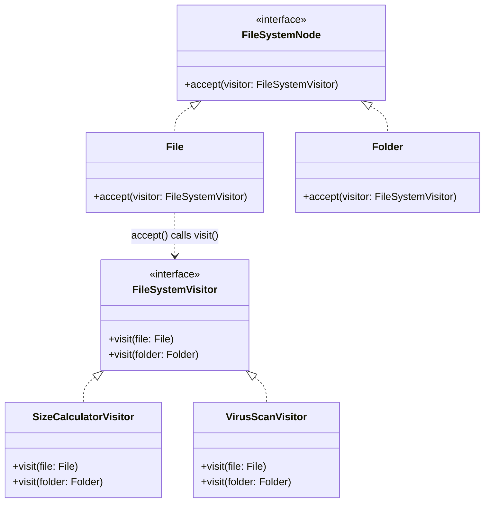

## Intent

> **Represent an operation to be performed on the elements of an object structure. Visitor lets
> you define a new operation without changing the classes of the elements on which it operates.**

Visitor directly answers a question raised — and deliberately left open — in Chapter 23's
Composite discussion: **what if you need to keep adding new operations to a fixed set of element
types, without touching those element classes every time?**

## The Motivating Problem: Every New Operation Means Editing Every Element Class

Recall Chapter 23's `FileSystemNode` hierarchy (`File`, `Folder`). Adding a new operation the
ordinary way means adding a new method to the shared interface and implementing it in every
existing class:

```java
interface FileSystemNode {
    long getSize();
    void printStructure();
    void search(String name); // adding this required editing File AND Folder
    void export(); // adding THIS also requires editing File AND Folder
}
```

Every new capability touches every existing element class — for a hierarchy with many element
types and a fast-growing set of operations (compression, virus-scanning, indexing, exporting),
this becomes a maintenance burden precisely opposite to what Chapter 18's Abstract Factory
discussion flagged: **easy to add new element types, costly to add new operations.**

## The Fix: Move Each Operation Into Its Own Visitor Class

```java
interface FileSystemVisitor {
    void visit(File file);
    void visit(Folder folder);
}

interface FileSystemNode {
    void accept(FileSystemVisitor visitor); // the ONE method every element needs, forever
}

class File implements FileSystemNode {
    private final String name;
    private final long size;

    public void accept(FileSystemVisitor visitor) {
        visitor.visit(this); // "double dispatch" — explained below
    }
}

class Folder implements FileSystemNode {
    private final List<FileSystemNode> children = new ArrayList<>();

    public void accept(FileSystemVisitor visitor) {
        visitor.visit(this);
        for (FileSystemNode child : children) {
            child.accept(visitor); // recursively visit every child too
        }
    }
}

class SizeCalculatorVisitor implements FileSystemVisitor {
    private long totalSize = 0;
    public void visit(File file) { totalSize += file.getSize(); }
    public void visit(Folder folder) { /* nothing extra — children visited separately */ }
    long getTotalSize() { return totalSize; }
}

class VirusScanVisitor implements FileSystemVisitor {
    public void visit(File file) { /* scan file contents */ }
    public void visit(Folder folder) { /* maybe log folder entry */ }
}
```

```java
SizeCalculatorVisitor sizeVisitor = new SizeCalculatorVisitor();
root.accept(sizeVisitor);
System.out.println(sizeVisitor.getTotalSize());

root.accept(new VirusScanVisitor()); // a brand new operation — ZERO changes to File or Folder
```

Adding `VirusScanVisitor` required writing exactly one new class — `File` and `Folder` were never
touched. The trade-off is now inverted from ordinary Composite usage: **adding a new element type
(say, `SymbolicLink`) requires editing the `FileSystemVisitor` interface and every existing
visitor** — the exact opposite extensibility profile from before.



## Double Dispatch: Why `accept()` Exists at All

This is the single most commonly misunderstood mechanic in Visitor, and worth explaining precisely.
Java's method overloading resolves **at compile time**, based on the *declared* type of the
argument — but which concrete `visit()` overload should run depends on the **runtime** type of the
element. A naive attempt fails:

```java
FileSystemNode node = new File(...); // declared type: FileSystemNode
visitor.visit(node); // COMPILE ERROR or wrong overload — the compiler only sees "FileSystemNode"
```

The `accept()` method is the fix: **it's called polymorphically** (resolved at runtime, based on
the actual object's type — `File.accept()` vs. `Folder.accept()`), and *inside* that already-
resolved method, `this` has the compile-time type `File` (or `Folder`) exactly — so calling
`visitor.visit(this)` correctly resolves to the matching overload. **Two polymorphic dispatches**
happen in sequence (first on the element's type via `accept()`, then on the visitor's overload via
`visit()`) — hence "double dispatch."

## Visitor vs. Just Adding a Method: The Explicit Trade-off

| | Adding methods directly to the hierarchy | Visitor |
|---|---|---|
| **Adding a new operation** | Touches every existing element class | One new Visitor class — zero changes to elements |
| **Adding a new element type** | One new class implementing the interface | Touches the Visitor interface and every existing visitor |
| **Best when...** | Element types are stable; operations grow | Element types are stable; operations grow **and** need external, unrelated logic (compression, scanning) that doesn't belong inside the element classes themselves |

This mirrors Chapter 18's Abstract Factory trade-off precisely, just inverted: **know which axis
of your specific problem is expected to grow, and pick the structure that keeps that axis cheap.**

## Why Visitor Is Used Sparingly

Visitor is one of the more complex, less frequently-needed patterns in the GoF catalog — the
double-dispatch mechanism itself has real cognitive overhead, and it's only worth that cost when
element types are **genuinely stable** and **many independent, unrelated operations** genuinely
need to be added over time. If both element types and operations change frequently, no static
structure (visitor or otherwise) fully solves the problem — that's the sign of a design needing a
different overall shape (perhaps something closer to Chain of Responsibility or a data-driven rule
engine) rather than forcing Visitor.

## Summary

- Visitor moves operations out of the element classes entirely, into separate Visitor classes,
  inverting Composite's usual extensibility trade-off: new operations become cheap, new element
  types become costly.
- Double dispatch — `accept()` resolving the element's runtime type, then calling the matching
  `visit()` overload — is the mechanism that makes this work in a statically-typed language like
  Java.
- Reach for Visitor specifically when element types are stable but the set of operations keeps
  growing, and those operations involve logic that doesn't belong inside the element classes
  themselves.
- If both element types and operations are expected to keep changing, Visitor's rigid structure is
  the wrong tool — that signals a need for a different design entirely.

---

## Interview Questions

**1. State the Visitor pattern's intent, and explain precisely what extensibility trade-off it
makes compared to adding new methods directly to an element hierarchy.**
Visitor lets you define new operations on a class hierarchy's elements without modifying the
element classes themselves — instead, each new operation is implemented as a separate Visitor class.
The trade-off is that adding a new *operation* becomes cheap (one new Visitor class, zero changes
to existing elements), while adding a new *element type* becomes expensive (requiring changes to
the shared Visitor interface and every existing Visitor implementation) — precisely the inverse of
the trade-off you get by simply adding new methods directly to the element hierarchy, where new
operations are expensive but new element types are cheap.
*Follow-up: Is this trade-off unique to Visitor among the patterns covered in this series, or has
this exact tension appeared elsewhere?* This exact trade-off pattern (cheap-to-add-elements
vs. cheap-to-add-members-of-a-family) appeared explicitly in Chapter 18's Abstract Factory
discussion (cheap to add new families/vehicle types, costly to add new family members/products) —
Visitor represents the same fundamental tension, just applied to operations on a class hierarchy
rather than to families of related creational products.

**2. Explain "double dispatch" precisely, and why a single, ordinary polymorphic method call
isn't sufficient to correctly resolve `visitor.visit(node)` when `node`'s declared type is the
generic `FileSystemNode` interface.**
Java resolves overloaded method calls (which specific `visit()` overload to invoke) at *compile
time*, based on the argument's *declared* (static) type — if `node` is declared as
`FileSystemNode` (the interface), the compiler can only see that generic type, not the more
specific runtime type (`File` or `Folder`) the object actually is, so it cannot select the correct,
more specific overload. Double dispatch solves this with two sequential polymorphic calls: first,
`node.accept(visitor)` is dispatched polymorphically based on `node`'s actual runtime type
(resolving correctly to either `File.accept()` or `Folder.accept()`); then, *inside* that
already-correctly-resolved method, `this` has the compiler-known, specific type (`File` or
`Folder`), so the subsequent call `visitor.visit(this)` correctly resolves to the matching,
type-specific overload.
*Follow-up: Would double dispatch be necessary at all in a language with different method
resolution rules, such as one that resolves overloads based on runtime type rather than
compile-time declared type?* No — in a language using genuinely dynamic, runtime-type-based method
overload resolution (sometimes called "multiple dispatch"), a single call like
`visitor.visit(node)` could correctly resolve to the appropriate overload directly, based on
`node`'s actual runtime type, without needing the `accept()` indirection at all; double dispatch is
specifically a workaround needed in languages like Java and C++ that use compile-time, single-
dispatch overload resolution, which is exactly why this pattern's specific mechanism is somewhat
Java/C++-idiomatic rather than a universal necessity across all object-oriented languages.

**3. Walk through the `FileSystemVisitor` example and explain exactly what happens, step by
step, when `root.accept(sizeVisitor)` is called on a `Folder` containing both `File` and nested
`Folder` children.**
`root.accept(sizeVisitor)` resolves polymorphically to `Folder.accept()`, since `root` is a
`Folder` — this calls `visitor.visit(this)` (correctly resolving to
`SizeCalculatorVisitor.visit(Folder folder)`, which in this example does nothing extra), and then
iterates over `root`'s children, calling `child.accept(visitor)` on each one — for each `File`
child, this resolves to `File.accept()`, which calls `visitor.visit(this)` (correctly resolving to
`visit(File file)`, adding that file's size to the running total); for each `Folder` child, this
recursively repeats the same process, visiting that subfolder's own children in turn, continuing
until every file anywhere in the entire nested structure has been visited and its size accumulated.
*Follow-up: Where does the recursive traversal logic (visiting a folder's children) actually
live — inside the `Visitor` classes, or inside the element classes themselves?* The recursive
traversal logic lives inside `Folder.accept()` itself (iterating over and calling `accept()` on each
child), not inside any `Visitor` implementation — this means every Visitor implementation
automatically benefits from correct recursive traversal without needing to reimplement it, since
that traversal responsibility is centralized once, in the element hierarchy's own `accept()`
methods, rather than being duplicated across every individual Visitor class.

**4. Why does adding a new element type (like a hypothetical `SymbolicLink`) to this Visitor-based
design require modifying every existing Visitor implementation, and is this considered an
acceptable trade-off?**
Adding `SymbolicLink implements FileSystemNode` requires adding a corresponding
`visit(SymbolicLink link)` method to the `FileSystemVisitor` interface (to support this new type),
which in turn requires every existing Visitor implementation
(`SizeCalculatorVisitor`, `VirusScanVisitor`, and any others) to be updated to provide an
implementation for this new method — a real, acknowledged cost mirroring the "add a new family
member" cost discussed for Abstract Factory in Chapter 18. This is considered an acceptable
trade-off specifically in scenarios where element types are expected to be stable and rarely
added, while the set of operations is expected to keep growing — the pattern deliberately optimizes
for the axis of change that's actually expected to occur frequently in its intended use case.
*Follow-up: If a design used Visitor but then discovered element types were actually being added
far more frequently than new operations, what would this suggest about the original pattern
choice?* This would suggest Visitor was likely the wrong pattern choice for this particular
problem's actual (as opposed to initially assumed) axis of change — the design should probably be
reconsidered in favor of adding operations directly to the element hierarchy instead (accepting the
reverse trade-off), since that approach would make the actually-frequent "add new element type"
change cheap, at the cost of the actually-infrequent "add new operation" change being more
expensive — a good illustration of why correctly identifying the genuinely expected axis of change,
before committing to either structure, matters more than either structure being universally
"better."

**5. How would you unit test the `SizeCalculatorVisitor` to verify it correctly sums sizes across
a multi-level nested folder structure, and does this test look meaningfully different from testing
`Folder.getSize()` directly, as was done in Chapter 23?**
You'd construct a nested `Folder`/`File` structure with known sizes (similar to Chapter 23's test),
create a `SizeCalculatorVisitor`, call `root.accept(sizeVisitor)`, and assert that
`sizeVisitor.getTotalSize()` returns the expected sum. This test looks structurally quite similar
to testing `Folder.getSize()` directly (same test data setup, same expected outcome), but the
mechanism under test is meaningfully different: this test is verifying the correct collaboration
between `accept()`'s traversal logic and the Visitor's own accumulation logic across two separate
classes, rather than verifying a single, self-contained recursive method (`getSize()`) on one class
— a bug could now potentially exist in either the traversal logic (`accept()`) or the visitor's own
accumulation logic (`visit()`), requiring the test to give confidence across this now-two-class
collaboration rather than one self-contained method.
*Follow-up: Would you also want a separate, more narrowly-scoped test verifying
`SizeCalculatorVisitor.visit(File file)` in isolation, without going through the full `accept()`-
based traversal?* Yes — directly calling `sizeVisitor.visit(someFile)` and asserting the total
size updates correctly for that single call, independent of any traversal or `Folder` structure at
all, would isolate and verify the Visitor's own core accumulation logic specifically, complementing
the broader end-to-end traversal test and following the same "test the isolated unit, then test the
integrated whole" principle applied consistently to other patterns throughout this series.

**6. Can the Visitor pattern be combined with the Composite pattern from Chapter 23 in a way that
goes beyond simply "Visitor happens to work on a Composite-structured hierarchy" — is there a
deeper, intentional connection between the two patterns?**
Yes — Visitor is frequently described as specifically complementary to Composite, precisely because
Composite's core value (treating individual elements and composite groups uniformly through a
shared interface) creates exactly the kind of stable, well-defined element hierarchy that Visitor's
"add new operations without touching the hierarchy" benefit is most valuable for; Composite
structures are often deliberately designed with the expectation that many different operations
(rendering, calculating totals, searching, exporting) will eventually need to be performed across
the entire tree, making Visitor a natural, frequently-paired complement rather than a coincidental
fit.
*Follow-up: Given this natural pairing, why wasn't Visitor introduced back in Chapter 23
alongside Composite, rather than as its own separate chapter much later?* Visitor requires its own
substantial conceptual foundation (particularly double dispatch) that's genuinely independent of
and more complex than Composite's own core concept, and introducing it prematurely alongside
Composite would have risked conflating two genuinely distinct ideas before either was fully
understood on its own terms — this mirrors the same deliberate, incremental teaching approach used
throughout this series (as with Strategy being used repeatedly before being formally named in
Chapter 28), ensuring each individual pattern's core mechanism is fully absorbed before being
combined with others.

**7. Is it possible to implement something resembling the Visitor pattern's goal ("add new
operations without modifying existing element classes") using a completely different mechanism in
modern Java, such as pattern matching on sealed interfaces (introduced in Chapter 3)?**
Yes — Java's sealed interfaces combined with pattern matching for `switch` (a more recent Java
language feature) can achieve a similar practical outcome for certain scenarios: a
`sealed interface FileSystemNode permits File, Folder {}` combined with a `switch` expression using
pattern matching (`switch (node) { case File f -> ...; case Folder f -> ...; }`) lets you write new
operations as ordinary methods or functions operating on the sealed hierarchy, with the compiler
guaranteeing exhaustive handling of every possible subtype — achieving a comparable "add a new
operation without modifying element classes" benefit, though using compiler-enforced exhaustiveness
checking rather than the Visitor pattern's explicit interface-and-double-dispatch mechanism.
*Follow-up: Does this sealed-interface-and-pattern-matching approach have the same "adding a new
element type is expensive" trade-off that traditional Visitor has?* Yes, in an analogous way — a
sealed interface's `permits` clause explicitly enumerates every allowed subtype, so adding a new
subtype requires modifying that `permits` clause, and the compiler will then flag every existing
`switch` statement across the codebase that isn't updated to handle the new case (if using
exhaustive pattern matching), requiring those switch statements to be updated — this produces a very
similar cost profile to updating every Visitor implementation, just enforced through the compiler's
exhaustiveness checking rather than through an explicit `visit()` method needing implementation on
every Visitor class.

**8. Explain why the classic Visitor pattern, as shown in this chapter using an interface with
overloaded `visit()` methods, might be considered somewhat dated or less commonly reached for in
very modern Java codebases, given the sealed-interface alternative discussed in the previous
question.**
The classic Visitor pattern's double-dispatch mechanism was specifically designed as a workaround
for the *absence* of built-in, compiler-enforced exhaustive type-checking in earlier versions of
Java — modern Java's sealed interfaces and pattern-matching `switch` expressions (Java 17+) provide
a more direct, often more readable way to achieve a very similar practical outcome (safely adding
new operations over a fixed, closed set of types with compiler-verified completeness) without
needing the somewhat indirect and conceptually heavier `accept()`/double-dispatch machinery,
making classic Visitor comparatively less necessary in newer Java codebases that can freely target
these more recent language versions.
*Follow-up: Given this, would you still recommend a Java LLD interview candidate learn and be
prepared to discuss the classic Visitor pattern, or has it become obsolete knowledge?* It remains
valuable, non-obsolete knowledge for several reasons: many real-world Java codebases still target
older Java versions without access to sealed interfaces/pattern matching; the classic Visitor
pattern's underlying double-dispatch concept is foundational, language-agnostic knowledge that
transfers to other languages and contexts beyond just modern Java; and interviewers may specifically
want to test understanding of this particular, somewhat more intricate mechanism precisely because
it requires deeper comprehension than simply knowing a newer language feature exists — being able
to discuss both the classic pattern and its modern Java alternative (and articulate the trade-offs
between them) is itself a strong, well-rounded interview signal.

**9. If a `Folder`'s `accept()` method forgot to recursively call `accept()` on its own children
(only calling `visitor.visit(this)` for itself), what specific, concrete bug would result when
using `SizeCalculatorVisitor`?**
`SizeCalculatorVisitor` would only ever accumulate sizes from `File` objects that are *direct*
children of whichever specific `Folder` object `accept()` was originally called on — any files
nested inside subfolders would never be visited at all (since the traversal wouldn't recurse into
them), causing `getTotalSize()` to silently and incorrectly under-report the total size, missing
every file that isn't a direct, top-level child of the folder the traversal started from; this
would be a subtle, easy-to-miss bug that might not be caught without a specific test case using a
genuinely multi-level nested folder structure, rather than a flat, single-level test case.
*Follow-up: Would this same bug manifest identically for `VirusScanVisitor`, or would its
consequences differ in any meaningful way?* The same underlying bug (missing nested files during
traversal) would apply identically to any Visitor implementation, including `VirusScanVisitor` —
but the *consequence* differs meaningfully in severity and character: silently under-counting a
size calculation is a data-correctness bug, while silently failing to virus-scan files nested in
subfolders is a genuine security vulnerability, allowing malware in nested folders to go completely
undetected — illustrating that the same underlying implementation bug in shared traversal logic
(`accept()`) can have dramatically different real-world severity depending on which specific
Visitor operation happens to be affected by it.

**10. How would you handle a scenario where different Visitor implementations need to traverse
the same element hierarchy in fundamentally different orders — for example, one operation needing
depth-first traversal and another needing breadth-first traversal?**
Since the traversal logic in the basic example lives inside `Folder.accept()` itself (fixed as
depth-first in the shown implementation), supporting genuinely different traversal *orders* per
operation would require either parameterizing `accept()` with a traversal strategy (potentially
combining this with the Strategy pattern from Chapter 28 — injecting a `TraversalStrategy` that
`accept()` delegates the actual ordering decision to), or moving the traversal logic itself out of
the element classes and into a separate traversal-coordinating class that drives the
`accept()`/`visit()` calls in whichever order a specific use case requires, rather than baking one
fixed traversal order permanently into the element hierarchy's own `accept()` implementation.
*Follow-up: Does this suggest a design limitation in the classic Visitor pattern as typically
presented, where traversal order and the visiting operation itself are somewhat tightly coupled
by having `accept()` both trigger the visit AND drive the traversal?* Yes — this is a genuine,
often-noted limitation of the textbook Visitor pattern's typical presentation: by having
`accept()` handle both "call the appropriate `visit()` method" and "recursively drive traversal
into children," the pattern implicitly assumes one fixed traversal order works for every possible
Visitor, which isn't always true in practice; more sophisticated implementations often do separate
these two concerns explicitly (a distinct traversal/iterator component driving the process,
separate from the visiting logic itself), which is a reasonable, valuable elaboration on the basic
pattern worth mentioning if an interviewer specifically probes this particular limitation.

**11. Why might a Visitor's `visit()` methods sometimes need to return a value (making Visitor
generic, like `Visitor<R>` with `R visit(File file)`), rather than always being `void` as shown in
this chapter's examples?**
A `void`-returning Visitor (as shown) works well for operations that accumulate results as
internal, mutable state on the Visitor object itself (like `SizeCalculatorVisitor`'s
`totalSize` field, read afterward via a separate getter). A generic, value-returning Visitor
(`R visit(File file)`) is useful when an operation's result should be immediately, functionally
composed from the traversal itself — for example, a `ToStringVisitor<String>` where each
`visit()` call returns a formatted string representation, and `Folder`'s own `accept()`
implementation would need to collect and concatenate the return values from visiting each of its
children, rather than relying on mutable internal state accumulated as a side effect.
*Follow-up: Which approach (void with internal mutable state, versus generic with return values)
would you generally consider more aligned with the immutability and side-effect-minimization
principles emphasized elsewhere in this series?* The generic, return-value-based approach is
generally more aligned with those principles — it avoids the Visitor object needing internal
mutable state that accumulates across multiple calls (a pattern that can make a Visitor harder to
reason about or reuse safely, especially if the same Visitor instance were accidentally reused
across multiple, unrelated traversals without being reset) — though the mutable-accumulator
approach shown in this chapter's main example remains simpler to implement and explain for a first
introduction to the pattern, which is why it was chosen for the primary walkthrough.

**12. In an LLD interview, if you're designing a system with a class hierarchy that you
anticipate will need several different reporting/export operations added incrementally over
time (JSON export, XML export, PDF export, CSV export), but you're uncertain whether new element
types will also be added, how would you approach this uncertainty?**
Given genuine uncertainty about which axis (element types or operations) will actually grow more,
and given Visitor's real complexity cost (the double-dispatch mechanism, and the up-front
`accept()` method every element needs), a reasonable default is to start with the simpler approach
(adding export-related methods directly to each element class, or better, using Strategy/Template
Method for the export logic itself) and only introduce full Visitor if and when it becomes clear
that new operations are indeed the dominant, frequent axis of change while element types remain
genuinely stable — this reflects the same YAGNI-driven, evidence-based approach to pattern
selection emphasized throughout this series (Chapter 12), rather than preemptively committing to
Visitor's added structural complexity based on an uncertain prediction about future requirements.
*Follow-up: If, partway through implementation, it became clear that operations genuinely were
growing much faster than element types, how would you migrate an existing "methods added directly
to elements" design toward Visitor without a complete rewrite?* You could introduce the
`accept(Visitor visitor)` method onto the existing element classes as an additive change (without
removing any existing methods those classes already have), and begin implementing new operations
as Visitor classes going forward, while existing operations remain as directly-added methods on the
elements — this hybrid, incremental approach avoids a disruptive full rewrite, letting the codebase
gradually shift its dominant extension mechanism toward Visitor for new capabilities specifically,
without requiring every already-existing, working piece of functionality to be immediately migrated
as well.

**13. How would you explain the relationship between Visitor and the Single Responsibility
Principle — does moving operations out of element classes and into separate Visitor classes
represent a form of SRP applied at the class-hierarchy level?**
Yes, this is a reasonable and accurate characterization — before applying Visitor, an element class
like `File` risks accumulating many unrelated responsibilities directly (size calculation logic,
virus-scanning logic, export logic, search logic, all implemented as separate methods on the same
class), each representing an independent reason to change; Visitor extracts each of these distinct
responsibilities into its own separate, focused class (`SizeCalculatorVisitor`,
`VirusScanVisitor`), leaving `File` and `Folder` themselves with a much narrower, more stable
responsibility (representing the file-system structure itself, plus the single, stable
`accept()` method needed to support visiting) — a direct, large-scale application of SRP's
underlying reasoning to an entire class hierarchy's design, not just to individual classes in
isolation.
*Follow-up: Does this mean every instance of "many operations added directly to a class
hierarchy" is automatically an SRP violation that should be refactored toward Visitor?* Not
automatically or universally — if the element types themselves are genuinely expected to change and
grow frequently (making Visitor's "expensive to add new element types" trade-off a poor fit), or if
the total number of distinct operations is small and stable enough that the added complexity of
Visitor's double-dispatch structure isn't clearly justified, keeping operations as directly-added
methods on the elements may still be the more pragmatic, appropriately-scoped choice — SRP is a
guiding principle to weigh against other real constraints (like Visitor's own genuine complexity
cost and its specific trade-off profile), not an absolute rule mandating Visitor's adoption
whenever multiple operations exist on a class hierarchy.

**14. Having now covered all major behavioral patterns except Interpreter (covered briefly in the
next, final chapter of this Part), summarize what makes Visitor distinct from every other
behavioral pattern covered so far, in terms of the specific kind of structural trade-off it makes
explicit.**
Every other behavioral pattern covered in this Part (Strategy, Observer, Command, State, Template
Method, Chain of Responsibility, Iterator, Mediator, Memento) primarily addresses *how objects
communicate or vary their behavior*, generally without deliberately inverting or trading away an
existing extensibility property in the process. Visitor is distinct in that it explicitly and
deliberately trades one specific extensibility axis (ease of adding new element types) for
another (ease of adding new operations) — it's the one pattern in this Part whose entire value
proposition is framed around consciously choosing which of two competing extension directions to
optimize for, rather than simply reducing coupling or centralizing some form of variation without a
comparably explicit opposing cost.
*Follow-up: Given this explicit trade-off framing, is Visitor better understood as solving a
"which extensibility direction do I want" *design decision* problem, rather than a straightforward
"reduce coupling" problem the way most of the other behavioral patterns in this Part have been
framed?* Yes, this is a precise and useful way to characterize it — while Visitor does also reduce
a certain kind of coupling (operations no longer need to be baked directly into element classes),
its most distinctive, defining characteristic (and the one most worth remembering for interview
purposes) is this explicit, deliberate extensibility trade-off, making it less a pure
"reduce coupling" pattern and more a "consciously choose which future change is expected to be
cheap versus expensive" design decision tool — a framing that should make it easier to recognize
specifically when a problem's described requirements (stable elements, growing operations) actually
call for this particular, deliberate trade-off rather than one of the other, differently-framed
behavioral patterns covered throughout this Part.
