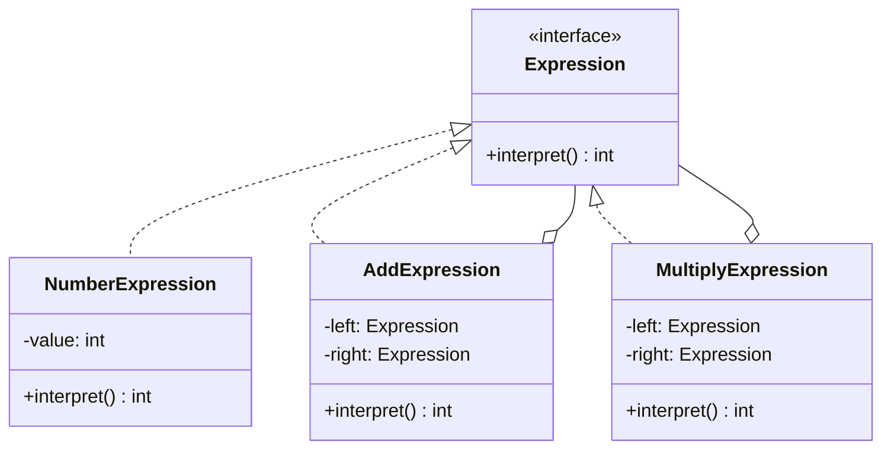

## Why This Chapter Is Shorter Than the Others

Interpreter closes out Part 5 with deliberately lighter treatment than the previous ten chapters —
consistent with this series' running discipline (Chapter 15's caution against applying patterns
that don't earn their complexity, and Chapter 26's similar "narrow applicability" treatment of
Flyweight). Interpreter is, by most practitioners' accounts, the **least frequently used** of all
23 GoF patterns in ordinary application development. The goal here is **recognition, not mastery**
— knowing what it is and why it's rare is worth more interview credit than deep implementation
fluency few interviewers will actually probe.

## Intent

> **Given a language, define a representation for its grammar along with an interpreter that uses
> the representation to interpret sentences in the language.**

Interpreter solves the problem of **evaluating expressions written in a small, custom language** —
by modeling each grammar rule as its own class, and building an expression tree that can evaluate
itself recursively.

## A Minimal Example: A Tiny Arithmetic Expression Language

```java
interface Expression {
    int interpret();
}

class NumberExpression implements Expression {
    private final int value;
    NumberExpression(int value) { this.value = value; }
    public int interpret() { return value; }
}

class AddExpression implements Expression {
    private final Expression left, right;
    AddExpression(Expression left, Expression right) { this.left = left; this.right = right; }
    public int interpret() { return left.interpret() + right.interpret(); }
}

class MultiplyExpression implements Expression {
    private final Expression left, right;
    MultiplyExpression(Expression left, Expression right) { this.left = left; this.right = right; }
    public int interpret() { return left.interpret() * right.interpret(); }
}
```

```java
// Represents: (3 + 4) * 2
Expression expr = new MultiplyExpression(
    new AddExpression(new NumberExpression(3), new NumberExpression(4)),
    new NumberExpression(2)
);
System.out.println(expr.interpret()); // 14
```



**Immediately recognizable:** this is Composite (Chapter 23) — a tree of objects sharing a common
interface, treated uniformly. Interpreter is best understood as **Composite applied specifically to
representing and evaluating a grammar**, where each node type corresponds to one grammar rule.

## Why This Pattern Is Rarely Reached For

Two practical reasons dominate:

1. **Recursive-descent parsing and mature parser-generator tools** (ANTLR, javacc, or simply
   hand-written recursive-descent parsers) handle real grammars — including ones far more complex
   than toy arithmetic — more robustly than hand-rolling a class-per-grammar-rule Interpreter
   structure. For any grammar beyond the trivial, a dedicated parsing tool is the practical,
   professional answer.
2. **Class-per-grammar-rule doesn't scale.** A real language has dozens or hundreds of grammar
   rules; representing each as its own class produces an unwieldy number of tiny classes very
   quickly — this is the same "many small classes" cost flagged for the classic Visitor pattern in
   Chapter 37, here without Visitor's specific extensibility payoff to justify it.

**The pattern remains genuinely useful for very small, fixed, unlikely-to-grow grammars** — a
simple rules engine evaluating boolean conditions (`age > 18 AND hasLicense`), a basic filter
expression parser, or a minimal configuration-value expression language — where introducing a full
parser-generator toolchain would be significant overkill for the actual complexity involved.

## Interpreter vs. Visitor: A Natural Pairing

If an expression tree (like the one above) needs **multiple different operations** beyond just
`interpret()` — say, also `prettyPrint()` and `optimize()` — that's the exact "stable element
types, growing operations" signal from Chapter 37. Rather than adding more methods directly to
every `Expression` subclass, a `Visitor` is the natural next step: `NumberExpression`,
`AddExpression`, and `MultiplyExpression` become the stable "elements," and each new capability
becomes a new `ExpressionVisitor` implementation. **Interpreter defines the tree structure;
Visitor is often how you add capabilities to it later without touching the tree's own classes.**

## What to Say If Asked About Interpreter in an Interview

Given its rarity, the strongest answer is usually a concise, accurate recognition rather than an
elaborate implementation: **"This is essentially Composite applied to a grammar — each rule is a
class, and evaluation is a recursive tree walk. For anything beyond a small, fixed expression
language, I'd reach for an existing parsing library rather than hand-rolling this structure."**
This demonstrates awareness without overstating the pattern's practical importance.

## Summary

- Interpreter represents a grammar as a class hierarchy (one class per rule) and evaluates
  expressions by recursively walking the resulting tree — structurally, it's Composite applied
  specifically to language grammars.
- It's the least commonly used GoF pattern in ordinary practice — real-world parsing is almost
  always better served by dedicated parser-generator tools or hand-written recursive-descent
  parsers than by a class-per-grammar-rule structure.
- It remains a reasonable, lightweight fit for genuinely small, fixed, simple expression languages
  (basic rule engines, simple filter expressions) where a full parsing toolchain would be
  overkill.
- Interpreter and Visitor pair naturally: Interpreter builds the stable tree of grammar-rule
  classes; Visitor is the mechanism for adding new operations (beyond simple evaluation) to that
  tree without modifying it.

---

## Interview Questions

**1. State the Interpreter pattern's intent, and explain its relationship to the Composite
pattern from Chapter 23.**
Interpreter defines a representation for a language's grammar, along with a mechanism to interpret
(evaluate) sentences written in that language, typically by modeling each grammar rule as its own
class and building a tree of these objects representing a specific expression. Structurally, it is
a direct, specific application of the Composite pattern: each grammar-rule class implements a
shared interface (like `Expression`, with an `interpret()` method), and composite rules (like
`AddExpression`) hold references to other `Expression` objects, forming a recursive tree evaluated
uniformly through that shared interface — exactly Composite's core structural idea, applied
specifically to representing and evaluating a language grammar.
*Follow-up: Given this close relationship, why is Interpreter considered a distinct, separately-
named pattern rather than simply being described as "an application of Composite"?* The GoF
authors chose to name it separately primarily because it addresses a distinct, specific *problem
domain* (representing and evaluating a formal language/grammar) with its own established
vocabulary from formal language theory (terminal and non-terminal expressions, corresponding to
"leaf" and "composite" grammar rules) — even though the underlying object-oriented structure is
essentially identical to Composite, the specific context and terminology of grammar representation
was considered distinct enough to warrant its own named pattern in the original catalog.

**2. Why does this chapter explicitly recommend against implementing Interpreter for anything
beyond a small, fixed grammar, and what would you recommend instead for a more complex language?**
A class-per-grammar-rule structure doesn't scale well to real, complex languages, which typically
have dozens or hundreds of distinct grammar rules — representing each as its own class produces an
unwieldy, hard-to-maintain proliferation of tiny classes, and hand-rolling this structure also
misses out on the robustness, error-handling, and tooling support that mature parsing technologies
provide. For anything beyond a trivial expression language, dedicated parser-generator tools
(like ANTLR or javacc) or a hand-written recursive-descent parser are the practical, professional
recommendation — these tools and techniques are specifically designed and battle-tested for
handling real-world grammar complexity far more robustly than a manually-built Interpreter class
hierarchy.
*Follow-up: If an LLD interviewer specifically asked you to design a parser for a moderately
complex language (say, a simplified SQL-like query language), would applying the classic
Interpreter pattern still be an appropriate answer?* Likely not as the primary recommended
approach — for a language with meaningful complexity (multiple clause types, operator precedence,
nested subqueries), the more appropriate and professionally credible answer would be to describe
using or building a proper lexer/parser (potentially generating an abstract syntax tree using
recursive-descent parsing techniques, or explicitly mentioning a parser-generator tool), while
still being able to explain that the resulting AST's node classes and their evaluation would
structurally resemble Interpreter/Composite's tree-of-shared-interface shape — demonstrating
awareness of the pattern's underlying concept without overstating classic Interpreter's practical
applicability at that level of complexity.

**3. In the arithmetic expression example, what would need to happen to add support for a new
operation — say, subtraction — and how does this connect to the Composite pattern's own
extensibility characteristics discussed in Chapter 23?**
Adding subtraction support means writing one new class, `SubtractExpression implements
Expression`, with its own `interpret()` method computing `left.interpret() - right.interpret()` —
no existing `Expression` implementation (`NumberExpression`, `AddExpression`,
`MultiplyExpression`) needs any modification at all. This mirrors Composite's own OCP-friendly
extensibility characteristic directly: adding a new "element type" (here, a new kind of grammar
rule/operation) to a Composite-shaped hierarchy is cheap and additive, requiring no changes to
existing classes — exactly the same extensibility property discussed for adding new file-system
node types in Chapter 23.
*Follow-up: How would this same addition (adding subtraction) look different if the design
instead used the Visitor pattern from Chapter 37 to add new *operations* on a fixed, stable set of
expression types, rather than adding a new expression *type* as done here?* These are actually two
different kinds of extension being conflated in this specific question — adding "subtraction" as
a new *expression type* (a new kind of node in the tree, like `AddExpression`'s sibling) is exactly
the kind of extension Composite/Interpreter make cheap; if instead you wanted to add a completely
new *operation* applicable across all existing expression types (like the previously-discussed
`prettyPrint()` or `optimize()`), that's precisely the scenario where Visitor becomes the
appropriate complementary tool, as this chapter's "Interpreter vs. Visitor" section describes —
recognizing which of these two genuinely different kinds of extension a given new requirement
actually represents is the key distinguishing judgment call.

**4. What are "terminal expressions" and "non-terminal expressions" in the formal Interpreter
pattern vocabulary, and how do these map onto the example in this chapter?**
A terminal expression represents a basic, leaf-level element of the grammar that doesn't contain
further sub-expressions — in the example, `NumberExpression` is a terminal expression, since it
directly holds and returns a literal value with no further recursive evaluation needed. A
non-terminal expression represents a composite grammar rule built from other expressions (which
could themselves be terminal or further non-terminal) — `AddExpression` and
`MultiplyExpression` are non-terminal expressions, since each holds references to two other
`Expression` objects and recursively evaluates them as part of its own `interpret()` logic.
*Follow-up: Does this terminal/non-terminal distinction map directly onto Composite's "leaf" and
"composite" vocabulary from Chapter 23?* Yes, precisely — "terminal expression" corresponds
exactly to Composite's "leaf" concept (a node with no further children, terminating the recursion),
and "non-terminal expression" corresponds exactly to Composite's "composite" concept (a node
containing further child nodes, continuing the recursion) — this is a direct, one-to-one
terminology mapping between the two patterns' vocabularies, further reinforcing that Interpreter is
essentially Composite's structural idea applied to and renamed for the specific domain of grammar
representation.

**5. How would you unit test the `MultiplyExpression`/`AddExpression` example to verify that
operator precedence (multiplication happening correctly on the already-computed sum) is handled
correctly?**
Construct the specific expression tree representing `(3 + 4) * 2` exactly as shown in the chapter's
example (with `AddExpression` nested inside `MultiplyExpression`), call `interpret()`, and assert
the result equals 14 — this verifies that the tree structure itself, not any implicit operator-
precedence logic within the pattern, is what determines evaluation order; since the "precedence" is
entirely expressed by how the tree is *constructed* (which expression is nested inside which),
correctly testing this pattern is really about verifying that a correctly-constructed tree
evaluates to the mathematically correct result, given that specific tree shape.
*Follow-up: Does the Interpreter pattern itself have any inherent understanding of mathematical
operator precedence (like "multiplication before addition"), or is that entirely the
responsibility of whatever code constructs the expression tree?* The Interpreter pattern itself
has no inherent understanding of precedence at all — the pattern only knows how to evaluate
whatever tree structure it's given, exactly as constructed; correctly encoding precedence rules
(ensuring a raw input string like "3 + 4 * 2" is parsed into a tree that correctly nests
`AddExpression` and `MultiplyExpression` according to standard precedence rules, rather than a
naive left-to-right tree) is entirely the responsibility of whatever *parsing* logic constructs the
tree in the first place — this is precisely the kind of genuinely hard, precedence-aware parsing
work that dedicated parser-generator tools handle far more robustly and correctly than a simple,
hand-rolled tree-construction approach would.

**6. In an LLD interview, if asked to design a simple rules engine that evaluates conditions like
`"age > 18 AND hasLicense == true"` for a business application, would Interpreter be a reasonable
pattern to apply, and what would the design look like at a high level?**
Yes — this is a good, appropriately-scoped fit for Interpreter, since the "grammar" involved (simple
comparison and boolean logic operators over a small, fixed set of condition types) is genuinely
small and unlikely to grow into full programming-language complexity. You'd define an
`Expression` interface with an `evaluate(Context context)` method (where `Context` provides access
to the relevant data, like a user's age and license status), with terminal expressions like
`GreaterThanExpression` and `EqualsExpression`, and non-terminal expressions like
`AndExpression`/`OrExpression` combining other expressions — evaluating the entire rule by building
and then interpreting the corresponding expression tree.
*Follow-up: How would raw rule strings (like the example condition string) actually get converted
into this expression tree in a real implementation, and does this connect back to the earlier
discussion about parsing tools?* Converting a raw string into the correct tree structure requires
some form of parsing logic — for a genuinely small, simple, fixed grammar like this rules-engine
example, a straightforward hand-written parser (perhaps a simple tokenizer followed by a small
recursive-descent parsing function) is entirely reasonable and proportionate to the grammar's
actual simplicity, unlike the earlier SQL-like-language example, which would have warranted a more
robust parsing tool given its greater complexity — this illustrates the chapter's core guidance:
match the parsing approach's sophistication to the actual complexity of the grammar being
represented, rather than either under- or over-engineering relative to the real need.

**7. Does the Interpreter pattern inherently support "compiling" an expression (translating it
into some other, more efficient representation) rather than just directly interpreting/evaluating
it every time, or is direct interpretation its only mode of operation?**
The classic Interpreter pattern, as typically presented (with an `interpret()` method), is
specifically designed around direct evaluation — walking the tree and computing a result each time
`interpret()` is called, without any inherent compilation or optimization step. However, nothing
structurally prevents extending the same tree structure with additional operations (via Visitor,
as discussed earlier) that perform other tasks — like a `CompileVisitor` that walks the same
expression tree once and generates optimized bytecode or a more efficient evaluation plan, rather
than directly computing a result — showing how the tree structure Interpreter builds can serve as
the foundation for operations well beyond simple, repeated direct evaluation.
*Follow-up: Would repeatedly calling `interpret()` on the same expression tree for the same
inputs be inefficient compared to a "compiled" approach, and when might this efficiency
difference actually matter in practice?* Yes, direct tree-walking interpretation does re-traverse
and re-evaluate the entire tree structure on every single call, which is less efficient than a
pre-compiled, optimized representation (similar in spirit to why real programming language
implementations distinguish between interpreters and compilers) — this efficiency difference
matters in practice specifically when the same expression needs to be evaluated an extremely large
number of times with different input data (like a rules engine evaluating the same rule against
millions of records), where the repeated tree-traversal overhead of direct interpretation could
become a meaningful performance bottleneck, potentially justifying the added complexity of a
compilation step for that specific high-throughput scenario.

**8. How would you handle error cases in an Interpreter-based design — for example, what happens
if `MultiplyExpression`'s `left` or `right` field somehow ends up `null`, or if a real-world rules
engine's condition references a field name (like `"ageg"` — a typo) that doesn't exist in the
provided data context?**
For a `null` child reference, this represents an internal consistency bug in however the tree was
constructed (parsing logic should never produce an incomplete node), and would likely surface as a
`NullPointerException` when `interpret()` attempts to call `left.interpret()` — a real
implementation might add explicit null-checks with more descriptive error messages during tree
construction (in the parsing/tree-building logic) rather than only failing much later, deep inside
evaluation, with a less informative generic exception. For a referenced field that doesn't exist in
the evaluation context (like a typo'd field name), the terminal expression responsible for looking
up that field (perhaps a `FieldReferenceExpression`) should explicitly check for this case and throw
a clear, descriptive exception (like an `UnknownFieldException`) rather than allowing a generic,
less helpful `NullPointerException` or silent incorrect behavior to occur.
*Follow-up: Where is the most appropriate place in this design to validate that all referenced
field names in a rule actually correspond to real, known fields — during initial tree construction/
parsing, or lazily at evaluation time?* Validating field names during initial construction/parsing
(sometimes called a "semantic validation" pass, separate from basic syntax parsing) is generally
preferable to catching the error lazily, only when a specific rule happens to be evaluated at
runtime — catching this kind of error as early as possible (ideally as soon as a rule is defined or
loaded, rather than only when it's actually triggered against real data) provides much faster,
clearer feedback to whoever authored the faulty rule, rather than a potentially confusing failure
occurring much later, disconnected in time from when the actual mistake was made.

**9. Given everything discussed in this chapter about Interpreter's rarity and narrow scope, how
would you personally prioritize spending remaining interview preparation time on this pattern
versus the other ten behavioral patterns covered throughout this Part?**
Given Interpreter's narrow applicability and its close structural relationship to Composite
(which has already been thoroughly covered in Chapter 23), a reasonable prioritization is to ensure
solid *recognition-level* understanding (being able to identify it, explain its relationship to
Composite, and articulate why real-world parsing typically favors dedicated tools instead) rather
than investing significant additional time in deep implementation practice or memorizing extensive
variations — this mirrors the same prioritization guidance given for Flyweight in Chapter 26,
reserving deeper preparation time for the more broadly and frequently applicable patterns (Strategy,
Observer, State, Command) that are considerably more likely to be directly and extensively probed
in a typical LLD interview.
*Follow-up: Is there a risk in deprioritizing a pattern's preparation time based on its perceived
rarity, in case an interviewer specifically happens to ask about it in depth?* There's some risk,
but it's a reasonable, evidence-based trade-off given genuinely limited preparation time and the
real, well-documented rarity of Interpreter specifically appearing as a deep-dive interview topic
compared to far more commonly-tested patterns — the goal of this kind of prioritization isn't
eliminating all risk of being asked about a lower-priority topic, but allocating preparation effort
proportionally to the realistic likelihood and depth of what's actually likely to be tested,
accepting that perfect coverage of all 23 GoF patterns to equal depth isn't a realistic or efficient
preparation goal for any finite amount of interview preparation time.

**10. Summarize the complete set of relationships this chapter has drawn between Interpreter and
other patterns covered throughout this series (Composite from Chapter 23, and Visitor from
Chapter 37), and explain why understanding these relationships is more valuable than memorizing
Interpreter's implementation in isolation.**
Interpreter's tree structure and evaluation mechanism are essentially a direct, renamed application
of Composite (Chapter 23), specifically applied to representing and evaluating a language's
grammar rules; and Interpreter's expression tree is a natural candidate for having additional
capabilities layered onto it via Visitor (Chapter 37) once a single `interpret()` operation isn't
the only thing needed on that tree. Understanding these relationships is more valuable than
memorizing Interpreter's implementation in isolation because it means genuinely new knowledge
required to understand Interpreter is actually quite small — most of the conceptual heavy lifting
(the tree structure, the shared interface, the recursive uniform treatment) was already thoroughly
established in Chapter 23, and Interpreter is best understood as a specific, narrow application of
already-familiar ideas to a specific problem domain, rather than an entirely separate body of
knowledge requiring independent, from-scratch mastery.
*Follow-up: Having now completed all eleven chapters of Part 5 covering behavioral design
patterns, what would you identify as the single most important, transferable skill this entire
Part has built, applicable well beyond just these eleven specific named patterns?* The single most
important, transferable skill is the discipline of precisely identifying a design problem's actual
*intent and behavioral guarantees* — who initiates action, whether implementations are mutually
aware, whether behavior is broadcast versus selected versus made storable/undoable, which
extensibility axis is expected to grow — rather than relying on superficial structural pattern-
matching (interface with multiple implementations; objects linked in a sequence; a tree of
uniformly-treated nodes). This discipline, established through repeatedly and explicitly
distinguishing between structurally-similar-but-intentionally-distinct patterns throughout this
entire Part (Strategy vs. State, Chain of Responsibility vs. Decorator, Mediator vs. Facade vs.
Observer, Composite vs. Interpreter vs. Visitor), is the genuinely durable, transferable skill —
far more valuable in real LLD interviews and real system design than the ability to recite any
individual pattern's canonical name and diagram from memory.
