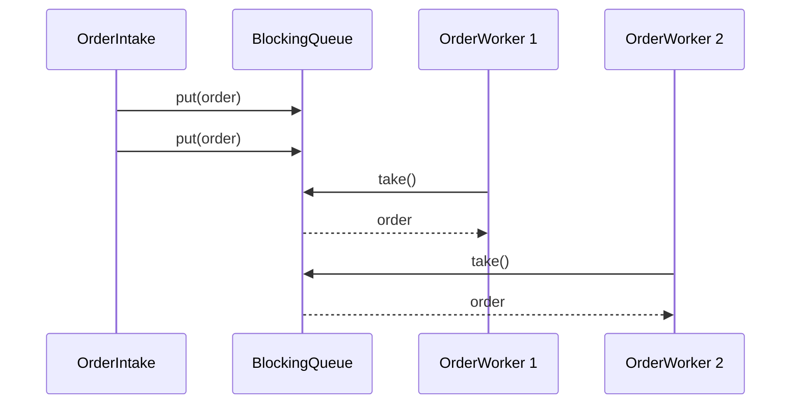
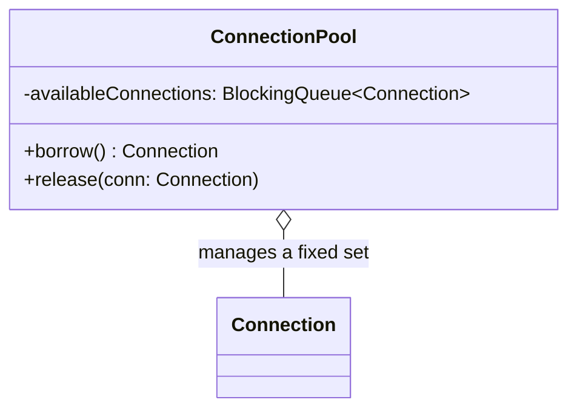

## Welcome to Concurrency-Aware Patterns

Every pattern so far has assumed a single thread of execution. Real Java systems rarely have that
luxury — web servers handle many requests concurrently, background jobs process queues, and
multiple threads frequently need to coordinate around shared work or shared, expensive resources.
This short Part covers two patterns specifically shaped by that concern.

## Producer-Consumer

### Intent

> **Decouple the code that produces work items from the code that processes them, coordinating
> through a shared, thread-safe queue.**

### The Motivating Problem: Producers and Consumers Directly Coupled

```java
class OrderProcessor {
    void processOrder(Order order) {
        validate(order);
        chargePayment(order);
        // Every order is fully processed synchronously, on the same thread that received it.
        // A slow payment gateway call blocks the thread that could be accepting new orders.
    }
}
```

If order intake and order processing happen on the same thread, a slow step (like an external
payment call) directly blocks the system's ability to accept new incoming orders — throughput is
capped by the slowest step in the chain, and the two concerns (accepting work, doing work) are
tangled together on one thread.

### The Fix: A Shared, Thread-Safe Queue Between Them

```java
class OrderIntake { // the Producer
    private final BlockingQueue<Order> queue;

    OrderIntake(BlockingQueue<Order> queue) { this.queue = queue; }

    void receiveOrder(Order order) throws InterruptedException {
        queue.put(order); // blocks only if the queue is full — never touches payment logic
    }
}

class OrderWorker implements Runnable { // the Consumer
    private final BlockingQueue<Order> queue;

    OrderWorker(BlockingQueue<Order> queue) { this.queue = queue; }

    public void run() {
        while (true) {
            try {
                Order order = queue.take(); // blocks until an order is available
                chargePayment(order); // the slow work happens here, on a separate thread
            } catch (InterruptedException e) {
                Thread.currentThread().interrupt();
                break;
            }
        }
    }
}
```

```java
BlockingQueue<Order> queue = new LinkedBlockingQueue<>(100); // bounded — prevents unbounded growth
OrderIntake intake = new OrderIntake(queue);

for (int i = 0; i < 4; i++) {
    new Thread(new OrderWorker(queue)).start(); // 4 worker threads consuming concurrently
}
```

`OrderIntake` never waits for payment processing — it simply hands the order off to the queue and
returns immediately (unless the queue is full). Multiple `OrderWorker` threads pull from the same
queue concurrently, and Java's `BlockingQueue` handles all the thread-safety coordination
internally — no manual `synchronized` blocks required in application code.



### Why the Queue Must Be Bounded

An unbounded queue (`new LinkedBlockingQueue<>()` with no capacity) can grow without limit if
producers outpace consumers — silently consuming ever-more memory until the application runs out
of it. A **bounded** queue applies natural **backpressure**: once full, `put()` blocks the
producer until a consumer frees up space, which is almost always the correct, safer default —
explicitly deciding what a full queue should do (block, reject, or drop) is a deliberate design
decision, not an afterthought.

## Object Pool

### Intent

> **Reuse a fixed set of expensive-to-create objects rather than constructing and destroying them
> repeatedly, coordinating safe access across multiple threads.**

### The Motivating Problem

Database connections are expensive to establish (network handshake, authentication). Creating a
new connection for every single query and discarding it afterward is wasteful:

```java
void runQuery(String sql) {
    Connection conn = DriverManager.getConnection(url, user, password); // expensive, every time
    // ... run query
    conn.close(); // the expensive connection is simply thrown away
}
```

### The Fix: A Pool of Reusable, Pre-Established Connections

```java
class ConnectionPool {
    private final BlockingQueue<Connection> availableConnections;

    ConnectionPool(int size) {
        availableConnections = new LinkedBlockingQueue<>();
        for (int i = 0; i < size; i++) {
            availableConnections.add(createNewConnection()); // pay the expensive cost once, upfront
        }
    }

    Connection borrow() throws InterruptedException {
        return availableConnections.take(); // blocks if none are currently available
    }

    void release(Connection conn) {
        availableConnections.offer(conn); // return it to the pool for reuse — NOT closed
    }

    private Connection createNewConnection() { /* expensive setup, once */ return null; }
}
```

```java
ConnectionPool pool = new ConnectionPool(10);

Connection conn = pool.borrow();
try {
    // run query using conn
} finally {
    pool.release(conn); // always return it, even if the query throws
}
```

The pool pays the expensive connection-establishment cost exactly **10 times, upfront** — every
subsequent `borrow()`/`release()` cycle reuses an already-established connection, avoiding the
repeated cost entirely.



### The Critical Discipline: `finally` Blocks Are Not Optional

If a caller borrows a connection and an exception occurs before `release()` is called, that
connection is **permanently lost** to the pool — over time, this **exhausts the pool entirely**,
and every subsequent `borrow()` call blocks forever, waiting for a connection that will never be
returned. **Every `borrow()` must be paired with a `release()` in a `finally` block** — this is the
exact same "forgotten unsubscription" discipline from Chapter 29's Observer memory-leak discussion,
here manifesting as **resource exhaustion** instead of a memory leak.

### Object Pool vs. Flyweight (Chapter 26): A Precise Distinction

Both patterns reuse objects instead of constructing new ones — the difference is **exclusivity**:

| | Flyweight (Ch. 26) | Object Pool |
|---|---|---|
| **Sharing model** | Many consumers hold the **same** instance **simultaneously** | Exactly **one** consumer holds an instance **at a time** |
| **Mutability** | Must be immutable (shared concurrently) | Can be mutable — only one borrower uses it at once |
| **Return required?** | No — never "given back," just referenced | Yes — must be explicitly released for reuse |

A `CharacterStyle` flyweight is read by a million characters *at the same time*. A pooled
`Connection` is used by exactly *one* borrower at a time, then returned for the next borrower —
never shared concurrently.

## Summary

- Producer-Consumer decouples work generation from work processing via a shared, thread-safe
  queue — Java's `BlockingQueue` handles the coordination, letting producers and consumers run at
  their own independent paces.
- Always use a **bounded** queue to apply backpressure and prevent unbounded memory growth when
  producers outpace consumers.
- Object Pool reuses a fixed set of expensive-to-create objects, paying the creation cost once
  upfront and requiring every `borrow()` to be paired with a `release()` — typically enforced with
  a `finally` block, to avoid pool exhaustion.
- Distinguish Object Pool from Flyweight by exclusivity: Flyweight objects are shared
  simultaneously and never mutated; pooled objects are held exclusively by one borrower at a time
  and can be mutable.

---

## Interview Questions

**1. State the Producer-Consumer pattern's intent, and explain what specific problem it solves
that processing work synchronously, on the same thread that receives it, does not.**
Producer-Consumer decouples the generation of work items from their processing, coordinating the
two through a shared, thread-safe queue — producers add work to the queue and continue without
waiting, while separate consumer threads pull from the queue and perform the actual (potentially
slow) processing independently. This solves the throughput problem of synchronous processing,
where a slow processing step (like an external payment call) directly blocks the thread that
should otherwise be free to accept new incoming work, capping overall system throughput at the
speed of the slowest processing step.
*Follow-up: Does Producer-Consumer guarantee that work items are processed in the exact order
they were produced?* This depends on the specific queue implementation and the number of consumer
threads — a single-consumer setup using a standard FIFO queue (like `LinkedBlockingQueue`)
preserves strict production order, but with multiple concurrent consumer threads (as shown in the
example with 4 workers), items may complete processing in a different order than they were
produced, since different workers may take varying amounts of time to process their respective
items — if strict ordering of *completion* matters, additional coordination beyond the basic
pattern would be needed.

**2. Why must the `BlockingQueue` used in Producer-Consumer be bounded (have a maximum capacity),
rather than unbounded, in most production scenarios?**
An unbounded queue allows producers to keep adding work indefinitely if they outpace consumers,
with no natural limit — this can lead to unbounded memory growth and eventual application failure
(an `OutOfMemoryError`) if production sustainably outpaces consumption for an extended period. A
bounded queue applies backpressure: once full, `put()` blocks the producer until a consumer frees
up space by processing an item, which naturally throttles the producer's rate to match the
consumers' actual processing capacity, trading "producers never wait" for "the application never
runs out of memory from unbounded queue growth" — almost always the safer, more appropriate
default trade-off.
*Follow-up: What alternative to blocking could a bounded queue's `put()`-equivalent operation
take when the queue is full, and when might that alternative be preferable to blocking?*
Java's `BlockingQueue` interface also offers `offer()` (which returns `false` immediately if the
queue is full, rather than blocking) and `offer(item, timeout, unit)` (which blocks only up to a
specified timeout before giving up) — these alternatives are preferable when the producer has its
own reason to avoid blocking indefinitely, such as needing to report an immediate "system busy,
try again later" response to an upstream caller rather than silently stalling that caller's own
thread while waiting for queue space to free up.

**3. Explain how Java's `BlockingQueue` eliminates the need for manual `synchronized` blocks or
explicit locks in the Producer-Consumer example shown in this chapter.**
`BlockingQueue` implementations (like `LinkedBlockingQueue`) internally handle all the necessary
thread-safety coordination — safely allowing multiple producer threads to call `put()` and
multiple consumer threads to call `take()` concurrently, correctly blocking and waking up threads
as needed (a consumer calling `take()` on an empty queue blocks until a producer adds an item; a
producer calling `put()` on a full bounded queue blocks until a consumer removes an item) — all of
this internal synchronization logic is implemented once, correctly, inside the JDK's
`BlockingQueue` implementations, so application code using them never needs to write its own
manual locking logic to achieve this same safe, coordinated behavior.
*Follow-up: If a team decided to implement this same coordination manually using a plain
`ArrayList` protected by `synchronized` blocks and `wait()`/`notify()` calls instead of using
`BlockingQueue`, what risks would this introduce?* Manually implementing this coordination
correctly is notoriously error-prone — subtle bugs like missed `notify()` calls (leaving a waiting
thread blocked forever), incorrect use of `wait()` outside a loop (vulnerable to spurious
wakeups), or forgetting to synchronize every access path consistently are common, difficult-to-
debug mistakes; using the JDK's thoroughly-tested, battle-hardened `BlockingQueue` implementations
avoids this entire category of risk, which is precisely why hand-rolling this specific
coordination logic is strongly discouraged in real-world Java code when a suitable `BlockingQueue`
implementation is available.

**4. State the Object Pool pattern's intent, and explain the specific circumstance under which it
provides genuine value, connecting back to the same "expensive construction" justification
discussed for Prototype in Chapter 20.**
Object Pool maintains a fixed set of pre-created, expensive-to-construct objects that are borrowed
by callers, used, and then returned for reuse by subsequent callers, rather than being constructed
fresh and discarded after each use. It provides genuine value specifically when object construction
is measurably expensive (database connections requiring network handshakes, thread creation, or
other costly setup) and there's a need for many sequential or concurrent uses of similar objects
over time — this is structurally analogous to Prototype's "expensive construction" justification
from Chapter 20, but addresses a scenario where the *same* limited set of objects is reused
sequentially by different borrowers over time, rather than each borrower needing its own
independent copy.
*Follow-up: If object construction were cheap (a few field assignments, no I/O), would Object
Pool still be worth using?* Generally no — following the same reasoning applied to Prototype in
Chapter 20, if construction is already cheap, introducing the added complexity of pool management
(tracking availability, enforcing borrow/release discipline, sizing the pool correctly) provides no
meaningful performance benefit and would be unjustified complexity, consistent with the KISS/YAGNI
discipline applied throughout this series to every pattern's applicability judgment.

**5. Explain why forgetting to call `release()` after `borrow()` is a particularly severe bug in
an Object Pool implementation, and describe its specific failure mode over time.**
If a caller borrows a `Connection` from the pool and an exception occurs before `release()` is
called (or the release call is simply forgotten), that specific connection is permanently removed
from the pool's available set with no way for the pool to reclaim it — this doesn't cause an
immediate, obvious failure, but each such occurrence permanently shrinks the pool's effective
capacity by one; over time, as this happens repeatedly across many borrow operations, the pool's
available connections dwindle until eventually every connection has been "leaked" this way, and
every subsequent `borrow()` call blocks indefinitely, waiting for a connection that will never
become available again — a gradual, insidious failure mode that can take a long time in production
to manifest and can be difficult to diagnose after the fact.
*Follow-up: How would you defensively guard against this specific failure mode at the code level,
beyond simply reminding developers to always use a `finally` block?* You could design the pool's
API to make the correct usage pattern harder to get wrong — for example, providing a method that
accepts a functional interface representing the work to be done with the borrowed resource
(`pool.withConnection(conn -> { /* use conn here */ })`), where the pool itself internally handles
the borrow-try-finally-release sequence, making it structurally impossible for calling code to
forget the release step at all, similar in spirit to the "staged builder" and "type-safe" API
design techniques mentioned in earlier chapters (Chapter 19) for making incorrect usage patterns
harder or impossible to accidentally write.

**6. How would you decide the correct size for an Object Pool — what factors would influence
choosing, say, 10 connections versus 50 or 100?**
The correct pool size depends on balancing the expected concurrent demand for the pooled resource
against the cost (memory, or in the case of database connections, the load placed on the database
server itself) of maintaining each pooled instance — too small a pool causes callers to frequently
block waiting for an available instance even under normal load (reducing throughput), while too
large a pool wastes resources maintaining idle instances that are rarely all simultaneously needed,
and for something like database connections, an excessively large pool could even overwhelm the
database server itself with more concurrent connections than it can efficiently handle. In
practice, this size is typically determined empirically — through load testing and monitoring
actual concurrent usage patterns in a realistic or production-like environment — rather than
chosen purely theoretically upfront.
*Follow-up: Should a pool's size always be fixed at creation time, or can a pool dynamically grow
and shrink its size based on current demand?* Some more sophisticated pool implementations (like
many production-grade database connection pool libraries, such as HikariCP) do support dynamic
sizing — starting with a smaller initial pool and growing up to a configured maximum under high
demand, then potentially shrinking back down during periods of lower demand to free up resources —
this adds meaningful implementation complexity beyond the simple fixed-size example shown in this
chapter, but can provide better resource utilization in systems with highly variable load patterns
compared to a purely fixed-size pool.

**7. Explain the precise distinction between Object Pool and Flyweight, given that both patterns
involve reusing existing objects rather than constructing new ones each time.**
The key distinguishing factor is exclusivity of access: Flyweight (Chapter 26) objects are shared
*simultaneously* by many consumers at the same time (a single `CharacterStyle` object is referenced
concurrently by potentially millions of `DocumentCharacter` objects, all at once) and must
therefore be strictly immutable to be safe under this simultaneous sharing. Object Pool objects are
held *exclusively* by exactly one borrower at a time — a `Connection` borrowed from the pool is not
shared with any other caller until it's explicitly released back to the pool, and because access
is exclusive rather than simultaneous, pooled objects can be mutable, since only one borrower is
ever using (and potentially mutating) a given instance's state at any given moment.
*Follow-up: What would go wrong if a pooled `Connection` object were accidentally shared
simultaneously between two borrowers, the way a Flyweight object is deliberately shared?* This
would almost certainly cause serious correctness bugs and potential data corruption or crashes —
database connection objects are generally not designed to be used concurrently by multiple threads
simultaneously (issuing overlapping queries or transactions on the same connection object at the
same time can produce undefined, incorrect behavior), which is precisely why Object Pool's
exclusive-borrowing discipline (only one borrower at a time, explicitly released before the next
borrower can obtain it) is essential and non-negotiable for this specific kind of pooled resource,
unlike Flyweight's deliberate, safe simultaneous sharing of genuinely immutable objects.

**8. How would you unit test the `ConnectionPool`'s `borrow()`/`release()` behavior, particularly
verifying that a released connection becomes available for a subsequent `borrow()` call?**
Create a small pool (say, size 1, for simplicity), call `borrow()` to obtain the single connection,
call `release()` to return it, then call `borrow()` again and assert that the returned connection
is the exact same instance (using `==` reference equality, similar to the Flyweight-testing
approach from Chapter 26) as the one originally borrowed and released — verifying that `release()`
correctly makes the connection available again for a subsequent borrow, rather than the pool
somehow losing track of it or creating a new, different instance.
*Follow-up: How would you test the pool's blocking behavior — specifically, that calling
`borrow()` when the pool is fully exhausted (all connections currently borrowed) correctly blocks
until a connection is released, rather than throwing an exception or returning null
immediately?* You'd need a multi-threaded test: exhaust the pool by borrowing all available
connections from the main test thread, then start a separate thread that calls `borrow()` (which
should block, since none are available) and use a mechanism like a `CountDownLatch` or simply
checking the borrowing thread's state to confirm it's genuinely blocked/waiting rather than having
returned already; then, from the main test thread, call `release()` on one of the previously-
borrowed connections and assert that the blocked thread's `borrow()` call subsequently completes
successfully — this kind of concurrent behavior testing is inherently more complex than simple
single-threaded unit tests and often requires careful use of Java's concurrency testing utilities
to avoid flaky, timing-dependent test failures.

**9. Can the Producer-Consumer and Object Pool patterns be combined within the same system — for
example, could consumer worker threads in a Producer-Consumer setup also borrow resources from an
Object Pool as part of their processing?**
Yes, and this is a very natural, common combination in real systems — the `OrderWorker` consumer
threads shown in this chapter's Producer-Consumer example could, as part of processing each order
pulled from the queue, borrow a database connection from a `ConnectionPool` to persist the order,
using it, and releasing it back to the pool before moving on to process the next order from the
queue — combining Producer-Consumer's decoupling of work generation from work processing with
Object Pool's efficient reuse of expensive database connections, addressing two entirely separate
concerns (work coordination, and expensive resource reuse) within the same overall system design.
*Follow-up: If the number of consumer worker threads exceeds the connection pool's size, what
would happen, and is this a problem?* If more worker threads exist than available pooled
connections, some workers would need to wait (blocking on `pool.borrow()`) whenever all
connections are currently in use by other workers — this isn't necessarily a problem by itself, and
can actually be an intentional, reasonable design choice (limiting concurrent database connections
to protect the database server from being overwhelmed, even if more worker threads could otherwise
process orders concurrently) — but it does mean the connection pool's size, not just the number of
worker threads, becomes an important factor in the overall system's actual achievable throughput,
worth considering and tuning together rather than independently.

**10. In an LLD interview for a "design a food delivery app" or similar system with a background
job processing component, how might Producer-Consumer apply to handling incoming delivery
requests?**
Incoming delivery requests could be added to a bounded `BlockingQueue` by a producer component
(perhaps an API endpoint handler receiving new orders), with a pool of consumer worker threads
pulling requests from the queue and handling the actual matching/dispatch logic (finding an
available delivery driver, calculating routes, notifying the driver) — decoupling the fast,
lightweight work of accepting a new delivery request from the potentially slower, more complex work
of actually processing and dispatching it, allowing the system to accept new requests quickly even
if the dispatch/matching logic itself takes longer to complete for each individual request.
*Follow-up: How would you handle a scenario where certain delivery requests are more urgent than
others (e.g., an already-significantly-delayed order should be processed before newer, on-time
orders) — does the basic Producer-Consumer pattern with a standard FIFO `BlockingQueue`
naturally support this?* No — a standard FIFO `BlockingQueue` processes items strictly in the
order they were added, with no concept of priority; supporting priority-based processing would
require using a `PriorityBlockingQueue` instead, which orders elements according to a specified
`Comparator` (or natural ordering) rather than simple insertion order, ensuring higher-priority
delivery requests are dequeued and processed by available consumer threads before lower-priority
ones, even if the lower-priority ones were added to the queue earlier.

**11. Does the Producer-Consumer pattern, as implemented with a `BlockingQueue`, provide any
guarantee about how many consumer threads should be running relative to the number of producer
threads?**
No — the pattern itself is deliberately agnostic to the specific ratio of producers to consumers;
you could have a single producer feeding multiple consumers (as shown in this chapter's example),
multiple producers feeding a single consumer, or any other combination, and the `BlockingQueue`'s
thread-safe coordination correctly handles any of these configurations without requiring any change
to the fundamental pattern structure. The appropriate ratio is an application-specific tuning
decision based on the relative speed of production versus consumption, not something the pattern
itself prescribes or constrains.
*Follow-up: How would you decide the appropriate number of consumer threads for a given
Producer-Consumer setup in a real application?* This is typically determined empirically, based on
factors like the nature of the consumer work (CPU-bound work generally benefits from a number of
threads close to the number of available CPU cores, while I/O-bound work — like the payment-gateway
call in this chapter's example — can often benefit from a higher number of threads than CPU cores,
since those threads spend much of their time blocked waiting on I/O rather than actively computing)
and observed throughput under realistic load testing, rather than a fixed formula — this connects
to broader concurrent-systems tuning considerations that go beyond the Producer-Consumer pattern's
own core structural definition.

**12. How does the Producer-Consumer pattern relate to, and differ from, the Observer pattern
covered in Chapter 29, given that both involve some form of "one part of the system reacting to
work generated elsewhere"?**
Observer is a direct, typically synchronous, in-process notification mechanism — a Subject calls
`update()` directly on each registered Observer, and (in the basic implementation shown in Chapter
29) this call happens on the same thread that triggered the state change, with the Subject
generally continuing only after each Observer's `update()` call returns (unless observers are
specifically made asynchronous, as discussed in that chapter's interview questions). Producer-
Consumer, by contrast, is fundamentally built around asynchronous, decoupled processing via a
shared queue — the producer never directly calls anything on the consumer at all; it simply adds an
item to the queue and returns immediately, with the actual "reaction" (consumption) happening
independently, on a separate thread, at whatever pace that consumer thread operates.
*Follow-up: Could Producer-Consumer be considered a more robust, thread-safe way of implementing
"asynchronous Observer" notifications, mentioned as a possibility in Chapter 29's interview
questions?* Yes, this is a reasonable and accurate connection — Chapter 29 discussed wrapping an
observer's reaction logic in a `Command` object placed on a queue for asynchronous execution as one
way to prevent a slow observer from blocking notifications to other observers; Producer-Consumer,
using a proper `BlockingQueue`, is essentially the well-established, thread-safe pattern for
implementing exactly that kind of asynchronous, queued reaction mechanism, providing a more robust
and battle-tested foundation than manually managing ad hoc asynchronous task dispatch.

**13. If a system using Object Pool needs to periodically validate that pooled connections are
still alive and healthy (since a database connection could silently become stale or disconnected
while sitting idle in the pool), how would you incorporate this validation into the pool's
design?**
You could add a validation check either when a connection is borrowed (calling a lightweight
"is this connection still alive" check, like a simple test query, before handing it to the caller,
and discarding and replacing it with a freshly-created connection if the check fails) or
periodically, via a separate background maintenance thread that scans idle connections in the pool
and proactively replaces any that have gone stale, before they're ever handed out to a borrower —
both approaches address the same underlying concern (stale, silently-broken connections sitting
unused in the pool) with different trade-offs between added latency at borrow-time versus added
background maintenance complexity.
*Follow-up: Which of these two approaches (validate-on-borrow versus periodic-background-
validation) would you generally recommend, and why?* Validate-on-borrow is often the simpler,
more directly-effective approach for correctness (guaranteeing that whatever connection is handed
to a borrower is confirmed healthy at that exact moment, right before use), at the cost of a small
amount of added latency on every single `borrow()` call; periodic background validation avoids
this per-borrow latency cost but introduces a window where a connection could still go stale
*between* background validation checks and actually being borrowed — many real-world, production-
grade connection pool implementations (like HikariCP) actually combine both approaches for maximum
robustness, using lightweight periodic background checks to catch most staleness proactively while
still validating on borrow for connections that have been idle beyond a certain threshold, providing
strong correctness guarantees without excessive per-borrow overhead for connections known to be
recently validated.

**14. Having now covered two concurrency-aware patterns (Producer-Consumer and Object Pool),
summarize why this short Part exists as a distinct addition to the broader Creational/Structural/
Behavioral categorization established in Chapter 15, rather than folding these two patterns
directly into one of those three existing categories.**
Producer-Consumer and Object Pool don't map cleanly onto a single one of the three classic GoF
categories (creational, structural, behavioral) in the way most previously-covered patterns did —
Object Pool has clear creational characteristics (managing object lifecycle and reuse, similar in
spirit to Flyweight and Prototype) but is fundamentally concerned with concurrent, exclusive access
coordination in a way pure creational patterns aren't; Producer-Consumer has behavioral
characteristics (coordinating how different parts of a system communicate and hand off work) but is
equally fundamentally about thread-safety and concurrent coordination, a concern largely orthogonal
to the single-threaded assumption underlying the classic 23 GoF patterns as originally catalogued.
This series introduces them as their own short, dedicated Part specifically because their defining
characteristic — genuine, correctness-critical concern for multi-threaded coordination — cuts
across and doesn't fit neatly within the classic three-category framework, which predates
widespread emphasis on concurrent programming concerns in mainstream object-oriented design
literature.
*Follow-up: Given this, would you expect real LLD interviews to test these two concurrency-aware
patterns as frequently and deeply as the classic Creational, Structural, and Behavioral patterns
covered in Parts 3 through 5?* Generally, these concurrency-aware patterns are tested somewhat less
universally than core patterns like Strategy, Factory Method, or Singleton (which appear in nearly
every LLD interview track regardless of the specific role), but they become considerably more
important and more frequently and deeply tested for backend, distributed-systems, or
infrastructure-focused roles specifically, where correctly reasoning about concurrent access,
thread safety, and resource management under concurrent load is a core, everyday job requirement —
making solid understanding of this short Part particularly valuable preparation for those specific
kinds of roles, even if its relative interview frequency is somewhat more role-dependent than the
broader, universally-applicable patterns covered in the preceding three Parts.
