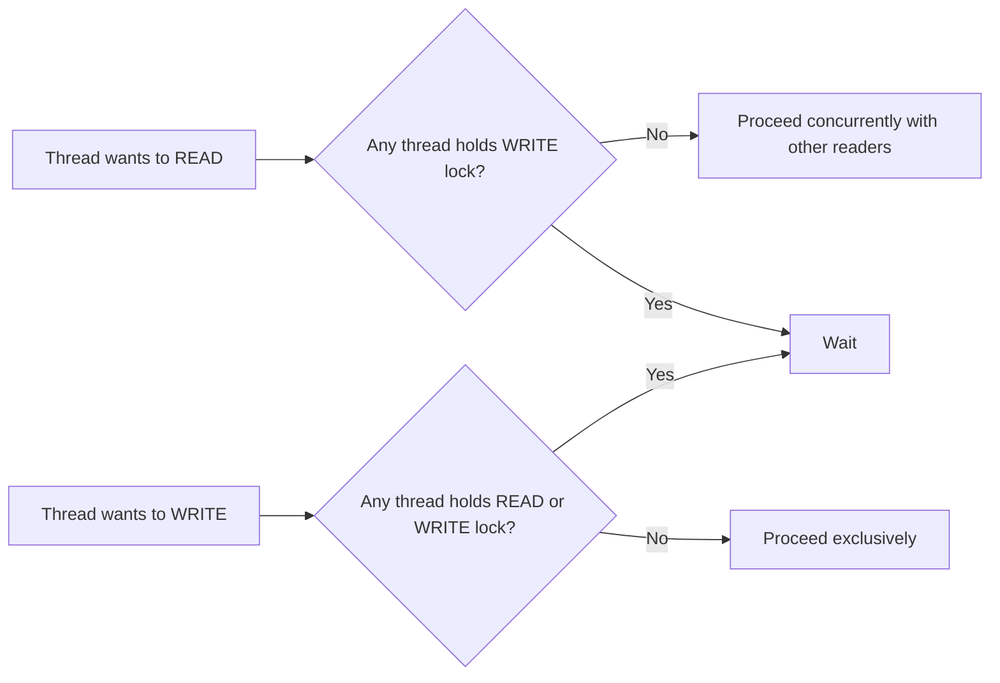

## Intent

> **Allow multiple threads to read shared data concurrently, while still guaranteeing exclusive
> access for any thread that needs to write to it.**

A plain `synchronized` block or method is **all-or-nothing**: only one thread may execute it at a
time, whether that thread is reading or writing. For data that's read far more often than it's
written — a common real-world shape — this is unnecessarily restrictive.

## The Motivating Problem: Reads Blocking Other Reads Unnecessarily

```java
class ParkingLotStatus {
    private final Map<String, Boolean> spotOccupancy = new HashMap<>();

    synchronized boolean isOccupied(String spotId) { // read
        return spotOccupancy.getOrDefault(spotId, false);
    }

    synchronized void setOccupied(String spotId, boolean occupied) { // write
        spotOccupancy.put(spotId, occupied);
    }
}
```

`synchronized` guarantees correctness — no two threads can read and write `spotOccupancy`
simultaneously in a way that corrupts it — but it also means **two threads simply checking
occupancy status at the same time** (an extremely common, entirely safe operation to do
concurrently) are forced to wait for each other unnecessarily. Reads don't conflict with other
reads; only a write conflicts with anything else.

## The Fix: `ReentrantReadWriteLock`

```java
import java.util.concurrent.locks.ReentrantReadWriteLock;

class ParkingLotStatus {
    private final Map<String, Boolean> spotOccupancy = new HashMap<>();
    private final ReentrantReadWriteLock lock = new ReentrantReadWriteLock();

    boolean isOccupied(String spotId) {
        lock.readLock().lock();
        try {
            return spotOccupancy.getOrDefault(spotId, false);
        } finally {
            lock.readLock().unlock();
        }
    }

    void setOccupied(String spotId, boolean occupied) {
        lock.writeLock().lock();
        try {
            spotOccupancy.put(spotId, occupied);
        } finally {
            lock.writeLock().unlock();
        }
    }
}
```

`ReentrantReadWriteLock` provides two related locks: a **read lock**, which any number of threads
may hold **simultaneously** as long as no thread holds the write lock, and a **write lock**, which
is exclusive — held by at most one thread, and only once no other thread holds any read or write
lock at all. Many concurrent `isOccupied()` calls now proceed in parallel; a `setOccupied()` call
still gets full, exclusive protection.



## The `try`/`finally` Discipline Is Non-Negotiable

Exactly like Chapter 39's Object Pool `release()` discipline: **if a lock is acquired outside a
`try` block, and the protected code throws an exception, the lock is never released** — every
subsequent thread waiting for that lock blocks **forever**. This single detail — `lock()` **before**
the `try`, `unlock()` **inside** `finally` — is one of the most commonly tested concurrency details
in Java interviews, precisely because getting the order wrong compiles fine and often even passes
casual testing, only failing under a rare exception path in production.

## When Read-Write Lock Is (and Isn't) Worth It

Read-write locks have their own overhead — more than a plain `synchronized` block — so they only
pay off when reads are **frequent** and **meaningfully outnumber** writes, and when the protected
operation is substantial enough that allowing reads to run in parallel provides a real throughput
benefit. For a `ParkingLotStatus` checked constantly by many concurrent gate-entry threads but
updated relatively rarely, this trade-off clearly favors `ReadWriteLock`. For data written nearly
as often as it's read, a plain `synchronized` block (or, in many cases, `java.util.concurrent`
classes like `ConcurrentHashMap`, which handle this trade-off internally and are usually preferable
to hand-rolled locking entirely) is simpler and often just as effective.

## A Practical Thread-Safety Checklist for LLD Interviews

This chapter closes Part 6 with a reusable checklist — apply it to **any** case study in Part 8
where an interviewer asks "is this thread-safe?":

1. **Identify shared mutable state.** If nothing is both shared across threads *and* mutable,
   there's nothing to protect (Chapter 26's Flyweight immutability discussion is the relevant
   reminder here).
2. **Identify every operation that reads or writes that state.** List them explicitly — this is
   often where a design's actual concurrency risk becomes visible for the first time.
3. **Decide the correctness requirement.** Does an operation need to be atomic (an entire
   check-then-act sequence, like "find a free spot and reserve it," must happen as one indivisible
   unit — Chapter 16's Singleton race condition and Chapter 25's `OrderFacade` failure-handling
   discussion are both instances of this)?
4. **Choose the lightest mechanism that satisfies the requirement**: an immutable design (no
   locking needed at all) → a `java.util.concurrent` collection (`ConcurrentHashMap`,
   `BlockingQueue`) → a plain `synchronized` block → a `ReadWriteLock`, in roughly that order of
   preference, reaching for more complex mechanisms only when a simpler one genuinely can't satisfy
   the requirement.
5. **Verify lock acquisition and release are correctly paired** with `try`/`finally`, exactly as
   emphasized in this chapter.

## Summary

- `ReentrantReadWriteLock` allows multiple concurrent readers while still guaranteeing exclusive
  access for writers — a direct throughput improvement over `synchronized` specifically when reads
  vastly outnumber writes.
- Always acquire the lock before the `try` block and release it in `finally` — an unreleased lock
  due to an exception blocks every subsequent thread waiting for it, permanently.
- Read-write locks carry their own overhead and are only worth it when reads genuinely dominate;
  for balanced read/write workloads, a plain `synchronized` block or a `java.util.concurrent`
  collection is often simpler and equally effective.
- The five-step thread-safety checklist (identify shared mutable state → identify operations →
  determine atomicity needs → choose the lightest sufficient mechanism → verify correct lock
  discipline) applies to any LLD case study where concurrency is in scope.

---

## Interview Questions

**1. State the Read-Write Lock pattern's intent, and explain precisely what advantage it provides
over a plain `synchronized` block for the specific case of frequent reads and infrequent writes.**
A read-write lock allows any number of threads to hold the read lock simultaneously (as long as no
thread holds the write lock), while still guaranteeing the write lock is held exclusively by at
most one thread at a time, with no concurrent readers or writers permitted while a write is in
progress. This provides a throughput advantage over a plain `synchronized` block specifically
because `synchronized` forces strict, one-thread-at-a-time execution for *every* access,
regardless of whether it's a read or write — unnecessarily serializing concurrent reads that could
otherwise safely execute in parallel with each other, since reads never conflict with other reads
by definition.
*Follow-up: Is there any scenario where using `ReentrantReadWriteLock` could actually perform
worse than a plain `synchronized` block, despite its theoretical advantage?* Yes — for workloads
with very short critical sections and a roughly balanced or write-heavy mix of reads and writes,
the additional bookkeeping overhead `ReentrantReadWriteLock` incurs (managing separate read and
write lock states, and potential fairness/ordering guarantees) can actually make it slower in
practice than a simple `synchronized` block, whose overhead is comparatively minimal — the
read-write lock's benefit is specifically tied to genuinely read-dominant workloads with
substantial enough critical sections that allowing parallel reads provides a meaningful throughput
win exceeding its own added overhead.

**2. Walk through the `ParkingLotStatus` example and explain exactly what concurrent behavior
changes between the `synchronized`-based version and the `ReentrantReadWriteLock`-based
version.**
In the `synchronized` version, if Thread A is executing `isOccupied()` (a read), Thread B calling
`isOccupied()` concurrently must wait for Thread A to finish, even though both threads are merely
reading and pose no risk of conflicting with each other — every single access, read or write,
is strictly serialized. In the `ReentrantReadWriteLock` version, Thread A and Thread B can both
execute `isOccupied()` (acquiring the read lock) fully concurrently, with neither blocking the
other; only when some thread calls `setOccupied()` (acquiring the write lock) does it need to wait
for any currently-active readers to finish, and any new readers arriving after that write request
would need to wait for the write to complete first (depending on the lock's specific fairness
policy).
*Follow-up: In this design, is it possible for two threads to simultaneously execute
`setOccupied()` on the same `ParkingLotStatus` instance?* No — the write lock is fully exclusive;
only one thread can hold it at any given time, and no other thread (whether attempting to read or
write) can proceed concurrently with a thread holding the write lock, ensuring writes remain fully
serialized and correctness-protected exactly as they would be under a plain `synchronized` block.

**3. Explain precisely why acquiring a lock and immediately entering a `try` block (rather than
acquiring it inside the `try` block itself) is the correct, required pattern for using explicit
locks like `ReentrantReadWriteLock` in Java.**
The lock must be acquired (`lock.readLock().lock()` or `lock.writeLock().lock()`) *before* the
`try` block begins, specifically so that if the `lock()` call itself somehow fails or is
interrupted, there's no lock currently held that would need to be released in the corresponding
`finally` block — the universally correct convention is: acquire before `try`, release in
`finally`, ensuring the `finally` block's unlock call only ever attempts to release a lock that was
definitely successfully acquired.
*Follow-up: What would go wrong, specifically, if `unlock()` were mistakenly placed inside the
`try` block itself, rather than in a `finally` block?* If the protected code inside the `try`
block throws an exception before reaching the `unlock()` call, the lock would never be released —
the exception would propagate up without `unlock()` ever executing, permanently leaving the lock
held and causing every other thread waiting to acquire that same lock to block forever, which is
precisely the severe, hard-to-diagnose bug this chapter's "non-negotiable" `try`/`finally`
discipline is specifically designed to prevent.

**4. How would you unit test that `ParkingLotStatus`'s read-write lock implementation actually
allows concurrent reads, rather than accidentally still serializing them (for example, due to a
bug where both `isOccupied()` and `setOccupied()` mistakenly acquired the write lock)?**
This requires a genuinely concurrent test: start two threads, both calling `isOccupied()`
simultaneously, using a shared counter incremented on entry and checked before any thread exits,
verifying the counter reaches 2 (meaning both threads were inside the protected section
simultaneously) before either thread proceeds to decrement it — if the implementation correctly
allows concurrent reads, both threads should be able to be "inside" the read-protected section at
the same time; if a bug caused reads to incorrectly serialize, this test would reveal that the two
threads' time windows never actually overlap.
*Follow-up: Why is this kind of "verify true concurrency is happening" test inherently more
difficult to write reliably than a typical single-threaded unit test?* Concurrency-verifying tests
are inherently timing-dependent and can be flaky — subtle differences in thread scheduling, system
load, or JVM behavior across different test runs can cause a test that's supposed to catch "reads
aren't actually running concurrently" to sometimes pass even when a real bug is present, or to
occasionally fail even when the implementation is correct — this class of test requires careful
design (using explicit synchronization primitives like `CyclicBarrier` to force genuine, reliable
overlap between threads under test) to be trustworthy and non-flaky.

**5. Explain the five-step thread-safety checklist introduced in this chapter, and apply it
conceptually to the `Enemy` cloning scenario from Chapter 20's Prototype pattern — would that
design need any additional protection if used in a multi-threaded context?**
The checklist: (1) identify shared mutable state, (2) identify every operation reading/writing it,
(3) determine whether operations need to be atomic, (4) choose the lightest sufficient
protection mechanism, and (5) verify correct lock acquisition/release discipline. Applying this to
Chapter 20's `Enemy` prototype: if a single shared `goblinPrototype` instance is cloned
concurrently by multiple threads, as long as `clone()` only *reads* from the prototype (never
mutates it, consistent with the strict immutability the chapter itself recommended) and each
thread's resulting clone is entirely independent afterward, no additional locking is needed at all
— the prototype's own immutability is what makes it already safe for concurrent cloning, without
needing any explicit synchronization mechanism.
*Follow-up: Would this conclusion change if the shared prototype object needed to be occasionally
updated while other threads might be concurrently cloning it?* Yes — introducing a legitimate
write path (updating the shared prototype's fields) alongside concurrent reads (cloning) would
reintroduce exactly the kind of read/write contention this chapter's Read-Write Lock pattern is
designed to handle safely and efficiently; you'd want to protect the prototype's fields with a
`ReentrantReadWriteLock`, using the read lock during cloning and the write lock during any update,
precisely applying this chapter's pattern to a scenario introduced several chapters earlier that
didn't originally need to consider concurrency at all.

**6. Is `ConcurrentHashMap` a reasonable alternative to manually wrapping a plain `HashMap` with
`ReentrantReadWriteLock`, and if so, when would you prefer one approach over the other?**
Yes — `ConcurrentHashMap` provides its own internal, highly-optimized concurrency control
specifically designed for exactly this kind of concurrent read/write access pattern, and for a
scenario where the only shared mutable state is a single map's contents, using
`ConcurrentHashMap` directly instead of manually wrapping a `HashMap` with an explicit
`ReentrantReadWriteLock` is often the simpler, more idiomatic, and likely more performant choice,
following the general "prefer the lightest sufficient mechanism" guidance from this chapter's
checklist.
*Follow-up: When would manually using `ReentrantReadWriteLock` still be preferable to relying on
`ConcurrentHashMap` alone?* When the required atomicity spans *multiple* operations or *multiple*
pieces of shared state together, not just single operations on a single map — for example, if an
operation needs to atomically check and update two separate related pieces of state together,
`ConcurrentHashMap`'s own internal per-operation thread safety wouldn't be sufficient to guarantee
atomicity *across* these multiple, separate operations — an explicit lock protecting the combined,
multi-step operation would still be necessary in that broader-atomicity scenario.

**7. How does the concept of "atomicity" apply to the classic Singleton race condition discussed
in Chapter 16 — is that scenario about protecting reads and writes, or something more specific?**
The Singleton race condition is specifically about atomicity of a check-then-act sequence:
checking `if (instance == null)` and then acting on that check by constructing and assigning a new
instance needs to happen as one indivisible unit — if another thread can interleave between the
check and the act, the atomicity guarantee is broken, producing two separate instances. This is a
more specific and often more subtle correctness requirement than simply "protect reads from
writes" — it's about ensuring an entire multi-step sequence of operations executes as a single,
uninterruptible unit from the perspective of any other thread.
*Follow-up: Would using a `ReentrantReadWriteLock` be an appropriate way to fix the Singleton
race condition?* It could technically work, but it would be an unusual, over-engineered choice —
Singleton's `getInstance()` doesn't have a meaningfully read-dominant access pattern that would
benefit from a read-write lock's specific optimization, since after the very first successful
initialization, subsequent calls are just simple field reads that don't need any locking at all
under the double-checked-locking or Holder-idiom approaches shown in Chapter 16 — those techniques
remain more appropriate, lighter-weight solutions for this particular one-time-initialization
atomicity problem.

**8. In an LLD interview for a "design a rate limiter" problem, how might the choice between
`synchronized`, `ReentrantReadWriteLock`, and a lock-free approach depend on the specific
rate-limiting algorithm's read/write characteristics?**
A simple token-bucket or fixed-window rate limiter, where every single request both *checks* the
current count/tokens AND *updates* it, has essentially no meaningful "read-only" access pattern
separate from writes — nearly every operation is a combined check-and-update, which doesn't benefit
from `ReentrantReadWriteLock`'s specific read/write separation at all; a simpler `synchronized`
block, or better, a lock-free approach using `AtomicInteger`'s compare-and-swap-based methods,
would likely be more appropriate and performant for this specific access pattern, since lock-free
atomic operations avoid locking overhead entirely for simple, single-variable atomic updates.
*Follow-up: What is a lock-free approach, and why might it outperform even a well-implemented
lock-based approach for very simple, single-variable atomic operations?* A lock-free approach uses
low-level hardware-supported atomic operations (like compare-and-swap) to safely update shared
state without ever having a thread actually "block" waiting for a lock — instead, a thread attempts
its update optimistically and, if another thread's concurrent update interfered, simply retries;
for very short, simple operations, this can outperform lock-based approaches because it avoids the
overhead of lock acquisition, contention management, and potential thread suspension/wakeup that
locks inherently involve.

**9. Does making a class's fields `final` and the class itself immutable eliminate the need for
any of the thread-safety mechanisms discussed in this chapter?**
Yes, for that specific object — a genuinely immutable object is inherently thread-safe with zero
additional locking needed at all, since there's no mutable state for concurrent threads to ever
conflict over; any number of threads can safely read an immutable object's fields simultaneously
with no risk whatsoever, precisely because "read" is the *only* operation possible on it. This is
why step 1 of this chapter's checklist ("identify shared mutable state") is the crucial first
question — if a class has no shared mutable state at all, none of `synchronized`,
`ReentrantReadWriteLock`, or any other concurrency-control mechanism is needed for it.
*Follow-up: Why doesn't this series recommend making every single class immutable by default, to
sidestep thread-safety concerns entirely?* Not every domain concept naturally or efficiently maps
onto an immutable design — some objects genuinely need to represent evolving, mutable state over
their lifetime (a `ParkingLotStatus` tracking real-time occupancy is inherently about mutable state
changing over time) and forcing artificial immutability onto such a case would often be far less
efficient and more awkward than appropriately protecting genuinely mutable state with the correct
concurrency mechanism — the goal is choosing immutability where it fits naturally and efficiently,
not applying it dogmatically to every class.

**10. How would you extend the `ParkingLotStatus` design to support an atomic "find any available
spot and immediately mark it occupied" operation, and why does this specific combined operation
require more careful design than simply protecting `isOccupied()` and `setOccupied()`
independently?**
A naive approach — calling `isOccupied()` to check for a free spot, then separately calling
`setOccupied()` to reserve it — has a race condition even with both individual methods correctly
protected: between the read lock being released after `isOccupied()` confirms a spot is free, and
the write lock being acquired for the subsequent `setOccupied()` call, another thread could
interleave and claim that exact same spot first, resulting in both threads believing they
successfully reserved the same, now-double-booked spot. The correct fix is a single, combined
method — `findAndReserveSpot()` — that acquires the write lock *once*, for the *entire*
find-and-reserve sequence, ensuring the whole operation happens as one atomic, indivisible unit.
*Follow-up: Does using the write lock for this combined operation sacrifice any of the read-write
lock's concurrency benefit, compared to the separate calls?* Yes, necessarily — since this
combined operation involves a write, it must use the exclusive write lock for its entire duration,
meaning no other thread can proceed concurrently with it; this is an unavoidable, correct
trade-off — the atomicity requirement fundamentally requires exclusive access for that operation's
full duration.

**11. Can `ReentrantReadWriteLock` lead to thread starvation, and if so, how might this be
mitigated?**
Yes — if reads are extremely frequent and continuous, a write lock request could theoretically
wait indefinitely if there's always at least one active reader by the time the writer attempts to
acquire the lock. `ReentrantReadWriteLock` in Java provides an optional "fairness" mode that, when
enabled, generally grants access to whichever thread has been waiting longest rather than always
favoring readers, which helps mitigate writer starvation at some cost to overall raw throughput.
*Follow-up: Would you recommend always using fairness mode by default?* No — the non-fair default
mode is generally preferable for typical use cases, since real-world write-starvation to a
problematic degree is relatively uncommon unless reads are extraordinarily frequent and continuous
with essentially no natural gaps — fairness mode's added overhead is a real, ongoing cost paid on
every lock acquisition, while starvation is a more theoretical, edge-case risk for most realistic
workloads.

**12. How would the thread-safety checklist apply differently to a design using the classic
Singleton pattern versus a design using Spring's dependency-injected singleton-scoped beans?**
For a classic, manually-implemented `getInstance()`-style Singleton, the thread-safety concern is
specifically about the *initialization* moment — ensuring the check-then-construct-then-assign
sequence is atomic. For a Spring-managed singleton-scoped bean, the *construction and registration*
atomicity concern is already handled internally, correctly, by the Spring framework's own container
implementation; the thread-safety checklist would then apply instead to whatever *mutable state the
bean itself holds and exposes* during its ongoing use, following the same general checklist steps
independent of how the singleton itself came into existence.
*Follow-up: Does this mean using a DI framework for Singleton management "solves" thread safety
more broadly?* No — it only solves the specific initialization-race-condition problem; it says
nothing about whether the singleton bean's own internal state (once constructed) is safely handled
under concurrent access, which remains an entirely separate concern the bean's own implementation
must still correctly address using this chapter's checklist.

**13. Summarize why this chapter frames the five-step checklist as something to apply "to any
case study in Part 8," rather than presenting concurrency as a separate, optional add-on topic.**
Framing the checklist as broadly applicable reflects the reality that concurrency concerns aren't a
separate layer bolted onto a design after the fact — they're an intrinsic property of any system
involving shared, mutable state accessed by multiple actors, which describes the vast majority of
realistic LLD case studies. This framing suggests a genuinely thorough LLD candidate should
habitually ask "is this state shared across multiple threads/requests, and if so, have I protected
it correctly?" as a standard, integrated part of designing any system, not as a specialized skill
only relevant when an interviewer explicitly says the word "concurrency."
*Follow-up: Would you proactively raise thread-safety considerations even if the interviewer
hasn't explicitly asked, and how would you balance this against over-engineering?* Yes,
proactively and briefly noting a genuine, realistic concurrency concern demonstrates valuable,
holistic design awareness — but this awareness should be applied judiciously: briefly flagging a
genuine, realistic concurrent-access risk that the problem's actual context plausibly involves is
valuable, while exhaustively over-analyzing thread safety for every single method, including those
with no plausible concurrent-access scenario, would itself become unproductive over-engineering.

**14. Having now completed both chapters of Part 6, summarize the specific value this Part adds
on top of the purely single-threaded reasoning applied throughout Parts 3 through 5.**
Parts 3 through 5 established a rich vocabulary and deep reasoning skill for structuring classes,
composing objects, and distributing behavior correctly — all under the implicit, simplifying
assumption of a single thread of execution. Part 6 adds the essential recognition that real systems
are rarely single-threaded, and that even a structurally perfect, SOLID-compliant design can still
harbor serious correctness bugs (race conditions, lost updates, resource exhaustion) if shared
mutable state isn't correctly protected — a dimension of correctness entirely orthogonal to and not
addressed by any of the structural or behavioral patterns covered in the preceding two Parts.
*Follow-up: As this series transitions from Part 6 into Part 7 (the LLD interview process), what's
the most direct connection between everything covered so far and the upcoming focus on interview
technique?* Parts 1 through 6 have built the complete technical vocabulary and reasoning toolkit
that makes a correct, well-reasoned design achievable — but technical correctness alone doesn't
guarantee interview success without also knowing how to elicit requirements efficiently, structure
the available interview time well, and communicate design decisions clearly under real time
pressure; Part 7 shifts focus specifically to this process and communication layer, which sits on
top of and depends entirely on the technical foundation Parts 1 through 6 have now fully
established.
