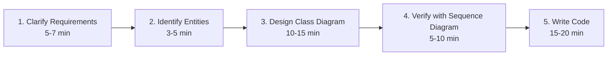

## Welcome to Part 7

Parts 1 through 6 built the technical vocabulary: OOP fundamentals, SOLID, all the major design
patterns, and thread-safety reasoning. None of that matters if the first five minutes of an
interview are spent guessing at a problem's scope instead of understanding it. Part 7 is about
**process** — the repeatable, coachable steps that turn "design a parking lot" from an anxiety-
inducing blank page into a structured, confident walkthrough.

## The Mistake This Chapter Prevents

Chapter 1 already named it: **jumping straight into code before clarifying requirements.** A
candidate who starts typing `class ParkingLot` thirty seconds into the prompt almost always
discovers, ten minutes later, that they've built the wrong thing — forgotten multiple entry gates,
assumed only one vehicle type, missed that payment needs to be modeled at all. Every one of those
discoveries forces a mid-interview redesign, burning time and, often, confidence.

## The Five-Phase Structure

A well-run 45–60 minute LLD interview breaks down roughly like this:

This chapter covers Phase 1 in depth. Phase 2 is Chapter 42. Phase 3 is Chapter 43. Phases 4–5 were
previewed in Chapter 6 and get applied throughout every Part 8 case study.

## Phase 1: Clarify Requirements — The Questions That Actually Matter

The goal of this phase isn't "ask as many questions as possible" — it's extracting the specific
information that will change your design. Four categories cover nearly everything worth asking:

### 1. Functional Scope — What Must the System Actually Do?

> *"Design a parking lot."*

This is deliberately underspecified. Good clarifying questions:
- "Are there multiple vehicle types — cars, motorcycles, trucks — with different spot
  requirements?"
- "Is payment part of this design, or purely the parking/spot-allocation logic?"
- "Should this support multiple entry/exit gates operating concurrently?"

Each answer directly changes your design. "Yes, multiple vehicle types" signals Strategy or
Abstract Factory (Chapters 28, 18) for spot-matching and fee calculation. "Payment is out of
scope" means you can stub it with a simple interface rather than designing a full payment
subsystem. **You are not asking to seem thorough — you're asking because the answer changes what
you build next.**

### 2. Scale and Performance — Does This Change the Design at All?

LLD problems are usually **not** about scale (that's HLD's job, per Chapter 1) — but it's worth a
single confirming question: "Is this a single-process, in-memory design, or do we need to consider
distributed access across multiple servers?" For the overwhelming majority of LLD prompts, the
answer is "single process" — confirming this explicitly lets you stop worrying about
distributed-systems concerns and focus purely on object design.

### 3. Constraints and Edge Cases — What Should Deliberately NOT Happen?

- "What happens if the lot is completely full?"
- "Can a vehicle's fee be modified after it's parked (e.g., a promotional code applied later)?"
- "Should we support reservations in advance, or only walk-in parking?"

These questions often reveal an entire feature area (reservations, promotions) that would otherwise
be silently assumed out of scope — or silently assumed *in* scope, leading to overbuilding.

### 4. Explicitly Confirm What's Out of Scope

This is the step candidates skip most often, and it's arguably the highest-leverage one. Explicitly
say: **"To keep this focused, I'll assume payment processing is a separate, injected interface
rather than a full billing system, and I won't model user authentication — does that match what
you're looking for?"** This does two things: it prevents you from wasting interview time on
tangents the interviewer didn't want, and it demonstrates the exact YAGNI discipline established in
Chapter 12 — deliberately, visibly choosing not to build things nobody asked for.

## What "Good" Looks Like: A Sample Clarification Exchange

> **Interviewer:** "Design a movie ticket booking system."
>
> **You:** "A few quick questions before I start designing. First, should this support selecting
> specific seats, or just booking a general ticket for a showtime? Second, is payment processing
> in scope, or should I treat it as an external dependency? Third, do we need to handle concurrent
> booking attempts for the same seat — like two users trying to book the same seat at the same
> time? And finally, is this single-theater, or multi-theater with multiple showtimes per movie?"

Four questions, each one directly determining a major structural decision (seat-level modeling,
payment interface design, concurrency requirements per Chapter 40's checklist, and the overall
entity hierarchy). This is a stronger opening than either silence-then-coding or an unfocused
stream of a dozen low-value questions.

## Time Budget Discipline

Chapter 6 already established the rough allocation (2 min use-case sketch if needed, 10–15 min
class diagram, 5–10 min sequence diagram, 15–20 min code). The addition here: **cap requirement
clarification at 5–7 minutes.** If clarification is still ongoing past that point, you're either
asking questions that don't actually change your design (stop and just make a reasonable,
explicitly-stated assumption), or the interviewer is deliberately testing how you handle ambiguity
— in which case, state your assumption clearly and move forward rather than waiting indefinitely
for permission.

## Summary

- LLD interviews reward a repeatable five-phase structure: clarify requirements, identify
  entities, design the class diagram, verify with a sequence diagram, then write code.
- Clarifying questions should target four categories: functional scope, scale/performance
  (usually a single confirming question), constraints/edge cases, and — most commonly skipped —
  explicitly confirming what's out of scope.
- Every clarifying question should be one you'd actually build differently based on the answer —
  asking for its own sake wastes time without improving the design.
- Cap requirement clarification at 5–7 minutes; past that, state a reasonable assumption explicitly
  and move forward rather than stalling.

---

## Interview Questions

**1. Why does jumping straight into coding, without clarifying requirements first, typically lead
to a worse outcome than spending the first several minutes asking questions?**
An underspecified prompt like "design a parking lot" hides many implicit decisions (number of
vehicle types, whether payment is in scope, concurrency requirements) that materially change the
resulting class structure — a candidate who starts coding immediately is forced to guess at these
decisions, and discovering a wrong guess partway through (e.g., realizing multiple vehicle types
need to be supported after already writing a single-type `ParkingSpot` class) usually requires
a disruptive, time-costly redesign mid-interview, which is both slower overall and creates a worse
impression than a brief, focused upfront clarification phase would have.
*Follow-up: Is there ever a legitimate reason to skip clarification and start coding
immediately?* For a genuinely simple, fully-specified problem with no meaningful ambiguity (rare
in practice, but possible for very narrow, precisely-worded prompts), extensive clarification could
be unnecessary overhead — but even then, a brief confirmation of scope ("just to confirm, this is
purely the class design, payment is out of scope, correct?") costs almost nothing and protects
against a wrong assumption, making it a low-risk habit worth maintaining by default rather than
selectively skipping based on a guess about the problem's apparent simplicity.

**2. Describe the five-phase structure for a typical LLD interview, and explain why the phases
are ordered the way they are.**
The five phases are: clarify requirements, identify entities, design the class diagram, verify with
a sequence diagram, then write code. They're ordered this way because each phase depends on the
output of the previous one — you can't correctly identify entities without first knowing the
actual scope (phase 1); you can't design a class diagram without knowing what the entities are
(phase 2); a sequence diagram is most useful for verifying a class diagram already exists to check
against (phase 3 before phase 4); and writing code without a verified design risks writing
incorrect or incomplete code that needs significant rework (phase 4 before phase 5) — each phase
is a prerequisite input for the one that follows.
*Follow-up: Could a candidate skip the sequence-diagram verification phase (phase 4) entirely and
still succeed in a typical interview?* For a simple enough problem, skipping phase 4 might not
cause any visible harm — but for problems with any non-trivial interaction between multiple
classes (the exact kind of problem most LLD interviews present), skipping this verification step
risks writing code that compiles and looks reasonable in isolation but has a subtle structural gap
(as Chapter 6 discussed — no object is clearly responsible for some specific piece of coordination)
that only becomes apparent once you try to trace through a specific end-to-end scenario; skipping
this step is a real risk, not a safe shortcut, for any problem beyond the simplest.

**3. What are the four categories of clarifying questions this chapter identifies, and give one
original example question (not used in the chapter) for each.**
The four categories are: functional scope (what must the system actually do — example: "should
this support recurring/subscription-based parking, or only pay-per-use?"), scale/performance
(whether scale considerations affect the LLD-level design at all — example: "is this meant to
handle a single building's parking, or would this same design need to scale to a nationwide chain
of parking lots?"), constraints/edge cases (what should deliberately not happen, or what unusual
situations need explicit handling — example: "what should happen if a vehicle stays parked well
beyond any reasonable duration — is there a maximum stay policy?"), and explicitly confirming
out-of-scope items (example: "I'll assume we don't need to model physical barrier/gate hardware
integration — just the software logic deciding whether to let a vehicle in — is that a fair
assumption?").
*Follow-up: Which of these four categories do you think is most commonly skipped by candidates,
and why might that be?* The chapter specifically identifies "explicitly confirming what's out of
scope" as the most commonly skipped category — likely because it can feel presumptuous or
unnecessary to a candidate ("why would I need to say what I'm *not* doing?"), when in fact it's
one of the highest-leverage steps precisely because it prevents both wasted effort on tangents and
demonstrates deliberate scope discipline (per YAGNI, Chapter 12) rather than leaving scope boundaries
implicit and potentially mismatched with the interviewer's actual expectations.

**4. Why does this chapter recommend treating "is this single-process or distributed?" as usually
just one confirming question, rather than an extensive area of clarification, for most LLD
problems?**
Because LLD interviews are specifically about class-level design within a single process or
application — distributed-systems concerns (multiple servers, network partitions, data
replication across machines) are the domain of HLD interviews (as established in Chapter 1), and
the overwhelming majority of LLD prompts implicitly assume a single-process, in-memory context.
Asking one brief confirming question settles this assumption explicitly and quickly, rather than
spending disproportionate clarification time on a dimension that, for the vast majority of LLD
problems, has an obvious, expected answer.
*Follow-up: If an interviewer responded "yes, actually, we do need to consider this design
running across multiple server instances," how would this materially change your approach for the
remainder of the interview?* This would be a significant, scope-changing answer — it would
introduce concerns typically reserved for HLD (like ensuring a Singleton-style
`ParkingLotManager` correctly behaves when multiple separate server instances each have their own
copy of it, or needing some form of distributed locking/coordination rather than a simple in-process
`ReentrantReadWriteLock` from Chapter 40) — at that point, you'd want to explicitly clarify with the
interviewer whether they want you to address this distributed dimension in depth (blending LLD and
HLD concerns) or whether they simply want you to note the added complexity and continue focusing
primarily on the single-instance class design, since fully addressing distributed coordination
correctly is a substantially larger scope than a typical LLD interview's time allows.

**5. Give an example of a clarifying question that would be a poor use of interview time (because
the answer likely wouldn't change your design), and contrast it with a strong clarifying question
for the same "design a parking lot" prompt.**
A poor question: "What programming language should the parking gate hardware's firmware be written
in?" — this is almost certainly irrelevant to an LLD class-design interview and wouldn't change
anything about the class structure you're about to design, regardless of the answer. A strong
question for the same prompt: "Should the parking fee structure support different rates for
different vehicle types, or is it a flat rate regardless of vehicle type?" — this directly
determines whether you need a `FeeStrategy`-style interface (Chapter 28) with multiple
implementations, or whether a single, simple fee calculation suffices, materially changing your
design either way.
*Follow-up: How would you personally decide, in real time during an interview, whether a
question you're about to ask is a "strong" or "poor" one, using the test this chapter implies?*
Apply the test implicitly established throughout this chapter: "if I imagine both possible answers
to this question, would I actually design something meaningfully different for each answer?" — if
both possible answers would lead you to build essentially the same classes and structure regardless,
the question isn't worth spending interview time on; if the two possible answers would clearly lead
to different structural decisions, it's a question worth asking.

**6. Walk through why explicitly stating "I'll assume X is out of scope, does that sound right?"
is described as demonstrating "YAGNI discipline," connecting back to Chapter 12.**
Chapter 12 established YAGNI as the discipline of not building speculative functionality beyond
what's actually needed or requested. Explicitly and proactively naming something as out of scope
(rather than silently either building it anyway "just in case" or silently omitting it without
comment) visibly demonstrates that you're making a deliberate, conscious scoping decision rather
than either over-building unrequested functionality or accidentally under-building something the
interviewer actually expected — it turns an implicit assumption into an explicit, confirmable
agreement, which is the live, verbal equivalent of the written-code discipline YAGNI describes.
*Follow-up: What's the risk of silently assuming something is out of scope without stating it
explicitly to the interviewer, even if your assumption turns out to be correct?* Even a correct
silent assumption risks the interviewer not knowing *that* you made a deliberate choice at all —
they might interpret the absence of, say, a payment subsystem as an oversight or a gap in your
design rather than a deliberate, reasoned scoping decision, potentially costing you credit for
judgment you actually exercised but never communicated; stating assumptions explicitly converts
invisible judgment into visible, creditable judgment.

**7. How would you handle a scenario where, after your clarification questions, the interviewer
responds vaguely or says "just use your best judgment" rather than giving a specific answer?**
Treat this as an explicit invitation to state and proceed with a specific, reasonable assumption
rather than continuing to probe for a more precise answer — say something like "Okay, I'll assume
we need to support multiple vehicle types with different fee structures, since that's a common,
realistic requirement for this kind of system, and I'll design with that in mind" and then move
forward into the next phase. This respects the interviewer's signal that further clarification on
this specific point isn't productive, while still explicitly naming your assumption so it remains a
visible, statable part of your design reasoning rather than an unstated guess.
*Follow-up: Does receiving this kind of vague response from an interviewer suggest anything about
what they're specifically trying to evaluate?* It often suggests the interviewer is deliberately
testing your ability to make and clearly communicate reasonable decisions under genuine ambiguity —
a skill directly relevant to real engineering work, where complete requirements are rarely handed
down perfectly specified — rather than testing whether you can extract one particular "correct"
requirement from them; responding with a clearly-reasoned, explicitly-stated default assumption is
generally a stronger response to this signal than continuing to press for more specificity.

**8. Is it possible to ask too many clarifying questions, and if so, what's the downside beyond
simply consuming time?**
Yes — beyond the direct cost of consuming limited interview time (this chapter's 5–7 minute
budget), asking an excessive number of low-value questions can signal indecisiveness or an
inability to make reasonable judgment calls independently, which is itself a negative signal in an
interview context that's partly evaluating whether you can operate effectively with realistic,
incomplete information (mirroring real engineering work, as noted in the previous question) — a
candidate perceived as needing every conceivable detail specified before being willing to proceed
may raise doubts about their ability to work independently and make sound default decisions when
complete information isn't available.
*Follow-up: How would you course-correct if you noticed, partway through asking questions, that
you'd already asked several and the interviewer seemed eager to move forward?* Explicitly
acknowledge the transition and wrap up: "I think I have enough to get started — I'll assume [state
any remaining open assumptions concisely] and begin designing, and I can revisit if any of these
assumptions turn out to be wrong," then proceed directly into the next phase, converting any
remaining minor uncertainties into stated assumptions rather than continuing to ask about them.

**9. In the sample clarification exchange for the movie ticket booking system, one question asks
about handling "concurrent booking attempts for the same seat." Why is this specific question
particularly valuable to ask upfront, rather than discovering the need for it later during
coding?**
This question directly determines whether the design needs Chapter 40's thread-safety
considerations built in from the start (an atomic "check seat availability and reserve it"
operation, similar to the `findAndReserveSpot()` example) — if this concern is discovered only
after the class diagram and initial code are already written without it in mind, retrofitting
proper atomicity into an already-designed set of classes can require significant restructuring
(similar to how Chapter 40 discussed the specific atomicity requirements of a combined check-and-
reserve operation), whereas knowing this requirement upfront lets you design the relevant methods
and locking strategy correctly from the very first draft of the class diagram.
*Follow-up: If the interviewer answered "no, let's not worry about concurrency for this
exercise," how would this materially simplify the rest of your design process?* You could design
`Seat`/`Booking`-related classes and methods without needing to reason about atomicity or thread
safety at all — methods like "check availability" and "reserve seat" could remain separate,
straightforward operations without the combined, single-locked operation Chapter 40 discussed being
necessary, meaningfully simplifying both the class design and the amount of interview time spent
reasoning about correctness under concurrent access, freeing that time for other aspects of the
design instead.

**10. How would you apply this chapter's four-category clarification framework to a
"design a vending machine" problem, generating one meaningful question per category?**
Functional scope: "Should this support multiple payment methods (cash, card), or just one?"
Scale/performance: "Is this a single vending machine's software, or do we need to consider a fleet
of machines being centrally managed/monitored?" Constraints/edge cases: "What should happen if a
selected item is out of stock, or if a user inserts more money than the item costs — do we need to
handle giving change?" Out-of-scope confirmation: "I'll assume we don't need to model the physical
mechanics of dispensing an item (motors, sensors) — just the software logic determining what should
be dispensed and tracking inventory/payment — does that match what you're looking for?"
*Follow-up: Which of these four questions do you expect would most significantly change the
resulting class diagram's structure, and why?* The functional-scope question about multiple
payment methods is likely the most structurally significant — a "yes" answer strongly signals
needing a `PaymentMethod` interface with multiple implementations (Strategy, Chapter 28), directly
shaping a core part of the class diagram, while a "no, cash only" answer would let you design a much
simpler, single-path payment-handling mechanism with no need for that abstraction at all — a clear
example of a question whose answer meaningfully changes the actual class structure you'd go on to
design.

**11. Does explicitly discussing scope and assumptions with the interviewer risk making you
appear less confident or less capable of independent design, compared to a candidate who simply
starts designing immediately?**
Generally, no — when done well (concise, targeted questions followed by a clear transition into
designing), this process demonstrates structured, professional thinking and mirrors how experienced
engineers actually approach ambiguous real-world requirements, which is typically viewed as a
positive signal of maturity and process discipline, not a lack of confidence; the risk of appearing
less capable arises specifically from *excessive*, unfocused, or seemingly-stalling questioning (as
discussed in Question 8), not from the practice of clarification itself when it's kept appropriately
brief, targeted, and clearly leads into decisive forward progress.
*Follow-up: How would you specifically communicate confidence while still asking clarifying
questions, in terms of tone and phrasing?* Frame questions assertively and purposefully rather than
tentatively — "Before I design this, I want to confirm a few things that will shape the structure:
[specific questions]" communicates clear intent and process, versus a more hesitant framing like "Um,
I'm not sure, but should I maybe ask about...?" — the content of good clarifying questions paired
with a direct, purposeful tone conveys confidence, while the same questions asked hesitantly or
apologetically could undermine that impression even though the underlying process is identical.

**12. How would you handle a scenario where, partway through the class-diagram design phase
(after clarification is already complete), you realize you need to ask one more clarifying
question that you missed earlier?**
Ask it directly and briefly, without excessive apology or disruption: "Actually, one more question
before I continue — does a single parking spot need to support multiple vehicle sizes, or is each
spot dedicated to exactly one size category?" — treating mid-design clarification as a normal,
expected part of the process rather than a mistake requiring extensive justification; real design
work often surfaces new questions only once you're deep enough into the structure to notice a gap,
and handling this gracefully and efficiently is itself a positive signal, rather than something to
be defensive or overly apologetic about.
*Follow-up: Is there a risk that asking too many "just one more question" interruptions during
the design phase itself could resemble the same "excessive questioning" concern raised earlier for
the initial clarification phase?* Yes, potentially — if this pattern repeats many times throughout
the design phase, it could suggest the initial clarification phase wasn't thorough enough, or that
you're not making enough reasonable assumptions independently as new sub-decisions arise during
design; the goal is to reserve mid-design clarifying questions for genuinely important, structurally
significant gaps that a reasonable, well-prepared candidate might legitimately not have anticipated
during the initial round, not as a substitute for exercising judgment on smaller decisions that
could reasonably be assumed and stated rather than asked about.

**13. This chapter states clarification should be capped at "5-7 minutes." How would you handle a
situation where you've reached this time budget but still feel genuinely uncertain about an
important aspect of the problem's scope?**
State your remaining uncertainty explicitly as an assumption and move forward, rather than
continuing to seek clarification indefinitely: "I'm going to assume [specific, reasonable
assumption] for now, given time — if that turns out to be wrong, I can adjust the design as we go,"
then proceed into entity identification and class design. This respects the interview's overall time
budget (leaving adequate time for the design and coding phases, which are often weighted more
heavily, as discussed in Chapter 6) while still explicitly flagging the assumption's uncertainty,
leaving the door open to revisit it if the interviewer corrects it later.
*Follow-up: Is capping clarification time a hard, rigid rule, or should it be applied with some
flexibility depending on the specific problem?* It should be applied with reasonable flexibility
— the 5-7 minute figure is a practical guideline reflecting typical LLD interview time budgets, not
an inflexible rule; a genuinely more complex or ambiguous problem might reasonably warrant a bit
more clarification time, while a simpler, more clearly-specified problem might need considerably
less — the underlying principle (don't let clarification consume a disproportionate share of the
available interview time relative to designing and coding) matters more than strict adherence to
any specific minute count.

**14. Summarize why this chapter frames requirement clarification as a skill in its own right,
deserving its own dedicated chapter, rather than treating it as an obvious, minor preliminary step
before the "real" work of designing classes begins.**
Requirement clarification directly determines the correctness and appropriateness of everything
that follows — every subsequent phase (entity identification, class design, code) builds on
whatever scope and assumptions were established during this phase, meaning errors or omissions here
propagate and compound throughout the rest of the interview, often only becoming visible (and
costly to fix) much later. Treating it as a genuine, practiced skill (with specific question
categories, a test for question quality, and explicit time budgeting) rather than an obvious
formality reflects the reality that many candidates who are technically strong at the patterns and
principles covered in Parts 1 through 6 still perform poorly in interviews specifically because they
skip or rush this phase, building confidently on a wrong or incomplete understanding of the actual
problem.
*Follow-up: Having now covered this first phase in depth, what does the next chapter (Chapter 42,
on extracting entities from a problem statement) build on top of this chapter's output, and why is
this the natural next step?* Chapter 42 takes the now-clarified, appropriately-scoped problem
statement (the direct output of this chapter's process) and focuses on the next concrete skill:
systematically identifying which nouns in that clarified problem statement deserve to become
classes, and which represent mere attributes — this is the natural next step because entity
identification is meaningless without first knowing the correct, clarified scope this chapter's
process establishes; attempting to identify entities from an unclarified, ambiguous problem
statement risks building an entity list around a wrong or incomplete understanding of what the
system actually needs to do.
