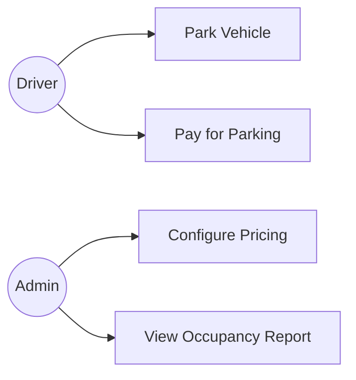
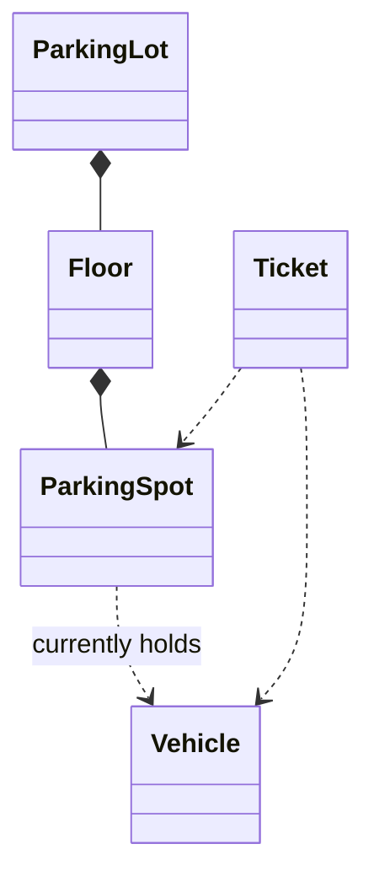

## Where This Fits

Chapter 41 produced a clarified, scoped problem statement. This chapter's job is narrow and
mechanical on purpose: **turn that paragraph of English into a concrete list of classes** before
drawing a single box on a class diagram. Skipping this step is exactly what leads to the
"designed one class in isolation, realized it needs three others it doesn't reference" trap flagged
back in Chapter 1.

## Step 1: Identify the Actors

**Actors** are the humans or external systems that interact with what you're building — they are
almost never classes in your design themselves, but they define the **use cases** you need to
support.

> *"Design a parking lot where drivers can park their vehicles, pay for parking, and an admin can
> configure pricing and view occupancy reports."*

Actors here: **Driver**, **Admin**. Neither typically becomes a class in the LLD sense (you're not
usually modeling a `Driver` object with `walk()` or `think()` methods) — they're the source of the
use cases that follow.

## Step 2: List the Use Cases, One Verb Phrase Each

For each actor, list what they can *do* — a short verb phrase, not an implementation detail:

- Driver: park a vehicle, pay for parking, retrieve a lost ticket
- Admin: add a parking floor, set pricing rules, view occupancy report

This is the use-case diagram from Chapter 6, used exactly as intended: a **fast confirmation of
scope**, not a design artifact you'll refine further. If a use case appears here that wasn't
covered in Chapter 41's clarification, that's a signal to go back and ask about it before
proceeding.

## Step 3: The Noun Extraction Technique

Read back through the clarified problem statement (plus your own notes from the use cases) and
**underline every noun**. Every noun is a *candidate* — not automatically a class. This is the
mechanical starting point:

> "A **driver** parks a **vehicle** in a **spot** on a **floor** of the **parking lot**, receives
> a **ticket**, and pays a **fee** based on the **duration** and **vehicle type** at an **exit
> gate**."

Candidates: driver, vehicle, spot, floor, parking lot, ticket, fee, duration, vehicle type, exit
gate.

## Step 4: The Entity-vs-Attribute Test

Chapter 1 previewed this test; here's how to apply it systematically to every noun candidate:

> **Does this noun have its own identity or independent behavior that other objects need to
> reference — or is it just a descriptive value attached to something else?**

| Noun | Entity or Attribute? | Reasoning |
|---|---|---|
| Vehicle | **Entity** | Has identity (license plate), referenced by `Ticket`, `ParkingSpot` |
| Spot | **Entity** | Has identity, state (occupied/free), referenced by `Floor` |
| Floor | **Entity** | Contains spots, has its own identity within the lot |
| Parking Lot | **Entity** | The top-level coordinating object |
| Ticket | **Entity** | Has identity, referenced after issuance for payment/exit |
| Fee | **Attribute** | A computed number — belongs on `Ticket`, not its own class |
| Duration | **Attribute** | Derived from entry/exit timestamps — not independently referenced |
| Vehicle Type | **Attribute** (or enum) | A classification value on `Vehicle` |
| Driver | Excluded (actor) | Out of scope unless the problem explicitly needs driver accounts |
| Exit Gate | **Entity** | Has its own behavior (processing exit, calculating fee) |

**A vehicle type is a good example of the gray area**: it could be a simple `enum` field on
`Vehicle`, or — if fee calculation and spot-matching genuinely vary by type in complex,
type-specific ways — it could justify its own small class hierarchy. **When genuinely unsure,
start as an attribute (usually an enum) and promote to a full entity only if behavior
accumulates around it that doesn't belong anywhere else.** Starting simple and refactoring up is
lower-risk than starting complex and never using the extra structure.

## Step 5: Identify Relationships Using Chapter 4's Vocabulary

Once entities are listed, apply Chapter 4's association/aggregation/composition framework to each
pair that interacts:

- `ParkingLot` **composes** `Floor` (floors don't exist independently of the lot).
- `Floor` **composes** `ParkingSpot` (spots don't exist independently of the floor).
- `ParkingSpot` **associates with** `Vehicle` (a temporary reference while occupied — vehicles
  exist independently).
- `Ticket` **associates with** `Vehicle` and `ParkingSpot` (references both, owns neither).

This diagram — produced entirely from Steps 1–5, **before** thinking about a single method
signature — is the direct input to Chapter 43's class diagram construction process.

## A Common Trap: Over-Extracting Entities From Adjectives and Verbs

Not every capitalized-sounding concept is a noun worth promoting. "Occupied" is an adjective
describing a spot's state, not an entity. "Parking" (the verb, as in "parking a vehicle") is an
action, likely a method (`ParkingLot.parkVehicle()`), not a class. **Extract nouns specifically —
verbs typically become methods, adjectives typically become fields or enum values.**

## Summary

- Identify actors first (the humans/systems interacting with the system) — they generate use
  cases but are rarely classes themselves.
- List use cases as short verb phrases per actor; a quick use-case diagram confirms this matches
  Chapter 41's clarified scope.
- Extract every noun from the problem statement as a candidate entity, then apply the test "does
  this have its own identity/behavior other objects reference, or is it just a descriptive value?"
  to sort entities from attributes.
- When genuinely uncertain whether something is an attribute or its own entity, start simple
  (an attribute or enum) — promoting later is lower-risk than over-structuring upfront.
- Map relationships between confirmed entities using Chapter 4's association/aggregation/
  composition vocabulary before drawing a single class diagram box.

---

## Interview Questions

**1. What is an "actor" in this context, and why does this chapter emphasize that actors "rarely
become classes" in the resulting LLD design?**
An actor is a human user or external system that interacts with the system being designed — in the
parking lot example, the Driver and the Admin. Actors rarely become classes in the LLD sense because
LLD is concerned with modeling the *system's own internal* structure and behavior, not the external
parties interacting with it — you're not typically modeling a `Driver` class with methods like
`walk()` or `decide()`; instead, the actor's existence is used purely to derive the *use cases*
(what the system must support), which then drive which entities and behaviors actually need to be
modeled within the system itself.
*Follow-up: Are there scenarios where an actor genuinely does need to become a class in an LLD
design?* Yes — if the problem explicitly requires modeling user accounts, authentication, or
actor-specific data the system itself needs to track and persist (e.g., "each driver has a loyalty
points balance the system must track"), then a `Driver` (or `User`, `Customer`) class representing
that actor's system-relevant data becomes a legitimate entity — the distinction is whether the
actor's *data or identity within the system* needs to be modeled, versus the actor simply being the
external trigger for a use case with no system-internal representation needed.

**2. Walk through the noun-extraction technique described in this chapter, and explain why it's
described as a "mechanical starting point" rather than a final, authoritative list of entities.**
The technique involves reading through the clarified problem statement and identifying every noun
present as a candidate for becoming an entity — a purely mechanical, low-judgment first pass meant
to ensure no potential entity is overlooked simply because it wasn't top-of-mind. It's explicitly
described as a starting point, not a final list, because not every noun deserves to become its own
class — some nouns (like "fee" or "duration" in the parking lot example) are better modeled as
attributes on another entity rather than being promoted to standalone classes; the mechanical
extraction step's job is simply to generate a complete candidate list, with the subsequent
entity-vs-attribute test (Step 4) doing the actual judgment-based filtering.
*Follow-up: What's the risk of skipping the noun-extraction step and instead trying to identify
entities purely by intuition or memory of similar past problems?* Skipping this systematic step
risks overlooking a genuine entity simply because it wasn't immediately obvious or memorable —
relying purely on intuition or pattern-matching to previously-seen similar problems can cause a
candidate to import an entity structure that doesn't actually match the specific, clarified
requirements of the current problem, or to miss a requirement-specific entity (like "Exit Gate" in
the parking lot example) that a generic mental template for "parking lot problems" might not have
included by default.

**3. State the entity-vs-attribute test from this chapter precisely, and apply it to a noun not
used in the chapter's own example — "email address" in the context of a user registration system.**
The test: "Does this noun have its own identity or independent behavior that other objects need to
reference, or is it just a descriptive value attached to something else?" Applying this to "email
address" in a user registration system: an email address typically has no independent identity or
behavior of its own that other objects would need to reference separately from the `User` it
belongs to — it's a descriptive value (a `String` field, likely with validation logic) attached to
a `User` entity, making it an attribute, not its own entity.
*Follow-up: Can you construct a scenario, even involving the same "email address" concept, where
it would actually be more appropriate to model it as its own entity rather than a simple
attribute?* If the system needed to support a user having *multiple* email addresses (a primary
and several secondary addresses, each with its own verification status, added/removed
independently over time, and referenced elsewhere — like "which email address received this
notification"), promoting "email address" to its own `EmailAddress` entity (with its own identity,
verification state, and a one-to-many relationship to `User`) would become appropriate — this
illustrates that the same real-world concept's correct classification as entity-versus-attribute
depends entirely on the specific requirements and behaviors the problem actually calls for, not on
some fixed, universal property of the concept itself.

**4. Why does this chapter recommend defaulting to treating an ambiguous concept (like "vehicle
type") as a simple attribute or enum first, rather than immediately building a full class
hierarchy for it?**
This reflects the same KISS/YAGNI discipline established in Chapter 12 — starting with the
simpler representation (an enum field on `Vehicle`) and only promoting it to a full class
hierarchy if and when actual behavior genuinely accumulates around it that doesn't belong
elsewhere (like type-specific fee calculation logic that would otherwise require awkward
conditional branching) is lower-risk than preemptively building a full class hierarchy for a
concept that might never actually need that level of structure — starting simple and refactoring
toward more structure as genuine need emerges is generally safer and more time-efficient in an
interview than starting with unnecessary structure that goes unused.
*Follow-up: What specific signal, encountered later during class design (Chapter 43), would tell
you it's time to promote "vehicle type" from a simple enum into its own class hierarchy?* The
clearest signal is discovering that you need type-specific *behavior* — not just a different label
or value, but actual differing logic — associated with vehicle type, such as different fee
calculation formulas or different spot-size matching rules per type; if you find yourself writing
`if (vehicleType == CAR) { ... } else if (vehicleType == MOTORCYCLE) { ... }`-style conditionals
scattered through your code (the OCP violation pattern from Chapter 8), that's the concrete signal
that the simple enum representation should be promoted into a `VehicleType`-driven Strategy
(Chapter 28) or class hierarchy instead.

**5. How would you apply the association/aggregation/composition relationship-mapping step
(Step 5) to a "library management system," identifying at least two composition relationships and
one association relationship?**
Composition relationships: `Library` composes `BookCopy` (physical copies are created and managed
entirely within the library's own inventory, with no independent existence outside it — mirroring
the `Library`/`BookCopy` composition example from Chapter 4), and `Library` composes `Branch` (if
the library has multiple physical branches, each branch's existence is tied to the overall library
system, similar to how `ParkingLot` composes `Floor`). An association relationship: `BookCopy`
associates with `Member` when checked out (a temporary reference — a `Member`'s existence and
identity are entirely independent of any specific book checkout, exactly mirroring the
`ParkingSpot`/`Vehicle` association from this chapter's own parking lot example).
*Follow-up: Would `Library` and `Member` more likely be an aggregation or composition
relationship, and why?* This would more likely be aggregation — a `Member`'s existence (as a
person with a library membership) is not strictly bound to any single `Library` instance's
lifecycle; a member could transfer between library branches, or their membership record could
persist independently even if a specific branch closed, meaning `Member` objects should be able to
outlive or exist independently of the specific `Library` object that currently claims them, which
is exactly the "weak ownership, can outlive the whole" definition of aggregation from Chapter 4.

**6. Explain why "parking" (as in the phrase "parking a vehicle") is identified in this chapter as
a likely method rather than a noun/entity candidate, and give a general rule for distinguishing
this kind of case during noun extraction.**
"Parking" here functions as a verb describing an action performed on the system (a vehicle is
parked), not a standalone thing with its own identity or state that other objects would need to
reference — it naturally maps onto a method like `ParkingLot.parkVehicle(vehicle)`, representing
the *action* rather than a *thing*. The general rule this chapter establishes: extract nouns
specifically as entity/attribute candidates; verbs (actions, like "parking," "paying," "issuing")
typically become methods on whichever entity is responsible for that action, and adjectives (like
"occupied") typically become field values or enum states rather than separate classes.
*Follow-up: Could a verb ever legitimately need to become its own class, rather than simply a
method, and if so, under what circumstance?* Yes — if the *action itself* needs to be treated as a
storable, queueable, or undoable object (per the Command pattern from Chapter 30), a verb like
"parking" could legitimately become a `ParkVehicleCommand` class rather than remaining a simple
method call — this would be an appropriate promotion specifically if the problem's clarified
requirements (from Chapter 41) signaled a need for that kind of action-as-data treatment (like
supporting undo of a parking action, or queuing parking requests for asynchronous processing), not
a default expectation for every verb encountered during ordinary noun extraction.

**7. In the parking lot example, why is "Fee" classified as an attribute belonging on `Ticket`
rather than its own entity, while "Ticket" itself is classified as a full entity?**
"Fee" is a single, computed numeric value with no independent identity or behavior of its own
beyond being a piece of data associated with a specific ticket — it doesn't need to be referenced
independently from the `Ticket` it belongs to, and nothing else in the system would need a direct
reference to "the fee" separate from "the ticket that has this fee." "Ticket," by contrast, has
its own identity (a ticket ID), is referenced independently by multiple parts of the system (used
at the exit gate to calculate and display the fee, potentially looked up later for record-keeping
or dispute resolution), and its existence and lifecycle are meaningful and trackable independently
of any single interaction — exactly the "has its own identity, referenced by other objects"
criterion this chapter's test establishes for entity status.
*Follow-up: If the system needed to support itemized fees (a base parking fee, plus a separate
late-fee surcharge, plus a separate promotional discount, each needing to be displayed and
potentially disputed individually), would this change whether "Fee" should be modeled as its own
entity?* Potentially yes — if fees genuinely need to be itemized, individually referenced,
tracked, and potentially disputed or adjusted independently (each with its own identity, like a
`FeeLineItem` with its own ID, description, and amount, associated with a `Ticket`), this would be
a legitimate signal to promote "Fee" from a simple attribute into its own entity — directly
illustrating the same "promote from attribute to entity only when genuine independent identity/
behavior emerges" principle discussed for "vehicle type" earlier in this chapter, now applied to a
different concept.

**8. How would you use the use-case diagram (Step 2) to catch a scope mismatch between what was
clarified in Chapter 41's process and what the noun-extraction process in this chapter later
reveals?**
If, while drawing the use-case diagram, you find yourself needing to include a use case that wasn't
explicitly discussed during the Chapter 41 clarification phase (for example, realizing "retrieve a
lost ticket" is a genuinely necessary use case the problem statement implies, but which wasn't
explicitly asked about or confirmed earlier), this is a concrete signal to go back and briefly
clarify this specific point with the interviewer before proceeding further — rather than silently
assuming an answer or silently omitting the use case, both of which risk building a mismatched
design relative to the interviewer's actual expectations.
*Follow-up: Is discovering a gap like this during the use-case-diagramming step a sign that the
initial clarification phase (Chapter 41) was done poorly, or is this a normal, expected part of the
overall process?* This is a normal, expected part of the process, not necessarily a sign of a
poorly-executed clarification phase — some use cases only become apparent once you're actively
working through the problem's structure in more detail (exactly as this chapter's own five-step
process is designed to progressively surface), and briefly returning to clarify a newly-discovered
gap is a sign of a thorough, iterative process working as intended, not a failure of the earlier
phase; the goal of Chapter 41's process was never to achieve perfect, complete clarity in one pass,
but to establish a strong enough initial understanding to proceed productively, with room for
targeted follow-up as genuinely new questions arise.

**9. Why does this chapter present the relationship-mapping step (Step 5) as coming after entity
identification (Steps 3-4), rather than identifying entities and their relationships
simultaneously in a single pass?**
Attempting to identify entities and map their relationships simultaneously risks conflating two
distinct judgment calls — "is this concept significant enough to be its own class?" and "how does
this class relate to that other class?" — before either judgment has a stable, settled starting
point; separating the steps means the relationship-mapping step (Step 5) operates on an
already-confirmed, settled list of entities, making the resulting relationship decisions more
reliable and less likely to require revision if an earlier entity-versus-attribute classification
turns out to need reconsidering partway through relationship-mapping.
*Follow-up: If, while mapping relationships in Step 5, you realize that two "entities" from Step
4 are actually so tightly coupled that they should really be merged into one class, what would you
do?* Go back and revise the Step 4 entity list accordingly — the process outlined in this chapter
is a helpful, structured default sequence, not a rigid, one-way pipeline that can never be
revisited; discovering during relationship-mapping that two supposed entities have no meaningful
independent existence or behavior from each other (perhaps one was over-extracted from the noun
list without genuinely warranting separate-entity status) is valuable, legitimate feedback that
should prompt revising the earlier step's conclusion, rather than forcing an artificial, unnecessary
relationship between two classes that should really be one.

**10. How would you apply this entire five-step extraction process (actors, use cases, noun
extraction, entity-vs-attribute test, relationship mapping) to the beginning of a "design a
vending machine" problem, producing a brief entity list and one relationship?**
Actors: Customer, Admin/Technician (restocking). Use cases: Customer — select an item, insert
payment, receive item and change; Admin — restock inventory, collect cash, view sales report.
Noun extraction from a clarified problem statement (e.g., "a customer selects an item from a slot,
inserts cash or a card, and the machine dispenses the item and any change due"): item, slot, cash,
card, machine, change. Entity-vs-attribute test: `Item` (entity — has identity like name/price,
referenced by `Slot`), `Slot` (entity — has identity/position, tracks its own quantity of a given
item), `VendingMachine` (entity — the top-level coordinator), `PaymentMethod` (likely an interface
with `Cash`/`Card` implementations per Strategy, Chapter 28, given multiple payment types), "change"
(attribute — a computed value, not independently referenced). Relationship: `VendingMachine`
composes `Slot` (slots don't exist independently of the specific machine they're part of).
*Follow-up: Would "Change" ever be promoted to its own entity, similar to the earlier discussion
of "Fee," and under what circumstance?* Similar reasoning applies — if the system needed to track
individual denominations of change dispensed (for cash-inventory-management purposes, like knowing
exactly how many quarters remain in the machine's change dispenser), "Change" might be
better modeled as a more detailed `ChangeCalculation` or `CashInventory`-related entity with its
own identity and behavior (tracking denomination counts, detecting when the machine is low on
specific coin types) — again illustrating that the correct classification depends entirely on
what specific behaviors and independent-reference needs the clarified requirements actually call
for, not a fixed, universal answer for the concept "change" in the abstract.

**11. Is it possible for the same real-world noun to appear twice in a single problem statement
with two different meanings, requiring two different entities — and if so, how would you handle
this during noun extraction?**
Yes — for example, in a movie ticket booking problem, "seat" might refer both to a specific
physical seat location in a specific theater (a `Seat` entity with a fixed row/column position
tied to one `Theater`) and, separately, to a specific customer's booked seat for a specific
showtime (a `BookedSeat` or `Reservation` entity, tracking which specific `Seat` a specific
`Customer` holds for a specific `Showtime`) — these are related but distinct concepts sharing the
same everyday word "seat." Handling this requires reading the noun in its specific context each
time it appears in the problem statement, rather than assuming every occurrence of the same word
refers to the exact same entity, and giving each distinct concept its own clearly-differentiated
name in your design (`Seat` versus `SeatBooking`, for example) to avoid confusion later.
*Follow-up: How would you communicate this distinction clearly to an interviewer while narrating
your design process, to avoid confusion about which "seat" concept you're referring to at any
given moment?* Explicitly name and distinguish the two concepts as soon as you notice the
ambiguity: "I'm going to use `Seat` to mean the fixed, physical seat location in the theater, and
introduce a separate `Booking` (or `SeatBooking`) class to represent a specific customer's
reservation of that seat for a specific showtime — this way `Seat` itself doesn't need to change
even as bookings for it come and go across different showtimes," making the distinction an
explicit, narrated part of your design reasoning rather than leaving it as an implicit, potentially
confusing assumption.

**12. This chapter's process treats identifying entities and mapping relationships as happening
entirely before drawing a formal class diagram (which Chapter 43 covers). Why not simply start
drawing the class diagram directly and let entities and relationships emerge naturally as you go?**
Separating this extraction process from the act of drawing a formal class diagram allows you to
focus purely on *what exists and how it relates* without simultaneously needing to decide *class
syntax details* (field types, method signatures, access modifiers) — conflating these two concerns
from the very start risks getting bogged down in premature implementation detail (like deciding
`ParkingSpot`'s exact field types) before even confirming the more fundamental question of whether
`ParkingSpot` should be its own entity at all, or whether some other entity was missed entirely;
this chapter's process deliberately defers those more detailed, syntax-level decisions to Chapter
43, once the foundational entity-and-relationship structure is already confirmed and stable.
*Follow-up: For a very simple, small problem, would this separation still be worth maintaining as
two distinct steps, or could an experienced candidate reasonably combine them?* For a very simple,
small problem with an obviously small number of entities and relationships, an experienced
candidate could reasonably move through this extraction process quickly and somewhat informally,
effectively compressing it into the early minutes of drawing the class diagram directly — but even
then, briefly and explicitly working through the actors/use-cases/nouns/entities sequence, even
informally and quickly, helps ensure nothing significant is accidentally overlooked, which remains
valuable insurance even for problems that seem simple at first glance, since apparent simplicity
can sometimes hide an overlooked entity or relationship that only becomes obvious once explicitly
checked for.

**13. How would you know, during this extraction process, that you've likely identified enough
entities to proceed confidently into Chapter 43's class-diagram design phase, rather than
continuing to search for more?**
A reasonable confidence signal is that every use case identified in Step 2 can be traced through
to at least one entity from your Step 4 list responsible for fulfilling it, and that walking
through the clarified problem statement's key sentences (from Chapter 41) doesn't surface any
additional significant nouns you haven't yet classified as either an entity or a deliberately-
excluded attribute/actor — if every use case has a clear "home" among your identified entities and
you've accounted for every significant noun in the problem statement, you likely have a
sufficiently complete entity list to begin class-diagram design, with the understanding (per
Question 9's answer) that further refinement remains possible as you continue.
*Follow-up: Is it a bad sign if, during the class-diagram design phase in Chapter 43, you discover
you need to introduce an entirely new entity that wasn't on your original extraction list?* Not
necessarily a bad sign — as established throughout this chapter (and reinforced in Question 9's
discussion of revisiting earlier steps), design is an iterative process, and discovering a genuine
need for an additional entity while working through more detailed class design is a normal,
expected refinement, not evidence of a failed extraction process; what would be a more concerning
sign is discovering, very late in the process (during coding, for example) that an entire *use
case* was missed entirely, since that suggests a gap in the earlier, more foundational
clarification or use-case-identification steps rather than a natural, expected refinement of
already-identified concepts.

**14. Having now covered this systematic actor/use-case/entity/relationship extraction process,
explain how it directly sets up the work of Chapter 43 (building a class diagram step by step),
and identify what specifically remains undecided at the end of this chapter's process that Chapter
43 will need to resolve.**
This chapter's process produces a confirmed list of entities and a rough map of how they relate to
each other (composition, aggregation, association) — but it deliberately stops short of deciding
each entity's specific fields, method signatures, which relationships should be expressed via
interfaces versus concrete classes (per Chapter 3's decision framework), or which design patterns
from Parts 3 through 6 should be applied to specific parts of the structure (should fee calculation
use Strategy? should vehicle creation use Factory Method?). Chapter 43 picks up exactly at this
point, taking the entity-and-relationship skeleton this chapter produces and fleshing it out into
an actual, detailed class diagram — deciding these more specific structural and pattern-application
questions that this chapter's more foundational, "what exists and how does it relate" process was
never meant to resolve.
*Follow-up: Why does this series introduce the noun-extraction and entity-identification process
as a distinct chapter, rather than folding it directly into Chapter 43's class-diagram-building
chapter as its first step?* Separating them mirrors the same "focus on one judgment at a time"
reasoning discussed for Step 5 earlier in this chapter (Question 9) — the skill of correctly
identifying *what* should exist in a domain model (this chapter's focus) is genuinely distinct from
the skill of correctly *structuring* those already-identified things into classes, interfaces, and
patterns (Chapter 43's focus); treating them as separate chapters, each with its own focused
practice and its own set of interview questions, allows each skill to be more thoroughly and
distinctly developed than if they were compressed into a single combined chapter covering both at
once.
