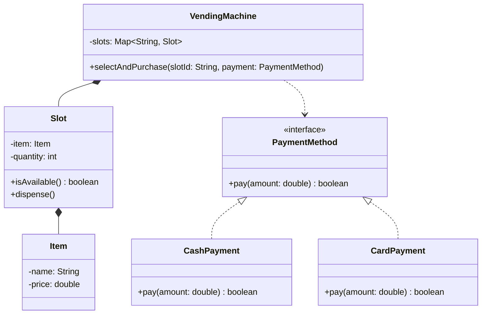
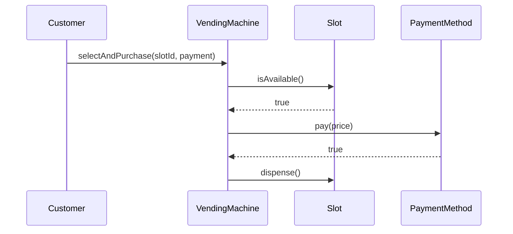

## Where This Fits

Chapter 42 ended with a confirmed entity list and a rough relationship map for a vending machine
problem. This chapter picks up exactly there and works all the way through to a complete class
diagram — narrated the way you'd actually talk through it out loud in an interview, decision by
decision.

## The Starting Point (Recap From Chapter 42)

**Clarified scope:** a single vending machine, supporting cash and card payment, dispensing items
from slots, handling out-of-stock and insufficient-payment cases, no physical hardware modeling.

**Entities identified:** `VendingMachine`, `Slot`, `Item`, `PaymentMethod` (likely an interface).

**Rough relationship:** `VendingMachine` composes `Slot`.

## Decision 1: What Does Each Entity Actually Need to Know and Do?

Work through entities one at a time, asking **"what state does this hold, and what behavior is
it responsible for?"** — resist the urge to jump to the most complex entity first; start simple.

**`Item`** — clearly simple: a name, a price. No behavior beyond exposing that data.

```java
class Item {
    private final String name;
    private final double price;
}
```

**`Slot`** — holds an `Item` and a quantity, and is responsible for dispensing (decrementing
quantity) and reporting availability:

```java
class Slot {
    private final Item item;
    private int quantity;

    boolean isAvailable() { return quantity > 0; }
    void dispense() { quantity--; }
}
```

## Decision 2: Where Does Payment Handling Belong?

Chapter 42 tentatively flagged `PaymentMethod` as "likely an interface." Here's the reasoning made
explicit, in real time: **the clarified requirements said "supporting cash and card payment"** —
two interchangeable ways of doing the same thing (accepting payment), selected once per
transaction, with no need to combine them or have them reference each other. That's Chapter 28's
Strategy pattern, textbook shape:

```java
interface PaymentMethod {
    boolean pay(double amount);
}

class CashPayment implements PaymentMethod {
    public boolean pay(double amount) { /* accept cash */ return true; }
}

class CardPayment implements PaymentMethod {
    public boolean pay(double amount) { /* charge card */ return true; }
}
```

**This is the moment patterns from Parts 3–6 actually get applied** — not by starting with "I
should use Strategy here" and looking for a place to put it, but by recognizing the exact shape
Chapter 28 described (one behavior, multiple interchangeable implementations, selected once) in
the requirements themselves.

## Decision 3: What Coordinates Everything?

`VendingMachine` is the natural coordinator — it holds the `Slot`s and orchestrates the overall
"select, pay, dispense" flow. This is a Facade-shaped responsibility (Chapter 25): one entry point
coordinating several collaborators.

```java
class VendingMachine {
    private final Map<String, Slot> slots = new HashMap<>();

    void selectAndPurchase(String slotId, PaymentMethod paymentMethod) {
        Slot slot = slots.get(slotId);
        if (slot == null || !slot.isAvailable()) {
            throw new IllegalStateException("Item unavailable");
        }
        if (!paymentMethod.pay(slot.getItem().getPrice())) {
            throw new IllegalStateException("Payment failed");
        }
        slot.dispense();
    }
}
```

## Decision 4: Draw the Full Class Diagram

With every entity's responsibilities and relationships now decided, the diagram is a direct
transcription of decisions already made — not a new design step:



## Decision 5: Stress-Test With a Sequence Diagram (Chapter 6's Verification Step)

Before writing code, trace the "happy path" through the diagram to confirm every step has a clear
owner:



This trace immediately surfaces a real question: **where does `slot.getItem().getPrice()` sit
relative to Chapter 5's Law of Demeter?** `VendingMachine` reaching through `Slot` to `Item` to get
a price is a two-hop chain. Given `Item` is a simple, stable value-holder (per Chapter 13's
Law of Demeter exception for simple, standard-shaped data), this is judged acceptable —
but **explicitly noticing and reasoning through it out loud** is exactly the kind of self-review
an interviewer wants to see, not something to silently gloss over.

## Decision 6: Apply the Interviewer's Curveball

A realistic mid-interview addition: **"What if the machine needs to give change for cash
payments?"** Trace the impact through the already-built diagram rather than starting over:

- `CashPayment.pay()` needs to know the amount tendered, not just whether payment succeeded —
  its signature needs to change to something like `double pay(double amountDue, double
  amountTendered)` returning the change owed, or a small `PaymentResult` object.
- `CardPayment` is unaffected — cards don't need "change."

This is precisely the OCP interview curveball described back in Chapter 1: **a well-structured
design absorbs the change with a narrow, explainable modification (one method's signature) rather
than a rewrite** — and explicitly noting that `CardPayment` needs zero changes is the concrete
evidence that the Strategy-based structure is paying off.

## Summary

- Class diagram construction is decision-by-decision, entity-by-entity: for each entity, decide
  its state and behavior before worrying about diagram syntax.
- Patterns from Parts 3–6 should emerge from recognizing a shape already described in the
  requirements (Chapter 28's Strategy shape for "multiple interchangeable payment methods") — not
  from starting with a pattern name and searching for somewhere to apply it.
- The diagram itself is a transcription of decisions already reasoned through, not a new design
  step in itself.
- Always stress-test the diagram with a sequence trace before coding, and explicitly narrate any
  borderline judgment calls (like a Law of Demeter question) rather than silently glossing over
  them.
- When an interviewer adds a requirement mid-design, trace its impact through the existing
  structure rather than restarting — the size and locality of the required change is itself
  evidence of whether the original design was well-structured.

---

## Interview Questions

**1. Why does this chapter recommend deciding each entity's state and behavior individually
before drawing any diagram syntax, rather than sketching the diagram's boxes and arrows first and
filling in details afterward?**
Deciding state and behavior first ensures each entity's responsibilities are genuinely,
independently reasoned through — starting with boxes and arrows risks anchoring on a visual
structure before the underlying responsibilities are actually clear, potentially leading to
boxes being connected based on superficial, guessed-at relationships rather than genuine, reasoned
ones; by the time you draw the diagram in this chapter's process, it's described as "a direct
transcription of decisions already made," meaning the actual thinking work happens during the
state-and-behavior decisions, and the diagram itself becomes a comparatively low-risk, mechanical
recording step.
*Follow-up: Does this mean the diagram itself has little value, since the "real" thinking happens
before it's drawn?* No — the diagram still provides significant value as a communication tool
(letting an interviewer follow your reasoning visually) and as a verification tool (its overall
shape can reveal an inconsistency or gap that wasn't obvious while reasoning through entities one
at a time, such as noticing two entities that were each reasoned through independently don't
actually connect to fulfill a required use case) — its value lies in communication and verification,
even though the primary design *decisions* happen during the preceding, entity-by-entity reasoning
step.

**2. In Decision 2 of this chapter's walkthrough, explain precisely how the clarified requirement
"supporting cash and card payment" was recognized as matching the Strategy pattern's shape, rather
than simply being told "use Strategy here."**
The requirement describes two different ways of accomplishing the exact same underlying goal
(accepting payment), where a caller selects one specific approach for a given transaction, with no
need for the two approaches to know about or combine with each other — this is precisely the shape
Chapter 28 established as Strategy's defining characteristic: one interchangeable behavior, multiple
independent implementations, selected once by the calling context. Recognizing this shape in the
requirement's own wording ("cash and card" as two interchangeable options) is what triggers
reaching for Strategy, rather than the reverse (deciding upfront "I'll use Strategy somewhere" and
then searching the requirements for a place to apply it).
*Follow-up: What specific requirement wording, if present instead, would have signaled a
different pattern (such as State, from Chapter 31) rather than Strategy for this same payment
concept?* If the requirement instead described something like "a transaction moves through
distinct payment stages — pending, authorized, captured, refunded — and its behavior changes based
on which stage it's currently in, with the payment object itself transitioning between these
stages," this would signal State (Chapter 31) rather than Strategy, since the defining
characteristic would be an object's *own lifecycle progression* driving behavioral changes over
time, rather than a caller selecting one fixed, interchangeable approach once per transaction — the
precise distinguishing test established in Chapter 31 (does the active implementation change
automatically over the object's lifetime, with implementations referencing each other?) would
correctly identify this as a different pattern despite superficially still being "about payment."

**3. Why does this chapter describe `VendingMachine`'s coordinating role as "Facade-shaped," and
what specifically about its responsibilities matches Chapter 25's Facade pattern rather than, say,
Chapter 35's Mediator pattern?**
`VendingMachine` provides one simplified entry point (`selectAndPurchase()`) that external callers
(customers) use, internally coordinating calls to several collaborators (`Slot`, `PaymentMethod`)
to achieve one outcome — this matches Facade's defining characteristic from Chapter 25: an external
caller triggering a simplified interface into an otherwise multi-step subsystem. It does not match
Mediator (Chapter 35), because `Slot` and `PaymentMethod` don't communicate with each other
directly nor reference `VendingMachine` back symmetrically — there's no peer-to-peer, symmetric
communication relationship between `Slot` and `PaymentMethod` being centralized here; it's a
one-directional, external-caller-to-subsystem coordination, precisely the Facade shape, not the
Mediator shape.
*Follow-up: Would `VendingMachine`'s role change from Facade-like to Mediator-like if `Slot` and
`PaymentMethod` needed to communicate with each other directly, coordinated through
`VendingMachine`, rather than `VendingMachine` simply calling each of them independently in
sequence?* Yes — if, for example, `PaymentMethod` needed to query `Slot` for pricing information
directly (rather than `VendingMachine` fetching that data and passing it along), and this
communication needed to be routed through `VendingMachine` acting as an intermediary between the
two, that would begin to resemble Mediator's symmetric, participant-aware coordination role more
than Facade's simpler, one-directional external-entry-point role — though for this specific vending
machine scenario, the simpler Facade characterization accurately matches the actual, sequential
coordination shown in the walkthrough.

**4. Walk through the Law of Demeter question raised in Decision 5 regarding
`slot.getItem().getPrice()`, and explain why this chapter judges this specific two-hop chain
acceptable, connecting back to the exception discussed in Chapter 13.**
Chapter 13 established that the Law of Demeter's core concern is chaining through your *own domain
objects'* internal structure, but explicitly carved out an exception for chaining through simple,
stable, standard-shaped value-holder types where the "violation" carries little real coupling risk
— `Item` here is exactly this kind of simple value holder (a name and a price, with no complex
internal structure of its own likely to change in ways that would break this chain), making this
two-hop access a low-risk, acceptable case rather than a genuine violation requiring a delegating
method like `Slot.getItemPrice()`.
*Follow-up: Under what specific future circumstance would this judgment call need to be
revisited?* If `Item`'s internal structure became more complex (for example, if pricing needed to
account for multiple tiers, promotional discounts, or tax calculations bundled inside `Item`
itself, rather than remaining a single simple `price` field), the risk of this chain breaking due
to internal restructuring of `Item` would increase, and adding a delegating method
(`Slot.getItemPrice()`, internally handling whatever complexity `Item`'s pricing logic might
require) would become the more defensible, Law-of-Demeter-compliant choice — this illustrates the
same "the correct classification depends on current, specific structure, not a fixed rule"
reasoning applied consistently throughout this series to entity-versus-attribute judgments as well.

**5. In Decision 6, why does the interviewer's "what if the machine needs to give change" curveball
only require modifying `CashPayment`'s method signature, with zero changes needed to
`CardPayment`, `Slot`, `Item`, or `VendingMachine`'s own core coordination logic?**
Because the change-giving requirement is specific to the semantics of one particular payment
method (cash, which involves physical tendered amounts and change) and has no bearing on the
other payment method's (card's) semantics at all — the Strategy-based design (Chapter 28) already
isolated each payment method's specific logic behind the shared `PaymentMethod` interface, so a
change specific to one implementation's internal behavior naturally stays contained to that one
implementation, exactly the OCP-compliant outcome (Chapter 8) the Strategy pattern is specifically
designed to provide; `Slot`, `Item`, and `VendingMachine`'s core flow have no dependency on
payment-method-specific details like "how much change is owed," so they remain entirely unaffected.
*Follow-up: If `VendingMachine.selectAndPurchase()`'s own method signature or internal logic did
need to change to accommodate this curveball (for example, to actually receive and display the
change amount to the customer), would this represent a failure of the original design, or a
reasonable, expected evolution?* This would represent a reasonable, expected evolution, not a
design failure — `VendingMachine` is the appropriate place for logic about *what to do with* a
computed change amount (like returning it as part of the method's result, or displaying it),
since that's part of its legitimate coordination responsibility; the key distinction, consistent
with the OCP discussion throughout this series, is that a *necessary, requirement-driven* change to
the coordinating class's own logic (to correctly handle and expose new information) is different
from an *unnecessary* one caused by poor original structure (like `VendingMachine` needing to know
internal cash-specific tendering logic, which it correctly does not need to know under this
design).

**6. How would you unit test `VendingMachine.selectAndPurchase()` given its dependencies on
`Slot` and `PaymentMethod`, and does the Strategy-based `PaymentMethod` design specifically aid
this testing, as discussed throughout earlier chapters?**
You'd construct a `VendingMachine` with a test `Slot` (perhaps a real `Slot` instance with known,
controlled `Item`/quantity values, or a fake if `Slot` were behind an interface) and inject a fake
`PaymentMethod` implementation (e.g., one that always returns `true` for a "successful payment"
test case, and a separate fake that always returns `false` for a "failed payment" test case) —
directly reusing the DIP-driven testability benefit established for Strategy in Chapter 28 and
reinforced throughout this series, verifying `selectAndPurchase()`'s own coordination logic
(checking availability, attempting payment, dispensing) correctly handles both success and failure
paths, entirely independent of any real cash- or card-processing logic.
*Follow-up: Would you also want a specific test verifying that `dispense()` is NOT called if
`pay()` returns `false`, and why would this specific test be particularly important given the
sequence of operations in `selectAndPurchase()`?* Yes — this is a particularly important test
because it verifies the correct *ordering and conditional* dependency between payment and
dispensing (the item should never be dispensed if payment fails), which is a subtle but critical
correctness property directly relevant to the actual business consequences of a bug here (an item
being dispensed for free if payment silently fails would be a significant, costly correctness
issue) — this kind of "verify a side effect does NOT happen under a specific condition" test is
just as valuable as testing that expected side effects DO happen, and is easy to overlook if only
the happy path is tested.

**7. This chapter's walkthrough explicitly avoids introducing a `VehicleFactory`-style Factory
Method (Chapter 17) for constructing `Item` or `Slot` objects. Why is this restraint appropriate
here, connecting back to the "don't force a pattern where it isn't needed" guidance from Chapter
15?**
Nothing in the clarified requirements or the entity reasoning suggests that `Item` or `Slot`
construction involves any runtime-dependent decision about *which concrete class* to instantiate —
there's only one kind of `Item` and one kind of `Slot` in this design, with no variation requiring
deferred type-selection logic; introducing a Factory Method here, with no genuine multi-type
creation decision to defer, would be exactly the kind of unjustified, KISS-violating over-
application of a pattern that Chapter 15 specifically warned against — a plain constructor is the
correct, sufficient choice for these two classes.
*Follow-up: If the vending machine needed to support different physical slot mechanisms (a
standard spiral-coil slot versus a refrigerated slot for cold beverages, each with different
dispensing behavior), would this change your answer regarding Factory Method?* Yes — if
different slot types genuinely required different dispensing behavior (not just different data,
but different *logic*), this would introduce exactly the kind of runtime type-selection decision
Factory Method addresses; you'd likely introduce a `Slot` interface with `StandardSlot` and
`RefrigeratedSlot` implementations (Chapter 3's decision framework applied to whether to use an
interface or abstract class, depending on how much implementation the two share), and a
`SlotFactory` to construct the appropriate type based on some input — directly illustrating that
introducing a pattern is justified specifically when the requirements introduce the genuine
variability the pattern is designed to address, not before.

**8. How would this chapter's walkthrough change if the interviewer had specified upfront, during
Chapter 41's clarification phase, that "the vending machine needs to support adding brand-new
payment methods (like mobile wallet payments) after the system is already deployed, without
recompiling the core vending machine logic"?**
This specific, explicit requirement would reinforce and further justify the Strategy-based
`PaymentMethod` design already chosen — but it would also suggest layering a Factory Method or a
registry-based lookup mechanism (similar to Chapter 17's `VehicleFactoryProvider`) for dynamically
selecting and instantiating the correct `PaymentMethod` implementation based on some external
configuration or plugin-registration mechanism, rather than the calling code directly constructing
`new CashPayment()` or `new CardPayment()` inline — moving toward the "plugin architecture"
discussion from Chapter 8's interview questions, where new payment method implementations could be
registered and discovered without modifying `VendingMachine`'s own compiled code at all.
*Follow-up: Would this additional requirement change anything about `VendingMachine`'s own
`selectAndPurchase()` method signature or internal logic?* Likely not significantly —
`selectAndPurchase()` already depends only on the abstract `PaymentMethod` interface, not on any
specific concrete implementation, so it would continue to work correctly regardless of how many
payment method implementations exist or how they're discovered/instantiated; the additional
complexity from this new requirement would be contained to *how a `PaymentMethod` instance is
obtained* before being passed into `selectAndPurchase()` (a new concern for a factory/registry
component to handle), not to `VendingMachine`'s own existing coordination logic, which is itself a
concrete demonstration of the OCP/DIP benefits established throughout Parts 2 and 3 paying off in
practice.

**9. In the sequence diagram shown in Decision 5, `VendingMachine` calls `Slot.isAvailable()`
before calling `PaymentMethod.pay()`. Why is this specific ordering important, and what could go
wrong if payment were attempted before checking availability?**
Checking availability first ensures the customer's payment is never taken (or attempted) for an
item the machine cannot actually dispense — if payment were attempted first and only afterward
discovered the item was unavailable, this would require either handling a refund (added complexity
and a worse customer experience) or, worse, silently charging a customer for an item they never
receive if the failure isn't handled carefully; checking availability first is both simpler to
implement correctly and produces better real-world behavior, avoiding an entire category of
failure-handling complexity that the reverse ordering would introduce.
*Follow-up: Does this ordering decision relate to the atomicity/concurrency concerns discussed in
Chapter 40, given that another customer could concurrently purchase the last unit of the same item
between the availability check and the actual dispense?* Yes, directly — this is precisely the
same "check-then-act" atomicity concern discussed in Chapter 40 (and previewed with the
`findAndReserveSpot()` example) — if two customers concurrently select the same slot's last
remaining item, both could pass the `isAvailable()` check before either one's `dispense()` call
actually executes, resulting in one customer paying for an item that's no longer actually available.
A fully concurrency-safe implementation would need to combine the availability check and the
dispense operation into a single atomic operation (protected by an appropriate lock, per Chapter
40's checklist), exactly mirroring the parking-spot reservation scenario discussed in that earlier
chapter — worth explicitly raising if the interviewer's clarified requirements (Chapter 41)
indicated genuine concurrent access needed to be considered for this vending machine design.

**10. This chapter's walkthrough presents six numbered "decisions" as the process for building the
class diagram. Is this exact sequence of decisions meant to be followed rigidly and in this exact
order for every LLD problem, or is it meant to illustrate a more general, adaptable reasoning
process?**
It's meant to illustrate a general, adaptable reasoning process rather than a rigid, universally-
fixed sequence — the specific decisions made (which entity to reason through first, when a pattern
becomes recognizable, when to stress-test with a sequence diagram) depend on the specific problem's
own structure and complexity; for a different problem, the natural order of decisions might differ
(perhaps the coordinating/Facade-like class becomes obvious before individual leaf entities'
responsibilities are fully decided, reversing this walkthrough's order), but the underlying
principles — reason through state/behavior before diagram syntax, recognize patterns from the
requirements rather than forcing them, verify with a sequence trace before coding, trace curveballs
through existing structure — remain the transferable, generally-applicable skill this walkthrough
is meant to demonstrate.
*Follow-up: If, in a real interview, you found yourself needing to jump between these
"decisions" non-sequentially (for example, realizing partway through Decision 3 that Decision 1's
conclusion about `Item` needs revisiting), would this suggest something had gone wrong with your
process?* Not necessarily — as discussed in Chapter 42's similar question about revisiting earlier
extraction-process steps, design is inherently iterative, and discovering during later reasoning
that an earlier decision needs adjustment is a normal, expected part of working through a genuinely
non-trivial design problem; what would be more concerning is if this kind of revisiting happened
so frequently and extensively that no stable, forward progress was being made at all — occasional,
targeted revision is healthy iteration, while constant, wholesale reconsideration of already-settled
decisions would suggest the underlying entity/relationship extraction from Chapter 42 wasn't
sufficiently solid before class-diagram design began.

**11. How would you extend this vending machine class diagram to support the "design a vending
machine" case study's full scope from Part 8 (Chapter 48), which likely includes additional
concerns like machine states (idle, dispensing, out of service) not addressed in this chapter's
simplified walkthrough?**
Introducing machine states (idle, dispensing, out-of-service, and perhaps a "collecting payment"
intermediate state) would be a natural candidate for the State pattern (Chapter 31) — rather than
`VendingMachine.selectAndPurchase()` handling every possible state-dependent behavior through
conditionals, you'd introduce a `VendingMachineState` interface with concrete states like
`IdleState`, `DispensingState`, `OutOfServiceState`, each implementing state-specific behavior and
governing which transitions are legal from that state (for example, `OutOfServiceState` might
reject any purchase attempt entirely, regardless of slot availability or payment method).
*Follow-up: Would introducing this State pattern require significant changes to the
`PaymentMethod` Strategy design or the `Slot`/`Item` classes already established in this chapter's
walkthrough?* Likely minimal changes — `PaymentMethod`, `Slot`, and `Item` would remain largely
unaffected, since the State pattern would primarily govern `VendingMachine`'s own top-level
behavior and transition logic (deciding *whether* a purchase attempt should even be allowed to
proceed, given the machine's current state), while the underlying mechanics of payment processing
and item dispensing (already well-encapsulated behind `PaymentMethod` and `Slot`) would continue to
be invoked in essentially the same way once a state determines that a purchase attempt should
proceed — a good demonstration of how the patterns and entities established early in a design can
remain stable even as additional structural concerns (like machine state) are layered on top.

**12. Suppose an interviewer, after seeing this class diagram, asked: "Why didn't you use the
Observer pattern here, for example to notify a restocking system when an item's quantity gets
low?" How would you respond, given that this specific requirement wasn't part of the original
clarified scope?**
Acknowledge that this is a reasonable, legitimate extension not covered by the original clarified
requirements, and explain how it would integrate cleanly with the existing design: `Slot` could
implement the `Subject` interface from Chapter 29, notifying registered `Observer`s (a
`RestockingAlertService`, for example) whenever its `dispense()` method causes quantity to drop
below some threshold — this is a natural, additive extension to the existing `Slot` class that
doesn't require restructuring anything already built, and demonstrating this integration live
(even briefly, without fully implementing it) shows both flexibility and genuine understanding of
Observer's applicability, rather than either dismissing the question or claiming it should have
been part of the original design given the originally clarified, narrower scope.
*Follow-up: Does responding this way — acknowledging the extension wasn't originally in scope,
while still demonstrating how it would integrate — better reflect the process discipline
established throughout this Part than either immediately implementing it in full or refusing to
discuss it?* Yes — this response directly reflects Chapter 41's YAGNI-driven scoping discipline
(not having built the restocking-notification feature preemptively, since it wasn't part of the
originally clarified requirements) while also demonstrating the kind of graceful, structured
response to a mid-interview curveball discussed in Decision 6 of this chapter — tracing the new
requirement's impact through the existing structure rather than either over-committing to a full
implementation under time pressure or dismissively declining to engage with the interviewer's
legitimate follow-up question.

**13. This chapter's walkthrough uses a `Map<String, Slot>` inside `VendingMachine` to store
slots, keyed by a `slotId` string. What alternative design would you consider if slots needed to
be arranged and referenced by a two-dimensional grid position (like "row 3, column 2") rather than
a simple string identifier, and how would you decide which approach is appropriate?**
You could use a `Map<GridPosition, Slot>` (with a small `GridPosition` value class holding row and
column) instead of a simple `String` key, or a two-dimensional array/list-of-lists structure
(`Slot[][] slots`) if positions are always dense and bounded (every row/column combination within
a fixed range is guaranteed to have a slot) — the choice depends on whether slot positions are
naturally sparse (a `Map`-based approach handles gaps gracefully) or naturally dense and grid-like
(an array-based approach is simpler and more directly models the physical grid layout); this is a
concrete, small-scale illustration of choosing a data structure based on the actual shape of the
domain concept being modeled, similar in spirit to earlier discussions (Chapter 4) about choosing
representations that match a relationship's actual multiplicity and structure.
*Follow-up: Would this choice of internal data structure for storing slots be visible or relevant
at all on the class diagram itself, or is this purely an implementation detail decided later,
during the coding phase?* This level of internal data-structure choice (Map versus array, and the
specific key/index type) is generally considered an implementation detail appropriately decided
during the coding phase (Chapter 6's phase 5) rather than needing to be fully resolved on the class
diagram itself — the class diagram would typically just show that `VendingMachine` "has" `Slot`
objects (an aggregation or composition relationship, per Chapter 4), without necessarily specifying
the exact collection type or indexing scheme used internally to store and look them up, which is a
reasonable level of detail to defer to the coding phase without weakening the diagram's value as a
structural communication tool.

**14. Having now completed this fully worked class-diagram walkthrough, summarize the single most
important habit demonstrated throughout this chapter that a candidate should consciously practice
and internalize before attempting the full case studies in Part 8.**
The single most important habit demonstrated throughout this chapter is **narrating the reasoning
behind each decision as it's made** — explicitly stating *why* a particular entity has certain
responsibilities, *why* a specific pattern's shape was recognized in the requirements (rather than
just declaring "I'll use Strategy here"), and *why* a specific judgment call (like the Law of
Demeter question in Decision 5) was resolved one way rather than another — consistently connecting
each concrete design decision back to the underlying principles and patterns established throughout
Parts 1 through 6, rather than presenting a finished diagram with no visible reasoning trail. This
habit is what transforms a technically correct design into a strong, legible interview performance,
since interviewers evaluate the visible reasoning process at least as much as the final diagram
itself.
*Follow-up: How does this specific habit — narrating reasoning rather than just presenting
conclusions — connect to the very first lesson introduced all the way back in Chapter 1 of this
series?* This connects directly back to Chapter 1's foundational distinction between a "weak"
response (a working but unexplained `if/else`-based `NotificationService`) and a "stronger"
response (the Strategy-based refactor, explained in terms of the specific principle it satisfies)
— the entire series has consistently reinforced that LLD interviews evaluate the *reasoning process*
connecting a design to established principles and patterns, not merely whether the final code or
diagram happens to be structurally correct; this chapter's fully worked walkthrough is, in effect,
a complete, extended demonstration of exactly the kind of reasoning-transparent approach Chapter 1
introduced as the series' foundational goal from its very first page.
