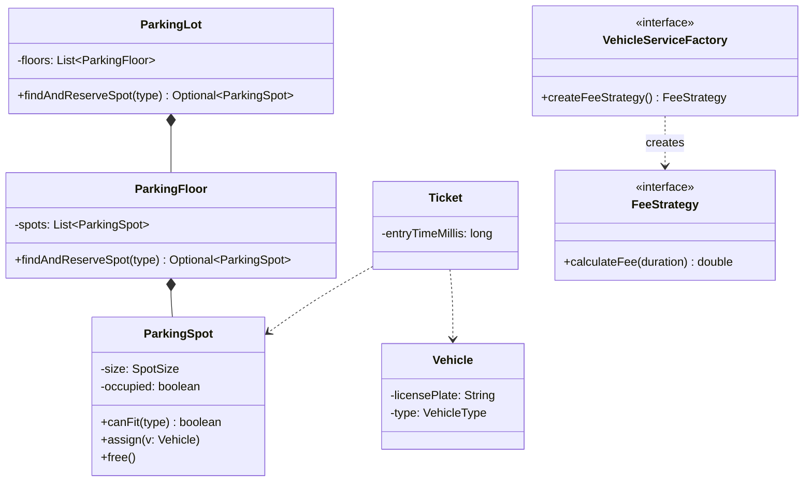
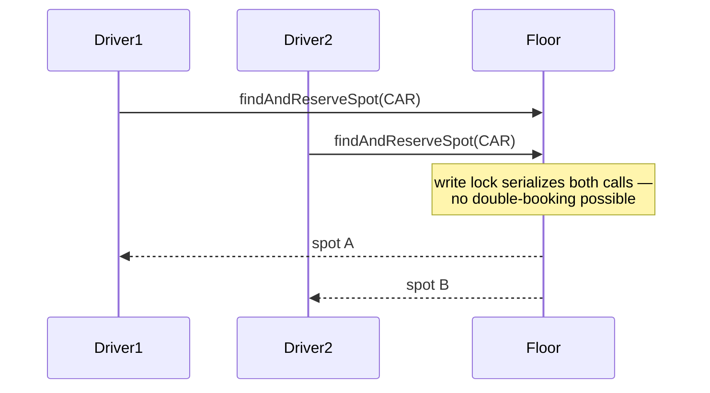

## Applying the Process From Part 7

Every case study in Part 8 follows the exact five-phase structure from Chapter 41. This chapter
walks through it in full for the single most commonly asked LLD problem in real interviews.

## Phase 1: Clarified Requirements

- Multiple vehicle types: Motorcycle, Car, Truck — each requiring a different spot size.
- Multiple floors, each with multiple spots of varying sizes.
- Fee calculation varies by vehicle type and duration (hourly).
- Multiple entry and exit gates, usable concurrently.
- Out of scope: physical gate hardware, payment gateway integration (a `PaymentMethod` interface
  is injected, per Chapter 21's Adapter reasoning, but not implemented in depth), user accounts.

## Phase 2: Entities (Chapter 42's Process, Applied)

Nouns extracted: vehicle, spot, floor, parking lot, ticket, fee, gate.

| Noun | Classification |
|---|---|
| Vehicle | Entity — has identity (license plate), referenced by `Ticket` and `ParkingSpot` |
| ParkingSpot | Entity — identity, occupancy state |
| ParkingFloor | Entity — contains spots |
| ParkingLot | Entity — top-level coordinator |
| Ticket | Entity — identity, referenced at exit for fee calculation |
| Fee | Attribute — computed value on `Ticket` |
| Gate (Entry/Exit) | Entity — has behavior (issuing tickets, processing exit) |

Relationships: `ParkingLot` **composes** `ParkingFloor`; `ParkingFloor` **composes**
`ParkingSpot`; `ParkingSpot` **associates with** `Vehicle` (temporary, while occupied);
`Ticket` **associates with** `Vehicle` and `ParkingSpot`.

## Phase 3: Class Diagram

```java
enum VehicleType { MOTORCYCLE, CAR, TRUCK }

class Vehicle {
    private final String licensePlate;
    private final VehicleType type;
}

enum SpotSize { SMALL, MEDIUM, LARGE }

class ParkingSpot {
    private final String id;
    private final SpotSize size;
    private boolean occupied;
    private Vehicle currentVehicle;

    boolean canFit(VehicleType type) { /* maps VehicleType to required SpotSize */ return true; }
    void assign(Vehicle vehicle) { this.currentVehicle = vehicle; this.occupied = true; }
    void free() { this.currentVehicle = null; this.occupied = false; }
}

class ParkingFloor {
    private final List<ParkingSpot> spots;
    private final ReentrantReadWriteLock lock = new ReentrantReadWriteLock(); // Chapter 40

    Optional<ParkingSpot> findAndReserveSpot(VehicleType type) {
        lock.writeLock().lock(); // combined check-and-reserve MUST be atomic — Chapter 40
        try {
            for (ParkingSpot spot : spots) {
                if (!spot.isOccupied() && spot.canFit(type)) {
                    return Optional.of(spot); // caller assigns the vehicle
                }
            }
            return Optional.empty();
        } finally {
            lock.writeLock().unlock();
        }
    }
}
```

**Fee calculation uses Strategy (Chapter 28)** — the requirement ("varies by vehicle type")
is the exact interchangeable-algorithm shape:

```java
interface FeeStrategy {
    double calculateFee(long durationInMinutes);
}

class HourlyFeeStrategy implements FeeStrategy {
    private final double ratePerHour;
    HourlyFeeStrategy(double ratePerHour) { this.ratePerHour = ratePerHour; }
    public double calculateFee(long durationInMinutes) {
        return Math.ceil(durationInMinutes / 60.0) * ratePerHour;
    }
}
```

**Vehicle + Fee Strategy family uses Abstract Factory (Chapter 18)** — selecting a vehicle type
must consistently determine its fee strategy too, preventing an accidental mismatch:

```java
interface VehicleServiceFactory {
    FeeStrategy createFeeStrategy();
}

class CarServiceFactory implements VehicleServiceFactory {
    public FeeStrategy createFeeStrategy() { return new HourlyFeeStrategy(20.0); }
}

class TruckServiceFactory implements VehicleServiceFactory {
    public FeeStrategy createFeeStrategy() { return new HourlyFeeStrategy(50.0); }
}
```

```java
class Ticket {
    private final String id;
    private final Vehicle vehicle;
    private final ParkingSpot spot;
    private final long entryTimeMillis;
}

class EntryGate {
    private final ParkingLot lot;

    Ticket issueTicket(Vehicle vehicle) {
        ParkingSpot spot = lot.findAndReserveSpot(vehicle.getType())
            .orElseThrow(() -> new IllegalStateException("Lot full"));
        spot.assign(vehicle);
        return new Ticket(generateId(), vehicle, spot, System.currentTimeMillis());
    }
}

class ExitGate {
    private final VehicleServiceFactory factory; // per vehicle type — Abstract Factory
    private final PaymentMethod paymentMethod; // Strategy, Chapter 28 — injected, out of scope

    void processExit(Ticket ticket) {
        long duration = (System.currentTimeMillis() - ticket.getEntryTimeMillis()) / 60000;
        double fee = factory.createFeeStrategy().calculateFee(duration);
        paymentMethod.pay(fee);
        ticket.getSpot().free();
    }
}
```



## Phase 4: Sequence Trace — The Concurrent-Entry Curveball



Tracing this scenario is exactly why `findAndReserveSpot()` was designed as one locked method
rather than separate `isAvailable()`/`assign()` calls — Chapter 40's atomicity discussion applied
directly.

## Phase 5: The Interviewer's Curveball — "Add Electric Vehicle Charging Spots"

Trace the impact rather than redesigning: add `ELECTRIC` to `VehicleType`, add a new
`ChargingSpot extends ParkingSpot` (or a `hasCharger` boolean field, depending on how much
behavior differs), and add `ElectricVehicleServiceFactory`. **`EntryGate`, `ExitGate`, and
`ParkingFloor.findAndReserveSpot()` require zero changes** — direct evidence the Strategy/Abstract
Factory structure is paying off, exactly as demonstrated in Chapter 43.

## Summary

- This case study combines Strategy (fee calculation), Abstract Factory (consistent vehicle/fee
  pairing), and Chapter 40's read-write lock discipline for the one operation that must be atomic.
- The single most commonly-tested detail is the `findAndReserveSpot()` atomicity — separating
  "check" from "reserve" into two calls reintroduces the exact race condition Chapter 40 warned
  against.
- Every phase of Chapter 41's five-phase process is directly visible in this walkthrough — this is
  the template for approaching every remaining case study in Part 8.

---

## Interview Questions

**1. Why is `findAndReserveSpot()` designed as a single, atomically-locked method rather than
separate `isAvailable()` and `assign()` calls?**
Separating them reintroduces a race condition: two threads could both see a spot as available
before either has reserved it, resulting in a double-booked spot. Combining "find" and "reserve"
into one write-locked method (Chapter 40) makes the entire operation atomic, guaranteeing only one
thread ever successfully claims a given spot.
*Follow-up: Why use the write lock rather than the read lock for this operation, given that it
involves searching (reading) through spots?* Because the operation also mutates state by the time
it returns (implicitly reserving the spot before returning it) — any operation that could result in
a state change must use the exclusive write lock for its entire duration, even if part of the
operation is conceptually a "read."

**2. Explain why fee calculation uses Strategy while vehicle-type-to-fee-strategy selection uses
Abstract Factory, rather than using Abstract Factory for everything or Strategy for everything.**
Strategy alone would let a caller independently select any `FeeStrategy` for any vehicle, risking
an accidental mismatch (a `Car` paired with a `Truck`'s pricing). Abstract Factory groups the
vehicle-type-specific choice of fee strategy into one guaranteed-consistent bundle, while
`FeeStrategy` itself remains a Strategy internally — exactly the Chapter 18 "Abstract Factory is
composed of several Factory Methods" relationship.
*Follow-up: If a future requirement introduced a second vehicle-type-specific product (say, a
`TicketFormat`), how would you extend `VehicleServiceFactory`?* Add a `createTicketFormat()`
method to the interface and implement it in every existing concrete factory — the same "add a
family member" cost discussed in Chapter 18.

**3. How would you unit test `ParkingFloor.findAndReserveSpot()` to verify it never returns the
same spot to two concurrent callers?**
Run many threads concurrently calling `findAndReserveSpot(CAR)` on a floor with a known, fixed
number of car-compatible spots, collect every returned spot's ID, and assert no ID appears more
than once and the number of successful reservations never exceeds the actual spot count.

**4. Why does `ExitGate` depend on `PaymentMethod` as an injected interface rather than
constructing a concrete payment implementation itself?**
This is Dependency Inversion (Chapter 11) — `ExitGate` shouldn't know or care whether payment is
processed via cash, card, or a third-party gateway; injecting the interface keeps `ExitGate`
testable (a fake `PaymentMethod` in tests) and swappable without modifying `ExitGate` itself.

**5. What would go wrong if `ParkingSpot.assign()` and `free()` were not synchronized at all,
relying purely on `ParkingFloor`'s lock for safety?**
As long as every path that calls `assign()`/`free()` always does so while already holding
`ParkingFloor`'s write lock, this is safe — but it's a fragile assumption relying on discipline
across every future caller. A more robust design confirms this invariant explicitly in code
comments or, defensively, adds `ParkingSpot`'s own lightweight synchronization as a backstop.

**6. How would you extend this design to support reservations made in advance (before the vehicle
arrives)?**
Introduce a `Reservation` entity separate from `Ticket`, associated with a specific
`ParkingSpot` held for a time window before actual entry — `EntryGate.issueTicket()` would need to
check for an existing valid reservation for the arriving vehicle before falling back to
`findAndReserveSpot()`'s general search.

**7. Why is `VehicleType` modeled as an enum rather than a class hierarchy, given Chapter 3's
interface-vs-class decision framework?**
No behavior currently varies per vehicle type directly on `Vehicle` itself — type only affects
external logic (spot size matching, fee strategy selection), which is handled by other classes
(`ParkingSpot.canFit()`, `VehicleServiceFactory`). An enum is the simpler, sufficient
representation per Chapter 42's "start as an attribute, promote only if needed" guidance.

**8. How would the design change if the parking lot needed to support a "loyalty discount" that
combines with the standard hourly fee?**
Introduce a `CompositeDiscount`-style wrapper (Chapter 23's Composite applied to `FeeStrategy`
instances) or a decorator (Chapter 24) wrapping the base `FeeStrategy` with discount-adjustment
logic, without modifying `HourlyFeeStrategy` itself.

**9. Why does `Ticket` store `entryTimeMillis` as a primitive `long` rather than storing a
computed `duration` field directly?**
Duration isn't known until exit — storing the raw entry timestamp and computing duration at exit
time (`ExitGate.processExit()`) is the only correct approach, since the ticket doesn't know its own
exit time while `Vehicle` is still parked.

**10. What's the risk of making `ParkingLot`, `ParkingFloor`, and `ParkingSpot` all mutable, and
how would immutability apply differently to `Ticket`?**
`ParkingLot`/`Floor`/`Spot` genuinely need mutable occupancy state over time — forcing immutability
there would require constructing new objects on every state change, which is impractical.
`Ticket`, once issued, has no legitimate reason to change any of its fields after creation (its
vehicle, spot, and entry time are fixed facts) — making `Ticket` immutable protects against
accidental post-issuance mutation, per Chapter 2's encapsulation discussion.

**11. How would you handle the interviewer asking "what if a vehicle loses its ticket"?**
Add a lookup mechanism (`ParkingLot.findTicketByLicensePlate()`) allowing `ExitGate` to locate the
active ticket by vehicle identity rather than requiring the physical ticket, with a policy decision
(perhaps a manual-override fee) for genuinely irrecoverable cases — worth clarifying this
requirement's exact expected behavior with the interviewer rather than guessing.

**12. Why does `EntryGate` depend on `ParkingLot` (not `ParkingFloor` directly), while
`ParkingLot.findAndReserveSpot()` internally delegates to each `ParkingFloor`?**
This is Facade-like layering (Chapter 25) — `EntryGate` shouldn't need to know how many floors
exist or iterate them itself; `ParkingLot` coordinates across floors internally, presenting one
simple entry point.

**13. How would you extend this design for multiple, independently-operating entry gates without
introducing any new race conditions beyond the one already addressed?**
Since `findAndReserveSpot()`'s locking is scoped to the shared `ParkingFloor`/`ParkingLot` state
(not to any single gate), any number of `EntryGate` instances calling into the same
`ParkingLot` safely share the same underlying atomic reservation logic — no additional
gate-specific locking is needed.

**14. Summarize which two patterns from Parts 3-6 this case study combines, and state the one
concurrency detail most likely to be explicitly tested by an interviewer.**
Strategy (fee calculation) and Abstract Factory (consistent vehicle/fee-strategy pairing) are the
two primary patterns; the most commonly tested concurrency detail is recognizing that
"find a spot" and "reserve a spot" must be one atomic, write-locked operation, not two separate
calls — precisely the detail this case study built the entire `ParkingFloor` design around.
