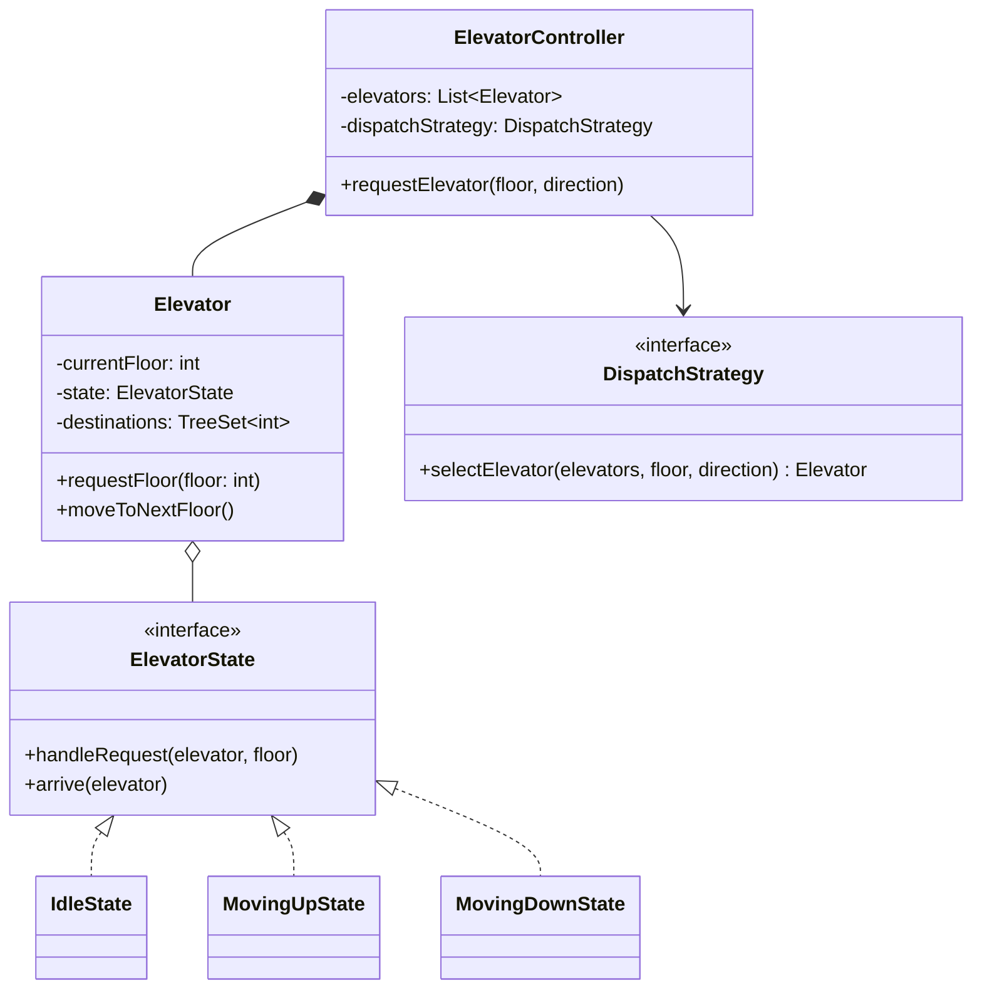
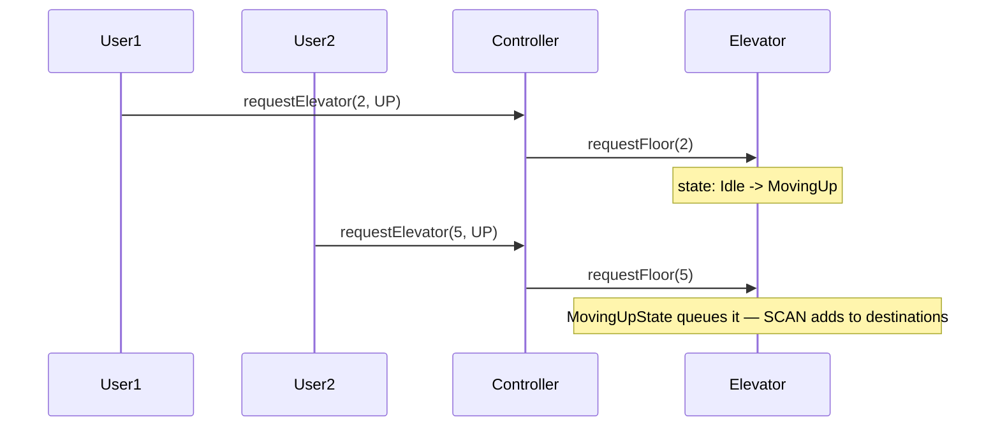

## Phase 1: Clarified Requirements

- A building has multiple elevators and multiple floors.
- A user can request an elevator from any floor, specifying desired direction (up/down), and
  separately select a destination floor once inside.
- The system should dispatch the "best" available elevator for a given request.
- Out of scope: real-time hardware sensor integration, elevator maintenance mode (mentioned as a
  possible future extension only).

## Phase 2: Entities

| Noun | Classification |
|---|---|
| Elevator | Entity — identity, current floor, direction, state |
| ElevatorController | Entity — coordinates all elevators, dispatches requests |
| Request (external, internal) | Entity — a floor + direction, or a destination floor |
| Direction | Attribute (enum) |
| Floor | Attribute (int) — no independent behavior needed |

Relationship: `ElevatorController` **composes** `Elevator` (elevators don't exist independently of
the building's controller); `Elevator` processes `Request` objects (association).

## Phase 3: Class Diagram — State Pattern for Elevator Movement

An elevator's behavior changes based on its own lifecycle — idle, moving up, moving down, doors
open — exactly the State pattern's (Chapter 31) defining shape, not Strategy's, since the
*elevator itself* drives these transitions as it processes requests.

```java
enum Direction { UP, DOWN, IDLE }

interface ElevatorState {
    void handleRequest(Elevator elevator, int destinationFloor);
    void arrive(Elevator elevator);
}

class IdleState implements ElevatorState {
    public void handleRequest(Elevator elevator, int destinationFloor) {
        if (destinationFloor > elevator.getCurrentFloor()) {
            elevator.setState(new MovingUpState());
        } else if (destinationFloor < elevator.getCurrentFloor()) {
            elevator.setState(new MovingDownState());
        }
        elevator.addDestination(destinationFloor);
    }
    public void arrive(Elevator elevator) { /* no-op — already idle */ }
}

class MovingUpState implements ElevatorState {
    public void handleRequest(Elevator elevator, int destinationFloor) {
        elevator.addDestination(destinationFloor); // queue it — SCAN algorithm, see below
    }
    public void arrive(Elevator elevator) {
        if (elevator.hasMoreDestinationsAbove()) {
            elevator.moveToNextFloor();
        } else {
            elevator.setState(new IdleState());
        }
    }
}
```

```java
class Elevator {
    private final int id;
    private int currentFloor;
    private ElevatorState state = new IdleState();
    private final TreeSet<Integer> destinations = new TreeSet<>(); // sorted — enables SCAN

    void setState(ElevatorState state) { this.state = state; }
    void requestFloor(int floor) { state.handleRequest(this, floor); }
    void addDestination(int floor) { destinations.add(floor); }
    boolean hasMoreDestinationsAbove() {
        return !destinations.isEmpty() && destinations.last() > currentFloor;
    }
    void moveToNextFloor() {
        currentFloor += (state instanceof MovingUpState) ? 1 : -1;
        if (destinations.contains(currentFloor)) {
            destinations.remove(currentFloor);
            state.arrive(this);
        }
    }
}
```

**Dispatch strategy uses Strategy (Chapter 28)** — "which elevator handles this request" is
exactly one interchangeable algorithm, selected once per request:

```java
interface DispatchStrategy {
    Elevator selectElevator(List<Elevator> elevators, int requestFloor, Direction direction);
}

class NearestElevatorDispatchStrategy implements DispatchStrategy {
    public Elevator selectElevator(List<Elevator> elevators, int requestFloor, Direction direction) {
        return elevators.stream()
            .min(Comparator.comparingInt(e -> Math.abs(e.getCurrentFloor() - requestFloor)))
            .orElseThrow();
    }
}

class ElevatorController {
    private final List<Elevator> elevators;
    private final DispatchStrategy dispatchStrategy;

    void requestElevator(int floor, Direction direction) {
        Elevator chosen = dispatchStrategy.selectElevator(elevators, floor, direction);
        chosen.requestFloor(floor);
    }
}
```



## Why `TreeSet` and the SCAN Algorithm

Using a sorted `TreeSet<Integer>` for destinations, combined with `MovingUpState` always
continuing upward until no destinations remain above the current floor, implements the classic
**SCAN (elevator) algorithm** — the elevator serves all requests in its current direction before
reversing, rather than naively serving requests in the order received (which would cause needless
back-and-forth travel). This is a concrete, domain-specific algorithmic detail worth naming
explicitly if an interviewer asks "how do you decide which floor to visit next?"

## Phase 4: Sequence Trace — Two Requests, One Elevator, Same Direction



## Phase 5: Curveball — "Add an Express Elevator That Skips Certain Floors"

Trace impact: introduce a new `DispatchStrategy` implementation
(`ExpressAwareDispatchStrategy`) that excludes express elevators from requests originating on
skipped floors, and add a `servesFloor(int floor)` check inside `Elevator` itself. **`ElevatorState`
implementations and the core SCAN logic require zero changes** — the floor-serving constraint is
orthogonal to movement-state logic.

## Summary

- Elevator movement is State (Chapter 31) — the elevator itself drives transitions as it processes
  destinations. Dispatch is Strategy (Chapter 28) — one algorithm selected once per request.
- The SCAN algorithm (sorted destination set, continue-then-reverse) is the specific domain
  knowledge that separates a naive from a strong answer to this problem.
- Concurrency note: if multiple `Elevator` objects can be requested concurrently by multiple
  users, `ElevatorController.requestElevator()`'s dispatch-then-assign sequence should be
  considered for the same atomicity discipline as Chapter 45's parking spot reservation.

---

## Interview Questions

**1. Why is elevator movement modeled with the State pattern rather than Strategy?**
The elevator itself transitions between states (`Idle` → `MovingUp` → `Idle`) as a direct
consequence of its own processing — `MovingUpState.arrive()` decides and constructs the next state
itself, exactly the "implementations reference and construct each other to drive transitions"
signal Chapter 31 established as State's defining test, unlike Strategy's mutually-unaware
implementations.

**2. Explain the SCAN algorithm's benefit over a naive FIFO request queue.**
FIFO could send an elevator from floor 1 to floor 10, then back down to floor 3, then up again to
floor 8 — wasteful, unnecessary direction reversals. SCAN continues serving all requests in the
current direction before reversing, minimizing total travel and direction changes.

**3. Why does `MovingUpState.handleRequest()` simply add to `destinations` rather than
transitioning state immediately?**
A new request arriving while already moving up doesn't need a new state transition — the elevator
is already moving in a compatible direction; adding to the sorted `destinations` set lets SCAN
naturally incorporate the new stop without disrupting the current traversal.

**4. How would you unit test that an elevator serving floors 2 and 7 while moving up correctly
visits both before reversing, even if floor 7 is requested after floor 2?**
Construct an elevator, call `requestFloor(2)` then `requestFloor(7)`, and step through
`moveToNextFloor()` calls, asserting the sequence of `currentFloor` values reaches 2 then continues
to 7 without reversing before both are served.

**5. Why is `NearestElevatorDispatchStrategy` a reasonable default, and what's a scenario where it
performs poorly?**
It minimizes wait time for the common case. It performs poorly if the "nearest" elevator is moving
away from the requester's floor and direction — a more sophisticated strategy would also weigh
current direction and destination queue length, not just raw floor distance.

**6. How would you extend `DispatchStrategy` to account for an elevator's current direction, not
just distance?**
Modify `selectElevator()`'s scoring logic to penalize elevators moving away from the requester's
floor/direction, or exclude them entirely if a same-direction elevator is available — this stays
entirely within the existing Strategy interface, requiring only a new or modified implementation.

**7. Why does `ElevatorController` hold a single `DispatchStrategy` rather than letting each
`Elevator` decide independently whether to accept a request?**
Dispatch is a system-wide decision requiring visibility across all elevators simultaneously — an
individual `Elevator` has no way to know if another elevator is better positioned, making
centralized coordination (a Facade/Strategy combination) the appropriate structure, not a
per-elevator decision.

**8. What happens if `Elevator.moveToNextFloor()` is called when `destinations` is empty?**
`hasMoreDestinationsAbove()` returns false, and the state transitions to `IdleState` — this
should be checked before movement is attempted at all; a defensive early return in
`moveToNextFloor()` itself would guard against this being called incorrectly.

**9. How would you model concurrent requests arriving for the same elevator from multiple
threads, connecting to Chapter 40?**
`Elevator.addDestination()` and `moveToNextFloor()` mutate shared state (`destinations`,
`currentFloor`) — if multiple threads can call these concurrently, they need protection (a
`synchronized` block or explicit lock), following Chapter 40's checklist: identify shared mutable
state, then apply the lightest sufficient mechanism.

**10. Why is `Direction` modeled as a simple enum rather than a class hierarchy?**
No behavior varies per direction value directly — it's used purely as data to decide which state
to transition into and how `moveToNextFloor()` increments/decrements `currentFloor`. An enum is
sufficient per Chapter 42's attribute-vs-entity test.

**11. How would you extend this design to support a "priority" request (e.g., a fire emergency
overriding normal dispatch)?**
Introduce a `PriorityDispatchStrategy` decorator (Chapter 24) wrapping the normal
`DispatchStrategy`, intercepting priority requests and forcing immediate reassignment, without
modifying `NearestElevatorDispatchStrategy` itself.

**12. Why does `IdleState.arrive()` do nothing, and is this an LSP concern similar to earlier
chapters' discussions?**
It's a legitimate no-op, not an LSP violation — `arrive()` on an idle elevator genuinely has
nothing meaningful to do, unlike a method throwing an exception for a type that can't honestly
support it at all; a harmless no-op for an inapplicable-but-safe case is a different, acceptable
category from the `UnsupportedOperationException` pattern flagged in Chapters 9-10.

**13. How would you extend the design for multiple elevator banks (e.g., separate elevators for
different floor ranges in a skyscraper)?**
Introduce multiple `ElevatorController` instances, one per bank, each with its own subset of
`Elevator`s and potentially its own `DispatchStrategy`, coordinated by a higher-level facade that
routes a request to the correct bank's controller based on the requested floor range.

**14. Summarize the two patterns this case study combines and the one algorithmic detail most
likely to distinguish a strong answer from a weak one.**
State (elevator movement lifecycle) and Strategy (dispatch selection) are the two core patterns;
the SCAN algorithm — serving requests in sorted order within the current direction before
reversing, rather than naive FIFO — is the specific domain knowledge that most reliably separates a
strong, realistic answer from a naive one on this particular problem.
