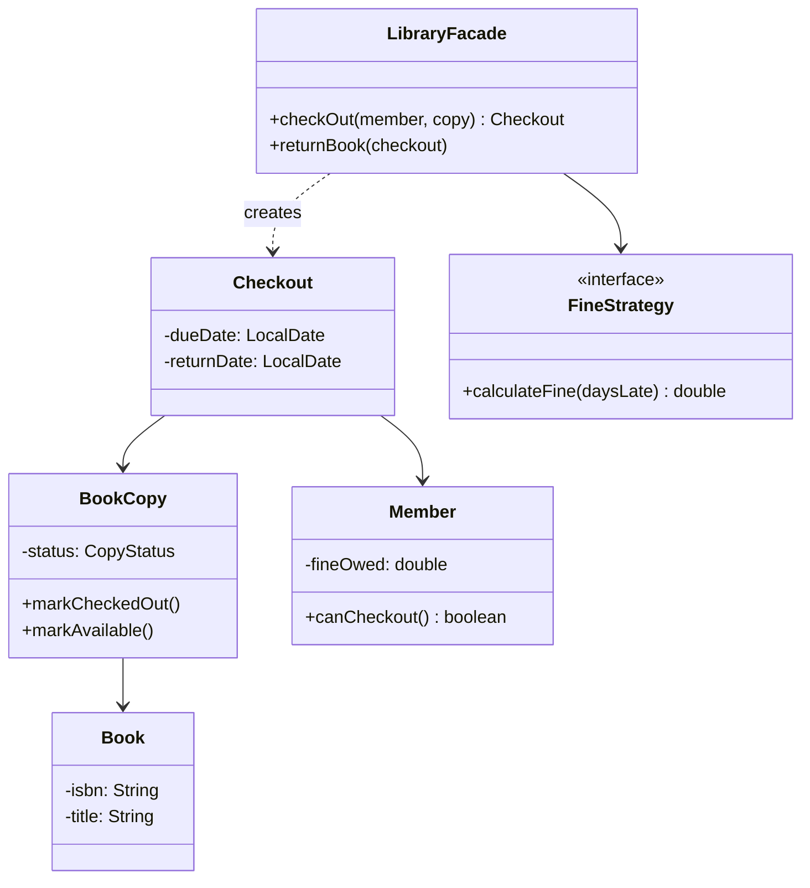
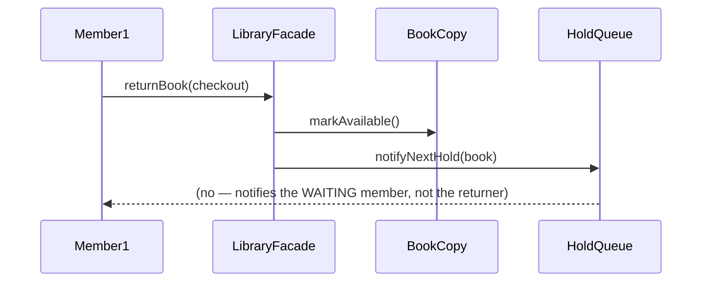

## Phase 1: Clarified Requirements

- Members can search the catalog, check out and return physical copies, and place holds on
  currently-unavailable titles.
- Overdue returns incur a fine, calculated per day late.
- A library may have multiple physical copies of the same book title.
- Out of scope: inter-library loans, multiple branches (mentioned as a possible extension only).

## Phase 2: Entities — The Book/BookCopy Distinction

This is the single most important entity decision in this case study, directly echoing Chapter
4's interview questions: **`Book` (the catalog metadata — title, author, ISBN) and `BookCopy` (one
physical, checkoutable item) are two separate entities**, not one.

| Noun | Classification |
|---|---|
| Book | Entity — catalog metadata, identity via ISBN |
| BookCopy | Entity — one physical instance, identity via copy ID, tracks its own availability |
| Member | Entity — identity, tracks currently-borrowed copies and fines owed |
| Checkout (Loan) | Entity — associates a `BookCopy` with a `Member` and due date |
| Hold (Reservation) | Entity — a `Member` waiting for a currently-unavailable `Book` |
| Fine | Attribute — computed value, could be promoted to its own entity if itemization is needed (Chapter 42's fee/fine precedent) |

Relationship: `Library` **composes** `BookCopy` (physical copies belong to the library's
inventory); `Book` **associates with** `BookCopy` (a catalog entry referenced by, but not owning,
its copies — a title could theoretically be cataloged before any copies are acquired).

## Phase 3: Class Diagram

```java
class Book {
    private final String isbn;
    private final String title;
    private final String author;
}

enum CopyStatus { AVAILABLE, CHECKED_OUT, ON_HOLD, LOST }

class BookCopy {
    private final String copyId;
    private final Book book;
    private CopyStatus status = CopyStatus.AVAILABLE;

    void markCheckedOut() { status = CopyStatus.CHECKED_OUT; }
    void markAvailable() { status = CopyStatus.AVAILABLE; }
}

class Member {
    private final String memberId;
    private final List<Checkout> activeCheckouts = new ArrayList<>();
    private double fineOwed;

    boolean canCheckout() { return fineOwed == 0 && activeCheckouts.size() < MAX_CHECKOUTS; }
}

class Checkout {
    private final BookCopy copy;
    private final Member member;
    private final LocalDate dueDate;
    private LocalDate returnDate; // null until returned
}
```

**Fine calculation uses Strategy (Chapter 28)** — different membership tiers might have different
late-fee rates, an interchangeable-algorithm shape:

```java
interface FineStrategy {
    double calculateFine(long daysLate);
}

class StandardFineStrategy implements FineStrategy {
    public double calculateFine(long daysLate) {
        return daysLate <= 0 ? 0 : daysLate * 0.50;
    }
}
```

**The checkout/hold workflow uses a Facade (Chapter 25)** — coordinating `BookCopy`, `Member`, and
`Checkout` creation behind one entry point:

```java
class LibraryFacade {
    private final FineStrategy fineStrategy;

    Checkout checkOut(Member member, BookCopy copy) {
        if (!member.canCheckout()) {
            throw new IllegalStateException("Member cannot check out: limit reached or fines owed");
        }
        if (copy.getStatus() != CopyStatus.AVAILABLE) {
            throw new IllegalStateException("Copy not available");
        }
        copy.markCheckedOut();
        Checkout checkout = new Checkout(copy, member, LocalDate.now().plusWeeks(3));
        member.addCheckout(checkout);
        return checkout;
    }

    void returnBook(Checkout checkout) {
        checkout.setReturnDate(LocalDate.now());
        long daysLate = ChronoUnit.DAYS.between(checkout.getDueDate(), checkout.getReturnDate());
        if (daysLate > 0) {
            checkout.getMember().addFine(fineStrategy.calculateFine(daysLate));
        }
        checkout.getCopy().markAvailable();
        notifyNextHold(checkout.getCopy().getBook()); // Observer, see below
    }
}
```

**Notifying waiting members uses Observer (Chapter 29)** — when a book becomes available, an
unknown number of members holding it need to be notified:

```java
interface HoldObserver {
    void onBookAvailable(Book book);
}

class HoldQueue implements Subject {
    private final Map<Book, Queue<Member>> holdsByBook = new HashMap<>();

    void placeHold(Book book, Member member) {
        holdsByBook.computeIfAbsent(book, k -> new LinkedList<>()).add(member);
    }

    void notifyNextHold(Book book) {
        Queue<Member> queue = holdsByBook.get(book);
        if (queue != null && !queue.isEmpty()) {
            Member next = queue.poll();
            next.notify("Your held book is now available: " + book.getTitle());
        }
    }
}
```



## Phase 4: Sequence Trace — Return Triggers a Hold Notification



Tracing this surfaces an important naming clarity point: the member being notified is whoever is
**next in the hold queue**, not the member who just returned the book — worth stating explicitly
when narrating this design, exactly per Chapter 44's "narrate non-obvious decisions" guidance.

## Phase 5: Curveball — "What If a Held Book's Copy Is Lost Before the Holder Picks It Up?"

Trace impact: `BookCopy.status` transitions to `LOST` instead of `AVAILABLE`;
`LibraryFacade` (or a dedicated `InventoryService`) needs a path to skip that copy and either find
another available copy of the same `Book` or leave the hold queued — `HoldQueue` and `Checkout`
require no structural changes; only the specific transition logic inside the return/inventory-
update flow needs the new case handled.

## Summary

- The `Book`/`BookCopy` split is the single highest-value entity decision in this case study —
  conflating them breaks multi-copy support and inventory tracking.
- Fine calculation is Strategy; overall checkout/return orchestration is Facade; hold notification
  is Observer — three patterns combined for three genuinely distinct sub-problems.
- `Member.canCheckout()` centralizing eligibility logic (fines owed, checkout limit) in one place
  is a direct SRP application, keeping this business rule from being duplicated across callers.

---

## Interview Questions

**1. Why are `Book` and `BookCopy` modeled as two separate entities rather than one?**
`Book` represents catalog metadata (title, author, ISBN) shared across every physical copy;
`BookCopy` represents one specific, individually-trackable physical item with its own availability
status. Conflating them would make it impossible to represent "the library owns 3 copies of this
title, 2 are checked out" — a core requirement.

**2. Why does `Member.canCheckout()` check both fines owed and checkout limit in one method rather
than as two separate checks the caller performs?**
Centralizing eligibility logic in one place (SRP, Chapter 7) ensures the rule is defined once and
can't drift out of sync if a caller forgets one of the two checks — any future eligibility rule
addition (e.g., "no checkouts if account is suspended") only requires modifying this one method.

**3. How would you unit test `LibraryFacade.returnBook()` to verify a fine is correctly applied
only when the return is genuinely late?**
Construct a `Checkout` with a past due date, call `returnBook()`, and assert `member.fineOwed`
increased by the expected amount; separately, test an on-time return and assert `fineOwed` remains
unchanged — both cases exercising the same method's conditional logic.

**4. Why does `HoldQueue` use a `Queue<Member>` per book rather than a single list of all holds
across every book?**
Holds need to be resolved per-title, in FIFO order, when that specific title becomes available — a
single combined list would require filtering by book on every notification, while a
`Map<Book, Queue<Member>>` gives direct, efficient access to exactly the relevant waiting members.

**5. Is `HoldQueue`'s notification mechanism Observer or Mediator, given it coordinates between
`BookCopy` availability and `Member` notification?**
Observer — it's asymmetric (availability changes broadcast to waiting members; members don't
broadcast back through the same relationship) and one-directional, unlike Mediator's symmetric
peer coordination (Chapter 29 vs. 35's distinguishing test).

**6. How would you extend `FineStrategy` to support a "grace period" (no fine for the first day
late)?**
Modify or add a new `FineStrategy` implementation checking `daysLate > 1` before applying any
charge — `LibraryFacade` requires no changes, since it depends only on the `FineStrategy`
interface.

**7. Why is `Checkout.returnDate` nullable rather than requiring a value at construction?**
A `Checkout` genuinely doesn't have a return date until the book is actually returned — modeling
this as nullable (or an `Optional<LocalDate>`) accurately reflects that the checkout has two
distinct lifecycle phases; forcing a placeholder value at construction would misrepresent an
unknown, not-yet-determined fact as if it were known.

**8. How would you prevent two members from simultaneously checking out the last available copy
of a book, connecting to Chapter 40?**
`LibraryFacade.checkOut()`'s check-then-mark-unavailable sequence must be atomic — protected by a
lock scoped to the specific `BookCopy` (or the library's copy-inventory state generally), exactly
mirroring Chapter 45's `findAndReserveSpot()` atomicity discussion.

**9. Why might "Fine" eventually be promoted from an attribute to its own entity, per Chapter 42's
precedent?**
If fines need to be itemized (separate fine records per overdue checkout, individually payable or
disputable) rather than a single running total, "Fine" would need its own identity and lifecycle,
exactly mirroring the fee-itemization discussion in Chapter 42.

**10. How would you extend this design to support multiple library branches sharing a combined
catalog?**
Introduce a `Branch` entity that `BookCopy` associates with (each copy belongs to exactly one
branch's physical inventory), while `Book` (catalog metadata) remains shared across all branches —
`LibraryFacade` would need branch-aware logic for locating an available copy, potentially across
branches.

**11. Why does `LibraryFacade` depend on `FineStrategy` as an interface rather than hardcoding the
$0.50/day calculation directly?**
This follows DIP (Chapter 11) and anticipates the kind of variation (different rates per
membership tier, promotional grace periods) that's common in real library systems — even without
an explicit multi-tier requirement stated, this is a reasonable default given how frequently fee
calculation varies in similar problems throughout this series.

**12. What's the risk of `BookCopy` holding a direct reference to `Checkout`, rather than
`Checkout` referencing `BookCopy`?**
This would invert an appropriate dependency direction — a `BookCopy`'s checkout history is better
modeled as `Checkout` records referencing the copy (association, Chapter 4), not the reverse, since
a copy's core identity and status shouldn't need to hold a growing list of all its historical
checkouts internally.

**13. How would you extend the design to notify a member automatically a day before their due
date, in addition to the return-triggered hold notification?**
This is a genuinely different trigger (time-based, not event-based) — likely requiring a scheduled
background job (outside `LibraryFacade`'s direct responsibility) that queries active checkouts
nearing their due date and sends reminders, potentially reusing the same `HoldObserver`-style
notification interface for the actual message delivery.

**14. Summarize the three patterns this case study combines and the one entity-modeling decision
most critical to get right.**
Strategy (fine calculation), Facade (checkout/return orchestration), and Observer (hold
notification) are the three patterns; the `Book`/`BookCopy` entity split is the most critical
modeling decision — getting this wrong (treating them as one entity) breaks the design's ability
to correctly represent multi-copy inventory, which is the core requirement this entire problem is
built around.
