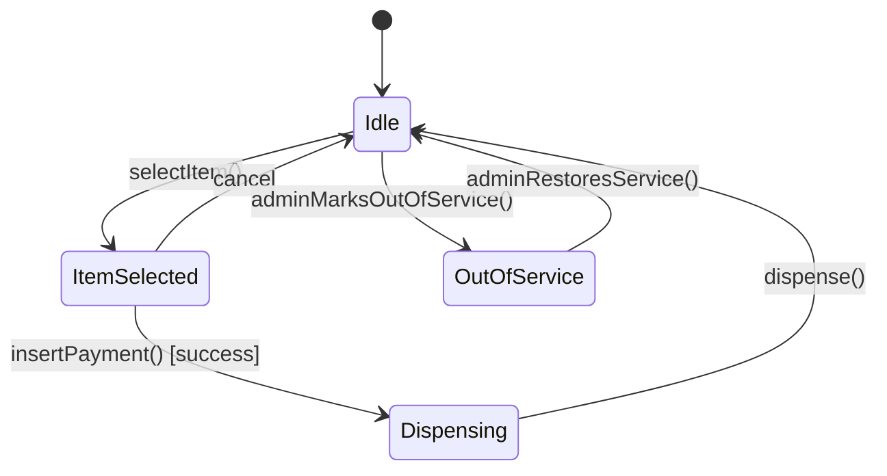
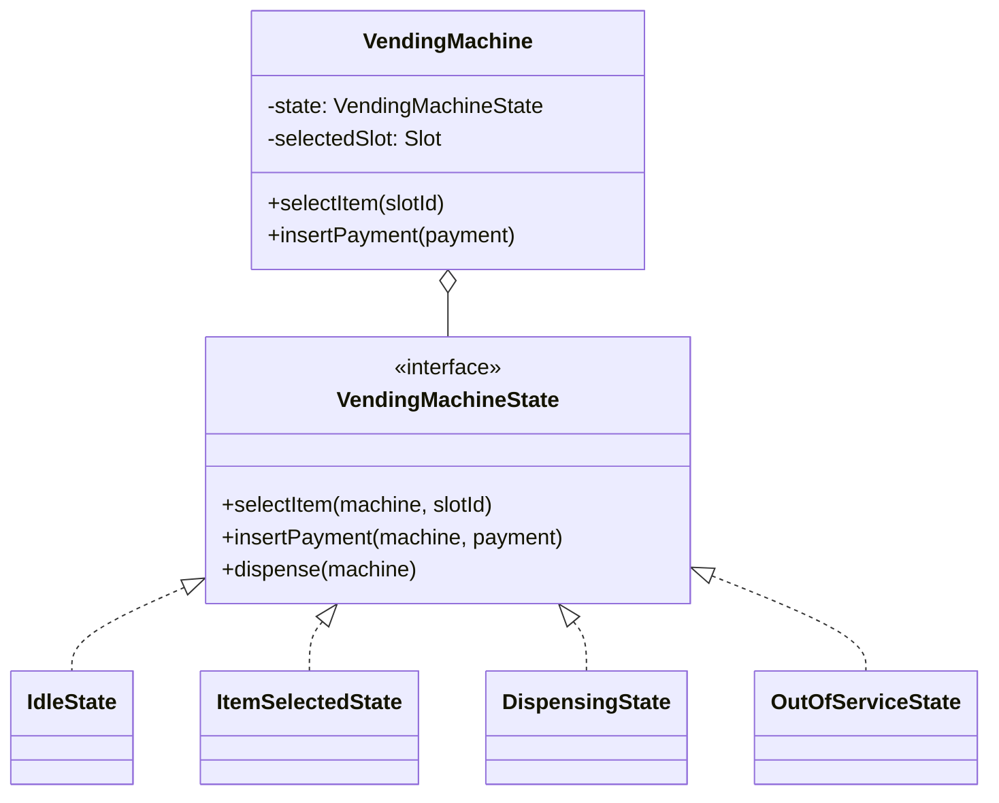
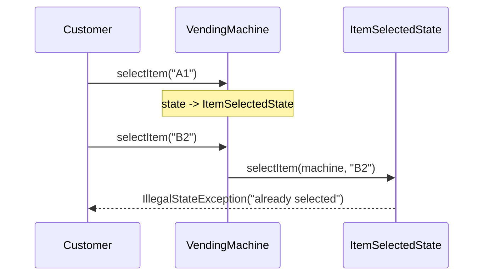

## Building on Chapter 43

Chapter 43 walked through this exact problem's initial class-diagram construction in full,
narrated detail — `Item`, `Slot`, `PaymentMethod` (Strategy), and `VendingMachine` as a
Facade-shaped coordinator. This chapter takes that foundation and extends it to full case-study
depth, adding the machine-state dimension previewed at the end of Chapter 43.

## Phase 1: Clarified Requirements (Extending Chapter 43's Scope)

- Everything from Chapter 43: multiple slots, multiple items, cash and card payment.
- **New:** the machine has explicit operational states — Idle, Item Selected, Payment Processing,
  Dispensing, Out of Service — and should reject invalid actions given its current state (e.g.,
  can't select an item while already dispensing).
- Out of scope: physical motor/sensor control, remote fleet monitoring.

## Phase 2: Entities (Recap Plus One Addition)

Everything from Chapter 43 (`Item`, `Slot`, `PaymentMethod`, `VendingMachine`) remains — the new
addition is `VendingMachineState`, directly justified by the newly-clarified requirement that the
machine's behavior must change based on its own lifecycle stage. This is exactly the State
pattern's (Chapter 31) defining trigger, distinct from `PaymentMethod`'s Strategy shape.

## Phase 3: Class Diagram — Layering State on Top of the Existing Design

```java
interface VendingMachineState {
    void selectItem(VendingMachine machine, String slotId);
    void insertPayment(VendingMachine machine, PaymentMethod payment);
    void dispense(VendingMachine machine);
}

class IdleState implements VendingMachineState {
    public void selectItem(VendingMachine machine, String slotId) {
        Slot slot = machine.getSlot(slotId);
        if (slot == null || !slot.isAvailable()) {
            throw new IllegalStateException("Item unavailable");
        }
        machine.setSelectedSlot(slot);
        machine.setState(new ItemSelectedState());
    }
    public void insertPayment(VendingMachine machine, PaymentMethod payment) {
        throw new IllegalStateException("Select an item first");
    }
    public void dispense(VendingMachine machine) {
        throw new IllegalStateException("No item selected");
    }
}

class ItemSelectedState implements VendingMachineState {
    public void selectItem(VendingMachine machine, String slotId) {
        throw new IllegalStateException("Item already selected — insert payment or cancel");
    }
    public void insertPayment(VendingMachine machine, PaymentMethod payment) {
        double price = machine.getSelectedSlot().getItem().getPrice();
        if (payment.pay(price)) {
            machine.setState(new DispensingState());
            machine.dispenseCurrentSelection(); // trigger dispense immediately on successful payment
        } else {
            throw new IllegalStateException("Payment failed");
        }
    }
    public void dispense(VendingMachine machine) {
        throw new IllegalStateException("Insert payment first");
    }
}

class DispensingState implements VendingMachineState {
    public void selectItem(VendingMachine machine, String slotId) {
        throw new IllegalStateException("Currently dispensing");
    }
    public void insertPayment(VendingMachine machine, PaymentMethod payment) {
        throw new IllegalStateException("Currently dispensing");
    }
    public void dispense(VendingMachine machine) {
        machine.getSelectedSlot().dispense();
        machine.setState(new IdleState());
    }
}

class OutOfServiceState implements VendingMachineState {
    public void selectItem(VendingMachine machine, String slotId) {
        throw new IllegalStateException("Machine out of service");
    }
    public void insertPayment(VendingMachine machine, PaymentMethod payment) {
        throw new IllegalStateException("Machine out of service");
    }
    public void dispense(VendingMachine machine) {
        throw new IllegalStateException("Machine out of service");
    }
}
```

```java
class VendingMachine {
    private final Map<String, Slot> slots;
    private VendingMachineState state = new IdleState();
    private Slot selectedSlot;

    void setState(VendingMachineState state) { this.state = state; }
    void setSelectedSlot(Slot slot) { this.selectedSlot = slot; }
    Slot getSelectedSlot() { return selectedSlot; }

    void selectItem(String slotId) { state.selectItem(this, slotId); }
    void insertPayment(PaymentMethod payment) { state.insertPayment(this, payment); }
    void dispenseCurrentSelection() { state.dispense(this); }
}
```

**Notice `PaymentMethod` (Strategy) and `Slot`/`Item` from Chapter 43 required zero changes** —
exactly the layering outcome previewed at the end of that chapter: the State pattern governs
`VendingMachine`'s top-level lifecycle, while the underlying payment and dispensing mechanics
remain independently stable.





## Phase 4: Sequence Trace — Invalid Action Rejected by Current State



This trace is exactly what the newly-clarified requirement ("reject invalid actions given current
state") demanded — and it's now enforced structurally by which state object is currently active,
not by a scattered set of conditionals inside `VendingMachine` itself.

## Phase 5: Curveball — "Support a 'Cancel' Button at Any Point Before Dispensing"

Trace impact: add a `cancel(VendingMachine machine)` method to the `VendingMachineState`
interface. `IdleState.cancel()` is a no-op; `ItemSelectedState.cancel()` clears the selection and
transitions back to `IdleState`; `DispensingState.cancel()` should likely throw (dispensing has
already started — too late to cancel). **This is a genuine interface modification touching every
existing state class** — the acknowledged "add a new operation" cost from Chapter 31's OCP
discussion, not a cost-free extension.

## Summary

- This case study demonstrates the exact layering discussed at the end of Chapter 43: adding a
  State-governed machine lifecycle on top of an already-stable Strategy-based payment design,
  with zero disruption to the earlier work.
- The clarified requirement "reject invalid actions given current state" is the direct textbook
  trigger for State (Chapter 31) — each state's own methods enforce exactly which actions are
  legal from that state, replacing what would otherwise be a growing set of status-checking
  conditionals.
- Adding `cancel()` as a new capability is a genuine, acknowledged cost (touching every existing
  state class) — worth naming explicitly rather than claiming the design has zero extension cost
  in every direction.

---

## Interview Questions

**1. Why does adding the "reject invalid actions based on current state" requirement specifically
trigger reaching for the State pattern rather than adding conditionals to `VendingMachine`
directly?**
The requirement describes behavior that changes based on the machine's own lifecycle stage, with
the machine itself driving transitions between stages — exactly Chapter 31's State pattern
trigger. Adding conditionals directly to `VendingMachine` would reproduce the growing,
centralized-conditional anti-pattern State is specifically designed to eliminate.

**2. Why do `PaymentMethod` and `Slot` require zero changes when the State pattern is layered on
top of the existing design?**
State governs *whether and when* `VendingMachine`'s top-level actions are permitted — it doesn't
change *how* payment or dispensing mechanics themselves work, which remain the separate,
independent responsibilities of `PaymentMethod` and `Slot` respectively; the two concerns are
orthogonal.

**3. How would you unit test that `ItemSelectedState.insertPayment()` correctly transitions to
`DispensingState` only on successful payment?**
Inject a fake `PaymentMethod` returning `true`, call `insertPayment()`, and assert the machine's
state is now `DispensingState`; separately, inject a fake returning `false` and assert the state
remains `ItemSelectedState` (or throws, per the shown implementation) rather than transitioning.

**4. Why does `ItemSelectedState.insertPayment()` immediately call
`machine.dispenseCurrentSelection()` rather than requiring a separate customer action to trigger
dispensing?**
This reflects a reasonable interpretation of vending machine UX — once payment succeeds, dispensing
should happen automatically, without requiring an additional customer action; this is a design
choice worth explicitly confirming with an interviewer if genuinely ambiguous, per Chapter 41's
clarification discipline.

**5. What's the specific, acknowledged cost of adding the `cancel()` requirement, and why is
naming this cost explicitly a stronger interview answer than claiming zero cost?**
Adding `cancel()` requires modifying the `VendingMachineState` interface and every existing
implementation — the same "new operation touches every existing element" cost discussed for
Abstract Factory (Chapter 18) and State (Chapter 31) itself. Naming this explicitly, rather than
glossing over it, demonstrates honest, complete understanding of the pattern's actual trade-off
profile, per Chapter 44's "narrate reasoning" guidance.

**6. Why is `OutOfServiceState` a reasonable state to include even though it wasn't part of
Chapter 43's original, simpler design?**
The newly-clarified requirement (explicit machine states including "out of service") directly
calls for it — this is exactly the kind of requirement-driven extension Chapter 41 and Chapter 44
distinguish from unjustified, speculative over-engineering: it's built because it was asked for,
not preemptively guessed at.

**7. How would you extend this design to log every state transition for auditing purposes?**
Add a call to a logging component inside `VendingMachine.setState()` itself (the single, central
point where every transition passes through), rather than duplicating logging calls inside every
individual state class's transition logic — centralizing this cross-cutting concern in the one
place all transitions funnel through.

**8. Is `VendingMachine.setState()` itself a good candidate for the Observer pattern, notifying
external systems of every state change?**
Yes — this is a natural, low-risk extension: `VendingMachine` could implement `Subject`
(Chapter 29), calling `notifyObservers()` inside `setState()`, letting external systems (a fleet
monitoring dashboard, previously named as out of scope but a reasonable future extension) react to
state changes without `VendingMachine`'s core logic needing any awareness of who's listening.

**9. Why might `DispensingState.dispense()` calling `machine.getSelectedSlot().dispense()`
represent an acceptable Law of Demeter case, per Chapter 13's exception?**
`Slot` is a simple, stable entity (per Chapter 43's own reasoning) — chaining through it via
`getSelectedSlot().dispense()` is a low-risk, acceptable case, similar to the
`slot.getItem().getPrice()` judgment call made in Chapter 43 itself.

**10. How would you handle a scenario where payment succeeds but the physical dispense mechanism
(simulated) fails, given this design is explicitly out of scope for hardware modeling?**
Even without modeling real hardware, the software design should account for this failure mode
abstractly — `DispensingState.dispense()` could accept a possible failure signal and transition to
a different state (perhaps back to `ItemSelectedState` with a note to refund, or directly to
`OutOfServiceState`) rather than assuming dispensing always succeeds once triggered; worth raising
this edge case explicitly with the interviewer even though hardware itself is out of scope.

**11. Why does this case study use a full `VendingMachineState` interface with three methods
rather than a simpler boolean "isIdle" flag on `VendingMachine`?**
A boolean flag would need to be checked and validated inside every one of `VendingMachine`'s own
methods, reproducing centralized conditional logic — the whole point of State is moving that
validation and behavior into per-state classes, which a simple boolean flag doesn't achieve.

**12. How would you decide whether `cancel()` belongs on the shared `VendingMachineState`
interface at all, versus being handled entirely inside `VendingMachine` itself, connecting to
Chapter 23's ISP discussion of `add()`?**
Since every state has *some* meaningful (even if sometimes rejecting) response to a cancel
request, including it on the shared interface is reasonable and doesn't reproduce the
LSP/ISP tension discussed for `File.add()` in Chapter 23 — every implementer can honestly provide
a `cancel()` implementation, even if some simply reject the action.

**13. If a future requirement introduced a "maintenance mode" allowing an admin to restock slots
without fully taking the machine `OutOfService`, how would you extend the design?**
Introduce a new `MaintenanceState` implementing `VendingMachineState`, rejecting customer-facing
actions (`selectItem`, `insertPayment`, `dispense`) while exposing separate, admin-specific methods
(perhaps on a separate `AdminInterface` the `VendingMachine` also implements) for restocking —
demonstrating the same "new state, zero changes to unrelated existing states" extensibility this
chapter's design was built to support.

**14. Summarize how this case study demonstrates Chapter 43's closing lesson about layering
patterns without disrupting existing work.**
The entire chapter is a direct, concrete demonstration of adding a genuinely new requirement
(explicit machine states) on top of an already-designed, working structure (Strategy-based
payment, simple `Slot`/`Item` entities) without needing to revisit or restructure any of that
earlier work — exactly the outcome Chapter 43 predicted when it introduced the State-pattern
extension as a preview at its own conclusion.
