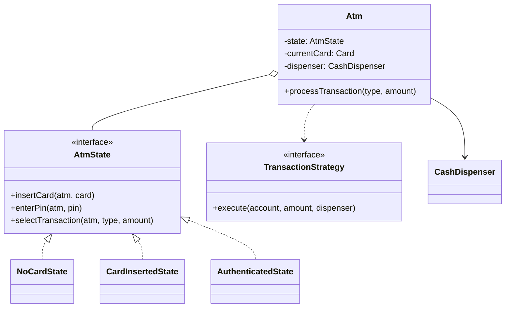
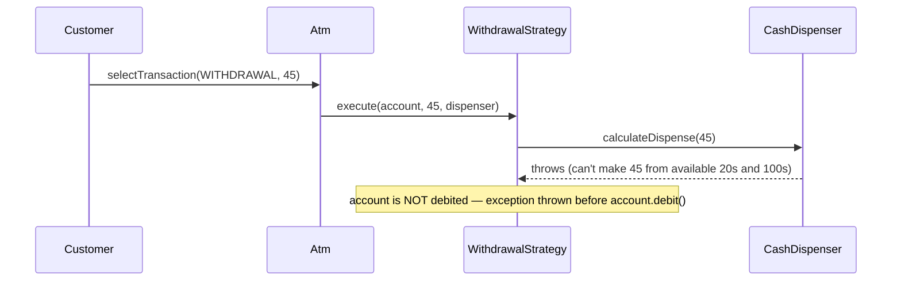

## Phase 1: Clarified Requirements

- Card inserted, PIN validated, then withdrawal, deposit, or balance inquiry.
- Cash dispensing must account for available denominations (e.g., can't dispense $15 with only
  $20 bills available).
- Out of scope: card network communication, physical hardware sensors, fraud detection.

## Phase 2: Entities

| Noun | Classification |
|---|---|
| ATM | Entity — top-level coordinator, holds cash inventory |
| Card | Entity — identity (card number), associated account |
| Account | Entity — balance, identity |
| Transaction | Entity — type, amount, identity for record-keeping |
| CashDispenser | Entity — tracks denominations, computes dispensable combinations |
| PIN | Attribute — validated, not independently referenced |

Relationship: `ATM` **composes** `CashDispenser`; `Card` **associates with** `Account`
(cards and accounts each have independent existence — closing an account doesn't destroy
previously-issued physical cards' records).

## Phase 3: Class Diagram — State Pattern for the Transaction Lifecycle

An ATM session moves through a lifecycle — no card, card inserted, PIN entered, transaction
selected, dispensing — where behavior genuinely changes at each stage and the machine itself
drives transitions. This is State (Chapter 31), not Strategy.

```java
interface AtmState {
    void insertCard(Atm atm, Card card);
    void enterPin(Atm atm, String pin);
    void selectTransaction(Atm atm, TransactionType type, double amount);
    void ejectCard(Atm atm);
}

class NoCardState implements AtmState {
    public void insertCard(Atm atm, Card card) {
        atm.setCurrentCard(card);
        atm.setState(new CardInsertedState());
    }
    public void enterPin(Atm atm, String pin) { throw new IllegalStateException("Insert card first"); }
    public void selectTransaction(Atm atm, TransactionType type, double amount) {
        throw new IllegalStateException("Insert card first");
    }
    public void ejectCard(Atm atm) { /* no-op */ }
}

class CardInsertedState implements AtmState {
    public void insertCard(Atm atm, Card card) { throw new IllegalStateException("Card already inserted"); }
    public void enterPin(Atm atm, String pin) {
        if (atm.getCurrentCard().validatePin(pin)) {
            atm.setState(new AuthenticatedState());
        } else {
            atm.incrementFailedAttempts();
            if (atm.getFailedAttempts() >= 3) {
                atm.setState(new CardRetainedState());
            }
        }
    }
    public void selectTransaction(Atm atm, TransactionType type, double amount) {
        throw new IllegalStateException("Enter PIN first");
    }
    public void ejectCard(Atm atm) { atm.setState(new NoCardState()); }
}

class AuthenticatedState implements AtmState {
    public void insertCard(Atm atm, Card card) { throw new IllegalStateException("Already authenticated"); }
    public void enterPin(Atm atm, String pin) { throw new IllegalStateException("Already authenticated"); }
    public void selectTransaction(Atm atm, TransactionType type, double amount) {
        atm.processTransaction(type, amount); // delegates to Strategy — see below
        atm.setState(new NoCardState()); // eject after one transaction, per typical ATM flow
    }
    public void ejectCard(Atm atm) { atm.setState(new NoCardState()); }
}
```

**Transaction processing uses Strategy (Chapter 28)** — withdrawal, deposit, and balance inquiry
are interchangeable operations, selected once per request:

```java
interface TransactionStrategy {
    void execute(Account account, double amount, CashDispenser dispenser);
}

class WithdrawalStrategy implements TransactionStrategy {
    public void execute(Account account, double amount, CashDispenser dispenser) {
        if (account.getBalance() < amount) throw new IllegalStateException("Insufficient funds");
        Map<Integer, Integer> denominations = dispenser.calculateDispense(amount); // see below
        dispenser.dispense(denominations);
        account.debit(amount);
    }
}

class DepositStrategy implements TransactionStrategy {
    public void execute(Account account, double amount, CashDispenser dispenser) {
        account.credit(amount);
    }
}
```

**Cash dispensing is a greedy denomination algorithm** — the specific domain detail worth naming
explicitly:

```java
class CashDispenser {
    private final TreeMap<Integer, Integer> inventory = new TreeMap<>(Collections.reverseOrder());
    // e.g., {100: 5, 50: 10, 20: 20, 10: 30} — denomination -> count available

    Map<Integer, Integer> calculateDispense(double amount) {
        int remaining = (int) amount;
        Map<Integer, Integer> result = new LinkedHashMap<>();
        for (Map.Entry<Integer, Integer> entry : inventory.entrySet()) {
            int denomination = entry.getKey();
            int available = entry.getValue();
            int needed = Math.min(remaining / denomination, available);
            if (needed > 0) {
                result.put(denomination, needed);
                remaining -= needed * denomination;
            }
        }
        if (remaining != 0) {
            throw new IllegalStateException("Cannot dispense exact amount with available denominations");
        }
        return result;
    }
}
```



## Phase 4: Sequence Trace — The Insufficient-Denominations Edge Case



Tracing this surfaces a critical correctness detail worth narrating explicitly: **`calculateDispense()` must be validated and succeed *before* `account.debit()` is called** — reversing this order would debit a customer's account for cash that was never actually dispensed.

## Phase 5: Curveball — "Support a Daily Withdrawal Limit"

Trace impact: `WithdrawalStrategy.execute()` gains a check against `account.getDailyWithdrawn()`
before proceeding — `DepositStrategy` and the `AtmState` hierarchy require zero changes, since the
limit is a withdrawal-specific business rule, cleanly isolated by the Strategy structure.

## Summary

- ATM session flow is State (Chapter 31); transaction type selection is Strategy (Chapter 28) —
  the same two-pattern combination as the Elevator case study, applied to a different domain.
- The greedy denomination-dispensing algorithm is the specific domain knowledge most likely to
  distinguish a strong answer — and the ordering of "validate dispensability, then dispense, then
  debit" is the single most commonly-tested correctness detail.
- `CardRetainedState` (after 3 failed PIN attempts) demonstrates that not every state transition
  needs to lead back to a "normal" state — a terminal, exceptional state is a legitimate part of
  the state graph.

---

## Interview Questions

**1. Why must `CashDispenser.calculateDispense()` succeed before `account.debit()` is called,
rather than the reverse order?**
If the account were debited first and dispensing then failed (insufficient denominations), the
customer would be charged without receiving cash — a serious correctness and trust failure.
Validating dispensability first, and only debiting after confirming cash can actually be
dispensed, avoids this entirely.

**2. Why is the ATM session modeled with State rather than a single class with a `sessionStage`
enum field and conditionals?**
The machine's own behavior (which actions are legal) genuinely changes at each stage, and the
machine drives its own transitions (`CardInsertedState.enterPin()` constructs and transitions to
`AuthenticatedState`) — exactly State's defining shape from Chapter 31, versus an enum-and-switch
approach reproducing the centralized-conditional anti-pattern.

**3. How would you unit test `CashDispenser.calculateDispense()` for the case where the exact
amount can't be made from available denominations?**
Construct a dispenser with only, say, $20 and $100 bills available, call
`calculateDispense(45)`, and assert an `IllegalStateException` is thrown — confirming the
algorithm correctly refuses rather than either dispensing a wrong amount or silently succeeding.

**4. Why is `CardRetainedState` a reasonable terminal state, and how does it differ from the
"return to Idle" pattern used elsewhere?**
After 3 failed PIN attempts, ejecting the card back to the customer would be a security risk —
retaining it is the correct real-world behavior. This demonstrates that not every state
transition needs to cycle back to normal operation; a deliberately terminal, exceptional state is
a legitimate part of the design.

**5. How would you extend `TransactionStrategy` to support a "mini statement" transaction type
that doesn't modify the account balance at all?**
Add a `MiniStatementStrategy implements TransactionStrategy` whose `execute()` reads and formats
recent transaction history without calling `debit()` or `credit()` — `Atm` and `AtmState` require
no changes, since they depend only on the shared interface.

**6. Why does `AuthenticatedState.selectTransaction()` transition back to `NoCardState`
immediately after one transaction, rather than allowing multiple transactions per session?**
This reflects a common real-world ATM UX choice (eject after one transaction for security) — worth
explicitly confirming as an assumption with the interviewer if genuinely ambiguous, since some
real ATMs do allow multiple transactions per session before ejecting, per Chapter 41's
clarification discipline.

**7. What's the risk of `CashDispenser`'s `inventory` map not being protected by any
synchronization, if multiple withdrawal transactions can occur concurrently across multiple ATM
sessions sharing the same physical cash inventory?**
Two concurrent withdrawals could both read the same available denomination counts before either
updates them, potentially over-dispensing beyond actual physical inventory — this needs the same
atomic check-then-act protection discussed in Chapter 40, applied here to denomination inventory
rather than parking spots.

**8. How would you extend the design to support a customer changing their PIN?**
Add a new transaction type and corresponding `ChangePinStrategy implements TransactionStrategy`,
requiring the old PIN for verification (already validated by the time `AuthenticatedState` is
reached) and updating the card's stored PIN — fits cleanly into the existing Strategy structure.

**9. Why is `Card` modeled as associated with, rather than composing, `Account`?**
An `Account` can exist independently of any specific `Card` (a customer could have their card
lost or reissued while the account and its balance persist unchanged) — exactly the "part can
outlive the whole" definition of association/aggregation from Chapter 4, not composition.

**10. How would you handle the interviewer asking "what if the network connection to validate the
PIN against the bank's system fails mid-transaction," given hardware/network integration is out
of scope?**
Even with network integration out of scope, the *state model* should account for this abstractly
— perhaps a `NetworkErrorState` that safely ejects the card without completing any transaction,
worth raising as a reasonable extension point even if not fully implemented, similar to the
vending machine's dispense-failure discussion in Chapter 48.

**11. Why does the greedy denomination algorithm use a `TreeMap` with reverse ordering rather than
a plain `HashMap`?**
The greedy algorithm needs to process denominations from largest to smallest to minimize the
number of bills dispensed — a `TreeMap` with reverse ordering provides this sorted iteration
directly, whereas a `HashMap` provides no ordering guarantee at all.

**12. Is the greedy denomination algorithm always guaranteed to find a valid combination if one
exists, or are there denomination sets where it could fail despite a valid combination existing?**
The greedy approach is not universally optimal for all possible denomination sets (a classic
result from algorithm theory) — for typical currency denominations (like US or most real-world
currency systems) it works correctly, but for contrived, non-standard denomination sets, greedy
can fail to find a valid combination that a more exhaustive search would find; worth mentioning
this caveat if an interviewer probes the algorithm's correctness guarantees.

**13. How would you extend this design to support multiple accounts per card (e.g., checking and
savings)?**
Add an account-selection step to the flow — perhaps a new state or a parameter on
`selectTransaction()` — and change `Card`'s association from a single `Account` to a
`List<Account>`, with `AuthenticatedState` requiring the customer to specify which account a given
transaction applies to.

**14. Summarize the two patterns this case study combines and the one correctness-ordering detail
most likely to be explicitly tested.**
State (ATM session lifecycle) and Strategy (transaction type) are the two patterns; the most
commonly-tested correctness detail is the requirement that dispensability be validated and cash
actually dispensed *before* the account is debited — reversing this order is the single most
common mistake candidates make on this specific problem.
