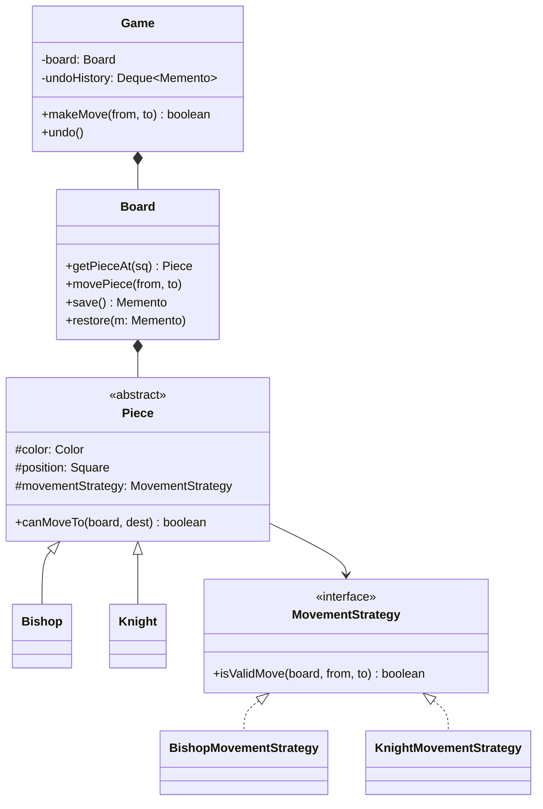
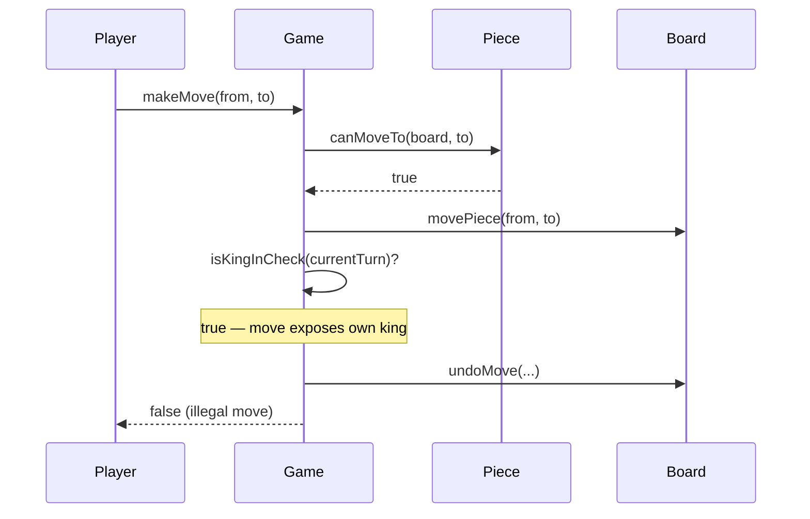

## Phase 1: Clarified Requirements

- Two players, standard 8x8 board, standard piece movement rules.
- Detect check, checkmate, and stalemate.
- Support undo of the last move.
- Out of scope: chess clocks/timers, online multiplayer networking, AI opponent.

## Phase 2: Entities

| Noun | Classification |
|---|---|
| Board | Entity — 8x8 grid, identity, current game state |
| Square | Attribute — position (row, col); could be a small value class |
| Piece | Entity — type, color, current position, movement rules |
| Player | Entity — color, identity |
| Move | Entity — from/to squares, piece moved, captured piece if any |
| Game | Entity — top-level coordinator, move history, current turn |

Relationship: `Board` **composes** `Piece` placements (pieces on the board belong to this specific
game instance); `Game` **composes** `Board` and the `Move` history.

## Phase 3: Class Diagram — Strategy for Piece Movement Rules

Each piece type has genuinely different movement logic — the exact interchangeable-algorithm
shape Chapter 28 describes, selected once per piece (not changing over a piece's lifetime, so
Strategy rather than State):

```java
interface MovementStrategy {
    boolean isValidMove(Board board, Square from, Square to);
}

class BishopMovementStrategy implements MovementStrategy {
    public boolean isValidMove(Board board, Square from, Square to) {
        boolean isDiagonal = Math.abs(to.getRow() - from.getRow()) == Math.abs(to.getCol() - from.getCol());
        return isDiagonal && board.isPathClear(from, to);
    }
}

class KnightMovementStrategy implements MovementStrategy {
    public boolean isValidMove(Board board, Square from, Square to) {
        int rowDiff = Math.abs(to.getRow() - from.getRow());
        int colDiff = Math.abs(to.getCol() - from.getCol());
        return (rowDiff == 2 && colDiff == 1) || (rowDiff == 1 && colDiff == 2);
        // note: no path-clearance check — knights jump over pieces
    }
}
```

```java
abstract class Piece {
    protected final Color color;
    protected Square position;
    protected final MovementStrategy movementStrategy;

    boolean canMoveTo(Board board, Square destination) {
        return movementStrategy.isValidMove(board, position, destination);
    }
}

class Bishop extends Piece {
    Bishop(Color color, Square position) {
        super(color, position, new BishopMovementStrategy());
    }
}
```

**Why `Piece` is an abstract class, not just an interface (Chapter 3's framework applied):** every
piece shares real state (`color`, `position`) and a real, identical method
(`canMoveTo()` delegating to its strategy) — genuine shared implementation, not just a shared
contract, which is exactly the abstract-class trigger from Chapter 3.

**Turn/game-flow orchestration uses a Facade-shaped `Game` class:**

```java
class Game {
    private final Board board;
    private Color currentTurn = Color.WHITE;
    private final Deque<Move> moveHistory = new ArrayDeque<>();

    boolean makeMove(Square from, Square to) {
        Piece piece = board.getPieceAt(from);
        if (piece == null || piece.getColor() != currentTurn) return false;
        if (!piece.canMoveTo(board, to)) return false;

        Piece captured = board.getPieceAt(to);
        board.movePiece(from, to);

        if (isKingInCheck(currentTurn)) { // moving into check is illegal — must undo
            board.undoMove(from, to, captured);
            return false;
        }

        moveHistory.push(new Move(from, to, piece, captured));
        currentTurn = (currentTurn == Color.WHITE) ? Color.BLACK : Color.WHITE;
        return true;
    }
}
```

## Where Memento (Chapter 36) Enters: Undo Support

Notice `board.undoMove(from, to, captured)` above already needs to reverse a move — this is a
**direct application of Chapter 36's Memento pattern**, since chess moves don't have a clean,
universal "inverse operation" (a captured piece must be restored, castling rights may need
restoring, etc.) — a full board **snapshot**, not an inverse operation, is the reliable approach:

```java
class Board {
    Memento save() {
        return new Memento(deepCopyOfSquares()); // deep copy — Chapter 20's discipline applies
    }

    void restore(Memento memento) {
        this.squares = memento.getSavedSquares();
    }

    static class Memento {
        private final Piece[][] savedSquares; // private — only Board can construct/read
        private Memento(Piece[][] savedSquares) { this.savedSquares = savedSquares; }
        private Piece[][] getSavedSquares() { return savedSquares; }
    }
}

class Game {
    private final Deque<Board.Memento> undoHistory = new ArrayDeque<>();

    boolean makeMove(Square from, Square to) {
        undoHistory.push(board.save()); // snapshot BEFORE the move
        // ... existing move logic ...
    }

    void undo() {
        if (!undoHistory.isEmpty()) {
            board.restore(undoHistory.pop());
            currentTurn = (currentTurn == Color.WHITE) ? Color.BLACK : Color.WHITE;
        }
    }
}
```



## Phase 4: Sequence Trace — A Move That Results in Self-Check (Illegal)



This trace surfaces a genuinely tricky rule (a move that's individually valid for the piece but
illegal because it exposes the mover's own king) — exactly the kind of edge case sequence tracing
is designed to catch before coding, per Chapter 43's Decision 5.

## Phase 5: Curveball — "Add Castling Support"

Trace impact: castling is a special move involving **two** pieces (King and Rook) simultaneously —
it doesn't fit `MovementStrategy`'s single-piece `isValidMove()` signature cleanly. This is
appropriately handled as a special case inside `Game.makeMove()` (checking for the castling
pattern explicitly) rather than forcing it into the `MovementStrategy` abstraction — **explicitly
naming this as a case where the existing abstraction doesn't cleanly extend**, per Chapter 44's
guidance on honest, non-defensive handling of design gaps, is a stronger answer than pretending
`MovementStrategy` accommodates it perfectly.

## Summary

- Piece movement is Strategy (Chapter 28); `Piece` is an abstract class per Chapter 3's shared-
  state trigger; undo is Memento (Chapter 36), not Command's inverse-operation approach, because
  chess moves have no clean universal inverse.
- The "move into check is illegal" rule is the sequence-trace-surfaced edge case most likely to
  reveal whether a candidate is thinking through real game rules or just piece-movement mechanics.
- Castling is a valuable, honest example of a requirement that doesn't fit the existing
  abstraction perfectly — acknowledging this directly is stronger than forcing an awkward fit.

---

## Interview Questions

**1. Why is piece movement modeled with Strategy rather than State, given both patterns were
introduced with similar "one behavior varies" framing?**
A piece's movement rule doesn't change over its lifetime, and no movement strategy references or
transitions to another (a `BishopMovementStrategy` never becomes a `KnightMovementStrategy`) —
exactly Chapter 31's distinguishing test: Strategy is selected once and stays fixed; State's
implementations actively drive transitions between each other.

**2. Why is `Piece` an abstract class rather than an interface, per Chapter 3's decision
framework?**
Every piece shares real, identical state (`color`, `position`) and identical behavior
(`canMoveTo()` delegating to its strategy) — genuine shared implementation to avoid duplicating,
which is exactly the abstract-class trigger, not a pure-contract-only interface situation.

**3. Why does undo use Memento rather than Command's inverse-operation approach from Chapter 30?**
A chess move has no clean, universally-computable inverse — reversing a capture requires
restoring the captured piece; reversing castling requires restoring both pieces' original
positions and castling rights. Chapter 36 established Memento as necessary precisely when an
action's effect can't be cleanly inverted — a full snapshot is the reliable approach here.

**4. How would you unit test that `Game.makeMove()` correctly rejects a move that would expose the
mover's own king to check?**
Construct a board position where moving a specific piece would expose the king, call
`makeMove()`, and assert it returns `false` and the board state is unchanged from before the
attempted move (verifying the undo-on-self-check logic actually restores the prior position
correctly).

**5. Why does `Board.save()` need to perform a deep copy of the piece array, connecting to
Chapter 20's Prototype discussion?**
If `Piece` objects themselves were mutable and shared by reference between the live board and the
saved memento, later moves could silently corrupt the "saved" snapshot — exactly the shallow-copy
danger Chapter 20 warned about, requiring either deep-copying pieces or treating them as
immutable value objects reconstructed fresh on each move.

**6. How would you extend `MovementStrategy` to support pawn promotion (a pawn reaching the far
rank becomes a queen, rook, bishop, or knight)?**
This is a genuinely different kind of event than movement validation — likely handled as a
post-move check inside `Game.makeMove()` (detecting a pawn reaching the final rank and prompting
piece-type selection), rather than forcing it into `PawnMovementStrategy.isValidMove()`, similar
in spirit to how castling was handled as a special case outside the core Strategy abstraction.

**7. Why is `Square` treated as an attribute/value class rather than a full entity with its own
identity tracked elsewhere?**
A square's identity is fully determined by its row/column coordinates — two `Square(3, 4)`
instances are interchangeable and don't need independent tracking or a separate identity beyond
their coordinate values, unlike `Piece` or `Move`, which have meaningful identity and state beyond
simple coordinate data.

**8. How would you detect checkmate, and which existing method does this detection primarily
build on?**
Checkmate is detected when the current player is in check AND no legal move exists that would
remove the check — this builds directly on the "does this move result in self-check" logic already
used in `makeMove()`, applied exhaustively across every piece and every possible destination
square for the player in check.

**9. Why does `KnightMovementStrategy.isValidMove()` skip the `board.isPathClear()` check that
`BishopMovementStrategy` uses?**
Knights move by jumping over other pieces — path clearance is genuinely irrelevant to a knight's
movement validity, unlike a bishop's diagonal slide, which must be blocked by any intervening
piece; this is a correct, deliberate difference in each strategy's own logic, not an inconsistency.

**10. How would you extend the design to support a move-history "replay" feature, showing the
board's state after each move in sequence?**
Since `Game` already saves a `Board.Memento` before every move, stepping forward through the
`undoHistory` stack (or a separate, non-popping history list) and calling `restore()` on each
snapshot in sequence directly enables replay — a natural extension of the already-built Memento
infrastructure.

**11. Why might `Game.makeMove()`'s responsibility (validating, moving, checking for self-check,
undoing if illegal, updating turn) be considered a candidate for splitting into smaller methods,
per Chapter 7's SRP discussion?**
While `Game` legitimately coordinates the overall move sequence (a Facade-like responsibility),
extracting `isKingInCheck()` and the illegal-move-undo logic into clearly-named private helper
methods (as partially shown) improves readability without violating SRP, since the overall
responsibility — "orchestrate one move attempt" — remains cohesive; over-splitting into unrelated
classes would be unnecessary given how tightly these steps belong together.

**12. How would you handle the interviewer asking "what if two threads attempt moves on the same
game simultaneously," connecting to Chapter 40?**
`Game.makeMove()` mutates shared state (`board`, `currentTurn`, `undoHistory`) — if concurrent
access is a genuine requirement (unlikely for a two-player, turn-based game unless supporting
some form of networked play), the entire move-validation-and-execution sequence would need atomic
protection, following the same reasoning as `findAndReserveSpot()` in Chapter 45.

**13. Why is castling described as "not fitting the `MovementStrategy` abstraction cleanly," and
why is naming this explicitly a stronger answer than silently forcing a fit?**
`MovementStrategy.isValidMove()` is scoped to one piece's single-square movement; castling
involves two pieces moving simultaneously with additional stateful conditions (neither piece has
moved before, no pieces between them, king not moving through check) — forcing this into the
existing single-piece interface would require an awkward, misleading signature; naming this
limitation directly demonstrates the same honest design-gap acknowledgment Chapter 44 recommends
over pretending a clean fit exists.

**14. Summarize the three patterns this case study combines and the one rule-correctness detail
most likely to distinguish a strong candidate.**
Strategy (piece movement), an abstract class per Chapter 3 (shared piece state), and Memento
(undo via full snapshot) are the three key structural decisions; the "a move that would expose
your own king to check is illegal, even if the piece's movement itself is otherwise valid" rule is
the detail most likely to separate a candidate who deeply understands chess rules from one who's
only modeled basic piece movement.
