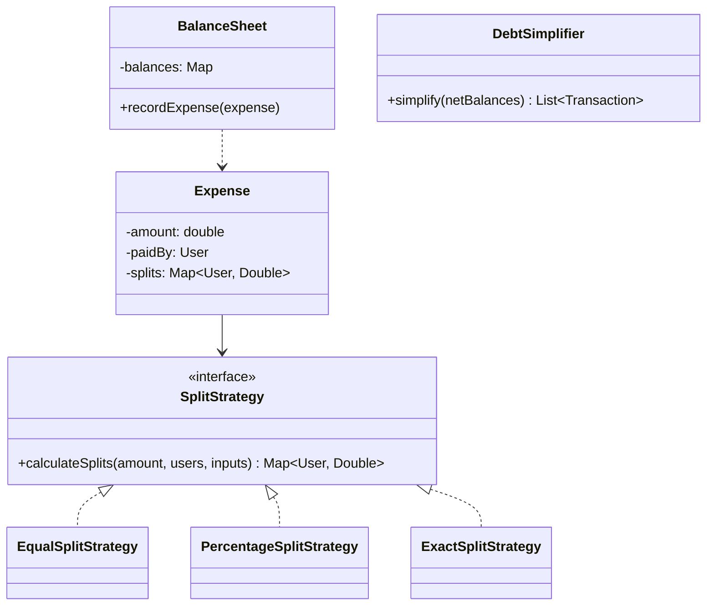
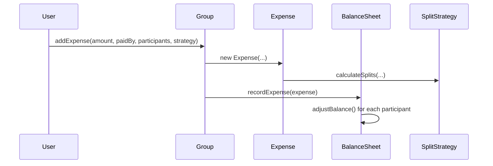

## Phase 1: Clarified Requirements

- Users can create groups, add expenses, and split them equally, by exact amounts, or by
  percentage.
- The system tracks who owes whom, and shows a simplified summary of debts within a group.
- Out of scope: actual payment processing/settlement, currency conversion.

## Phase 2: Entities

| Noun | Classification |
|---|---|
| User | Entity — identity |
| Group | Entity — a set of users, identity |
| Expense | Entity — amount, payer, split details, identity |
| Split | Entity — one user's share of one expense |
| Balance | Attribute (computed) — could be derived on demand or cached |

Relationship: `Group` **aggregates** `User` (users exist independently of any group and can belong
to multiple groups); `Expense` **composes** `Split` (splits don't exist independently of the
expense they belong to); `Expense` **associates with** `User` (the payer).

## Phase 3: Class Diagram — Strategy for Split Calculation

"Equally, by exact amounts, or by percentage" is the textbook interchangeable-algorithm shape —
one calculation approach selected once per expense:

```java
interface SplitStrategy {
    Map<User, Double> calculateSplits(double totalAmount, List<User> participants,
                                       Map<User, Double> inputValues);
}

class EqualSplitStrategy implements SplitStrategy {
    public Map<User, Double> calculateSplits(double totalAmount, List<User> participants,
                                              Map<User, Double> inputValues) {
        double share = totalAmount / participants.size();
        Map<User, Double> result = new HashMap<>();
        for (User user : participants) result.put(user, share);
        return result;
    }
}

class PercentageSplitStrategy implements SplitStrategy {
    public Map<User, Double> calculateSplits(double totalAmount, List<User> participants,
                                              Map<User, Double> inputValues) { // inputValues: percentages
        double totalPercentage = inputValues.values().stream().mapToDouble(Double::doubleValue).sum();
        if (Math.abs(totalPercentage - 100.0) > 0.01) {
            throw new IllegalArgumentException("Percentages must sum to 100");
        }
        Map<User, Double> result = new HashMap<>();
        for (User user : participants) {
            result.put(user, totalAmount * (inputValues.get(user) / 100.0));
        }
        return result;
    }
}

class ExactSplitStrategy implements SplitStrategy {
    public Map<User, Double> calculateSplits(double totalAmount, List<User> participants,
                                              Map<User, Double> inputValues) { // inputValues: exact amounts
        double sum = inputValues.values().stream().mapToDouble(Double::doubleValue).sum();
        if (Math.abs(sum - totalAmount) > 0.01) {
            throw new IllegalArgumentException("Exact amounts must sum to total");
        }
        return new HashMap<>(inputValues);
    }
}
```

```java
class Expense {
    private final double amount;
    private final User paidBy;
    private final Map<User, Double> splits; // computed once, at creation

    Expense(double amount, User paidBy, List<User> participants, SplitStrategy strategy,
            Map<User, Double> inputValues) {
        this.amount = amount;
        this.paidBy = paidBy;
        this.splits = strategy.calculateSplits(amount, participants, inputValues);
    }
}
```

**Balance tracking uses a ledger, not a running per-pair total** — the design decision most worth
narrating explicitly:

```java
class BalanceSheet {
    // balances.get(A).get(B) = amount A owes B (negative means B owes A)
    private final Map<User, Map<User, Double>> balances = new HashMap<>();

    void recordExpense(Expense expense) {
        for (Map.Entry<User, Double> entry : expense.getSplits().entrySet()) {
            User owes = entry.getKey();
            if (!owes.equals(expense.getPaidBy())) {
                adjustBalance(owes, expense.getPaidBy(), entry.getValue());
            }
        }
    }

    private void adjustBalance(User debtor, User creditor, double amount) {
        balances.computeIfAbsent(debtor, k -> new HashMap<>())
                .merge(creditor, amount, Double::sum);
    }
}
```

## Debt Simplification — The Domain-Specific Algorithmic Detail

A group with many expenses can accumulate a tangled web of pairwise debts (A owes B, B owes C, C
owes A) — **simplification** reduces this to the minimum number of transactions needed to settle
everyone, a specific, worth-naming graph algorithm:

```java
class DebtSimplifier {
    List<Transaction> simplify(Map<User, Double> netBalances) {
        // netBalances: positive = owed money overall, negative = owes money overall
        PriorityQueue<Map.Entry<User, Double>> creditors = new PriorityQueue<>(
            (a, b) -> Double.compare(b.getValue(), a.getValue()));
        PriorityQueue<Map.Entry<User, Double>> debtors = new PriorityQueue<>(
            (a, b) -> Double.compare(a.getValue(), b.getValue()));
        // populate both queues, then greedily match largest creditor with largest debtor
        // until all balances reach zero — minimizes total transaction count
        List<Transaction> transactions = new ArrayList<>();
        // ... greedy matching loop ...
        return transactions;
    }
}
```



## Phase 4: Sequence Trace — Adding an Expense Updates the Balance Sheet



## Phase 5: Curveball — "Support Removing/Editing an Expense After It's Added"

Trace impact: this requires **reversing** a previously-recorded balance adjustment — since
`adjustBalance()` uses simple addition (`merge(..., Double::sum)`), reversing means recording the
exact negative of the original adjustment. This works cleanly *because* balances are stored as
simple additive deltas rather than derived from a recomputation — a design choice that pays off
directly here, worth pointing out explicitly.

## Summary

- Split calculation is Strategy (Chapter 28) — the textbook "select one interchangeable algorithm
  once" shape.
- Storing balances as a pairwise ledger of additive deltas (rather than recomputing from all
  expenses every time) is the specific design decision that makes both edits and simplification
  tractable.
- Debt simplification (minimizing transaction count via greedy largest-creditor/largest-debtor
  matching) is the domain-specific algorithmic detail most likely to distinguish a strong answer.

---

## Interview Questions

**1. Why is split calculation modeled with Strategy rather than three separate methods on
`Expense` (`splitEqually()`, `splitByPercentage()`, `splitExact()`)?**
Three separate methods would require `Expense`'s constructor (or calling code) to branch on which
method to call — the exact OCP violation Chapter 8 covers. Strategy lets the split logic vary
independently, with `Expense` depending only on the shared `SplitStrategy` interface.

**2. Why does `BalanceSheet` store pairwise additive deltas rather than recomputing balances from
the full expense history on every query?**
Recomputing from full history on every query would be correct but increasingly expensive as
expense history grows, and complicates supporting edits/removals cleanly. Additive deltas allow
O(1) updates per expense and, as shown in Phase 5, allow clean reversal for edits.

**3. How would you unit test `PercentageSplitStrategy` to verify it rejects percentages that don't
sum to 100?**
Call `calculateSplits()` with a set of percentages summing to, say, 90, and assert an
`IllegalArgumentException` is thrown — verifying the validation guard catches malformed input
before producing an incorrect split.

**4. Why does `DebtSimplifier` use a greedy largest-creditor/largest-debtor matching approach
rather than settling debts in the order expenses were recorded?**
Settling in recording order preserves every individual pairwise debt, potentially requiring many
more transactions than necessary (A pays B, B pays C, when A could pay C directly). Greedy
matching minimizes total transaction count by always applying the largest available payment
between the most extreme creditor and debtor.

**5. How would you extend the design to support a user leaving a group with an outstanding
balance?**
This requires a business-rule decision worth explicitly clarifying with the interviewer (per
Chapter 41) — options include settling the balance before allowing departure, or preserving the
debt record independently of active group membership (`BalanceSheet` entries surviving even after
a `User` is removed from `Group.members`).

**6. Why is `Group` modeled as aggregating `User` rather than composing them?**
A `User` exists independently of any specific group (they can belong to multiple groups, or none)
— exactly the "part can outlive and exist independently of the whole" aggregation definition from
Chapter 4, not composition.

**7. What's the risk of `Expense.splits` being computed lazily (on each access) rather than once
at construction, as shown?**
If splits were recomputed lazily and `SplitStrategy`'s implementation later changed its behavior
(e.g., a bug fix altering rounding), previously-created expenses could silently show different
split amounts than what was actually agreed upon at creation time — computing once at construction
and storing the result preserves an accurate historical record.

**8. How would you extend `SplitStrategy` to support "split by shares" (e.g., roommate A pays 2
shares of rent, roommate B pays 1 share)?**
Add a `SharesSplitStrategy implements SplitStrategy` computing each participant's amount
proportional to their share count relative to the total shares — fits cleanly into the existing
interface with no changes to `Expense` or any other existing strategy.

**9. Why might floating-point `double` be a risky choice for representing monetary amounts in this
design, and what would you use instead in a production system?**
Floating-point arithmetic can introduce rounding errors that compound across many transactions
(exactly why `PercentageSplitStrategy` and `ExactSplitStrategy` use a small epsilon tolerance
rather than exact equality checks) — a production system would typically use `BigDecimal` or
integer-based cent amounts to avoid this entirely.

**10. How would you handle the interviewer asking "what if the same expense needs to be split
differently for different currencies," given currency conversion is out of scope?**
Acknowledge this is explicitly out of scope per the clarified requirements, but note the design
would need a `Currency` field on `Expense` and a currency-conversion step (likely another Strategy
implementation) inserted before `SplitStrategy` is applied — a reasonable, honest extension point
to name without fully designing it.

**11. Why does `recordExpense()` skip adjusting balance for the person who paid (checking
`!owes.equals(expense.getPaidBy())`)?**
The payer doesn't owe themselves — only the other participants who benefited from the expense but
didn't pay owe the payer their respective share; including the payer in the adjustment loop would
incorrectly create a self-referential balance entry.

**12. How would you extend the design to notify group members when a new expense is added,
connecting to Chapter 29?**
`Group` could implement `Subject` (Chapter 29), notifying registered `Observer`s (each member's
notification preference) whenever `addExpense()` is called — a natural, additive extension with
no changes needed to `SplitStrategy` or `BalanceSheet`.

**13. Is `BalanceSheet` a good candidate for the Singleton pattern, given there's conceptually
"one" balance sheet per group?**
No — per Chapter 16's DI-preference guidance, each `Group` should hold its own `BalanceSheet`
instance, constructed and owned explicitly rather than accessed via a global `getInstance()` —
there are many groups, each needing its own independent balance sheet, which is a poor fit for
Singleton's "exactly one instance system-wide" guarantee.

**14. Summarize the one pattern and the one domain-specific algorithm this case study combines,
and the design decision that makes both edits and simplification tractable.**
Strategy (split calculation) is the core pattern; debt simplification via greedy largest-
creditor/largest-debtor matching is the domain-specific algorithm; storing balances as additive,
reversible deltas (rather than recomputed aggregates) is the design decision that makes both
editing expenses and simplifying debts practical to implement correctly.
