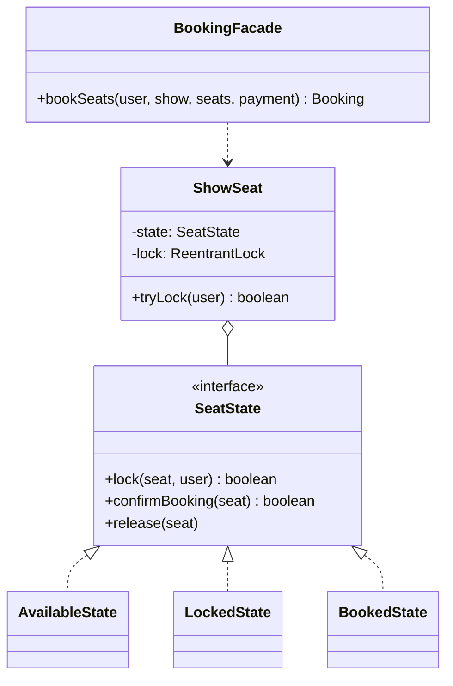
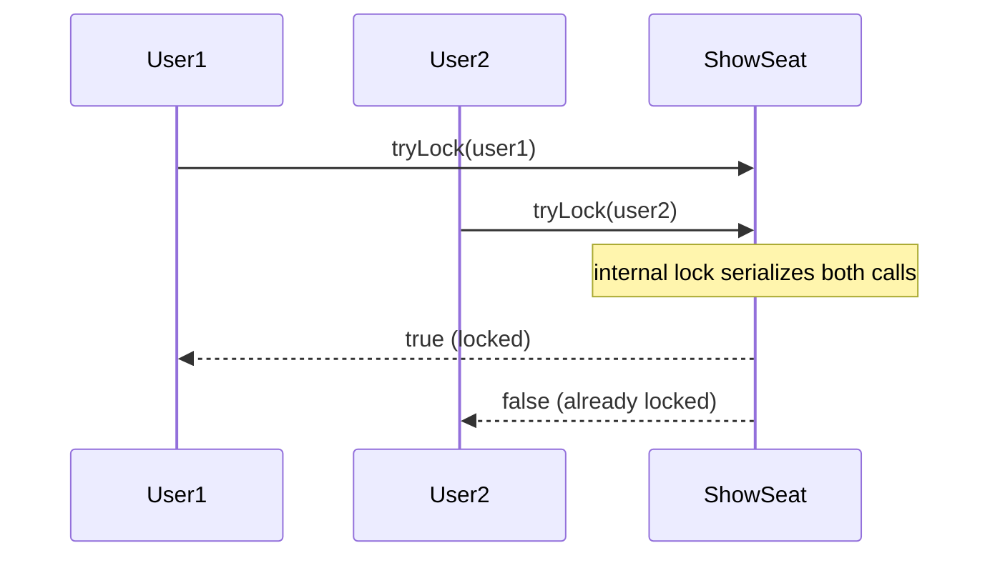

## Phase 1: Clarified Requirements

- Users browse movies, select a showtime, select specific seats, and pay.
- **Concurrent booking attempts for the same seat must be handled correctly** — this is the
  single most important clarifying answer for this entire problem (Chapter 41's category 3).
- A seat should be temporarily held during the payment step, released if payment isn't completed
  within a time window.
- Out of scope: payment gateway integration details, multi-theater search/discovery.

## Phase 2: Entities

| Noun | Classification |
|---|---|
| Movie | Entity — identity, metadata |
| Show | Entity — a specific movie at a specific theater, time, and screen |
| Seat | Entity — identity (row/number), belongs to a specific screen |
| SeatStatus | Attribute (enum) — Available, Locked, Booked |
| Booking | Entity — identity, associates seats, show, and user |

Relationship: `Show` **associates with** `Seat` availability for that specific show (a `Seat`'s
physical existence belongs to the `Screen`, but its booking status is per-show); `Booking`
**composes** the specific `Seat`+`Show` combination it covers.

## Phase 3: Class Diagram — State for Seat Lifecycle, Facade for the Booking Flow

A seat's booking status moves through a lifecycle for a **given show** — Available → Locked →
Booked, with a timeout transitioning Locked back to Available — the State pattern's textbook
shape:

```java
interface SeatState {
    boolean lock(ShowSeat seat, User user);
    boolean confirmBooking(ShowSeat seat);
    void release(ShowSeat seat);
}

class AvailableState implements SeatState {
    public boolean lock(ShowSeat seat, User user) {
        seat.setLockedBy(user);
        seat.setState(new LockedState());
        seat.scheduleAutoRelease(); // timeout — see below
        return true;
    }
    public boolean confirmBooking(ShowSeat seat) { return false; } // can't book an unlocked seat
    public void release(ShowSeat seat) { /* already available, no-op */ }
}

class LockedState implements SeatState {
    public boolean lock(ShowSeat seat, User user) { return false; } // ALREADY locked — reject
    public boolean confirmBooking(ShowSeat seat) {
        seat.setState(new BookedState());
        return true;
    }
    public void release(ShowSeat seat) { seat.setState(new AvailableState()); }
}

class BookedState implements SeatState {
    public boolean lock(ShowSeat seat, User user) { return false; }
    public boolean confirmBooking(ShowSeat seat) { return false; }
    public void release(ShowSeat seat) { /* booked seats aren't released this way */ }
}
```

## The Critical Concurrency Detail: Atomic Lock Acquisition

Exactly like Chapter 45's `findAndReserveSpot()`, **`lock()` must be atomic** — if two users call
`lock()` on the same `ShowSeat` concurrently, only one may succeed:

```java
class ShowSeat {
    private SeatState state = new AvailableState();
    private final ReentrantLock lock = new ReentrantLock(); // Chapter 40's discipline

    boolean tryLock(User user) {
        this.lock.lock();
        try {
            return state.lock(this, user);
        } finally {
            this.lock.unlock();
        }
    }
}
```

**Auto-release on timeout uses a scheduled task** — if payment isn't confirmed within, say, 5
minutes, the lock must expire automatically:

```java
void scheduleAutoRelease() {
    scheduledExecutor.schedule(() -> {
        this.lock.lock();
        try {
            if (state instanceof LockedState) { // still locked — payment never completed
                state.release(this);
            }
        } finally {
            this.lock.unlock();
        }
    }, 5, TimeUnit.MINUTES);
}
```

**The overall booking flow uses a Facade (Chapter 25):**

```java
class BookingFacade {
    Booking bookSeats(User user, Show show, List<ShowSeat> seats, PaymentMethod payment) {
        List<ShowSeat> lockedSeats = new ArrayList<>();
        try {
            for (ShowSeat seat : seats) {
                if (!seat.tryLock(user)) {
                    throw new IllegalStateException("Seat " + seat.getId() + " unavailable");
                }
                lockedSeats.add(seat);
            }
            double amount = calculateTotal(seats);
            if (!payment.pay(amount)) {
                throw new IllegalStateException("Payment failed");
            }
            for (ShowSeat seat : lockedSeats) {
                seat.confirmBooking();
            }
            return new Booking(user, show, lockedSeats);
        } catch (Exception e) {
            for (ShowSeat seat : lockedSeats) {
                seat.release(); // roll back any locks acquired before the failure
            }
            throw e;
        }
    }
}
```

**Notice the rollback discipline** — if locking seat 3 of 4 requested seats fails, the first two
already-locked seats must be explicitly released, exactly the "compensating action on partial
failure" discussion from Chapter 25's `OrderFacade` interview questions.



## Phase 4: Sequence Trace — Two Users Racing for the Same Seat



## Phase 5: Curveball — "Support Group Bookings Where Either All Seats Lock or None Do"

This is **already handled** by `BookingFacade`'s rollback loop — tracing the curveball reveals
the design already satisfies it, since partial-lock failures already trigger releasing every
previously-acquired lock. **Explicitly recognizing that no new code is needed** and stating why is
a stronger answer than defensively re-implementing something already correct.

## Summary

- Seat lifecycle is State (Chapter 31); the overall booking flow is a Facade (Chapter 25) with
  explicit rollback on partial failure.
- The single most important, most commonly-tested detail is atomic seat locking — this problem is
  frequently used specifically to test Chapter 40's concurrency reasoning in a realistic context.
- Auto-release via a scheduled timeout is the detail that most differs from earlier case studies
  — a lock that's never explicitly released must still eventually expire.

---

## Interview Questions

**1. Why must `ShowSeat.tryLock()` be atomic, and what specifically goes wrong without this
protection?**
Without atomicity, two threads could both observe the seat as `AvailableState` before either
transitions it to `LockedState`, resulting in both users believing they've successfully locked the
same seat — a double-booking. The internal `ReentrantLock` ensures only one thread's `lock()` call
succeeds.

**2. Why does the locked seat need an auto-release timeout rather than remaining locked
indefinitely until explicitly released?**
If a user locks a seat but abandons the booking flow (closes their browser, payment never
completes), the seat would remain permanently unavailable to everyone else without a timeout —
this is the same "must always be released" discipline as Chapter 39's Object Pool, but enforced
automatically via a scheduled task rather than relying purely on a `finally` block.

**3. How would you unit test that `BookingFacade.bookSeats()` correctly releases already-locked
seats if a later seat in the same request fails to lock?**
Set up a `Show` with 3 seats where the 3rd is already locked by another user, call
`bookSeats()` requesting all 3, assert it throws, and then assert the first 2 seats (successfully
locked before the failure) are back in `AvailableState` — verifying the rollback loop executed
correctly.

**4. Why is the seat-locking logic modeled with State rather than a simple boolean `isLocked`
flag?**
A boolean flag would require callers to check-and-branch on multiple conditions (locked by whom,
booked or just locked, etc.) scattered across calling code — State encapsulates each stage's own
legal transitions cleanly, and naturally extends to additional states (e.g., a "held for VIP"
state) without touching existing logic.

**5. What would go wrong if the auto-release scheduled task didn't check
`state instanceof LockedState` before calling `release()`?**
If the seat had already transitioned to `BookedState` (payment completed) before the timeout
fired, an unconditional release could incorrectly un-book an already-confirmed booking — checking
the current state first prevents this from ever happening.

**6. How would you extend the design to support a "waiting list" for a fully-booked show?**
This is structurally identical to Chapter 47's `HoldQueue` for library books — an
Observer-based queue per show, notifying the next waiting user if a booking is cancelled and a
seat becomes available again.

**7. Why does `BookingFacade.bookSeats()` calculate the total amount before attempting payment,
rather than charging per-seat individually?**
Charging per-seat individually would complicate rollback (partial payment already taken if a later
seat's charge fails) and doesn't match typical real-world payment flows (one transaction for the
whole booking) — computing and charging the total once is simpler and matches the atomic,
all-or-nothing nature of the booking itself.

**8. How would you handle the interviewer asking "what if payment succeeds but confirming one of
the seats fails afterward" (a partial-success-after-payment scenario)?**
This is a genuinely harder failure mode than pre-payment rollback, since money has already
changed hands — the design would need either a refund path or a retry mechanism for the specific
failed `confirmBooking()` call, worth explicitly raising as a distinct, harder edge case rather
than conflating it with the simpler pre-payment rollback already handled.

**9. Why is `Seat` (the physical seat) modeled separately from `ShowSeat` (that seat's status for
one specific show)?**
A physical seat's row/number identity is fixed and shared across every show in that screen, while
its booking status is entirely specific to one show — conflating them would make it impossible to
represent the same physical seat being available for a 3pm show but booked for a 7pm show.

**10. How would you extend `SeatState` to support an admin manually blocking a seat for
maintenance, independent of the normal booking flow?**
Add a `BlockedState` implementing `SeatState`, rejecting `lock()` and `confirmBooking()`
unconditionally — fits directly into the existing interface, with `BookingFacade` requiring no
changes since it only ever calls `tryLock()`, which correctly fails for a blocked seat.

**11. Why does `BookingFacade` catch a general `Exception` in its rollback logic rather than
catching more specific exception types?**
For rollback purposes, *any* failure partway through the sequence (a locking failure, a payment
failure, or an unexpected error) should trigger the same "release everything acquired so far"
response — a broad catch is appropriate here specifically because the recovery action is identical
regardless of which specific step failed.

**12. How would you decide the appropriate lock-hold timeout duration (5 minutes in the example),
and would this be a hardcoded constant or configurable?**
This should be configurable, not hardcoded — different businesses might want different timeout
windows based on typical payment completion times, and hardcoding it would require a code change
and redeployment to adjust, an unnecessary rigidity for what's fundamentally a business/
operational parameter.

**13. Is `ShowSeat`'s per-seat `ReentrantLock` the right granularity, or should locking be scoped
more broadly (e.g., one lock per show) or more narrowly?**
Per-seat locking is the right granularity here — it allows different users to lock different
seats of the same show fully concurrently, with no unnecessary contention; a single per-show lock
would unnecessarily serialize unrelated seats' bookings, hurting throughput for no correctness
benefit.

**14. Summarize the two patterns this case study combines and the one concurrency detail this
problem is most commonly used to test.**
State (seat lifecycle) and Facade (overall booking orchestration with rollback) are the two
patterns; atomic seat locking — preventing two users from ever successfully locking the same seat
— is the specific concurrency detail this problem is most frequently used to test, directly
building on Chapter 40's thread-safety checklist in a realistic, high-stakes context.
