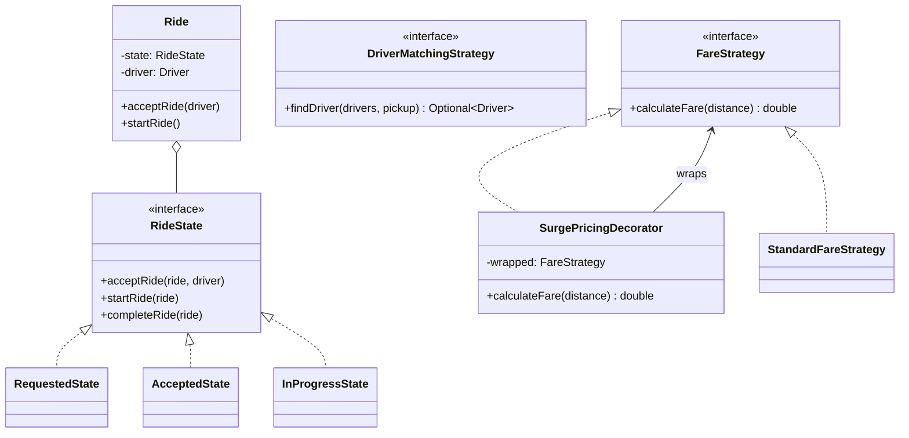
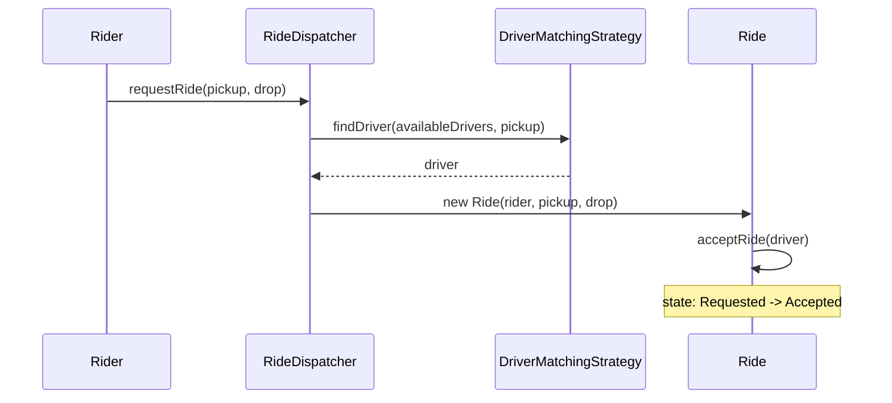

## Phase 1: Clarified Requirements

- A rider requests a ride from a pickup location; the system matches them with a nearby available
  driver.
- Fare depends on distance and can be affected by surge pricing during high demand.
- A ride moves through a lifecycle: Requested → Accepted → In Progress → Completed (or
  Cancelled).
- Out of scope: real-time GPS map integration, payment gateway details.

## Phase 2: Entities

| Noun | Classification |
|---|---|
| Rider | Entity — identity |
| Driver | Entity — identity, current location, availability status |
| Ride | Entity — identity, rider, driver, pickup/drop locations, lifecycle state |
| Location | Attribute — coordinates, a small value class |
| FareStrategy | Not an entity — a Strategy interface |

Relationship: `Ride` **associates with** `Rider` and `Driver` (both exist independently);
`RideDispatcher` **coordinates** available `Driver`s (aggregation — drivers exist independently of
any specific dispatch event).

## Phase 3: Class Diagram — State for Ride Lifecycle, Strategy for Driver Matching and Fare

**Ride lifecycle is State (Chapter 31)** — behavior and legal actions genuinely change as a ride
progresses, and the ride itself drives its own transitions:

```java
interface RideState {
    void acceptRide(Ride ride, Driver driver);
    void startRide(Ride ride);
    void completeRide(Ride ride);
    void cancelRide(Ride ride);
}

class RequestedState implements RideState {
    public void acceptRide(Ride ride, Driver driver) {
        ride.setDriver(driver);
        ride.setState(new AcceptedState());
    }
    public void startRide(Ride ride) { throw new IllegalStateException("Not yet accepted"); }
    public void completeRide(Ride ride) { throw new IllegalStateException("Not yet accepted"); }
    public void cancelRide(Ride ride) { ride.setState(new CancelledState()); }
}

class AcceptedState implements RideState {
    public void acceptRide(Ride ride, Driver driver) { throw new IllegalStateException("Already accepted"); }
    public void startRide(Ride ride) { ride.setState(new InProgressState()); }
    public void completeRide(Ride ride) { throw new IllegalStateException("Not yet started"); }
    public void cancelRide(Ride ride) { ride.setState(new CancelledState()); }
}

class InProgressState implements RideState {
    public void acceptRide(Ride ride, Driver driver) { throw new IllegalStateException("Already in progress"); }
    public void startRide(Ride ride) { throw new IllegalStateException("Already in progress"); }
    public void completeRide(Ride ride) { ride.setState(new CompletedState()); }
    public void cancelRide(Ride ride) { throw new IllegalStateException("Cannot cancel mid-ride"); }
}
```

**Driver matching uses Strategy (Chapter 28)** — "which driver gets this ride" is exactly one
interchangeable algorithm, selected once per request:

```java
interface DriverMatchingStrategy {
    Optional<Driver> findDriver(List<Driver> availableDrivers, Location pickup);
}

class NearestDriverMatchingStrategy implements DriverMatchingStrategy {
    public Optional<Driver> findDriver(List<Driver> availableDrivers, Location pickup) {
        return availableDrivers.stream()
            .filter(Driver::isAvailable)
            .min(Comparator.comparingDouble(d -> d.getLocation().distanceTo(pickup)));
    }
}
```

**Fare calculation combines Strategy with a Decorator (Chapter 24) for surge pricing** — surge is
a runtime-toggleable multiplier layered on top of the base fare calculation, not a separate,
independent algorithm:

```java
interface FareStrategy {
    double calculateFare(double distanceKm);
}

class StandardFareStrategy implements FareStrategy {
    public double calculateFare(double distanceKm) { return 5.0 + distanceKm * 2.0; }
}

class SurgePricingDecorator implements FareStrategy {
    private final FareStrategy wrapped;
    private final double surgeMultiplier;

    SurgePricingDecorator(FareStrategy wrapped, double surgeMultiplier) {
        this.wrapped = wrapped;
        this.surgeMultiplier = surgeMultiplier;
    }

    public double calculateFare(double distanceKm) {
        return wrapped.calculateFare(distanceKm) * surgeMultiplier;
    }
}
```

**Why Decorator here rather than another `FareStrategy` implementation:** surge pricing isn't a
*different calculation method* — it's an *adjustment layered on top of* whichever base method is
active, and it can be toggled on/off independently, stacking cleanly with any base
`FareStrategy` per Chapter 24's "same interface, add behavior" test.



## Phase 4: Sequence Trace — Requesting a Ride



## Phase 5: Curveball — "What If the Matched Driver Doesn't Respond Within 30 Seconds?"

Trace impact: this needs a timeout mechanism similar to Chapter 52's seat-lock auto-release — a
scheduled task that, if `RequestedState` hasn't transitioned to `AcceptedState` within the
window, automatically re-runs `DriverMatchingStrategy.findDriver()` excluding the
non-responsive driver. **`RideState` implementations require no changes** — the timeout is
orchestration logic living in `RideDispatcher`, not a new state transition rule.

## Summary

- Ride lifecycle is State (Chapter 31); driver matching is Strategy (Chapter 28); surge pricing is
  a Decorator (Chapter 24) wrapping the base fare Strategy — three patterns, three distinct roles.
- Recognizing surge pricing as a Decorator rather than a separate Strategy implementation is the
  detail most likely to distinguish a nuanced answer — it's an adjustment layered on top of a base
  calculation, not an alternative to it.
- The driver-non-response timeout mirrors Chapter 52's seat-lock timeout pattern directly —
  recognizing this structural similarity across two different case studies is itself a strong
  signal of transferable understanding.

---

## Interview Questions

**1. Why is surge pricing modeled as a Decorator rather than as its own `FareStrategy`
implementation?**
Surge pricing isn't an alternative way of computing fare from scratch — it's a multiplier applied
on top of whatever base calculation is active, and it can be toggled independently of which base
strategy is in use. This is exactly Chapter 24's "same interface, add behavior, stackable" test for
Decorator, not Strategy's "one alternative algorithm selected instead of another."

**2. Why is ride lifecycle modeled with State rather than a simple status enum with conditionals
scattered in `Ride`'s methods?**
The ride itself drives its own transitions (`RequestedState.acceptRide()` constructs and
transitions to `AcceptedState`), and each state's legal actions genuinely differ — exactly
Chapter 31's State trigger, replacing what would otherwise be a growing set of status checks in
every method.

**3. How would you unit test `SurgePricingDecorator` to verify it correctly multiplies whatever
base fare it wraps?**
Inject a fake `FareStrategy` returning a fixed known value (e.g., 100.0), wrap it in
`SurgePricingDecorator` with a multiplier of 1.5, and assert `calculateFare()` returns exactly 150.0
— isolating the decorator's own multiplication logic from any specific base calculation's details.

**4. Why does `InProgressState.cancelRide()` throw an exception rather than allowing
cancellation mid-ride?**
This reflects a reasonable real-world business rule (a ride already underway shouldn't be
cancellable the same way a pending request can be) — worth explicitly confirming this assumption
with the interviewer if genuinely ambiguous, per Chapter 41.

**5. How would you extend `DriverMatchingStrategy` to account for driver rating, not just
distance?**
Modify or add a new implementation scoring drivers on a weighted combination of distance and
rating, rather than distance alone — `RideDispatcher` and `Ride` require no changes, since they
depend only on the `DriverMatchingStrategy` interface.

**6. Why must marking a driver as "unavailable" once matched, and "available" again once a ride
completes, be handled carefully with respect to concurrency, connecting to Chapter 40?**
Two simultaneous ride requests could both match the same driver if availability-checking and
availability-marking aren't atomic — the same check-then-act race condition discussed for parking
spots (Chapter 45) and show seats (Chapter 52) applies directly here.

**7. How would you extend the design to support ride-sharing (multiple riders in one ride, with
separate drop-off points)?**
This is a significant structural change — `Ride` would need to associate with multiple riders and
multiple drop locations rather than one of each, and `FareStrategy` would need a
split-calculation approach reminiscent of Chapter 51's Splitwise `SplitStrategy` for dividing the
shared fare.

**8. Why is `Location` treated as a simple value class rather than an entity, mirroring Chapter
50's treatment of `Square`?**
A location's identity is fully determined by its coordinates — it has no independent behavior or
identity beyond that value, exactly the attribute-classification reasoning applied to `Square` in
the chess case study.

**9. How would you decide whether `RideDispatcher` should be a Singleton, given the DI-preference
guidance from Chapter 16?**
Following Chapter 16's guidance, `RideDispatcher` should be constructed once and injected
explicitly wherever needed (e.g., as a Spring-managed singleton-scoped bean), rather than
implemented as a manual `getInstance()`-style Singleton — preserving testability with fake
dependencies.

**10. How would you extend `RideState` to support a "Driver Arrived" sub-state between Accepted
and In Progress?**
Add a new `DriverArrivedState implements RideState`, with `AcceptedState`'s driver-arrival
detection transitioning to it, and `DriverArrivedState.startRide()` transitioning to
`InProgressState` — a clean, additive extension to the existing state graph.

**11. What's the risk of computing the fare using `distanceKm` provided directly by the client
app, rather than computed server-side from pickup/drop coordinates?**
Trusting client-provided distance is a manipulation risk (a malicious client could report a
shorter distance to reduce fare) — server-side distance calculation from trusted location data is
the safer, correct design, worth flagging even though this case study treats distance
calculation itself as a black-box detail.

**12. How would you unit test the ride-lifecycle State machine to verify `completeRide()` is
rejected if called directly from `RequestedState`, skipping the required intermediate states?**
Construct a `Ride` in `RequestedState`, call `completeRide()` directly, and assert an
`IllegalStateException` is thrown — verifying the state machine enforces its required transition
order rather than allowing states to be skipped.

**13. How would you extend fare calculation to support multiple simultaneously-applicable
adjustments (surge pricing AND a promotional discount)?**
Stack multiple decorators: `new PromotionalDiscountDecorator(new SurgePricingDecorator(new
StandardFareStrategy(), 1.5), 0.1)` — directly reusing Decorator's stackability (Chapter 24),
since each decorator implements the same `FareStrategy` interface it wraps.

**14. Summarize the three patterns this case study combines and the one distinguishing insight
most valuable to articulate explicitly.**
State (ride lifecycle), Strategy (driver matching and base fare calculation), and Decorator
(surge pricing layered on top of fare calculation) are the three patterns; recognizing that surge
pricing is a *layered adjustment* rather than an *alternative calculation method* — and therefore
maps to Decorator, not another Strategy implementation — is the single most valuable, nuanced
insight this case study is designed to test.
