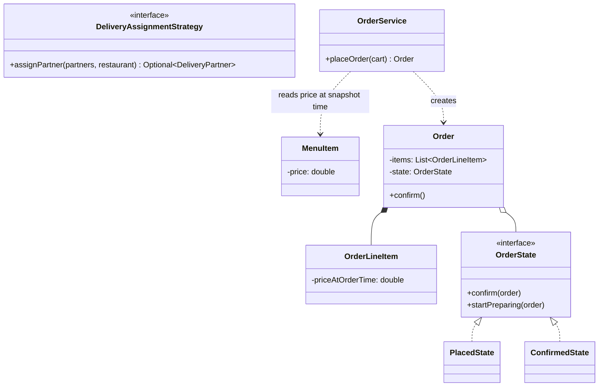
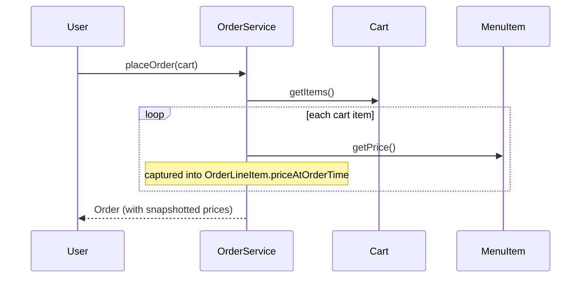

## Phase 1: Clarified Requirements

- Users browse restaurant menus, add items to a cart, and place an order.
- An order moves through a lifecycle: Placed → Confirmed by Restaurant → Preparing → Out for
  Delivery → Delivered.
- A delivery partner is assigned once the order is confirmed.
- Out of scope: restaurant discovery/search ranking, payment gateway details.

## Phase 2: Entities

| Noun | Classification |
|---|---|
| Restaurant | Entity — identity, menu |
| MenuItem | Entity — identity, price, availability |
| Cart | Entity — a user's in-progress selection, identity tied to session |
| Order | Entity — identity, items, lifecycle state |
| DeliveryPartner | Entity — identity, availability, current location |

Relationship: `Restaurant` **composes** `MenuItem` (menu items belong to and don't exist
independently of a restaurant); `Order` **composes** its own snapshot of ordered items (copied
from the cart at order time — see below); `Order` **associates with** `DeliveryPartner`.

## Phase 3: Class Diagram — Why Order Items Are Copied, Not Referenced

This is the single most important, easy-to-miss design decision in this case study. If `Order`
referenced `MenuItem` objects directly, a restaurant later changing a price would silently alter
the price of **already-placed** historical orders — a serious correctness bug. `Order` must store
its **own immutable snapshot** of what was ordered, at the price at the time of ordering:

```java
class MenuItem {
    private final String id;
    private final String name;
    private double price; // MUTABLE — restaurants update prices over time
}

class OrderLineItem { // an immutable snapshot — NOT a live reference to MenuItem
    private final String menuItemId;
    private final String name;
    private final double priceAtOrderTime; // captured, not looked up later
    private final int quantity;
}

class Order {
    private final List<OrderLineItem> items; // snapshots, per the reasoning above
    private OrderState state = new PlacedState();
    private DeliveryPartner assignedPartner;
}
```

This is directly analogous to Chapter 20's Prototype/deep-copy discipline and Chapter 26's
Flyweight immutability discussion — **an order's historical record must not be silently affected
by later, unrelated mutations** to the live menu.

**Order lifecycle uses State (Chapter 31):**

```java
interface OrderState {
    void confirm(Order order);
    void startPreparing(Order order);
    void dispatchForDelivery(Order order, DeliveryPartner partner);
    void markDelivered(Order order);
}

class PlacedState implements OrderState {
    public void confirm(Order order) { order.setState(new ConfirmedState()); }
    public void startPreparing(Order order) { throw new IllegalStateException("Not yet confirmed"); }
    public void dispatchForDelivery(Order order, DeliveryPartner partner) {
        throw new IllegalStateException("Not yet confirmed");
    }
    public void markDelivered(Order order) { throw new IllegalStateException("Not yet confirmed"); }
}

class ConfirmedState implements OrderState {
    public void confirm(Order order) { throw new IllegalStateException("Already confirmed"); }
    public void startPreparing(Order order) { order.setState(new PreparingState()); }
    public void dispatchForDelivery(Order order, DeliveryPartner partner) {
        throw new IllegalStateException("Not yet preparing");
    }
    public void markDelivered(Order order) { throw new IllegalStateException("Not yet dispatched"); }
}
```

**Delivery partner assignment uses Strategy (Chapter 28)** — structurally identical to Chapter
53's driver matching, applied to a different domain:

```java
interface DeliveryAssignmentStrategy {
    Optional<DeliveryPartner> assignPartner(List<DeliveryPartner> available, Restaurant restaurant);
}

class NearestPartnerAssignmentStrategy implements DeliveryAssignmentStrategy {
    public Optional<DeliveryPartner> assignPartner(List<DeliveryPartner> available, Restaurant restaurant) {
        return available.stream()
            .filter(DeliveryPartner::isAvailable)
            .min(Comparator.comparingDouble(p -> p.getLocation().distanceTo(restaurant.getLocation())));
    }
}
```

**Cart-to-Order conversion is the Facade-shaped operation** that performs the snapshot copy:

```java
class OrderService {
    Order placeOrder(Cart cart) {
        List<OrderLineItem> snapshots = cart.getItems().stream()
            .map(cartItem -> new OrderLineItem(
                cartItem.getMenuItem().getId(),
                cartItem.getMenuItem().getName(),
                cartItem.getMenuItem().getPrice(), // captured NOW, at order time
                cartItem.getQuantity()))
            .collect(Collectors.toList());
        return new Order(snapshots);
    }
}
```



## Phase 4: Sequence Trace — Placing an Order Captures a Price Snapshot



## Phase 5: Curveball — "What If the Restaurant Runs Out of an Item After the Order Is Placed but
Before Confirmation?"

Trace impact: add a check inside `PlacedState.confirm()` (or a step just before it) verifying
current availability of every `OrderLineItem`'s underlying `MenuItem` — if unavailable, transition
to a new `PartiallyUnavailableState` or reject confirmation entirely, prompting a refund/
substitution flow. **This is a genuine new requirement needing a new state or explicit handling**,
not something the existing states silently already cover — worth naming honestly rather than
claiming the design handles it for free.

## Summary

- The single highest-value decision in this case study is copying order items into immutable
  snapshots at order time, rather than referencing live, mutable `MenuItem` objects — directly
  reapplying Chapter 20/26's immutability discipline to a new domain.
- Order lifecycle is State; delivery assignment is Strategy — the same two-pattern shape seen in
  Chapters 46, 49, and 53, now recognizable as a recurring template across many case studies.
- The out-of-stock-after-ordering curveball is a genuine gap requiring new design work, not a
  free extension — a good test of honest, non-defensive curveball handling per Chapter 44.

---

## Interview Questions

**1. Why must `Order` store copied snapshots of ordered items rather than direct references to
`MenuItem` objects?**
`MenuItem.price` is mutable and can change over time as a restaurant updates its menu — if `Order`
referenced `MenuItem` directly, a later price change would silently alter the price shown on
already-placed historical orders, a serious correctness and billing-dispute risk. Capturing an
immutable snapshot at order time preserves an accurate historical record.

**2. How does this design decision connect to concepts covered in Chapters 20 and 26?**
It's the same underlying principle as Prototype's shallow-vs-deep-copy discipline (Chapter 20) and
Flyweight's strict-immutability requirement (Chapter 26) — shared, mutable state must not be
referenced where an independent, stable snapshot is actually required; `OrderLineItem` is
essentially a deep-copied, immutable snapshot of relevant `MenuItem` fields at a specific moment.

**3. Why is delivery partner assignment modeled with Strategy rather than State, mirroring the
distinction discussed for Chapter 53's driver matching?**
Assignment happens once per order via a selected algorithm computing a result (which partner to
assign) — it doesn't change over any object's lifetime and no assignment strategy references
another, exactly Strategy's shape rather than State's self-transitioning shape.

**4. How would you unit test `OrderService.placeOrder()` to verify a later `MenuItem` price
change doesn't affect an already-placed order's total?**
Place an order for a `MenuItem` priced at $10, then change the `MenuItem`'s price to $15, and
assert the already-created `Order`'s `OrderLineItem.priceAtOrderTime` still reflects $10 —
directly verifying the snapshot was correctly captured and remains stable.

**5. Why does `ConfirmedState.dispatchForDelivery()` throw an exception rather than allowing
dispatch before preparation starts?**
This encodes the real-world business rule that food must be prepared before it can be dispatched
for delivery — enforcing the correct sequence of states, exactly the State pattern's core value of
making illegal transitions structurally rejected rather than silently allowed.

**6. How would you extend the design to support order modifications (adding an item) after
placement but before confirmation?**
This is a meaningful design decision worth clarifying with the interviewer — if allowed, it likely
requires `PlacedState` to expose a modification method that re-snapshots the updated cart contents,
while `ConfirmedState` onward should reject modifications entirely, since preparation may have
already begun.

**7. Why does `Restaurant` compose `MenuItem` rather than the two being merely associated?**
A `MenuItem`'s existence is entirely tied to the specific restaurant offering it — menu items
don't have independent existence or meaning outside the restaurant's menu, unlike, say, a
`DeliveryPartner`, who exists independently of any specific restaurant they're currently delivering
for.

**8. How would you handle the interviewer's curveball about an item becoming unavailable after
ordering but before confirmation, and why is claiming the existing design already handles this
inappropriate?**
As shown in Phase 5, this requires genuinely new logic (an availability re-check before
confirmation, and a new state or explicit rejection path) — none of the existing states currently
perform this check, so claiming the design already handles it would be an inaccurate,
unsubstantiated claim, exactly the kind of gap Chapter 44 recommends acknowledging honestly rather
than glossing over.

**9. How would you extend `DeliveryAssignmentStrategy` to batch multiple nearby orders to the
same delivery partner (multi-order delivery routes)?**
This is a more complex assignment problem than one-order-to-one-partner matching — likely
requiring a different `DeliveryAssignmentStrategy` implementation considering multiple pending
orders and their relative locations together, rather than assigning each order independently as
the current `NearestPartnerAssignmentStrategy` does.

**10. Why might `Cart` be considered a distinct entity from `Order` rather than the same class
used before and after "placing"?**
A `Cart` is a mutable, in-progress collection that can be freely modified (items added/removed,
quantities changed) before commitment, while an `Order` represents a finalized, immutable
(in terms of its item snapshots) commitment — conflating them would either make `Order` awkwardly
mutable or `Cart` awkwardly immutable, when each concept genuinely needs different properties.

**11. How would you unit test the order-lifecycle State machine to verify `markDelivered()` is
rejected if called directly from `PlacedState`?**
Construct an `Order` in `PlacedState`, call `markDelivered()` directly, and assert an
`IllegalStateException` is thrown — verifying the required intermediate states can't be skipped.

**12. What concurrency concern would arise if two restaurant staff members simultaneously
attempted to confirm the same order, connecting to Chapter 40?**
`OrderState`'s transition methods mutate shared state (`order.state`) — if concurrent confirmation
attempts are plausible, the transition itself needs atomic protection, following the same
checklist applied throughout this series' case studies (Chapters 45, 52, 53).

**13. How would you extend the design to notify the customer at each stage of the order
lifecycle, connecting to Chapter 29?**
`Order` could implement `Subject` (Chapter 29), calling `notifyObservers()` inside its
`setState()` method — centralizing notification triggering in the one place every transition
passes through, exactly mirroring the equivalent discussion in Chapter 48's vending machine case
study.

**14. Summarize the two patterns this case study combines and the one immutability-related
design decision most critical to get right.**
State (order lifecycle) and Strategy (delivery partner assignment) are the two patterns; capturing
immutable, snapshotted `OrderLineItem`s at order time — rather than referencing live, mutable
`MenuItem` objects — is the single most critical design decision, directly preventing a serious
class of correctness bugs around historical order accuracy.
