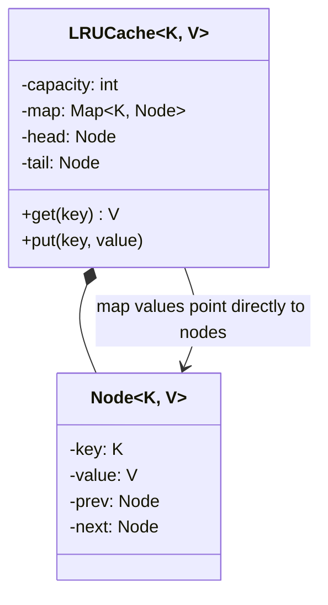
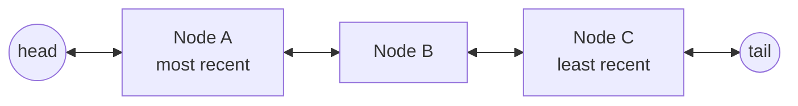
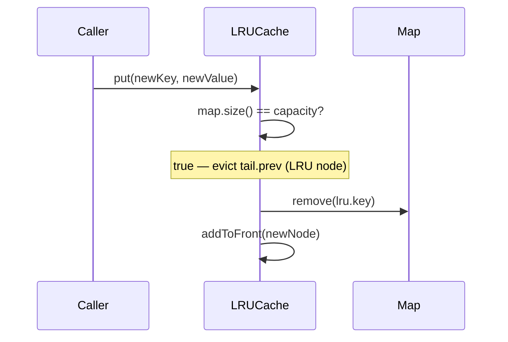

## A Different Kind of Case Study

Every other case study in Part 8 is a business-domain modeling exercise. This one is different:
**LRU Cache is a data-structure design problem**, testing whether you can combine two simple
structures to achieve a specific complexity guarantee — O(1) for both `get()` and `put()`. There's
no elaborate entity extraction phase here; the "requirements" are almost entirely about
performance constraints.

## Phase 1: Clarified Requirements

- Fixed capacity, specified at construction.
- `get(key)`: return the value if present, and mark the key as most-recently-used.
- `put(key, value)`: insert or update; if the cache is at capacity, evict the **least** recently
  used entry first.
- **Both operations must run in O(1) time** — this single constraint is what drives the entire
  design.

## Phase 2: Why a Single Data Structure Isn't Sufficient

A `HashMap` alone gives O(1) `get`/`put` but has no concept of "recency order" — finding the least
recently used entry would require an O(n) scan. A `LinkedList` alone gives natural recency
ordering (move accessed items to the front) but finding a specific key for `get()` requires an
O(n) search. **The solution combines both**: a `HashMap` for O(1) key lookup, pointing directly to
nodes in a **doubly linked list** that maintains recency order — moving a node to the front, or
removing the last node, is O(1) *given a direct reference to that node*, which the `HashMap`
provides.

## Phase 3: The Design

```java
class LRUCache<K, V> {
    private final int capacity;
    private final Map<K, Node<K, V>> map = new HashMap<>();
    private final Node<K, V> head; // dummy sentinel — most recently used end
    private final Node<K, V> tail; // dummy sentinel — least recently used end

    private static class Node<K, V> {
        K key;
        V value;
        Node<K, V> prev, next;
        Node(K key, V value) { this.key = key; this.value = value; }
    }

    LRUCache(int capacity) {
        this.capacity = capacity;
        head = new Node<>(null, null);
        tail = new Node<>(null, null);
        head.next = tail;
        tail.prev = head;
    }

    V get(K key) {
        Node<K, V> node = map.get(key);
        if (node == null) return null;
        moveToFront(node); // accessing marks it most-recently-used — O(1)
        return node.value;
    }

    void put(K key, V value) {
        if (map.containsKey(key)) {
            Node<K, V> existing = map.get(key);
            existing.value = value;
            moveToFront(existing);
            return;
        }
        if (map.size() == capacity) {
            Node<K, V> lru = tail.prev;
            removeNode(lru); // O(1) — direct pointer manipulation
            map.remove(lru.key);
        }
        Node<K, V> newNode = new Node<>(key, value);
        map.put(key, newNode);
        addToFront(newNode);
    }

    private void moveToFront(Node<K, V> node) {
        removeNode(node);
        addToFront(node);
    }

    private void removeNode(Node<K, V> node) {
        node.prev.next = node.next;
        node.next.prev = node.prev;
    }

    private void addToFront(Node<K, V> node) {
        node.next = head.next;
        node.prev = head;
        head.next.prev = node;
        head.next = node;
    }
}
```

**Why dummy `head`/`tail` sentinel nodes, rather than tracking real head/tail references
directly:** without sentinels, every insertion/removal at the boundaries needs special-case
null-checking (`if (head == null) ...`). Sentinels make **every** node — including the first and
last real entries — have a genuine, non-null `prev` and `next`, eliminating an entire category of
edge-case bugs. This is a small, concrete example of designing to make an invalid state (a
dangling null pointer at the boundary) structurally harder to hit, echoing Chapter 5's broader
"design so illegal states are unrepresentable" theme.





## Phase 4: Sequence Trace — Eviction on a Full Cache



## Phase 5: Curveball — "Add a `TTL` (Time-to-Live) So Entries Expire After N Seconds"

Trace impact: add an `expiryTime` field to `Node`, and check it inside `get()` before returning a
value — if expired, treat it as a miss and evict it immediately. **This requires touching `Node`
and `get()`, but the core doubly-linked-list eviction mechanics remain entirely unchanged** — a
good demonstration of a curveball that's additive rather than disruptive, because the base
structure was cleanly separated by concern (recency ordering vs. lookup) from the start.

## Summary

- LRU Cache combines a `HashMap` (O(1) key lookup) with a doubly linked list (O(1) recency
  reordering) — neither alone achieves the required O(1) guarantee for both operations.
- Dummy sentinel head/tail nodes eliminate boundary-condition special-casing — a small but
  valuable defensive-design technique worth naming explicitly.
- This case study tests data-structure design skill specifically, distinct from the
  domain-modeling skill most other Part 8 case studies emphasize — worth recognizing the shift in
  what's actually being evaluated.

---

## Interview Questions

**1. Why does neither a `HashMap` alone nor a `LinkedList` alone satisfy the O(1) requirement for
both `get()` and `put()`?**
A `HashMap` alone provides O(1) key lookup but has no way to track recency order — finding the
least recently used entry would require an O(n) scan of all entries. A `LinkedList` alone provides
O(1) recency reordering (moving nodes) but finding a specific key would require an O(n) traversal.
Combining both — the map pointing directly to list nodes — gets O(1) for both operations
simultaneously.

**2. Why does `moveToFront()` call `removeNode()` followed by `addToFront()` rather than a single,
combined operation?**
Both operations are already O(1) pointer manipulations, and reusing them avoids duplicating the
same linking logic — `removeNode()` is also independently needed for eviction (`tail.prev`
removal), so extracting it as a shared, reusable step is a direct DRY application (Chapter 12).

**3. Why are dummy sentinel `head` and `tail` nodes used instead of tracking real head/tail
references directly with null checks?**
Sentinels ensure every real node always has non-null `prev`/`next` pointers, eliminating special-
case boundary logic for "is this the first/last real node" — every add/remove operation can use
identical, uniform pointer manipulation regardless of position, reducing the surface area for
off-by-one or null-pointer bugs.

**4. How would you unit test that accessing an existing key via `get()` correctly updates its
recency, verified through subsequent eviction behavior?**
Fill a capacity-2 cache with keys A and B, call `get(A)` (marking A as most recently used), then
`put(C, ...)` — assert B (not A) was evicted, since A's `get()` call should have protected it from
being the least recently used entry.

**5. Why does `put()` check `map.containsKey(key)` and handle the update case separately from the
new-insertion case, rather than treating every `put()` identically?**
Updating an existing key's value shouldn't trigger eviction logic (the cache size doesn't
increase), and should still move the existing node to the front rather than creating a duplicate
node — these are genuinely different operations requiring different logic, not a case that can be
unified without introducing bugs.

**6. What would go wrong if `Node.prev`/`next` pointers weren't correctly updated on both sides
during `removeNode()`?**
Failing to update `node.prev.next` (only updating `node.next.prev`, or vice versa) would leave a
dangling reference to the removed node from one direction, corrupting the list's structure and
potentially causing the removed node to still be reachable during traversal, or causing subsequent
operations to incorrectly compute list boundaries.

**7. How would you extend this design to support a `remove(key)` operation that explicitly evicts
a specific key before its natural LRU eviction?**
Look up the node via `map.get(key)`, call the existing `removeNode()` helper to unlink it from the
list, and remove it from the map — directly reusing the already-built `removeNode()` logic, since
explicit removal and LRU eviction are structurally identical operations differing only in which
node is targeted.

**8. Why is this case study described as testing "data-structure design skill" rather than the
"domain-modeling skill" most other Part 8 case studies emphasize?**
There's no ambiguous business domain to extract entities from — the "requirements" are precise
algorithmic constraints (O(1) time complexity for two specific operations), and the core challenge
is combining two well-known data structures correctly, rather than reasoning about which
real-world nouns deserve to become classes.

**9. How would you make this `LRUCache` implementation thread-safe, connecting to Chapter 40?**
Since both `get()` (which mutates recency order) and `put()` mutate shared state, and there's no
meaningful "read-only" operation that wouldn't also need to update recency, a plain
`synchronized` method or a single exclusive lock is more appropriate here than
`ReentrantReadWriteLock` — there's no genuine read/write split to exploit, since even `get()`
writes (reorders the list).

**10. Why does the `Node` inner class store both `key` and `value`, rather than just `value`?**
When evicting the least recently used node (`tail.prev`), the cache needs to know which key to
remove from the `map` as well — storing the key on the node itself avoids needing a separate
reverse lookup from node to key, which the map alone doesn't provide.

**11. How would you extend this design to support an LFU (Least Frequently Used) eviction policy
instead of LRU, and would the same HashMap+LinkedList structure still apply?**
LFU requires tracking access *frequency*, not just recency order — a single doubly linked list
ordered by recency doesn't capture this; a common LFU approach uses a map of frequency buckets,
each containing its own linked list of keys at that frequency, a more complex structure than LRU's
single list, though it shares the same underlying "map for O(1) lookup, linked structure for O(1)
reordering" philosophy.

**12. Is this `LRUCache` implementation generic (`<K, V>`), and why does this matter for its
practical reusability?**
Yes — generics let the same cache implementation be reused for any key/value types without
code duplication or unsafe casting, following the same type-safety reasoning discussed for generic
interfaces like `Prototype<T>` in Chapter 20.

**13. How would you extend this design to expose the current cache contents in recency order, for
debugging or monitoring purposes?**
Traverse the linked list from `head.next` to `tail`, collecting each node's key/value pair in
order — this directly exposes the list's natural recency ordering without needing any additional
tracking structure, since the list itself already maintains this order as an inherent property.

**14. Summarize the two data structures this case study combines and the one design technique
(beyond the core combination) most worth naming explicitly in an interview.**
A `HashMap` for O(1) key lookup and a doubly linked list for O(1) recency reordering are the two
core structures; using dummy sentinel head/tail nodes to eliminate boundary-condition special-
casing is the specific technique most worth naming explicitly, since it demonstrates attention to
edge-case correctness beyond just the core algorithmic combination.
