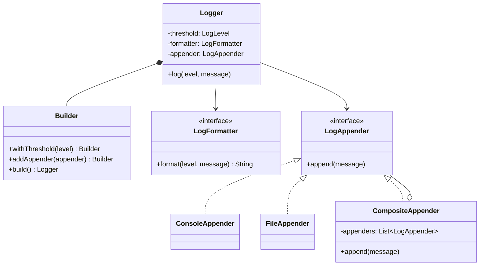
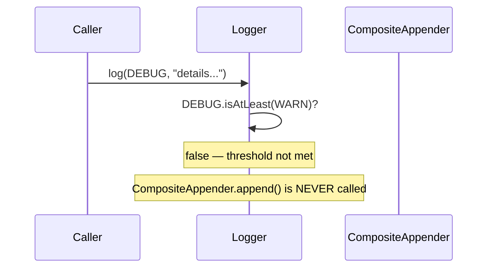

## Phase 1: Clarified Requirements

- Support log levels (DEBUG, INFO, WARN, ERROR) with a configurable minimum threshold — messages
  below the threshold are suppressed.
- Support multiple simultaneous output destinations ("appenders") — console, file — for the same
  log message.
- Support configurable message formatting (e.g., include timestamp, log level, thread name).
- Out of scope: log rotation/archival policies, distributed log aggregation.

## Phase 2: Entities

| Noun | Classification |
|---|---|
| Logger | Entity — the main entry point, identity (usually per-class) |
| LogLevel | Attribute (enum) — has a natural ordering |
| LogAppender | Entity — a specific output destination |
| LogFormatter | Not quite an entity — a Strategy interface |
| LogMessage | Entity — one specific log event, identity via timestamp+content |

Relationship: `Logger` **aggregates** `LogAppender` (a logger can share appenders with other
loggers — appenders aren't exclusively owned by one logger); each `LogAppender` **associates
with** a `LogFormatter`.

## Phase 3: Class Diagram — Where Each Pattern From Parts 3-6 Fits

This case study is deliberately chosen to combine **four** patterns in one design — a realistic
reflection of how real logging frameworks (Log4j, java.util.logging) are actually built.

**Log level comparison uses a natural enum ordering, not a pattern:**

```java
enum LogLevel {
    DEBUG(0), INFO(1), WARN(2), ERROR(3);
    private final int severity;
    LogLevel(int severity) { this.severity = severity; }
    boolean isAtLeast(LogLevel threshold) { return this.severity >= threshold.severity; }
}
```

**Message formatting uses Strategy (Chapter 28):**

```java
interface LogFormatter {
    String format(LogLevel level, String message);
}

class SimpleFormatter implements LogFormatter {
    public String format(LogLevel level, String message) {
        return "[" + level + "] " + message;
    }
}

class DetailedFormatter implements LogFormatter {
    public String format(LogLevel level, String message) {
        return "[" + Instant.now() + "] [" + Thread.currentThread().getName() + "] [" + level + "] " + message;
    }
}
```

**Multiple simultaneous appenders use Composite (Chapter 23)** — "send this message to console
AND file" is exactly the uniform-treatment-of-one-or-many shape:

```java
interface LogAppender {
    void append(String formattedMessage);
}

class ConsoleAppender implements LogAppender {
    public void append(String formattedMessage) { System.out.println(formattedMessage); }
}

class FileAppender implements LogAppender {
    private final String filePath;
    public void append(String formattedMessage) { /* write to file */ }
}

class CompositeAppender implements LogAppender { // Composite — treats many appenders as one
    private final List<LogAppender> appenders = new ArrayList<>();
    void addAppender(LogAppender appender) { appenders.add(appender); }
    public void append(String formattedMessage) {
        for (LogAppender appender : appenders) {
            appender.append(formattedMessage);
        }
    }
}
```

**`Logger` construction uses Builder (Chapter 19)** — a logger has several optional configuration
knobs (level threshold, formatter, appenders):

```java
class Logger {
    private final LogLevel threshold;
    private final LogFormatter formatter;
    private final LogAppender appender;

    private Logger(Builder builder) {
        this.threshold = builder.threshold;
        this.formatter = builder.formatter;
        this.appender = builder.appender;
    }

    void log(LogLevel level, String message) {
        if (level.isAtLeast(threshold)) { // suppress below-threshold messages
            appender.append(formatter.format(level, message));
        }
    }

    static class Builder {
        private LogLevel threshold = LogLevel.INFO; // sensible default
        private LogFormatter formatter = new SimpleFormatter(); // sensible default
        private final CompositeAppender appender = new CompositeAppender();

        Builder withThreshold(LogLevel threshold) { this.threshold = threshold; return this; }
        Builder withFormatter(LogFormatter formatter) { this.formatter = formatter; return this; }
        Builder addAppender(LogAppender appender) { this.appender.addAppender(appender); return this; }

        Logger build() { return new Logger(this); }
    }
}
```

```java
Logger logger = new Logger.Builder()
    .withThreshold(LogLevel.WARN)
    .withFormatter(new DetailedFormatter())
    .addAppender(new ConsoleAppender())
    .addAppender(new FileAppender("/var/log/app.log"))
    .build();
```

**Why Builder specifically here:** every field has a sensible default (per Chapter 19's decision
rule), and callers typically want to override just one or two — a plain constructor would force
specifying every parameter or create telescoping overloads.



## Phase 4: Sequence Trace — A Suppressed Message Never Reaches Any Appender



This is worth tracing explicitly because it's a common point of confusion — filtering happens
**once, centrally, in `Logger.log()`**, not independently inside each appender. If filtering were
instead duplicated inside every `LogAppender` implementation, adding a new appender would risk
forgetting the threshold check — a DRY violation this design avoids by centralizing it.

## Phase 5: Curveball — "Support Per-Appender Log Levels" (Console Shows WARN+, File Logs
Everything)

Trace impact: this genuinely breaks the "filter once, centrally" assumption from Phase 4 — the
threshold now needs to move from `Logger` to each `LogAppender` (or `LogAppender` gains its own
optional threshold field, checked before delegating to the actual output). **This is a real
architectural shift, not a free extension** — worth stating explicitly rather than pretending the
existing centralized-filtering design already accommodates it.

## Summary

- This case study intentionally combines four structural elements: Strategy (formatting),
  Composite (multiple appenders treated as one), Builder (logger configuration), and a plain enum
  (level comparison) — demonstrating how real frameworks blend several patterns in one cohesive
  design.
- Centralizing level-filtering in `Logger.log()` rather than duplicating it per-appender is a
  direct DRY application, and recognizing that a "per-appender threshold" curveball breaks this
  centralization is a strong, honest answer.
- This case study's real-world fidelity (mirroring Log4j/java.util.logging's actual architecture)
  makes it a valuable one to have deeply internalized, not just as an interview exercise.

---

## Interview Questions

**1. Why does `Logger.log()` check the threshold once, centrally, rather than each `LogAppender`
performing its own threshold check?**
Centralizing the check avoids duplicating the same filtering logic across every appender
implementation (a DRY violation) and guarantees consistent behavior — if a new appender type is
added, it automatically benefits from correct filtering without needing to remember to implement
it itself.

**2. Why is `CompositeAppender` a genuine application of the Composite pattern rather than just "a
list of appenders `Logger` iterates over directly"?**
`CompositeAppender` implements the same `LogAppender` interface as `ConsoleAppender` and
`FileAppender` — `Logger` treats "one appender" and "many appenders combined" completely
uniformly through the same interface, exactly Chapter 23's defining test, rather than `Logger`
itself needing to know it's dealing with a collection.

**3. Why does `Logger.Builder` provide sensible defaults for `threshold` and `formatter` rather
than requiring every caller to specify them?**
Per Chapter 19's Builder guidance, providing defaults for fields most callers won't need to
customize reduces required configuration to just what's genuinely needed for a specific use case —
a caller wanting only to add a file appender with standard formatting and level shouldn't need to
also specify a threshold and formatter explicitly.

**4. How would you unit test that a `DEBUG` message is correctly suppressed when the logger's
threshold is `WARN`?**
Construct a `Logger` with threshold `WARN` and a fake `LogAppender` that records whether
`append()` was called, call `log(DEBUG, "test")`, and assert the fake appender's `append()` was
never invoked.

**5. Why is `LogFormatter` modeled as Strategy rather than each `LogAppender` implementation
handling its own formatting internally?**
Formatting and output destination are genuinely independent concerns — the same formatted string
should be sendable to console or file interchangeably, and different appenders might want
different formatters combined freely; conflating them would force duplicating formatting logic
inside every appender type.

**6. How would you extend `LogFormatter` to support a JSON-structured output format for
integration with log-aggregation tools?**
Add a `JsonFormatter implements LogFormatter`, producing a JSON string instead of the plain-text
format shown — fits directly into the existing interface with zero changes to `Logger` or any
`LogAppender`.

**7. Why does the curveball "per-appender log levels" represent a genuine architectural shift
rather than a simple additive extension?**
The entire design centralizes filtering in one place specifically to avoid duplication — moving
threshold logic to each appender individually reverses this centralization decision, requiring
`LogAppender`'s interface and every implementation to change, not just adding one new class.

**8. How would you unit test `CompositeAppender.append()` to verify it correctly forwards a
message to all of its child appenders?**
Add two fake `LogAppender` instances to a `CompositeAppender`, call `append("test")`, and assert
both fakes received the call with the exact same message — verifying the fan-out behavior works
correctly.

**9. Why might `Logger` instances typically be constructed once per class (a common real-world
convention) rather than once globally as a Singleton?**
Per-class loggers allow independent configuration and filtering granularity (e.g., enabling DEBUG
logging for one specific class while keeping others at WARN) — a single global Singleton logger
would force uniform configuration across the entire application, losing this valuable per-class
flexibility that real logging frameworks (Log4j, SLF4J) are specifically designed to provide.

**10. How would you extend the design to support asynchronous logging (writing to a file on a
background thread rather than blocking the calling thread), connecting to Chapter 39?**
Wrap `FileAppender` in a Decorator-style or Proxy-style wrapper that enqueues messages onto a
`BlockingQueue` (Chapter 39's Producer-Consumer pattern) rather than writing synchronously, with a
separate consumer thread performing the actual, potentially-slow file I/O — `Logger` itself
requires no changes, since it depends only on the `LogAppender` interface.

**11. Why does `FileAppender` take a `filePath` in its constructor rather than being configured
via the `Builder`'s `withThreshold()`-style fluent methods?**
`FileAppender`-specific configuration (its file path) belongs to `FileAppender`'s own
construction, not to `Logger.Builder`, which only configures logger-level concerns (threshold,
formatter, which appenders to use) — mixing appender-specific configuration into the logger
builder would violate each class's own single responsibility.

**12. How would you handle the interviewer asking "what if writing to the file fails (disk full,
permissions error)"?**
`FileAppender.append()` should catch and handle I/O exceptions gracefully (perhaps logging the
failure to console as a fallback, or silently dropping and incrementing an error counter) rather
than letting the exception propagate and potentially crash the calling application code — logging
failures generally shouldn't be allowed to break the application being logged.

**13. Is `Logger.Builder`'s `addAppender()` method name (rather than `withAppender()`) a
meaningful distinction, connecting to naming conventions discussed for Builder in Chapter 19?**
Yes — `addAppender()` accurately reflects that it accumulates into a collection (potentially
called multiple times to add several appenders), while `with`-prefixed methods in this same
Builder (`withThreshold`, `withFormatter`) correctly signal setting a single, replaceable value —
this naming distinction itself communicates the underlying behavior difference to a reader.

**14. Summarize the four structural elements this case study combines and the one filtering-
centralization detail most likely to be probed by a curveball.**
Strategy (formatting), Composite (multiple appenders as one), Builder (logger configuration), and
a comparable enum (log level ordering) are the four elements; the centralized, single-point
threshold check in `Logger.log()` — and recognizing that moving to per-appender thresholds is a
genuine architectural change, not a free extension — is the detail most likely to be tested via a
curveball on this problem.
