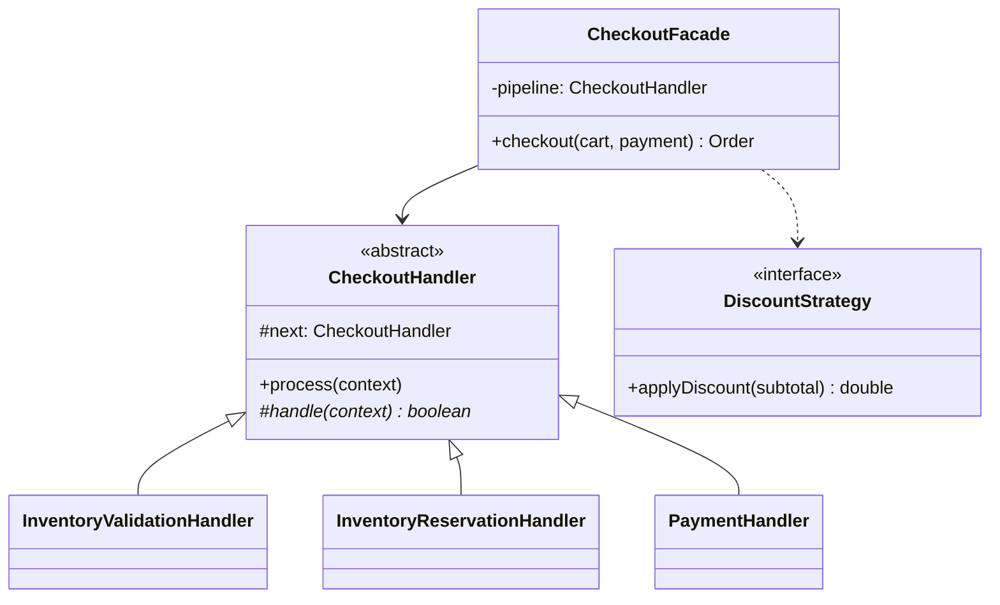
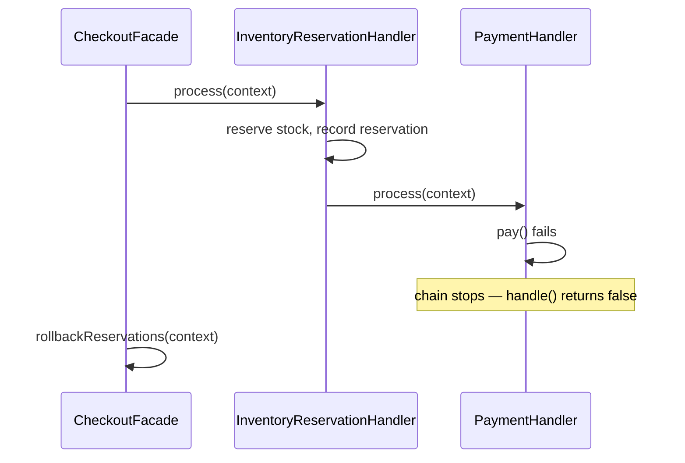

## Phase 1: Clarified Requirements

- A user adds products to a cart, applies at most one discount code, and checks out.
- Checkout must validate the cart (inventory available, prices current), reserve inventory,
  process payment, and create an order — with each step potentially failing.
- Out of scope: product catalog search/browsing, tax calculation specifics, shipping carrier
  integration details.

## Phase 2: Entities

| Noun | Classification |
|---|---|
| Product | Entity — catalog item, identity, price |
| Cart | Entity — a user's in-progress selection |
| CartItem | Entity — a product + quantity within a cart |
| DiscountCode | Entity — identity, discount rules |
| Order | Entity — the finalized, immutable result of checkout (per Chapter 54's snapshot discipline) |
| Inventory | Entity — tracks available stock per product |

Relationship: `Cart` **composes** `CartItem`; `CartItem` **associates with** `Product`; `Order`
**composes** its own line-item snapshots (identical reasoning to Chapter 54's `OrderLineItem`).

## Phase 3: Class Diagram — Chain of Responsibility for the Checkout Pipeline

Checkout is a **multi-step validation-and-processing pipeline** where each step can independently
reject the checkout — this is exactly Chapter 33's Chain of Responsibility shape, structured as a
pipeline where every link contributes (the "every handler contributes" variant, not "stop at
first match"):

```java
abstract class CheckoutHandler {
    protected CheckoutHandler next;

    CheckoutHandler setNext(CheckoutHandler next) { this.next = next; return next; }

    void process(CheckoutContext context) {
        if (handle(context)) {
            if (next != null) next.process(context);
        }
        // if handle() returns false, the chain stops — this step rejected checkout
    }

    protected abstract boolean handle(CheckoutContext context);
}

class InventoryValidationHandler extends CheckoutHandler {
    private final Inventory inventory;
    protected boolean handle(CheckoutContext context) {
        for (CartItem item : context.getCart().getItems()) {
            if (!inventory.isAvailable(item.getProduct(), item.getQuantity())) {
                context.fail("Insufficient stock: " + item.getProduct().getName());
                return false;
            }
        }
        return true;
    }
}

class InventoryReservationHandler extends CheckoutHandler {
    private final Inventory inventory;
    protected boolean handle(CheckoutContext context) {
        for (CartItem item : context.getCart().getItems()) {
            inventory.reserve(item.getProduct(), item.getQuantity());
            context.addReservation(item); // tracked for rollback if a LATER step fails
        }
        return true;
    }
}

class PaymentHandler extends CheckoutHandler {
    protected boolean handle(CheckoutContext context) {
        double total = context.getCart().calculateTotal();
        if (!context.getPaymentMethod().pay(total)) {
            context.fail("Payment failed");
            return false; // triggers rollback of the reservation already made
        }
        return true;
    }
}
```

**Discount calculation uses Strategy (Chapter 28)** — combined with the `Cart` total calculation:

```java
interface DiscountStrategy {
    double applyDiscount(double subtotal);
}

class PercentageDiscountStrategy implements DiscountStrategy {
    private final double percentage;
    public double applyDiscount(double subtotal) { return subtotal * (1 - percentage / 100.0); }
}

class NoDiscountStrategy implements DiscountStrategy { // Chapter 8's "null object" style default
    public double applyDiscount(double subtotal) { return subtotal; }
}
```

**Overall orchestration uses a Facade (Chapter 25):**

```java
class CheckoutFacade {
    private final CheckoutHandler pipeline; // pre-assembled chain

    Order checkout(Cart cart, PaymentMethod payment) {
        CheckoutContext context = new CheckoutContext(cart, payment);
        pipeline.process(context);
        if (context.hasFailed()) {
            rollbackReservations(context); // undo any reservations made before the failure
            throw new CheckoutFailedException(context.getFailureReason());
        }
        return createOrderFromCart(cart);
    }

    private void rollbackReservations(CheckoutContext context) {
        for (CartItem reserved : context.getReservations()) {
            inventory.release(reserved.getProduct(), reserved.getQuantity());
        }
    }
}
```

**Notice the rollback discipline** — identical in spirit to Chapter 52's `BookingFacade`: any
step that reserves a resource must have its reservation explicitly released if a **later** step
in the same pipeline fails.



## Phase 4: Sequence Trace — Payment Fails After Inventory Was Already Reserved



Tracing this is exactly what surfaces the need for `context.addReservation()` — without it,
`CheckoutFacade` would have no record of what to roll back after a downstream failure.

## Phase 5: Curveball — "Support Reordering the Checkout Steps Based on Configuration"

Trace impact: since the chain is already assembled via `setNext()` calls rather than hardcoded
sequential method calls, reordering means changing **only** the assembly code (which handler's
`setNext()` points to which), with **zero changes to any individual handler class** — direct
evidence the Chain of Responsibility structure (Chapter 33) was the right choice for this
"sequence of independent, potentially-reorderable steps" shape.

## Summary

- Checkout is modeled as Chain of Responsibility (Chapter 33) — a pipeline of independently
  failable steps, each capable of stopping the sequence.
- Discount calculation is Strategy; overall orchestration and rollback is Facade — the same
  "Facade coordinating several other patterns" shape seen across multiple case studies in this
  Part.
- The reservation-then-rollback discipline, tracked explicitly via `context.addReservation()`, is
  the detail most directly testing whether a candidate has internalized the "compensating action
  on partial failure" theme running throughout Chapters 25, 52, and 53.

---

## Interview Questions

**1. Why is the checkout process modeled as Chain of Responsibility rather than a single method
with sequential `if` checks for each step?**
Each step (inventory validation, reservation, payment) is an independently meaningful,
potentially-reorderable unit of work that can reject the overall checkout — Chain of
Responsibility (Chapter 33) lets each step be its own class, added or reordered without modifying
existing steps, exactly the extensibility Phase 5's curveball demonstrates.

**2. Why must `InventoryReservationHandler` track its reservations via
`context.addReservation()` rather than relying on `Inventory` to "remember" what was reserved?**
`CheckoutFacade` needs to know specifically what to roll back if a *later* step fails — without
tracking, it would have no reliable way to know which reservations belong to this specific,
failed checkout attempt versus other concurrent checkouts also reserving stock.

**3. How would you unit test that a payment failure correctly triggers rollback of an already-made
inventory reservation?**
Use a fake `Inventory` that records `reserve()`/`release()` calls and a fake `PaymentMethod` that
always fails, run `CheckoutFacade.checkout()`, and assert `release()` was called with the same
product and quantity that `reserve()` was called with earlier in the same attempt.

**4. Why does `CheckoutHandler.process()` only call `next.process()` if `handle()` returns `true`,
rather than always continuing to the next handler regardless?**
This implements the "stop the chain on failure" variant discussed in Chapter 33 — since a failed
step (insufficient stock, failed payment) means the overall checkout cannot succeed, continuing to
process further steps would be wasted work and could produce confusing, compounded failure states.

**5. How would you extend the design to support a maximum-one-discount-code business rule
mentioned in the clarified requirements?**
This is naturally enforced at the `Cart` level (rejecting a second `applyDiscountCode()` call if
one is already applied) rather than inside the checkout pipeline itself — discount application
happens before checkout begins, making it a `Cart`-level invariant, not a checkout-step concern.

**6. Why does `PaymentHandler` compute `context.getCart().calculateTotal()` rather than receiving
a pre-computed total as a `CheckoutContext` field?**
Computing it fresh at the payment step ensures the charged amount reflects the cart's current
state at the moment of charging, rather than a potentially-stale total computed earlier in the
pipeline — though this is a legitimate design discussion point, and caching the total earlier with
explicit invalidation could be a reasonable alternative worth weighing.

**7. How would you handle the interviewer asking "what if inventory becomes unavailable between
validation and reservation" (a race condition between two pipeline steps)?**
This points to a genuine gap — `InventoryValidationHandler` and `InventoryReservationHandler`
being separate steps introduces a check-then-act race condition across two method calls, similar
to the danger flagged in Chapter 40; a more robust design would combine validation and reservation
into one atomic step, mirroring `findAndReserveSpot()`'s combined design in Chapter 45.

**8. Why is `Order` created only after the entire pipeline succeeds, rather than being created
upfront and updated as each step completes?**
Per Chapter 54's snapshot-immutability discussion, an `Order` should represent a finalized,
successful commitment — creating it upfront and mutating it through a partially-completed,
possibly-failing pipeline would risk exposing an incomplete or invalid `Order` object if any step
fails before completion.

**9. How would you extend `DiscountStrategy` to support stacking a percentage discount with a
flat-amount discount?**
This mirrors Chapter 23's `CompositeDiscount` discussion directly — a `CompositeDiscountStrategy`
implementing `DiscountStrategy` that holds and applies multiple other `DiscountStrategy` instances
in sequence, treating a combination of discounts uniformly as a single discount.

**10. Why does `NoDiscountStrategy` exist as an explicit implementation rather than `Cart`
checking for a null discount and skipping the discount step conditionally?**
This is the "null object pattern" — providing a safe, no-op implementation of the interface avoids
null-checking scattered throughout calling code (`if (discount != null) ...`), letting `Cart`
always call `discountStrategy.applyDiscount()` uniformly regardless of whether a real discount is
active.

**11. How would you extend the checkout pipeline to support an asynchronous, longer-running
fraud-check step without blocking the entire checkout flow synchronously?**
This could be modeled using Chapter 39's Producer-Consumer pattern — the fraud-check handler
enqueues the order for asynchronous review rather than blocking, with the order's finalization
(or rejection) happening later once the async check completes, a genuine architectural
extension beyond the synchronous pipeline shown here.

**12. Why might `CheckoutFacade`'s `pipeline` field be assembled once at application startup
rather than reconstructed on every checkout call?**
Since the pipeline's structure (which handlers, in what order) is typically stable configuration
rather than something that varies per individual checkout request, assembling it once and reusing
it avoids unnecessary repeated object construction — similar to the stateless-factory reuse
reasoning discussed in Chapters 17 and 18.

**13. How would you unit test `InventoryValidationHandler` in isolation, without needing a real
`PaymentHandler` or full pipeline?**
Construct `InventoryValidationHandler` directly (with `next` left `null`), call
`process(context)` with a cart containing an out-of-stock item, and assert
`context.hasFailed()` is `true` with the expected failure reason — testing this one handler's
own logic entirely independent of the rest of the chain.

**14. Summarize the three patterns this case study combines and the one correctness discipline
most directly connecting it to earlier case studies in this Part.**
Chain of Responsibility (checkout pipeline), Strategy (discount calculation), and Facade
(orchestration with rollback) are the three patterns; the "track what was reserved so it can be
rolled back if a later step fails" discipline directly connects this case study to the same
compensating-action theme established in Chapters 25 (`OrderFacade`), 52 (`BookingFacade`), and 53.
