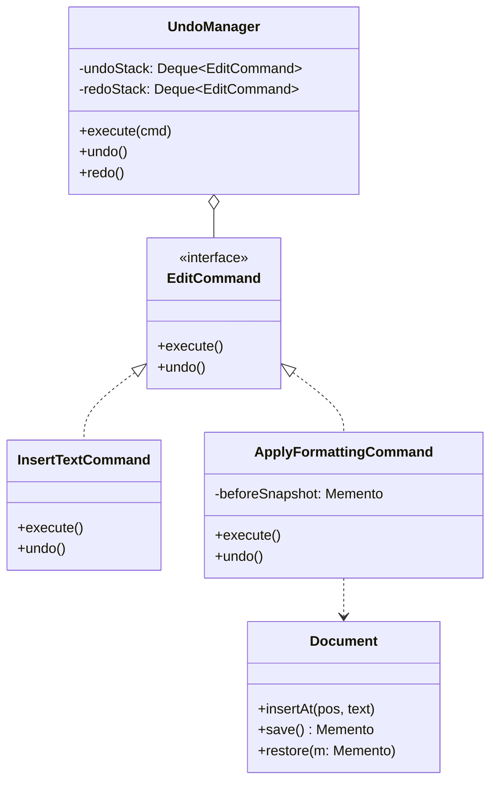
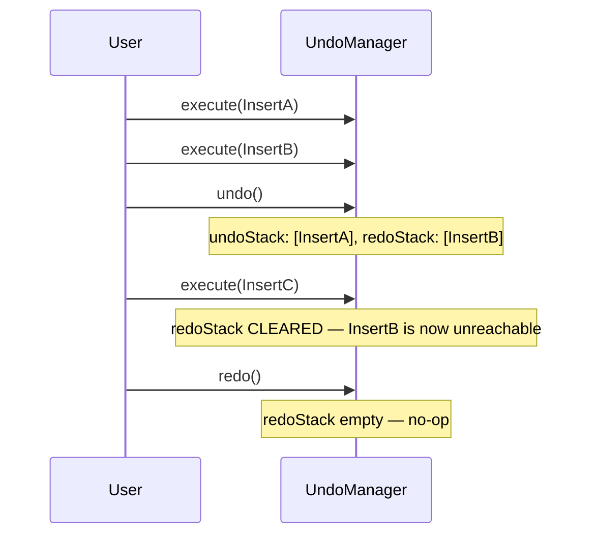

## The Final Case Study

This chapter closes the 58-chapter curriculum with the problem this series has referenced more
than any other while building up Command (Chapter 30) and Memento (Chapter 36) — it's the natural
capstone, combining both directly.

## Phase 1: Clarified Requirements

- Support inserting text, deleting a selection, and applying bold/italic formatting.
- Support unlimited undo and redo of every editing action, in order.
- Out of scope: real-time collaborative editing, spell-check, file save/load mechanics.

## Phase 2: Entities

| Noun | Classification |
|---|---|
| Document | Entity — the text content, identity |
| EditCommand | Entity — a specific, undoable action (Command, Chapter 30) |
| UndoManager | Entity — tracks command history, coordinates undo/redo |
| TextSpan | Attribute — a range within the document (start/end position) |

Relationship: `UndoManager` **associates with** `Document` (coordinates actions on it, doesn't own
its content); `EditCommand` implementations **associate with** `Document` (the Receiver, per
Chapter 30's vocabulary).

## Phase 3: Class Diagram — Command for Actions, Memento for Complex Undo

**Simple actions (insert) use Command's inverse-operation approach directly** — insertion has a
clean, precise inverse (delete exactly what was inserted):

```java
interface EditCommand {
    void execute();
    void undo();
}

class InsertTextCommand implements EditCommand {
    private final Document document;
    private final int position;
    private final String text;

    public void execute() { document.insertAt(position, text); }
    public void undo() { document.deleteRange(position, position + text.length()); }
}
```

**Complex actions (formatting a selection) use Memento**, since "undo bold formatting" isn't a
single, universally clean inverse — it must restore the exact prior formatting state, which could
have been mixed (some characters bold, some not) before the operation:

```java
class ApplyFormattingCommand implements EditCommand {
    private final Document document;
    private final TextSpan span;
    private final FormatType format;
    private Document.Memento beforeSnapshot; // captured lazily, at execute() time

    public void execute() {
        beforeSnapshot = document.save(); // Memento, Chapter 36 — capture BEFORE mutating
        document.applyFormat(span, format);
    }

    public void undo() {
        document.restore(beforeSnapshot); // restore the exact prior state, not an inverse operation
    }
}
```

**`UndoManager` is the Command Invoker, holding both an undo stack and a redo stack:**

```java
class UndoManager {
    private final Deque<EditCommand> undoStack = new ArrayDeque<>();
    private final Deque<EditCommand> redoStack = new ArrayDeque<>();

    void execute(EditCommand command) {
        command.execute();
        undoStack.push(command);
        redoStack.clear(); // a new action invalidates any previously-available redo history
    }

    void undo() {
        if (!undoStack.isEmpty()) {
            EditCommand command = undoStack.pop();
            command.undo();
            redoStack.push(command);
        }
    }

    void redo() {
        if (!redoStack.isEmpty()) {
            EditCommand command = redoStack.pop();
            command.execute();
            undoStack.push(command);
        }
    }
}
```

**Why `redoStack.clear()` on a new action is essential:** if a user undoes 3 actions, then
performs a brand-new edit, the 3 previously-undone actions are no longer a valid "redo" path — the
document has diverged from the state they'd restore to. Forgetting this line is the single most
common bug in a from-scratch undo/redo implementation.



## Phase 4: Sequence Trace — Undo, Then a New Edit, Then Attempting Redo



This trace is exactly why `redoStack.clear()` must happen inside `execute()`, not just at
undo/redo time — tracing this specific, slightly tricky sequence is what surfaces the bug before
it's shipped, per Chapter 43's Decision 5 methodology.

## Phase 5: Curveball — "Support Grouping Several Edits Into One Undoable Unit" (e.g.,
Autocomplete Inserting Several Characters at Once Should Undo as One Action)

Trace impact: this is directly Chapter 30's **Composite/MacroCommand** discussion —
`MacroCommand implements EditCommand`, holding an ordered list of `EditCommand`s, executing them
in sequence and undoing them in **reverse** sequence. **`UndoManager` requires zero changes** —
it already treats every `EditCommand` uniformly, including a `MacroCommand` wrapping several
others, which is precisely the payoff of having built `UndoManager` against the `EditCommand`
interface rather than against `InsertTextCommand` specifically.

## Summary

- This final case study demonstrates both of Chapter 30 and Chapter 36's undo strategies side by
  side: inverse-operation Command for simple, cleanly-reversible actions, and Memento-backed
  Command for complex actions with no clean universal inverse.
- `redoStack.clear()` on every new action is the single most commonly-missed detail in a
  from-scratch undo/redo implementation — worth having memorized precisely because it's so easy to
  overlook.
- The `MacroCommand` curveball resolving with zero changes to `UndoManager` is the clearest
  possible demonstration of *why* depending on the `EditCommand` interface, rather than concrete
  command types, was the correct DIP-driven choice from the start.

---

## Interview Questions

**1. Why does `InsertTextCommand` use a direct inverse operation for undo, while
`ApplyFormattingCommand` uses a Memento snapshot instead?**
Insertion has an exact, computable inverse — deleting precisely the range that was inserted.
Formatting a selection has no such clean inverse, since the prior formatting state could have been
arbitrarily mixed (some bold, some not) before the operation — only a full snapshot reliably
captures and restores that exact prior state, exactly the distinction established in Chapter 36.

**2. Why must `UndoManager.execute()` clear the redo stack, and what specific bug results if this
line is omitted?**
After undoing some actions and then performing a new edit, the document has diverged from the
state the previously-undone actions would redo to — without clearing, calling `redo()` after a new
edit would replay a now-invalid action against a document state it was never designed for,
potentially corrupting the document or producing nonsensical results.

**3. How would you unit test that performing a new edit after an undo correctly invalidates the
redo history?**
Execute two commands, undo one, execute a third (different) command, then call `redo()` and
assert it's a no-op (verifying the redo stack was correctly cleared) rather than incorrectly
replaying the previously-undone second command.

**4. Why does `ApplyFormattingCommand` capture `beforeSnapshot` inside `execute()` rather than in
its constructor?**
Capturing at construction time could capture a stale snapshot if other commands execute between
construction and actual execution (e.g., if commands are queued before being run) — capturing
immediately before mutation, inside `execute()` itself, guarantees the snapshot accurately
reflects the document's state at the actual moment of the edit.

**5. How does `MacroCommand`'s undo need to reverse its constituent commands in the opposite
order they were executed, connecting to Chapter 30's discussion?**
If a macro executes commands A then B, undoing must reverse B first, then A — since B's effects
may depend on state A established; undoing in the same forward order (A then B) could attempt to
undo A while B's effects are still present, potentially producing an incorrect intermediate state.

**6. Why does `UndoManager` depend only on the `EditCommand` interface, and what specific benefit
does this provide when the `MacroCommand` curveball is introduced?**
Depending on the interface (not concrete command types) means `UndoManager`'s undo/redo stack
logic works identically regardless of which concrete `EditCommand` implementation is pushed onto
it — introducing `MacroCommand` requires zero changes to `UndoManager`, a direct, concrete
demonstration of DIP (Chapter 11) paying off exactly as intended.

**7. How would you extend the design to limit undo history to the last 100 actions, connecting to
Chapter 36's memory-cost discussion?**
Cap `undoStack`'s size, evicting the oldest command when a new one is pushed beyond the limit —
identical to the bounded-history discipline discussed for `UndoManager` in Chapter 36's interview
questions, trading unlimited undo depth for bounded, predictable memory usage.

**8. Why might `Document.save()`/`restore()` need to perform a deep copy, connecting to Chapter
20's discipline?**
If `Document`'s internal representation includes mutable structures (a list of formatting ranges,
for instance), a shallow-copied snapshot could still share references to those mutable structures
with the live document — subsequent edits could then silently corrupt what should have been a
fixed, independent snapshot, exactly the danger Chapter 20 and Chapter 36 both warned about.

**9. How would you handle the interviewer asking "what if undo needs to work across multiple
open documents simultaneously"?**
Each `Document` would need its own independent `UndoManager` instance (rather than one global
`UndoManager` shared across all documents) — undo history is inherently per-document, and sharing
one `UndoManager` across documents would incorrectly mix unrelated documents' action histories
together.

**10. Why is `TextSpan` modeled as an attribute/value class rather than a full entity?**
A span's identity is fully determined by its start/end positions — it has no independent behavior
or identity beyond that value, mirroring the same reasoning applied to `Square` in Chapter 50 and
`Location` in Chapter 53.

**11. How would you extend `EditCommand` to support a "delete selection" action, and would it use
the inverse-operation or Memento approach?**
`DeleteTextCommand` would use the inverse-operation approach — capturing the deleted text and its
position at execute time, then undoing by re-inserting exactly that text at that position, mirroring
`InsertTextCommand`'s structure in reverse; deletion has as clean an inverse as insertion does.

**12. Why does grouping several autocomplete-inserted characters into one `MacroCommand`
represent better UX than treating each inserted character as its own separate undo step?**
Undoing an autocomplete suggestion character-by-character would require the user to press undo
many times to reverse what was conceptually one single action from their perspective — grouping
matches the user's actual mental model of "one autocomplete action," directly connecting back to
Chapter 30's discussion of `MacroCommand` treating a group of related actions as one atomic,
undoable unit.

**13. How would you unit test `MacroCommand`'s undo to verify it reverses constituent commands in
the correct, reversed order?**
Construct a `MacroCommand` with two mock `EditCommand`s recording call order, call
`macroCommand.undo()`, and assert the second mock's `undo()` was called before the first mock's
`undo()` — directly verifying the reverse-order discipline discussed in Question 5.

**14. Having now completed all 58 chapters of this curriculum, summarize the single most
important, transferable habit this final case study reinforces one last time.**
This case study reinforces, one final time, the habit this entire series has built from Chapter 1
onward: recognizing which of several related but distinct patterns actually fits a specific
sub-problem's shape — inverse-operation Command for cleanly-reversible actions, Memento-backed
Command for actions with no clean inverse, and Composite-style `MacroCommand` for grouping several
actions into one — rather than reaching for a single, one-size-fits-all undo mechanism applied
uniformly regardless of what each specific action actually requires. This precise, question-driven
pattern selection, not memorized diagrams, is the transferable skill every chapter in this series
has ultimately been building toward.
