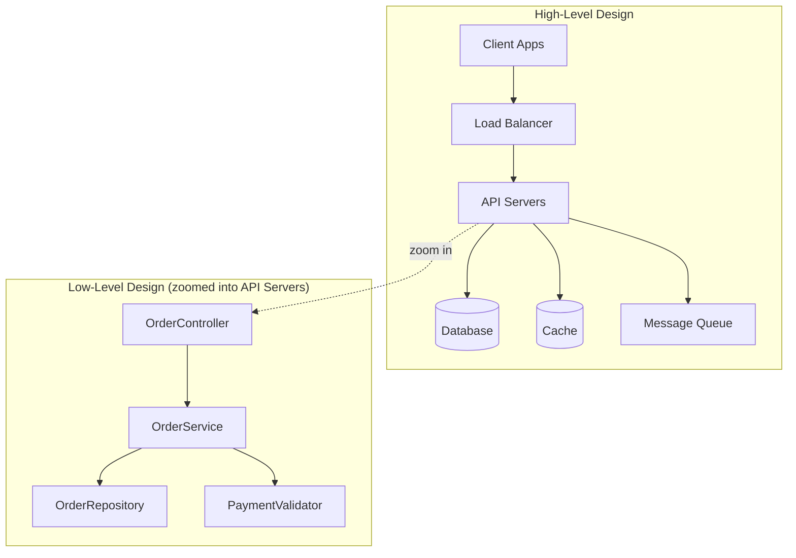

## Introduction

Every large application you use — Netflix, Uber, Instagram, your bank's app — was, at some point, a blank page. Someone had to decide: how will data flow through this system? What happens when 10 million people use it at once? What happens when a server catches fire?

**System Design** is the discipline of answering those questions before you write a single line of business logic. It's about shaping the *architecture* — the components, their responsibilities, and how they talk to each other — so that the system meets both its **functional requirements** (what it must do) and its **non-functional requirements** (how well it must do it: scale, latency, availability, consistency, cost).

This series will take you from the absolute basics of networking and databases through to designing systems like WhatsApp, Uber, and YouTube from scratch.

## High-Level Design (HLD) vs Low-Level Design (LLD)

These two terms get used loosely, so let's pin them down.

| Aspect | High-Level Design (HLD) | Low-Level Design (LLD) |
|---|---|---|
| Focus | System architecture, components, data flow | Class structure, methods, design patterns |
| Audience | Architects, senior engineers, stakeholders | Developers implementing the feature |
| Output | Architecture diagrams, component boundaries, tech choices | Class diagrams, sequence diagrams, pseudocode |
| Example question | "Design Uber" | "Design the class structure for a parking lot" |
| Typical scale of thinking | Servers, databases, queues, caches, load balancers | Interfaces, inheritance, SOLID principles |

Think of HLD as drawing the map of a city — where the highways, neighborhoods, and utilities go. LLD is the blueprint for a single building on one block: room layout, wiring, plumbing.

This series is focused on **HLD** — the kind of system design most commonly tested at the senior/staff engineer level, and the one that dominates "Design X" interview rounds.

## Why System Design Matters

1. **Systems fail at scale in ways they never fail in a demo.** A design that works for 100 users can collapse at 100,000 — not because the code is wrong, but because the architecture wasn't built for that load.
2. **Trade-offs are unavoidable.** You cannot have perfect consistency, zero latency, infinite availability, and minimal cost simultaneously. System design is the art of choosing which trade-offs your system can afford.
3. **It's a proxy for engineering seniority.** Interviewers use system design rounds to evaluate whether you can reason about ambiguity, push back on vague requirements, and make defensible decisions — skills that matter more as you get more senior.

## What Interviewers Are Actually Scoring

A common mistake candidates make is treating a system design interview like a trivia round — rattling off buzzwords like "we'll use Kafka and shard the database" without justification. Strong interviewers evaluate:

- **Requirement gathering** — Did you clarify scope, scale, and constraints before designing? (Chapter 48 covers a full framework for this.)
- **Structured thinking** — Did you move from requirements → high-level architecture → deep dives, rather than jumping straight to a whiteboard of boxes?
- **Trade-off reasoning** — For every major decision (SQL vs NoSQL, monolith vs microservices), can you articulate *why*, and what you're giving up?
- **Capacity estimation** — Can you do rough back-of-the-envelope math to justify choices like "we need sharding" or "we need a CDN"?
- **Communication** — Can you explain your design clearly, adapt when the interviewer changes requirements mid-interview, and admit uncertainty instead of bluffing?

## Functional vs Non-Functional Requirements

- **Functional requirements**: What the system should do. Example for a URL shortener: "Users can submit a long URL and receive a short URL that redirects to it."
- **Non-functional requirements (NFRs)**: The quality attributes the system must satisfy. These usually dominate the actual design discussion:
  - **Scalability** — can it handle growth in users/data/traffic?
  - **Availability** — what % of the time must it be up? (99.9%? 99.99%?)
  - **Consistency** — do all reads see the latest write, or is some staleness acceptable?
  - **Latency** — how fast must responses be?
  - **Durability** — can data survive failures without being lost?
  - **Fault tolerance** — does the system keep working when a component fails?

Every chapter in this series builds toward being able to reason about these NFRs concretely rather than abstractly.

## Summary

- System design is about architecting systems to meet functional and non-functional requirements, not just "make it work."
- HLD deals with architecture and component boundaries; LLD deals with class-level implementation details.
- Interviewers score structured thinking, trade-off reasoning, and communication — not memorized architectures.
- Every design decision from here on will be framed around explicit trade-offs against NFRs like scalability, availability, consistency, and latency.

---

## Interview Questions

### 1. What is the difference between HLD and LLD? Give an example of each.
**Answer:** HLD defines the overall architecture — the major components (services, databases, caches, queues) and how they interact — without getting into implementation detail. LLD defines how a specific component is implemented internally: classes, interfaces, method signatures, and design patterns used.

*Example:* For an e-commerce checkout system, HLD would specify that there's an Order Service, a Payment Service, and an Inventory Service communicating over REST/events. LLD would define the `OrderService` class, its `placeOrder()` method, how it uses the Strategy pattern to select a payment processor, and its interaction with a `PaymentGateway` interface.

**Follow-up:** *In a 45-minute interview, how much time would you spend on HLD vs LLD if asked to "design Uber"?* — Almost the entire interview on HLD (requirements, architecture, data flow, trade-offs), reserving only the last few minutes, if any, for a LLD sketch of one critical component if explicitly asked.

### 2. What are non-functional requirements, and why do they matter more than functional requirements in most system design interviews?
**Answer:** NFRs describe quality attributes — scalability, availability, latency, consistency, durability, security — rather than specific features. They matter more in interviews because the *functional* behavior of most systems ("users can send messages," "users can shorten URLs") is simple; the interesting engineering challenge is meeting that behavior under real-world constraints: millions of users, network partitions, hardware failures, and tight latency budgets. The NFRs are what actually drive architectural decisions like sharding, caching, and replication.

**Follow-up:** *Can you have a system that is both strongly consistent and highly available during a network partition?* — No; this is the essence of the CAP theorem (covered in Chapter 18) — during a partition, you must choose consistency or availability, not both.

### 3. Explain the CAP theorem at a conceptual level (without going deep — that's a later chapter). Why is it relevant to HLD?
**Answer:** CAP theorem states that a distributed system can provide at most two of three guarantees simultaneously during a network partition: Consistency (all nodes see the same data), Availability (every request gets a response), and Partition tolerance (the system keeps working despite network failures between nodes). Since partitions are unavoidable in real distributed systems, the real choice is between consistency and availability when a partition occurs. It's relevant to HLD because it directly informs database and replication choices — e.g., choosing a CP system like a strongly consistent SQL database vs an AP system like Cassandra or DynamoDB.

**Follow-up:** *Give one real system that favors A over C, and one that favors C over A.* — DNS favors availability (it will serve possibly stale records rather than fail); a traditional relational database with synchronous replication favors consistency (it may reject writes rather than risk divergence).

### 4. Walk through a structured approach you'd use to tackle "Design a URL Shortener" in an interview.
**Answer:** 
1. Clarify functional requirements (shorten URL, redirect, custom aliases? expiry? analytics?).
2. Clarify NFRs and scale (how many URLs/day, read:write ratio, latency expectations).
3. Do capacity estimation (storage needed for N years of URLs, QPS for reads vs writes).
4. Sketch high-level architecture (API servers, database, cache, ID generation service).
5. Deep dive into the hardest part — usually unique ID/short-code generation.
6. Discuss trade-offs (SQL vs NoSQL, caching strategy, database sharding).
7. Address failure scenarios and scaling bottlenecks.

**Follow-up:** *Why do capacity estimation before designing the architecture?* — Because the numbers determine the architecture. A system serving 100 requests/day needs a single server and a simple database; one serving 100K requests/second needs load balancers, caching layers, and sharded storage. Skipping estimation risks over- or under-engineering.

### 5. What's the danger of jumping straight to "we'll use microservices and Kafka" without discussing requirements first?
**Answer:** It signals pattern-matching rather than reasoning. Microservices and Kafka solve specific problems (independent scaling/deployment, and asynchronous decoupling, respectively) — but they also add operational complexity, network latency, and eventual consistency challenges. Proposing them without justifying *why* the specific requirements demand them suggests the candidate is reciting a memorized template rather than designing for the problem at hand. It also often signals to interviewers a lack of real production experience with the complexity these tools introduce.

**Follow-up:** *When would a monolith actually be the better answer in an interview?* — When the requirements describe a small-scale system, an early-stage product, or explicitly value simplicity and fast iteration over independent scalability — see Chapter 34.

### 6. What does "availability" mean quantitatively? What does "five nines" mean?
**Answer:** Availability is the percentage of time a system is operational and able to serve requests, measured over a period (typically a year). "Five nines" (99.999%) availability allows roughly 5.26 minutes of downtime per year. "Three nines" (99.9%) allows about 8.76 hours per year. Each additional nine is exponentially harder and more expensive to achieve, requiring redundancy at every layer (multi-region deployments, automated failover, no single points of failure).

**Follow-up:** *Would you propose a five-nines design for every system you're asked to design in an interview?* — No — proposing unnecessarily high availability targets without justification, given the added cost and complexity, is itself a red flag. You should ask what SLA the system needs and design proportionally.

### 7. What is a single point of failure (SPOF), and how does it relate to HLD?
**Answer:** A SPOF is any component whose failure brings down the entire system — e.g., a single database instance with no replica, or a single load balancer with no standby. Identifying and eliminating SPOFs (through redundancy, replication, and failover) is a core HLD responsibility, since availability and fault tolerance are usually explicit NFRs.

**Follow-up:** *Is a load balancer itself a potential SPOF? How would you address that?* — Yes, if there's only one. The standard fix is to run multiple load balancer instances behind a DNS-level or hardware-level failover mechanism (e.g., using a floating/virtual IP or DNS round-robin across multiple LB nodes).

### 8. How do latency and throughput differ, and why does an interviewer care about both?
**Answer:** Latency is the time to complete a single request (e.g., 50ms per API call). Throughput is the number of requests a system can handle per unit time (e.g., 10,000 requests/second). They interact: a system can have low latency but be throughput-limited if it lacks parallel processing capacity, or high throughput with poor latency if requests get queued. Interviewers care about both because real systems must satisfy user-facing latency SLAs *while* handling aggregate load — designing for one without the other produces an incomplete system.

**Follow-up:** *Can improving throughput sometimes worsen latency for individual requests?* — Yes — techniques like batching (e.g., batching writes to a database) improve throughput but add queuing delay, increasing per-request latency. This is a classic trade-off you should be ready to name explicitly.

### 9. What's the difference between scalability and elasticity?
**Answer:** Scalability is a system's ability to handle increased load by adding resources (vertically or horizontally). Elasticity is the ability to *automatically* scale resources up and down in response to real-time demand, typically in cloud environments — provisioning more servers during a traffic spike and releasing them afterward. A system can be scalable without being elastic (e.g., manually adding servers during planned capacity upgrades).

**Follow-up:** *Why might elasticity matter more for a system like a ticket-booking platform than for an internal admin dashboard?* — Ticket-booking systems see extreme, unpredictable traffic spikes (e.g., a popular concert going on sale) that make auto-scaling essential for cost efficiency and availability; an internal dashboard has predictable, low, steady load where elasticity offers little benefit.

### 10. Describe durability. How is it different from availability?
**Answer:** Durability guarantees that once data is written and acknowledged, it will not be lost, even in the face of hardware failures — typically achieved through replication and persistent storage (e.g., writing to disk, replicating across availability zones). Availability is about whether the *system* is reachable and responsive; a system can be available but not durable (an in-memory cache that's always up but loses data on restart), or durable but temporarily unavailable (a database that's down for maintenance but hasn't lost any committed data).

**Follow-up:** *Give an example of a component that prioritizes availability over durability.* — A pure in-memory cache like Memcached (without persistence) — it's built to be extremely fast and available, but a crash loses all cached data, which is acceptable since it's not the system of record.

### 11. In an interview, the requirements are deliberately vague ("design a social media feed"). What's your first move?
**Answer:** Ask clarifying questions before designing anything: Who are the users? What's the read/write ratio? Do we need real-time updates? What's the expected scale (users, posts/day)? Do we need to support media (images/video)? Is strong consistency required, or is eventual consistency acceptable for a feed? This narrows an intentionally open-ended prompt into a concrete, scoped problem you can design against — and demonstrates the requirement-gathering skill interviewers are evaluating.

**Follow-up:** *What happens if you skip this step and start designing immediately?* — You risk designing for the wrong scale or the wrong constraints (e.g., over-engineering a system for millions of users when the interviewer only cares about a 10K-user MVP), wasting time and signaling weak requirements discipline.

### 12. What role do trade-offs play in a "good" system design answer versus a "great" one?
**Answer:** A good answer produces a working architecture. A great answer explicitly names the trade-offs behind each decision — e.g., "I'm choosing eventual consistency here because the feed doesn't need to reflect a new post within milliseconds, and this lets us scale reads horizontally via caching" — showing the candidate understands there was no single "correct" architecture, only one suited to the stated constraints.

**Follow-up:** *How would your trade-off reasoning change if the interviewer said financial transactions were involved instead of social media posts?* — You'd shift heavily toward strong consistency and durability (e.g., ACID-compliant relational databases, synchronous replication) even at the cost of some latency or availability, since correctness of financial state is non-negotiable in a way that a slightly stale social feed is not.

### 13. What is meant by "back-of-the-envelope estimation," and why is it done early in the design process?
**Answer:** It's a rough, order-of-magnitude calculation of expected load — e.g., estimating daily active users, requests per second, storage growth per year — using simple arithmetic rather than precise measurement. It's done early because these numbers determine architectural choices: whether you need a CDN, whether a single database can handle the load, whether sharding is necessary from day one or can be deferred.

**Follow-up:** *If you estimate 500 requests/second at peak, does that alone tell you whether you need a distributed system?* — Not by itself — you'd also need to know the complexity per request, acceptable latency, and growth trajectory. 500 RPS of simple key-value lookups might be handled by a single well-provisioned server with caching, while 500 RPS of complex joins might already require read replicas or denormalization.

### 14. Why do experienced engineers often say "everything is a trade-off" in the context of system design?
**Answer:** Because nearly every architectural decision improves one quality attribute at the expense of another: caching improves latency but risks stale data; sharding improves write scalability but complicates cross-shard queries and transactions; synchronous replication improves durability but increases write latency. There is rarely a decision that is a pure win with no cost — recognizing and articulating the cost is what separates surface-level knowledge from deep understanding.

**Follow-up:** *Can you think of a scenario where adding a cache actually hurts a system rather than helping it?* — Yes — for write-heavy workloads with low read repetition (e.g., unique one-time-read data), a cache adds complexity and potential staleness with little benefit, since there's minimal read reuse to amortize the cost of maintaining the cache.

### 15. How should you handle a moment in the interview where the interviewer suddenly changes a requirement (e.g., "now assume 100x the traffic")?
**Answer:** Treat it as an invitation to demonstrate adaptability, not a sign you designed wrong. Revisit the specific components that break under the new load (e.g., "the single database from before would now be a bottleneck; I'd introduce read replicas and consider sharding by user ID"), and explain what changes and why — rather than throwing away the whole design. This mirrors real-world system evolution, where architectures are incrementally scaled, not rebuilt from scratch.

**Follow-up:** *Why is it better to evolve the design incrementally rather than redesign from scratch when scale changes?* — It reflects how real systems actually scale in production (incrementally, under real constraints and cost pressure), and it demonstrates you understand *which* components are scale-sensitive rather than treating the whole architecture as equally fragile.
