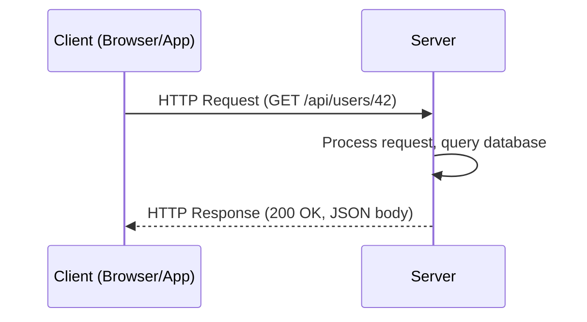
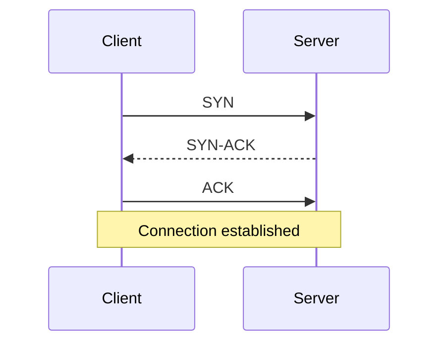

## Introduction

Almost every system you'll design in this series is, at its core, a set of programs exchanging messages over a network. Before diving into load balancers and databases, it's worth grounding the mental model: what actually happens when a mobile app "talks to" a server?

## The Client-Server Model

In this model, **clients** (browsers, mobile apps, other services) initiate requests, and **servers** listen for and respond to them. The server owns the shared resource — a database, business logic, or file storage — that many clients need to access concurrently.



Key properties of this model:
- **Statelessness (often)**: Many server designs treat each request independently, without relying on server-side memory of prior requests — this is central to horizontal scalability (Chapter 7).
- **Many-to-one (or many-to-many)**: Many clients connect to one server, or to a fleet of servers behind a load balancer.
- **Asymmetry**: Clients typically initiate; servers typically respond (though WebSockets and Server-Sent Events break this, covered in Chapter 5).

## Sockets, Ports, and Connections

A **socket** is an endpoint for sending/receiving data across a network, identified by an IP address and a **port number**. A server "listens" on a port (e.g., port 443 for HTTPS); a client opens a socket connection to that IP:port pair.

- Ports 0–1023 are "well-known" ports (80 = HTTP, 443 = HTTPS, 22 = SSH, 5432 = PostgreSQL default).
- A single server can handle many simultaneous connections because each connection is uniquely identified by the tuple **(source IP, source port, destination IP, destination port, protocol)**.

### TCP vs UDP

| | TCP | UDP |
|---|---|---|
| Connection | Connection-oriented (handshake required) | Connectionless |
| Reliability | Guaranteed delivery, ordered | No delivery guarantee |
| Overhead | Higher (acknowledgments, retransmission) | Lower |
| Use cases | Web traffic, databases, file transfer | Video streaming, gaming, DNS queries, VoIP |

Most systems in this series ride on top of TCP (via HTTP), since correctness usually matters more than raw speed. UDP shows up later when we discuss video streaming (Chapter 56) and DNS (Chapter 3).

### The TCP Three-Way Handshake



This handshake happens *before* any application data (like an HTTP request) is sent — which is part of why establishing new TCP connections repeatedly is expensive, and why techniques like **connection pooling** and **keep-alive** connections (Chapter 4) matter for performance.

## A Simple Java Illustration

While production systems use frameworks (like Spring's embedded servers), it's worth seeing the raw mechanics once. Here's a minimal blocking server socket in Java:

```java
import java.io.*;
import java.net.*;

public class SimpleServer {
    public static void main(String[] args) throws IOException {
        try (ServerSocket serverSocket = new ServerSocket(8080)) {
            System.out.println("Listening on port 8080...");
            while (true) {
                Socket clientSocket = serverSocket.accept(); // blocks until a client connects
                handleClient(clientSocket);
            }
        }
    }

    private static void handleClient(Socket socket) throws IOException {
        try (BufferedReader in = new BufferedReader(new InputStreamReader(socket.getInputStream()));
             PrintWriter out = new PrintWriter(socket.getOutputStream(), true)) {
            String requestLine = in.readLine();
            System.out.println("Received: " + requestLine);
            out.println("HTTP/1.1 200 OK");
            out.println("Content-Type: text/plain");
            out.println();
            out.println("Hello from a raw socket server!");
        }
    }
}
```

This is, structurally, what an embedded Tomcat/Netty server does under the hood — just with thread pools, non-blocking I/O, and HTTP parsing layered on top for production use.

## Blocking vs Non-Blocking I/O (Brief Preview)

- **Blocking (thread-per-request)**: Each connection ties up a thread until the request completes. Simple, but doesn't scale well to tens of thousands of concurrent connections (thread memory overhead, context-switching cost).
- **Non-blocking (event loop)**: A small number of threads handle many connections by reacting to I/O readiness events (used by Netty, Node.js, Nginx). This underlies how modern systems handle massive concurrent connection counts — relevant later when designing chat systems (Chapter 53) that hold millions of open WebSocket connections.

## Summary

- The client-server model splits responsibility: clients initiate, servers respond and own shared state.
- Connections are identified by IP:port pairs; TCP provides reliable, ordered delivery at the cost of handshake overhead, while UDP trades reliability for speed.
- Understanding raw sockets demystifies what frameworks like Spring Boot's embedded server are doing underneath.
- Blocking vs non-blocking I/O models become critical when designing systems with very high concurrent connection counts.

---

## Interview Questions

### 1. Explain the client-server model and why statelessness is often desirable on the server side.
**Answer:** In the client-server model, clients send requests and servers process them and return responses, with the server owning shared resources like databases. Statelessness means the server doesn't retain per-client session state between requests — each request carries everything needed to process it (e.g., an auth token). This is desirable because it allows any server instance behind a load balancer to handle any request, enabling horizontal scaling without needing "sticky sessions" or shared session replication.

**Follow-up:** *If a server must be stateful (e.g., holds a WebSocket connection), how does that complicate horizontal scaling?* — The client must be routed back to the same server instance for subsequent messages (sticky sessions), or session state must be externalized (e.g., to Redis) so any instance can serve the client — both add complexity compared to pure statelessness.

### 2. What is a socket, and how can one server handle thousands of client connections on the same port?
**Answer:** A socket is a combination of an IP address and port number representing one end of a network connection. A server can handle many simultaneous connections on the same listening port because each individual connection is uniquely identified by the 4-tuple (or 5-tuple with protocol): source IP, source port, destination IP, destination port. The OS's networking stack demultiplexes incoming packets to the correct connection based on this tuple.

**Follow-up:** *Does this mean a server is limited to 65,535 total connections because there are only 65,535 ports?* — No — that limit applies to a single client's *outgoing* ports to one server. The server itself listens on one fixed port and can serve many clients using many different source IPs/ports, limited instead by OS file descriptor limits and available memory.

### 3. Compare TCP and UDP. Give one system design scenario where you'd choose each.
**Answer:** TCP is connection-oriented and guarantees ordered, reliable delivery through acknowledgments and retransmission, at the cost of handshake and congestion-control overhead. UDP is connectionless, with no delivery or ordering guarantees, but has much lower overhead. Choose TCP for a payment API where every request must arrive reliably and in order. Choose UDP for live video streaming, where an occasional dropped packet causing a brief glitch is preferable to the added latency of retransmission and buffering.

**Follow-up:** *Why does DNS use UDP by default?* — DNS queries are small, latency-sensitive, and idempotent (a client can simply retry if no response arrives), so the reliability guarantees of TCP aren't worth the added round-trip overhead for the common case.

### 4. Walk through the TCP three-way handshake and explain why it matters for system performance.
**Answer:** The client sends a SYN packet; the server responds with SYN-ACK; the client responds with ACK, at which point the connection is established. It matters for performance because this round trip (or two, when combined with TLS negotiation) adds latency *before* any actual application data is exchanged. This is why techniques like HTTP keep-alive (reusing an existing TCP connection for multiple requests) and connection pooling in database clients exist — to amortize this cost across many requests instead of paying it per request.

**Follow-up:** *How does HTTP/2's use of a single multiplexed connection relate to this handshake cost?* — HTTP/2 multiplexes many requests over one TCP connection, meaning the handshake cost (and TLS negotiation cost) is paid once, not once per request — significantly reducing overhead compared to HTTP/1.1's tendency to open multiple connections per page load.

### 5. What's the difference between blocking and non-blocking I/O, and why does it matter for a chat application with millions of connections?
**Answer:** Blocking I/O dedicates a thread to each connection, which blocks (waits) until data is available; this doesn't scale well because threads are relatively expensive (memory for stack, OS scheduling overhead), so tens of thousands of concurrent connections can exhaust resources. Non-blocking I/O uses an event loop where a small number of threads handle readiness notifications for many connections simultaneously, allowing a single machine to hold hundreds of thousands of idle connections (like WebSocket connections in a chat app) efficiently.

**Follow-up:** *Does non-blocking I/O eliminate the need for multiple threads entirely?* — No — production non-blocking servers (like Netty) typically still use a small pool of event-loop threads, often matched to CPU core count, to parallelize processing while avoiding the one-thread-per-connection model.

### 6. What happens, step by step, when you type a URL into a browser and press Enter? (High level only — DNS detail comes in the next chapter.)
**Answer:** The browser checks caches for a DNS resolution, resolves the domain to an IP address, opens a TCP connection to that IP on port 443 (for HTTPS), performs a TLS handshake to establish an encrypted channel, sends an HTTP request over that connection, the server processes it (possibly querying databases/caches), and returns an HTTP response, which the browser renders.

**Follow-up:** *Which of these steps benefits most from caching, and why?* — DNS resolution and TLS session resumption both benefit heavily from caching, since they represent fixed overhead per new connection that can be avoided on repeat visits, directly reducing perceived page load latency.

### 7. Why might a well-known port number matter in system design (e.g., why does HTTPS conventionally use 443)?
**Answer:** Well-known ports provide a convention so clients don't need to be told which port to connect to — a browser assumes port 443 for HTTPS and port 80 for HTTP by default. In system design, this matters when configuring load balancers, firewalls, and security groups: you must ensure the correct ports are open and correctly mapped, and using non-standard ports requires explicit client configuration or service discovery.

**Follow-up:** *In a microservices architecture, do internal services typically also rely on these same well-known ports?* — Not always — internal services often use custom ports and rely on service discovery (Chapter 35) rather than hardcoded well-known ports, since there's no browser convention to satisfy internally.

### 8. What is connection pooling, and why is it especially important for database access in high-throughput systems?
**Answer:** Connection pooling maintains a set of pre-established, reusable connections (e.g., to a database) rather than opening and closing a new connection per request. Since establishing a TCP connection (and, for databases, authenticating) is relatively expensive, pooling amortizes that cost across many requests, dramatically improving throughput and reducing latency in high-QPS systems.

**Follow-up:** *What happens if your connection pool size is set too low for your traffic level?* — Requests queue up waiting for an available connection, increasing latency and potentially causing timeouts under load — a common, easily overlooked production bottleneck.

### 9. Explain the difference between a stateless server and a stateless protocol, using HTTP as an example.
**Answer:** HTTP as a *protocol* is stateless — each HTTP request is processed independently, with no built-in memory of prior requests. A *server*, however, can layer state on top of this stateless protocol (e.g., via server-side sessions keyed by a cookie). So "HTTP is stateless" describes the protocol's design, while whether your *application* is stateless is a separate architectural choice you make.

**Follow-up:** *If a server uses a JWT for authentication rather than a server-side session, does that make the server more or less stateless, and why does that matter for scaling?* — More stateless — since the JWT itself carries the necessary claims, any server instance can validate and process the request without needing shared session storage, which simplifies horizontal scaling.

### 10. What role does the operating system play in network communication that application code usually doesn't need to think about?
**Answer:** The OS kernel manages the network stack: it handles TCP's handshake, retransmission, and congestion control; demultiplexes incoming packets to the correct socket based on the connection tuple; and manages buffers for incoming/outgoing data. Application code typically interacts with this through a socket API (or a higher-level HTTP framework) without manually implementing packet-level logic.

**Follow-up:** *Why does this separation of concerns matter for system design interviews?* — It lets you reason about network behavior (like connection limits, keep-alive, or the cost of TLS handshakes) at the right level of abstraction, without needing to design packet-level protocols yourself — the interview expects architectural reasoning, not OS kernel implementation.

### 11. In a load-balanced system, why can't a load balancer simply pick a random backend server for *every single* request within a session, if the servers are stateless?
**Answer:** If servers are genuinely stateless, it actually can — that's the point of statelessness. Random or round-robin routing per request only becomes problematic when some state (e.g., a session, a WebSocket connection, or an in-memory cache used for that user) is tied to a specific server instance, at which point requests need to be routed consistently ("sticky sessions") to that instance.

**Follow-up:** *What's a downside of relying on sticky sessions instead of designing for full statelessness?* — It creates uneven load distribution risk (some servers may end up with disproportionately many active sessions) and complicates failover — if that specific server goes down, its in-memory session state is lost unless externalized.

### 12. What is NAT (Network Address Translation), and why does it matter when reasoning about client IP addresses in system design?
**Answer:** NAT allows multiple devices on a private network to share a single public IP address, translating between private and public addresses at the router/gateway. It matters in system design because a server often sees the NAT gateway's IP rather than the true client IP, which affects features like IP-based rate limiting or geolocation — you typically need to rely on headers like `X-Forwarded-For` (set by proxies/load balancers) to recover the original client IP, and even those can be spoofed if not carefully validated.

**Follow-up:** *Why can't you fully trust the `X-Forwarded-For` header without validation?* — Because it's a regular HTTP header that a malicious client could set directly; it should only be trusted when set/overwritten by a trusted reverse proxy or load balancer at the network edge, with earlier client-supplied values stripped or ignored.

### 13. How does latency introduced by physical distance (speed-of-light delay) factor into system design decisions?
**Answer:** Network latency has a physical floor determined by the speed of light through fiber (roughly 5 microseconds per kilometer, in practice higher due to routing). A round trip between, say, the US and Asia can add 150–250ms regardless of how fast your servers are. This motivates decisions like deploying multi-region infrastructure, using CDNs to serve content from geographically close edge locations, and choosing eventual consistency models that don't require synchronous cross-region coordination for every request.

**Follow-up:** *Why can't you simply solve this problem by adding more/faster servers in a single region?* — Because the latency is dictated by physical distance and the speed of light, not compute power — no amount of server capacity in one location reduces the propagation delay to a client on another continent; only geographic distribution of infrastructure addresses it.

### 14. What is the difference between latency and bandwidth, and why can a high-bandwidth connection still feel "slow"?
**Answer:** Bandwidth is the maximum data transfer rate of a connection (e.g., 1 Gbps); latency is the time delay before data starts arriving (e.g., 100ms round trip). A connection can have very high bandwidth but still feel slow for latency-sensitive interactions (like many small sequential API calls) because each round trip pays the latency cost regardless of how much bandwidth is available — this is why reducing the *number* of round trips (e.g., via HTTP/2 multiplexing or batching requests) often improves perceived performance more than increasing bandwidth.

**Follow-up:** *Would increasing bandwidth help a video streaming service more, or a chat application more? Why?* — Video streaming benefits more from bandwidth (large continuous data transfer), while chat applications are far more sensitive to latency (small messages, but responsiveness is the main experience) — informing very different architectural priorities for each.

### 15. Why do system designers care about keep-alive connections in HTTP?
**Answer:** Without keep-alive, each HTTP request would require a new TCP connection (and, for HTTPS, a new TLS handshake), incurring significant round-trip overhead. Keep-alive allows multiple HTTP requests/responses to be sent over a single, already-established TCP connection, amortizing connection setup cost and substantially reducing latency for clients making multiple requests, such as a browser loading a page with many assets.

**Follow-up:** *Is there a downside to keeping too many idle keep-alive connections open on a server?* — Yes — each open connection consumes server resources (memory, file descriptors) even while idle, so servers typically enforce idle timeouts to reclaim resources from connections that are no longer actively used.
