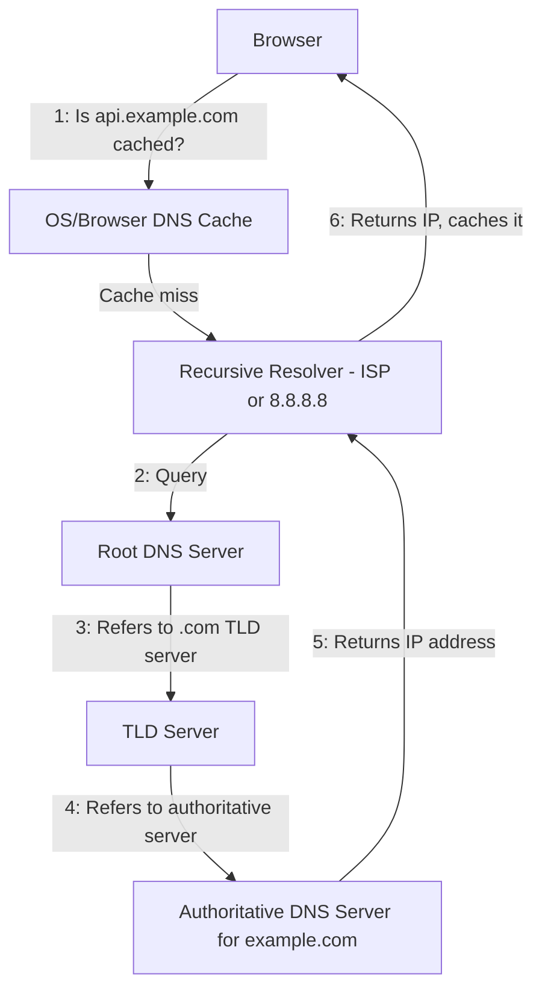
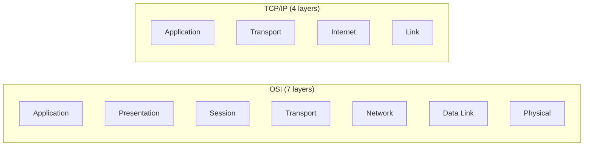

## Introduction

You don't need to be a network engineer to design systems well, but you do need a working mental model of how a domain name turns into a connection to a specific server, and how the layers of networking fit together. This chapter covers exactly that — the minimum networking knowledge that shows up repeatedly in system design interviews.

## IP Addressing, Briefly

An **IP address** uniquely identifies a device on a network. IPv4 addresses (e.g., `192.0.2.1`) are 32-bit, giving about 4.3 billion possible addresses — long exhausted for the public internet, which is why IPv6 (128-bit addresses) and techniques like NAT exist.

For system design purposes, what matters most is:
- Public IPs are globally routable; private IPs (e.g., `10.0.0.0/8`, `192.168.0.0/16`) are only valid within a private network (like a VPC).
- Cloud architectures place most backend services (databases, internal microservices) on private IPs, exposing only load balancers/API gateways on public IPs — this is a basic but important security boundary.

## How DNS Resolution Works

**DNS (Domain Name System)** translates human-readable domain names (`api.example.com`) into IP addresses. It's often described as "the phonebook of the internet," but it's really a distributed, hierarchical, and heavily cached lookup system.

Step by step:
1. The browser/OS checks its local DNS cache first.
2. On a cache miss, it queries a **recursive resolver** (often provided by your ISP, or a public one like `8.8.8.8` or `1.1.1.1`).
3. The resolver queries a **root nameserver**, which points it to the correct **TLD (top-level domain) nameserver** (e.g., for `.com`).
4. The TLD nameserver points to the **authoritative nameserver** for the specific domain, which returns the actual IP address (an "A" record) or a CNAME pointing elsewhere.
5. The resolver caches this result (respecting the record's TTL) and returns it to the client.

### Common DNS Record Types

| Record | Purpose |
|---|---|
| A | Maps a hostname to an IPv4 address |
| AAAA | Maps a hostname to an IPv6 address |
| CNAME | Aliases one hostname to another hostname |
| MX | Specifies mail servers for the domain |
| TXT | Arbitrary text, often used for domain verification/SPF |
| NS | Specifies the authoritative nameservers for the domain |

### DNS and System Design: Why It Matters

- **TTL (Time to Live)** controls how long a DNS record is cached. A low TTL enables fast failover (you can repoint a domain quickly), at the cost of more frequent DNS lookups; a high TTL reduces lookup load but slows propagation of changes.
- **DNS load balancing**: Returning multiple IP addresses for one domain (or different IPs to different regions via **GeoDNS**) provides a simple, if coarse, load-balancing and failover mechanism at the DNS layer — before a request even reaches a dedicated load balancer.
- **DNS is itself a distributed system** worth studying as a design pattern: hierarchical, heavily cached, eventually consistent (propagation delay after changes), and designed for extreme read scalability with rare writes.

## The OSI Model (Conceptual Overview)

The OSI model is a 7-layer conceptual framework for network communication. You don't need to memorize it for its own sake, but knowing where key technologies "live" helps you reason about where problems and optimizations happen.

| Layer | Name | Examples | Relevance to System Design |
|---|---|---|---|
| 7 | Application | HTTP, gRPC, DNS | Where your API contracts live |
| 6 | Presentation | TLS/SSL, encoding | Where encryption/compression happens |
| 5 | Session | Session management | Connection state management |
| 4 | Transport | TCP, UDP | Where load balancers often operate (L4 LB) |
| 3 | Network | IP, routing | Where IP addressing and routing happen |
| 2 | Data Link | Ethernet, MAC addresses | Local network delivery |
| 1 | Physical | Cables, radio signals | The actual electrical/optical transmission |

In practice, the internet runs on the simpler **TCP/IP model** (4 layers: Application, Transport, Internet, Link), which maps roughly onto OSI but merges several layers. The distinction between **Layer 4 (transport) load balancing** and **Layer 7 (application) load balancing** — covered in Chapter 8 — is the single most interview-relevant callback to this model.

## Summary

- DNS is a hierarchical, heavily cached lookup system translating domain names to IP addresses — and is itself a useful case study in distributed system design.
- TTL settings on DNS records are a real lever system designers pull to balance failover speed against lookup load.
- GeoDNS and multi-IP DNS responses provide a coarse, early layer of load balancing before requests hit dedicated infrastructure.
- The OSI/TCP-IP models matter mainly as a shared vocabulary — especially the L4 vs L7 distinction used constantly when discussing load balancers.

---

## Interview Questions

### 1. Walk through what happens when a browser resolves `www.example.com` to an IP address for the very first time (cold cache).
**Answer:** The browser checks its local cache (miss), then the OS cache (miss), then queries a configured recursive resolver. The resolver queries a root nameserver, which returns a referral to the `.com` TLD nameserver; the TLD nameserver returns a referral to `example.com`'s authoritative nameserver; the authoritative nameserver returns the actual A/AAAA record. The resolver caches this result according to its TTL and returns the IP to the browser, which then opens a TCP connection to that IP.

**Follow-up:** *Why is this multi-step process not a performance problem in practice for most users?* — Because of aggressive caching at every level (browser, OS, ISP resolver) combined with reasonably long TTLs — the vast majority of lookups are served from cache within microseconds, and the full resolution chain is only walked on a genuine cold cache.

### 2. What is a DNS TTL, and what trade-off does setting it low vs high involve?
**Answer:** TTL (Time to Live) specifies how long a DNS record can be cached before it must be re-queried. A low TTL means changes to DNS records (e.g., pointing a domain to a new server during a failover) propagate quickly, but it increases the volume of DNS queries hitting your authoritative nameservers and adds slight latency overhead from more frequent lookups. A high TTL reduces query volume and lookup overhead but means changes take longer to propagate globally, since cached resolvers won't re-check until the TTL expires.

**Follow-up:** *If you're planning a major infrastructure migration, what would you do to the TTL beforehand, and why?* — Lower the TTL well in advance of the migration (giving existing cached records time to expire under the old TTL), so that when you do cut over, the change propagates quickly rather than being stuck behind a long-cached, stale record.

### 3. What is GeoDNS, and how does it function as a simple load balancing mechanism?
**Answer:** GeoDNS resolves the same domain name to different IP addresses depending on the geographic location (or network) of the requester, typically routing users to the nearest or best-performing data center/region. It functions as a coarse load balancer by distributing traffic across regions at the DNS layer, before any request-level load balancing (like Layer 7 load balancers) occurs within a region.

**Follow-up:** *What's a limitation of GeoDNS compared to a dedicated load balancer?* — GeoDNS decisions are made once per DNS lookup (subject to caching/TTL) and don't account for real-time server health or load within a region — it can't instantly redirect an individual in-flight request if a specific backend server becomes unhealthy, unlike an active load balancer performing health checks per request.

### 4. What is the difference between a CNAME record and an A record, and when would you use each?
**Answer:** An A record maps a hostname directly to an IPv4 address. A CNAME record maps a hostname to *another hostname* (an alias), which is then further resolved. You'd use an A record when you control a stable IP address directly. You'd use a CNAME when pointing to a service whose underlying IP may change (e.g., pointing `www.example.com` to a CDN or load balancer's hostname like `xyz.cloudfront.net`), since the CDN provider can change its IPs without you needing to update your DNS record.

**Follow-up:** *Why can't you typically use a CNAME record at the root/apex domain (e.g., `example.com` itself, as opposed to `www.example.com`)?* — DNS specifications generally disallow a CNAME coexisting with other record types (like MX records) at the same name, and the root domain often needs those other records — most providers work around this with proprietary "ALIAS" or "ANAME" records that behave like a CNAME but are resolved server-side into an A record.

### 5. Explain the difference between Layer 4 and Layer 7 in the context of load balancing (previewing Chapter 8).
**Answer:** A Layer 4 load balancer operates at the transport layer, making routing decisions based on IP address and port information alone, without inspecting the actual application data (e.g., HTTP headers or URL paths) — it's fast and protocol-agnostic. A Layer 7 load balancer operates at the application layer, able to inspect HTTP headers, cookies, and URL paths to make more intelligent routing decisions (e.g., routing `/api/v2/*` to a specific service), at the cost of additional processing overhead.

**Follow-up:** *Why might a system use both an L4 and an L7 load balancer in the same architecture?* — An L4 load balancer can sit at the network edge for very high-throughput, low-latency initial traffic distribution (and DDoS resilience), while an L7 load balancer behind it handles more nuanced, content-aware routing to specific microservices — combining speed with intelligence at different points in the request path.

### 6. Why is DNS described as an "eventually consistent," highly cacheable distributed system, and what design lessons can be drawn from it?
**Answer:** DNS is eventually consistent because changes to records don't propagate instantly — cached resolvers continue serving old values until their TTL expires, meaning different clients can briefly see different results for the same domain after a change. The design lesson is that DNS optimizes heavily for read scalability and availability (billions of lookups per day, must-always-answer) at the cost of perfectly synchronized consistency — a trade-off directly analogous to choosing eventual consistency in distributed databases (Chapter 19) for read-heavy, latency-sensitive workloads.

**Follow-up:** *What technique does DNS use to achieve this massive read scalability?* — Hierarchical caching at multiple layers (browser, OS, ISP resolver, and intermediate resolvers) combined with a hierarchical namespace (root → TLD → authoritative) that distributes query load rather than funneling every lookup to a single central server.

### 7. What's the difference between a public and private IP address, and how does this distinction show up in typical cloud system architectures?
**Answer:** Public IPs are globally routable across the internet; private IPs (from reserved ranges like `10.0.0.0/8`) are only valid within a private network and are not routable on the public internet. In cloud architectures, backend components — databases, internal services, caches — are typically placed on private IPs within a VPC, with only load balancers or API gateways assigned public IPs, restricting direct internet access to internal systems as a security boundary.

**Follow-up:** *If internal services have no public IP, how do they access the internet (e.g., to call a third-party API)?* — Via a NAT gateway, which allows outbound traffic from private-IP instances to reach the internet using the NAT gateway's public IP, while still preventing unsolicited inbound connections directly to those private instances.

### 8. Explain what happens at the DNS level during a "blue-green" or failover deployment where you need to redirect traffic away from a failed region.
**Answer:** You'd update the DNS record(s) for the domain to point to the healthy region's IP (or load balancer), often using DNS-based health checks (offered by providers like Route 53) that automatically remove an unhealthy endpoint from the response set. Because of caching, this change propagates according to the record's TTL — which is why systems anticipating failover scenarios proactively set low TTLs on relevant records ahead of time.

**Follow-up:** *Why might relying solely on DNS-level failover be insufficient for a system requiring near-instant failover?* — Because DNS propagation delay (bound by TTL and various caching layers that don't always strictly honor TTL) can take from seconds to minutes; systems requiring near-instant failover often combine DNS-level failover with client-side retry/multi-endpoint logic or anycast routing that doesn't rely on DNS changes at all.

### 9. What is Anycast, and how does it differ from GeoDNS as a way to route users to the nearest server?
**Answer:** Anycast is a network-layer routing technique where the *same* IP address is announced from multiple physical locations, and internet routing infrastructure (BGP) automatically directs a client's traffic to the topologically nearest announcing location. This differs from GeoDNS, which resolves the *same domain* to *different IP addresses* based on the resolver's location — Anycast operates at the IP routing layer itself, so failover can happen almost instantly (routing tables update) without waiting on DNS caching/TTL at all.

**Follow-up:** *Why do many CDNs and DNS providers themselves (like Cloudflare) use Anycast?* — Because it provides very fast, automatic failover and naturally-nearest routing for latency-sensitive services (like DNS resolution itself or CDN edge delivery) without depending on DNS-layer caching behavior, which is exactly what CDNs need to minimize latency to end users.

### 10. Why does the interview-relevant takeaway from the OSI model boil down mostly to the L4 vs L7 distinction, rather than needing to memorize all seven layers?
**Answer:** Most system design discussions operate at the application layer (APIs, protocols like HTTP/gRPC) and occasionally reference the transport layer (TCP/UDP characteristics) — the middle/lower layers (physical, data link, network routing internals) are typically abstracted away by cloud infrastructure and rarely come up directly in HLD discussions, except implicitly through concepts like IP addressing. The L4/L7 load balancer distinction is the one place this layered thinking directly and frequently surfaces in interviews.

**Follow-up:** *Can you give an example of a system requirement that would specifically push you toward an L4 load balancer over an L7 one?* — Extremely high-throughput, latency-sensitive traffic (e.g., a real-time gaming backend or a raw TCP-based service) where the overhead of inspecting application-layer content isn't justified, and simple IP/port-based routing is sufficient and faster.

### 11. What does it mean that DNS uses UDP by default but can fall back to TCP? When does that fallback happen?
**Answer:** DNS queries are typically small and fit within a single UDP packet, so UDP is used by default for its lower overhead and faster round trip. DNS falls back to TCP when the response is too large to fit in a single UDP packet (historically 512 bytes, extended via EDNS0), such as responses with many records or DNSSEC signatures, or for zone transfers between nameservers, which require TCP's reliability guarantees.

**Follow-up:** *Why would using DNSSEC (DNS security extensions) make TCP fallback more likely?* — DNSSEC adds cryptographic signature data to DNS responses, often pushing the response size beyond what fits in a standard UDP packet, increasing the likelihood of needing TCP or UDP fragmentation handling.

### 12. In a microservices architecture, how does internal service-to-service communication typically differ from a browser resolving a public domain via DNS?
**Answer:** Internal services usually rely on **service discovery** (Chapter 35) — a dynamic registry (like Consul, Eureka, or Kubernetes' built-in DNS) that tracks currently healthy service instances and their private IPs — rather than public DNS. This is because internal topology changes far more frequently (instances scaling up/down, deployments) than a public-facing domain, and service discovery mechanisms are built for faster, more dynamic updates than traditional DNS TTL-based caching allows.

**Follow-up:** *Does Kubernetes' internal DNS work fundamentally differently from public DNS?* — Not fundamentally — it's still a DNS-based system (CoreDNS), but records are automatically and rapidly updated as pods/services change, with very short effective TTLs, making it responsive enough for dynamic internal service discovery.

### 13. Why do private IP ranges like `10.0.0.0/8` exist, and what problem do they solve?
**Answer:** Private IP ranges are reserved blocks of IP addresses (per RFC 1918) that are not routable on the public internet and can be freely reused within any private network without conflict. They solve IPv4 address exhaustion by allowing millions of devices across countless private networks (homes, offices, cloud VPCs) to use the same address ranges internally, only requiring a limited number of public IPs (often just one, via NAT) for actual internet-facing communication.

**Follow-up:** *Does IPv6 eliminate the need for private IP ranges and NAT?* — Largely yes for address exhaustion purposes, since IPv6's address space is vast enough for every device to have a unique public address, though private/NAT-like patterns are sometimes still used for network segmentation and security reasons rather than address scarcity.

### 14. How would DNS resolution latency factor into your design of a globally distributed service?
**Answer:** Since DNS resolution adds a (usually cached, but occasionally cold) round trip before any actual application request can begin, a globally distributed service benefits from strategies that minimize this: using DNS providers with globally distributed, low-latency authoritative nameservers (often via Anycast), setting sensible TTLs to maximize cache hits without sacrificing failover agility, and using GeoDNS or Anycast to ensure that once resolved, the IP returned is already close to the user — minimizing both DNS and subsequent connection latency.

**Follow-up:** *Would you prioritize DNS-layer optimizations or CDN/edge caching for reducing latency to end users, and why?* — Both matter, but CDN/edge caching (Chapter 11) typically has a larger latency impact since it addresses the actual content delivery, not just the initial address lookup — DNS optimization reduces a comparatively small, and heavily cached, portion of overall request latency.

### 15. What's a practical failure mode caused by DNS caching that engineers commonly encounter after a deployment or migration?
**Answer:** After changing a DNS record (e.g., pointing a domain to a new server during a migration), some clients continue hitting the old server for a period defined by the previous TTL, since their resolvers cached the old record before the change. This can cause confusing partial-rollout symptoms — some users see the new system, others still hit the decommissioned old one — especially problematic if the old server is taken down before all cached DNS entries have expired globally.

**Follow-up:** *What's a standard mitigation for this during a migration?* — Keep the old infrastructure running (even at reduced capacity) for a grace period at least as long as the previous TTL after the DNS change, and/or lower the TTL well in advance of the planned cutover so caches expire quickly once you do make the change.
