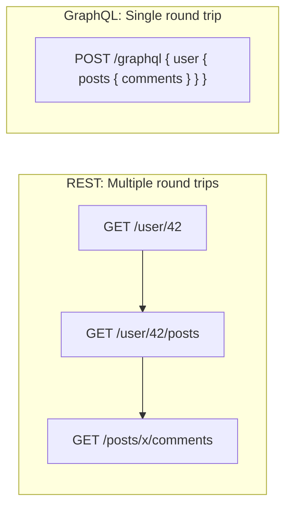
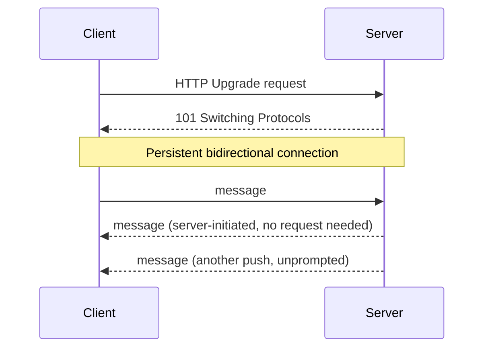

## Introduction

Choosing how services talk to each other — and how clients talk to your backend — is one of the earliest decisions in any HLD discussion. This chapter compares the four communication styles you'll encounter repeatedly throughout this series and later case studies.

## REST (Representational State Transfer)

REST is an architectural style (not a strict protocol) built on top of HTTP, organizing APIs around **resources** (nouns) manipulated via standard HTTP methods.

```
GET    /users/42          -> fetch user 42
POST   /users             -> create a new user
PUT    /users/42          -> replace user 42
DELETE /users/42          -> delete user 42
```

**Strengths**: Simple, cacheable (leverages HTTP caching semantics directly), human-readable (JSON), universally supported by every client and tool, easy to debug.

**Weaknesses**: 
- **Over-fetching/under-fetching** — a client might get more fields than it needs, or need multiple round trips to assemble a full view (e.g., fetching a user, then separately their posts, then separately each post's comments).
- No built-in strong typing/contract enforcement (though OpenAPI/Swagger mitigates this).

## GraphQL

GraphQL exposes a single endpoint where clients specify exactly which fields they need via a query language, and the server resolves them from potentially many underlying data sources.

```graphql
query {
  user(id: 42) {
    name
    posts(limit: 5) {
      title
      commentCount
    }
  }
}
```

**Strengths**: Solves over/under-fetching directly — the client gets exactly the shape of data it asks for, in a single round trip. Strongly typed schema serves as a contract and enables great tooling (autocomplete, validation).

**Weaknesses**: 
- Caching is harder — a single `POST /graphql` endpoint with varying query bodies doesn't benefit from standard HTTP/CDN caching the way REST's distinct URLs do (though field-level caching solutions exist).
- The **N+1 query problem** is a classic pitfall: naively resolving nested fields (e.g., each post's author) can trigger a database query per item unless batched (typically via a "DataLoader" pattern).
- Added server-side complexity (schema design, resolver implementation) compared to REST.



## gRPC

gRPC is a high-performance RPC (Remote Procedure Call) framework built on HTTP/2, using **Protocol Buffers (protobufs)** for a compact binary serialization format and a strongly typed contract (`.proto` files).

```protobuf
service UserService {
  rpc GetUser (UserRequest) returns (UserResponse);
}
message UserRequest { int32 id = 1; }
message UserResponse { string name = 1; string email = 2; }
```

**Strengths**: Very low latency and small payload size (binary, not text-based JSON); native support for streaming (client streaming, server streaming, bidirectional streaming); strongly typed contracts generate client/server code automatically in many languages — ideal for internal microservice-to-microservice communication.

**Weaknesses**: Not natively supported in browsers (requires a proxy like gRPC-Web); binary format is not human-readable, making ad hoc debugging harder; steeper learning curve and tooling requirements than REST.

## WebSockets

WebSockets establish a **persistent, full-duplex** connection between client and server, allowing either side to push messages at any time without the request-response pattern.



**Strengths**: True bidirectional, low-latency communication — ideal for chat apps (Chapter 53), live notifications, collaborative editing, multiplayer games.

**Weaknesses**: Stateful connections complicate horizontal scaling (a specific server instance holds the connection — sticky routing or a connection-aware layer like a pub-sub backplane is needed); doesn't benefit from standard HTTP caching/CDN infrastructure; requires careful handling of reconnection and message delivery guarantees on unreliable networks.

## Choosing Between Them

| Requirement | Best Fit |
|---|---|
| Simple public CRUD API, cacheability matters | REST |
| Client needs flexible, nested data shapes, mobile clients minimizing round trips | GraphQL |
| Internal, high-throughput microservice communication | gRPC |
| Real-time, server-initiated updates (chat, live feeds, gaming) | WebSockets (or Server-Sent Events for one-way server push) |

It's common — and often correct — for a single system to use *more than one* of these: REST or GraphQL for the public API, gRPC internally between services, and WebSockets for a specific real-time feature.

## Summary

- REST is simple and cacheable but can require multiple round trips for complex data needs.
- GraphQL solves over/under-fetching with a single flexible query, at the cost of caching simplicity and the N+1 query risk.
- gRPC is the go-to for fast, strongly-typed, internal service-to-service communication, especially with streaming needs.
- WebSockets provide true bidirectional real-time communication but introduce stateful-connection scaling challenges.
- Real systems frequently mix these — the "right" choice is per-use-case, not system-wide.

---

## Interview Questions

### 1. What is the "over-fetching / under-fetching" problem in REST, and how does GraphQL address it?
**Answer:** Over-fetching happens when a REST endpoint returns more fields than the client actually needs (e.g., a full user object when the client only needs the name); under-fetching happens when a single REST endpoint doesn't provide enough nested/related data, forcing the client to make multiple sequential requests (e.g., fetch a user, then separately fetch their posts). GraphQL addresses both by letting the client specify exactly the fields and nested relationships it needs in a single query, which the server resolves in one round trip, returning precisely that shape of data.

**Follow-up:** *Does GraphQL eliminate the need for the server to make multiple internal calls, or just the client-facing round trips?* — Just the client-facing round trips — the GraphQL server may still need to make multiple internal calls (e.g., to different microservices or database tables) to resolve nested fields; GraphQL just consolidates this complexity behind a single client-facing request.

### 2. What is the N+1 query problem in GraphQL, and how is it typically solved?
**Answer:** It occurs when resolving a list of items and a nested field on each (e.g., fetching 50 posts, then separately querying the author for *each* post) results in 1 query for the list plus N queries for the related data — N+1 total queries, which scales poorly. It's typically solved using a batching pattern (e.g., the "DataLoader" pattern), which collects all the individual lookups requested within a single tick/request and issues one batched query (e.g., `WHERE author_id IN (...)`) instead of N separate ones.

**Follow-up:** *Is the N+1 problem unique to GraphQL, or can it occur in REST/ORM-based systems too?* — It's not unique to GraphQL at all — it's a general ORM/data-fetching pitfall (common in REST backends using ORMs like Hibernate/JPA when lazy-loading related entities in a loop); GraphQL's flexible, nested query structure just makes it easier to accidentally trigger and more visible when it happens.

### 3. Why is caching harder with GraphQL than with REST, and what are some mitigation strategies?
**Answer:** REST's caching benefits from HTTP semantics tied to distinct, stable URLs (`GET /users/42` can be cached by its URL); GraphQL typically uses a single endpoint (`POST /graphql`) with varying query bodies, so there's no natural per-resource URL for standard HTTP/CDN caching to key off. Mitigations include: using persisted queries (pre-registered queries identified by a hash, sometimes sent via GET with the hash in the URL, enabling URL-based caching), implementing field-level or object-level caching within resolvers (e.g., via a data loader combined with a cache like Redis), and normalized client-side caching (as Apollo Client and Relay do) based on object IDs rather than full query results.

**Follow-up:** *What is a "persisted query," and how does it help with both caching and security?* — A persisted query is a GraphQL query registered ahead of time on the server and referenced by clients via a short hash/ID instead of sending the full query text; this enables GET-based, URL-cacheable requests, reduces payload size, and can improve security by restricting the server to only execute pre-approved queries rather than arbitrary client-submitted ones.

### 4. Explain why gRPC is generally faster than REST/JSON for internal microservice communication.
**Answer:** gRPC uses Protocol Buffers, a compact binary serialization format that's significantly smaller and faster to (de)serialize than text-based JSON. It also runs over HTTP/2, which multiplexes multiple concurrent requests over a single connection (avoiding the overhead of establishing new connections per call) and supports native streaming. Combined, these reduce both payload size and connection overhead compared to typical REST/JSON-over-HTTP/1.1 setups, which matters significantly at the scale of thousands of internal service-to-service calls per second.

**Follow-up:** *Given these advantages, why don't public-facing APIs default to gRPC instead of REST?* — Browsers don't natively support gRPC (it requires a translating proxy like gRPC-Web), the binary format isn't human-readable for easy debugging/exploration by external developers, and REST/JSON has vastly broader tooling and familiarity across every client platform and programming ecosystem — making REST the more pragmatic choice for public, external-facing APIs.

### 5. What problem do WebSockets solve that plain HTTP request-response cannot, and what's the trade-off?
**Answer:** WebSockets allow the *server* to push data to the client at any time over a persistent connection, without waiting for the client to make a new request — something plain HTTP request-response fundamentally cannot do (the server can only respond to a request it received). This is essential for real-time features like chat messages, live notifications, or collaborative editing. The trade-off is that maintaining millions of persistent, stateful connections requires careful architecture (non-blocking I/O servers, sticky routing or a pub-sub backplane for horizontal scaling) that's more complex than the stateless, easily load-balanced nature of typical HTTP APIs.

**Follow-up:** *What is "long polling," and why might a system use it instead of WebSockets despite its inefficiency?* — Long polling has the client repeatedly make HTTP requests that the server holds open until new data is available (then immediately re-issues), simulating near-real-time updates over plain HTTP; a system might use it for compatibility with clients/networks/proxies that don't support WebSockets well, or when real-time needs are modest enough that the added complexity of WebSocket infrastructure isn't justified.

### 6. In a system with WebSocket connections scaled across multiple server instances, how do you deliver a message to a specific user when you don't know which server instance holds their connection?
**Answer:** You typically use a pub-sub backplane (e.g., Redis Pub/Sub, or a message broker like Kafka) shared across all server instances: when any instance needs to send a message to a user, it publishes to a channel; every server instance subscribes and checks whether the target user's connection is held locally, delivering the message if so. This decouples "which server has the connection" from "which server needs to send the message," enabling horizontal scaling of WebSocket servers.

**Follow-up:** *What happens if the specific server instance holding a user's connection crashes?* — The WebSocket connection drops, and the client must detect this (e.g., via a heartbeat/ping-pong mechanism or lost connection event) and reconnect, at which point it's routed (often by a load balancer) to any available healthy server instance, which then re-establishes/re-registers the connection in the shared connection-tracking layer.

### 7. When would you recommend Server-Sent Events (SSE) instead of WebSockets?
**Answer:** SSE provides one-way, server-to-client streaming over a regular HTTP connection (using `text/event-stream`), which is simpler to implement and operate than full WebSockets when the use case only requires server push without the client needing to send messages back over the same channel — e.g., live stock price updates, or a live activity feed. It also works over standard HTTP infrastructure (proxies, load balancers) more transparently than WebSockets, which require an HTTP "Upgrade" negotiation.

**Follow-up:** *What's a limitation of SSE compared to WebSockets that might rule it out for a chat application?* — SSE is one-directional (server-to-client only) — a chat app needs the client to also send messages, which would require a separate mechanism (like regular HTTP POST requests) alongside SSE, whereas WebSockets provide both directions natively over a single connection.

### 8. What is a strongly typed API contract, and why does gRPC's protobuf-based approach provide stronger guarantees than typical REST/JSON APIs?
**Answer:** A strongly typed contract precisely defines the structure, types, and required/optional nature of every field in requests and responses, checked and enforced by tooling rather than convention or documentation alone. gRPC's `.proto` files define this contract explicitly, and code generation tools produce matching client/server stub code in multiple languages directly from it — a mismatch between client and server expectations is caught at compile time in many cases. REST/JSON APIs typically rely on documentation (or an added specification like OpenAPI/Swagger) and runtime validation, meaning contract violations are more often only caught at runtime.

**Follow-up:** *Does adopting OpenAPI/Swagger for a REST API close this gap with gRPC entirely?* — It significantly closes the gap by providing a similar machine-readable contract and enabling code generation/validation, but it's typically layered on top of REST as an add-on convention rather than being an inherent, enforced part of the protocol/serialization format the way protobuf is for gRPC.

### 9. Why might a mobile application particularly benefit from GraphQL compared to a traditional REST API?
**Answer:** Mobile clients are especially sensitive to the number of round trips (due to higher latency and variable network conditions) and to unnecessary payload size (due to limited bandwidth and data plans). GraphQL lets a mobile client fetch exactly the nested data it needs for a specific screen in a single request, minimizing both round trips and over-fetched data — both of which translate directly into a snappier experience and reduced data usage compared to composing multiple REST calls or receiving oversized REST responses.

**Follow-up:** *Could REST achieve similar benefits without adopting GraphQL? How?* — Yes, partially — via custom "backend-for-frontend" (BFF) endpoints tailored to specific client screens/use cases, aggregating exactly the needed data server-side into a single REST response; this trades GraphQL's flexibility for the need to design and maintain purpose-built endpoints per client need.

### 10. What does "bidirectional streaming" mean in gRPC, and give a system design scenario where it's genuinely useful.
**Answer:** Bidirectional streaming allows both the client and server to send a continuous stream of messages to each other over a single long-lived connection, independently and asynchronously (not strictly request-then-response). A useful scenario is a real-time collaborative document editor's backend service-to-service communication, or a live location-tracking system (e.g., a ride-sharing driver app continuously streaming location updates to the server while the server continuously streams route/ETA updates back) — both sides need to send ongoing updates without initiating a fresh request each time.

**Follow-up:** *Why might you choose gRPC bidirectional streaming over WebSockets for this internal service-to-service use case?* — Because it's an internal (not browser-facing) service-to-service scenario, gRPC's strongly typed contracts, better performance (binary protobuf vs JSON), and integrated tooling/code generation make it a more natural, efficient fit than WebSockets, which are primarily designed for browser/client-facing real-time communication.

### 11. What security consideration is unique to GraphQL's flexible query model that doesn't typically apply to fixed-endpoint REST APIs?
**Answer:** Because clients can construct arbitrarily deep or complex nested queries, a malicious or careless client could submit an extremely expensive query (e.g., deeply nested relationships fetching enormous amounts of data) that overwhelms server resources — sometimes called a "query complexity" or "query depth" attack. REST's fixed endpoints inherently bound the shape and cost of any single request, whereas GraphQL servers need explicit safeguards like query depth limiting, complexity scoring/cost analysis, and query timeouts to prevent this class of abuse.

**Follow-up:** *How does rate limiting need to differ for a GraphQL API compared to a REST API as a result?* — Simple request-count-based rate limiting (e.g., "100 requests/minute") is less meaningful for GraphQL, since two requests can have wildly different costs; more sophisticated GraphQL rate limiting often assigns a computed "cost" to each query (based on estimated complexity/depth) and limits based on cumulative cost rather than raw request count.

### 12. If you were designing the public API for a social media platform used by thousands of third-party developers, would you choose REST or GraphQL, and why?
**Answer:** This depends on priorities, but a common real-world answer is GraphQL (as adopted by platforms like GitHub and Shopify) specifically *because* of the diversity of third-party consumers — different integrators need very different subsets and shapes of data, and GraphQL lets each consumer request exactly what they need without the platform needing to design and maintain dozens of specialized REST endpoints or return bloated one-size-fits-all responses. The trade-off (harder caching, added query-cost governance) is often considered worthwhile at this scale specifically because of consumer diversity, not raw request volume.

**Follow-up:** *If instead this were a single, tightly-controlled first-party mobile app talking to your own backend, would your answer change?* — Possibly — with a single known consumer, a REST (or even purpose-built BFF) API can be tailored precisely to that one client's needs, making GraphQL's flexibility less valuable relative to its added operational complexity; many teams in this scenario reasonably choose REST or gRPC instead.

### 13. Why doesn't a WebSocket connection benefit from a CDN the way a typical REST GET request does?
**Answer:** CDNs work by caching *responses* to repeatable, cacheable requests (typically GET requests with stable URLs) at edge locations close to users, serving repeat requests without hitting the origin server. A WebSocket connection is a persistent, stateful, bidirectional stream of dynamic, often unique, real-time messages — there's no "response" to cache, and each connection represents ongoing two-way communication rather than a discrete, repeatable request-response exchange that a CDN's caching model is designed around.

**Follow-up:** *Do CDNs play any role at all in WebSocket-based architectures?* — Some modern CDN/edge providers offer WebSocket *proxying* (routing and load-balancing the initial connection and traffic closer to the user, reducing latency to the nearest edge before forwarding to origin infrastructure) — this is different from caching, but it does provide a legitimate edge-network benefit for WebSocket-based systems.

### 14. Explain how you'd combine REST, gRPC, and WebSockets in the architecture of a single ride-sharing app (previewing Chapter 55).
**Answer:** The public-facing mobile client APIs (viewing ride history, managing payment methods, account settings) would likely use REST (simple, cacheable, well-understood by mobile teams). Internal service-to-service communication (the matching service calling the pricing service calling the driver-location service) would likely use gRPC for its performance and strongly typed contracts across many internal calls per second. Real-time features — live driver location updates to the rider's app during an active ride, and ride-request notifications to nearby drivers — would use WebSockets (or a similar persistent-connection technology) since these require low-latency, server-initiated push updates.

**Follow-up:** *Why wouldn't gRPC alone be a good fit for the real-time rider-facing location updates, even though it supports streaming?* — Because the rider's client is a mobile app (and potentially a browser for a companion web app), and gRPC isn't natively supported in browsers without a translating proxy (gRPC-Web), and mobile gRPC streaming integration is more specialized than the broadly supported WebSocket standard — making WebSockets the more practical, universally compatible choice for this client-facing real-time need.

### 15. What's a scenario where choosing GraphQL could actually *hurt* system performance compared to REST, despite GraphQL's flexibility advantages?
**Answer:** If the client typically needs the *same*, relatively simple, well-known shape of data on every request (e.g., a public product listing page always needing the same handful of fields), GraphQL's flexibility offers little benefit while still incurring its overhead: harder HTTP/CDN caching (since a single `/graphql` endpoint doesn't cache the same way distinct REST URLs do), and the resolver-execution overhead of parsing and validating a query on every single request rather than serving a pre-built cached response directly from a CDN edge. In such cases, a simple, aggressively CDN-cached REST endpoint can significantly outperform an equivalent GraphQL query resolved fresh (or even cached at the application layer) on every request.

**Follow-up:** *If a team is already committed to GraphQL platform-wide but has this exact high-traffic, simple, cacheable use case, what could they do?* — Use persisted queries with GET-based requests to enable CDN caching for that specific known query, or expose a targeted REST/CDN-cached endpoint just for that high-traffic simple case alongside the broader GraphQL API — a pragmatic hybrid rather than forcing every use case through the same mechanism.
