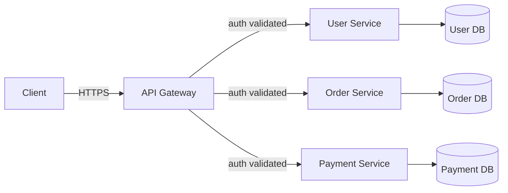

## Introduction

This chapter closes out Part 1 by connecting the previous five chapters: now that you understand HTTP, protocols, and networking basics, how do you actually design a clean API, and how do systems with many backend services present a single, coherent front door to their clients?

## Principles of Good API Design

- **Consistency** — predictable naming (plural nouns for collections: `/orders`, not `/order`), consistent casing (`camelCase` or `snake_case`, not mixed), consistent error response shape across all endpoints.
- **Versioning** — plan for change from day one. Common approaches: URL versioning (`/v1/orders`), header versioning (`Accept: application/vnd.myapi.v2+json`), or query parameter versioning. URL versioning is the most common in practice for its visibility and simplicity.
- **Pagination** — never return unbounded lists. Common patterns: offset-based (`?page=2&limit=20`, simple but can skip/duplicate items under concurrent writes) vs cursor-based (`?after=<opaque_cursor>`, more robust for large, frequently-changing datasets).
- **Error handling** — return structured, actionable error bodies, not just a status code:
```json
{
  "error": {
    "code": "INSUFFICIENT_FUNDS",
    "message": "Account balance is too low to complete this transaction.",
    "requestId": "a1b2c3d4"
  }
}
```
- **Idempotency** — as covered in Chapter 4, design mutating endpoints to tolerate safe client retries where possible.
- **Rate limit communication** — expose limits via headers (`X-RateLimit-Limit`, `X-RateLimit-Remaining`, `Retry-After`) so well-behaved clients can self-throttle (full detail in Chapter 26).

## A Simple API Design Example (Java/Spring-style Controller)

```java
@RestController
@RequestMapping("/v1/orders")
public class OrderController {

    private final OrderService orderService;

    public OrderController(OrderService orderService) {
        this.orderService = orderService;
    }

    @GetMapping("/{orderId}")
    public ResponseEntity<OrderResponse> getOrder(@PathVariable String orderId) {
        return orderService.findById(orderId)
                .map(ResponseEntity::ok)
                .orElseGet(() -> ResponseEntity.notFound().build());
    }

    @PostMapping
    public ResponseEntity<OrderResponse> createOrder(
            @RequestHeader("Idempotency-Key") String idempotencyKey,
            @RequestBody @Valid CreateOrderRequest request) {
        OrderResponse response = orderService.create(request, idempotencyKey);
        return ResponseEntity.status(HttpStatus.CREATED).body(response);
    }

    @GetMapping
    public ResponseEntity<PagedResponse<OrderResponse>> listOrders(
            @RequestParam(required = false) String after,
            @RequestParam(defaultValue = "20") int limit) {
        return ResponseEntity.ok(orderService.list(after, limit));
    }
}
```

Note the idempotency key on the mutating `POST`, and cursor-based (`after`) pagination on the list endpoint — both direct applications of earlier chapters.

## What Is an API Gateway?

As a system grows into multiple backend services (Chapter 34 onward), clients shouldn't need to know about — or directly call — each individual service. An **API Gateway** sits in front of all backend services as a single entry point, and is responsible for:

- **Routing** — directing `/users/*` to the User Service, `/orders/*` to the Order Service, etc.
- **Authentication/Authorization** — validating tokens once, at the edge, rather than in every service.
- **Rate limiting & throttling** — enforcing limits centrally.
- **Request/response transformation** — e.g., aggregating multiple backend calls into one client-facing response.
- **Load balancing** — distributing requests across healthy instances of each service.
- **Observability** — a natural place to log, trace, and monitor all incoming traffic centrally.
- **TLS termination** — as discussed in Chapter 4.



### API Gateway vs Load Balancer

These are often confused. A **load balancer** distributes traffic across multiple instances of the *same* service to balance load. An **API Gateway** routes traffic across *different* services based on the request's content (path, headers), and adds cross-cutting concerns (auth, rate limiting, transformation) on top. In practice, a gateway often sits in front of, or incorporates, load balancing for each service it routes to — they're complementary, not competing, concepts.

### The Backend-for-Frontend (BFF) Pattern

A related pattern: instead of one generic API Gateway serving all client types identically, teams sometimes build a dedicated gateway layer *per client type* — a mobile BFF and a web BFF — each aggregating and shaping backend responses specifically for that client's needs (e.g., the mobile BFF returns smaller payloads optimized for limited bandwidth). This trades some duplication for a better fit per client.

### Trade-offs of an API Gateway

**Benefits**: Centralizes cross-cutting concerns, simplifies client-side code, hides internal service topology (services can be refactored/split/merged without clients noticing), single place to enforce security policy.

**Costs**: Introduces a potential single point of failure and latency hop if not designed for high availability; can become a bottleneck or "God object" if too much business logic accumulates in it (a well-known anti-pattern) rather than staying focused on cross-cutting routing/security concerns.

## Summary

- Good API design is about consistency, versioning, pagination, structured errors, and idempotency — decisions made once but lived with for years.
- An API Gateway centralizes routing, authentication, rate limiting, and observability for systems with multiple backend services.
- A Gateway is distinct from (but often paired with) a load balancer: routing across *different* services vs distributing load across *instances of the same* service.
- The Backend-for-Frontend pattern tailors gateway behavior per client type when their needs diverge significantly.

---

## Interview Questions

### 1. Why is API versioning important, and what are the main strategies for implementing it?
**Answer:** Versioning allows an API to evolve (adding fields, changing behavior, deprecating endpoints) without breaking existing clients who haven't yet migrated to the new version — critical for any API with external or slow-to-update consumers (mobile apps that can't be force-updated instantly, third-party integrators). The main strategies are: URL-based versioning (`/v1/orders`, `/v2/orders` — most visible and common), header-based versioning (`Accept: application/vnd.api.v2+json` — cleaner URLs but less discoverable), and query-parameter versioning (`?version=2` — simple but less conventional).

**Follow-up:** *What's a downside of URL-based versioning compared to header-based versioning?* — URL versioning technically means `/v1/orders/42` and `/v2/orders/42` are different resource identifiers for conceptually the same resource, which is less semantically pure from a REST perspective, and it can lead to significant code duplication across maintained versions if not managed carefully — though its explicitness and ease of routing/caching often outweigh this in practice.

### 2. Compare offset-based and cursor-based pagination, and explain a concrete failure mode of offset-based pagination.
**Answer:** Offset-based pagination (`?page=2&limit=20`, translating to `OFFSET 20 LIMIT 20` in SQL) is simple to implement but can produce inconsistent results if the underlying dataset changes between page requests — e.g., if an item is inserted or deleted before the current offset while a user is paging through results, subsequent pages can skip or duplicate items relative to what the user expects. Cursor-based pagination (`?after=<opaque_cursor>`, referencing a stable point like the last seen item's ID or timestamp) avoids this because each page is defined relative to actual data, not a shifting numeric position, remaining consistent even as the underlying dataset changes.

**Follow-up:** *Why is offset-based pagination often described as having poor performance on large datasets, independent of the consistency issue?* — Databases typically must scan and discard all rows up to the offset before returning the requested page (e.g., `OFFSET 100000` still requires scanning through 100,000 rows), making deep pagination increasingly slow as the offset grows — cursor-based pagination avoids this by using an indexed condition (e.g., `WHERE id > last_seen_id`) that can jump directly to the right starting point.

### 3. What responsibilities does an API Gateway typically take on, and why centralize them there rather than in each individual backend service?
**Answer:** Typical responsibilities include routing requests to the correct backend service, authenticating/authorizing requests, rate limiting, TLS termination, request/response transformation, and centralized logging/observability. Centralizing these at the gateway avoids duplicating the same cross-cutting logic (and potential inconsistencies/bugs) across every individual service, lets you change policy (e.g., a new rate limit) in one place instead of redeploying every service, and keeps each backend service focused on its core business logic rather than infrastructure concerns.

**Follow-up:** *What's a risk of putting too much logic into the API Gateway?* — It can turn into a monolithic bottleneck (sometimes called a "God gateway") that's hard to maintain, becomes a single point of failure/contention for unrelated services, and blurs the boundary between infrastructure-level cross-cutting concerns (which belong in the gateway) and actual business logic (which should stay in the relevant service) — this anti-pattern undermines the very modularity microservices are meant to provide.

### 4. How does an API Gateway differ from a load balancer? Can a system have both?
**Answer:** A load balancer distributes incoming traffic across multiple instances of the *same* service to spread load and provide failover. An API Gateway routes requests to *different* backend services based on request content (like URL path), and layers on cross-cutting concerns like authentication and rate limiting. Yes, systems commonly have both: the API Gateway routes a request to, say, the Order Service, and a load balancer (which may be built into or sit behind the gateway) then picks a healthy instance among several running copies of the Order Service to actually handle it.

**Follow-up:** *Could a single piece of infrastructure perform both roles simultaneously?* — Yes — many modern API Gateway products (e.g., Kong, AWS API Gateway, or a well-configured Nginx/Envoy setup) include built-in load balancing across backend instances as part of their routing functionality, so the distinction is more conceptual than always representing two physically separate pieces of infrastructure.

### 5. What is the Backend-for-Frontend (BFF) pattern, and when is it worth the added complexity of maintaining multiple gateway layers?
**Answer:** BFF involves creating a dedicated API layer tailored to each specific client type (e.g., a mobile BFF and a separate web BFF), each aggregating, filtering, and shaping backend service responses to exactly fit that client's needs — rather than one generic gateway serving all client types identically. It's worth the added complexity when different client types have substantially different data/performance needs — e.g., a mobile app needing minimal, bandwidth-conscious payloads and different aggregated views than a feature-rich web dashboard — such that a single shared API would otherwise force compromises (over-fetching for mobile, or under-serving the web client) for at least one client type.

**Follow-up:** *What's a downside of the BFF pattern compared to a single shared API Gateway?* — Increased duplication and maintenance overhead — common cross-cutting logic (auth, rate limiting) and even similar aggregation logic may need to be implemented and kept in sync across multiple BFF layers, and teams need clear ownership boundaries to avoid each BFF becoming its own inconsistent, divergent codebase over time.

### 6. Why is a well-structured, consistent error response format important in API design, and what fields would you typically include?
**Answer:** Consistent error formats let client applications handle errors programmatically and reliably (e.g., displaying a specific message based on an error code) rather than parsing inconsistent, ad hoc error text across different endpoints. A typical structure includes a machine-readable `code` (for programmatic handling), a human-readable `message` (for logging/debugging or direct display), and often a `requestId` (correlating the error to server-side logs for debugging) — sometimes alongside field-specific validation error details for form-like requests.

**Follow-up:** *Why is including a `requestId` particularly valuable in a distributed, multi-service system?* — When a request potentially traverses multiple services (gateway → service A → service B), correlating logs across all of them by a single request ID is essential for tracing what actually happened during a failure — directly connecting to the observability/distributed tracing concepts covered in Chapter 42.

### 7. Why should mutating endpoints in a well-designed API accept an idempotency mechanism, and where does responsibility for implementing this sit — client, gateway, or backend service?
**Answer:** As discussed in Chapter 4, network unreliability means clients may retry requests without knowing if the original succeeded; without idempotency support, retries of non-idempotent operations (like `POST /orders`) risk duplicate side effects. Responsibility is typically split: the *client* generates and sends a unique idempotency key; the *backend service* (or sometimes a shared gateway-level component) is responsible for checking and storing processed idempotency keys to detect and short-circuit duplicate requests — the gateway alone usually can't fully own this since it typically lacks visibility into the specific business operation's side effects.

**Follow-up:** *Could an API Gateway play any supporting role in idempotency handling, even if it doesn't own the full logic?* — Yes — a gateway could enforce that mutating endpoints require the idempotency header to be present (rejecting requests missing it) as a policy-level safeguard, even though the actual deduplication logic (checking/storing keys against results) still needs to live in the backend service that understands the operation's semantics.

### 8. What does it mean for an API Gateway to perform "request aggregation," and why is this useful for mobile clients specifically?
**Answer:** Request aggregation means the gateway (or a BFF layer) receives a single client request, internally makes multiple calls to different backend services, and combines their results into one consolidated response — rather than requiring the client to make several separate round trips itself. This is especially useful for mobile clients because each additional round trip adds latency (often more pronounced on cellular networks) and battery/data usage; consolidating several backend calls behind one gateway-aggregated request significantly improves perceived performance for a screen that needs data from multiple services (e.g., a user profile screen needing user info, recent orders, and notification counts).

**Follow-up:** *Does request aggregation at the gateway conflict with keeping the gateway free of business logic, as mentioned earlier?* — There's tension here — pure data aggregation (calling multiple services and merging their responses) is generally considered acceptable gateway/BFF responsibility, but if the aggregation starts encoding actual business rules (e.g., conditional logic about *what* to fetch based on business state) rather than simple composition, that logic is better pushed into a dedicated backend service to avoid gateway bloat.

### 9. Explain why placing authentication/authorization logic at the API Gateway is a common and beneficial pattern, and identify one scenario where a backend service might still need to perform its own additional authorization check.
**Answer:** Centralizing authentication (verifying who the caller is, e.g., validating a JWT's signature and expiry) and coarse-grained authorization (e.g., "is this caller allowed to hit this endpoint at all") at the gateway avoids duplicating token-validation logic across every service and ensures unauthenticated requests are rejected before consuming any backend resources. However, fine-grained, resource-specific authorization (e.g., "can this specific user access *this specific* order, which belongs to another user?") typically requires knowledge only the owning backend service has (the actual data/ownership relationships), so that service still needs to perform its own additional authorization check even after the gateway's coarser validation passes.

**Follow-up:** *Why can't the gateway simply be given all the data needed to make these fine-grained authorization decisions itself?* — That would require the gateway to have deep, up-to-date knowledge of every service's data model and business rules, defeating the purpose of keeping the gateway as a thin, generic cross-cutting layer — it would essentially duplicate business logic that rightfully belongs in, and evolves independently with, each backend service.

### 10. What is API rate limiting, and why does exposing `X-RateLimit-*` response headers benefit well-behaved API consumers?
**Answer:** Rate limiting restricts how many requests a client can make within a given time window, protecting backend systems from overload (whether from abuse or unintentionally excessive legitimate usage). Exposing headers like `X-RateLimit-Limit` (total allowed), `X-RateLimit-Remaining` (requests left in the current window), and `Retry-After` (when a rate-limited client can retry) lets well-implemented client code proactively self-throttle or back off *before* hitting the limit and receiving errors, improving the overall experience and reducing wasted failed requests compared to clients blindly retrying without this information.

**Follow-up:** *Should rate limiting decisions be made at the API Gateway, the backend service, or both? Why?* — Often both, at different granularities: the gateway can enforce coarse, global limits per API key/client (protecting overall system capacity efficiently at the edge before requests consume backend resources), while individual backend services might enforce more specific, resource-aware limits (e.g., limiting how many concurrent expensive report-generation requests one user can trigger) that require business-specific context the gateway lacks.

### 11. Why is it considered bad practice for a public API's URL/resource naming to leak internal implementation details (e.g., `/getUserFromMySQLById/42`)?
**Answer:** APIs are a contract with consumers that should remain stable even as internal implementation changes — naming that references specific internal technology (like a database engine) couples the public interface to implementation details that may change (e.g., migrating from MySQL to another database), forcing an unnecessary and disruptive API contract change for what should be an invisible internal refactor. Well-designed APIs describe *what* a resource is (`/users/42`) rather than *how* it's currently implemented internally.

**Follow-up:** *How does this principle relate to the broader idea of an API Gateway "hiding internal service topology" from clients?* — It's the same underlying principle applied at different levels — just as URL naming shouldn't leak database implementation, the overall API surface (via the gateway) shouldn't leak which specific backend service, or how many services, actually handle a request; clients should only need to know the stable, public contract, while the internal architecture remains free to evolve.

### 12. What's a scenario where you would explicitly choose *not* to introduce an API Gateway, even for a system with a few backend services?
**Answer:** For a very small system (e.g., two or three tightly coupled services with a single, trusted internal client, or an early-stage startup product with minimal traffic and a small team), introducing a dedicated API Gateway adds operational complexity, an additional infrastructure component to maintain and monitor, and a potential latency hop and point of failure — benefits that may not yet outweigh the costs at that scale. In such cases, simpler patterns (direct client-to-service calls, or a lightweight reverse proxy handling only TLS termination and basic routing) may be more pragmatic until the system's complexity or team size genuinely warrants the gateway's centralized capabilities.

**Follow-up:** *What signals would indicate it's time to introduce a proper API Gateway as the system grows?* — Signals include: the number of backend services growing enough that clients are burdened by needing to know about and call each individually; cross-cutting concerns (auth, rate limiting, logging) being duplicated and drifting out of sync across services; a need for centralized security policy enforcement; or multiple client types (web, mobile, partners) needing differently shaped or governed access to the same backend services.

### 13. How does an API Gateway contribute to observability in a distributed system, beyond what individual services can provide on their own?
**Answer:** Since all external traffic passes through the gateway, it's a natural single point to capture consistent, complete logs and metrics for every incoming request (request rate, latency, status codes, per-client usage) *before* it's distributed across potentially many backend services — providing a holistic, system-wide view that's harder to assemble by aggregating disparate logs from many independently-operated services after the fact. It's also typically where a distributed trace (Chapter 42) is initiated, generating and propagating a trace ID that downstream services then attach their own spans to.

**Follow-up:** *Why is initiating the trace ID at the gateway (rather than each service generating its own independently) important for distributed tracing to work correctly?* — Distributed tracing relies on a single, shared trace ID being propagated through every service a request touches, so that all the individual spans generated across services can later be correlated and reconstructed into one coherent end-to-end trace — if each service generated its own unrelated ID, there would be no way to stitch together the full request journey across service boundaries.

### 14. Explain why cursor-based pagination cursors are typically treated as "opaque" to the client rather than, say, a plain integer offset the client could construct itself.
**Answer:** Treating the cursor as an opaque, server-generated token (often an encoded combination of a sort key and ID, sometimes further encrypted/encoded) prevents clients from depending on or manipulating its internal structure, giving the server freedom to change how pagination is implemented internally (e.g., switching the underlying sort/filter logic, or the encoding scheme) without breaking client integrations that only ever treat the cursor as "some string I got back and pass along unchanged." It also avoids exposing internal implementation details (like raw database IDs or internal sort keys) directly in the API contract.

**Follow-up:** *Is there a security consideration to keeping cursors opaque as well?* — Potentially yes — if a cursor directly exposed a raw internal ID or sensitive ordering criteria in an easily-decodable format, a client might infer information about total record counts, internal ID sequences, or other data patterns unintentionally; treating cursors as opaque (and sometimes signing/encrypting them) reduces this incidental information leakage.

### 15. In designing a versioning strategy, why is it often better to design APIs to be extensible (e.g., safely adding optional new fields) rather than relying on frequent version bumps for every change?
**Answer:** Every new API version typically requires clients to explicitly migrate, which is costly and slow — especially for external or mobile clients with no fixed update cycle. Designing for backward-compatible extensibility (e.g., always adding new fields as optional with sensible defaults, never repurposing or removing existing fields, having clients ignore unrecognized fields) allows the API to evolve significantly over time without forcing constant version bumps, reserving actual version increments for genuinely breaking changes that truly cannot be made compatible — reducing both client migration burden and the operational cost of maintaining many parallel API versions indefinitely.

**Follow-up:** *What client-side discipline is required for this backward-compatibility strategy to actually work in practice?* — Clients must be built to tolerate and ignore unknown/unexpected fields in responses (rather than failing strict parsing on unrecognized data) and must not depend on the *absence* of fields that might be added later — this discipline needs to be an explicit, enforced contract convention between API producers and consumers, often codified in client-generation tooling or shared style guides.
