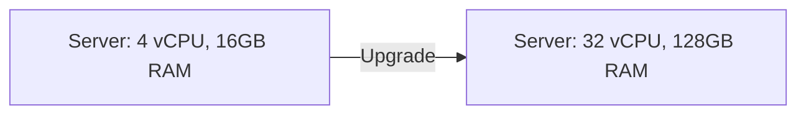
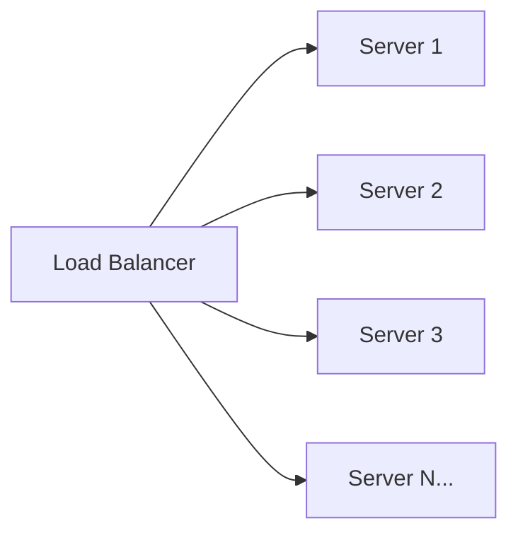
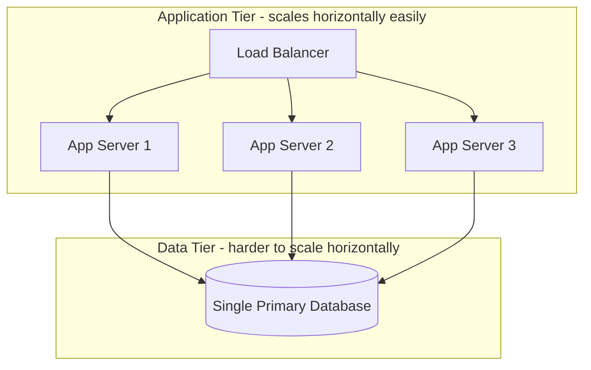

## Introduction

Every scaling technique in this series — load balancing, caching, sharding, replication — exists to serve one of two fundamental strategies: making one machine bigger, or using more machines. Understanding this distinction clearly is the foundation for everything in Part 2.

## Vertical Scaling (Scale Up)

Vertical scaling means adding more resources — CPU, RAM, faster disks — to a single existing machine.

**Advantages:**
- Simple — no architectural changes, no distributed systems complexity.
- No need to handle data partitioning or coordination between nodes.
- Often the fastest path for early-stage systems.

**Disadvantages:**
- **Hard ceiling** — there's a maximum machine size available (even the largest cloud instances top out).
- **Single point of failure** — one bigger machine is still one machine; if it goes down, the whole system goes down.
- **Downtime for upgrades** — resizing a machine typically requires a restart.
- **Cost grows non-linearly** — larger machines are disproportionately more expensive per unit of compute than smaller ones.

## Horizontal Scaling (Scale Out)

Horizontal scaling means adding more machines and distributing load across them.

**Advantages:**
- **Near-limitless scalability** — in principle, keep adding machines as load grows.
- **Fault tolerance** — if one machine fails, others continue serving traffic.
- **Cost efficiency at scale** — many commodity machines are often cheaper than one giant machine of equivalent aggregate capacity.
- **Elastic** — machines can be added/removed dynamically in response to real-time load (Chapter 1's elasticity concept).

**Disadvantages:**
- **Requires statelessness (or externalized state)** — as covered in Chapter 2, if a server holds session state locally, requests must be routed back to that specific instance, undermining the flexibility of horizontal scaling.
- **Distributed systems complexity** — data consistency, network partitions, and coordination between nodes become real concerns (this entire series, really).
- **Load balancing infrastructure required** — you need something to distribute requests across the fleet (Chapter 8).

## The Database Complication

Scaling *application/API servers* horizontally is relatively straightforward once they're stateless — just add more behind a load balancer. Scaling the **database** horizontally is significantly harder, because data has to live *somewhere* consistent, and naively splitting it across machines introduces the challenges covered in Chapters 15–20 (replication, sharding, consistency models). This is why many real systems scale their application tier horizontally early, while scaling their database tier horizontally only when truly necessary — often deferring it as long as possible via vertical scaling and read replicas.

## Which One Should You Choose?

In practice, it's not either/or — most systems do both:
1. Start with vertical scaling for simplicity while traffic is manageable.
2. Introduce horizontal scaling for the application tier once a single server becomes a bottleneck or a reliability risk.
3. Scale the database vertically as long as reasonably possible (it's simpler), introducing read replicas, then caching, then sharding only as genuinely required by load.

A common interview mistake is jumping straight to "shard the database" without first exhausting simpler options like vertical scaling, caching, and read replicas — real systems (and good interview answers) scale incrementally, adding complexity only when justified by actual measured or estimated bottlenecks.

## Summary

- Vertical scaling (bigger machines) is simple but has a hard ceiling and remains a single point of failure.
- Horizontal scaling (more machines) offers near-limitless scale and fault tolerance but requires statelessness and introduces distributed systems complexity.
- Scaling application servers horizontally is comparatively easy; scaling databases horizontally is hard and should be approached incrementally.
- Good system design combines both strategies, escalating complexity only as actual scale demands it.

---

## Interview Questions

### 1. What is the fundamental difference between vertical and horizontal scaling?
**Answer:** Vertical scaling increases the capacity of a single machine (more CPU, RAM, disk), while horizontal scaling increases capacity by adding more machines and distributing load across them. Vertical scaling keeps the architecture simple but is bounded by the maximum size of a single machine and remains a single point of failure; horizontal scaling offers near-limitless growth and fault tolerance but requires the system to be designed for distribution (statelessness, load balancing, and often more complex data management).

**Follow-up:** *Which is generally cheaper at very large scale, and why?* — Horizontal scaling is typically cheaper at large scale, because commodity hardware costs scale roughly linearly, while the largest, most powerful single machines carry a steep cost premium relative to their incremental capacity — a phenomenon often summarized as diminishing cost-efficiency at the high end of vertical scaling.

### 2. Why does horizontal scaling require statelessness (or an alternative), while vertical scaling does not?
**Answer:** Horizontal scaling distributes requests across multiple independent machines, typically via a load balancer that can route any request to any instance. If a server holds state locally (e.g., an in-memory session), only that specific instance can correctly handle subsequent requests for that state, undermining free distribution of load. Vertical scaling doesn't face this issue because there's still only one machine — all state naturally lives in one place regardless of how much bigger that machine gets.

**Follow-up:** *If a legacy application cannot be made stateless, what are two ways to still scale it horizontally?* — (1) Use sticky sessions, routing a given client's requests consistently to the same instance holding their state — though this weakens load-balancing flexibility and fault tolerance; (2) externalize the state to a shared store (like Redis) that all instances can access, effectively decoupling the state from any specific application server instance.

### 3. Why is scaling a database horizontally generally considered harder than scaling an application server horizontally?
**Answer:** Application servers processing stateless requests can be freely duplicated because each instance is interchangeable and doesn't need to coordinate with others. Databases store the actual persistent state of the system — splitting that state across multiple machines (sharding) requires deciding how to partition data, handling queries that might span multiple shards, managing cross-shard transactions, and maintaining consistency guarantees across nodes — fundamentally harder problems than just duplicating stateless compute.

**Follow-up:** *What's typically the first horizontal scaling step applied to a database, before resorting to full sharding?* — Introducing read replicas (Chapter 15) — since many workloads are read-heavy, replicating data to additional read-only nodes can offload significant read traffic from the primary without the complexity of splitting the write path across multiple independent partitions.

### 4. Give a concrete example of when vertical scaling alone would be the *right* engineering decision, rather than immediately reaching for horizontal scaling.
**Answer:** An early-stage startup with a single-region application serving a few thousand users a day, where a single well-provisioned server comfortably handles current and near-future projected load, is well served by vertical scaling: it avoids the operational overhead of load balancers, service discovery, and distributed state management that horizontal scaling would introduce, letting the team focus engineering effort on the product rather than premature infrastructure complexity.

**Follow-up:** *What's the risk of choosing horizontal scaling prematurely in this scenario?* — Unnecessary complexity and slower development velocity — engineers spend time managing distributed systems concerns (deployment orchestration, load balancer configuration, state externalization) that provide no real benefit at this scale, and could instead have been spent on product features or genuinely more pressing problems.

### 5. Why is horizontal scaling described as providing better fault tolerance than vertical scaling?
**Answer:** With horizontal scaling, load is distributed across multiple independent machines; if one instance fails, a load balancer can route traffic to the remaining healthy instances, and the system continues operating (possibly at reduced capacity) rather than going down entirely. With vertical scaling, there's only one machine — if it fails, the entire system becomes unavailable until that machine is repaired or replaced, since there's no redundant instance to absorb the load.

**Follow-up:** *Does simply having multiple instances automatically guarantee fault tolerance, or are there other requirements?* — Not automatically — you also need health checks and a load balancer capable of detecting and routing around unhealthy instances (Chapter 8), sufficient spare capacity among the remaining healthy instances to absorb the failed instance's load without overloading, and (for stateful components) some mechanism ensuring the failed instance's state isn't simply lost.

### 6. What does "elasticity" add on top of basic horizontal scalability, and why does it particularly matter for cost efficiency?
**Answer:** Elasticity is the ability to automatically and dynamically add or remove instances in near real-time based on current demand, rather than horizontal scaling being a manual, planned capacity change. This matters for cost efficiency because many systems have highly variable traffic (daily peaks, seasonal spikes) — provisioning for peak load at all times (even during low-traffic periods) wastes money on idle capacity, while elastic auto-scaling allows the system to run lean during low demand and automatically expand only when actually needed, closely matching cost to real usage.

**Follow-up:** *What's a technical prerequisite that makes elastic auto-scaling of application servers feasible in the first place?* — Statelessness (or externalized state) — auto-scaling assumes new instances can be added or removed at any time without needing to migrate in-progress state, which is only safe if instances don't hold irreplaceable local state that would be lost when scaled down.

### 7. Explain why "scale the database vertically as long as possible" is often considered sound advice, rather than jumping straight to sharding.
**Answer:** Vertical scaling of a database (bigger instance, more RAM/IOPS, faster storage) avoids the substantial complexity that sharding introduces — cross-shard queries, distributed transactions, rebalancing data as shards grow unevenly, and application-level awareness of data partitioning. Modern database instances can vertically scale to handle surprisingly large workloads, so deferring sharding until it's genuinely necessary (validated by real bottlenecks, not speculative future scale) avoids paying this complexity cost prematurely.

**Follow-up:** *What signals would indicate that vertical scaling of a database has genuinely been exhausted and sharding is now warranted?* — Signals include: hitting the maximum available instance size/IOPS ceiling offered by your infrastructure provider, write throughput consistently saturating the single primary instance even after other optimizations (indexing, query tuning, caching) have been applied, or data volume growing beyond what a single instance's storage can reasonably or cost-effectively hold.

### 8. Is it accurate to say horizontal scaling has "no ceiling," unlike vertical scaling? What real-world limits still apply?
**Answer:** Not entirely — while horizontal scaling doesn't hit a hard single-machine size ceiling, it does encounter other practical limits: coordination overhead between many nodes can grow (e.g., certain distributed consensus algorithms scale poorly with very large node counts), network bandwidth/latency between nodes becomes a bottleneck at extreme scale, and operational complexity (deployment, monitoring, debugging across thousands of instances) grows substantially. So "near-limitless" is a more accurate framing than "limitless."

**Follow-up:** *Can you give an example of a workload where adding more machines horizontally could actually make the system slower rather than faster?* — A workload requiring heavy cross-node coordination for every operation (e.g., a naively-designed distributed lock or a strongly consistent consensus protocol across many nodes) can see diminishing or even negative returns as node count grows, since the coordination/communication overhead between nodes can outpace the parallelism gained — illustrating that horizontal scaling benefits assume the workload is genuinely parallelizable with limited cross-node coordination needs.

### 9. In a system design interview, you're asked to design a system expected to grow from 1,000 to 10 million users. How would you frame your scaling approach across that growth, referencing both vertical and horizontal scaling?
**Answer:** Start by noting that at 1,000 users, a single reasonably-sized (vertically scaled) server plus a single database instance is likely more than sufficient — avoiding premature complexity. As you narrate growth toward 10 million users, introduce horizontal scaling for the stateless application tier first (behind a load balancer) once a single app server becomes a bottleneck, since that's the comparatively easy win. Continue vertically scaling the database as far as reasonable, layering in caching (Chapter 9) and read replicas (Chapter 15) to offload read traffic. Only introduce database sharding (Chapter 16) once write throughput or data volume genuinely exceeds what vertical scaling and read replicas can sustain — explicitly noting this is deferred until justified by the numbers, not applied preemptively.

**Follow-up:** *Why does narrating this incremental progression, rather than designing directly for the 10-million-user end state, tend to impress interviewers?* — It demonstrates pragmatic, cost-and-complexity-aware engineering judgment — showing you understand that architecture should evolve in step with actual, measured need rather than over-engineering for a hypothetical future state from day one, which is a hallmark of senior-level system design thinking.

### 10. What operational cost does horizontal scaling introduce that's easy to overlook when only comparing raw compute cost against vertical scaling?
**Answer:** Beyond raw compute cost, horizontal scaling introduces meaningful operational overhead: the need for load balancing infrastructure, service discovery, more complex deployment/orchestration (rolling out updates across many instances safely), more sophisticated monitoring/observability (aggregating metrics and logs across a fleet rather than one machine), and often increased organizational complexity in reasoning about distributed failure modes — these operational and engineering-time costs are real but often excluded from a narrow compute-cost-only comparison.

**Follow-up:** *How might container orchestration platforms like Kubernetes change this cost calculus?* — They significantly reduce the *manual* operational burden of horizontal scaling by automating deployment, scaling, health-checking, and self-healing across many instances — shifting some of the cost from ongoing human operational effort to upfront platform adoption and learning-curve investment, making horizontal scaling more accessible than it was in earlier, more manually-managed infrastructure eras.

### 11. Why might a system choose to scale vertically for its database while scaling horizontally for its cache layer (e.g., Redis) within the same architecture?
**Answer:** Databases typically hold the canonical, durable system-of-record data where strong consistency and transactional guarantees matter, making horizontal partitioning (sharding) inherently complex to do correctly. A cache layer, by contrast, often holds derived, disposable, and more loosely consistent data (Chapter 9) — losing or inconsistently distributing some cached data is tolerable since it can be repopulated from the source of truth — making horizontal scaling (e.g., a distributed Redis Cluster) both easier to implement and lower-risk for that specific component, even while the database behind it continues to scale primarily vertically.

**Follow-up:** *Does this mean caching layers never need careful design around consistency or partitioning?* — Not entirely — distributed caches still need thoughtful design (e.g., consistent hashing, covered in Chapter 22, to minimize cache invalidation storms when nodes are added/removed) — but the *consequences* of imperfect consistency are far less severe for a cache than for the authoritative database, which is why horizontal scaling is comparatively more tractable there.

### 12. A candidate says "I'll just scale horizontally for everything since it's more scalable." Why is this an incomplete answer, and what follow-up would you expect a strong interviewer to ask?
**Answer:** This answer glosses over the real complexity horizontal scaling introduces for stateful components (particularly databases) and ignores that vertical scaling is often the simpler, more cost-effective choice at moderate scale. A strong interviewer would likely probe: "How would you horizontally scale the database specifically, and what challenges does that introduce?" — testing whether the candidate understands that horizontal scaling isn't a free, uniformly-applicable solution, but instead involves real trade-offs (partitioning strategy, consistency models, cross-shard queries) that differ significantly between stateless and stateful components.

**Follow-up:** *What would a stronger initial answer have included from the start?* — An acknowledgment that horizontal scaling is comparatively straightforward for stateless application servers, but requires substantially more careful design (partitioning strategy, replication, consistency trade-offs) when applied to stateful components like databases — showing awareness of where the real complexity lives rather than treating "horizontal scaling" as a single, uniformly simple technique.
