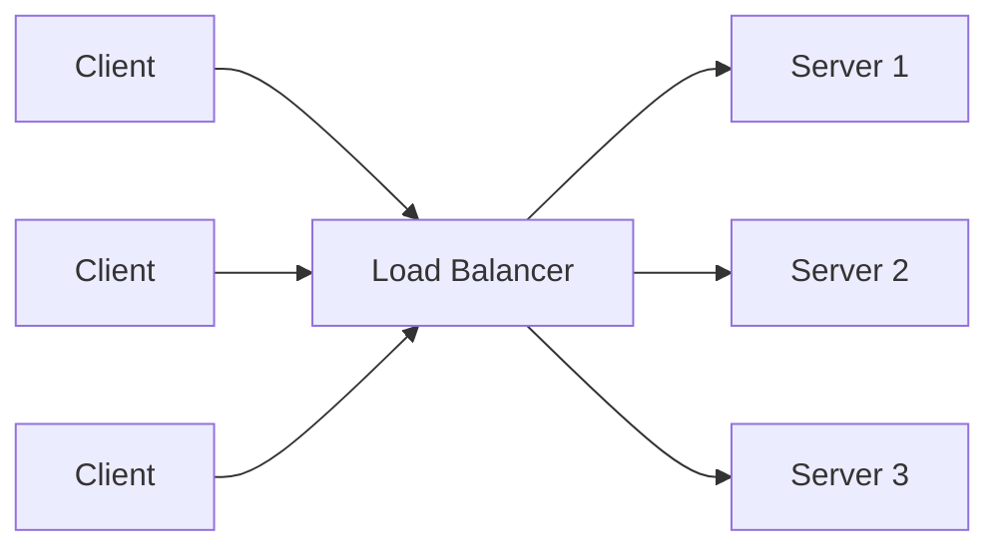
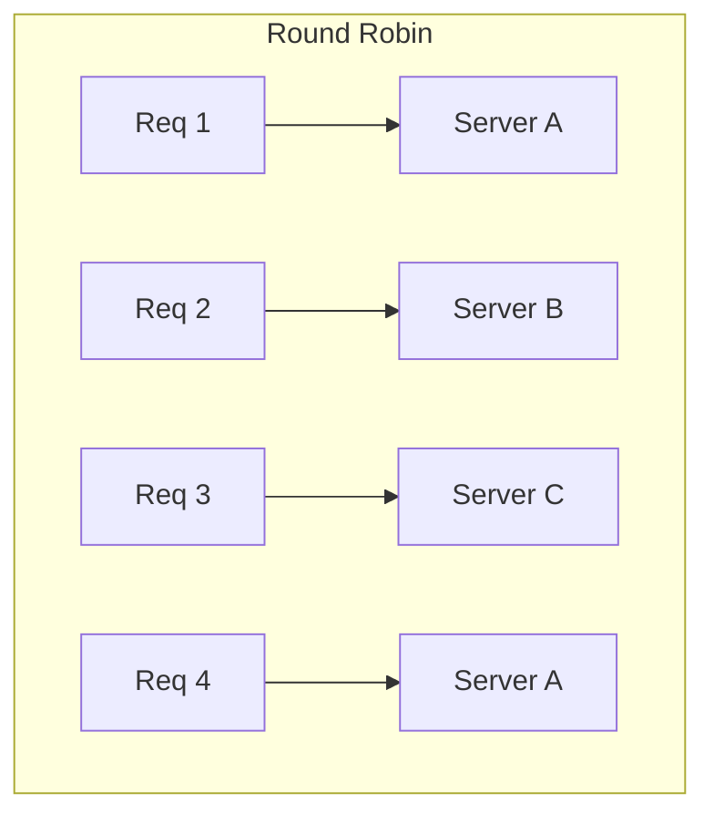
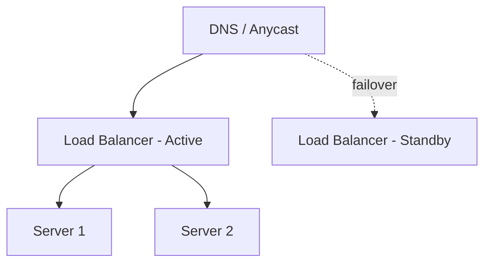

## Introduction

Once you've decided to scale horizontally (Chapter 7), you need something to actually distribute incoming requests across your fleet of servers. That's the job of a **load balancer** — arguably the single most common component in any non-trivial system design diagram.



## Layer 4 vs Layer 7 Load Balancing (Revisited)

As introduced in Chapter 3:

- **L4 (Transport layer)**: Routes based on IP address and port alone, without inspecting application data. Very fast, protocol-agnostic (works for any TCP/UDP traffic), but can't make content-aware decisions.
- **L7 (Application layer)**: Inspects HTTP headers, cookies, and URL paths to make routing decisions (e.g., route `/api/*` to one service, `/static/*` to another). More CPU overhead, but far more flexible.

Most modern architectures use L7 load balancers (like Nginx, HAProxy in HTTP mode, or cloud-managed ALBs) for their API traffic, sometimes with an L4 load balancer (or Anycast) even further upstream at the network edge.

## Load Balancing Algorithms

| Algorithm | How it works | Best for |
|---|---|---|
| Round Robin | Requests distributed sequentially across servers in order | Simple, uniform workloads with similar-capacity servers |
| Weighted Round Robin | Like round robin, but servers with higher weight get proportionally more requests | Heterogeneous server capacity |
| Least Connections | Routes to the server with the fewest active connections | Workloads with variable request duration |
| Least Response Time | Routes to the server with the lowest latency + fewest connections | Latency-sensitive workloads |
| IP Hash | Routes based on a hash of the client's IP, so the same client consistently hits the same server | Session affinity without a shared session store |
| Random | Picks a server at random (sometimes with "power of two choices" refinement) | Simpler alternative to round robin, surprisingly effective at scale |



**Least Connections** is generally preferred over simple Round Robin in production for uneven workloads — imagine one client triggers a slow, expensive report-generation request while others make fast lookups; Round Robin would keep sending new requests to the already-busy server in turn, while Least Connections naturally avoids it until its load decreases.

## Health Checks

A load balancer is only as good as its ability to detect and route around unhealthy instances. Two common patterns:

- **Active health checks**: The load balancer periodically pings a dedicated endpoint (e.g., `GET /health`) on each backend instance, removing it from rotation if it fails to respond correctly within a timeout/threshold.
- **Passive health checks**: The load balancer monitors real traffic for signs of failure (timeouts, error responses) and removes instances that show a pattern of failures, without needing a separate dedicated health-check request.

```java
@RestController
public class HealthController {

    private final DataSource dataSource;

    public HealthController(DataSource dataSource) {
        this.dataSource = dataSource;
    }

    @GetMapping("/health")
    public ResponseEntity<Map<String, String>> health() {
        try (Connection conn = dataSource.getConnection()) {
            conn.isValid(2); // quick check the DB connection is alive
            return ResponseEntity.ok(Map.of("status", "UP"));
        } catch (SQLException e) {
            return ResponseEntity.status(503).body(Map.of("status", "DOWN"));
        }
    }
}
```

A good health check verifies the service can actually do its job (e.g., reach its database), not just that the process is running — a server can be "up" (accepting TCP connections) while its critical dependency is unreachable, which a naive health check would miss.

## High Availability of the Load Balancer Itself

As noted in Chapter 1, a single load balancer is itself a potential single point of failure. Standard mitigation: run multiple load balancer instances behind a floating/virtual IP (using a protocol like VRRP/keepalived) or behind DNS with health-check-aware failover, so the load-balancing layer itself has no single point of failure.



## Global vs Local Load Balancing

- **Local (within a data center/region)**: Balances traffic across instances of a service within one location — the focus of this chapter.
- **Global (across regions)**: Directs users to the nearest or healthiest *region* — typically achieved via GeoDNS or Anycast (Chapter 3) combined with regional health checks, forming the first layer of routing before a request even reaches a regional load balancer.

## Summary

- Load balancers distribute traffic across server instances, operating at either L4 (fast, IP/port-based) or L7 (flexible, content-aware) layers.
- Algorithm choice (Round Robin, Least Connections, IP Hash, etc.) should match workload characteristics — Least Connections generally handles uneven request costs better than Round Robin.
- Health checks (active and passive) let a load balancer detect and route around failing instances — checks should verify real functionality, not just process liveness.
- The load balancer itself needs redundancy to avoid becoming a single point of failure.
- Global load balancing (region selection) and local load balancing (instance selection within a region) are complementary layers.

---

## Interview Questions

### 1. What's the difference between Layer 4 and Layer 7 load balancing, and what's a concrete scenario where only L7 can make the correct routing decision?
**Answer:** L4 load balancing routes based purely on IP address and port/transport-layer information, without inspecting the actual application payload. L7 load balancing inspects HTTP-level information — headers, cookies, URL paths — to make content-aware decisions. A concrete scenario: routing requests to different backend services based on URL path (e.g., `/api/orders/*` to the Order Service, `/api/users/*` to the User Service) fundamentally requires reading the HTTP request line/path, which an L4 load balancer, operating below the application layer, cannot do.

**Follow-up:** *Why might a system still choose L4 load balancing for some traffic despite this limitation?* — For very high-throughput or latency-sensitive traffic (or non-HTTP protocols like raw TCP/UDP services) where the overhead of parsing application-layer content isn't justified or even applicable, L4's speed and protocol-agnostic simplicity make it the better fit — often used at the outer network edge before traffic reaches an L7 layer.

### 2. Compare Round Robin and Least Connections load balancing algorithms. When would Round Robin actually perform worse?
**Answer:** Round Robin distributes requests sequentially across servers regardless of their current load, assuming each request is roughly equal in cost. Least Connections routes each new request to whichever server currently has the fewest active connections, adapting to actual real-time load. Round Robin performs worse when request costs vary significantly (e.g., some requests are expensive, long-running reports while others are quick lookups) — a server that happens to be handling several expensive requests will keep receiving new requests in its turn under Round Robin, becoming increasingly overloaded, whereas Least Connections would naturally divert new requests away from it.

**Follow-up:** *Is Least Connections always strictly better than Round Robin? What's a downside?* — Least Connections requires the load balancer to continuously track real-time connection counts per server, adding slightly more computational and state-tracking overhead compared to Round Robin's simple, stateless sequential counter — for genuinely uniform, short-lived request workloads, this added complexity may offer negligible practical benefit over simpler Round Robin.

### 3. What's the difference between active and passive health checks, and why might a production system use both?
**Answer:** Active health checks involve the load balancer proactively sending periodic requests to a dedicated health endpoint on each backend instance to verify it's responsive and functioning. Passive health checks instead observe real production traffic, flagging an instance as unhealthy if it starts showing failures (timeouts, 5xx errors) without needing separate dedicated check requests. A production system often uses both because active checks can catch failures even during periods of low real traffic (when passive checks alone might not gather enough signal), while passive checks catch real-world failure patterns (that might not show up in a synthetic health check) as they happen, with minimal added overhead.

**Follow-up:** *What's a risk of relying solely on active health checks with too infrequent a check interval?* — A server could fail *between* health check intervals and continue receiving real user traffic (and failing those requests) for up to the full check interval before being detected and removed from rotation — motivating either a shorter check interval (at the cost of more health-check overhead) or supplementing with passive checks for faster real-world failure detection.

### 4. Why is it important for a health check endpoint to verify actual dependency connectivity (like a database), rather than simply returning `200 OK` unconditionally?
**Answer:** A server process can be technically "alive" and accepting connections while a critical dependency it relies on (like its database) is unreachable — if the health check simply confirms the process is running without checking this, the load balancer will keep routing real user traffic to an instance that will fail to actually serve those requests, effectively defeating the purpose of health-check-based failure detection.

**Follow-up:** *What's a risk of making the health check too thorough (e.g., checking every downstream dependency deeply on every check)?* — Overly expensive or deeply cascading health checks can themselves add significant load to downstream dependencies (especially if called frequently by every instance) and can cause a cascading failure — where a slow but non-critical dependency incorrectly marks otherwise-healthy instances as unhealthy, potentially taking the entire fleet out of rotation simultaneously; health checks should verify genuinely critical dependencies without being excessively strict or expensive.

### 5. How can the load balancer itself become a single point of failure, and what's the standard way to address this?
**Answer:** If there's only one load balancer instance, its failure takes down access to the entire backend fleet, even if every backend server remains perfectly healthy. The standard mitigation is running multiple load balancer instances in an active-passive or active-active configuration, fronted by a mechanism like a floating/virtual IP (using a protocol like VRRP, managed by software like keepalived) that can shift to a standby instance if the active one fails, or DNS/Anycast-based routing that can detect and route around a failed load balancer instance.

**Follow-up:** *Why can't you simply put a load balancer in front of your load balancers to solve this recursively?* — At some point you reach infrastructure-level redundancy mechanisms (like a virtual IP failover or cloud-managed load balancer services that are inherently redundant across multiple physical machines/zones) rather than an application-level load balancer — cloud providers typically abstract this lowest layer of redundancy away as a managed, highly-available service specifically so engineers don't need to solve it themselves recursively.

### 6. Explain IP Hash-based load balancing and a scenario where it's specifically useful, along with its main drawback.
**Answer:** IP Hash routing computes a hash of the client's IP address and uses it to consistently route that client to the same backend server for the duration it remains healthy, providing a simple form of session affinity ("sticky sessions") without needing a shared, externalized session store — useful for legacy applications that store session state locally in server memory. The main drawback is uneven load distribution if client IPs aren't uniformly distributed (e.g., many users behind the same corporate NAT/proxy sharing one visible IP would all hash to the same server), and it complicates fault tolerance since a server failure disproportionately impacts whichever specific set of clients were hashed to it, potentially losing their in-memory session state entirely.

**Follow-up:** *Why is IP Hash generally considered an inferior solution compared to externalizing session state, if both achieve similar user-facing continuity?* — Externalizing session state (e.g., to Redis) allows any backend server to serve any client at any time — preserving the flexibility and fault tolerance benefits of true statelessness discussed in Chapters 2 and 7 — while IP Hash reintroduces a coupling between specific clients and specific servers that undermines those benefits, purely to work around an application design limitation rather than solving it properly.

### 7. What is "power of two choices," and why can it sometimes outperform naive Least Connections at very large scale?
**Answer:** "Power of two choices" is a load balancing refinement where, instead of tracking and comparing the load of *every* backend server for each routing decision (which becomes expensive at very large scale), the load balancer randomly samples just two servers and routes to whichever of those two currently has less load. Counter-intuitively, this simple approach achieves load distribution nearly as good as checking every server, while being far cheaper computationally — because pure random selection risks occasionally picking an already-overloaded server, while comparing all servers doesn't scale well with very large fleets; sampling just two strikes a strong practical balance.

**Follow-up:** *Why wouldn't checking all servers scale well as the fleet grows very large?* — Tracking and comparing real-time load metrics across, say, tens of thousands of server instances for every single incoming request routing decision introduces significant coordination and computational overhead on the load balancer itself, potentially making the load balancer's own decision-making a new bottleneck — sampling a small constant number of servers avoids this scaling problem.

### 8. In a system with an API Gateway (Chapter 6) and load balancers, where in the architecture would you typically place load balancing responsibilities?
**Answer:** Load balancing typically occurs at multiple points: an outer-edge load balancer (often L4/Anycast-based) distributes initial incoming traffic across multiple API Gateway instances (since the gateway itself must also be horizontally scaled and made fault-tolerant); then, behind the gateway, a load balancer (often L7, or built into the gateway/service mesh) distributes requests for each specific backend service across that service's healthy instances. This layered approach ensures no single component — gateway or backend service — becomes an unscaled bottleneck or single point of failure.

**Follow-up:** *Does this mean every layer needs its own separate, independently managed load balancer software?* — Not necessarily — modern cloud-managed load balancer services or service mesh technologies (like Envoy-based meshes) can provide this layered load balancing capability more seamlessly, often integrated with the API Gateway or service discovery infrastructure itself, rather than requiring entirely separate, manually configured load balancer instances at each layer.

### 9. Why might a load balancer need to support "connection draining" (also called graceful shutdown), and what problem does it solve?
**Answer:** When an instance needs to be taken out of rotation (for deployment, scaling down, or scheduled maintenance), abruptly terminating it while it still has active in-flight requests would cause those requests to fail. Connection draining instructs the load balancer to stop sending *new* requests to that instance while allowing its existing in-flight requests to complete normally within a grace period, before the instance is finally removed/terminated — preventing user-facing errors during routine scaling or deployment operations.

**Follow-up:** *What happens if the drain grace period is set too short for a system with some naturally long-running requests?* — Requests still in progress when the grace period expires get forcibly terminated anyway, causing failures for exactly the long-running requests the draining mechanism was meant to protect — the drain timeout needs to be configured with awareness of the system's actual maximum expected request duration.

### 10. How does global (multi-region) load balancing differ from the local load balancing discussed in this chapter, and how do the two typically work together?
**Answer:** Local load balancing (this chapter's focus) distributes traffic across multiple server instances *within* a single region/data center. Global load balancing operates at a higher level, directing a user's traffic to the best *region* entirely — typically via GeoDNS or Anycast routing combined with regional health monitoring (Chapter 3) — before the request ever reaches a specific region's local load balancer. They work together in sequence: global load balancing picks the region, and once traffic arrives at that region, local load balancing distributes it across that region's healthy server instances.

**Follow-up:** *What would happen to a user's traffic if their nearest region became fully unhealthy, assuming both global and local load balancing are properly implemented?* — Global load balancing's regional health checks would detect the region-wide failure and redirect the user's traffic (via updated DNS/Anycast routing) to the next-nearest healthy region instead, where that region's local load balancer would then distribute the (now rerouted) traffic across its own healthy instances — providing resilience even against an entire region going down.

### 11. A candidate proposes a load-balanced architecture but forgets to mention health checks entirely. Why is this a meaningful gap, even if the routing algorithm itself is well chosen?
**Answer:** Without health checks, a load balancer has no mechanism to detect and avoid sending traffic to instances that have failed or become degraded — even a perfectly chosen routing algorithm (like Least Connections) would happily keep distributing requests to a dead or malfunctioning server indefinitely, since the algorithm only reasons about load distribution, not instance health. This means the system as described would not actually achieve the fault tolerance benefit that's one of the primary motivations for horizontal scaling and load balancing in the first place (Chapter 7).

**Follow-up:** *If prompted, how would you explain the distinction between "load balancing algorithm" and "health checking" as two separate, complementary responsibilities?* — The load balancing algorithm decides *how to distribute* traffic among the servers currently considered available/healthy; health checking decides *which servers are currently in that available pool* in the first place — they're orthogonal concerns that both need to be explicitly designed, not substitutes for one another.
