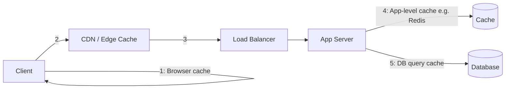
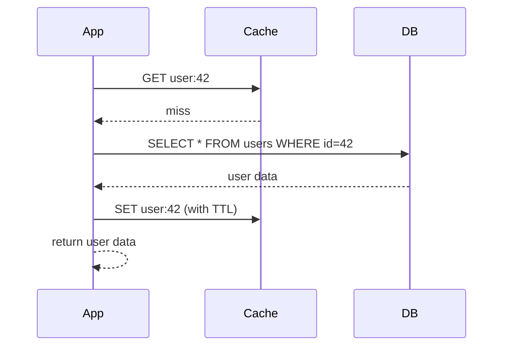
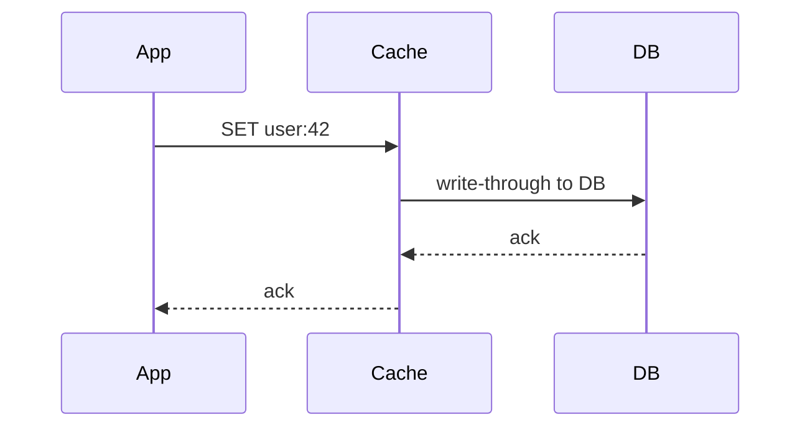
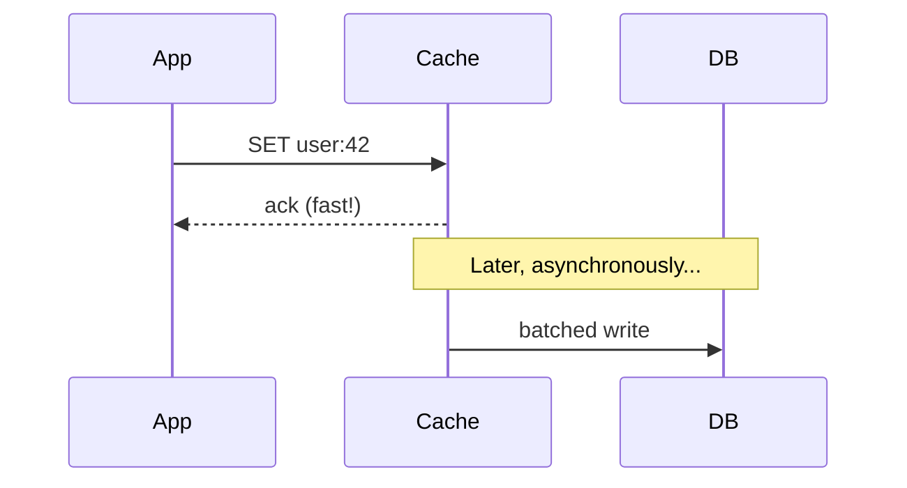

## Introduction

Caching is arguably the single highest-leverage technique in system design: it can turn an expensive database query into a sub-millisecond memory lookup, and it's the reason most large-scale systems can serve read-heavy workloads without their databases falling over. This chapter covers where caches live and the core read/write patterns for keeping them useful.

## Where Caches Live



1. **Client-side cache** — browser cache, mobile app local storage.
2. **CDN / edge cache** — caches static (and sometimes dynamic) content geographically close to users (Chapter 11).
3. **Application-level cache** — a dedicated cache like Redis or Memcached, sitting between your app servers and database.
4. **Database-level cache** — query result caching or buffer pools built into the database engine itself.

This chapter focuses primarily on the application-level cache, since it's the one you design and reason about explicitly in most HLD discussions.

## Cache-Aside (Lazy Loading)

The most common pattern: the application checks the cache first; on a miss, it reads from the database and populates the cache for next time.



```java
public User getUser(String userId) {
    String cacheKey = "user:" + userId;
    User cached = cache.get(cacheKey, User.class);
    if (cached != null) {
        return cached;
    }
    User user = userRepository.findById(userId)
            .orElseThrow(() -> new UserNotFoundException(userId));
    cache.set(cacheKey, user, Duration.ofMinutes(10)); // TTL
    return user;
}
```

**Strengths**: Only requested data gets cached (no wasted cache space on unused data); cache failures degrade gracefully (fall back to the database).
**Weaknesses**: First request for any key always suffers a cache miss ("cold start"); if not paired with careful invalidation, cached data can go stale after the underlying data changes.

## Write-Through

The application writes to the cache and the database synchronously, as a single logical operation, on every write.



**Strengths**: Cache is always consistent with the database immediately after a write; simplifies read logic (cache is always populated, never needs lazy loading for previously-written data).
**Weaknesses**: Every write pays the latency cost of writing to both cache and database; data that's written but never read still consumes cache space unnecessarily.

## Write-Back (Write-Behind)

The application writes to the cache immediately and returns, with the cache asynchronously persisting the write to the database later (often batched).



**Strengths**: Very low write latency (the slow database write is off the critical path); can batch/coalesce multiple writes to reduce database load.
**Weaknesses**: Risk of data loss if the cache fails before the asynchronous write completes (durability trade-off); more complex to implement correctly.

## Comparing the Three

| Pattern | Write latency | Consistency | Data loss risk | Common use case |
|---|---|---|---|---|
| Cache-Aside | Normal (writes go direct to DB) | Can go stale until invalidated | Low | General-purpose, most common default |
| Write-Through | Higher (writes hit cache + DB) | Strong (always in sync) | Low | Read-heavy data needing freshness guarantees |
| Write-Back | Very low | Eventually consistent | Higher | Write-heavy workloads tolerant of some data loss risk |

## Cache Invalidation

Famously one of the "two hard things in computer science." Common strategies:

- **TTL (Time-To-Live) expiration** — simplest approach; accept some staleness bounded by the TTL window.
- **Explicit invalidation on write** — when data changes, the application actively deletes or updates the corresponding cache entry.
- **Write-through** (as above) — sidesteps staleness by keeping cache and DB in sync on every write.

A common bug: updating the database but forgetting to invalidate the corresponding cache entry, leaving stale data served indefinitely until the TTL (if any) expires.

## Caching Failure Modes

- **Cache stampede (thundering herd)**: When a popular cache key expires, many concurrent requests simultaneously miss the cache and hit the database at once, potentially overwhelming it. Mitigations: probabilistic early expiration (refresh slightly before actual expiry), or a "lock" so only one request repopulates the cache while others wait briefly.
- **Cache penetration**: Repeated requests for a key that doesn't exist in the database bypass the cache entirely (since there's nothing to cache), hitting the database every time. Mitigation: cache the "not found" result itself (with a short TTL), or use a Bloom filter (Chapter 25) to cheaply reject requests for keys that definitely don't exist.

## Summary

- Caches can live at the client, CDN, application, or database layer — this chapter focuses on the application-level cache.
- Cache-Aside is the most common default pattern; Write-Through prioritizes consistency; Write-Back prioritizes write latency at the cost of durability risk.
- Cache invalidation strategy (TTL vs explicit invalidation) directly determines how stale served data can become.
- Cache stampede and cache penetration are common failure modes with well-established mitigations.

---

## Interview Questions

### 1. Explain the Cache-Aside pattern and identify its main weakness.
**Answer:** In Cache-Aside, the application checks the cache first on a read; if the data isn't present (a cache miss), it reads from the database, then populates the cache for subsequent reads. Its main weakness is that data can become stale if the underlying database is updated without a corresponding cache invalidation — the cache continues serving the old value until it either expires (TTL) or is explicitly invalidated, meaning the pattern requires disciplined invalidation logic to avoid serving outdated data indefinitely.

**Follow-up:** *Why is Cache-Aside often the default choice despite this weakness, rather than always using Write-Through?* — Cache-Aside only caches data that's actually requested (avoiding wasted cache space on unread data) and keeps the write path simple and fast (writes go directly to the database without also needing to update the cache synchronously) — for many workloads, the staleness risk is manageable with reasonable TTLs or invalidation-on-write, making the simplicity and efficiency benefits worth it.

### 2. Compare Write-Through and Write-Back caching in terms of the trade-off between latency and durability.
**Answer:** Write-Through writes to both the cache and the database synchronously as part of the same operation, so the write only completes once both are durably updated — this guarantees the cache and database stay consistent, but the client-facing write latency includes the full cost of the (typically slower) database write. Write-Back writes only to the cache initially and returns immediately, asynchronously persisting to the database later (often batched) — this dramatically reduces write latency but introduces a window where a cache failure (before the async write completes) can result in permanent data loss, since the database was never actually updated.

**Follow-up:** *For a workload like a high-frequency view counter (e.g., counting video views), which pattern would you likely choose, and why?* — Write-Back is often appropriate here, since occasional loss of a few view-count increments during a rare cache failure is an acceptable trade-off for dramatically better write throughput/latency on an extremely high-write-volume, non-critical metric — unlike, say, financial transaction data, where that same durability risk would be unacceptable.

### 3. What is a cache stampede (thundering herd), and describe two mitigation strategies.
**Answer:** A cache stampede occurs when a popular, frequently-accessed cache entry expires, and a large number of concurrent requests all experience a cache miss simultaneously, all rushing to the database at once to recompute/refetch the same data — potentially overwhelming the database with a sudden burst of redundant, identical queries. Two mitigations: (1) probabilistic early expiration/refresh, where the cache proactively refreshes a popular key slightly before its actual expiry (spreading out the refresh over time rather than a single expiry moment triggering a stampede), and (2) a locking/mutex mechanism where only the first request that experiences the miss is allowed to query the database and repopulate the cache, while concurrent requests briefly wait for that repopulation to complete rather than all querying the database independently.

**Follow-up:** *What's a downside of the locking/mutex mitigation approach?* — Requests that would have hit the database anyway now experience added latency waiting for the lock holder to complete the repopulation, and there's added implementation complexity in correctly managing the lock (including handling the lock holder itself failing before completing the repopulation, which could otherwise leave other waiting requests stuck).

### 4. What is cache penetration, and how does it differ from a cache stampede?
**Answer:** Cache penetration occurs when requests repeatedly query for a key that doesn't exist in the underlying data store at all — since there's no valid data to cache, every such request bypasses the cache and hits the database directly, every time, regardless of caching infrastructure. This differs from a cache stampede, which involves a *popular, valid* key expiring and triggering a burst of concurrent database hits — penetration involves invalid/non-existent keys causing *persistent, ongoing* uncached database load, rather than a one-time burst around an expiration event.

**Follow-up:** *How does caching a "not found" result help mitigate cache penetration, and what risk does this introduce?* — By caching the fact that a given key doesn't exist (with a typically short TTL), subsequent requests for that same non-existent key can be served (as "not found") directly from the cache without hitting the database again — the risk is that if the key is later legitimately created, the cached "not found" result could incorrectly continue being served until its TTL expires, introducing a bounded staleness window for newly created data specifically for previously-queried-as-missing keys.

### 5. Why might a Bloom filter (previewed in Chapter 25) be a more elegant solution to cache penetration than caching "not found" results?
**Answer:** A Bloom filter can definitively tell you a key "definitely does not exist" (with no false negatives, though possible false positives) using a very small, fixed amount of memory regardless of how many distinct non-existent keys are queried — this avoids the unbounded cache growth risk of caching individual "not found" results for potentially millions of distinct invalid keys, and sidesteps the staleness window problem of a cached "not found" entry becoming outdated once a key is later created (since the Bloom filter can simply be updated/rebuilt when new valid keys are added).

**Follow-up:** *What's the trade-off of using a Bloom filter for this purpose?* — Bloom filters have a tunable but nonzero false-positive rate (they might say a key "possibly exists" when it doesn't, requiring a fallback database check in that case), and they require some infrastructure to keep the filter's contents in sync with the actual dataset as new valid keys are added over time.

### 6. Why does setting a TTL on cache entries matter even in a well-designed system with explicit cache invalidation on writes?
**Answer:** Even with careful explicit invalidation logic, there's always a risk of bugs, missed edge cases, or out-of-band data changes (e.g., a direct database update bypassing the application layer) that fail to trigger the expected cache invalidation — a TTL acts as a safety net, bounding the maximum possible staleness of any cache entry even if explicit invalidation logic fails or is incomplete, rather than relying on invalidation logic being perfectly correct in every scenario.

**Follow-up:** *What would you consider when choosing an appropriate TTL value for a given type of cached data?* — The acceptable staleness window for that specific data (how quickly does it need to reflect changes — a user's profile picture can tolerate longer staleness than, say, real-time inventory stock levels), balanced against how much load re-fetching from the database at a shorter TTL would add — different types of data within the same system often warrant meaningfully different TTL values.

### 7. In a Cache-Aside setup, what's the correct order of operations when updating data: should you update the cache and then the database, or the database and then invalidate/update the cache? Why?
**Answer:** The generally recommended order is to update the database first, then invalidate (or update) the cache entry afterward. If you invalidate/update the cache first and the subsequent database write fails or is delayed, other concurrent readers could read the new cache value before the database actually reflects it, creating a period of inconsistency where the cache shows data the database doesn't yet have (and if the database write fails entirely, the cache would then hold a value that never actually became true in the source of truth).

**Follow-up:** *Even with the correct database-then-cache order, is there still a possible race condition with concurrent requests? Describe it.* — Yes — if a read request experiences a cache miss and begins fetching from the (soon-to-be-stale) database value at nearly the same moment a separate write request updates the database and then invalidates the cache, the read request could still repopulate the cache with the old value *after* the invalidation occurs, leaving stale data in the cache despite following the recommended order — this is a known, generally accepted low-probability race in Cache-Aside that most systems tolerate given a reasonable TTL as a backstop.

### 8. Why is application-level caching (e.g., Redis) generally preferred over relying solely on a database's built-in query cache for high-traffic systems?
**Answer:** An application-level cache like Redis is a dedicated, horizontally scalable, in-memory service optimized purely for fast key-value access, independent of the database's own resource constraints — offloading read traffic from the database entirely rather than just optimizing how the database itself processes repeated queries. A database's built-in query cache (where available) still consumes the database's own CPU/memory resources and typically doesn't scale independently or as flexibly as a dedicated caching layer, and many modern databases have deprecated or limited such built-in caching in favor of external caching layers precisely for this reason.

**Follow-up:** *What's an advantage a database-level cache might still have over an external cache like Redis, despite this?* — A database-level cache is automatically and tightly consistent with the underlying data (since it's part of the same system, often invalidated transactionally as part of normal write operations) without requiring the application to implement any separate invalidation logic — a genuine simplicity advantage that comes at the cost of the scalability and resource-isolation benefits of an external cache layer.

### 9. When would caching a computed/aggregated value (e.g., a "trending posts" list recomputed periodically) be a better fit than caching individual database records?
**Answer:** When a value is expensive to compute (e.g., requires aggregating and ranking across a large dataset) but doesn't need to be perfectly real-time, caching the *final computed result* directly avoids repeating that expensive computation on every request — far more efficient than caching individual underlying records and repeating the aggregation logic on every cache-miss-triggered recomputation. This pattern is common for things like leaderboards, trending content, or dashboard summary statistics, where periodic (e.g., every few minutes) recomputation and caching of the final result strikes a good balance between freshness and computational cost.

**Follow-up:** *What determines an appropriate refresh interval for this kind of computed/cached value?* — The acceptable staleness for that specific use case (how quickly must "trending" reflect very recent activity) weighed against the computational cost of recomputing it — a "trending posts" list might reasonably refresh every few minutes, while a "total user count" statistic for an internal dashboard might only need to refresh hourly or even daily.

### 10. A candidate proposes caching all data indefinitely with no TTL and no invalidation strategy to "maximize cache hit rate." What's wrong with this approach?
**Answer:** Without any TTL or invalidation mechanism, the cache will inevitably serve permanently stale data as soon as the underlying database changes — the moment any record is updated, deleted, or newly created, the cache has no way of ever reflecting that change, meaning the system would consistently present outdated or entirely incorrect information to users, with no bound on how stale it could become over time. While it does technically maximize the cache hit rate, hit rate alone is a meaningless metric if the hits are serving incorrect data — correctness (bounded staleness or proper invalidation) has to be a co-equal design consideration, not sacrificed for the sake of a vanity metric.

**Follow-up:** *If memory (cache size) weren't a concern at all, would this change your answer?* — No — the core problem isn't cache capacity/eviction (that's a separate concern, covered in Chapter 10), it's staleness/correctness; even with infinite cache memory, data would still go stale without some invalidation mechanism or TTL, since the issue is about *when* cached data is refreshed relative to underlying changes, not how much can be stored.
