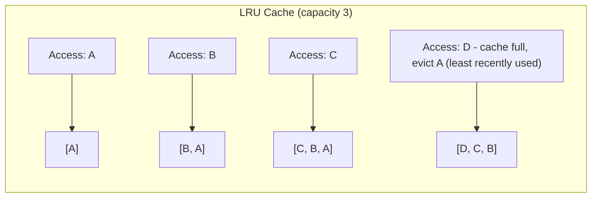
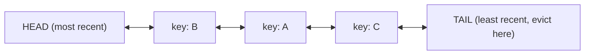

## Introduction

A cache has finite memory. Once it's full, adding a new entry means something else must go. **Eviction policies** decide what gets removed — and the choice significantly affects your cache hit rate for a given workload.

## Common Eviction Policies

| Policy | Evicts | Best for | Weakness |
|---|---|---|---|
| **LRU** (Least Recently Used) | The item not accessed for the longest time | General-purpose; workloads with temporal locality (recently used = likely to be used again) | Can be fooled by a one-time scan through many items, evicting genuinely "hot" data |
| **LFU** (Least Frequently Used) | The item accessed the fewest total times | Workloads where popularity is stable over time | New items start with a low count and can be evicted prematurely before proving their popularity ("cache pollution" from new-but-good items) |
| **FIFO** (First In First Out) | The oldest inserted item, regardless of access pattern | Simple, predictable workloads | Ignores actual usage patterns entirely — can evict frequently-used data just because it's old |
| **Random Replacement** | A randomly chosen item | Extremely simple; surprisingly effective on some workloads | No informed decision-making at all |

LRU is by far the most commonly used policy in real systems (it's the default in most caching libraries and is what Redis and Memcached lean toward by default), so it's worth understanding — and being able to implement — in depth.



## Designing an LRU Cache

The classic interview problem: design a data structure supporting `get(key)` and `put(key, value)` in **O(1)** time, evicting the least recently used item when capacity is exceeded.

**Key insight**: You need two things working together:
1. A **HashMap** for O(1) key lookup.
2. A **doubly linked list** to track recency order, so you can move an accessed item to the "front" and evict from the "back" in O(1) — an array or singly linked list would require O(n) to reposition an item.



## Java Implementation

```java
import java.util.HashMap;
import java.util.Map;

public class LRUCache<K, V> {

    private final int capacity;
    private final Map<K, Node<K, V>> cache;
    private final Node<K, V> head; // dummy head (most recently used side)
    private final Node<K, V> tail; // dummy tail (least recently used side)

    public LRUCache(int capacity) {
        this.capacity = capacity;
        this.cache = new HashMap<>();
        this.head = new Node<>(null, null);
        this.tail = new Node<>(null, null);
        head.next = tail;
        tail.prev = head;
    }

    public V get(K key) {
        Node<K, V> node = cache.get(key);
        if (node == null) {
            return null; // cache miss
        }
        moveToFront(node); // accessing a node makes it "most recently used"
        return node.value;
    }

    public void put(K key, V value) {
        Node<K, V> existing = cache.get(key);
        if (existing != null) {
            existing.value = value;
            moveToFront(existing);
            return;
        }

        if (cache.size() >= capacity) {
            evictLeastRecentlyUsed();
        }

        Node<K, V> newNode = new Node<>(key, value);
        cache.put(key, newNode);
        addToFront(newNode);
    }

    private void evictLeastRecentlyUsed() {
        Node<K, V> lru = tail.prev;
        removeNode(lru);
        cache.remove(lru.key);
    }

    private void moveToFront(Node<K, V> node) {
        removeNode(node);
        addToFront(node);
    }

    private void addToFront(Node<K, V> node) {
        node.next = head.next;
        node.prev = head;
        head.next.prev = node;
        head.next = node;
    }

    private void removeNode(Node<K, V> node) {
        node.prev.next = node.next;
        node.next.prev = node.prev;
    }

    private static class Node<K, V> {
        K key;
        V value;
        Node<K, V> prev;
        Node<K, V> next;

        Node(K key, V value) {
            this.key = key;
            this.value = value;
        }
    }
}
```

**Why this achieves O(1) for both operations**: HashMap lookup is O(1); moving a node to the front or removing it from a doubly linked list is O(1) *because we already have a direct reference to the node* (from the HashMap) — we never need to traverse the list to find it.

### A Shortcut in Java: `LinkedHashMap`

For production code (not interview whiteboarding), Java's built-in `LinkedHashMap` supports access-order mode and can implement LRU with far less code:

```java
public class SimpleLRUCache<K, V> extends LinkedHashMap<K, V> {
    private final int capacity;

    public SimpleLRUCache(int capacity) {
        super(capacity, 0.75f, true); // true = access-order (not insertion-order)
        this.capacity = capacity;
    }

    @Override
    protected boolean removeEldestEntry(Map.Entry<K, V> eldest) {
        return size() > capacity; // eviction hook, called automatically after each put
    }
}
```

This is worth knowing for production use, but interviewers typically want to see the manual HashMap + doubly linked list version to confirm you understand *why* it achieves O(1).

## LFU: A Brief Look

LFU requires tracking an access **count** per key, and evicting the key with the lowest count (breaking ties by recency, typically). A naive implementation using a single sorted structure would cost O(log n) per access; an O(1) LFU implementation (a known but more intricate interview extension) uses a HashMap of frequency buckets, each holding its own doubly linked list of keys with that exact frequency — considerably more complex than LRU, and rarely required in full in an interview unless explicitly asked as a follow-up.

## Which Policy Should a Real System Use?

Most general-purpose caches (Redis's `allkeys-lru`, application caches like Caffeine) default to LRU or an approximation of it, because temporal locality (whatever was just used is likely to be used again soon) holds for the vast majority of real workloads. LFU is chosen specifically when access frequency is a more reliable popularity signal than recency — e.g., caching product catalog data where certain items are consistently popular over long periods, regardless of when they were last accessed.

## Summary

- Eviction policies decide what to remove when a cache is full; LRU is the most common default due to its fit with typical temporal-locality access patterns.
- An O(1) LRU cache combines a HashMap (O(1) lookup) with a doubly linked list (O(1) reordering/eviction).
- Java's `LinkedHashMap` with access-order mode provides a production-ready LRU implementation with minimal code.
- LFU is more complex to implement efficiently but better suited to workloads where stable long-term popularity, not recency, predicts future access.

---

## Interview Questions

### 1. Why does an LRU cache need both a HashMap and a doubly linked list — why not just one or the other?
**Answer:** A HashMap alone provides O(1) key lookup but has no inherent ordering to track which item was least recently used — finding and removing the least recently used item would require an O(n) scan. A doubly linked list alone can maintain recency order (moving accessed nodes to the front, evicting from the back) but finding a specific key's node to move it would require an O(n) traversal without a way to jump directly to it. Combining both gives O(1) key lookup (via the HashMap, which stores direct references to linked list nodes) *and* O(1) reordering/eviction (via the doubly linked list, since we already have a direct node reference from the HashMap lookup, avoiding any traversal).

**Follow-up:** *Why specifically a doubly linked list rather than a singly linked list?* — Removing a node from the middle of the list (when it's accessed and needs to move to the front) requires updating the pointers of both its previous and next neighbors — with a singly linked list, you'd only have a reference to the node itself and would need to traverse from the head to find its predecessor (to update that predecessor's `next` pointer), reintroducing an O(n) cost; a doubly linked list's `prev` pointer makes this an O(1) operation.

### 2. Walk through what happens, step by step, when `get(key)` is called on a key that exists in your LRU cache implementation.
**Answer:** First, look up the key in the HashMap to get a direct reference to its corresponding node — O(1). If found, that node represents a cache hit: remove the node from its current position in the doubly linked list (updating its previous and next neighbors' pointers), then re-insert it immediately after the head (marking it as most recently used) — both O(1) list operations. Finally, return the node's stored value to the caller.

**Follow-up:** *Why is it important to update the node's position on a `get`, not just on a `put`?* — Because "recently used" needs to reflect both reads and writes — if only writes updated recency, an item that's read very frequently but never re-written could be incorrectly evicted as if it were untouched, even though it's actually one of the most actively used items in the cache.

### 3. What is the time and space complexity of your LRU cache implementation?
**Answer:** Both `get` and `put` operate in O(1) time, since HashMap lookup is O(1) average case and the doubly linked list operations (insert at front, remove from anywhere given a direct reference, remove from tail) are all O(1). Space complexity is O(capacity), since the cache stores at most `capacity` entries at any time, each represented once in the HashMap and once as a node in the linked list.

**Follow-up:** *Is O(1) average-case HashMap lookup a strict guarantee, or does it depend on something?* — It's average-case, assuming a well-distributed hash function and manageable load factor — in the rare worst case of many hash collisions degrading a bucket into a linked list/tree traversal, lookup could degrade toward O(log n) (in Java's HashMap, buckets convert to a red-black tree above a threshold) or theoretically worse, though in practice this is rarely a meaningful concern for typical cache key types like Strings or Integers with well-implemented hash functions.

### 4. Explain how Java's `LinkedHashMap` can implement an LRU cache with minimal custom code, and what constructor parameter is essential for this to work.
**Answer:** `LinkedHashMap` maintains its entries in a linked list internally, and when constructed with the `accessOrder` parameter set to `true` (the third constructor argument), it reorders that internal linked list so that every `get` or `put` moves the accessed entry to the "most recently accessed" end — exactly the behavior LRU needs. Overriding the `removeEldestEntry` method (called automatically after each `put`) to return `true` once the map exceeds the desired capacity lets `LinkedHashMap` automatically evict the least-recently-used entry without needing to manually implement the doubly linked list logic yourself.

**Follow-up:** *What would happen if you forgot to set `accessOrder` to `true` and left it at its default?* — By default, `LinkedHashMap` maintains *insertion* order, not access order — meaning `get` calls would never reorder entries, and eviction would end up removing the oldest *inserted* entry (effectively FIFO behavior) rather than the least recently *used* entry, which is a fundamentally different (and generally less useful) eviction policy for a cache.

### 5. Describe a real workload where LRU would perform poorly, and explain why.
**Answer:** A classic failure case is a large sequential scan through a dataset much bigger than the cache — e.g., iterating once through every record in a huge table for a batch export job. Since LRU always evicts the least recently used item, and every item in a pure sequential scan is only ever accessed once, this scan will progressively evict genuinely "hot," frequently-reused data (accessed by other concurrent parts of the system) simply because the scan's items were *more recently* touched — even though the scanned items themselves will likely never be accessed again, while the evicted hot data will be needed again soon. This is sometimes called "cache pollution" by a scan.

**Follow-up:** *What's a known technique to mitigate this specific failure mode while still largely retaining LRU's general benefits?* — Some systems use a hybrid approach (like "LRU-K" or a segmented LRU with a probationary/protected distinction, as used in some real caching systems) that requires an item to be accessed more than once before being promoted to the fully "protected" most-recently-used status — a single-access scan item would only ever occupy the smaller probationary segment, limiting how much it can pollute the main cache.

### 6. Why is LFU generally harder to implement efficiently (in O(1)) compared to LRU?
**Answer:** LRU only needs to track relative recency, which a simple doubly linked list handles naturally (move to front on access). LFU needs to track an access *count* per key and find the minimum count across all keys to evict — a naive approach (e.g., a sorted structure or scanning for the minimum) costs at least O(log n) per operation. Achieving true O(1) LFU requires a more intricate structure: typically a HashMap mapping each distinct frequency count to its own doubly linked list of keys currently at that frequency, plus tracking the current global minimum frequency — considerably more bookkeeping than LRU's single linked list.

**Follow-up:** *In an interview, if asked to implement LFU after already implementing LRU, would you expect to be asked for full O(1) performance, or is a simpler approach usually acceptable?* — This varies by interviewer and company bar, but it's common to first confirm a working, correct solution (even if it's O(log n) using a simple priority queue or sorted structure) before optimizing further — jumping straight to the full O(1) frequency-bucket implementation without first establishing a simpler correct baseline can sometimes cost more time than it saves if you make an implementation mistake under interview pressure.

### 7. What's the "new item problem" in LFU, and how might a real system address it?
**Answer:** In LFU, a brand-new cache entry starts with an access count of essentially zero or one, making it the most likely candidate for eviction even if it's about to become very popular (it just hasn't had the chance to accumulate access count yet) — potentially evicting genuinely valuable new content prematurely in favor of older items with historically high but possibly now-stale popularity counts. Real systems sometimes address this with a decay mechanism (periodically reducing all frequency counts, so old popularity doesn't permanently entrench an item) or by giving new entries a small grace period/initial count boost before they're eligible for eviction based on frequency alone.

**Follow-up:** *Why might frequency decay also help with a separate problem: content whose popularity was high in the past but has since genuinely declined?* — Without decay, an item's frequency count only ever grows (it's a cumulative history), so an item that was extremely popular last month but is now rarely accessed could still incorrectly "outrank" more currently-relevant items indefinitely; decaying counts over time ensures the frequency metric reflects *recent* popularity rather than all-time cumulative popularity, keeping the eviction decisions relevant to current access patterns.

### 8. If you were designing a cache for a CDN edge node serving a mix of viral, short-lived content and stable, evergreen popular content, which eviction policy (or combination) might you lean toward, and why?
**Answer:** A pure LRU policy risks having viral-but-short-lived content churn through and evict stable evergreen content just by being recently accessed en masse during its viral spike, even though it won't be needed again once the spike passes. A pure LFU policy risks failing to quickly cache genuinely new viral content because it hasn't yet accumulated a high frequency count. In practice, many CDN/caching systems use a hybrid approach (e.g., an approximated LFU with decay, or a segmented LRU distinguishing single-access from multi-access items) that balances responsiveness to sudden popularity with resistance to being polluted by one-off traffic spikes.

**Follow-up:** *Why might a purely theoretical "optimal" eviction policy (like Bélády's algorithm, which evicts whatever will be used furthest in the future) not be usable in a real system?* — Bélády's algorithm requires knowing future access patterns in advance, which is generally impossible for a real, live system serving unpredictable real-world traffic — it's used mainly as a theoretical benchmark to measure how close a practical policy (like LRU or LFU) comes to the best possible achievable hit rate, not as an implementable real-world policy itself.

### 9. In your Java LRU implementation, why do the `head` and `tail` use dummy (sentinel) nodes rather than tracking the first/last real nodes with plain references?
**Answer:** Using dummy sentinel nodes for `head` and `tail` eliminates the need for special-case null checks when adding or removing nodes at the boundaries of the list (e.g., adding to an empty list, or removing the only remaining node) — every real node always has a genuine `prev` and `next` node to interact with (even if that neighbor is a dummy sentinel), simplifying the `addToFront` and `removeNode` logic into uniform operations that work correctly regardless of whether the list is empty, has one element, or has many elements.

**Follow-up:** *What bug might you introduce if you removed the dummy nodes and tried to track real head/tail references directly?* — You'd need extra conditional logic to handle edge cases like: inserting into an empty cache (where there's no existing head/tail to link to), or removing the very last remaining node (where after removal, both head and tail references need to be explicitly reset to null/empty rather than pointing to now-invalid nodes) — omitting or mishandling these edge cases is a common source of null-pointer bugs in a from-scratch linked list implementation.

### 10. How would you extend your LRU cache implementation to make it thread-safe for concurrent access from multiple threads?
**Answer:** The simplest approach is wrapping the critical sections (the HashMap and linked list mutations in `get` and `put`) with a `synchronized` block or a `ReentrantLock`, ensuring only one thread can modify the cache's internal structure at a time — straightforward but can become a bottleneck under high concurrency since every operation, even reads, would serialize on the same lock. A more scalable approach for high-concurrency scenarios involves techniques like lock striping (partitioning the cache into multiple independently-locked segments, similar to how `ConcurrentHashMap` internally partitions its buckets) or using a well-tested existing concurrent caching library (like Caffeine, which is heavily optimized for exactly this concern) rather than hand-rolling thread-safety into a custom implementation for production use.

**Follow-up:** *Why might using `java.util.concurrent.ConcurrentHashMap` alone, without any additional synchronization, still not be sufficient to make your LRU cache correctly thread-safe?* — `ConcurrentHashMap` only guarantees thread-safety for the map's own individual operations (like a single `get` or `put` on the map itself) — but your LRU cache's correctness depends on *coordinated* updates across both the map and the doubly linked list together (e.g., moving a node in the list must stay consistent with its presence in the map), and `ConcurrentHashMap` provides no atomicity guarantee across these two separate data structures being updated together, so race conditions between concurrent `get`/`put` calls could still corrupt the linked list's ordering even with a thread-safe map.
