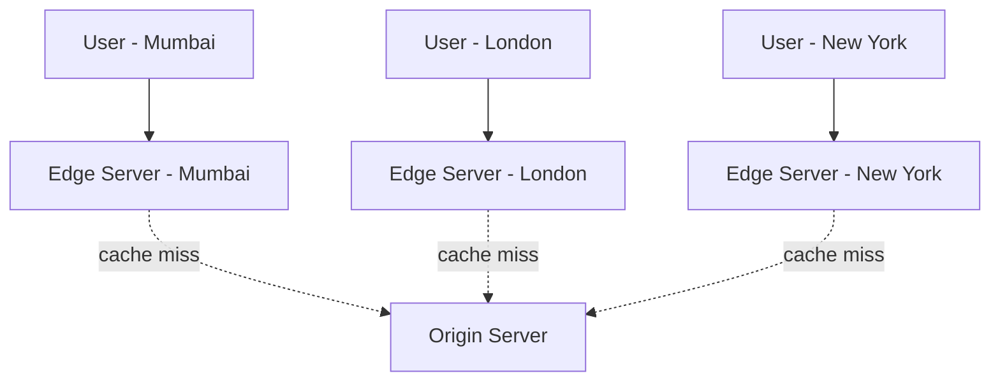
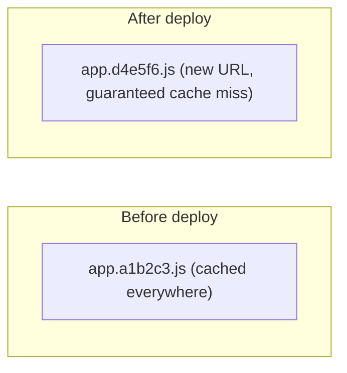

## Introduction

Chapter 2 established that physical distance imposes a hard latency floor via the speed of light. A **Content Delivery Network (CDN)** is the primary architectural answer to that problem: instead of every user's request traveling all the way to your origin server, a CDN serves content from a location physically close to the user.

## How a CDN Works

A CDN operates a large network of **edge servers** (also called Points of Presence, or PoPs) distributed globally. When a user requests content, they're routed (typically via Anycast or GeoDNS, from Chapter 3) to the nearest edge server rather than your origin.

- On a **cache hit**, the edge server serves the content directly — no round trip to the origin at all.
- On a **cache miss**, the edge server fetches from the origin, serves the response, and typically caches it for subsequent requests from other nearby users.

## Push vs Pull CDNs

| | Pull CDN | Push CDN |
|---|---|---|
| How content gets to the edge | Fetched on-demand on first request (cache miss), then cached | Proactively uploaded to all edge nodes ahead of time |
| Best for | Frequently changing or very large content catalogs (not practical to pre-push everything) | Small, stable, infrequently-changing content (e.g., a video platform's launch-day trailer) |
| First-request latency | Higher (cache miss requires fetching from origin) | Lower (content already at the edge before any request arrives) |
| Storage cost | Only stores what's actually requested at each edge | Stores identical content at every edge regardless of local demand |

Most modern CDNs (Cloudflare, Akamai, CloudFront) default to a pull model for most content, since it's far more storage-efficient at scale — push CDNs are typically reserved for specific, predictable, high-value content.

## What Can Be Cached at a CDN

- **Static assets**: images, CSS, JavaScript, videos — the classic, easy CDN use case; these rarely change and are identical for every user.
- **Dynamic but cacheable content**: an API response that's the same for all users for some period (e.g., a public product catalog) can be cached at the edge with an appropriate `Cache-Control` header (Chapter 4).
- **Personalized/private content**: generally *not* cached at the CDN (or cached with `private` scope, meaning only the requesting user's own browser caches it) — caching one user's personalized data at a shared edge node risks serving it to a different user.

## CDN and Cache Invalidation

Because CDN content is distributed across potentially hundreds of edge locations, invalidating a cached object (e.g., after deploying an updated JavaScript file) means telling *every* edge location holding a copy to purge or refresh it — a "cache purge" or "cache invalidation" request across the CDN's entire network. This is why static assets are commonly served with content-hashed filenames (`app.a1b2c3.js`) rather than relying on invalidation: a new deployment produces a *new* filename/URL entirely, sidestepping the need to invalidate anything — old cached files simply become unreferenced and naturally expire, while the new filename is a guaranteed cache miss that fetches fresh content.

## CDNs Beyond Static Content

Modern CDNs also offer:
- **DDoS protection** — absorbing and filtering malicious traffic at the edge before it ever reaches your origin.
- **Edge compute** — running small pieces of logic (e.g., Cloudflare Workers, Lambda@Edge) directly at edge locations, enabling use cases like A/B testing, request rewriting, or authentication checks without a round trip to the origin.
- **TLS termination at the edge** — reducing the latency cost of the TLS handshake (Chapter 4) by terminating it as close to the user as possible.

## Summary

- CDNs reduce latency by serving content from edge locations physically close to users, directly addressing the speed-of-light latency floor.
- Pull CDNs fetch and cache content on demand; push CDNs proactively distribute content ahead of time — pull is the more common default for most workloads.
- Static assets are the classic CDN use case; some dynamic, non-personalized content can also be CDN-cached with the right `Cache-Control` headers.
- Content-hashed filenames sidestep the complexity of coordinated cache invalidation across many edge locations after a deployment.
- Modern CDNs also provide DDoS protection and edge compute capabilities beyond simple content caching.

---

## Interview Questions

### 1. Explain, in terms of the underlying physics, why a CDN reduces latency for a user far from your origin server.
**Answer:** Network latency has a physical floor set by the speed of light through fiber, meaning a user in Mumbai requesting content from an origin server in Virginia will always incur a substantial minimum round-trip delay no matter how fast the origin server itself processes the request. A CDN reduces this by serving cached content from an edge server physically located near Mumbai instead, shrinking the physical distance (and therefore the unavoidable propagation delay) the data must travel for that user, independent of any server-side processing optimization.

**Follow-up:** *Does a CDN help at all for a user who happens to be geographically close to your origin server already?* — The latency benefit is much smaller in that specific case, but a CDN can still help via other mechanisms — offloading traffic from the origin (reducing origin load/congestion) and potentially better network routing/peering than a direct connection to the origin would achieve — though the primary "distance" benefit is naturally most pronounced for geographically distant users.

### 2. Compare pull and push CDN models, and explain why pull is the more common default for most modern web content.
**Answer:** A pull CDN fetches and caches content from the origin lazily, on the first request that misses the edge cache; a push CDN requires proactively uploading content to every edge location ahead of any user request. Pull is more common because most websites have large, frequently-changing content catalogs where pre-pushing everything to every edge location globally would be extremely storage-inefficient (most content isn't requested from most locations) — pull CDNs only store what's actually locally demanded at each edge, adapting naturally to real traffic patterns without manual content distribution management.

**Follow-up:** *In what scenario might a push CDN's higher upfront cost still be justified?* — For content where even the very first request's latency matters critically and is predictable in advance — e.g., a major, scheduled content launch (a highly anticipated movie trailer or software release) expected to receive massive simultaneous global demand the instant it's available — proactively pushing content ensures zero users experience a first-request cache-miss penalty during that critical launch moment.

### 3. Why is it generally unsafe to cache personalized content (like a user's account dashboard) at a shared CDN edge node?
**Answer:** A CDN edge node's cache is typically shared across all users requesting the same URL from that location — if a personalized response (containing one user's private data) is cached under a URL, that same cached response risks being served to a *different* user who requests the same URL next, causing a serious data leak between users. This is why personalized responses should either not be cached at all at the shared CDN layer, or be marked with `Cache-Control: private` (Chapter 4), restricting caching to the individual user's own browser rather than the shared edge cache.

**Follow-up:** *If an API response contains both shared and personalized data, what's a common architectural pattern to still get CDN caching benefits?* — Split the response: serve the cacheable, shared portion (e.g., a product's general description and price) from a CDN-cached public endpoint, and fetch the personalized portion (e.g., "is this in your cart," personalized recommendations) via a separate, non-cached, user-scoped request — often assembled together on the client side — allowing the bulk of the data to benefit from CDN caching while keeping personalized data properly isolated.

### 4. Why do many production systems use content-hashed filenames (like `app.a1b2c3.js`) for static assets instead of relying on cache invalidation after each deployment?
**Answer:** Invalidating a cached object across a CDN's potentially hundreds of globally distributed edge locations is itself a non-trivial, sometimes slow and eventually-consistent operation — there's a window where different edge locations might still serve the old cached version even after an invalidation request. Using content-hashed filenames sidesteps this entirely: a new deployment with different file contents produces a completely new URL (since the hash changes), which is inherently a guaranteed cache miss at every edge location, fetching the new content fresh — no invalidation coordination is needed at all, and old cached files simply become unreferenced and naturally expire from cache over time without needing an explicit purge.

**Follow-up:** *Does this approach mean you never need explicit cache invalidation capability at all?* — Not entirely — content-hashed filenames work well for versioned assets like JS/CSS bundles, but you'd still need explicit invalidation capability for content that must be updated at a *stable*, unchanging URL (e.g., a CMS-served page at a fixed path, or an API endpoint's cached response) where you can't simply mint a new URL for every update.

### 5. What is "edge compute," and give an example of a use case it enables that a traditional CDN (caching only) cannot.
**Answer:** Edge compute allows running small pieces of custom application logic directly on CDN edge servers, close to the user, rather than only serving static cached content. An example use case: authentication/authorization checks or request rewriting (e.g., redirecting users based on their detected region or device type) can happen entirely at the edge, without needing a round trip all the way to the origin server just to make that routing decision — something a pure content-caching CDN, with no programmable logic, fundamentally cannot do since it can only serve or miss on pre-existing cached content.

**Follow-up:** *Why might a system choose to run A/B testing logic at the edge rather than at the origin server?* — Running the A/B test variant assignment at the edge means the decision (and any resulting response variation) can be made and served without incurring the full round-trip latency to the origin, and it can reduce load on the origin server since it no longer needs to handle that logic for every single request — particularly valuable for high-traffic, latency-sensitive A/B tests.

### 6. How does a CDN contribute to DDoS resilience beyond just improving latency?
**Answer:** Because a CDN's edge network absorbs and serves the vast majority of legitimate traffic (and can also absorb malicious traffic) at edge locations distributed globally, a volumetric DDoS attack's traffic gets spread across and filtered by this large, distributed edge infrastructure rather than being concentrated directly at your single origin server — the CDN provider's edge network typically has vastly more aggregate bandwidth and specialized traffic-filtering capability than a typical origin server would have on its own, shielding the origin from ever seeing the bulk of the attack traffic in the first place.

**Follow-up:** *Why might relying solely on the CDN for DDoS protection still leave a gap, if the origin server's IP address becomes known/exposed?* — If an attacker discovers and directly targets the origin server's actual IP address (bypassing the CDN entirely), the CDN's protective filtering is circumvented completely — this is why systems relying on CDN-based DDoS protection typically also restrict the origin server's firewall to only accept traffic from the CDN provider's known IP ranges, ensuring the origin cannot be reached directly even if its IP becomes known.

### 7. Why does TLS termination at the CDN edge typically improve performance compared to only terminating TLS at the origin server?
**Answer:** As covered in Chapter 4, the TLS handshake requires a round trip (or more) before any application data can flow — if TLS is only terminated at a distant origin server, the user pays the full round-trip latency cost of that distant handshake. Terminating TLS at a nearby CDN edge server means this handshake happens over a much shorter physical distance (lower latency), and the CDN can then maintain a separate, already-established, potentially reused connection to the origin server for the (comparatively rarer) cache-miss requests that actually need to reach it.

**Follow-up:** *Does terminating TLS at the edge introduce any security consideration that terminating only at the origin wouldn't?* — Yes — it means the CDN provider itself has access to decrypted traffic at the edge (since it's terminating the encryption there), requiring trust in the CDN provider's security practices; systems with very strict end-to-end encryption requirements sometimes use a secondary encrypted tunnel from the CDN edge to the origin (re-encrypting) to minimize the window where data exists in a less-trusted intermediate location, rather than relying solely on the CDN edge's internal security.

### 8. In a system design interview, when would you explicitly recommend against introducing a CDN, despite its general benefits?
**Answer:** For an internal-only enterprise application with a small, geographically concentrated user base (e.g., all users are employees at a single office location near the origin server, or connecting via an internal corporate network), the latency benefits of geographically distributed edge caching are largely irrelevant, since there's no meaningful physical distance problem to solve — introducing a CDN in this case adds cost and operational complexity (managing cache invalidation, `Cache-Control` header correctness, potential edge-related debugging complexity) without a corresponding real-world benefit.

**Follow-up:** *If that same internal application later expanded to a globally distributed workforce, would your recommendation change?* — Yes — once users are meaningfully distributed across different geographic regions, the same latency argument that motivated the "no CDN" recommendation for a geographically concentrated user base would now favor introducing a CDN (or at minimum a multi-region deployment strategy) to serve those newly distributed users with acceptable latency.

### 9. What role does the `Vary` HTTP header play in CDN caching correctness, and what problem can arise if it's misconfigured?
**Answer:** The `Vary` header tells caches (including CDN edge caches) that a response can differ based on the value of specific request headers (e.g., `Vary: Accept-Encoding` indicates the response differs depending on whether the client accepts gzip compression, or `Vary: Accept-Language` indicates language-specific content) — the cache must then store and serve *separate* cached copies keyed by the differing header value, rather than treating all requests to the same URL as interchangeable. If `Vary` is missing or misconfigured when it should be present, a CDN might incorrectly serve one user's cached response (e.g., content in French, or gzip-compressed content) to a different user who should have received a different variant (e.g., English, or uncompressed content) — a subtle but real correctness bug.

**Follow-up:** *Why might overusing `Vary` (marking many headers as significant) hurt CDN cache effectiveness even if it's technically correct?* — Each additional header value the cache must vary on multiplies the number of distinct cached variants needed for the same URL, potentially fragmenting the cache into many low-hit-rate variants instead of one high-hit-rate shared cached response — `Vary` should be used precisely for headers that genuinely produce different response content, not applied broadly out of excessive caution.

### 10. How would a globally distributed video streaming platform (previewing Chapter 56) combine CDN edge caching with origin infrastructure design?
**Answer:** Video content (especially popular titles) would be cached extensively across CDN edge locations globally, since video files are large, relatively static once encoded, and benefit enormously from being served from a nearby edge rather than a distant origin for every playback request — dramatically reducing both latency (faster start times, less buffering) and origin bandwidth costs (the origin only serves each unique video segment once per edge location, not once per individual user request). The origin infrastructure itself would focus on video ingestion, encoding into multiple quality/bitrate variants (for adaptive bitrate streaming), and serving as the fallback source of truth for less popular/long-tail content or on genuine edge cache misses, rather than serving the bulk of actual playback traffic directly.

**Follow-up:** *Why might a video platform choose a hybrid of push and pull CDN strategies rather than purely pull?* — Extremely popular, predictably high-demand content (e.g., a major new release expected to be watched by millions immediately upon availability) might be proactively pushed to edge locations ahead of release to avoid a flood of simultaneous cache-miss requests hitting the origin at launch, while the platform's long-tail catalog (older, less-frequently-watched content) relies on pull caching, since pre-pushing the entire catalog everywhere would be highly storage-inefficient for content with low or unpredictable regional demand.
