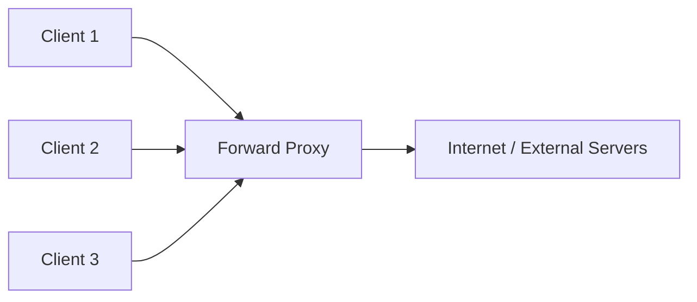
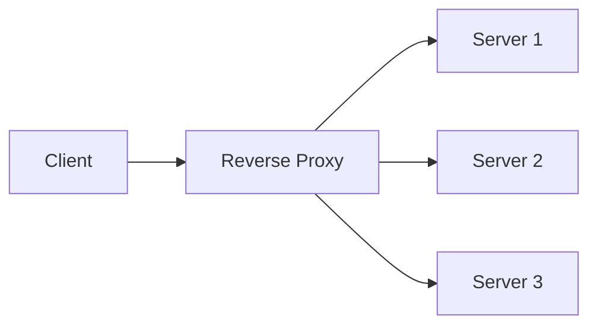
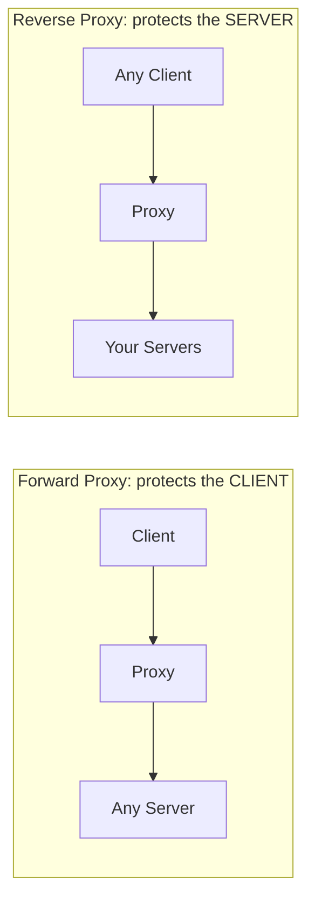

## Introduction

This chapter closes out Part 2 by clarifying a distinction that trips up many candidates: forward proxies and reverse proxies both sit "in the middle" of a connection, but they exist for fundamentally different purposes and serve different parties.

## Forward Proxy

A **forward proxy** sits in front of **clients**, acting on their behalf when talking to servers on the internet. The server sees the proxy's IP, not the client's.

**Common use cases:**
- **Corporate network egress control** — companies route all employee internet traffic through a forward proxy to enforce content filtering, logging, and access policies.
- **Anonymity/privacy** — hides the client's real IP address from the destination server.
- **Bypassing geographic restrictions** — routing traffic through a proxy in a different region.
- **Caching for a group of clients** — a shared forward proxy can cache commonly-requested external content (e.g., software update files) so multiple internal clients don't each independently re-fetch the same data from the internet.

From the destination server's perspective, it has no idea (unless it inspects headers like `X-Forwarded-For`, which the proxy may or may not set) how many actual distinct clients are behind that one proxy IP.

## Reverse Proxy

A **reverse proxy** sits in front of **servers**, acting on their behalf when receiving requests from clients. The client thinks it's talking directly to the "server," but is actually talking to the proxy.

**Common use cases:**
- **Load balancing** — as covered in Chapter 8, a reverse proxy (like Nginx or HAProxy) is frequently the actual software implementing L7 load balancing.
- **TLS termination** — decrypting HTTPS traffic once at the proxy, before forwarding plaintext internally (Chapter 4).
- **Hiding internal architecture** — clients never learn how many backend servers exist, their internal IPs, or how the system is actually structured.
- **Security** — a reverse proxy can absorb malicious traffic, apply WAF (Web Application Firewall) rules, and rate-limit before requests ever reach application servers.
- **Caching** — a reverse proxy can cache responses on behalf of the origin servers it protects, similar in spirit to a CDN edge node but typically within the same data center/region.

This is, in fact, exactly the role an **API Gateway** (Chapter 6) plays — an API Gateway is a specialized, feature-rich reverse proxy.

## Side-by-Side Comparison

| | Forward Proxy | Reverse Proxy |
|---|---|---|
| Acts on behalf of | Clients | Servers |
| Client is aware it's using a proxy? | Usually yes (explicitly configured) | Usually no (looks like talking directly to the server) |
| Server is aware of the real client? | Often no (sees only the proxy's IP) | N/A — the server is behind the proxy |
| Typical deployer | Enterprises, ISPs, individual privacy tools | The service/application owner |
| Primary goal | Control/protect/anonymize client-side traffic | Control/protect/scale server-side traffic |

## A Simple Mnemonic

- **Forward proxy**: the *client* doesn't want to be seen, or wants controlled access to the wild internet. Think "outbound gatekeeper."
- **Reverse proxy**: the *server* doesn't want to be seen directly, or wants controlled, load-balanced, secured access from the wild internet. Think "inbound gatekeeper."

## Summary

- A forward proxy represents clients to the outside world — used for access control, privacy, and shared caching for a group of clients.
- A reverse proxy represents servers to the outside world — used for load balancing, TLS termination, security, and hiding internal architecture.
- An API Gateway is best understood as a specialized, feature-rich reverse proxy.
- The distinction is about *whose side* the proxy is protecting/representing, not the direction data physically flows (both involve traffic flowing both ways).

---

## Interview Questions

### 1. What is the fundamental difference between a forward proxy and a reverse proxy?
**Answer:** A forward proxy sits in front of clients and acts on their behalf when accessing external servers — the destination server sees the proxy's identity, not the actual client's. A reverse proxy sits in front of servers and acts on their behalf when receiving requests from external clients — the client sees the proxy's identity (or is unaware there even is a proxy), not the actual backend server's. The distinction is about which party (client or server) the proxy is representing and protecting, not simply "where" it sits in a network diagram.

**Follow-up:** *If you saw a generic network diagram with a box labeled "Proxy" between a client and a server, with no other context, could you tell which type it is? What would you need to know?* — Not definitively from the diagram alone — you'd need to know who deployed/controls the proxy and on whose behalf it's acting: if it's controlled by (and serving the interests of) the client side, it's a forward proxy; if controlled by (and serving the interests of) the server side, it's a reverse proxy.

### 2. Give two distinct use cases for a forward proxy in an enterprise setting.
**Answer:** (1) Content filtering and access control — routing all employee internet traffic through a forward proxy lets an organization enforce policies like blocking certain websites or categories of content. (2) Centralized logging and monitoring — a forward proxy gives IT/security teams visibility into what external destinations employees' traffic is going to, useful for security auditing and detecting potentially malicious outbound connections (e.g., communication with a known command-and-control server in a malware incident).

**Follow-up:** *Why might a forward proxy also improve network efficiency for a large organization, beyond just security/monitoring?* — If configured to cache commonly-requested external content (e.g., software updates, commonly accessed public resources), the shared forward proxy can serve repeat requests from multiple internal employees out of its own cache rather than each employee's machine independently re-fetching the same external content — reducing overall external bandwidth usage.

### 3. How does a reverse proxy contribute to hiding a system's internal architecture from clients, and why is this valuable?
**Answer:** Clients interact only with the reverse proxy's public-facing address; they have no visibility into how many backend server instances exist, their internal IP addresses, what internal services handle which parts of a request, or how the backend infrastructure is organized. This is valuable because it allows the backend architecture to evolve freely — adding/removing servers, refactoring services, changing internal topology — without requiring any change to what clients see or how they connect, and it also reduces the attack surface by not exposing internal infrastructure details directly to the internet.

**Follow-up:** *How does this relate to the concept of an API Gateway hiding internal service topology, discussed in Chapter 6?* — It's the same underlying principle — an API Gateway is essentially a reverse proxy with additional application-layer capabilities (routing by path, authentication, rate limiting); both share the core property of presenting clients with a single, stable-facing interface while the actual backend implementation remains free to change behind it.

### 4. Explain why TLS termination is typically associated with reverse proxies rather than forward proxies.
**Answer:** TLS termination refers to decrypting incoming HTTPS traffic on behalf of backend servers so they can process plaintext requests without each individually managing TLS certificates and handshake overhead — this is inherently a server-protecting function, which is exactly what a reverse proxy does. A forward proxy, representing clients rather than servers, doesn't typically terminate TLS on behalf of a destination server it doesn't control (though it may handle TLS *to the client* in certain "TLS-inspecting" forward proxy setups used for corporate content filtering, which is a related but distinct concern from the reverse proxy's server-side TLS termination role).

**Follow-up:** *What is a "TLS-inspecting" forward proxy, and why is it more controversial than typical reverse proxy TLS termination?* — A TLS-inspecting forward proxy intercepts and decrypts a client's outbound HTTPS traffic (often by having the client trust a custom internal certificate authority), inspects the plaintext content for policy enforcement, then re-encrypts it before forwarding to the actual destination — this is more controversial because it means the organization (or proxy operator) can see all of an employee's supposedly "encrypted" traffic content, raising privacy considerations that don't arise in the same way with a reverse proxy simply managing TLS for its own servers that it already fully controls the data of.

### 5. Why is an API Gateway best described as a specialized reverse proxy rather than an entirely separate architectural concept?
**Answer:** Both an API Gateway and a generic reverse proxy sit in front of backend servers, receive client requests on the servers' behalf, and can perform routing, TLS termination, and load balancing. An API Gateway adds application-layer-aware features on top of this base reverse-proxy functionality — request/response transformation, fine-grained authentication/authorization, rate limiting per API key, and API-specific observability — but fundamentally, it's performing the same core "protect and represent the servers" role that defines any reverse proxy, just with a richer, more application-aware feature set tailored specifically for API traffic.

**Follow-up:** *Could a simple Nginx configuration, without any dedicated "API Gateway" product, technically fulfill some API Gateway responsibilities?* — Yes, to a significant degree — Nginx (or similar reverse proxy software) can perform routing, TLS termination, and basic rate limiting through configuration alone; what a dedicated API Gateway product typically adds beyond this is more built-in, higher-level, API-specific tooling (like structured authentication plugin ecosystems, API key management, and request/response transformation pipelines) that would otherwise require significant custom configuration or additional modules to replicate in a bare reverse proxy setup.

### 6. A candidate says "a reverse proxy is just a forward proxy that's used by servers instead of clients." Is this framing accurate, and if not, what's the more precise distinction?
**Answer:** This framing is directionally intuitive but slightly imprecise — the more precise distinction is about *whose interests and identity* the proxy represents to the other party, not merely which "side" happens to deploy it. A forward proxy represents the *client's* identity/traffic to an external, often untrusted or arbitrary, server — the client is aware of and configures the proxy. A reverse proxy represents the *server's* identity/traffic to an external, often untrusted or arbitrary, client — critically, the *client* is often entirely unaware a proxy is even involved, believing they're talking directly to the origin server; this asymmetry in client awareness is a meaningful distinguishing detail beyond just "used by servers instead of clients."

**Follow-up:** *Can a single piece of software (like Nginx) be configured to act as either a forward or reverse proxy?* — Yes — the same underlying proxy software can be configured for either role depending on its configuration and deployment context; the distinction is architectural/functional (whose traffic and interests it's representing) rather than being tied to a specific fixed piece of technology exclusively designed for one role or the other.

### 7. Why might a reverse proxy specifically help mitigate certain types of attacks (like a basic denial-of-service attempt or malicious request patterns) before they reach application servers?
**Answer:** Because a reverse proxy is the first point of contact for all incoming client traffic, it can inspect requests and apply protective rules (like a Web Application Firewall's pattern matching for known attack signatures, basic rate limiting per client IP, or rejecting malformed requests) before any of that traffic ever reaches and consumes resources on the actual application servers — effectively acting as a filtering layer that absorbs and blocks a meaningful portion of malicious or abusive traffic at the edge of your own infrastructure, protecting the more resource-constrained or business-logic-focused backend servers behind it.

**Follow-up:** *Does a reverse proxy alone provide complete protection against a large-scale, distributed denial-of-service (DDoS) attack?* — Not by itself — a single reverse proxy (even if well-configured) still has finite capacity and could itself become overwhelmed by a sufficiently large volumetric DDoS attack; comprehensive DDoS protection typically requires additional infrastructure like a CDN's globally distributed edge network (Chapter 11) or a dedicated DDoS mitigation service with far greater aggregate absorption capacity than any single reverse proxy instance could provide alone.

### 8. In what scenario might a single request's path involve both a forward proxy and a reverse proxy?
**Answer:** Consider an employee at a company (behind a corporate forward proxy enforcing content filtering) accessing a public website that itself is hosted behind a reverse proxy/load balancer (protecting and load-balancing its backend servers) — the employee's request first passes through their company's forward proxy (representing the employee/client side) on its way out to the internet, then arrives at and passes through the destination website's reverse proxy (representing the website/server side) before finally reaching an actual backend server — both proxy types are legitimately involved in the same single end-to-end request, each serving a different party's interests at a different point in the path.

**Follow-up:** *From the destination website's perspective, what IP address would it typically see as the "client" IP in this scenario, and why might that be misleading?* — It would typically see the corporate forward proxy's IP address, not the individual employee's actual device IP — this can be misleading if the website tries to do per-user analysis (like rate limiting or geolocation) based on IP address alone, since many different employees behind the same corporate forward proxy would all appear to originate from that single shared proxy IP, potentially causing inaccurate individual client identification unless additional application-level identifiers (like authenticated user IDs) are used instead.

### 9. Why is caching an appropriate feature for both forward proxies and reverse proxies to implement, despite them serving opposite parties?
**Answer:** Caching, at its core, avoids redundant work by reusing a previously-fetched result — this benefit applies regardless of which party the proxy represents: a forward proxy caching a popular external resource benefits *multiple internal clients* who would otherwise each redundantly re-fetch that same external content, while a reverse proxy caching a backend response benefits *multiple external clients* who would otherwise each redundantly trigger the same expensive backend computation/database query — in both cases, the proxy sits at a natural chokepoint through which many requests for the same content flow, making it a logical place to deduplicate that repeated work via caching.

**Follow-up:** *Would you expect the caching strategy or invalidation approach to meaningfully differ between these two proxy types?* — Yes, somewhat — a forward proxy caching external content typically has no special relationship with or insight into when that external content changes (relying mostly on the standard HTTP caching headers set by the external server), while a reverse proxy caching content on behalf of the servers it protects can potentially be integrated more tightly with those servers' own deployment/invalidation processes (e.g., being explicitly told to purge specific cached entries when the origin application updates relevant data), enabling more precise and timely invalidation than a forward proxy could typically achieve for arbitrary external content it doesn't control.

### 10. Why might a company use a forward proxy even for its own employees accessing the company's *own* internal reverse-proxy-fronted services?
**Answer:** These serve entirely independent purposes operating on different "hops" of the same overall request path — the forward proxy governs and monitors the employee's *outbound* traffic as a matter of general corporate network policy (applying uniformly to all destinations, internal or external), while the reverse proxy in front of the internal service governs *inbound* traffic to that specific service (load balancing, security, TLS termination) regardless of who's making the request or where from; an organization might reasonably want both types of control simultaneously — general oversight of what its employees' devices connect to network-wide, and specific protective/scaling infrastructure in front of each of its own hosted services — without these two proxy layers being redundant or conflicting with one another.

**Follow-up:** *Would bypassing the corporate forward proxy for traffic destined specifically to the company's own internal services (a "split-tunnel" type configuration) make sense, and what would be the trade-off?* — It's a reasonable optimization some organizations make — internal-destined traffic doesn't need external content filtering/monitoring the same way general internet-bound traffic does, so exempting it from the forward proxy can reduce unnecessary latency and forward-proxy load; the trade-off is reduced visibility/monitoring over that specific internal traffic at the forward-proxy layer, meaning the organization would need to rely on the internal reverse proxy's own logging/security capabilities instead to maintain equivalent oversight for that traffic.
