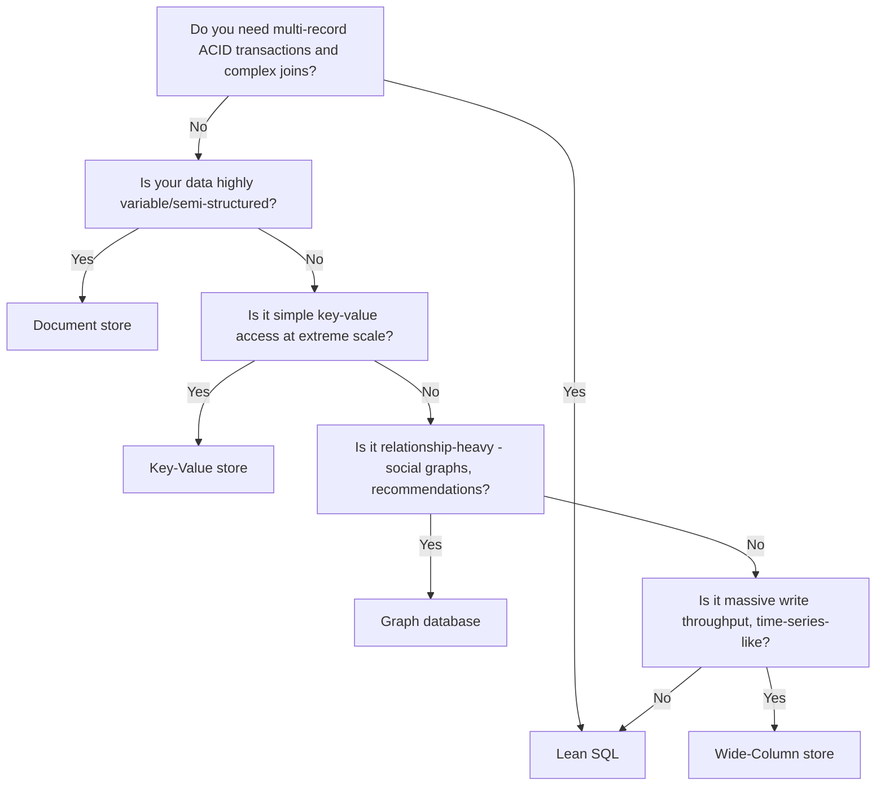

## Introduction

The database is usually the hardest part of a system to change later — migrating from one data model to another, once you have real production data and traffic, is a major undertaking. Getting the SQL-vs-NoSQL decision right early matters more than almost any other single choice in Part 3.

## Relational (SQL) Databases

SQL databases (PostgreSQL, MySQL, Oracle) organize data into **tables** with a fixed schema, related to each other via foreign keys, and queried with SQL.

```
users               orders
+----+-------+      +----+---------+--------+
| id | name  |      | id | user_id | amount |
+----+-------+      +----+---------+--------+
| 1  | Alice |       | 1  | 1       | 49.99  |
| 2  | Bob   |       | 2  | 1       | 12.50  |
```

**Strengths:**
- **ACID transactions** (Chapter 17) — strong consistency guarantees, critical for financial or inventory data.
- **Structured schema** — enforces data integrity at the database level (types, constraints, foreign keys).
- **Powerful querying** — joins, aggregations, and complex queries are a core strength.
- **Mature tooling and ecosystem.**

**Weaknesses:**
- Schema changes (migrations) can be disruptive at scale.
- Horizontal scaling (sharding) is comparatively hard, as covered in Chapter 16.
- Rigid schema can be a poor fit for rapidly evolving or highly variable data shapes.

## NoSQL Databases

"NoSQL" is an umbrella term covering several distinct data models, each suited to different problems:

| Type | Examples | Data model | Best for |
|---|---|---|---|
| **Document** | MongoDB, Couchbase | JSON-like documents, flexible schema | Content management, catalogs, semi-structured data |
| **Key-Value** | Redis, DynamoDB | Simple key → value lookups | Caching, session storage, very high-throughput simple lookups |
| **Wide-Column** | Cassandra, HBase | Rows with dynamic, sparse columns, optimized for huge scale | Time-series data, write-heavy workloads at massive scale |
| **Graph** | Neo4j, Amazon Neptune | Nodes and edges, optimized for relationship traversal | Social networks, recommendation engines, fraud detection |

```json
// A flexible MongoDB-style document — no fixed schema required
{
  "userId": "u123",
  "name": "Alice",
  "addresses": [
    { "type": "home", "city": "Patna" },
    { "type": "work", "city": "Bangalore" }
  ],
  "preferences": { "newsletter": true }
}
```

**Strengths:**
- **Schema flexibility** — documents/rows don't need identical structure, well suited to evolving or heterogeneous data.
- **Horizontal scalability** — most NoSQL databases are designed from the ground up for sharding across many nodes (Chapter 16).
- **Performance at scale** — optimized for specific access patterns (e.g., key-value lookups, wide-column time-series writes) rather than general-purpose querying.

**Weaknesses:**
- Weaker consistency guarantees by default (many favor eventual consistency, Chapter 19) — though some (like MongoDB) support configurable consistency levels.
- Joins across collections/tables are typically unsupported or inefficient — data is often denormalized instead.
- Less mature/standardized query language compared to SQL (though most have their own query APIs).

## Decision Framework



Key questions to ask in an interview:
1. **Does the data have clear, stable relationships that need joins and referential integrity?** → Leans SQL.
2. **Do you need strong, multi-record transactional consistency (e.g., moving money between two accounts atomically)?** → Leans SQL.
3. **Is the schema likely to change frequently, or is data inherently heterogeneous (e.g., different product types with different attributes)?** → Leans NoSQL (Document).
4. **Is the access pattern dominated by simple key lookups at extreme scale (e.g., session storage, caching)?** → Leans NoSQL (Key-Value).
5. **Is write throughput and horizontal scalability the dominant concern, more than query flexibility?** → Leans NoSQL (Wide-Column).

## It's Not Always Either/Or: Polyglot Persistence

Real-world large systems frequently use **multiple** database types for different components — a pattern called polyglot persistence. For example, an e-commerce platform (Chapter 57) might use:
- PostgreSQL for orders and payments (needs ACID transactions).
- MongoDB for product catalog (highly variable product attributes).
- Redis for session storage and caching.
- Elasticsearch for product search.

This is normal and often the right answer — resisting the urge to force every use case into a single database technology is itself a sign of design maturity.

## Summary

- SQL databases offer strong consistency, structured schema, and powerful querying, at the cost of harder horizontal scaling.
- NoSQL is an umbrella covering document, key-value, wide-column, and graph databases, each suited to specific access patterns and offering easier horizontal scale.
- The decision hinges on your data's structure, relationship complexity, consistency needs, and access pattern — not a general "NoSQL is more scalable, therefore always better" assumption.
- Polyglot persistence — using multiple database types across a single system — is common and often the most pragmatic real-world approach.

---

## Interview Questions

### 1. What is the core structural difference between SQL and NoSQL databases, and why does this drive their different scalability characteristics?
**Answer:** SQL databases enforce a fixed, relational schema with data spread across normalized tables connected by foreign keys, and typically emphasize strong consistency and complex joins. NoSQL databases (across their various types) generally embrace a more flexible or simplified data model — often denormalized, without required cross-record joins — which makes it far easier to partition/shard data across many nodes, since a query for a piece of data usually doesn't need to gather and join related data scattered across other shards. This structural difference is precisely why NoSQL databases are generally easier to scale horizontally than traditional relational databases.

**Follow-up:** *Does this mean SQL databases are fundamentally incapable of horizontal scaling?* — No — SQL databases can be horizontally scaled (via sharding, discussed in Chapter 16), but it requires significantly more careful application-level or middleware design to handle cross-shard joins, distributed transactions, and rebalancing, whereas many NoSQL databases provide this horizontal scaling more natively as a core design goal from the outset.

### 2. Give a concrete example of a use case where an ACID-compliant SQL database is clearly the better choice over a NoSQL alternative, and explain why.
**Answer:** A banking system transferring money between two accounts needs the debit from one account and the credit to another to happen atomically — either both succeed or neither does, with no possibility of an inconsistent in-between state even under concurrent access or a system failure mid-transaction. A SQL database's ACID transactional guarantees (Chapter 17) directly provide this atomicity and consistency across multiple related records within a single transaction; many NoSQL databases either lack multi-record transactional guarantees entirely or only support them with significant limitations, making correctness in this specific scenario much harder to guarantee without a traditional relational database's transaction support.

**Follow-up:** *Do any NoSQL databases support ACID transactions across multiple documents/records, and if so, does that eliminate the need to consider SQL for this use case?* — Some NoSQL databases (like MongoDB, from a certain version onward) do support multi-document ACID transactions, narrowing this specific gap — but they often come with performance trade-offs or scope limitations (e.g., transactions confined to a single shard/replica set) that a mature relational database's more battle-tested and unrestricted transactional model doesn't have, so SQL often remains the more natural and lower-risk default for transaction-heavy financial use cases even as some NoSQL options have improved in this area.

### 3. What is "polyglot persistence," and why might a single large system deliberately use multiple different database technologies rather than standardizing on one?
**Answer:** Polyglot persistence is the practice of using different database technologies for different components of a system, each chosen to fit that specific component's data model and access pattern needs, rather than forcing every use case through a single one-size-fits-all database. A large system might use a relational database for transactional order/payment data (needing ACID guarantees), a document store for a highly variable product catalog (needing schema flexibility), a key-value store for caching/sessions (needing extreme low-latency simple lookups), and a search-optimized engine for full-text product search — each choice reflecting that no single database excels at every one of these fundamentally different access patterns simultaneously.

**Follow-up:** *What's a real operational cost of polyglot persistence that a system standardized on a single database technology wouldn't face?* — Increased operational complexity — the team must operate, monitor, back up, and maintain expertise across multiple distinct database technologies (each with its own failure modes, scaling characteristics, and operational tooling), and keeping data consistent *across* these different stores when the same logical entity is represented in more than one (e.g., product data existing in both the catalog document store and the search index) introduces its own synchronization challenges that a single unified database wouldn't have.

### 4. Why is schema flexibility in a document database like MongoDB considered both a strength and a potential risk?
**Answer:** It's a strength because it allows different documents in the same collection to have varying structures without requiring a rigid, uniformly-enforced schema — well suited to genuinely heterogeneous data (e.g., different product types with different attribute sets) or rapidly evolving application requirements where schema migrations would otherwise be disruptive. It's a potential risk because the *lack* of enforced structure means data integrity/consistency checks that a SQL database would automatically enforce (e.g., required fields, correct data types, foreign key referential integrity) must instead be handled entirely at the application level — inconsistent or malformed documents can silently accumulate over time if application-level validation isn't rigorously and consistently applied across every code path that writes to the database.

**Follow-up:** *How do some document databases attempt to mitigate this risk while still preserving flexibility?* — Some (like MongoDB) offer optional schema validation rules that can be configured at the collection level (specifying required fields, types, or value constraints) — allowing teams to opt into as much or as little structural enforcement as suits their use case, striking a middle ground between total schema rigidity and total schema freedom.

### 5. Explain why a graph database like Neo4j significantly outperforms a relational database for certain relationship-heavy queries (e.g., "find friends of friends of friends").
**Answer:** In a relational database, traversing multi-level relationships (like friends-of-friends-of-friends) typically requires multiple expensive join operations across a foreign-key-based table structure, with performance degrading significantly as the traversal depth increases, since each additional "hop" requires another join across potentially large tables. A graph database stores relationships (edges) as first-class citizens directly alongside the data (nodes), physically co-locating connected data in a way that allows traversal algorithms to follow relationship pointers directly — turning what would be an expensive multi-join operation in SQL into a comparatively cheap graph traversal, since the database doesn't need to reconstruct relationships via repeated table scans/joins at query time.

**Follow-up:** *Would you recommend a graph database as the primary data store for a typical e-commerce order system, given this relationship-traversal strength? Why or why not?* — No — an e-commerce order system's core needs (transactional integrity for orders/payments, straightforward one-to-few relationships like order-to-line-items) don't involve the kind of deep, complex relationship traversal graph databases excel at; a relational database's transactional strengths remain the better general fit here, and a graph database would only be considered for a genuinely relationship-traversal-heavy sub-feature (like a "customers who bought this also bought" recommendation engine) rather than as the system's primary data store.

### 6. A candidate defaults to "NoSQL because it's more scalable" without further justification, when designing a system with clear relational data and complex reporting needs. What follow-up question would test whether this is a well-reasoned choice?
**Answer:** A strong follow-up would be: "How would you perform a query that joins data across multiple related entities (e.g., generating a report of total revenue by product category, requiring joining orders, order line items, and products) in your chosen NoSQL database, and what would that look like compared to a SQL join?" This tests whether the candidate has actually considered the access pattern implications of their choice, or simply defaulted to a popular buzzword-driven assumption ("NoSQL = scalable = better") without weighing the real cost NoSQL's typical lack of efficient joins would impose on this specific reporting-heavy, relationally-structured use case.

**Follow-up:** *What would a well-reasoned answer to this follow-up actually look like?* — A strong candidate might either concede that a relational database is genuinely the better fit given the join-heavy reporting requirement (potentially combined with a separate read-optimized analytics store, like a data warehouse, for heavy reporting specifically) — or, if still preferring a NoSQL approach, explain a concrete denormalization/materialized-view strategy for pre-computing and storing the needed aggregated data proactively, rather than trying to perform ad hoc relational joins in a database not designed for them.

### 7. Why might a wide-column store like Cassandra be a particularly good fit for a time-series or IoT sensor-data use case, compared to a traditional relational database?
**Answer:** Wide-column stores like Cassandra are specifically designed for extremely high write throughput and horizontal scalability, with a data model well suited to sequences of timestamped data grouped by some partition key (e.g., a specific sensor's readings over time) — exactly the shape of typical time-series/IoT data (constant streams of new writes, rarely updated once written, queried mostly by time range for a specific entity). A traditional relational database, optimized more for complex relational queries and strong transactional consistency, isn't architected primarily around sustaining the kind of massive, continuous write throughput that thousands or millions of concurrently reporting IoT sensors would generate, and would typically require significantly more scaling effort (sharding, careful indexing) to handle comparable write volume.

**Follow-up:** *What's a trade-off of Cassandra's write-optimized design that might matter for this use case?* — Cassandra (like many wide-column stores) generally favors eventual consistency and has more limited support for complex ad hoc queries/joins compared to a relational database — for IoT/time-series data, this is often an acceptable trade-off since queries are typically simple (recent readings for a given sensor, or aggregations over specific known time ranges) rather than requiring complex relational joins, and slight eventual consistency in sensor readings is often tolerable for the use case.

### 8. If a startup is choosing a database for its MVP with very uncertain, evolving future data requirements, what considerations might favor starting with SQL despite NoSQL's flexibility narrative?
**Answer:** Counter to a common assumption, a startup with genuinely *uncertain* requirements often benefits more from SQL's strong consistency guarantees and mature tooling/ecosystem while the product itself is still being figured out, since bugs caused by NoSQL's weaker default consistency guarantees or lack of enforced schema integrity can be especially costly and confusing to debug during a period of rapid, exploratory iteration; additionally, most early-stage startups' data volume and traffic don't yet approach the scale where NoSQL's horizontal scalability advantages meaningfully matter, meaning they'd be paying NoSQL's flexibility/consistency trade-offs without yet benefiting from its primary scalability advantage.

**Follow-up:** *Does this mean NoSQL's "schema flexibility" argument for handling evolving requirements is generally overstated for early-stage products?* — Often yes, to a degree — SQL databases support schema migrations (adding/modifying columns) reasonably well at smaller data volumes typical of early-stage products, and modern relational databases even support flexible JSON/JSONB column types for genuinely variable sub-structures within an otherwise structured schema — meaning teams can often get considerable schema flexibility within SQL itself, deferring a full NoSQL migration until concrete scale or access-pattern needs genuinely demand it.

### 9. What does it mean that many NoSQL databases favor "eventual consistency" by default, and why might this be an acceptable trade-off for certain use cases but not others?
**Answer:** Eventual consistency (detailed further in Chapter 19) means that after a write, different replicas/nodes of the database might briefly return different (stale) values for the same data until the update propagates fully — the system guarantees it will *eventually* become consistent, but not immediately on every read. This is acceptable for use cases where briefly stale data causes no real harm — e.g., a social media "like" count briefly showing a slightly outdated number is a non-issue — but unacceptable for use cases requiring immediate consistency, like checking real-time account balance before authorizing a critical transaction, where reading stale data could lead to actual incorrect business decisions or financial harm.

**Follow-up:** *If a team needs the horizontal scalability of a particular NoSQL database but also needs stronger consistency for a specific subset of operations, what options might they have?* — Many NoSQL databases offer tunable/configurable consistency levels per operation (e.g., Cassandra's tunable consistency levels like `QUORUM` vs `ONE`) allowing a team to request stronger consistency guarantees for specific critical reads/writes while retaining eventual consistency (and its associated performance/availability benefits) for the majority of less-critical operations — a pragmatic middle ground rather than an all-or-nothing consistency choice.

### 10. Why is "NoSQL databases don't support transactions" an oversimplified and increasingly outdated statement, and what should a well-informed candidate say instead?
**Answer:** While it was historically true that many early NoSQL databases either lacked transactional support entirely or only supported single-record atomicity, many modern NoSQL databases (e.g., MongoDB since version 4.0) now support multi-document ACID transactions, at least within certain scopes (like a single shard or replica set) — so the blanket claim "NoSQL doesn't support transactions" is no longer accurate across the board. A well-informed candidate should instead speak to the *specific* database being considered and its *specific* transactional capabilities/limitations (e.g., "MongoDB supports multi-document transactions but they come with a performance cost and are best used sparingly, unlike a relational database where transactions are a more central, highly optimized feature") rather than making a sweeping generalization about "NoSQL" as a monolithic category.

**Follow-up:** *Why does this level of specific, technology-aware knowledge matter more at senior interview levels than a general category-level comparison?* — Senior engineers are expected to make real, production-consequential technology choices based on current, accurate, and nuanced understanding of specific tools' actual capabilities — a generic, outdated, or oversimplified categorical statement ("NoSQL = no transactions") signals surface-level knowledge that could lead to poor real-world decisions (e.g., unnecessarily ruling out a NoSQL database that would have actually met the transactional requirements, or conversely wrongly assuming a NoSQL database's transaction support is as unrestricted as a mature relational database's).
