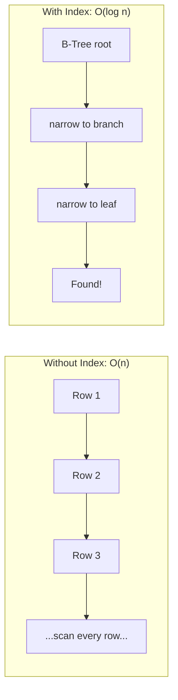
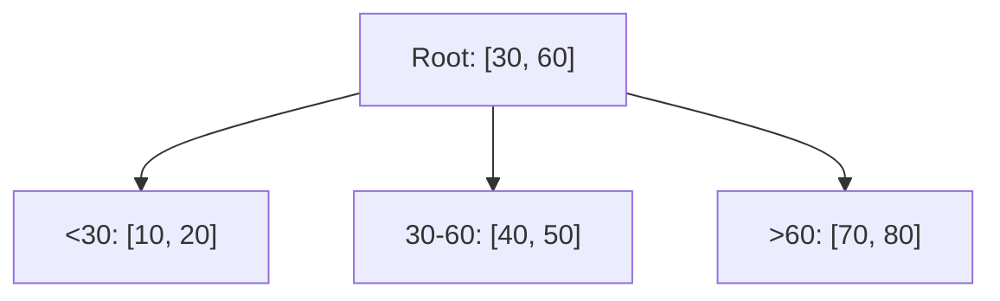
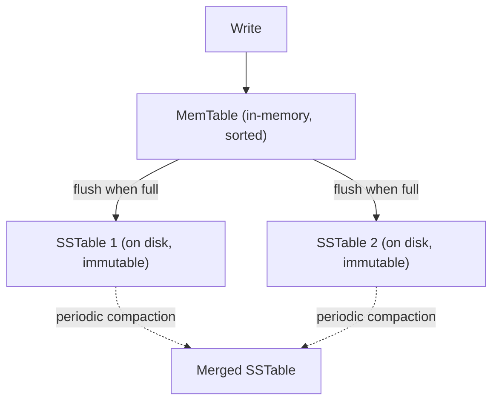

## Introduction

"Just add an index" is common advice for a slow query — but understanding *why* it works, and what it costs, separates surface-level knowledge from real database intuition. This chapter looks under the hood.

## Why Indexes Matter: The Full Table Scan Problem

Without an index, finding a row matching `WHERE email = 'alice@example.com'` requires scanning every row in the table — a **full table scan**, O(n). An index maintains a separate, sorted (or otherwise efficiently searchable) data structure mapping column values to row locations, turning that lookup into O(log n) or better.

The trade-off: indexes speed up reads but slow down writes (every `INSERT`/`UPDATE`/`DELETE` must also update the index) and consume additional storage.

## B-Trees: The Default Choice for Most Databases

Most relational databases (PostgreSQL, MySQL's InnoDB) use a **B-Tree** (or its variant, **B+Tree**) as the default index structure.

Key properties:
- **Balanced tree** — all leaf nodes are at the same depth, guaranteeing consistent O(log n) lookup time regardless of which value you search for.
- **Sorted order maintained** — B-Trees keep keys in sorted order, which also makes range queries (`WHERE age BETWEEN 20 AND 30`) and `ORDER BY` efficient, not just exact-match lookups.
- **B+Tree variant** (used by most databases in practice): only leaf nodes store actual data/row pointers; internal nodes store only keys for navigation, and leaf nodes are linked together, making sequential range scans very efficient.
- **Optimized for disk/SSD access**: B-Trees are typically wide (many keys per node) specifically to minimize the number of disk reads needed to reach a leaf — matching how storage I/O is most efficient in large sequential blocks rather than small scattered reads.

## LSM Trees: The Write-Optimized Alternative

Databases optimized for very high write throughput (Cassandra, RocksDB, LevelDB, and by extension many wide-column NoSQL stores from Chapter 13) typically use a **Log-Structured Merge Tree (LSM Tree)** instead.

How it works:
1. Writes go first to an in-memory, sorted structure (a **MemTable**) — extremely fast, since there's no disk I/O on the write's critical path.
2. When the MemTable fills up, it's flushed to disk as an immutable, sorted file (an **SSTable** — Sorted String Table).
3. Over time, many SSTables accumulate; a background **compaction** process periodically merges them, removing duplicate/overwritten/deleted entries and keeping the total number of files manageable.
4. A **read** may need to check the MemTable and potentially multiple SSTables (newest first) to find the most recent value for a key — mitigated by **Bloom filters** (Chapter 25) per SSTable, which cheaply rule out SSTables that definitely don't contain the key.

## B-Tree vs LSM Tree: The Core Trade-off

| | B-Tree | LSM Tree |
|---|---|---|
| Write performance | Slower (in-place updates require disk seeks) | Very fast (sequential writes to memory, then disk) |
| Read performance | Fast, single structure to search | Can be slower (may need to check multiple SSTables) |
| Read predictability | Consistent | Variable (depends on compaction state, mitigated by Bloom filters) |
| Space amplification | Lower | Higher (old/duplicate versions exist until compaction) |
| Best for | Read-heavy or balanced workloads | Write-heavy workloads |

This is a direct, concrete instance of a recurring system design theme: **optimizing for one access pattern (writes) generally costs something on another (read predictability)**.

## Types of Indexes Worth Knowing

- **Primary index**: Built on the primary key; in many databases (like MySQL's InnoDB), the table's actual data is physically stored in primary-key order (a "clustered index").
- **Secondary index**: An index on a non-primary-key column, pointing to the primary key (or row location) rather than storing the full row itself.
- **Composite index**: An index spanning multiple columns (e.g., `(last_name, first_name)`) — critically, the column *order* matters: a composite index on `(A, B)` efficiently supports queries filtering on `A` alone or `A AND B`, but not on `B` alone.
- **Covering index**: An index that includes all the columns a query needs, letting the database satisfy the query entirely from the index without touching the actual table data at all.

## The Cost of Over-Indexing

Every index added to a table:
- Speeds up reads that use it.
- Slows down every write to that table (the index must be updated too).
- Consumes additional disk space.

A common real-world mistake is adding indexes reactively for every slow query without considering the cumulative write-path cost — a heavily-indexed, write-heavy table can end up with degraded write throughput because every insert now updates five or six separate index structures.

## Summary

- Indexes trade write performance and storage for dramatically faster reads, turning O(n) scans into O(log n) lookups.
- B-Trees (specifically B+Trees) are the default for most relational databases, balancing solid read and write performance while keeping data sorted for efficient range queries.
- LSM Trees prioritize write throughput by buffering writes in memory and flushing sequentially to disk, at the cost of more variable read performance — the standard choice for write-heavy NoSQL databases.
- Composite and covering indexes are powerful but order- and query-shape-dependent — understanding column order matters as much as knowing an index exists.
- Every index is a trade-off, not a free win — over-indexing degrades write throughput.

---

## Interview Questions

### 1. Why does a B-Tree index turn an O(n) lookup into an O(log n) lookup?
**Answer:** A B-Tree is a balanced, sorted tree structure where each node can contain multiple keys and children, allowing a search to eliminate a large fraction of the remaining search space at each level by comparing the target value against the keys in the current node and following the appropriate child pointer — similar in principle to binary search, but with a much higher branching factor per node (optimized for disk block sizes). Because the tree's height grows logarithmically with the number of keys (thanks to its high branching factor and balanced structure), a lookup only needs to traverse a small number of levels (typically 3-4 even for millions of rows) rather than scanning every row sequentially, which is what a full table scan (O(n)) would require.

**Follow-up:** *Why do B-Trees used in databases typically have a much higher branching factor (many keys per node) compared to a classic binary tree's two children per node?* — Database B-Trees are specifically designed around minimizing disk I/O operations, since reading from disk (or even SSD) is orders of magnitude slower than in-memory operations — each node is typically sized to match a disk block (e.g., 4KB or larger), packing as many keys as possible into a single disk read, so that reaching a leaf node requires as few actual disk reads as possible, even if it means each individual node comparison involves more keys to check than a simple binary tree node would have.

### 2. What is the difference between a B-Tree and a B+Tree, and why do most production databases use the B+Tree variant specifically?
**Answer:** In a classic B-Tree, both internal (non-leaf) nodes and leaf nodes can store actual data/row pointers. In a B+Tree, only the leaf nodes store the actual data/row pointers — internal nodes store only keys used purely for navigation/routing to the correct leaf. Additionally, B+Tree leaf nodes are typically linked together in a sorted sequence. Production databases favor B+Trees because: (1) since internal nodes don't need to store full data, more keys fit per internal node, further increasing the branching factor and reducing tree height/disk reads for a given dataset size, and (2) the linked leaf nodes make sequential range scans (`WHERE age BETWEEN 20 AND 30`, or `ORDER BY`) very efficient, since once you find the starting leaf, you can simply follow the leaf-level links forward without needing to re-traverse the tree from the root for each subsequent value.

**Follow-up:** *Why does the sorted, linked-leaf structure of a B+Tree specifically benefit `ORDER BY` queries, beyond just range queries with a `WHERE` clause?* — If a query needs results sorted by the indexed column, and a B+Tree index already maintains that exact sort order at the leaf level, the database can simply read leaf nodes in their existing linked order to produce already-sorted results, entirely avoiding a separate, potentially expensive explicit sort operation that would otherwise be needed if reading rows in an arbitrary (e.g., insertion) order.

### 3. Explain why an LSM Tree achieves much higher write throughput than a B-Tree.
**Answer:** In a B-Tree, each write (insert/update) may require locating and modifying a specific node somewhere within the existing on-disk tree structure — potentially requiring a random-access disk seek to the relevant location, which is comparatively slow, especially at high write volumes. An LSM Tree instead buffers all incoming writes in an in-memory, sorted MemTable first (extremely fast, no disk I/O on the write's critical path), only periodically flushing the accumulated writes to disk as a new, immutable SSTable file via a single large sequential write — sequential disk writes are significantly faster than the scattered random writes a B-Tree's in-place update model can require, which is the core reason LSM Trees excel at sustaining very high write throughput.

**Follow-up:** *What is "write amplification," and how does it relate to the trade-off LSM Trees make for this write performance benefit?* — Write amplification refers to data being physically rewritten to disk multiple times as part of the LSM Tree's background compaction process (merging multiple SSTables together over time, rewriting the surviving data into new merged files) — even though each individual write was fast, the same logical piece of data may be physically rewritten to disk several additional times during subsequent compactions, meaning the *total* disk I/O over the data's lifetime can actually exceed what a single B-Tree in-place update would have required; LSM Trees trade this deferred, batched write amplification for much lower latency on the immediate/foreground write path.

### 4. Why can read performance be less predictable in an LSM Tree compared to a B-Tree, and how do Bloom filters help mitigate this?
**Answer:** A read in an LSM Tree may need to check the in-memory MemTable first, and then potentially multiple on-disk SSTables (since the requested key's most recent value could be in any of them, and older SSTables haven't yet been merged/compacted away) — in the worst case, this means checking several separate files before finding (or definitively not finding) the requested key, unlike a B-Tree's single, consistently-structured tree that any lookup traverses in a predictable, bounded number of steps. Bloom filters (Chapter 25) mitigate this by maintaining a small, fast, per-SSTable probabilistic structure that can quickly and cheaply confirm "this SSTable definitely does NOT contain this key," allowing the read path to skip checking the actual contents of SSTables that don't contain the key, substantially reducing the number of SSTables that must actually be read from disk for a typical lookup.

**Follow-up:** *Do Bloom filters eliminate LSM Tree read variability entirely?* — No — Bloom filters only help skip SSTables that definitely don't contain a key; for a key that *does* exist, or for the (occasional, tunable-rate) false positives a Bloom filter can produce, the read may still need to check one or more actual SSTables on disk, and background compaction status (how many un-merged SSTables currently exist) still influences worst-case read latency — Bloom filters reduce, but don't fully eliminate, the inherent read-path variability of the LSM Tree design.

### 5. What is a covering index, and why can it dramatically improve query performance beyond what a standard secondary index provides?
**Answer:** A standard secondary index typically stores the indexed column's value plus a pointer/reference back to the actual row (often the primary key), meaning that after finding a match in the index, the database still needs a second lookup ("bookmark lookup" or similar) into the actual table data to retrieve any other columns the query needs (a `SELECT` list beyond just the indexed column). A covering index includes *all* the columns a specific query needs directly within the index structure itself, allowing the database to satisfy the entire query directly from the index without ever needing to access the underlying table data at all — eliminating that extra lookup step entirely for queries that match the covering index's column set.

**Follow-up:** *What's a downside of creating covering indexes liberally to optimize every possible query?* — Covering indexes, by definition, duplicate additional column data within the index structure itself (beyond just the indexed column and a row pointer), meaning they consume more storage space than a standard secondary index, and every write to any of the columns included in the covering index (not just the specifically indexed column) now also requires updating that index — compounding the general write-performance and storage cost trade-off that applies to indexing in general, but more so given the extra included columns.

### 6. Explain why the column order in a composite index (e.g., an index on `(last_name, first_name)`) matters, and give an example query that would and wouldn't benefit from it.
**Answer:** A composite index is physically structured and sorted primarily by its first specified column, with the second column only providing sub-ordering *within* groups of matching first-column values (similar to how a phone book is sorted by last name first, then first name within each last name group). A query filtering on `WHERE last_name = 'Smith'` (using just the first indexed column) or `WHERE last_name = 'Smith' AND first_name = 'John'` (using both, in order) can efficiently use this index, since both align with its sorted structure. However, a query filtering *only* on `WHERE first_name = 'John'` (skipping the first column entirely) generally cannot efficiently use this composite index, since the index isn't sorted or organized in a way that groups matching first-name values together independent of last name — the database would need to scan through the entire index checking every entry's first_name value, largely negating the index's benefit for that specific query shape.

**Follow-up:** *If a table commonly needs to be queried by `first_name` alone as well as by the `(last_name, first_name)` combination, what would you recommend?* — Create a separate, dedicated index on `first_name` alone in addition to the existing composite index — since a composite index generally cannot efficiently serve queries that skip its leading column(s), a distinct index is needed to properly support that different access pattern, accepting the additional write/storage overhead of maintaining both indexes.

### 7. Why does adding an index sometimes fail to improve, or even worsen, query performance in practice, despite theoretically enabling O(log n) lookups?
**Answer:** Several practical scenarios can undermine an index's expected benefit: if the indexed column has very low cardinality (e.g., a boolean "is_active" column with only two possible values), the database's query planner might reasonably determine that a full table scan is actually cheaper than using the index, since the index wouldn't meaningfully narrow down the result set; if the query retrieves a large percentage of the table's rows anyway (e.g., a `WHERE` clause matching 80% of all rows), sequentially scanning the whole table can be faster than the overhead of many individual indexed lookups plus subsequent row fetches; and if the query planner's statistics about the table's data distribution are stale or inaccurate, it might choose a suboptimal execution plan that doesn't actually leverage the available index effectively even when it should.

**Follow-up:** *What database feature helps address the "stale statistics" issue mentioned here?* — Most relational databases have a statistics-gathering process (e.g., PostgreSQL's `ANALYZE` command, often run automatically) that periodically samples the table's actual data distribution to keep the query planner's cost estimates accurate — running this appropriately (or ensuring auto-analyze is properly configured) helps ensure the planner makes well-informed decisions about when to actually use an available index versus falling back to a full table scan.

### 8. In an interview, a candidate says "I'll add an index on every column that appears in a `WHERE` clause anywhere in my application." What's the concern with this blanket approach?
**Answer:** While it might seem to maximize read performance across the board, this ignores the well-established trade-off that every additional index also slows down every write operation on that table (since each index must be kept up to date on every insert/update/delete) and consumes additional storage — a table with many indexes covering every conceivable query pattern can end up with significantly degraded write throughput, which may be unacceptable for write-heavy tables even if it theoretically speeds up various reads. A more thoughtful approach involves profiling actual, real query patterns and their relative frequency/importance, prioritizing indexes for the most impactful and frequently-executed queries, rather than reflexively indexing every column that ever appears in any `WHERE` clause regardless of how rarely that specific query runs or how write-sensitive the table is.

**Follow-up:** *How would your answer change if the table in question were a rarely-updated reference/lookup table rather than a high-write transactional table?* — For a rarely-updated reference table (e.g., a list of countries or product categories that changes very infrequently), the write-performance cost of additional indexes becomes far less significant, since writes are rare — in this specific case, being more liberal with adding indexes to optimize various read query patterns is a much more reasonable trade-off, since you're not meaningfully sacrificing anything on the write side that matters in practice.

### 9. Why might a database chosen specifically for high write throughput (like Cassandra) be a poor fit for a use case requiring complex, flexible ad hoc range queries across many different columns?
**Answer:** Cassandra's LSM-Tree-based storage engine and overall data model are optimized around its primary/partition key structure — efficient queries generally need to specify the partition key (and often a defined clustering key range) to leverage the database's underlying storage layout effectively; querying flexibly across arbitrary, non-indexed columns (similar to how a relational database might support ad hoc `WHERE` clauses on any column via various available indexes) is either unsupported, requires creating and maintaining numerous secondary indexes (which come with their own performance caveats in Cassandra specifically), or requires denormalizing data into multiple differently-keyed tables tailored to each specific query pattern in advance — a fundamentally different, less flexible querying philosophy than a relational database's general-purpose query optimizer and diverse indexing options provide.

**Follow-up:** *What does this imply about how application/schema design differs when building on Cassandra compared to a relational database?* — Cassandra-based schema design typically requires designing tables around your application's *specific, known query patterns* upfront (sometimes summarized as "query-first" or "denormalize for your queries" design), often creating multiple differently-structured tables holding duplicated data tailored to each distinct query need — a notably different mindset from relational database design, which typically normalizes data first and relies on the query planner and flexible indexing to efficiently support a wide variety of queries against that normalized structure after the fact.

### 10. How does the concept of "read amplification" in an LSM Tree relate to, and differ from, "write amplification"?
**Answer:** Write amplification (discussed earlier) refers to a piece of data being physically rewritten to disk multiple times over its lifetime due to repeated background compaction merges. Read amplification refers to a single logical read potentially requiring checking multiple separate physical structures (the MemTable, plus potentially several on-disk SSTables) to find the most current value for a given key, since data isn't consolidated into one single, definitive location the way a B-Tree's single tree structure provides — both amplification effects stem from the same underlying LSM Tree design choice (deferring consolidation of writes via periodic background compaction) but manifest on opposite sides of the read/write path, and both are the direct cost paid in exchange for the LSM Tree's superior raw write throughput.

**Follow-up:** *Is there a "space amplification" concept as well, and how does it relate to these two?* — Yes — space amplification refers to the additional disk space consumed by having multiple, not-yet-compacted versions of the same logical data existing simultaneously across different SSTables (including entries that have been logically overwritten or deleted but not yet physically removed by compaction) — all three amplification types (write, read, space) are interrelated facets of the same core LSM Tree trade-off: more frequent/aggressive compaction reduces read and space amplification (fewer SSTables to check, less duplicate data) but increases write amplification (more background rewriting), meaning compaction strategy tuning is itself a balancing act between these three costs based on a given workload's specific read/write/storage priorities.
